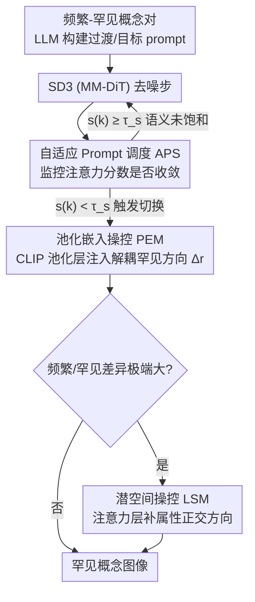

# ADAPT: Attention Driven Adaptive Prompt Scheduling and InTerpolating Orthogonal Complements for Rare Concepts Generation

**会议**: CVPR 2026  
**arXiv**: [2603.19157](https://arxiv.org/abs/2603.19157)  
**代码**: 有 (论文中提到 Code is available)  
**领域**: 扩散模型 / 图像生成  
**关键词**: 稀有概念生成, Prompt调度, 正交投影, 注意力机制, 文本-图像对齐

## 一句话总结

提出 ADAPT 框架，通过注意力驱动的自适应 Prompt 调度（APS）、池化嵌入操控（PEM）和潜空间操控（LSM）三个零样本模块，确定性且语义对齐地控制从通用到罕见概念的生成过渡，在 RareBench 上显著超越 R2F 基线。

## 研究背景与动机

文本到图像扩散模型在生成常见物体方面表现优秀，但面对训练数据中罕见或缺失的组合概念（如"香蕉形状的汽车"、"黑白棋盘鳄鱼"）时，已有属性绑定方法（SynGen、Attend & Excite）仍力不从心。R2F 方法通过 GPT-4o 构建"频繁-罕见"概念对并进行 Prompt 调度来缓解此问题，但存在三个核心缺陷：

**GPT-4o 的随机性导致方差大**：同一 prompt 的视觉细节等级输出不一致，导致调度不稳定

**固定停止点缺乏语义对齐**：线性映射的停止点是启发式的，无法随生成过程中的 token 语义进展自适应

**迭代切换带来的语义不连续**：在罕见和频繁 prompt 之间反复切换文本嵌入，难以提供一致的语义指导

ADAPT 的核心 idea 是：**用注意力分数的收敛行为替代 GPT-4o 的主观评判来决定概念切换时机，同时用正交分解在嵌入空间中解耦罕见语义，提供全程一致的生成引导**。

## 方法详解

### 整体框架

ADAPT 要解决的问题是：在不训练、不微调的前提下，让 Stable Diffusion 3（MM-DiT）稳定生成训练数据里罕见甚至缺失的组合概念。它把这件事拆成三个互补的零样本控制模块，分别管"何时切换""往哪个语义方向引导""差异太大时怎么补"。生成时，APS 在去噪过程中监控注意力分数，判断当前频繁概念是否已经画稳、该接着引入罕见概念；与此同时 PEM 在 CLIP 池化嵌入层持续注入一个解耦出来的罕见语义方向，保证全程引导一致；当频繁与罕见概念差异极端大、嵌入层已经兜不住时，LSM 再深入 Transformer 注意力层补一层属性级的方向修正。三者叠加，把"何时转、转向哪、转不动怎么办"逐层覆盖。

### 关键设计

**1. 自适应 Prompt 调度（APS）：用注意力收敛替代 GPT-4o 来决定何时切到罕见概念**

前身 R2F 靠 GPT-4o 给视觉细节打分、再线性映射出一个固定停止点来决定何时从频繁概念过渡到罕见概念，问题是评分有随机性、停止点又是启发式的，既不稳定也不随生成进程的语义而自适应。APS 改成完全由模型内部信号驱动：它构建两类重建 prompt——逐步过渡的进展 prompt $y_{\text{prog}}$ 和包含全部罕见概念的目标 prompt $y_{\text{tar}}$，在去噪中交替使用，并用转换计数器 $P_{\text{trans}}$ 记录已经完成的概念替换数。每一步对目标 prompt 里每个 token 计算注意力响应分数 $z_i = \max(\mathbf{A}^c_{y_{\text{tar},i}})$，取剩余未转换概念数 $k = m - P_{\text{trans}}$ 对应的 top-k 分数 $s^{(k)}$，当 $s^{(k)} < \tau_s$ 时就触发一次转换。之所以能用这个信号判断切换时机，是因为空间注意力在生成过程中会逐渐收敛，而最难画、最能区分罕见/频繁的那些 token 收敛得最慢——注意力一旦收敛就意味着当前语义特征已经饱和、可以放心引入下一个罕见概念。这样调度既是确定性的，又天然和 token 的语义进展对齐，彻底消除了对 GPT-4o 评分的依赖。

**2. 池化嵌入操控（PEM）：用正交分解抽出罕见特有方向，提供一致解耦的全程引导**

R2F 在罕见和频繁 prompt 之间反复切换文本嵌入，等于不停地换语义指导源，导致引导不连续。PEM 的做法是只保留"罕见相对频繁多出来的那部分语义"：把罕见 prompt 的池化嵌入 $\boldsymbol{c}_{r,\text{pool}}$ 向频繁嵌入 $\boldsymbol{c}_{f,\text{pool}}$ 做正交投影，减掉两者共有的分量，剩下的就是罕见特有方向 $\Delta_r$。

$$\Delta_r = \boldsymbol{c}_{r,\text{pool}} - \frac{\boldsymbol{c}_{f,\text{pool}} \cdot \boldsymbol{c}_{r,\text{pool}}}{\|\boldsymbol{c}_{f,\text{pool}}\|^2} \cdot \boldsymbol{c}_{f,\text{pool}}$$

融合强度不是固定的，而是由罕见与频繁嵌入的余弦相似度 $\gamma$ 经一个 sigmoid $\delta(\gamma) = \frac{s}{1 + e^{-p(\gamma - \epsilon)}}$ 动态调节——两概念越接近、注入越克制，越疏远、注入越强，最终池化嵌入为

$$\boldsymbol{c}_{\text{pool}} = (1 - \lambda_{\text{pool}}) \cdot \boldsymbol{c}_{f,\text{pool}} + \lambda_{\text{pool}} \cdot \delta(\gamma) \cdot \Delta_r$$

因为引导方向从头到尾都是同一个解耦出来的 $\Delta_r$，PEM 提供的语义指导既稳定又干净，避免了切换嵌入带来的语义跳变。

**3. 潜空间操控（LSM）：当概念差异极端大时，深入注意力层补一层属性方向**

有些概念对差异实在太大（如"金属类人形体"对"钢铁小丑"），光在 CLIP 嵌入层做 PEM 已经不足以把属性传递进去。LSM 把修正下沉到 Transformer 注意力层：先用 LLM 抽出属性文本（如 "made of steel"），把它在注意力输出里相对无条件输出的正交分量 $l'_\theta$ 取出来，作为属性特有的方向。

$$l'_\theta(x_t, \boldsymbol{c}_{\text{attr}}, t) = l_\theta(x_t, \boldsymbol{c}_{\text{attr}}, t) - \frac{l_\theta(x_t, \boldsymbol{c}_{\text{attr}}, t) \cdot l_\theta(x_t, \boldsymbol{c}_\phi, t)}{\|l_\theta(x_t, \boldsymbol{c}_\phi, t)\|^2} \cdot l_\theta(x_t, \boldsymbol{c}_\phi, t)$$

再以 $\lambda_{\text{attr}}$ 的强度叠加回主输出：

$$\hat{l}_\theta = l_\theta(x_t, \tilde{\boldsymbol{c}}_t, t) + \lambda_{\text{attr}} \cdot l'_\theta(x_t, \boldsymbol{c}_{\text{attr}}, t)$$

和 PEM 在嵌入层做粗粒度引导不同，LSM 是在特征层注入更细、更具体的属性信号，专门补 PEM 兜不住的极端差异场景。

### 训练策略

ADAPT 是完全 **training-free** 的框架：
- 超参数：$\tau_s = 0.025$，$\lambda_{\text{pool}} = 0.3$，$(s, p, \epsilon) = (2.0, 100, 0.93)$，$\lambda_{\text{attr}} = 0.15$
- 推理步数：$T = 50$，使用固定随机种子 42
- 所有实验在单张 NVIDIA A6000 GPU 上完成

## 实验关键数据

### 主实验

在 RareBench 基准上使用 GPT-4o 评估文本-图像对齐性能：

| 方法 | Property | Shape | Texture | Action | Single Complex | Concat | Relation | Multi Complex | **Avg** |
|------|----------|-------|---------|--------|---------------|--------|----------|--------------|---------|
| SD3.0 | 49.4 | 76.3 | 53.1 | 71.9 | 65.0 | 55.0 | 51.2 | 70.0 | 61.5 |
| FLUX | 58.1 | 71.9 | 47.5 | 52.5 | 60.0 | 55.0 | 48.1 | 70.3 | 57.9 |
| Attend & Excite | 55.0 | 38.8 | 33.8 | 23.1 | 36.9 | 23.1 | 24.4 | 36.3 | 33.9 |
| R2F (SD3) | 89.4 | 79.4 | 81.9 | 80.0 | 72.5 | 70.0 | 58.8 | 73.8 | 75.7 |
| **ADAPT (Ours)** | **96.3** | **88.8** | **83.8** | **81.9** | **79.4** | **76.9** | **75.0** | **82.5** | **83.1** |

ADAPT 在所有类别上均超越 R2F，平均提升 **+7.4%**，其中 Single Shape +9.4，Multi Relation +16.2 提升最为显著。

### 消融实验

各模块的增量贡献（Table 2）：

| 方法 | Property | Shape | Action | Avg |
|------|----------|-------|--------|-----|
| R2F (SD3) | 89.4 | 79.4 | 80.0 | 75.7 |
| + PEM (w/o Adaptive) | 90.0 | 84.4 | 71.9 | 78.4 |
| + PEM | 92.5 | 91.3 | 69.4 | 79.8 |
| + PEM + LSM | 92.5 | 91.3 | 71.9 | 80.4 |
| + PEM + APS | 96.3 | 88.8 | 77.5 | 80.7 |
| + PEM + LSM + APS (Full) | 96.3 | 88.8 | 81.9 | **83.1** |

注意力分数提取策略对比（Table 4）：使用所有 token（不含 SOS）的策略最优（Avg 83.1），表明对全体 token 的注意力监控比仅监控名词或罕见短语更有效。

### 关键发现

- PEM 的自适应权重（基于余弦相似度）比固定权重提升 +1.4%，验证了自适应尺度的必要性
- APS 在 PEM 基础上额外带来约 +1% 的提升，且消除了 GPT-4o 依赖
- LSM 主要在语义差异大的概念对上发挥作用（如 Action/Texture 类别）

## 亮点与洞察

1. **注意力收敛即语义饱和**：发现空间注意力收敛可作为概念生成完成度的指示器，这一洞察具有普遍性
2. **正交投影解耦语义**：在 CLIP 嵌入空间用 Gram-Schmidt 正交化提取罕见特有方向，思路简洁优雅
3. **多层次操控互补**：PEM（嵌入层）+ LSM（特征层）+ APS（时间调度层）三个层面完整覆盖
4. **完全 training-free**：作为即插即用的推理增强方案，实用性强

## 局限与展望

- 依赖 SD3 架构的 MM-DiT 设计，对其他架构（如 UNet-based）的适配未验证
- 仍需 LLM（GPT-4o）进行概念映射和属性提取，只是消除了其在"视觉细节评分"上的依赖
- 超参数（$\tau_s$, $\lambda_{\text{pool}}$, $\lambda_{\text{attr}}$ 等）跨模型/跨任务的鲁棒性未充分讨论
- 计算开销（额外的注意力分数提取和正交投影）未量化

## 相关工作与启发

- **R2F**：本文的直接前身，提出频繁-罕见概念配对+调度的范式
- **Attend & Excite**：利用交叉注意力增强 token 绑定，但不适用于罕见概念
- **SynGen**：改善属性绑定但难以处理极端罕见组合
- **启发**：正交分解在嵌入空间中解耦语义的思路，可推广到其他需要精细概念控制的任务

## 评分

- 新颖性: ⭐⭐⭐⭐ 正交解耦+注意力驱动调度的组合有创新性，但核心idea建立在R2F框架之上
- 实验充分度: ⭐⭐⭐⭐ RareBench单一基准上的全面消融，但缺少其他benchmark和用户研究的主文展示
- 写作质量: ⭐⭐⭐⭐ 动机清晰、方法叙述完整，公式推导清楚
- 价值: ⭐⭐⭐⭐ 对罕见概念生成有实际帮助，training-free特性增强了实用性

<!-- RELATED:START -->

## 相关论文

- [\[CVPR 2026\] Adaptive Auxiliary Prompt Blending for Target-Faithful Diffusion Generation](adaptive_auxiliary_prompt_blending_for_target-faithful_diffusion_generation.md)
- [\[CVPR 2026\] Precise Object and Effect Removal with Adaptive Target-Aware Attention](precise_object_and_effect_removal_with_adaptive_target-aware_attention.md)
- [\[ECCV 2024\] HybridBooth: Hybrid Prompt Inversion for Efficient Subject-Driven Generation](../../ECCV2024/image_generation/hybridbooth_hybrid_prompt_inversion_for_efficient_subject-driven_generation.md)
- [\[CVPR 2026\] OPRO: Orthogonal Panel-Relative Operators for Panel-Aware In-Context Image Generation](opro_orthogonal_panel-relative_operators_for_panel-aware_in-context_image_genera.md)
- [\[CVPR 2026\] MAGIC: Few-Shot Mask-Guided Anomaly Inpainting with Prompt Perturbation, Spatially Adaptive Guidance, and Context Awareness](magic_few-shot_mask-guided_anomaly_inpainting_with_prompt_perturbation_spatially.md)

<!-- RELATED:END -->
