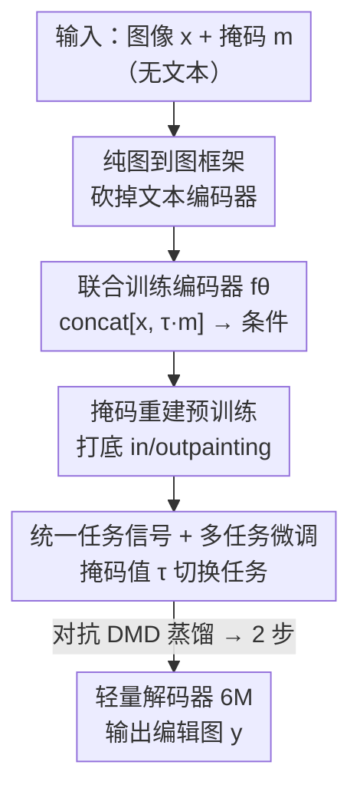

# BlazeEdit: Generalist Image Editing on Mobile Devices with Image-to-Image Diffusion Models

**会议**: CVPR 2026  
**arXiv**: [2605.28067](https://arxiv.org/abs/2605.28067)  
**代码**: 无（截至笔记时未公开）  
**领域**: 扩散模型 / 图像生成 / 端侧高效推理  
**关键词**: 图到图扩散、端侧部署、多任务图像编辑、掩码条件、模型压缩

## 一句话总结
BlazeEdit 发现「很多实用图像编辑任务根本不需要文本引导」，于是彻底砍掉文生图模型里庞大的文本编码器，用一个只有 195M 参数的纯图到图扩散模型把去物体、外扩画、调色、补光、贴纸生成五项任务塞进同一个网络，在 Pixel 10 上 290ms 完成一次推理，实现端侧、隐私安全的通用图像编辑。

## 研究背景与动机
**领域现状**：现代扩散/流模型画质惊人，但代价是动辄数十亿参数（SOTA 多模态 transformer 可达 20B），只能跑在服务器端的高端 GPU/TPU 上。为把它们搬到手机，SnapFusion、SnapGen、MobileDiffusion 等工作把**文生图**去噪器压到 0.5B–1B 参数级别。

**现有痛点**：这些端侧文生图模型「看起来小、其实不小」——真正的体积包袱是文本编码器。比如 SnapGen 的去噪器只有 0.38B，但它叠了 CLIP + Gemma-2-2B 等多个文本编码器，额外吃掉约 2B 参数。对带宽受限的移动 App 来说，这构成了下载门槛；同时把照片上传服务器又有隐私风险。

**核心矛盾**：大家**默认**一个通用移动编辑工具必须建在「文生图基座」之上，可文本编码器的体积/算力开销和「端侧轻量」这个目标天然冲突。

**本文目标**：做一个真正轻、又能干多种实际编辑活的端侧通用编辑器，具体要解决——(1) 没有文本怎么指定任务；(2) 任务数据稀缺时如何高效训练；(3) 怎么在 latent 空间保住结构保真度。

**切入角度**：作者观察到一大类常见编辑动作——抠掉背景物体、改画幅（竖图变方/横图）、把照片变成风格化贴纸——**只靠「输入图 + 用户给的掩码」就足以指明意图**，根本不需要文本条件。

**核心 idea**：用「输入图 + 掩码」代替「文本 prompt」作为条件，构建纯图到图框架，并把掩码值本身复用成任务开关，从而在一个 195M 的紧凑模型里统一五项编辑任务。

## 方法详解

### 整体框架
BlazeEdit 沿用 latent diffusion 范式：输入是 512×512 的图像 $\mathbf{x}$ 和掩码 $\mathbf{m}$，先各自下采样到 64×64 latent，由一个**可训练的图像-掩码编码器** $f_\theta$ 把 $\mathrm{concat}[\mathbf{x},\mathbf{m}]$ 编码成条件信号喂给去噪器 $\epsilon_\theta$；去噪器在 latent 空间迭代去噪（蒸馏后只需 2 步），最后由一个**剪枝过的轻量解码器** $\mathcal{D}$ 还原成输出图像 $\mathbf{y}$。训练上分两段走：先用**掩码重建**在大规模无标注图上预训练打底，再在五个任务数据集上**联合多任务微调 + 对抗蒸馏**。

整套数据流自上而下如下：

### 关键设计

**1. 纯图到图框架：砍掉文本编码器这个隐藏的体积包袱**

端侧文生图模型的体积大头不在去噪器，而在动辄 0.1B–2B 的文本编码器。作者反问：通用移动编辑工具一定要建在文生图基座上吗？他们论证大量实用编辑动作（去物体、改画幅、做贴纸）只要「输入图 + 用户掩码」就能充分表达意图，于是直接删掉所有文本条件组件，去噪器只建模条件分布 $p(\mathcal{E}(\mathbf{y})\mid\mathbf{x},\mathbf{m})$。这样一刀切掉的不只是文本编码器本身，还有为「文本-图像对齐」服务的那部分去噪器容量，使总模型压到 195M——比同类把去噪器压到 0.38B 还要叠 2B 文本编码器的方案小一个量级。

**2. 联合训练的图像-掩码条件编码器：解决 latent 空间结构保真度崩坏**

直接照搬 Palette 这类**像素空间**做法、把「掩码后图像」的 latent $\mathcal{E}(\mathbf{m}\odot\mathbf{x})$ 当条件，在 latent 空间会失效：去噪器很难保住掩码区域周围的结构保真度，尤其是去物体任务——哪怕自编码器本身能完美重建掩码图（$\mathcal{D}(\mathcal{E}(\mathbf{m}\odot\mathbf{x}))\approx\mathbf{m}\odot\mathbf{x}$）也救不了。作者把根因归到 latent 表征的「错位」：冻结的自编码器只为重建优化，其 latent 空间并没有被构造成「把原图内容和叠加的掩码解耦」。

对策是引入一个**二级、可训练**的编码器 $f_\theta(\mathrm{concat}[\mathbf{x},\mathbf{m}])$，它和去噪器**联合优化**，专门去抽取去噪器更好用的「任务相关特征」，而不是像冻结自编码器那样只为重建服务。作者发现这种联合训练对保住细粒度细节和结构完整性至关重要。一个额外好处：去物体时把**完整的** $\mathbf{x}$（而非掩码后的图）喂给 $f_\theta$，模型能更有效地推断并一并抹掉物体投下的阴影

**3. 掩码重建预训练：用无标注图打底，破解任务数据稀缺**

通用编辑器最大的瓶颈是高质量任务数据稀缺。已有两条路都有缺陷：给文生图模型加任务 LoRA（仍背着文本理解/对齐的冗余参数），或从零训图到图但只能覆盖能海量合成数据的少数任务（如上色、JPEG 修复）。作者改走第三条：先在大规模**任务无关**图像上用**掩码重建**从零预训练一个图到图基座，再在所有任务数据上联合微调。

预训练目标借鉴掩码图像建模（MAE/MaskGIT），损失为

$$\mathbb{E}_{\mathbf{x},\mathbf{m},\bm{\epsilon},t}\,\lVert\epsilon_\theta(\tilde{\mathbf{x}}_t,\,f_\theta(\mathrm{concat}[\mathbf{m}\odot\mathbf{x},\mathbf{m}]),\,t)-\bm{\epsilon}\rVert^2$$

其中 $\tilde{\mathbf{x}}_t$ 是 $\mathcal{E}(\mathbf{x})$ 在随机步 $t$ 的加噪版本，掩码 $\mathbf{m}$ 在线随机生成。关键经验是掩码要**多样**——随机块、几何形状、笔触、以及图像边界 padding——这同时教会模型表达性图像表征和核心的 inpainting/outpainting 能力，为下游专门任务打通用底子。注意预训练阶段必须把喂给 $f_\theta$ 的图像也掩码掉（$\mathbf{m}\odot\mathbf{x}$）以防信息泄漏导致退化解，这一步只在预训练需要

**4. 复用掩码值的统一任务信号：零额外参数切换五种功能模式**

多任务联合微调能让知识跨任务迁移，但没有文本时模型怎么知道当前该做去物体还是调色？作者把**掩码值本身**复用成任务指示器：给每个任务 $i$ 分配一个唯一数值常数 $\tau_i$，用它去缩放二值掩码 $\mathbf{m}$，于是同一张掩码图带不同 $\tau_i$ 就表示不同任务。这种「藏在掩码值里」的条件信号让模型不增加任何参数就能动态切换功能模式。任务 $i$ 的微调目标为

$$\mathbb{E}_{\bm{\epsilon},t}\,\lVert\epsilon_\theta(\tilde{\mathbf{y}}_t,\,f_\theta(\mathrm{concat}[\mathbf{x},\,\tau_i\cdot\mathbf{m}]),\,t)-\bm{\epsilon}\rVert^2$$

注意微调时喂给 $f_\theta$ 的是**完整** $\mathbf{x}$（不再掩码），因为此时输出 $\mathbf{y}$ 是任务真值、不存在泄漏问题。微调后再用**对抗式分布匹配蒸馏**（DMD + 对抗训练）把模型蒸成 2 步推理，这是把端侧延迟压到 290ms 的关键

### 损失函数 / 训练策略
两阶段：① 预训练用式(1)的掩码重建 MSE（在线随机掩码、图像侧掩码防泄漏）；② 多任务微调用式(2)的 $\epsilon$-预测 MSE，掩码值由 $\tau_i$ 缩放区分任务。架构上去噪器采用 U-ViT——高分辨率用 ResNet 块保空间归纳偏置并省内存，低分辨率用自注意力捕获长程依赖并提升加速器利用率；解码器在剪枝宽度/深度后冻结编码器 $\mathcal{E}$ 单独训重建，最终只剩 6M 参数且重建质量几乎不降。最后用对抗 DMD 蒸馏到 2 步。

## 实验关键数据

### 主实验
模型体积对比（Table 1）——核心卖点是去噪器减半且完全无文本编码器：

| 模型 | 文本编码器 | 去噪器参数 |
|------|-----------|-----------|
| SnapFusion | CLIP-ViT-H | 848M |
| MobileDiffusion | CLIP-ViT-L | 386M |
| SnapGen | CLIP-ViT-L + CLIP-ViT-G + Gemma-2-2B | 379M |
| **BlazeEdit** | **无** | **189M** |

> 注：摘要/结论给出整模 195M，Table 1 中去噪器为 189M，差额对应编码器 + 6M 轻量解码器。

端侧推理延迟拆解（Table 2，Pixel 10 / Edge TPU）：

| 设备 | 编码器 | 解码器 | 去噪器(2 步) | 总计 |
|------|--------|--------|--------------|------|
| Pixel 10 (Edge TPU) | 45ms | 55ms | 190ms | **290ms** |

### 消融实验
> ⚠️ 原文（v1，疑似短篇/技术报告版）未提供独立的量化消融表格，下列为方法叙述中明确给出的「设计 vs 失败做法」对照，非数值消融。

| 配置 | 现象 | 说明 |
|------|------|------|
| 联合训练编码器 $f_\theta$（完整方案） | 保住结构保真度与细节 | 去物体时能连阴影一起抹掉 |
| 用冻结自编码器的掩码 latent 当条件（Palette 式） | 掩码区域周围结构崩坏 | 即使自编码器能完美重建掩码图也救不了 |
| 预训练掩码多样（块/形状/笔触/边界） | 同时获得 inpaint + outpaint 能力 | 单一掩码无法覆盖外扩画场景 |
| 预训练不掩码 $f_\theta$ 输入 | 退化解（信息泄漏） | 故必须喂 $\mathbf{m}\odot\mathbf{x}$ |

### 关键发现
- **结构保真度的根因在 latent 表征而非自编码器能力**：冻结自编码器能重建掩码图，却给不出「内容与掩码解耦」的好 latent，所以必须上联合训练的二级编码器——这是全文最有洞见的诊断。
- **延迟大头是去噪器**：2 步去噪占 190/290ms，因此「砍步数」（2 步蒸馏）比砍编解码更直接决定交互体验。
- **数据规模悬殊仍能共训**：五任务数据从 ~5K（外扩画）到 ~3M（调色）跨三个数量级，靠掩码重建预训练打底 + 多任务迁移才得以数据高效地一起 finetune。

## 亮点与洞察
- **「不是所有编辑都需要文本」是个被忽视却很值钱的观察**：顺着它砍掉文本编码器，直接把端侧模型从 ~2.4B（含文本编码器）量级拉到 195M，省的是别人没想去省的地方。
- **把掩码值复用成任务开关**：用一个标量 $\tau_i$ 缩放掩码就实现零参数的多任务路由，比加 task embedding / 多 head 都更省、且天然适配纯图条件设置——这个 trick 可迁移到任何「掩码已是必要输入」的多任务密集预测任务。
- **诊断式设计**：先用「自编码器能重建但去噪器仍崩」的反直觉现象定位到 latent 解耦问题，再对症下药引入可训练编码器，方法论上比堆模块更可借鉴。
- **预训练-微调范式迁到图到图扩散**：掩码重建天然同时教 inpaint/outpaint，等于免费拿到去物体和外扩画的雏形能力，降低下游数据需求。

## 局限与展望
- **完全无文本 = 牺牲了语义可控性**：去物体、改画幅靠掩码够用，但「把红车变蓝、把夏天改成冬天」这类需要文本/语义指令的编辑天然不在能力范围内，BlazeEdit 是「掩码可表达任务」的专用通才，而非真正万能编辑器。
- **量化评估偏薄**：v1 主要给体积/延迟数字和定性图，缺与同体量基线在各任务上的 FID/PSNR/用户研究等质量量化对比，「competitive quality」缺硬证据；消融也以叙述为主。
- **任务由 $\tau_i$ 离散指定**：新增任务需重新分配常数并联合微调，扩展性不如可零样本泛化的文本接口。
- **改进方向**：可补一个轻量文本/语义旁路只在需要时激活，兼顾端侧体积与语义可控；并补齐跨任务的量化质量评测。

## 相关工作与启发
- **vs SnapGen / MobileDiffusion / SnapFusion**：它们都在压**文生图**去噪器（0.38–0.85B）却仍背着 0.1–2B 文本编码器；BlazeEdit 换赛道到纯图到图，整模直接降到 195M，本质区别是「压模型」vs「换范式去掉冗余模态」。
- **vs Palette**：同为图到图扩散，但 Palette 在**像素空间**、且把掩码图直接当条件、只覆盖少数易合成数据的任务；BlazeEdit 在 latent 空间、引入可训练条件编码器修结构保真、并加了任务无关预训练阶段，实现快推理 + 数据高效微调 + 五任务统一。
- **vs 通用文生图编辑器（UniVG / OneDiffusion 等）**：它们靠重型多模态 transformer 统一多任务但无法上端侧；BlazeEdit 用「掩码即任务信号」在极小模型里实现多任务统一，是端侧场景下的对位方案。

## 评分
- 新颖性: ⭐⭐⭐⭐ 「砍文本编码器 + 掩码值复用为任务信号」的组合切入角度新颖且实用，单点技术（latent diffusion / DMD 蒸馏）多为已知组合。
- 实验充分度: ⭐⭐⭐ 体积/延迟数字扎实、定性结果丰富，但缺跨任务质量量化对比与数值消融，更像技术报告。
- 写作质量: ⭐⭐⭐⭐ 动机链清晰、对失败做法的诊断式论证（latent 解耦）很有说服力。
- 价值: ⭐⭐⭐⭐ 端侧、隐私安全、290ms 交互的通用编辑器有明确落地价值，掩码即任务信号的 trick 可复用。

<!-- RELATED:START -->

## 相关论文

- [\[CVPR 2026\] Towards Robust Sequential Decomposition for Complex Image Editing](towards_robust_sequential_decomposition_for_complex_image_editing.md)
- [\[CVPR 2026\] CompBench: Benchmarking Complex Instruction-guided Image Editing](compbench_benchmarking_complex_instruction-guided_image_editing.md)
- [\[CVPR 2026\] Editing Away the Evidence: Diffusion-Based Image Manipulation and the Failure Modes of Robust Watermarking](editing_away_the_evidence_diffusion-based_image_manipulation_and_the_failure_mod.md)
- [\[CVPR 2026\] Decoupled Residual Denoising Diffusion Models for Unified and Data Efficient Image-to-Image Translation](decoupled_residual_denoising_diffusion_models_for_unified_and_data_efficient_ima.md)
- [\[CVPR 2026\] EdgeDiT: Hardware-Aware Diffusion Transformers for Efficient On-Device Image Generation](edgedit_hardware-aware_diffusion_transformers_for_efficient_on-device_image_gene.md)

<!-- RELATED:END -->
