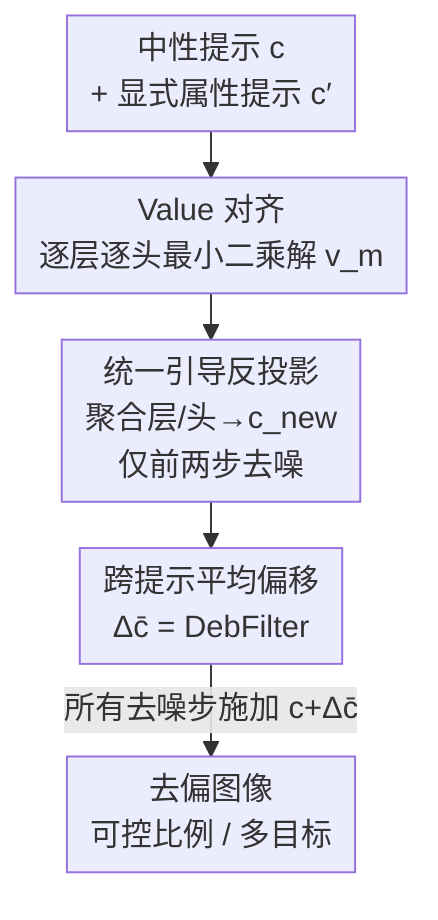

# DebFilter: Eradicating Biases Stashed in Value

**会议**: CVPR 2026  
**arXiv**: [2605.28167](https://arxiv.org/abs/2605.28167)  
**代码**: 无（论文未提供）  
**领域**: 扩散模型 / 图像生成 / 公平性去偏  
**关键词**: 文生图去偏, 交叉注意力, value 修正, 免训练, 推理时干预

## 一句话总结
DebFilter 发现文生图扩散模型的社会偏见主要藏在交叉注意力的 **value** 分量里，于是用最小二乘把"中性提示"的 value 对齐到"显式属性提示"的 value，提炼出一个跨提示通用的固定偏移向量 $\Delta\bar{\mathbf{c}}$，**推理时**直接加到文本 embedding 上即可去偏，无需任何训练或数据，并能按比例可控、支持多目标场景。

## 研究背景与动机
**领域现状**：Stable Diffusion 这类文生图模型在 CLIP 文本 embedding 的引导下做多步去噪生成图像，理论上等价于 score-based 生成模型——文本 embedding $\mathbf{c}$ 决定了 score function 的"地形"，从而决定整条生成轨迹。

**现有痛点**：CLIP 文本 embedding 本身就编码了性别、年龄、职业等社会偏见，再叠加大规模不平衡数据的训练，会让模型把这些偏见内化并放大。结果是即便给"a person who works as a doctor"这种中性提示，模型也会压倒性地生成男性（实测 doctor 约 80% 为男性）。更糟的是 classifier-free guidance 会进一步放大这种偏斜。

**核心矛盾**：现有去偏方法要么改提示词（ENTIGEN）会扭曲语义，要么学属性 token（ITI-GEN）需要大量参考图，要么直接编辑 cross-attention 权重（TIME/UCE）需要为每个属性重新训练/微调、还可能产生波及无关概念的"涟漪效应"。**可控性与语义保真之间始终在拉扯**，而且都离不开训练或额外数据。

**本文目标**：在**不训练、不改权重、不要额外数据**的前提下，于推理时把生成结果的属性分布拉回平衡，同时保住提示语义。

**切入角度**：作者的关键观察是——每一步去噪误差 $\hat{\epsilon}_\theta(z_t,c)$ 可以写成 cross-attention 输出的**线性函数**，而 cross-attention 里 query 来自噪声 latent、key/value 来自文本 $\mathbf{c}$，其中**value 才是真正承载语义引导的分量**。既然偏见藏在 value 里，那只要把有偏 value 推向无偏方向，就能改写 score 地形而不动模型。

**核心 idea**：用"中性提示 value 对齐到显式属性提示 value"的最小二乘解，求出一个**跨提示通用的固定 embedding 偏移 $\Delta\bar{\mathbf{c}}$（即 DebFilter）**，推理时把它加到 $\mathbf{c}$ 上即可去偏。

## 方法详解

### 整体框架
DebFilter 的目标是：让中性提示 $\mathbf{c}$ 的去噪行为去逼近某个"显式属性提示" $c'$（如把"a person"换成"a man/woman"）的去噪行为，但**不改任何权重**，只动输入 embedding。核心关系是构造 $\tilde{c}=c+\Delta c$ 使得 $\mathrm{CA}(z_t,\tilde c)\approx\mathrm{CA}(z_t,c')$，进而 $\hat{\epsilon}_\theta(z_t,\tilde c)\approx\hat{\epsilon}_\theta(z_t,c')$。

整条管线分三步走：先在**单个 cross-attention 头/层**上，用最小二乘把目标 token 的 value 向量对齐到目标提示的 CA 输出；再把所有层/头的 value 估计**反投影回一个统一的 embedding 修正** $\mathbf{c}^{\text{new}}_m$（只在前两步去噪上算，因为粗结构/高层属性此时已定）；最后把"修正量 $\Delta\mathbf{c}_m=\mathbf{c}^{\text{new}}_m-\mathbf{c}_m$"**跨多个提示求平均**，得到一个稳定、与具体提示无关的通用偏移 $\Delta\bar{\mathbf{c}}$。这个偏移就是 DebFilter，离线算一次，推理时对所有去噪步统一施加。

### 关键设计

**1. Value 对齐：偏见藏在 value，就在 value 上做最小二乘修正**

痛点是已有方法去改 cross-attention 权重或微调网络，既贵又会波及无关概念。作者先把去噪预测写成 CA 输出的函数 $\hat{\epsilon}_\theta(z_t,c)=f_\theta(\mathrm{CA}(z_t,c))$，并注意到 CA 输出是 value 的注意力加权和 $\mathrm{CA}^h(i)=\sum_{j=1}^{77}A^h_{i,j}\mathbf{v}^h_j$。于是只需修正目标 token $m$ 对应的 value $\mathbf{v}^h_m$，就能直接纠正注意力结果。具体把目标提示 $c'$ 的 CA 输出当作 target，求解
$$\mathbf{v}_m^{h}=\arg\min_{v}\sum_i\Big(A_{i,m}^{h}\cdot v-\big(\mathrm{CA}_{\text{target}}^{h}-\textstyle\sum_{j\neq m}A_{i,j}^{h}\mathbf{v}_{j}^{h}\big)\Big)^2$$
即固定其他 token 的贡献，只让第 $m$ 个 value 去补齐"source 到 target 的差额 $\Delta\mathrm{CA}$"。由于 $\mathbf{v}^h_m$ 是 $\mathbf{c}$ 的线性投影，这就是一个标准线性回归，闭式可解、不动任何权重——这是它比 TIME/UCE 那种改权重方法更"局部、无副作用"的根本原因

**2. 统一引导反投影：把分散在各层/头的 value 修正还原成一个 embedding**

上一步是逐层逐头独立解出的一堆 $\hat{\mathbf{v}}^{l,h}_m$，但真正能在推理时复用的是文本 embedding $\mathbf{c}_m$ 本身，而非散落各处的 value。作者利用 $\hat{\mathbf{v}}^{l,h}_m=W_v^{l,h}\mathbf{c}_m$ 这层线性关系，用一次加权最小二乘把所有层/头的 value 目标**联合反投影**回一个统一的去偏 embedding：
$$\mathbf{c}^{\text{new}}_m=\arg\min_{c}\sum_{l,h,i}\big\|W_v^{l,h}\mathbf{c}-\hat{\mathbf{v}}_m^{\,l,h}\big\|_2^2$$
这样得到的 $\mathbf{c}^{\text{new}}_m$ 再经各层投影 $W_v^{l,h}\mathbf{c}^{\text{new}}_m$ 就能同时逼近所有层/头的目标 value。关键工程取舍是：只在**前两步去噪**上计算并平均 $\mathbf{c}^{\text{new}}_m$——因为早期去噪决定图像的粗结构与高层属性（性别/年龄就在这一层面），后期只是纹理风格细化，纳进来反而引入噪声

**3. DebFilter 偏移：跨提示平均出一个通用去偏方向，且符号可翻转、可多目标**

逐提示算 $\mathbf{c}^{\text{new}}_m$ 不可扩展——每次推理都要配一个参考目标，且单提示导出的偏移对参考文本极度敏感、泛化差。作者改为存下偏移 $\Delta\mathbf{c}_m=\mathbf{c}^{\text{new}}_m-\mathbf{c}_m$ 并**跨多个提示求期望**：
$$\Delta\bar{\mathbf{c}}=\mathbb{E}_{p\in\mathcal{P}}[\Delta\mathbf{c}^p_m]$$
作者发现不同职业（如 doctor 与 firefighter）的去偏 value 偏移 $\Delta\mathbf{v}^{\text{debias}}$ 之间余弦相似度很高，说明这个变换在"职业概念"上语义一致，平均后能得到一个稳定、与具体提示无关的通用方向，这就是 DebFilter。它有两个实用性质：其一，**符号可翻转**——男→女的偏移取负号即可当女→男滤波器用，无需单独存反方向；其二，**支持多目标**——对"a doctor and a nurse"，把男→女偏移加到 doctor 的 token 索引、把反向偏移加到 nurse 的 token 索引，即可在保持版面/背景一致的前提下分别调两个对象。性别偏见用 CEO/firefighter/driver 三个职业平均（LPIPS 最低、最稳），年龄偏见因为"老"的偏移在各提示间几乎一致，单提示即可

### 损失函数 / 训练策略
**无训练**。全部计算是两次最小二乘（线性回归）的闭式求解：先逐层/头解 value（式 6），再联合反投影解统一 embedding（式 7），最后跨提示取平均（式 8）。所有干预只发生在推理时，对 SD v2.1 直接施加；与之对照的去偏比例可通过缩放偏移精确预设（如想把 80.85% 男性降到目标比例，直接控制施加强度）。

## 实验关键数据

基线为 Stable Diffusion v2.1（Skew 对比用 SDXL 以与近期工作对齐）。性别去偏在 WinoBias + DALL-Eval 选出的 87 个职业上评测，每个职业生成 120 张图，用 CLIP(ViT-B/32) few-shot 分类性别。偏见指标 $\Delta_p=\frac{|F_p-50|}{50}$（$F_p$ 为女性占比，越接近 0 越平衡）。

### 主实验

按职业的偏见降幅（节选自 Table 2，$\Delta_{org}$→$\Delta_{deb}$ 越低越好，TS 为 Transition Score）：

| 职业 | $\Delta_{org}\downarrow$ | $\Delta_{deb}\downarrow$ | TS |
|------|------|------|------|
| mechanic | 1.000 | 0.050 | 0.48 |
| electrician | 0.983 | 0.033 | 0.48 |
| engineer | 0.883 | 0.050 | 0.49 |
| scientist | 0.783 | 0.067 | 0.40 |
| doctor | 0.617 | 0.250 | 0.53 |
| nurse（女主导） | 0.950 | 0.050 | 0.45 |
| translator（女主导） | 0.883 | 0.067 | 0.28 |
| makeup artist（女主导） | 1.000 | 0.383 | 0.30 |

绝大多数职业的偏见从接近 1.0（几乎全为单一性别）降到 0.03–0.07，逼近完全平衡。

Skew 指标（$\downarrow$，理想值 50）对比各去偏方法（Table 3）：

| 方法 | Base | DeAR | CLIP-clip | P-Deb | SFID | **DebFilter** |
|------|------|------|-----------|-------|------|------|
| Skew | 83.25 | 99.88 | 82.05 | 82.77 | 81.57 | **62.10** |

多数方法只能小幅改善甚至倒退（DeAR 反而恶化到 99.88），DebFilter 把 Skew 显著拉到 62.10。在按职业的 $\Delta$ 对比上也优于 TIME / UCE / MIST。

### 消融实验

| 配置 | 关键指标 | 说明 |
|------|---------|------|
| 平均 1 个提示 | 泛化差 | 偏移对参考文本极敏感 |
| 平均 3 个职业（CEO/firefighter/driver） | LPIPS 最低 | 最稳、失真最小，最终采用 |
| 平均 2–6 个职业 | LPIPS 略升 | 过多/过少都不如 3 个 |
| 仅前两步去噪估计 | — | 捕捉主导语义偏见、避开后期纹理细化 |

语义保真度用 CLIPScore 衡量（Table 2c），去偏后均值 28.76 ≥ 原始 28.65，说明对齐质量不降反略升：

| 提示类型 | Vanilla | DebFilter |
|---------|---------|-----------|
| Mean CLIPScore | 28.65 | 28.76 |

### 关键发现
- **偏见确实主要藏在 value**：只修正 value 分量就能扭转性别分布，且 CLIPScore 不掉，验证了"value 承载语义引导"这一核心假设。
- **去偏比例可精确预设**：以 doctor 为例，$\Delta_{org}=0.617$ 约对应 80.85% 男性，按 50% 去偏比例理论 TS = $(80.85\times0.5)/80.85=0.5$，实测 0.53，吻合——这意味着 DebFilter 不是"一刀切全改"，而是能定量控制改多少。
- **偏移方向可向量化复用**：男→女偏移取负号即可做女→男，省一半存储，体现 embedding 空间里这种偏见是近似线性可逆的方向。
- **失败/弱化案例**：hairdresser（女主导）$\Delta$ 反而从 0.317 升到 0.417，makeup artist 仅从 1.000 降到 0.383，说明对某些强刻板印象职业去偏不充分；doctor 残留 0.250 也偏高。

## 亮点与洞察
- **把"偏见在哪"定位到 value 分量**：不同于多数方法笼统改 embedding 或改注意力权重，本文从"误差预测是 CA 输出的线性函数 + CA 是 value 加权和"两步推理，精准锁定 value，干预面最小、副作用最小——这个定位本身就是最大的"啊哈"。
- **用线性回归代替微调**：value 是 embedding 的线性投影，因此整套"对齐 target"变成闭式最小二乘，零训练、零数据，几乎即插即用，工程成本极低。
- **偏移当向量来玩**：跨提示平均得稳定方向、取负号得反方向、按 token 索引分配得多目标控制——把去偏问题彻底转化成 embedding 空间的向量代数，思路可迁移到风格/概念编辑等其他"属性方向"任务。
- **可控比例**：能预先指定要改多少比例样本（TS≈目标比例），这在实际产品里比"强行 50:50"更实用。

## 局限与展望
- **去偏不彻底**：hairdresser 去偏后反而更偏、makeup artist 残留 0.383，对强刻板印象职业效果有限；Skew 62.10 距理想 50 仍有差距。
- **依赖外部分类器评测**：性别/年龄分布全靠 CLIP few-shot 判定，CLIP 自身的性别判别误差会传导进指标，二元性别假设也忽略了非二元身份。
- **目标提示需人工指定**：每个偏见概念要选好显式属性提示（man/woman、old/young）和参考职业集，换概念（如族裔、文化）要重新构造，作者把扩展到 ethnicity 列为 future work。
- **年龄/语义自然度的副作用**：作者也承认年龄去偏后"职业/社会角色与年龄会显得别扭"（如老 barista），虽然背景能保持。
- **改进思路**：把"选参考提示 + 选职业集"自动化；用更可靠的属性评估器替代 CLLIP few-shot；研究多概念偏移叠加时的相互干扰。

## 相关工作与启发
- **vs TIME / UCE**：它们直接编辑 cross-attention 权重做概念编辑，需为每个属性微调、易产生波及无关概念的涟漪效应；DebFilter 只在推理时改 value 对应的 embedding 偏移，零训练且作用局部，多职业同时控制也更稳。
- **vs MIST**：MIST 借 `<eos>` padding token 做局部 cross-attention 更新；本文直接针对**提示词本身的 embedding**（而非 padding），定位更直接。
- **vs ENTIGEN / ITI-GEN**：前者靠改提示词、会扭曲语义，后者学属性 token、需大量参考图；DebFilter 不改提示、不需参考图集，且 CLIPScore 不降。
- **vs SFID / CLIP-clip / DeAR**：这些是 VLM 表示层去偏（剪维度/对抗训练/特征注入），依赖精选去偏数据且易损语义；DebFilter 直接在生成端的 CA value 上干预，Skew 从 ~82 降到 62.1 明显更强。

## 评分
- 新颖性: ⭐⭐⭐⭐⭐ 把社会偏见精准定位到 cross-attention 的 value 分量，并用线性回归免训练修正，视角新颖且可解释
- 实验充分度: ⭐⭐⭐⭐ 性别/年龄/多目标三类场景 + Δ/Skew/TS/CLIPScore 四指标，较完整；但部分关键对比图（Fig.3/5）和相似度分析放在补充材料，主表覆盖职业有限
- 写作质量: ⭐⭐⭐⭐ 推导清晰、动机环环相扣；公式较密，框架图依赖补充材料中的结构细节
- 价值: ⭐⭐⭐⭐ 免训练、可控比例、可多目标，实用性强，是文生图公平性里低成本可落地的一条路径

<!-- RELATED:START -->

## 相关论文

- [\[CVPR 2026\] Bias at the End of the Score: Demographic Biases in Reward Models for T2I](bias_reward_models_t2i.md)
- [\[CVPR 2026\] AutoDebias: An Automated Framework for Detecting and Mitigating Backdoor Biases in Text-to-Image Models](autodebias_automated_framework_for_debiasing_text-to-image_models.md)
- [\[NeurIPS 2025\] Value Gradient Guidance for Flow Matching Alignment](../../NeurIPS2025/image_generation/value_gradient_guidance_for_flow_matching_alignment.md)
- [\[CVPR 2025\] Precise, Fast, and Low-cost Concept Erasure in Value Space: Orthogonal Complement Matters](../../CVPR2025/image_generation/precise_fast_and_low-cost_concept_erasure_in_value_space_orthogonal_complement_m.md)
- [\[ICML 2025\] When Diffusion Models Memorize: Inductive Biases in Probability Flow of Minimum-Norm Shallow Neural Nets](../../ICML2025/image_generation/when_diffusion_models_memorize_inductive_biases_in_probability_flow_of_minimum-n.md)

<!-- RELATED:END -->
