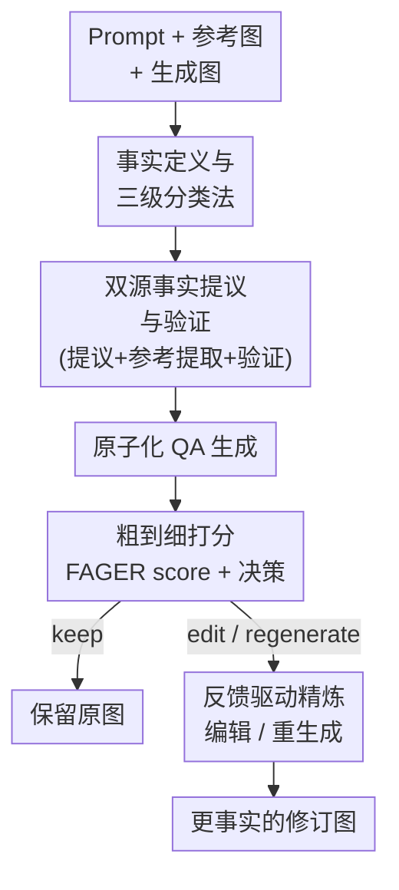

# FAGER: Factually Grounded Evaluation and Refinement of Text-to-Image Models

**会议**: CVPR 2026  
**arXiv**: [2605.19111](https://arxiv.org/abs/2605.19111)  
**代码**: https://github.com/SGT-LIM/FAGER (有)  
**领域**: 扩散模型 / 文本生成图像 / 评测  
**关键词**: T2I 评测、事实性、agentic pipeline、训练无关精炼、参考图引导

## 一句话总结
FAGER 用一条多智能体流水线，先把 prompt 里"显式说出来 + 隐式暗含"的可视事实拆成一份分层 rubric，再转成原子化 QA 让 VLM 逐题打分，得到一个事实性分数 FAGER score，并据此对生成图做 keep/edit/regenerate 的训练无关精炼；在跨科学、历史、商品、文化的五个数据集上，它判定"真实参考图比生成图更事实"的准确率全面超过 VQAScore / FineGRAIN，并能把弱生成模型 FLUX1-dev 的事实性大幅拉高。

## 研究背景与动机
**领域现状**：当前 T2I 评测主流是把 prompt 拆成语义单元、生成 QA、再用 VQA 模型在图上验证（TIFA、VQ²、VQAScore、FineGRAIN 等），核心衡量的是"图有没有对上 prompt 里**写出来**的实体、数量、空间关系"。

**现有痛点**：很多事实**不在 prompt 字面里**。用户写"a molecule of ethanol"，不会写"两个碳、一个氧、六个氢、特定排布"；写"the Statue of Liberty in 1890"，不会写"那时还是铜棕色而非现在的绿锈"。这些隐式的、外部知识锚定的、身份定义性的事实，现有 prompt-aligned 指标根本测不到——论文 Fig.1 里 VQAScore 甚至给不事实的乙醇图更高分。

**核心矛盾**：要测事实性，就得引入 prompt 之外的世界知识；但又不能把"约定俗成的画法"误当事实（如"氧原子画成红色""氢原子标注 H"只是惯例，不是事实）。如何在"补足隐式事实"和"不把惯例当事实"之间划清边界，是关键难题；而且事实还是 prompt 依赖的（"三只狗"vs"三只法斗"要求不同）。

**本文目标**：(1) 形式化定义 T2I 里"什么算事实"；(2) 造一个能测隐式/身份定义性事实的指标；(3) 让这个指标不只打分，还能反过来指导生成图变得更事实。

**切入角度**：人看图是"先抓全局结构、再看细节"的粗到细过程，于是把事实组织成三个层级；同时用"prompt 当锚 + 参考图当视觉证据"双源交叉，既补全又过滤。

**核心 idea**：把"评测"重构成"先构建一份经过验证的分层事实 rubric、再转成原子 QA 逐题验证"，并复用同一套评测输出作为编辑/重生成的反馈信号，全程训练无关。

## 方法详解

### 整体框架
FAGER 的输入是一个 prompt + 一张参考图 + 一张待评生成图，输出是一个事实性分数（FAGER score）、一个动作决策（keep/edit/regenerate）和一段可执行的文字反馈，并据此产出更事实的修订图。整条流水线由多个分工明确的 LLM/VLM 智能体串成：prompt 一路先被"提议 + 参考提取 + 验证"三个 agent 转成一份可视事实 rubric，rubric 再被 QA agent 拆成原子问题，评测 agent 拿这些问题去拷问生成图给出分数与反馈，最后反馈驱动一次编辑或重生成。

### 关键设计

**1. 事实定义与三级分类法：先回答"T2I 里什么才算事实"**

现有指标失效的根因，是从没界定清楚"事实"——把"约定画法"和"真正可核验的属性"混为一谈。FAGER 给出可操作定义：事实是"能从视觉证据客观核验、必要时辅以 prompt 锚定的可靠来源所支撑的信息"；据此把"水分子有两氢一氧、弯曲结构"算事实，把"氧画成红色"排除在外。在此定义上，它仿照人类"先全局后细节"的感知，把事实分三层——Level 1 物体身份与场景识别（是不是自由女神/整体场景对不对）、Level 2 关键部件验证（铜色外观、右臂举火炬、左手持碑等身份支撑属性）、Level 3 细粒度细节（皇冠七个尖、碑上刻"JULY IV MDCCLXXVI"）；同时给每条事实打上九个语义类别之一（存在/计数/关系/形状/尺寸/颜色/姿态/场景/其他）。这套分层不只是组织方式，后面打分时直接被用作"粗到细早退"的依据，是整个框架的骨架

**2. 双源事实提议与验证：用"先验知识 + 参考图视觉证据"交叉构建可视 rubric**

光靠 LLM 先验提事实有两个洞——某些事实不在模型知识里，某些视觉属性文本说不清。FAGER 因此让两个 agent 并行打底：事实提议 agent（LLM，GPT-5.4-mini）从 prompt 出发，保留显式信息并补出 prompt 锚定、可视核验的隐式事实，按三层九类结构化输出；参考引导事实提取 agent（VLM，Qwen3-VL-8B）则**只看参考图**、只抽直接可见的颜色/形状/布局/特征部件，对商品、历史物件、官方设计、文化概念这类"外观即身份"的 prompt 尤其有用。两源汇到验证 agent：它以 prompt 为"该有什么"的真值锚、以参考视觉元素为"长什么样"的证据，逐条判断每个事实是否必要、可视核验、与 prompt 相关，缺的身份定义性事实补进来、不必要/不可核验/纯惯例的剔出去，最终产出一份带显式 add/drop 决策（因此可解释）的验证后 rubric。这一步正是把"补全隐式事实"和"剔除惯例噪声"这对矛盾落地的地方

**3. 原子化 QA 生成：让每题尽量独立，避免身份不确定性把错误传染开**

rubric 转成 QA 时有个隐患：若问题都绑死在同一个物体身份上，评测器一旦拿不准"这是不是苹果"，"苹果在桌上吗"这种下游问题会被连带判错，即使"是否存在苹果"早已单独评过。FAGER 的 QA agent 把每条事实映射成**恰好一个原子 QA**，且正确图的预期答案恒为"yes"，问题要求简短、具体、可视回答；关键是刻意降低对物体身份的依赖——评"关系"时问"主体物在桌上吗"而非"苹果在桌上吗"，从而把同一目标保留下来、又切断不必要的错误传播链。QA 还保留来源事实的 level 与 category 元数据，供后续反馈与解释复用

**4. 粗到细打分与反馈驱动精炼：一个分数 + keep/edit/regenerate 决策闭环**

评测 agent 拿生成图逐题作答，只能回 yes/no/unknown 并附一句基于可见证据的理由，且**只许看图、不许用外部知识**；遮挡/模糊/太小/视角导致看不出的，必须答 unknown。打分上 yes=1、no=0、unknown=0.5，对所有题取平均即 FAGER score。打分遵循同一套粗到细顺序：先只评 Level 1，若 Level 1 分低于重生成阈值（论文固定 20），判定连核心物体/场景都没抓住，直接 regenerate、不再评 Level 2/3；否则继续评完聚合总分，总分超过保留阈值（固定 95）则 keep，否则 edit。决策还配文字反馈：regenerate 给一条追加到原 prompt 的重生成约束（如"the Statue of Liberty in an outdoor harbor setting"），edit 给只针对事实改动的编辑指令（如"change the statue color to copper-brown"），keep 不给。精炼阶段据此走 keep/edit/regenerate 之一，且与评测器解耦——可换不同生成/编辑模型（论文用 FLUX1-dev 重生成、Qwen-Edit 或 FLUX.1-Kontext 编辑），本文只做单轮精炼

> 评测器把 Factual A/B test 定义为：对每个 prompt 比较真实参考图与生成图的分数，只要 $s(I_{\text{factual}}) \ge s(I_{\text{generated}})$ 就算判对（平局也算对，因为生成图也可能恰好满足事实）。这套协议只看相对排序、不依赖绝对刻度，因此能公平比较不同量纲的指标。

## 实验关键数据

### 主实验

Factual A/B test 上的成对准确率（越高越好，括号为样本对数）：

| 指标 | I-HallA-Science (99) | I-HallA-History (99) | ABO (50) | Culture (30) | T2I-FactualBench-SKCM (100) |
|------|------|------|------|------|------|
| VQAScore | 0.37 | 0.53 | 0.38 | 0.47 | 0.37 |
| FineGRAIN | 0.56 | 0.72 | 0.68 | 0.83 | 0.76 |
| **FAGER (Ours)** | **0.73** | **0.83** | **0.82** | **0.97** | **0.87** |

FAGER 在全部五个数据集上都最优，Culture 上更是高到 0.97。VQAScore 接近随机甚至更差（多处 < 0.5），FineGRAIN 较强但全面落后于 FAGER。

FAGER 引导精炼对 FLUX1-dev 的提升（数值为 FAGER 打分，越高越好）：

| 模型 | Science (99) | History (99) | ABO (50) | Culture (30) | SKCM (100) |
|------|------|------|------|------|------|
| FLUX1-dev | 66.99 | 74.58 | 62.16 | 60.19 | 60.19 |
| Stable Diffusion 3.5 Large | 51.32 | 68.89 | 65.20 | 66.75 | 67.17 |
| FLUX2-dev | 63.16 | 76.92 | 85.17 | 83.36 | 82.81 |
| Nano Banana Pro | **90.83** | **87.76** | 82.26 | 86.53 | **88.93** |
| FLUX1-dev + FAGER (Qwen-Edit) | 76.36 | 79.44 | 85.74 | 87.97 | 79.09 |
| FLUX1-dev + FAGER (Kontext) | 74.32 | 81.20 | **88.23** | **89.40** | 79.92 |

FAGER 把一个弱基座（FLUX1-dev）在 ABO 上从 62.16 拉到 88.23、Culture 上从 60.19 拉到 89.40，无需任何额外训练就能在这两个数据集上反超最强生成器 Nano Banana Pro。

### 消融 / 辅助分析

| 配置 / 对照 | 关键指标 | 说明 |
|------|---------|------|
| 人类一致性 (ABO) | FAGER 80.0% vs FineGRAIN 40.0% | 10 对样本、5 名标注者，FAGER 与人判更一致 |
| 人类一致性 (Culture) | FAGER 90.0% vs FineGRAIN 80.0% | 同上 |
| CLIPScore ↑ | FLUX1-dev 30.92 → +FAGER(Kontext) 30.78 | 精炼基本不损 prompt 对齐 |
| LPIPS ↓ | FLUX1-dev 0.7407 → +FAGER(Kontext) 0.7372 | 感知相似度略改善、不退化 |

### 关键发现
- **事实性提升不以画质为代价**：精炼后 CLIPScore（30.92→30.78）几乎持平、LPIPS（0.7407→0.7372）略降，说明改的是事实而非整体内容。
- **粗到细早退是省算力的关键机制**：Level 1 不过直接 regenerate，不再浪费在 Level 2/3 评测上；阈值（regen=20、keep=95）全数据集固定、不做域内调参。
- **精炼增益高度依赖数据集类型**：外观即身份的 ABO/Culture 提升最猛（+26、+29），而科学/历史这类需要深域知识的提升相对温和，且最强商用模型 Nano Banana Pro 在 Science/History/SKCM 仍领先——说明"靠编辑修事实"对结构性化学/历史事实更难。

## 亮点与洞察
- **把"什么是事实"这件被长期忽略的事形式化**：用 Cambridge 定义 + "可视核验"约束，把惯例画法（红氧原子）从事实里剔出去，这个边界定义本身就是贡献，比再多一个指标更基础。
- **双源交叉是补全与去噪的巧妙折中**：LLM 先验负责"该有什么"、参考图负责"长什么样"，验证 agent 用 add/drop 把两者对齐——既补隐式事实又不把惯例当真，而且决策可解释。
- **原子化、去身份依赖的提问值得迁移**：把"苹果在桌上吗"改成"主体物在桌上吗"以切断错误传播，这个"降低题间依赖"的技巧可直接搬到任何 VQA 式评测中。
- **评测与精炼共用一套输出形成闭环**：同一份逐题反馈既是分数也是编辑/重生成指令，让"评测器"顺手变成"训练无关的改图器"，且与生成/编辑模型解耦可任意替换。

## 局限与展望
- **作者承认的局限**：整条流水线建在多个 LLM/VLM 之上，上游幻觉或识别错误会传导到结果；虽用双源交叉、验证剔除、允许 unknown 来缓解，但对组件级失败的鲁棒性仍是公认短板。
- **阈值是固定经验值**：regen=20、keep=95 全程不调，作者也承认阈值标定是未来方向；不同域/容错需求下最优阈值未必相同。
- **只做单轮精炼**：流水线本可迭代多轮，论文只跑一轮，多轮收益与收敛性未验证。
- **自评指标的循环风险**（自评 ⚠️）：用 FAGER 同时当"被精炼模型的优化信号"和"精炼后的评测指标"，Table 2 的提升存在指标自利偏置；Factual A/B test 与小规模人评是缓解，但样本（每集 10 对）偏小。

## 相关工作与启发
- **vs VQAScore**：VQAScore 把整条 prompt 压成一个 yes/no 问题、用 VQA 模型答"Yes"的概率当分；FAGER 把 prompt 拆成分层、多题、含隐式事实的原子 QA。区别在于前者只测 prompt 字面对齐，A/B test 上多处接近随机（0.37），FAGER 凭隐式事实建模全面领先。
- **vs FineGRAIN**：FineGRAIN 用 27 个细粒度失败类别做结构化评测，但仍以 prompt 显式内容为主、且分数方向相反（越低越事实）；FAGER 用参考图引导补出 prompt 之外的身份定义性事实，A/B test 与人类一致性都更高（ABO 80% vs 40%）。
- **vs T2I-FactualBench**：它较早用参考图评 prompt 未明说的方面，但没区分"事实"与"常识期望/惯例画法"；FAGER 的事实定义与验证 agent 正是补上这层区分，使指标更适合严格的事实性评测。

## 评分
- 新颖性: ⭐⭐⭐⭐⭐ 首次形式化定义 T2I 的"事实"并落成可评可改的分层 agentic 流水线
- 实验充分度: ⭐⭐⭐⭐ 五数据集、A/B test、人评、画质辅助指标齐全，但消融偏轻、单轮精炼、阈值未扫
- 写作质量: ⭐⭐⭐⭐⭐ 动机—定义—方法—验证链条清晰，Fig.1/2/3 把抽象概念讲透
- 价值: ⭐⭐⭐⭐⭐ 训练无关、可换底座、评测即精炼，对事实性 T2I 评测与改进都有直接落地价值

<!-- RELATED:START -->

## 相关论文

- [\[CVPR 2026\] RAISE: Requirement-Adaptive Evolutionary Refinement for Training-Free Text-to-Image Alignment](raise_requirement-adaptive_evolutionary_refinement_for_training-free_text-to-ima.md)
- [\[CVPR 2026\] Can Nano Banana 2 Replace Traditional Image Restoration Models? An Evaluation of Its Performance on Image Restoration Tasks](can_nano_banana_2_replace_traditional_image_restoration_models_an_evaluation_of_.md)
- [\[CVPR 2026\] PhysGen: Physically Grounded 3D Shape Generation for Industrial Design](physgen_physically_grounded_3d_shape_generation_for_industrial_design.md)
- [\[NeurIPS 2025\] OVERT: A Benchmark for Over-Refusal Evaluation on Text-to-Image Models](../../NeurIPS2025/image_generation/overt_a_benchmark_for_over-refusal_evaluation_on_text-to-image_models.md)
- [\[CVPR 2026\] From Navigation to Refinement: Revealing the Two-Stage Nature of Flow-based Diffusion Models through Oracle Velocity](from_navigation_to_refinement_revealing_the_two-stage_nature_of_flow-based_diffu.md)

<!-- RELATED:END -->
