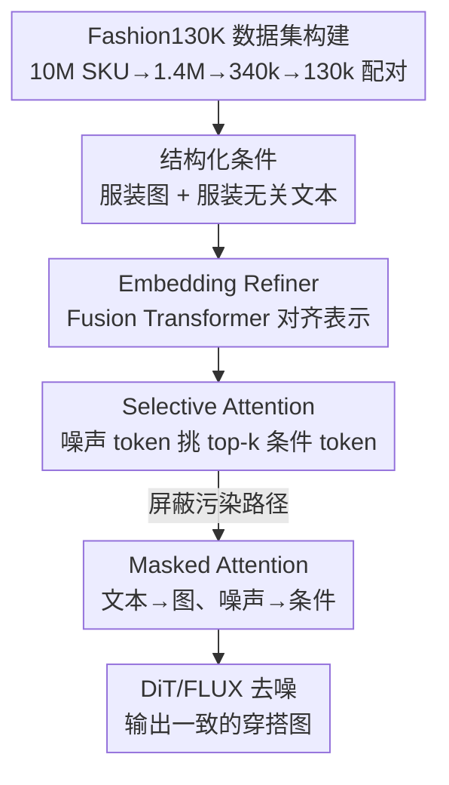

# Fashion130K: An E-commerce Fashion Dataset for Outfit Generation with Unified Multi-modal Condition

**会议**: CVPR 2026  
**arXiv**: [2605.10127](https://arxiv.org/abs/2605.10127)  
**代码**: 待确认（论文称将开源数据集，未给出链接）  
**领域**: 图像生成 / 时尚穿搭生成 / 多模态条件扩散  
**关键词**: 时尚穿搭生成、电商数据集、多模态对齐、Selective Attention、DiT/FLUX

## 一句话总结
这篇论文一手放出了 13 万对「服装图 + 上身模特图 + 结构化文本」的电商数据集 Fashion130K，一手提出 UMC 框架——用 Fusion Transformer 把文本和服装图的 embedding 对齐成统一表示、再用 top-$k$ 的 Selective Attention 让噪声 token 只挑最相关的条件 token，从而在保持服装细节一致性的穿搭生成上刷到 SOTA。

## 研究背景与动机
**领域现状**：时尚穿搭生成（fashion outfit generation）这两年主要靠扩散模型，把参考服装图的视觉特征和文本 caption 一起塞进 attention 模块，以提升「生成模特身上的衣服和参考服装一致」这件事。代表路线是 DiT/MM-DiT（SD3、FLUX）加各类条件注入（IP-Adapter、虚拟试穿等）。

**现有痛点**：作者指出两个卡点。其一是**数据**——VITON-HD、DressCode 这类常用 benchmark 背景是影棚白底、分辨率固定、模特只有站姿全身、且几乎不含手表/眼镜/首饰这类配饰，离真实电商场景太远；其二是**多模态条件的用法**——文本和图像走两个独立预训练编码器，二者之间存在「模态鸿沟」（modality gap），现有做法要么忽略对齐，要么粗暴地最小化两个模态的距离度量，反而把视觉信息里那些「说不清楚」的细节（衣服的纹理、logo、版型）给抹平了。

**核心矛盾**：服装的视觉细节本质上无法被文本精确描述，所以「强行把图像 embedding 拉向文本 embedding」会损伤模态各自的内在信息；但完全不对齐，两个模态又难以协同地指导去噪。对齐与保真之间存在张力。

**本文目标**：(1) 造一个贴近真实电商、覆盖细粒度品类和多分辨率的数据集；(2) 设计一个既能对齐文本/图像表示、又不破坏各自内在属性的多模态条件框架。

**切入角度**：作者主张文本提示应当**只描述与服装无关的内容**（场景、模特画像、交互），服装外观一律交给参考服装图来定——这样从源头消除文本歧义；再在表示层用「分而后合」的结构对齐两个模态，在整合层用「按相关性筛选 token」的注意力强化条件一致性。

**核心 idea**：用「结构化的服装无关文本 + 参考服装图」作为干净的多模态条件，配合 Fusion Transformer 对齐表示、top-$k$ Selective Attention 强化关联，实现服装细节高保真一致的穿搭生成。

## 方法详解

### 整体框架
UMC（Unified Multi-modal Condition）建立在 FLUX.1-dev（DiT + Flow Matching）之上，输入是「参考服装图 + 结构化文本提示 + 噪声 latent」，输出是模特穿着该服装、置于指定场景下的图像。整条管线先把文本和图像两路条件 embedding 送进 **Embedding Refiner**，对齐成统一的多模态条件表示；再在 DiT block 里用 **Selective Attention** 让每个噪声 token 只与最相关的少数条件 token 交互；同时用 **Masked Attention** 在两个阶段屏蔽掉会污染锚定信息的注意力路径。整个数据-模型闭环的起点是 **Fashion130K 数据集构建**，它决定了模型能学到多真实、多细粒度的穿搭分布。

Flow Matching 的训练目标是：latent 在时刻 $t$ 定义为 $z_t = t\,z_0 + (1-t)\,\epsilon$（$z_0$ 是干净样本，$\epsilon\sim\mathcal{N}(0,I)$），模型学习速度场 $v_\theta(z_t,t)$ 去逼近 $z_0-\epsilon$，损失为 $\mathcal{L}_{FM}=\mathbb{E}_{t,z_0,\epsilon}\big[\|v_\theta(z_t,t)-(z_0-\epsilon)\|_2^2\big]$。

### 关键设计

**1. Fashion130K 数据集构建：用电商真实图源造出最大的开源穿搭数据集**

现有 benchmark 的「影棚白底 + 站姿全身 + 无配饰」让模型学不到真实电商场景，这是本文要补的第一个洞。作者从电商平台商品图库按品类分布采样 **10M 候选 SKU**，先用预训练图像特征去重、再用自研 OCR / 贴纸检测 / 美学评分模型剔除带大量文字或贴纸的低质图，筛到 **1.4M** 高潜力 SKU；接着把每个 SKU 的图分成「带人/不带人」两类，用定制的图像匹配模型配出最匹配的「模特-服装」对，再经**人工标注**服装外观一致性，得到 **340k** 对；最后为平衡品类与背景场景分布，采样出 **130,386** 对最终入库。数据集覆盖 9 个一级品类、203 个二级品类，含手表/眼镜/手袋/首饰等以往缺席的配饰，并提供 $1024\times768$、$1536\times1024$、$1024\times1024$ 等多分辨率/多宽高比样本以支持后训练。它在「细粒度品类 / 场景丰富 / 多宽高比 / 结构化 caption」四个维度上同时打勾，是表 1 中唯一四项全✓的数据集

**2. 结构化的服装无关文本提示：让文本只管场景、服装只管图**

如果文本里也去描述衣服，文本的不精确描述就会和参考服装图打架，污染服装细节。作者刻意设计 **garment-agnostic** 的结构化提示：每条 prompt 由背景场景、模特画像、物体交互等多段描述拼成，**故意省略服装细节**，从而保证「模特身上衣服的外观完全来自参考服装图」。这把多模态条件拆成职责清晰的两路——文本定上下文、图像定外观——从源头降低文本歧义，给后续生成喂进更干净的信息。论文也实验对比了 plain text 与 structured text，证明结构化提示更优

**3. Embedding Refiner（Fusion Transformer）：分而后合地对齐模态，又不抹平各自细节**

直接最小化两个模态的空间距离会得到「任意对齐」，把视觉里说不清的细节也对没了——这是模态鸿沟的核心难点。Embedding Refiner 的思路是「在 latent 空间做可学习的特征平移来对齐、用 masked 多模态注意力来保住模态属性」。作者比较了多种结构：MLP+LayerNorm（仅归一化平移）、Joint Transformer（中间插注意力但直接拼接两模态，会退化表示）、Parallel Transformer（完全分开处理），最终选用 **Fusion Transformer**——先用**独立分支**分别处理文本/图像、保留各自模态特有信息，再经**共享的 attention + MLP** 把分离表示合并成统一 embedding。注意力里还对「文本→图像」（key-to-query）做 **Masked Self Attention**，避免文本提示反向污染视觉提示，让服装视觉细节纯粹来自图像。这种「divide-and-merge + 掩码」既重新分配了多模态表示、又不牺牲关键的模态信息，验证集 loss 和 DINO score 都优于其余变体

**4. Selective Attention（top-$k$）：噪声 token 只挑最相关的条件 token，拒绝信息污染**

普通注意力让每个 query 沿所有 key 算相似度，会把不相关的条件 token 也混进来，稀释对服装细节的精准指导。Selective Attention 把噪声 token 当 query（$Q=Z$）、统一条件 embedding 当 key/value（$K=V=C$），算相似度矩阵 $S=QK^\top$ 后用带筛选的 softmax：

$$selective\_attention(Q,K,V)=sel\_softmax\Big(\frac{QK^\top}{\sqrt{d}\,\tau}\Big)V$$

其中 $d$ 是特征维度、$\tau$ 是温度（默认 $\tau=1$）。作者比较了 top-$k$、top-$p$、top-$pk$ 及带温度的变体，发现 top-$p$ 系列常常召回不相关 token，最终采用 **top-$k$（$k=8$）**：每个噪声 token 只关注 8 个最相关的条件 token，恰好在相关性与多样性之间取得平衡。此外在 FLUX 注意力里对「噪声→条件」（key-to-query）做 **Masked Attention**，因为条件 embedding 应当作为不可被噪声反向修改的锚定信息——两处掩码分别提升了表示阶段与整合阶段中条件 embedding 的可靠性

### 损失函数 / 训练策略
以 FLUX.1-dev 为预训练模型，用 LoRA（rank=128）微调，沿用 Flow Matching 损失 $\mathcal{L}_{FM}$。训练分两阶段：第一阶段冻结其余模块、**只训 Embedding Refiner 10k 步**；第二阶段联合训练 Embedding Refiner、Redux 与 FLUX LoRA 额外 30k 步。全局 batch size 64，Adam，学习率 $10^{-5}$。按宽高比做多分辨率分桶（1:1 / 3:4 / 2:3），在 32 张昇腾 910B NPU 上训练。

## 实验关键数据

### 主实验
测试集为 Fashion130K 的 3000 对 garment-model 样本（另在 VITON-HD 上验证泛化）。指标：LPIPS↓（感知距离）、DINO↑（DINOv2 特征余弦相似，衡量视觉一致性）、FFA↑（object-intrinsic 对齐相似度）、CLIP-T↑（图文对齐）。

| 方法 | 类型 | LPIPS↓ | DINO↑ | FFA↑ | CLIP-T↑ |
|--------|------|------|------|------|------|
| DreamO | Subject-Driven | 0.657 | 0.628 | 0.765 | 0.332 |
| FLUX.1 Kontext Dev | 图像编辑 | 0.646 | 0.620 | 0.763 | 0.326 |
| Qwen Image Edit (20B) | 图像编辑 | 0.634 | 0.673 | 0.805 | 0.326 |
| Any2AnyTryon | 穿搭生成 | 0.658 | 0.551 | 0.664 | 0.331 |
| **UMC（本文）** | 穿搭生成 | **0.623** | **0.677** | **0.818** | 0.332 |

UMC 在 Fashion130K 上四项指标里拿下 LPIPS / DINO / FFA 三项最佳：相比最强 subject-driven 基线 LPIPS 降 0.033、DINO 升 0.049；对比最强图像编辑 Qwen Image Edit，LPIPS（0.623 vs 0.634）与 FFA（0.818 vs 0.805）均更优。在 VITON-HD 上，仅用 Fashion130K 训练即有不俗泛化（LPIPS 0.515 / FFA 0.680 / DINO 0.812），继续在 VITON-HD 训练集微调后进一步到 0.476 / 0.727 / 0.835，说明该数据集是有效的后训练基底。

### 消融实验
各模块逐步叠加（MA: Masked Attention，SA: Selective Attention，ER: Embedding Refiner），Fashion130K 上：

| 配置 | DINO↑ | FFA↑ | CLIP-T↑ | 说明 |
|------|------|------|---------|------|
| baseline | 0.624 | 0.713 | 0.320 | 无任何提出模块 |
| + MA | 0.638 | 0.749 | 0.320 | 仅掩码注意力 |
| + SA | 0.654 | 0.786 | 0.321 | 仅 top-$k$ 选择注意力 |
| + ER | 0.661 | 0.793 | 0.323 | 仅嵌入精炼器（贡献最显著） |
| + ER + SA | 0.674 | 0.812 | 0.331 | 二者协同明显增益 |
| **UMC（ER+SA+MA）** | **0.677** | **0.818** | **0.332** | 完整模型 |

top-$k$ 中 $k$ 的影响（表 3）：无 ER 时 $k=8$ 最优（DINO 0.654 / FFA 0.786），$k=4$ 选得太少、$k=16/32$ 引入冗余 token 反而干扰；加 ER 后仍是 $k=8$ 最佳（DINO 0.674 / FFA 0.812）。

### 关键发现
- **ER 是最大功臣**：单加 ER 就把 DINO 从 0.624 抬到 0.661、FFA 从 0.713 抬到 0.793，验证了「对齐多模态表示」对一致性的核心作用。
- **三模块有协同**：ER+SA 相比单模块继续提升，最终三者齐上达到最优，说明对齐表示与按相关性筛 token 是互补的。
- **$k$ 不是越大越好**：8 个条件 token 恰好平衡相关性与多样性，过大引入噪声 token 反降点——印证了 Selective Attention「少而精」的设计直觉。

## 亮点与洞察
- **「文本管场景、图像管外观」的职责切分很干净**：通过故意写 garment-agnostic 的结构化 caption，从数据源头消除文本对服装细节的污染，这比在模型里费力对齐更釜底抽薪，且天然适配各种参考服装图。
- **对齐不等于拉近距离**：作者反对粗暴最小化模态距离，转而用 Fusion Transformer「先分支保模态内在信息、再共享分支合并」，这个「分而后合 + masked attention」的表示对齐范式可迁移到任何「图说不清、文本说不全」的多模态条件生成任务。
- **Selective Attention 的 top-$k$ 思想可复用**：把「噪声 token 只挑 8 个最相关条件 token」当成一种条件去噪的稀疏化先验，在身份保持、虚拟试穿、subject-driven 生成里都可能压住无关 token 的干扰。
- **数据集本身是硬贡献**：13 万对、9 一级/203 二级品类、含配饰、多分辨率、结构化 caption，填补了真实电商穿搭生成的数据空白，并被证明是有效的后训练基底。

## 局限与展望
- **依赖大规模闭源管线**：10M→1.4M→340k→130k 的筛选链条用到自研 OCR、贴纸检测、美学评分、图像匹配模型与人工标注，复现门槛高；论文未给出公开代码与数据下载链接（⚠️ 以最终开源为准）。
- **CLIP-T 未夺冠**：UMC 在图文对齐（CLIP-T 0.332）上并非最佳，这与「文本刻意不描述服装」的设计取向一致——更偏向服装一致性而非图文语义贴合，适用场景有偏。
- **横向比较有 caveat**：表 2 各方法参数量从 0.9B 到 20B 不等、训练数据各异，DINO/FFA 这类基于特征相似度的指标也受所选骨干影响，绝对数值不宜直接当作能力高下的唯一依据。
- **改进方向**：可探索把结构化文本进一步拆解为可控属性（姿态、光照、场景）以增强可编辑性；或将 Selective Attention 的 $k$ 做成随去噪步/token 自适应，而非全程固定 $k=8$。

## 相关工作与启发
- **vs Qwen Image Edit / FLUX.1 Kontext（图像编辑路线）**：它们靠通用图像编辑能力迁移到穿搭，但定性结果常把分体裙塌缩成连衣裙、或出现颜色/版型漂移；UMC 用专门的条件对齐 + 选择注意力，在服装类型、纹理、配饰摆放上更忠实，LPIPS/FFA 更优。
- **vs Magic Clothing / Any2AnyTryon（穿搭生成路线）**：同属穿搭/试穿方向，但未显式解决模态鸿沟与条件 token 污染；UMC 在该类方法中全指标领先。
- **vs OmniControl / UNO / DreamO（subject-driven）**：这类方法强在主体一致性，但面对「图说不清的服装细节 + 场景文本」的混合条件时细节易失真；UMC 通过 Fusion Transformer 显式融合并保留模态内在信息而占优。
- **vs DressCode / VITON-HD（数据集）**：前者细粒度但站姿白底、缺场景与配饰；Fashion130K 在场景丰富度、品类覆盖（含配饰）、多分辨率与结构化 caption 上全面扩展，是更贴近真实电商的基底。

## 评分
- 新颖性: ⭐⭐⭐⭐ 数据集 + 「分而后合对齐 + top-$k$ 选择注意力」的组合实用且有针对性，单点创新不算颠覆但切中痛点
- 实验充分度: ⭐⭐⭐⭐ 多类基线、双数据集、模块/超参消融齐全；CLIP-T 未最佳也如实给出
- 写作质量: ⭐⭐⭐⭐ 动机—数据—方法—实验逻辑清晰，图表支撑到位
- 价值: ⭐⭐⭐⭐⭐ 最大开源电商穿搭数据集 + 可迁移的多模态条件对齐范式，对工业界穿搭生成实用价值高

<!-- RELATED:START -->

## 相关论文

- [\[CVPR 2026\] InnoAds-Composer: Efficient Condition Composition for E-Commerce Poster Generation](innoads-composer_efficient_condition_composition_for_e-commerce_poster_generatio.md)
- [\[CVPR 2026\] Garments2Look: A Multi-Reference Dataset for High-Fidelity Outfit-Level Virtual Try-On with Clothing and Accessories](garments2look_a_multi-reference_dataset_for_high-fidelity_outfit-level_virtual_t.md)
- [\[CVPR 2026\] PhotoFramer: Multi-modal Image Composition Instruction](photoframer_multi-modal_image_composition_instruction.md)
- [\[ICLR 2026\] Unified Multi-Modal Interactive & Reactive 3D Motion Generation via Rectified Flow](../../ICLR2026/image_generation/unified_multi-modal_interactive_reactive_3d_motion_generation_via_rectified_flow.md)
- [\[CVPR 2026\] MICON-Bench: Benchmarking and Enhancing Multi-Image Context Image Generation in Unified Multimodal Models](micon-bench_benchmarking_and_enhancing_multi-image_context_image_generation_in_u.md)

<!-- RELATED:END -->
