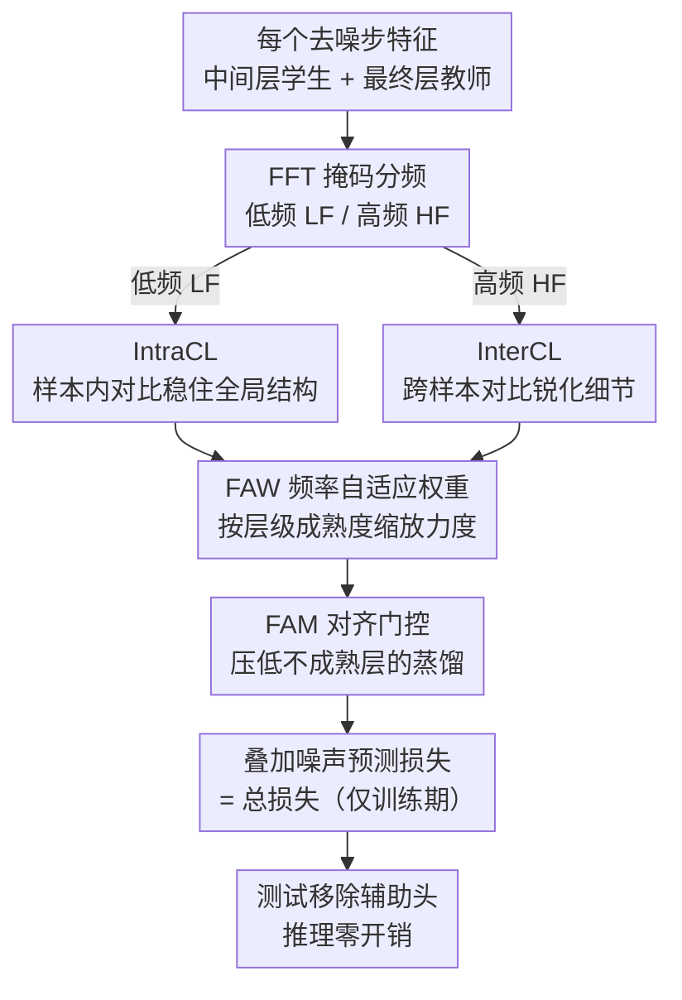

# FRAMER: Frequency-Aligned Self-Distillation with Adaptive Modulation Leveraging Diffusion Priors for Real-World Image Super-Resolution

**会议**: CVPR 2026  
**arXiv**: [2512.01390](https://arxiv.org/abs/2512.01390)  
**代码**: [https://cmlab-korea.github.io/FRAMER/](https://cmlab-korea.github.io/FRAMER/)  
**领域**: 扩散模型 / 图像生成  
**关键词**: 真实图像超分辨率, 自蒸馏, 频率感知, 扩散先验, 即插即用

## 一句话总结
FRAMER 提出频率对齐的自蒸馏训练框架，通过将最终层特征图作为教师监督中间层，并按低频/高频分别施加 IntraCL 和 InterCL 对比损失，配合自适应权重调节(FAW)和对齐门控(FAM)，在不改变网络结构和推理流程的情况下，显著提升扩散模型在真实图像超分辨率任务的高频细节恢复能力。

## 研究背景与动机

1. **领域现状**：真实图像超分辨率(Real-ISR)旨在从含混合未知退化的低分辨率图像恢复高分辨率图像。扩散模型已超越GAN成为主流方案，利用预训练T2I模型(如SD2的U-Net、SD3的DiT)的丰富先验是有前景的方向。
2. **现有痛点**：扩散模型在重建精细高频(HF)细节时表现不佳，容易产生过度平滑的结果。标准噪声预测损失对所有层和频率施加同一监督，忽略了模型内部的频率层级特性。
3. **核心矛盾**：作者追溯到一个根本性的低频(LF)偏置——来自两个特性：(a) 自然图像频率分布本身LF占主导，在LR输入中更严重，噪声预测损失偏向LF以降低整体损失；(b) 网络深度方向存在"低频优先、高频延后"的层级结构——LF特征在早期层即稳定，HF特征仅在最终层附近才收敛。
4. **本文目标** 如何在不改变推理架构的前提下，让训练过程中对LF和HF施加有针对性的监督，纠正LF偏置？
5. **切入角度**：自蒸馏——将最终层特征图作为教师、中间层作为学生。与外部频域损失相比，师生在同一特征空间中避免了域不匹配问题。
6. **核心 idea**：按频率分解自蒸馏信号，对LF施加样本内对比学习稳定结构，对HF施加跨样本对比学习锐化细节，并用自适应机制匹配模型内部频率层级。

## 方法详解

### 整体框架
FRAMER 想解决的是扩散超分模型"高频细节恢复不足"这个老问题，但它不动网络结构、也不动推理流程，而是只在训练阶段加一项辅助监督。它的做法可以这样理解：在每个去噪步，把网络最终层的特征图当作"教师"（这里高频已经收敛得最充分），让所有中间层"学生"向它对齐。关键在于对齐不是整张特征图一刀切地做——师生特征先经 FFT 掩码分成低频(LF)和高频(HF)两个频带，再分别走两套不同的对比损失：LF 用样本内对比 IntraCL 稳住全局结构，HF 用跨样本对比 InterCL 把实例特有的细节磨锐。最后由 FAW 和 FAM 两个自适应机制，按每层每频带的实际成熟度去缩放蒸馏强度。所有辅助头在测试时整体移除，推理零开销。

### 关键设计

**1. IntraCL（低频样本内对比）：稳住跨样本共享的全局结构，不被假阴性带偏**

直接对所有层、所有频率用同一个噪声预测损失，会让模型偏向占主导的低频、把高频留到最后才学。IntraCL 先把低频这一半接管过来：对每个中间层 $i$，取它的 LF 表示 $\mathbf{F}_{LF}^{(i)}$ 与教师 LF 表示 $\mathbf{F}_{LF}^{(n)}$ 的余弦相似度作正样本对，再随机抽另一层 $j$ 的 LF 表示作负样本对，套 log-softmax：

$$\mathcal{L}_{IntraCL}^{(i)} = -\log \frac{\exp(s_{+,LF}^{(i)})}{\exp(s_{+,LF}^{(i)}) + \exp(s_{-,LF}^{(i)})}$$

这里刻意只用"同一张图、不同层"作负样本，而不引入批内其他图像。原因是低频特征承载的是全局共享结构，不同样本之间本来就高度相似，若把别的图像当负样本去推远，等于把真正相似的东西硬当成负例——也就是假阴性。靠层间差异做样本内对比，已经足够把学生层往教师层收敛。

**2. InterCL（高频跨样本对比）：给收敛最慢的高频一个定向锐化信号**

高频这一半的情况正好相反，需要的是把实例特有的细节区分开。InterCL 拉近学生 HF 表示与教师 HF 表示，同时推远两类负样本：一是同一张图随机层的 HF 表示，逼着层与层之间形成递进；二是批内其他图像的 HF 表示，鼓励实例判别：

$$\mathcal{L}_{InterCL}^{(i)} = -\log \frac{\exp(s_{+,HF}^{(i)})}{\exp(s_{+,HF}^{(i)}) + \exp(s_{-,HF}^{(i)}) + S_{neg}^{(i)}}$$

之所以这里敢用批内负样本，是因为高频承载实例特异的细节，跨样本相似度本来就低，别的图像的高频是信息丰富的"真阴性"，推远它们能直接对抗前面说的低频偏置，为收敛最慢的高频分量补上一条定向优化路径。

**3. FAW（频率自适应权重）：按"低频先收敛、高频后收敛"的层级分配蒸馏力度**

前面观察到网络深度方向存在"低频优先、高频延后"的层级结构——低频在早期层就稳定，高频要到接近最终层才成熟。如果对每层每频带一视同仁地施加蒸馏，就会给已经收敛的低频层灌冗余梯度、又给还没成熟的高频层喂不够信号。FAW 据此动态调权：先算每层 LF/HF 的 FFT 幅度均值 $E_{LF}^{(i)}$、$E_{HF}^{(i)}$，再算它们与最终层的相对差异 $\Delta^{(i)}$，权重取逆差异 $w^{(i)} = 1/(1+\Delta^{(i)})$。与教师差异越小的频带权重越高，于是早期层自然把更多力度压在低频、把高频权重留到深层，正好对上模型内部的频率成熟节奏。

**4. FAM（频率对齐门控）：拦住还不成熟的早期层，避免被硬对齐而崩溃**

FAW 解决了"哪个频带该使多大劲"，但还留了一个风险：早期层本身离教师太远，强行让它向教师对齐反而会把它带崩。FAM 再加一道闸——用学生-教师的对齐分数（经 ReLU 截断并 stop-gradient，门控本身不回传梯度）去缩放该层的蒸馏强度：当某个早期层与教师差得太远、对齐分数低时，自动把它的蒸馏信号压下去，等它逐渐成熟再放开。于是 FAW 管"哪个频带该使多大劲"、FAM 管"这一层现在配不配被对齐"，两者合起来正是论文标题里的"自适应调制(Adaptive Modulation)"。

### 损失函数 / 训练策略
最终训练目标在原噪声预测损失上叠加 FRAMER 辅助项：$\mathcal{L}_{total} = \mathcal{L}_{noise} + \sum_i \mathcal{L}_{FRAMER}^{(i)}$，其中每层的 FRAMER 项是经 FAW 和 FAM 门控后的 IntraCL + InterCL 加权和。所有辅助头只在训练期存在，测试时全部移除，因此对推理不增加任何开销。

## 实验关键数据

### 主实验

| 数据集 | 指标 | FRAMER_U (Ours) | PiSA-SR (基线) | 提升 | FRAMER_D (Ours) | DiT4SR (基线) | 提升 |
|--------|------|-----------------|----------------|------|-----------------|---------------|------|
| DrealSR | PSNR↑ | 26.96 | 26.18 | +3.0% | 24.73 | 23.64 | +4.6% |
| DrealSR | SSIM↑ | 0.786 | 0.752 | +4.5% | 0.687 | 0.640 | +7.3% |
| DrealSR | LPIPS↓ | 0.333 | 0.368 | +9.5% | 0.412 | 0.442 | +6.8% |
| DrealSR | MANIQA↑ | 0.595 | 0.490 | +21.4% | 0.514 | 0.441 | +16.6% |
| RealSR | PSNR↑ | 24.81 | 24.02 | +3.3% | 23.23 | 21.94 | +5.9% |
| RealSR | MANIQA↑ | 0.484 | 0.412 | +17.5% | 0.564 | 0.459 | +22.9% |

### 消融实验
论文中消融验证了最终层教师和随机层负样本的有效性(详细数据在补充材料中)。核心发现：

| 配置 | 效果说明 |
|------|---------|
| 仅噪声预测损失(基线) | LF偏置严重，HF恢复不足 |
| + IntraCL | LF稳定性提升，结构更一致 |
| + InterCL | HF细节显著锐化 |
| + FAW | 层级感知权重分配，整体均衡提升 |
| + FAM | 防止早期层崩溃，训练更稳定 |

### 关键发现
- FRAMER在感知指标(MANIQA、MUSIQ)上提升最为显著，DrealSR上MANIQA提升21.4%，证实HF恢复能力大幅增强
- 跨U-Net和DiT两种架构均有效，验证了架构无关性
- 在更具挑战性的RealLR200和RealLQ250数据集上优势更明显
- 训练开销极小(仅增加辅助损失计算)，推理完全无开销

## 亮点与洞察
- **频率层级发现的深入性**：论文不仅指出LF偏置问题，还通过层级余弦相似度分析揭示了"低频优先、高频延后"的现象，为分频自蒸馏提供了有力的实验依据
- **LF/HF对比学习的差异化设计**：LF用样本内对比(避免假阴性)，HF用跨样本对比(利用真阴性)，这种基于特征跨样本相似度分析的差异化设计非常精巧
- **即插即用的实用价值**：不改变架构、不增加推理开销，可直接应用于任意扩散backbone的SR训练，实用性极强

## 局限与展望
- 频率分解使用固定的FFT二值掩码划分LF/HF，可能不是最优划分方式，可探索可学习的频率分割
- U-Net中需要额外1x1卷积和resize操作对齐特征维度，增加了集成复杂性
- 论文未探索在其他低级视觉任务(去噪、去模糊)上的效果
- FAW/FAM引入的超参数(如epsilon)可能需要针对不同backbone微调
- LF/HF二分法可能过于粗糙，三频或连续频率分解可能获得更好效果
- 消融实验的详细数据放在补充材料中，主文缺乏具体的组件增量数据

## 相关工作与启发
- **vs SeeSR**: SeeSR等方法对所有层和频率施加统一的噪声预测损失，未利用内部频率层级；FRAMER通过分频自蒸馏直接弥补此缺陷
- **vs 频率感知扩散方法**: 现有频率感知方法(FreeU等)依赖固定的推理时调制；FRAMER在训练阶段根据各层实际状态自适应调节监督
- **vs 自蒸馏方法**: 传统自蒸馏对齐整个特征图，隐式继承LF偏置；FRAMER通过频率分离显式对抗LF偏置

## 评分
- 新颖性: ⭐⭐⭐⭐ 频率对齐自蒸馏的框架设计新颖，但单个技术组件(对比学习、自适应权重)较为标准
- 实验充分度: ⭐⭐⭐⭐⭐ 四个数据集、六个指标、跨U-Net/DiT架构、详尽的消融分析
- 写作质量: ⭐⭐⭐⭐ 动机推导清晰，从观察到方法的逻辑链完整，图表直观
- 价值: ⭐⭐⭐⭐ 即插即用的训练策略具有广泛适用性，可直接提升现有SR方法

<!-- RELATED:START -->

## 相关论文

- [\[CVPR 2026\] OARS: Process-Aware Online Alignment for Generative Real-World Image Super-Resolution](oars_process-aware_online_alignment_for_generative_real-world_image_super-resolu.md)
- [\[AAAI 2026\] Realism Control One-step Diffusion for Real-World Image Super-Resolution](../../AAAI2026/image_generation/realism_control_one-step_diffusion_for_real-world_image_super-resolution.md)
- [\[CVPR 2026\] DUO-VSR: Dual-Stream Distillation for One-Step Video Super-Resolution](duo-vsr_dual-stream_distillation_for_one-step_video_super-resolution.md)
- [\[ICML 2026\] Q-DiT4SR: Exploration of Detail-Preserving Diffusion Transformer Quantization for Real-World Image Super-Resolution](../../ICML2026/image_generation/q-dit4sr_exploration_of_detail-preserving_diffusion_transformer_quantization_for.md)
- [\[CVPR 2025\] Self-Supervised ControlNet with Spatio-Temporal Mamba for Real-World Video Super-Resolution](../../CVPR2025/image_generation/self-supervised_controlnet_with_spatio-temporal_mamba_for_real-world_video_super.md)

<!-- RELATED:END -->
