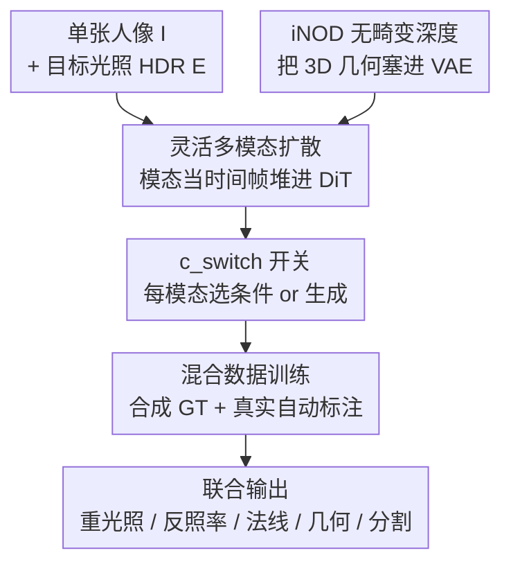

# GeoRelight: Learning Joint Geometrical Relighting and Reconstruction with Flexible Multi-Modal Diffusion Transformers

**会议**: CVPR2026  
**arXiv**: [2604.20715](https://arxiv.org/abs/2604.20715)  
**代码**: 项目页 https://yuxuan-xue.com/georelight  
**领域**: 图像生成 / 重光照 / 多模态扩散 / 单图 3D 重建  
**关键词**: 人像重光照, 多模态 DiT, 联合几何重建, iNOD 深度表征, 混合数据训练

## 一句话总结
GeoRelight 把"人像重光照"和"3D 几何重建"塞进同一个多模态扩散 Transformer 里**联合去噪**——用一个 VAE 友好的无畸变深度表征 iNOD 让 3D 几何能进潜空间、再用合成+自动标注真实数据的混合训练弥合 sim-to-real gap，单图就能同时拿到照片级重光照、内在反照率、法线和高保真 3D 形状，且在重光照、几何、内在估计三项上全面超过各自的专用 SOTA。

## 研究背景与动机
**领域现状**：从单张人像照片改变光照（relighting）是图形学与视觉的核心任务，应用从创意修图、计算摄影到 VR、影视后期。但它是高度病态的——一张 2D 图把 3D 几何、内在外观（如反照率）、场景光照三个因素纠缠在一起投影到像素上，要真实改光就必须显式或隐式地把它们解耦。

**现有痛点**：现有学习方法分两类，各有硬伤。一类是端到端的 "translator" 模型（如 NeuralGaffer、IC-Light），直接学像素到像素映射，**没有几何建模**，所以投不出和人体 3D 形状一致的真实阴影与高光，物理合理性差。另一类更常见的是**串行流水线**（Total Relighting、DiffusionRenderer 等）：先估反照率、法线等中间 buffer，再交给单独的神经渲染模块合成最终图。它的致命缺陷是**误差累积**——几何估计阶段的任何偏差都会被烙进 buffer，下游渲染器无法纠正。

**核心矛盾**：重光照需要准确几何来生成局部 shading 和正确的投射阴影；反过来，图像里的 shading 又提供了强力的 shape-from-shading 线索能反过来修正几何。也就是说**重光照和几何重建本是互利的，却被现有方法拆成了串行的两步**。即便是近期联合去噪的 UniRelight，其联合估计也只到反照率，缺了对 3D 几何的显式建模。

**本文目标**：用一个统一的生成框架同时解出重光照图、内在反照率、法线、3D 几何，让信息在两个任务间双向流动。

**切入角度**：用 Diffusion Transformer 的密集自注意力让多种模态并行交换信息；但要把 3D 几何塞进基于预训练 2D VAE 的潜扩散，标准表征（点图、归一化深度）会被 VAE 压坏或各向异性畸变，必须先发明一个 VAE 友好的几何表征。

**核心 idea**：把"模态当成视频的时间帧"堆进一个多模态 DiT 联合去噪，配上无畸变的 iNOD 深度表征 + 一个用 `c_switch` 开关灵活切换"条件/生成"的混合数据训练策略。

## 方法详解

### 整体框架
GeoRelight 在一个预训练的 Video Latent DiT 上构建。给定单张未知光照下的人像 $\mathbf{I}$，模型要联合去噪**五个目标模态**的潜变量：内在反照率 $\mathbf{z}^{\mathbf{a}}$、分割掩码 $\mathbf{z}^{\mathbf{s}}$、表面法线 $\mathbf{z}^{\mathbf{n}}$、几何形状 $\mathbf{z}^{\mathbf{g}}$、最终重光照图 $\mathbf{z}^{\mathbf{I}_\mathbf{E}}$。整体由两类条件引导：全局图像条件 $\mathbf{z}^{\mathbf{I}}$（拼到所有五个模态上，保证主体身份/形状/纹理信息在每一步都在场）和光照条件 $\mathbf{z}^{\mathbf{E}}$（只拼到重光照图模态上）。要让这套机器跑起来必须解三个技术难题：怎样让一个架构同时生成并条件于多个模态（Flexible Multi-Modal Diffusion）、怎样把 3D 几何无畸变地塞进 VAE 潜空间（iNOD）、怎样在真实图没有几何 GT 时还能学到照片级真实感（混合数据训练）。

### 关键设计

**1. 灵活多模态扩散：把"模态"伪装成视频的"时间帧"**

痛点是单个 DiT 怎么同时吃下图像、反照率、法线、几何、分割这些异构模态。作者借鉴 UniRelight 做了个简单但有效的改装：原视频 DiT 去噪的潜变量是 $\mathbf{z}\in\mathbb{R}^{T\times H\times W\times C}$（$T$ 是时间），他们把**时间维 $T$ 直接重新解释成模态维 $M$**，于是五个模态像视频的五帧一样被并行堆进 DiT，密集自注意力天然让所有模态彼此交换信息。为了让模型知道每一"帧"是什么模态，加一个可学习的模态类型嵌入 $\mathbf{c}_{\text{modal}}\in\mathbb{R}^{M\times C_{\text{type}}}$ 广播后按通道拼上去；又因为不同模态的同一像素 $(x,y)$ 必须在注意力里对齐，他们把原来的时间 3D RoPE 换成所有模态共享的 **2D 空间 RoPE**，让模态自身的"位置"不可区分、只保留空间位置。这是把多任务做成"一次前向、信息全流通"的基础

**2. c_switch 模态开关：一个二值掩码统一"条件"与"生成"**

如果每种"哪些模态当输入、哪些当目标"的组合都要单独训一个模型，灵活性就没了。关键设计是模态开关掩码 $\mathbf{c}_{\text{switch}}\in\mathbb{R}^{H\times W\times 1}$，拼到每个模态上：取 1 表示这是一个"干净"的输入条件（模型据此条件），取 0 表示这是一个待生成的"含噪"目标。这一个二值开关就把同一套权重变成可任意配置的——推理时既能从纯噪声生成全部模态，也能把任意几个模态设为干净条件去引导其余模态生成。它也是后面混合数据训练能针对不同数据源切换任务的核心使能件

**3. iNOD：各向同性正交深度，让 3D 几何"VAE 友好"且无畸变**

这是论文最硬的技术贡献，针对的痛点是 3D 几何进不了潜扩散：标准 3-DoF 点图经 VAE 有损压缩后变得极其噪杂；传统深度图要归一化到 $[-1,1]$，而沿光轴 z 做 per-image 归一化（如 Marigold）会**各向异性地扭曲 3D 形状**，且没有相机内参就无法还原 3D。iNOD 的做法很直接：拿到合成数据的 metric 深度和内参后先反投影成 metric 点云，然后做**各向同性 3D 归一化**——不是只缩 z 轴，而是按最长边把整个 3D 几何缩进 $[-1,1]$ 包围盒，丢掉绝对尺度但保住相对几何与长宽比；再把归一化后的形状沿 XY 平面**正交投影**、直接取每点 z 值，得到天然落在 $[-1,1]$、像素对齐的 2D 深度图。这样它是 1-DoF 的 VAE 友好图像，消除了点图编码的噪声；更关键的是因为归一化各向同性，**一次简单的正交反投影就能无畸变还原 3D 形状，推理时完全不需要相机内参**——这是相对标准深度图的根本优势。VAE 压缩会在边界因最近邻采样产生瑕疵，他们对 iNOD 前景做一次膨胀（dilation）就得到干净鲁棒的几何边界

**4. 策略性混合后训练：用 c_switch 把不同数据源喂成不同任务**

最后的痛点是"合成-真实鸿沟"：合成数据有完美 GT 但不够真实，真实图够真实却缺内在/几何标签且极难采集。作者先纯合成训 30K 步，观察到合成模型的内在与几何估计已经相当好，于是用它给两类真实数据**自动标注**伪 GT：高质量 light stage（Dome）和大规模 in-the-wild（ITW）。然后借 $\mathbf{c}_{\text{switch}}$ 的灵活性设计了多种训练模式（Table 1）：在有完整标签的 Synth/Dome 上用 "Default"/"Rendering" 模式训完整联合管线，教会模型几何-内在-光照的物理关系；对缺成对重光照的 ITW 数据用 "Intrinsic→Relit" 模式——把自动标注的内在设为干净条件（$\mathbf{c}_{\text{switch}}=1$），只让模型去噪那张真实照片本身，从而**在从不需要成对重光照 GT 的情况下**学会从自己预测的内在合成照片级人像。这样模型同时从合成数据学物理准确、从野外数据学真实外观

### 损失函数 / 训练策略
模型用标准的去噪 score matching 目标优化。DiT 从 DiffusionRenderer-Cosmos-7B 的逆渲染模型初始化，复用其预训练 Cosmos causal VAE 并冻结。训练两阶段：先纯合成 30K 步学内在/重光照的基础解耦，再用混合数据训 10K 步。batch 含 128 个样本、分辨率 $832\times1280$，两阶段共约 5 天 / 64 张 A100。7B 参数的 DiT 推理只需 17.5 GB 显存，单张 A100 上约 35 秒生成全部五个模态。

## 实验关键数据

### 主实验
重光照评测（合成 / Light Stage / HumanOLAT 三套数据，前景计算指标），GeoRelight 全面领先开源通用基线：

| 数据集 | 指标 | GeoRelight | DiffusionRenderer | NeuralGaffer | IC-Light |
|--------|------|-----------|-------------------|--------------|----------|
| Synthetic | PSNR↑ | **27.22** | 19.28 | 18.84 | 18.49 |
| Synthetic | LPIPS↓ | **0.057** | 0.119 | 0.105 | 0.113 |
| Synthetic | RMSE↓ | **0.079** | 0.203 | 0.220 | 0.222 |
| LightStage | PSNR↑ | **25.87** | 21.09 | 18.88 | 20.90 |
| HumanOLAT | PSNR↑ | **21.17** | 17.58 | 20.77 | 19.79 |

几何重建（合成数据，归一化+ICP 对齐后）对比专用单任务 SOTA：

| 方法 | Acc.↓ | Comp.↓ | CD↓ | F-Score↑ |
|------|-------|--------|-----|----------|
| VGGT | 4.06 | 2.68 | 3.37 | 21.05 |
| MoGe2 | 4.07 | 3.02 | 3.54 | 23.96 |
| **GeoRelight** | **0.71** | **0.82** | **0.766** | **81.56** |

内在估计（反照率 PSNR / 法线角误差），同样超过 RGB-X、DiffusionRenderer、Sapiens 等：

| 方法 | Albedo PSNR↑ | Albedo LPIPS↓ | Normal Ang.↓ | Normal RMSE↓ |
|------|--------------|---------------|--------------|--------------|
| RGB-X | 15.45 | 0.093 | 21.12 | 0.420 |
| DiffusionRenderer | 19.46 | 0.115 | 20.44 | 0.420 |
| **GeoRelight** | **28.07** | **0.057** | **8.64** | **0.211** |

### 消融实验
核心论点"联合建模有协同效应"的双向验证（合成数据，Table 2）：

| 配置 | Relight PSNR↑ | Relight LPIPS↓ | Normal Ang.↓ | Point CD↓ | 说明 |
|------|---------------|----------------|--------------|-----------|------|
| w/o Geometry | 21.19 | 0.0286 | - | - | 不联合生成几何，重光照掉到 21.19 |
| w/ GT Geometry | 26.96 | 0.0138 | - | - | 给真值几何当条件（上界参考） |
| Joint Modeling | **27.49** | 0.0149 | - | - | 联合建模反超 w/GT，PSNR +6.3 |
| w/o Appearance | - | - | 12.24 | 1.00 | 不靠重光照辅助，法线角误差 12.24 |
| w/ GT Appearance | - | - | 8.55 | 0.66 | 给真值重光照当条件 |
| Joint Modeling | - | - | 9.10 | **0.58** | 联合后点云 CD 最优 0.58 |

### 关键发现
- **几何对重光照是必需的**：去掉几何联合生成（w/o Geometry）重光照 PSNR 从 27.49 掉到 21.19，且投不出皱褶、阴影等几何相关效果；有意思的是"Joint Modeling"甚至略超"w/ GT Geometry"（27.49 vs 26.96），说明联合去噪比硬塞真值几何更协调。
- **重光照反过来给几何提供 shape-from-shading**：把 HumanOLAT 真值重光照图当条件时，法线角误差从 12.24 降到 9.10、点云 CD 从 1.00 降到 0.58，shading 线索确实在帮模型细化几何。
- **ITW 数据纠正"暗偏置"**：只用 Synth+Dome 训练会因 light stage 稀疏 LED 激活（1024 灯里只点 10-20 个）导致训练图普遍偏暗、输出有"dark bias"；加入大规模 ITW 真实光照后照明变得均衡自然。
- **iNOD 可泛化到非人体**：在 Depth-to-Height 比适中（人体约 0.1 到建筑约 3.0）时都能忠实编解码 3D 几何；只有极端拉长场景（如 D:H > 10 的隧道）会压缩深度范围而退化。

## 亮点与洞察
- **"模态即时间帧"是真正聪明的工程复用**：把预训练 video DiT 的时间维直接当模态维，几乎零改架构就让异构模态在密集自注意力里全流通，省掉了为多任务设计专门融合模块。
- **iNOD 用"各向同性归一化 + 正交投影"一招解两难**：既绕过点图被 VAE 压坏，又避免传统深度图各向异性畸变，还顺带免除推理时的相机内参依赖——这个表征本身就值得迁移到任何想把 3D 几何塞进 2D 潜扩散的任务。
- **c_switch 把"条件 vs 生成"统一成一个二值标志**，让同一套权重在训练时按数据源能力裁剪任务、推理时任意组合输入，这种"用掩码换灵活性"的思路可迁移到其他多模态联合生成。
- **最反直觉的"啊哈"点**：联合建模居然能超过直接给真值几何，说明端到端协同去噪比"先有完美中间量再渲染"的串行范式更能利用任务间互补信息——这正面回击了串行流水线的误差累积顽疾。

## 局限与展望
- **依赖合成数据的内参与 metric 深度来造 iNOD**：真实数据完全靠合成预训练模型自动标注伪 GT，伪标签质量会传导进后续训练，论文未量化这层误差。
- **iNOD 对极端形状退化**：D:H > 10 的细长场景会压缩深度范围、降低重建质量，目前主要在人体（D:H≈0.1）上验证，object-centric 的广泛泛化还停留在 supplementary 的初步验证。
- **算力门槛高**：7B DiT、64×A100 训 5 天、单图 35 秒推理，离实时/轻量部署较远。
- **闭源方法无法定量对比**：因数据许可，对 Lux Post Facto 等闭源方法只能做 user study，重光照的横向定量比较不完整。
- **改进思路**：把伪标签的不确定性显式建模进损失、或引入更鲁棒的几何表征以支持极端长宽比场景，会让框架更通用。

## 相关工作与启发
- **vs 端到端 translator（NeuralGaffer / IC-Light / LightLab）**：它们做纯 2D 像素映射、无几何建模，投不出物理一致的阴影；GeoRelight 显式联合几何，物理合理性与细节大幅领先（Synthetic PSNR 27.22 vs 18-19）。
- **vs 串行流水线（Total Relighting / DiffusionRenderer / RGB-X）**：它们先估内在再单独渲染，存在误差累积；GeoRelight 把几何/内在/重光照放进一次联合去噪互相纠错，在重光照、几何、内在三项上同时超过这些专用方法。
- **vs UniRelight**：同样是联合去噪框架，但 UniRelight 只联合到反照率、把输入图也当一个待去噪模态；GeoRelight 把输入图作为全局条件均匀拼到所有模态、并**显式联合 3D 几何**，补上了 UniRelight 缺失的几何建模这一关键环节。
- **vs 专用几何/内在估计器（VGGT / MoGe2 / Sapiens）**：这些单任务前馈预测器在野外人像上产出畸变或过平滑的点云；GeoRelight 借生成式联合建模反而在几何（CD 0.766 vs 3.37/3.54）和法线（Ang. 8.64 vs 13.99/16.33）上反超，说明重光照任务带来的 shading 监督是几何质量的额外增益。

## 评分
- 新颖性: ⭐⭐⭐⭐⭐ 首次把重光照与 3D 重建塞进单一多模态 DiT 联合去噪，iNOD 与 c_switch 都是扎实原创。
- 实验充分度: ⭐⭐⭐⭐⭐ 三套数据 × 重光照/几何/内在三任务全面对比，加双向协同消融，论证闭环。
- 写作质量: ⭐⭐⭐⭐ 动机与三大贡献叙述清晰，部分细节（iNOD 构造、伪标签误差）推到 supplementary。
- 价值: ⭐⭐⭐⭐⭐ 联合范式 + VAE 友好几何表征对人像/物体的重光照与单图重建都有直接复用价值。

<!-- RELATED:START -->

## 相关论文

- [\[CVPR 2025\] SyncVP: Joint Diffusion for Synchronous Multi-Modal Video Prediction](../../CVPR2025/image_generation/syncvp_joint_diffusion_for_synchronous_multi-modal_video_prediction.md)
- [\[CVPR 2026\] Learning Latent Proxies for Controllable Single-Image Relighting](learning_latent_proxies_for_controllable_single-image_relighting.md)
- [\[ICCV 2025\] Joint Diffusion Models in Continual Learning](../../ICCV2025/image_generation/joint_diffusion_models_in_continual_learning.md)
- [\[CVPR 2026\] PhotoFramer: Multi-modal Image Composition Instruction](photoframer_multi-modal_image_composition_instruction.md)
- [\[ICML 2026\] Diffusion Models Are Statistically Optimal for Learning Low-Dimensional Multi-Modal Distributions](../../ICML2026/image_generation/diffusion_models_are_statistically_optimal_for_learning_low-dimensional_multi-mo.md)

<!-- RELATED:END -->
