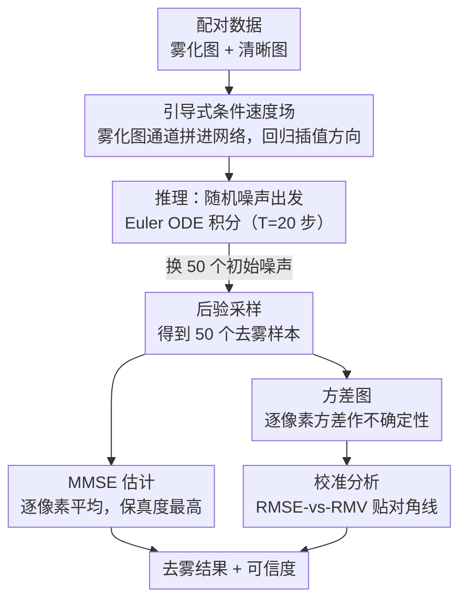

# HazeMatching: Dehazing Light Microscopy Images with Guided Conditional Flow Matching

**会议**: CVPR 2026 Findings  
**arXiv**: [2506.22397](https://arxiv.org/abs/2506.22397)  
**代码**: [https://github.com/juglab/HazeMatching](https://github.com/juglab/HazeMatching)  
**领域**: 图像生成 / 医学图像  
**关键词**: 荧光显微镜去雾, 条件流匹配, 感知-保真权衡, 后验采样, 校准分析

## 一句话总结
提出 HazeMatching，一种基于引导式条件流匹配（Guided CFM）的显微图像去雾方法，通过在速度场中引入退化观测条件，在不需要显式退化算子的前提下，同时实现高数据保真度和高感知质量，并能生成校准良好的不确定性估计。

## 研究背景与动机

**领域现状**：荧光显微镜成像中，宽场显微镜（widefield）价格便宜、使用方便，但会收集大量离焦光导致图像模糊（雾化）。共聚焦显微镜（confocal）通过物理针孔过滤离焦光获得清晰图像，但价格昂贵。计算去雾旨在用计算方法从宽场图像恢复共聚焦质量的图像。现有方法分为两类：确定性点预测器（U-Net/RCAN 等，用 MSE 损失训练）和生成式后验模型（扩散模型/流匹配等）。

**现有痛点**：确定性方法优化保真度（高 PSNR）但产生过度平滑的预测，丢失细节结构；GAN-based 方法产生感知逼真的结果但容易幻觉出不存在的结构；现有 CFM 方法（如 SIFM）需要已知的退化算子 $m(x_1)$ 和噪声水平 $\sigma$，在显微成像中退化过程未知且噪声属性（泊松噪声，信号依赖）变化大。

**核心矛盾**：感知-保真度权衡（perception-distortion trade-off）——优化数据保真度（低 MSE）会导致预测过度平滑，优化感知质量（低 LPIPS/FID）可能引入幻觉结构。在科学成像中，保真度至关重要（不能幻觉出不存在的生物结构），但在保真度相当的方案中我们期望最佳感知质量。

**本文目标** 如何在不需要显式退化算子的前提下，从雾化显微图像恢复出既保真又感知逼真的结果，同时提供可靠的不确定性估计？

**切入角度**：将条件流匹配框架扩展为以退化观测（雾化图像）为引导的版本，让速度场同时取决于当前插值状态和退化输入，实现数据驱动的传输映射。

**核心 idea**：在条件流匹配的速度场中显式加入退化观测作为额外条件（通道拼接），无需知道退化算子即可实现引导式生成去雾。

## 方法详解

### 整体框架
HazeMatching 基于条件流匹配（CFM）框架。训练时：采集配对数据（同一样本的宽场雾化图 $\mathbf{x}_{M_0}$ 和共聚焦清晰图 $\mathbf{x}_{M_1}$），在高斯噪声 $\mathbf{x}_0 \sim \mathcal{N}(0,I)$ 和清晰图 $\mathbf{x}_{M_1}$ 之间构建线性插值路径 $\mathbf{x}_t = (1-t)\mathbf{x}_0 + t\mathbf{x}_{M_1}$，训练神经网络学习速度场 $v_\theta(t, \mathbf{x}_t, \mathbf{x}_{M_0})$，其中雾化图作为额外条件通道拼接输入。推理时：给定新的雾化图，从随机噪声出发，用学到的速度场通过 Euler ODE 积分逐步生成去雾结果。通过采样不同初始噪声可以生成多个后验样本。

### 关键设计

**1. 引导式条件速度场：把雾化观测拼进速度网络的输入，让生成从一开始就盯着观测走**

标准 CFM 学的条件速度场是 $v(t, \mathbf{x}_t | \mathbf{x}_{M_1})$，只依赖当前插值状态和目标清晰图，去雾时观测图根本没参与传输的方向。HazeMatching 把它扩展成 $v(t, \mathbf{x}_t, \mathbf{x}_{M_0} | \mathbf{x}_{M_1})$——速度场多吃一个退化观测 $\mathbf{x}_{M_0}$，对应的边际速度场也随之改写为

$$v(t, \mathbf{x}_t, \mathbf{x}_{M_0}) = \int v(t, \mathbf{x}_t | \mathbf{x}_{M_1}, \mathbf{x}_{M_0})\, p_{M_1}(\mathbf{x}_{M_1} | \mathbf{x}_t, \mathbf{x}_{M_0})\, \mathrm{d}\mathbf{x}_{M_1}.$$

落到实现上，这个"多吃一个条件"就是一次通道拼接：网络输入端把雾化图 $\mathbf{x}_{M_0}$ 和当前状态 $\mathbf{x}_t$ 沿通道维拼在一起，训练目标仍旧是回归插值方向 $\mathbf{x}_{M_1} - \mathbf{x}_0$，CFM 的整套训练框架不动。关键区别在于：SIFM 这类引导方法需要一个显式的退化算子 $m(\cdot)$ 和已知噪声水平 $\sigma$ 才能把观测接进生成过程，而显微成像里退化过程未知、噪声又是信号依赖的泊松噪声，这些先验拿不到。通道拼接绕开了这一切——它不假设退化的函数形式，纯靠数据让网络自己学到"从这张雾图该往哪个清晰图走"，因此能直接套到真实显微数据上。

**2. 后验采样与 MMSE 估计：换初始噪声采一批样本，既能平均出更保真的结果，又能顺手量出不确定性**

因为生成是从随机噪声 $\mathbf{x}_0 \sim \mathcal{N}(0,I)$ 出发做 ODE 积分（Euler 积分器，$T=20$ 步），同一张雾图换不同初始噪声就会得到不同的去雾样本——这正是一个后验分布的采样。论文每张图采 50 个样本，再用这批样本干两件事：一是把它们逐像素平均，得到 MMSE 估计，平均会抵消各样本的随机偏差，保真度比任何单个样本都高；二是逐像素算方差图，作为不确定性估计。方差图在科学成像里尤其有用——它直接告诉生物学家哪些区域的预测不可靠，这些高方差区域应当信 MMSE 均值而不是某个单样本。

**3. 校准分析框架：用 RMSE-vs-RMV 曲线定量验证"模型说的不确定性"是否真等于"它实际犯的错"**

生成模型最常被质疑的一点是"它生成的结构到底真不真实"，光给方差图还不够，得证明这个方差有意义。HazeMatching 的做法是把像素按预测方差聚成若干 bin，对每个 bin 同时算两个量：RMSE（该 bin 的真实误差）和 RMV（预测方差的平方根，即模型自报的误差）。如果模型校准良好，RMSE 对 RMV 画出来应当贴着对角线 $y=x$——模型自报多大误差，实际就犯多大误差。论文再拟合一个线性校准因子（scaling + offset）把曲线进一步对齐，scaling 越接近 1、offset 越接近 0，说明越不需要事后修正。这套分析提供的是定量证据：后验样本之间的变异，确实反映了真实预测误差的量级，而不是凭空抖出来的花样。

### 损失函数 / 训练策略
训练损失为标准 CFM 回归损失：$\mathcal{L} = \|v_\theta(t, \mathbf{x}_t, \mathbf{x}_{M_0}) - (\mathbf{x}_{M_1} - \mathbf{x}_0)\|^2$。骨干网络使用 U-Net。训练 patch 大小 64×64 或 128×128，$T=20$ 步。使用 torchCFM 库进行插值计算和 ODE 积分。评估时使用 inner tiling（50% 重叠）处理全尺寸图像。

## 实验关键数据

### 主实验
在 5 个数据集上与 12 个 baseline 比较。HazeMatching 在 PSNR vs LPIPS/FID 的权衡图上始终位于最佳位置（左下角），即同时实现高保真度和高感知质量。

| 方法类型 | 代表方法 | 特点 |
|---------|---------|------|
| 点预测器 | U-Net, MIMO-UNet, RCAN, Restormer | 高 PSNR 但过度平滑（高 LPIPS/FID） |
| GAN方法 | ESRGAN | 感知质量好但保真度差，幻觉结构 |
| 迭代方法 | InDI20, SIFM | 需要已知退化算子或噪声水平 |
| **HazeMatching** | **本文** | **在所有后验模型中保真度最高，接近最佳确定性方法，同时感知质量显著更好** |

### 校准实验

| 数据集 | 校准因子(scaling) | 偏移(offset) | 校准质量 |
|--------|------------------|-------------|---------|
| Zebrafish | ~1.0 | ~0.0 | 接近对角线，良好校准 |
| Organoids1 | ~1.0 | ~0.0 | 良好校准 |
| Organoids2 | ~1.0 | ~0.0 | 良好校准 |

### 关键发现
- HazeMatching 在所有 5 个数据集上都实现了保真度-感知质量的最佳平衡，没有其他方法能在所有数据集上同时保持两者的良好表现
- 在后验模型中保真度最高（MMSE-PSNR 接近最佳确定性 baseline 如 MIMO-UNet），同时感知质量远优于确定性方法
- 模型天然就是良好校准的（无需额外训练校准模块），校准因子接近 1.0
- 积分步数 $T$ 可以调控感知-保真度权衡：更多步数倾向更高感知质量
- 不需要显式退化算子，可直接应用于真实显微数据

## 亮点与洞察
- 在 CFM 速度场中通过简单的通道拼接引入观测条件，设计极其优雅——不需要修改 CFM 的训练框架，仅在输入端增加条件通道，就实现了引导式生成。这个思路可以直接迁移到其他图像恢复任务
- 校准分析是一个被大多数图像恢复工作忽视但在科学成像中至关重要的角度。HazeMatching 天然良好的校准性质为生物学家提供了信任基础
- 后验采样的实用指南很有价值：MMSE 估计用于需要高保真度的场景，方差图用于识别不确定区域，高不确定区域应依赖 MMSE 而非单个样本

## 局限与展望
- 需要配对训练数据（同一样本的宽场和共聚焦图像），限制了应用场景
- 生成 MMSE 估计需要多次前向传播（50 次采样 × 20 步积分），推理成本较高
- 训练和评估图像尺寸较小（1024×1024），对更大视野的图像可能需要调整
- 仅在显微去雾任务上验证，未扩展到其他逆问题（如超分辨率）
- 训练数据量较小（15 张训练图像），可能限制了模型在复杂样本上的泛化能力

## 相关工作与启发
- **vs SIFM**: SIFM 需要显式退化算子 $m(x_1)$ 和噪声水平 $\sigma$，在真实显微数据中难以获取。HazeMatching 通过通道拼接隐式传递退化信息，无需任何先验知识
- **vs PMRF**: PMRF 需要额外的 MMSE 估计器和精心调节的噪声参数 $\sigma_s$。HazeMatching 在单一框架内同时实现高保真度和后验采样
- **vs InDI**: InDI 的迭代去噪也能生成多样预测，但在显微数据上保真度-感知权衡不如 HazeMatching 稳定
- 该方法的引导式 CFM 框架可以直接应用于计算超分辨率、去卷积等其他显微图像逆问题

## 评分
- 新颖性: ⭐⭐⭐⭐ 引导式 CFM 的扩展方式新颖优雅，但核心技术（通道拼接条件化）较为直接
- 实验充分度: ⭐⭐⭐⭐⭐ 5 个数据集、12 个 baseline、校准分析、多维度指标，非常全面
- 写作质量: ⭐⭐⭐⭐⭐ 数学推导严谨，动机清晰，perception-distortion trade-off 的讨论深入
- 价值: ⭐⭐⭐⭐ 对显微成像社区有直接实用价值，校准分析为科学成像中的生成模型应用提供了方法论参考

<!-- RELATED:START -->

## 相关论文

- [\[CVPR 2026\] EgoFlow: Gradient-Guided Flow Matching for Egocentric 6DoF Object Motion Generation](egoflow_gradient-guided_flow_matching_for_egocentric_6dof_object_motion_generati.md)
- [\[ICLR 2026\] FlowCast: Advancing Precipitation Nowcasting with Conditional Flow Matching](../../ICLR2026/image_generation/flowcast_advancing_precipitation_nowcasting_with_conditional_flow_matching.md)
- [\[NeurIPS 2025\] LeapFactual: Reliable Visual Counterfactual Explanation Using Conditional Flow Matching](../../NeurIPS2025/image_generation/leapfactual_reliable_visual_counterfactual_explanation_using_conditional_flow_ma.md)
- [\[CVPR 2026\] VeCoR — Velocity Contrastive Regularization for Flow Matching](vecor_--_velocity_contrastive_regularization_for_flow_matching.md)
- [\[CVPR 2026\] RenderFlow: Single-Step Neural Rendering via Flow Matching](renderflow_single-step_neural_rendering_via_flow_matching.md)

<!-- RELATED:END -->
