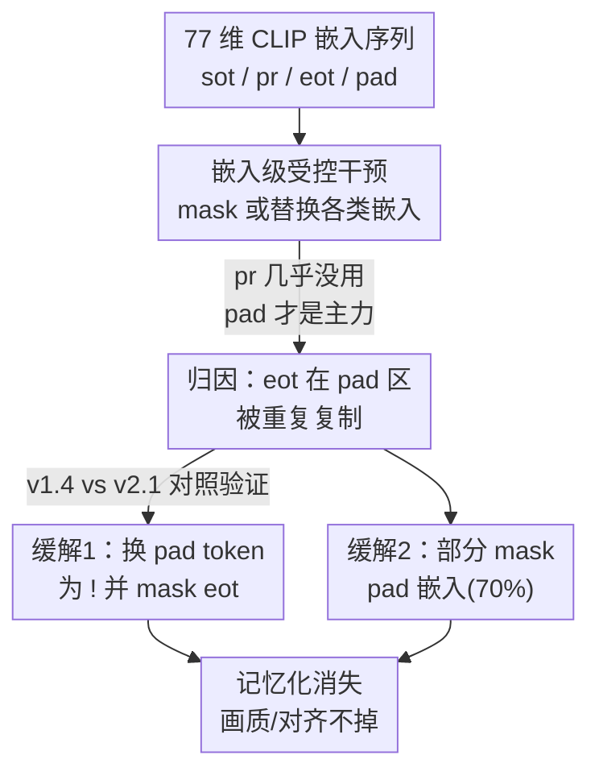

# Memorization In Stable Diffusion Is Unexpectedly Driven by CLIP Embeddings

**会议**: CVPR 2026  
**arXiv**: [2605.02908](https://arxiv.org/abs/2605.02908)  
**代码**: 有（论文标注 Code is available）  
**领域**: 扩散模型 / 图像生成 / AI 安全（记忆与隐私）  
**关键词**: 记忆化(memorization)、CLIP 嵌入、padding 嵌入、Stable Diffusion、推理期缓解  

## 一句话总结
作者把 Stable Diffusion 的"记忆化"（逐字复刻训练图像）归因到一个被忽视的结构缺陷——CLIP 的 tokenizer 用重复的 `<eot>` 来做 padding，导致 30+ 个几乎相同的 $\mathbf{v}^{\mathbf{eot}}$ 嵌入被扩散模型反复 attend，从而过拟合到具体样本；据此提出两个免训练、即插即用的推理期缓解策略（换 `<pad>` token + mask `<eot>`、或部分 mask padding 嵌入），在几乎不损画质的前提下把记忆化的 SSCD 从 ~1.0 压到 ~0.08。

## 研究背景与动机
**领域现状**：Stable Diffusion 等文生图扩散模型存在"记忆化"风险——在某些 prompt 下会逐字复刻训练集里的图像，带来隐私与版权隐患。已有研究主要从**模型内部动态**找原因：数据集去重、检测 trigger token、分析 cross-attention 模式（如 Chen et al. 的 "Bright Ending"——记忆化时注意力在末几步异常集中到 `<eot>`）。

**现有痛点**：这些工作几乎都聚焦"模型内部"或"token 层面"，而**文本嵌入空间**——也就是 prompt 真正喂给扩散模型的接口——基本没人系统研究。更关键的是，token 层面的"重要性"在被 CLIP 编码之后不一定还成立：CLIP 是因果编码器，会把整句信息聚合进 $\mathbf{v}^{\mathbf{eot}}$，单个 prompt token 嵌入 $\mathbf{v}^{\mathbf{pr}}_i$ 的作用被大幅吸收。

**核心矛盾**：CLIP 的训练目标与扩散模型的使用方式存在根本错位。CLIP 用对比学习**只显式优化 $\mathbf{v}^{\mathbf{eot}}$** 来表示整句语义，$\mathbf{v}^{\mathbf{pr}}_i$ 和 padding 嵌入 $\mathbf{v}^{\mathbf{pad}}_i$ 都没被显式训练；而扩散模型在 cross-attention 里**对全部 77 个嵌入一视同仁地 condition**，于是暴露在大量"未被优化"的嵌入面前。

**本文目标**：把分析视角从 token 层面下沉到嵌入层面，量化序列里每一类嵌入（$\mathbf{v}^{\mathbf{sot}}$ / $\mathbf{v}^{\mathbf{pr}}$ / $\mathbf{v}^{\mathbf{eot}}$ / $\mathbf{v}^{\mathbf{pad}}$）到底对记忆化贡献多少，并据此给出缓解手段。

**切入角度 + 核心 idea**：做一系列"受控嵌入干预"——把某一类嵌入 mask 成零向量、或替换成 $\mathbf{v}^{\mathbf{eot}}$，看生成结果变不变。结果出人意料：**prompt 嵌入几乎没用，padding 嵌入才是记忆化主力**。再追根溯源，发现 padding 嵌入之所以重要，是因为 v1.4 的 tokenizer 用重复 `<eot>` 填充，使 $\mathbf{v}^{\mathbf{pad}}_i$ 本质是 $\mathbf{v}^{\mathbf{eot}}$ 的结构性复制，无意中放大了它的影响。一句话：**记忆化不是数据复制驱动，而是 `<eot>` 在 padding 区被复制了几十遍驱动的**。

## 方法详解

### 整体框架
本文是一篇"分析 + 缓解"论文。整体逻辑是三步走：先用受控嵌入干预**定位**真正驱动记忆化的嵌入（发现是 padding 而非 prompt），再**归因**到 tokenizer 用 `<eot>` 做 padding 的结构缺陷（并用 v1.4 vs v2.1 的对照交叉验证），最后据此**对症下药**给出两个免训练的推理期缓解策略。所有干预都在固定长度 $L=n+d+2$（通常 77）的嵌入序列上做，其中

$$\mathbf{Emb}=[\mathbf{v}^{\mathbf{sot}},\,\mathbf{v}^{\mathbf{pr}}_1,\dots,\mathbf{v}^{\mathbf{pr}}_n,\,\mathbf{v}^{\mathbf{eot}},\,\mathbf{v}^{\mathbf{pad}}_1,\dots,\mathbf{v}^{\mathbf{pad}}_d]$$

### 关键设计

**1. 嵌入级受控干预：证明 prompt 嵌入没用、padding 嵌入才是主力**

痛点是过去都在 token 层面找记忆化原因，但 CLIP 编码后 token 的重要性会被重排，必须在嵌入层面重新量化。作者设计了一组"留谁去谁"的干预实验，在 458 个记忆化 prompt 上测量干预后图像与原始生成图像的 SSCD（越接近 0.5 表示与原图越像、记忆化越强；接近 0 表示生成被破坏）。针对 prompt 嵌入：(a) 只留 $\mathbf{v}^{\mathbf{pr}}_i$、把 $\mathbf{v}^{\mathbf{eot}}$ 和 $\mathbf{v}^{\mathbf{pad}}_i$ 全 mask 成零 → 图像崩溃（SSCD 0.04）；(c) 反过来只 mask 掉 $\mathbf{v}^{\mathbf{pr}}_i$、保留其余 → 图像几乎不变（SSCD 0.42）。这说明 $\mathbf{v}^{\mathbf{pr}}_i$ 单独撑不起生成，它"可有可无"。针对 padding：(h) 单独 mask 掉 $\mathbf{v}^{\mathbf{pad}}_i$ → 图像崩溃（SSCD 0.07）；(g) 把 $\mathbf{v}^{\mathbf{pr}}_i$ 和 $\mathbf{v}^{\mathbf{eot}}$ 都换成 padding 嵌入的均值、只靠 padding → 仍能生成结构连贯的图（SSCD 0.50）。

为什么有效：这组干预把"贡献度"从模糊的注意力可视化变成可量化的 SSCD 对照，得到反直觉的两个 Claim——prompt 嵌入对记忆化贡献极小、padding 嵌入贡献巨大，直接推翻了"padding 只是占位符、不携带语义"的普遍假设（Toker et al. 曾论证冻结文本编码器下 $\mathbf{v}^{\mathbf{pad}}$ 不太可能有意义）。注意力可视化进一步佐证：不只 $\mathbf{v}^{\mathbf{eot}}$ 在末步注意力飙高，紧邻它的多个 $\mathbf{v}^{\mathbf{pad}}$ 同样被高度 attend，二者**联合**放大信号

**2. 归因到 `<eot>` 的结构性复制，并用 v1.4 vs v2.1 交叉验证**

既然 padding 这么重要，那它为什么重要？作者指出根因在 v1.4 的 tokenizer：短于 77 token 的 prompt 用**重复插入 `<eot>`** 来 padding，于是同一个 `<eot>` token 在序列里出现几十次，产生的嵌入几乎完全相同（附录给了 PCA/t-SNE 佐证）。由于 CLIP 只显式优化 $\mathbf{v}^{\mathbf{eot}}$，它语义上远比别的嵌入"重"；现在它被复制几十遍，扩散模型 condition 时这个本就强势的嵌入被无意放大，导致对具体样本过拟合——尤其短 prompt（padding 占了大半序列）。作者实测：此前所有被报告的记忆化 prompt 都短于 40 token，意味着有 30+ 个近似复制的 $\mathbf{v}^{\mathbf{eot}}$。

这一归因最漂亮的证据是 v1.4 与 v2.1 的天然对照：v2.1 换用 OpenCLIP（本意是提性能），却**顺带把 `<eot>` 从 padding 位置移除**，于是 v2.1 的精确匹配记忆化几乎消失。过去这常被归功于数据去重，但已有工作指出去重并不能完全消除记忆化。作者论证：真正起决定作用的是 padding 区不再有 `<eot>` 复制——这个机制与本文中心论点严丝合缝，构成强有力的交叉验证

**3. 缓解一：解耦 padding 与 `<eot>`——换 `<pad>` token + mask `<eot>`**

既然根因是 `<eot>` 在 padding 区被复制，最直接的修法就是在 tokenizer 层面把默认 `<pad>`（原本就是 `<eot>`）改成一个语义中性的 `!` token，让 padding 产生的嵌入与 $\mathbf{v}^{\mathbf{eot}}$ **不再相同**，从而解耦 $\mathbf{v}^{\mathbf{pad}}$ 和 $\mathbf{v}^{\mathbf{eot}}$。光这一步就大幅降记忆化（SSCD 0.14）；再把那唯一一个真正的 $\mathbf{v}^{\mathbf{eot}}$ 也替换成零向量，记忆化几乎被完全消除（SSCD 0.08）。关键是它不损画质——CLIPScore、Aesthetic Score 与原始生成持平，还把跨 seed 的多样性（LPIPS）从 0.04 拉回正常，恢复了同 prompt 下应有的随机性。这种"直接拆掉病根"的修法不需要检测哪些 prompt 是记忆化的，可无脑套用

**4. 缓解二：部分 mask padding 嵌入（70%）作为灵活替代**

与缓解一同源但不改 tokenizer：既然记忆化来自重复 $\mathbf{v}^{\mathbf{eot}}$ 经由 $\mathbf{v}^{\mathbf{pad}}_i$ 的放大，那就直接在嵌入层 mask 掉一部分紧邻 $\mathbf{v}^{\mathbf{eot}}$ 的 $\mathbf{v}^{\mathbf{pad}}_i$。但全 mask（100%）常导致生成崩溃或明显退化，全留又压不住记忆化，于是作者在"抑制"与"稳定"之间折中，经验性地 mask 70%——既显著降记忆化（SSCD 0.10），又几乎不掉画质。它的优势是更灵活：不动 tokenizer、不重训，可直接塞进现有推理 pipeline，并提供细粒度可调的抑制强度

### 损失函数 / 训练策略
本文不涉及任何训练或微调，两个缓解策略都是**纯推理期、零额外计算开销**的即插即用操作（改 tokenizer 的 padding token / 在嵌入序列上做 mask），不需要先检测 prompt 是否记忆化，推理时间与无缓解时基本相同。

## 实验关键数据

**实验设置**：模型用 Stable Diffusion v1.4（记忆化研究的标准 benchmark）。数据集在 Webster 的 86 个 Matching Verbatim (MV) prompt 基础上，从 Membench 用两条严苛标准（精确匹配 + 10 个 seed 下 SSCD≥0.5 的一致性）筛出 372 个，合计 **458 个记忆化 prompt**；另用 LAION/COCO/Lexica 各 500 个非记忆化 prompt 测稳健性。指标：SSCD 判记忆化（与"用原始嵌入生成的图"比，≥0.5 算记忆化）、CLIPScore 测文图对齐、Aesthetic Score 测画质、LPIPS 测跨 seed 多样性。

### 主实验：缓解效果对比（记忆化 prompt）

| 类别 | 方法 | SSCD↓ | CLIPScore↑ | Aesthetic↑ | LPIPS↑ |
|------|------|-------|-----------|-----------|--------|
| 本文（换 pad token） | `<pad>`→`!` & $\mathbf{v}^{\mathbf{eot}}$→0 | **0.08** | 0.31 | 5.09 | 0.67 |
| 本文（换 pad token） | `<pad>`→`!` | 0.14 | 0.32 | 5.21 | 0.64 |
| 本文（mask padding） | $\mathbf{v}^{\mathbf{pad}}_i$→0 (70%) | 0.10 | 0.31 | 5.13 | 0.66 |
| 先前工作 | Ren et al. | 0.09 | 0.30 | 5.18 | 0.65 |
| 先前工作 | Wen et al. | 0.51 | 0.32 | 5.22 | 0.49 |
| 先前工作 | RTA | 0.58 | 0.31 | 5.23 | 0.42 |
| 先前工作 | RNA | 0.53 | 0.31 | 5.20 | 0.44 |

本文方法把 SSCD 压到 0.08~0.14（记忆化基本消除），同时 LPIPS 最高（多样性恢复最好）；RTA/RNA/Wen et al. 的 SSCD 仍 >0.5（常压不住记忆化）；Ren et al. SSCD 接近（0.09）但论文指出它会损画质和语义对齐。

### 分析实验：嵌入干预（揭示谁驱动记忆化）

| 干预 | 操作 | SSCD | CLIPScore | Aesthetic | 含义 |
|------|------|------|-----------|-----------|------|
| (a) | 只留 $\mathbf{v}^{\mathbf{pr}}$，mask eot+pad | 0.04 | 0.25 | 5.02 | prompt 嵌入单独撑不起生成 |
| (c) | 只 mask $\mathbf{v}^{\mathbf{pr}}$ | 0.42 | 0.29 | 5.15 | 去掉 prompt 嵌入图几乎不变 |
| (f) | mask $\mathbf{v}^{\mathbf{eot}}$ | 0.95 | 0.32 | 5.31 | 去掉 eot 仍记忆化（不只靠 eot）|
| (g) | 只靠 $\mathbf{v}^{\mathbf{pad}}$（均值补位）| 0.50 | 0.29 | 5.09 | padding 能替代 eot 撑起生成 |
| (h) | mask $\mathbf{v}^{\mathbf{pad}}$ | 0.07 | 0.29 | 5.10 | 去掉 padding 生成崩溃 |

### 关键发现
- **贡献度反直觉**：mask 掉全部 prompt 嵌入（c）SSCD 仍有 0.42（图几乎不变），而 mask 掉 padding 嵌入（h）SSCD 暴跌到 0.07（崩溃）——padding 才是记忆化主力，prompt 嵌入可有可无。
- **`<eot>` 不是唯一**：单独 mask $\mathbf{v}^{\mathbf{eot}}$（f）SSCD 高达 0.95，说明记忆化不只靠那一个 `<eot>`，而是它在 padding 区的几十个复制体一起作祟。
- **泛化无副作用**：在 1500 个非记忆化 prompt 上，本文方法的 CLIPScore（0.34~0.35）和 Aesthetic（5.41~5.49）与原始生成（0.35 / 5.47）持平，证明可无脑全局套用而不伤正常生成。
- **70% 是甜点**：部分 mask 中 70% 在"抑制记忆化"与"保画质"间最平衡，100% 全 mask 反而常崩溃。

## 亮点与洞察
- **把记忆化从"数据问题"重新定义为"嵌入结构问题"**：以往主流归因是训练集重复样本，本文揭示了一条独立的、嵌入层面的新通路——CLIP tokenizer 用 `<eot>` 当 padding 这个工程细节本身就在制造记忆化。这种"bug 即根因"的视角很启发人。
- **v1.4 vs v2.1 的天然对照堪称神来之笔**：v2.1 换 OpenCLIP 时无意去掉了 padding 区的 `<eot>`，记忆化随之消失。作者把这个"无心插柳"的工程改动当成验证自己机制假说的对照组，比纯消融更有说服力。
- **干预设计的"留谁去谁"范式可迁移**：用 mask/替换某类嵌入再看 SSCD 变化来量化贡献度，这套受控干预思路可直接用于分析任意条件生成模型里"哪部分条件信号真正起作用"。
- **缓解极致简单**：核心修法就是"把 padding token 从 `<eot>` 换成 `!`"——一行 tokenizer 配置，零训练、零额外开销、无需检测，工程上几乎零成本就能部署。

## 局限与展望
- **只在 SD v1.4 上系统验证**：作者明确指出 SD v3、FLUX 等新模型尚无系统的记忆化 benchmark，未做对比；机制结论是否在新一代架构（不同文本编码器、不同 padding 策略）成立尚不确定。
- **缓解依赖经验阈值**：部分 mask 的 70% 是经验性甜点，缺乏理论指导；不同 prompt 长度/数据分布下最优比例可能漂移，全 mask 会崩溃说明该策略对超参敏感。
- **"换 token 为 `!`"略显 ad-hoc**：用感叹号作中性 padding 是个工程 trick，是否对所有 prompt 都中性、会不会在极少数情况引入伪影，论文未深究。
- **未触及训练期治理**：两个策略都是推理期补丁，治标；从根上重训一个 padding 设计更合理的文本编码器（如 v2.1 路线）是否更彻底，留作展望。

## 相关工作与启发
- **vs Chen et al.（"Bright Ending"）**: 他们发现记忆化时末步注意力异常集中到 `<eot>`，把焦点放在单个 $\mathbf{v}^{\mathbf{eot}}$；本文证明这一效应**不止于 `<eot>`**——紧邻的多个 $\mathbf{v}^{\mathbf{pad}}$ 同样高注意力，二者联合驱动，从而把机制从"单嵌入"扩展到"嵌入复制簇"。
- **vs Carlini et al. / 数据去重路线**: 他们把记忆化主要归因于训练集重复样本并以过滤缓解；本文论证存在一条**与数据复制无关**的嵌入级通路，并用 v1.4/v2.1 对照说明去重不足以解释 v2.1 记忆化的消失。
- **vs Wen et al. / RTA / RNA / Ren et al.（推理期缓解）**: 这些方法靠检测 trigger token、扰动 token 或调初始噪声，要么压不住记忆化（SSCD>0.5），要么以损画质为代价（Ren et al.）；本文直击根因（解耦 padding 与 `<eot>`），在同等甚至更低 SSCD 下保住画质与多样性，且无需先检测。
- **vs Toker et al.**: 他们论证冻结文本编码器下 $\mathbf{v}^{\mathbf{pad}}$ 不太可能携带有意义信息；本文实验直接反驳——padding 嵌入在记忆化生成中作用几乎与 $\mathbf{v}^{\mathbf{eot}}$ 同强。

## 评分
- 新颖性: ⭐⭐⭐⭐⭐ 把记忆化根因从"数据复制"翻新到"`<eot>` 在 padding 区被结构性复制"，视角反直觉且证据扎实
- 实验充分度: ⭐⭐⭐⭐ 干预设计系统、有 v1.4/v2.1 交叉验证，但只在 SD v1.4 上验证，未覆盖新一代模型
- 写作质量: ⭐⭐⭐⭐⭐ 逻辑链清晰（定位→归因→缓解），符号体系统一，论证步步为营
- 价值: ⭐⭐⭐⭐⭐ 揭示了一个被忽视的结构缺陷，缓解方案免训练、零开销、即插即用，对隐私/版权安全有直接实用价值

<!-- RELATED:START -->

## 相关论文

- [\[AAAI 2026\] Realistic Face Reconstruction from Facial Embeddings via Diffusion Models](../../AAAI2026/image_generation/realistic_face_reconstruction_from_facial_embeddings_via_diffusion_models.md)
- [\[CVPR 2026\] Mitigating Memorization in Text-to-Image Diffusion via Region-Aware Prompt Augmentation and Multimodal Copy Detection](mitigating_memorization_in_texttoimage_diffusion_v.md)
- [\[CVPR 2025\] Enhancing Creative Generation on Stable Diffusion-based Models](../../CVPR2025/image_generation/enhancing_creative_generation_on_stable_diffusion-based_models.md)
- [\[ICLR 2026\] A Hidden Semantic Bottleneck in Conditional Embeddings of Diffusion Transformers](../../ICLR2026/image_generation/a_hidden_semantic_bottleneck_in_conditional_embeddings_of_diffusion_transformers.md)
- [\[NeurIPS 2025\] Training-Free Constrained Generation with Stable Diffusion Models](../../NeurIPS2025/image_generation/training-free_constrained_generation_with_stable_diffusion_models.md)

<!-- RELATED:END -->
