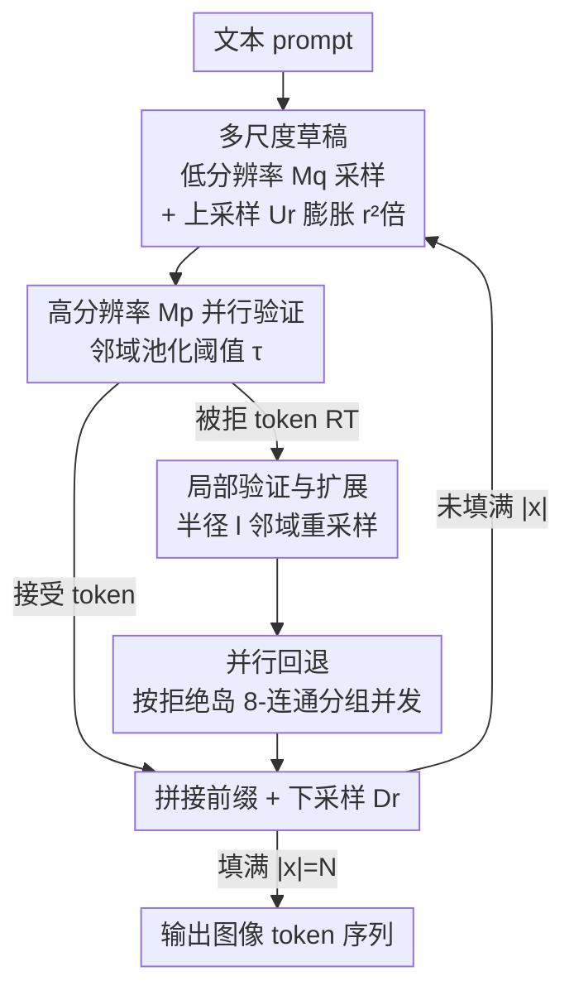

# Multi-Scale Local Speculative Decoding for Image Generation

**会议**: CVPR2026  
**arXiv**: [2601.05149](https://arxiv.org/abs/2601.05149)  
**代码**: https://qualcomm-ai-research.github.io/mulo-sd-webpage/ (项目页)  
**领域**: 图像生成  
**关键词**: 自回归图像生成、投机解码、多尺度、空间局部性、并行解码  

## 一句话总结
MuLo-SD 把"低分辨率草稿 + 上采样 + 高分辨率并行验证"的多尺度思路引入投机解码，并用"只在被拒 token 的局部邻域里重采样"替代传统的 raster-scan 全序列回退，配合并行解码，在 Tar-1.5B/7B 上把自回归图像生成端到端加速到最高 $5.33\times$，同时保持语义对齐与感知质量基本不掉。

## 研究背景与动机
**领域现状**：统一多模态大模型（unified MLLM）把语言与视觉的理解、生成都塞进一个自回归（AR, next-token prediction）框架里，文本-图像对齐能力比扩散模型更强。但 AR 解码天生是逐 token 串行的，高分辨率下 token 数随分辨率二次增长（1024p 动辄上千 token），延迟成为致命短板。

**现有痛点**：加速 AR 图像生成的两条路各有缺陷。① 投机解码（Speculative Decoding, SD）在文本上很成功（draft-and-verify，2–3× 加速），但直接搬到图像上几乎失效——视觉 token 的 next-token 分布很"平"（ambiguity），接受率极低，EAGLE-2 在图像上甚至是负加速（<1×）。LANTERN 用"码本近邻概率池化 + TVD 约束"放松接受准则，能拿到约 1.6–1.8× 加速，但它仍然是**纯 token 级、按 raster-scan 顺序**工作的：一旦某个 token 被拒，它后面整行/整段全部作废，完全没利用图像的二维空间结构和多尺度先验。② 另一条路 next-scale prediction（VAR 系）虽快，但采样时间表是定制的，和 next-token 框架、统一 MLLM 不兼容（KV-cache 用不起来）。

**核心矛盾**：图像本质是二维、多尺度、强空间局部性的，而现有图像投机解码却把它当一维 token 流处理——既丢了"粗到细"的天然层次（多尺度），又丢了"邻近 token 强相关、远处弱相关"的局部性。一个 token 被拒，理应只影响它周围一小片，却被迫拖累整个后缀。

**本文目标**：在不放弃 next-token prediction 目标（从而保持与统一 MLLM 兼容）的前提下，把图像的多尺度结构和空间局部性注入投机解码，提高接受率、减少串行步数。

**切入角度**：现成的 AR 图像模型常常同时发布 256p/512p/1024p 多个分辨率 checkpoint——那就让低分辨率模型当 drafter（草稿天然便宜、序列短），高分辨率模型当 verifier。而验证回退时，借助 ZipAR/LPD 揭示的"视觉 AR 模型注意力是局部的"这一事实，只在被拒 token 的小邻域内重采样。

**核心 idea**：用"低分辨率草稿→上采样→高分辨率并行验证→局部邻域回退重采样"替代"同分辨率逐 token 草稿 + raster-scan 全后缀回退"，把多尺度 + 空间局部性同时榨干。

## 方法详解

### 整体框架
MuLo-SD 输入是文本 prompt，输出是目标分辨率 $s_p$（512p 或 1024p）的图像 token 序列，最终长度 $N$。它在一个**循环**里把图像分块地"草稿—上采样—验证—局部回退"地填出来，直到 $|x|=N$。

设目标模型 $M_p$ 工作在高分辨率 $s_p$，草稿模型 $M_q$ 工作在低分辨率 $s_q$，分辨率比 $r=s_p/s_q$（2× 对应 512p、4× 对应 1024p）。一个循环里：① $M_q$ 串行采出一批低分辨率草稿 token $\tilde{y}$（按整行采，便于上采样器拼出连贯的高分辨率 patch）；② 上采样器 $U_r$ 把 $\tilde{y}$ 放大成高分辨率草稿 $\tilde{x}=U_r(\tilde{y})$，序列长度膨胀 $r^2$ 倍；③ $M_p$ **并行**验证 $\tilde{x}$，用邻域池化阈值规则判定每个 token 接受还是拒绝；④ 对被拒 token 做局部扩展（local expansion），并按"拒绝岛"分组**并行**用 $M_p$ 重采样；⑤ 验证通过的 token 拼进已接受前缀得到 $x$，再下采样 $y=D_r(x)$ 作为下一轮低分辨率草稿的前缀。如此循环。

整条流水线有两个串行瓶颈——低分辨率草稿（步①）和高分辨率回退重采样（步④），它们都被并行解码（ZipAR 式）进一步压平。注意 drafter 与 verifier **容量相同**，加速完全来自"减少函数评估次数（NFE）+ 低/高分辨率间序列长度的二次差距"，而非用小模型换速度。

### 关键设计

**1. 多尺度草稿：用低分辨率 drafter + 上采样器把"粗到细"先验注入投机解码**

传统投机解码里 drafter 和 target 同分辨率，drafter 只是"小一点的模型"，没用上图像的层次结构。本文换个思路：让 drafter $M_q$ 直接在低分辨率 $s_q$ 上跑——低分辨率序列短、采样便宜，且现成 AR 图像模型本来就有多分辨率 checkpoint 可直接拿来用。草稿采完后用上采样器 $U_r$ 把低分辨率 token $\tilde{y}$ 映射成高分辨率草稿 $\tilde{x}=U_r(\tilde{y})$，序列长度一下膨胀 $r^2$ 倍（这正是加速来源：低/高分辨率间序列长度的二次差距）。drafter 按**整行**采样，好让上采样器拼出空间连贯的高分辨率 patch。上采样器有两种实现：latent-space 版（masked row-causal 卷积 + pixel-shuffle，需训练、绑定 VQ 模型）；以及 pixel-space 版（解码到像素→现成超分→重新编码回 token，**免训练、模型无关**，被设为默认）。由于所有被拒 token 都交给 target 重采样，下采样器 $D_r$ 只需处理已验证 token，角色被简化

**2. 局部验证与邻域扩展：被拒 token 只波及周围一小片，而不是整个后缀作废**

这是全文最关键的一步。如果照搬 LANTERN 的 raster-scan 规则，第一个被拒 token 之后的整段草稿全部丢弃——可本文要求**每个被拒 token 都由 target 重采样**，raster-scan 下接受率极低、几乎没加速。作者改用一个更宽松的阈值准则：当某草稿 token 在其码本邻域 $B_k(\tilde{x}_i)$ 上的池化概率超过阈值 $\tau$ 就接受，

$$\text{Accept if } \sum_{x\in B_k(\tilde{x}_i)} p_i(x) \ge \tau$$

$\tau$ 越高越逼近 target（质量好但慢），越低越快（牺牲精度）。被拒 token 集合记为 $R_T$。光重采样被拒 token 本身还不够（消融里这种 naive 版反而更差），因为它周围的上下文也受了影响——于是引入**局部扩展**：对每个 $t\in R_T$，取其半径 $l$ 的二维邻域

$$N(t,l)=\{u \mid |i_u-i_t|\le l,\ |j_u-j_t|\le l,\ u\ge t_0\}$$

（$t_0$ 是首个被拒位置，保证不回头改前面已确定的 token），并集 $R_X=\bigcup_{t\in R_T}N(t,l)$ 就是要重采样的全部位置，逐个用 $M_p$ 重采。这一步精准利用了"视觉 AR 注意力强局部、弱远程"的事实：只修被拒处及其邻域，远处已接受 token 几乎不受影响，从而在同样 $\tau$ 下拿到更高接受率与加速，又不损画质

**3. 并行解码整合：把两个串行瓶颈用拒绝岛并发抹平**

MuLo-SD 剩下两处串行——低分辨率草稿（步①）和高分辨率回退重采样（步④）。对前者，直接用 ZipAR 一次性并行草绘整张低分辨率图，而非逐行串行。对后者，作者把待重采样集合 $R_X$ 按二维网格上的 **8-连通分量**切成若干"拒绝岛"$\{\mathcal{I}_m\}_{m=1}^{M}=\mathrm{CC}_8(R_X)$，不同岛之间互不相交、**并发**重采样——因为已接受的周围 token 对每个岛都是充分且有效的上下文，各岛可独立填。这正是相对 naive ZipAR 的关键区别。岛内再套 ZipAR 式解码减少串行步数。三处并行（并行草稿 + 批量验证 + 岛级并行重采样）叠加，带来显著的端到端延迟下降。这一组件与 draft-and-verify 范式正交，是可插拔的加速器

### 损失函数 / 训练策略
只有 latent-space 上/下采样器需要训练，训练数据为 LAION-COCO-Aesthetic。消融显示损失函数选择对画质影响很大：最初的 latent token 分类损失画质差；改成**像素空间重建损失**（MSE + LPIPS，先用 VQ-Decoder 渲染到像素再算）明显提升感知质量；再加一个轻量 PatchGAN 判别器的对抗项进一步补高频细节。而默认采用的 pixel-space 现成超分上采样器是**免训练**的，虽略逊于学得的 latent 版，但模型无关、与并行重采样配合好，故设为默认。LANTERN 超参沿用原文 $k=1000$、$\delta=0.4$。

## 实验关键数据

评测基座：Tar-1.5B / Tar-7B（统一 MLLM，AR-DTok 检测器，256/512/1024p checkpoint）与 LlamaGen-XL。效率用 speedup（基线串行延迟 / 本方法延迟，A100、batch=1）衡量；语义对齐用 GenEval、DPG-Bench；感知质量用 FID、HPSv2（MS-COCO 2017 5k 验证集）。MuLo-SD 通过扫 $\tau$ 取"GenEval 与 LANTERN 接近"的工作点再比加速。

### 主实验
| 基座 (分辨率) | 方法 | Speedup↑ | GenEval↑ | DPG-Bench↑ | FID↓ | HPSv2↑ |
|---|---|---|---|---|---|---|
| LlamaGen-XL (512p) | EAGLE-2 | 0.96× | 37.1 | 65.1 | 56.2 | 23.1 |
| | LANTERN | 1.59× | 36.3 | 64.5 | 55.4 | 22.2 |
| | **MuLo-SD (2×)** | **1.40×** | 36.1 | 64.0 | 54.3 | 23.1 |
| Tar-1.5B (512p) | ZipAR-16 | 1.88× | 76.6 | 82.8 | 33.0 | 28.5 |
| | LANTERN | 1.08× | 75.9 | 82.1 | 32.7 | 27.7 |
| | **MuLo-SD (2×)** | **1.94×** | 76.4 | 82.6 | 33.4 | 28.3 |
| Tar-7B (512p) | LANTERN | 1.20× | 84.9 | 80.5 | 36.9 | 28.7 |
| | **MuLo-SD (2×)** | **2.03×** | 85.1 | 80.8 | 38.2 | 29.5 |
| Tar-1.5B (1024p) | ZipAR-16 | 3.65× | 76.6 | 82.5 | 32.4 | 29.6 |
| | LANTERN | 1.42× | 75.4 | 82.3 | 31.1 | 28.5 |
| | **MuLo-SD (4×)** | **3.90×** | 76.8 | 82.2 | 31.3 | 28.7 |
| Tar-7B (1024p) | LANTERN | 1.45× | 82.9 | 80.5 | 34.6 | 29.4 |
| | **MuLo-SD (4×)** | **5.33×** | 85.4 | 80.8 | 34.8 | 29.5 |

要点：EAGLE-2（精确投机解码）在图像上普遍 <1×（负加速），印证标准 SD 不适配视觉 token 的高歧义性；LANTERN 能加速但伴随指标小幅下滑，且在更强的 Tar 上加速更弱（分布更难逼近，1.5B 512p 仅 1.08×）。在 GenEval 相当或更优的前提下，MuLo-SD 在每个设置都拿到最高加速，且分辨率越高优势越大——Tar-7B 1024p 达 $5.33\times$，GenEval 还反超基座 (+0.2)。

### 消融实验
| 消融维度 | 关键对比 | 结论 |
|---|---|---|
| 上采样器损失 (a) | token 分类损失 → 像素 MSE+LPIPS → +PatchGAN → 现成 pixel 超分 | token 级损失画质差；像素重建损失大幅提升感知质量；加对抗项补高频；现成 pixel 超分略逊但免训练，设为默认 |
| 概率池化 (b) | 仅草稿 token 概率 vs 码本 k 近邻池化 | 池化提升接受率、在 >1.2× 区间更稳，但增益有限（其作用与阈值 $\tau$ 重叠） |
| 局部验证与扩展 (c) | raster-scan 拒绝 vs naive 局部 vs 局部+扩展 | raster-scan 需极低 $\tau$ 致画质差；naive 局部更差；**局部+扩展** 同 $\tau$ 下加速更高且画质保住 |
| 并行解码 (d) | 串行重采样 vs 并行解码 | 并行解码在同 $\tau$ 下一致降低端到端延迟，指标几乎不变 |

### 关键发现
- **局部扩展是不可或缺的一环**：消融 (c) 显示，只重采被拒 token（naive 局部）反而比 raster-scan 还差，必须连同其半径 $l$ 邻域一起修，verifier 才能纠正"被拒 token + 受其影响的上下文"。这是 MuLo-SD 接受率能起来的核心。
- **分辨率越高，多尺度收益越大**：512p 加速约 1.4–2.0×，到 1024p（4× 草稿）跃升到 3.9–5.3×，因为低/高分辨率间的序列长度差距是二次的，草稿省下的步数更多。
- **概率池化作用有限**：它和接受阈值 $\tau$ 功能重叠，$\tau$ 才是主要的松弛旋钮。

## 亮点与洞察
- **把"多尺度先验"和"投机解码"两条原本分裂的加速路线缝合**：next-scale 模型快但不兼容 next-token MLLM，投机解码兼容但没用空间结构；MuLo-SD 让低分辨率草稿扮演"粗"、高分辨率验证扮演"细"，在保持 next-token 目标的同时吃到粗到细红利——这是它能进统一 MLLM 的关键。
- **"拒绝岛 + 8-连通并发重采样"很巧**：把二维拒绝集合按连通分量切块、用已接受 token 当各块的充分上下文并发填，比 naive ZipAR 更激进地榨干局部性，这个思路可迁移到任何"局部修复 + 空间结构"的生成任务。
- **免训练的 pixel-space 上采样路径**：解码到像素→现成超分→重编码回 token，模型无关、零训练成本却有竞争力，对工程落地友好——换基座不用重训上采样器。
- 一个反直觉点：drafter 和 verifier **同容量**，加速纯靠"减少 NFE + 序列长度二次差距"，而非常规的"大模型 + 小模型"组合，说明投机解码的加速来源可以从模型大小转移到分辨率维度。

## 局限与展望
- **双 checkpoint 的内存代价**（作者承认）：需同时加载低分辨率 drafter 和高分辨率 verifier 两套权重 + 两份 KV-cache，在显存受限设备上吃不消。
- **依赖 drafter/verifier 分布对齐**：两者独立训练或架构不同会拉低接受率、削弱多尺度增益——在 LlamaGen 上加速明显低于 Tar（512p 仅 1.40×）即是此故。作者建议的补救是 self-speculative decoding（单 checkpoint 内部层出草稿、整模型验证），消除重复权重并改善跨分辨率对齐。
- 自评局限：1024p 下虽加速大，但 FID 的横向比较需谨慎——⚠️ 不同方法各自扫到不同 $\tau$ 工作点，FID/质量指标不可直接横比大小（如 Tar-7B 1024p MuLo-SD 与 LANTERN 的 FID 都降到 34.x，须结合其加速差异解读）。方法目前只验证了图像，视频/其他多模态扩展尚是 future work。

## 相关工作与启发
- **vs LANTERN**：两者都为图像放松投机解码的接受准则、都用码本近邻概率池化；但 LANTERN 纯 token 级、raster-scan 回退，MuLo-SD 额外引入多尺度草稿 + 局部邻域重采样，是首个把多尺度先验用进投机解码的工作，在相当质量下加速显著更高。
- **vs EAGLE-2**：EAGLE-2 是文本域精确投机解码（动态草稿树、4.3× 文本加速），但在图像上因 token 歧义接受率极低、普遍负加速，说明文本 SD 不能直接搬到视觉。
- **vs ZipAR / LPD（locality-aware 并行解码）**：它们靠空间相邻做行/块级并行解码；MuLo-SD 借鉴其局部性思想做"局部回退重采样"，并把 ZipAR 当作正交的并行组件嵌入草稿与重采样阶段，二者互补而非替代。
- **vs VAR / Switti / M-VAR（next-scale 多尺度模型）**：共享"粗到细"哲学，但那些模型用定制采样时间表、和 next-token MLLM 不兼容；MuLo-SD 把多尺度注入 drafting 策略，保留 next-token 目标，因而能无缝接入统一 MLLM。

## 评分
- 新颖性: ⭐⭐⭐⭐⭐ 首个把多尺度先验 + 空间局部性同时注入图像投机解码，"局部拒绝岛并发重采样"是真正的新机制
- 实验充分度: ⭐⭐⭐⭐ 两基座 × 两分辨率 × 多 baseline + 四组消融充分，但仅图像、未含视频且部分横比需 caveat
- 写作质量: ⭐⭐⭐⭐ 动机推导清晰、图示到位，公式与符号规范
- 价值: ⭐⭐⭐⭐⭐ 与统一 MLLM 兼容、最高 5.3× 加速且质量基本不掉，工程落地价值高

<!-- RELATED:START -->

## 相关论文

- [\[CVPR 2026\] Parallel Jacobi Decoding for Fast Autoregressive Image Generation](parallel_jacobi_decoding_for_fast_autoregressive_image_generation.md)
- [\[ICML 2026\] Speculative Coupled Decoding for Training-Free Lossless Acceleration of Autoregressive Visual Generation](../../ICML2026/image_generation/speculative_coupled_decoding_for_training-free_lossless_acceleration_of_autoregr.md)
- [\[AAAI 2026\] Annealed Relaxation of Speculative Decoding for Faster Autoregressive Image Generation](../../AAAI2026/image_generation/annealed_relaxation_of_speculative_decoding_for_faster_autor.md)
- [\[ICCV 2025\] Grouped Speculative Decoding for Autoregressive Image Generation](../../ICCV2025/image_generation/grouped_speculative_decoding_for_autoregressive_image_generation.md)
- [\[CVPR 2026\] SJD-PAC: Accelerating Speculative Jacobi Decoding via Proactive Drafting and Adaptive Continuation](sjd-pac_accelerating_speculative_jacobi_decoding_via_proactive_drafting_and_adap.md)

<!-- RELATED:END -->
