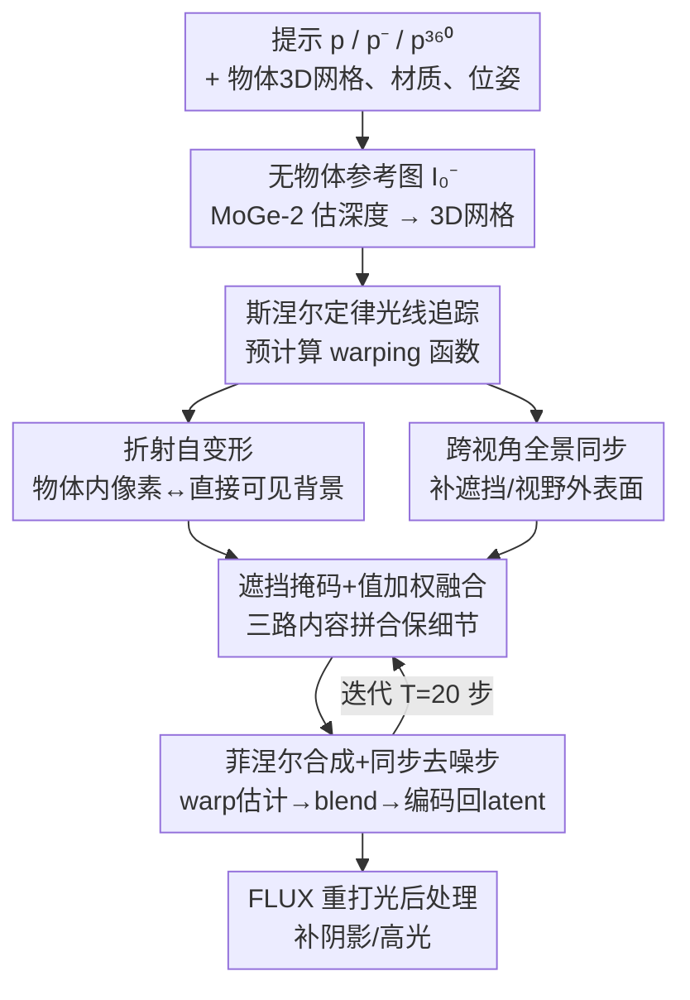

# Refracting Reality: Generating Images with Realistic Transparent Objects

**会议**: CVPR 2026  
**arXiv**: [2511.17340](https://arxiv.org/abs/2511.17340)  
**代码**: 无  
**领域**: 扩散模型 / 图像生成  
**关键词**: 透明物体生成, 折射, 斯涅尔定律, 跨视角同步, 训练无关

## 一句话总结
针对文生图模型画不对透明物体折射的老毛病，本文提出训练无关的 Snellcaster：在 FLUX 生成轨迹的每一步用斯涅尔定律对折射光线做"自变形"，再借一张以透明物体为中心的全景图补上相机看不到的被折射表面，把折射/反射严格约束到物理正确，masked PSNR 从 ~12.7 提到 16.5、LPIPS 从 0.47 降到 0.24。

## 研究背景与动机
**领域现状**：文生图模型（FLUX、SD3.5、Qwen-Image 等）已经能把阴影、镜面高光、透视畸变、纹理布局都画得相当逼真，几乎以假乱真。

**现有痛点**：唯独透明物体——尤其是折射——画得一塌糊涂。模型要么直接"瞎编"透明球里的内容，要么只对背景做个小尺度随意扭曲来糊弄折射，根本没学会光学规律。

**核心矛盾**：折射和反射有本质区别。反射时被间接观察到的表面通常在画面外，模型可以自由"幻觉"补全；但**折射允许同一表面被直接和间接同时看到**——比如沙发上的抱枕既直接成像在画面里，又（带扭曲地）出现在玻璃球内。球内像素的颜色因此被画面其它区域**硬约束**住了，不能乱编。生成模型偏偏就在乱编。

**本文目标**：给定一段文本提示，生成包含单个透明折射物体、且折射物理正确的图像。要解决两个子问题：(1) 让物体边界内、对应到直接可见背景的那些折射像素颜色正确；(2) 让折射/反射光线打到的、相机看不见（被遮挡或在视野外）的表面也能被合理补全。

**切入角度**：作者假设手里有物体的 3D 网格（可来自 text-to-3D）、材质属性（折射率、吸收）和位姿，于是折射光路就能用斯涅尔定律精确算出来，问题从"让模型学物理"变成"在生成时直接把物理约束注入进去"。

**核心 idea**：把"同步生成"（synchronization）用到折射上——在去噪每一步，用斯涅尔定律算出的像素到像素映射，把物体内外的像素、以及一张全景辅助图，warp + blend 到一致，强行让折射满足光学方程。

## 方法详解

### 整体框架
方法名为 **Snellcaster**（因为它发射的是被斯涅尔定律弯折的光线），完全训练无关，基于 FLUX 的 flow-matching 架构。流程分三条线协同：

先用去掉透明物体描述的提示 $p^-$ 生成一张"无物体"参考图 $I_0^-$，用 MoGe-2 估计其深度图 $D^-$ 并转成 3D 网格，再把透明物体网格放到光轴附近的水平面上。生成开始前，通过对这套场景几何做光线追踪，**一次性预计算好所有像素到像素的 warping 函数**（折射、反射、全景互投影），整个去噪过程复用。

然后**并发生成两张图**：主分支按完整提示 $p$（含透明物体）生成透视图 $I_0$；辅助分支按增广提示 $p^{360}$ 生成一张以透明物体位置为中心的等距柱状全景图 $I_0^{360}$。在每个去噪时间步 $t$，对两个分支各算一次 Euler 估计得到干净图 $I_{0|t}$、$I_{0|t}^{360}$（式 5），用预计算的几何对应关系把它们 warp 后 blend，按菲涅尔方程合成折射+反射，再编码回 latent 驱动下一步去噪。最后用一个微调过的 FLUX Kontext 重打光模型做后处理，补上与场景光源一致的阴影和高光。

### 关键设计

**1. 折射自变形：用斯涅尔定律把球内像素锁到背景上**

这是解决"球内像素不能乱编"的核心。作者把光路建模成分段线性函数（折射率分片恒定），从透视相机经每个像素发射光线，穿过前景物体网格时按斯涅尔定律计算折射方向

$$\mathbf{d}_{i+1}=\alpha_i\mathbf{d}_i+\left(\alpha_i\beta_i-\sqrt{\gamma_i}\right)\mathbf{n}(\mathbf{x}_{i+1})$$

其中 $\alpha_i=\nu_i/\nu_{i+1}$ 是相邻材质折射率之比，$\beta_i=-\mathbf{d}_i^\mathsf{T}\mathbf{n}$，$\gamma_i=1-\alpha_i^2(1-\beta_i^2)$；当 $\gamma_i<0$ 发生全内反射，改用反射定律。光线一路折射直到打到背景网格，把交点投回图像平面就得到自变形函数 $\pi^{\text{R}}$，它把物体内部每个像素映射到 $I_0^-$ 里对应的背景位置。生成时直接把干净的无物体图按 $\pi^{\text{R}}(I_0^-)$ 变形，就得到"透过玻璃看到的背景应有的样子"。这一步把折射从"模型幻觉"变成"由真实背景+几何精确决定"，所以才会出现玻璃球里左右上下翻转、边缘径向扭曲这种符合物理的画面。

**2. 跨视角全景同步：用辅助全景图补相机看不到的表面**

折射/反射光线常常打到被遮挡或在画面外的表面，这些像素没有直接约束，模型自由生成时容易跟周围场景对不上。作者的解法是再开一条辅助分支，生成一张**以透明物体为中心的全景图** $I_0^{360}$——它近似了从物体表面各点看出去的周围场景。预计算时，把从透视相机折射出去、打到背景包围盒的光线方向投影到全景上得到 $\pi^{-1}$（全景→透视的折射分量），把反射光线投影得到 $\pi^{-\text{R}}$（反射分量），反过来把全景相机的直射光线投到透视平面得到 $\pi$。去噪每步就用这些函数在两个视角间互相 warp，把全景里"画面外"的内容搬进球内折射区。消融显示这条分支贡献最大（去掉它掉点最多），因为它是球内不可见区域唯一的合理信息来源。

**3. 遮挡掩码 + 值加权融合：把三路内容拼成一张图且保细节**

球内每个像素可能同时有"直接背景折射 $\pi^{\text{R}}(I_0^-)$""全景补全 $\pi^{-1}(I_{0|t}^{360})$""当前透视估计 $I_{0|t}$"三个来源，需要融合。作者用带遮挡掩码的融合算子 $\phi$（式 9–11），它是普通均值与"值加权均值"的凸组合：

$$\phi(\mathcal{X},\mathcal{Y},\lambda)=(1-\lambda)\frac{\sum_i M(\mathcal{Y}_i)\odot\mathcal{Y}_i(\mathcal{X}_i)}{\sum_i M(\mathcal{Y}_i)}+\lambda\frac{\sum_i M(\mathcal{Y}_i)\odot|\mathcal{Y}_i(\mathcal{X}_i)|\odot\mathcal{Y}_i(\mathcal{X}_i)}{\sum_i M(\mathcal{Y}_i)\odot|\mathcal{Y}_i(\mathcal{X}_i)|}$$

$M(\mathcal{Y}_i)$ 是第 $i$ 路 warping 的遮挡掩码，$\lambda=0.5$ 平衡平滑均值与保细节的值加权项（值加权能保住高对比细节，沿用 LookingGlass）。所有 warp 都用拉普拉斯金字塔变形，按 warp 引起的放缩程度从合适分辨率取像素，减少边界伪影和混叠。

**4. 菲涅尔加权合成 + 同步去噪步：把折射反射按视角混合并回灌轨迹**

透明物体同时有折射和反射，二者权重随视角变。作者用反射 warping 把全景 warp 成反射外观 $I_{0|t}^{\text{R}}=\pi^{-\text{R}}(I_{0|t}^{360})$，再按菲涅尔方程在线性色空间混合折射色与反射色：$\mathbf{c}'=\tfrac{1}{2}(R_p+R_s)(\mathbf{c}^{\text{反}}-\mathbf{c}^{\text{折}})+\mathbf{c}^{\text{折}}$，其中 $R_p,R_s$ 是平行/垂直偏振的反射系数（由折射率和入射角决定），最后转回 sRGB。得到同步后的两视角干净估计 $\hat I_{0|t}$、$\hat I_{0|t}^{360}$ 后编码回 latent，用

$$z_{t-1}=z_t+\frac{\sigma_{t-1}-\sigma_t}{\sigma_t}(z_t-\hat z_{0|t})$$

引导下一步去噪，让两个视角在整条轨迹上始终保持一致。这种"每步同步"而非"事后修补"，是物理约束能真正注入扩散过程的关键。

### 损失函数 / 训练策略
方法**完全训练无关**，无任何 loss。基于 FLUX-dev，$T=20$ 步去噪，guidance scale 3.5；透视图 $720\times1280$、全景图 $1024\times2048$；融合系数 $\lambda=0.5$，拉普拉斯金字塔 5 层；在 $[0.2,0.8]T$ 时间步用 time-travel 重复 3 次提升多视角一致性（沿用 LookingGlass）。单卡 A100 80GB。

## 实验关键数据

### 主实验
数据集为 10 条室内外提示 × 5 个变体 × 6 种透明物体（球、柱、锥、狐狸、狗、雕塑）= 300 个场景-物体组合。折射保真度用与 Blender 渲染参考对比的 masked PSNR / masked LPIPS（灰度+直方图匹配后只算折射像素），图文一致性用 CLIP / ImageReward。

| 方法 | CLIP↑ | ImReward↑ | masked PSNR↑ | masked LPIPS↓ |
|------|-------|-----------|--------------|---------------|
| FLUX-dev | 32.36 | -0.20 | 12.68 | 0.48 |
| FLUX.2-dev | 33.37 | 0.18 | 12.15 | 0.48 |
| Qwen-Image | 32.67 | 0.01 | 12.55 | 0.48 |
| SD 3.5 (Large) | 34.56 | 0.08 | 12.25 | 0.53 |
| FLUX Inpaint | 33.44 | -0.47 | 12.66 | 0.47 |
| **Snellcaster (ours)** | 32.85 | -0.32 | **16.51** | **0.24** |

折射相关的两个逐像素指标全面领先：PSNR 比最强 baseline 高出近 4 dB，LPIPS 几乎砍半；同时 CLIP/ImageReward 与各 baseline 持平，说明强加物理约束**没有损害图像质量与文本对齐**。定性上，living room 场景里 FLUX inpaint 在球后完全画不出沙发，karaoke 场景里电视和音箱在球内彻底消失，而 Snellcaster 都能正确折射出来。还在手机拍摄的真实图像对上验证有效（拿无球照片当 $I_0^-$ 从噪声生成带球版本）。

### 消融实验
在 6 个室内场景（artroom、cafe、dining room、kitchen、living room、office）+ 球几何上，重打光前对比：

| 配置 | MAE↓ | PSNR↑ | LPIPS↓ | CLIP↑ | ImgR↑ | 说明 |
|------|------|-------|--------|-------|-------|------|
| Ours (full) | 0.0953 | 18.21 | 0.24 | 34.22 | 0.51 | 完整模型 |
| w/o reflections | 0.0964 | 18.11 | 0.25 | 34.20 | 0.67 | 去反射，掉点轻微 |
| w/o pano sync | 0.0983 | 17.98 | 0.25 | 33.88 | 0.64 | 去全景同步，掉点更多 |
| w/ relighting | 0.1137 | 17.10 | 0.28 | 34.61 | 0.59 | 加重打光后处理 |

### 关键发现
- **全景同步分支贡献最大**：去掉它逐像素指标掉得比去反射更明显，因为它是球内不可见区域（视野外/被遮挡）唯一的合理信息来源；没有它模型只能幻觉，常画出与背景不一致、衔接生硬的内容。
- **反射贡献相对微妙**：折射主导了透明物体外观，反射只是锦上添花，去掉后掉点很小。
- **重打光是"画质 vs 数值"的权衡**：加重打光会让逐像素指标变差（PSNR 18.21→17.10），因为它引入了偏离 ground-truth 的光照/阴影，但 CLIP 反而升到 34.61，且阴影对视觉合理性很重要——数值下降换感知真实。

## 亮点与洞察
- **把"同步生成"迁移到折射约束**：以往 SyncDiffusion/SyncTweedies 用同步做无缝拼接全景，本文用同一思路、但 warping 函数来自斯涅尔定律光线追踪，让球内像素被真实背景几何硬约束——这是从"自由幻觉"到"物理决定"的关键转变。
- **辅助全景图补不可见表面，构思巧妙**：折射会"看到"画面外的东西，直接生成一张以物体为中心的全景，就为球内不可见区域提供了一个自洽的内容来源，比单纯 inpainting 更全局一致。
- **训练无关、即插即用**：整套物理约束在采样轨迹里注入，不动模型权重，理论上可迁移到任何 flow-matching/扩散生成器，思路可推广到其它"生成需满足硬几何/物理约束"的任务（如镜面、水面）。

## 局限性 / 可改进方向
- **假设很强**：只支持单个、不散射、折射率均匀的透明物体，且需要预先拿到物体 3D 网格、材质和位姿（位姿还是启发式放在水平面光轴附近），不能端到端从文本直接搞定。
- **不建模吸收/多材质/双折射**：玻璃染色、玻璃杯里插吸管、冰洲石等都暂不支持，作者列为未来工作。
- **背景几何依赖单目深度**：$I_0^-$ 的几何来自 MoGe-2 估计，深度误差会直接传导到折射 warping，"可见-不可见表面边界"处一致性有限。
- **光照/阴影靠事后重打光**：目前用后处理补，作者期望未来通过光源估计+光线追踪做原生光影。
- **未扩展到视频**：折射在视频生成里是重灾区，但本文只做单图。

## 相关工作与启发
- **vs LookingGlass (Chang et al. 2025)**: 同样用拉普拉斯金字塔 warping 在扩散轨迹里同步多视角，LookingGlass 做的是变形透视（镜面物体上才显出第二张图），本文把这套机制改造去建模真实折射/反射，并新增以物体为中心的全景分支补不可见表面。
- **vs FLUX Inpainting**: inpaint 只在掩码区按周围内容补全，缺乏几何约束，球后内容常凭空乱编（沙发消失、电视不见）；本文用斯涅尔定律精确约束折射映射，球内内容由背景真实决定。
- **vs SyncTweedies / SyncDiffusion**: 它们用同步生成做无缝全景/montage，warping 是简单视角变换；本文的 warping 来自物理光线追踪，约束更强、目标是物理正确而非视觉无缝。
- **vs MirrorFusion / DiffusionLight (反射类)**: 它们针对镜面反射做深度条件 inpainting 或插入铬球估光，处理的是"画面外可幻觉"的反射；折射的难点在于被折射表面同时直接可见、不能幻觉，本文正是补上这一块。

## 评分
- 新颖性: ⭐⭐⭐⭐⭐ 首次把生成图像的折射物理正确性当作核心问题，用斯涅尔定律+全景同步训练无关地注入扩散轨迹，角度新。
- 实验充分度: ⭐⭐⭐⭐ 300 组合系统对比 5 个强 baseline + 真实图验证 + 清晰消融；但数据集仅 10 提示、主文聚焦玻璃球，规模偏小。
- 写作质量: ⭐⭐⭐⭐⭐ 物理推导（斯涅尔/菲涅尔）与 pipeline 讲得清楚，图文对照到位，假设交代诚实。
- 价值: ⭐⭐⭐⭐ 解决了生成模型一个明确且普遍的失败模式，方法可迁移到其它物理约束生成；但强几何假设限制了即时落地。

<!-- RELATED:START -->

## 相关论文

- [\[CVPR 2026\] HiFi-Inpaint: Towards High-Fidelity Reference-Based Inpainting for Generating Detail-Preserving Human-Product Images](hifi-inpaint_towards_high-fidelity_reference-based_inpainting_for_generating_det.md)
- [\[ICML 2026\] Initialization is Half the Battle: Generating Diverse Images from a Guidance Potential Posterior](../../ICML2026/image_generation/initialization_is_half_the_battle_generating_diverse_images_from_a_guidance_pote.md)
- [\[CVPR 2026\] SimLBR: Learning to Detect Fake Images by Learning to Detect Real Images](simlbr_learning_to_detect_fake_images_by_learning_to_detect_real_images.md)
- [\[CVPR 2026\] Beyond Objects: Contextual Synthetic Data Generation for Fine-Grained Classification](beyond_objects_contextual_synthetic_data_generation_for_fine-grained_classificat.md)
- [\[ICML 2025\] Shielded Diffusion: Generating Novel and Diverse Images using Sparse Repellency](../../ICML2025/image_generation/shielded_diffusion_generating_novel_and_diverse_images_using_sparse_repellency.md)

<!-- RELATED:END -->
