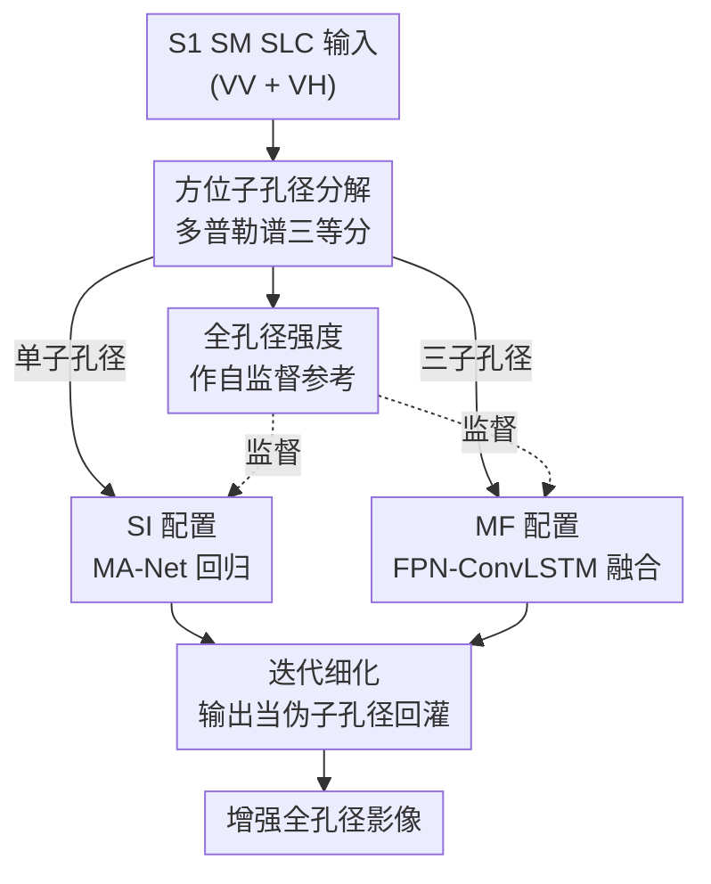

# A Deep Learning Iterative Framework for Sentinel-1 Stripmap Enhancement Based on Azimuth Doppler Decomposition

**会议**: CVPR 2026  
**arXiv**: [2605.29088](https://arxiv.org/abs/2605.29088)  
**代码**: 无（补充材料提供整景推理示例）  
**领域**: 图像恢复 / SAR 遥感 / 自监督学习  
**关键词**: Sentinel-1、SAR 去斑、方位子孔径分解、自监督增强、迭代细化

## 一句话总结
利用方位多普勒子孔径分解，把同一景 SAR 影像拆成多个"低有效方位分辨率"的子孔径作为输入、全孔径影像作为参考，从而无需外部传感器或干净真值就构造出自监督配对，并用单帧/多帧网络 + 迭代细化联合做去斑与细节增强，在 PSNR/SSIM 上稳定超过自监督基线 MERLIN。

## 研究背景与动机
**领域现状**：SAR（合成孔径雷达）能全天时全天候对地观测，Sentinel-1（S1）是全球用得最多的星载 SAR 任务之一。其中 Stripmap（SM）模式分辨率最高（距离×方位约 $5\,\mathrm{m}\times5\,\mathrm{m}$），但仍受相干成像固有的斑点噪声（speckle）困扰，细节常不足以刻画密集人工地物。

**现有痛点**：现有 S1 增强方法大多走"有代理参考的监督学习"路线——要么用高分辨率商业 SAR 做跨传感器监督，要么用不同采集模式互相监督（如 IW→SM）。这些方法都需要额外采集、精确配准，且常依赖专有/受限数据；跨传感器还会引入载频、入射角、处理链差异带来的域偏移，可能产出违背 SAR 物理的伪影。另一条自监督路线（SAR2SAR、MERLIN）虽然不需要干净真值，但**只专注去斑**，不显式处理空间细节恢复。

**核心矛盾**：去斑与保细节之间存在 trade-off——抹平噪声往往以牺牲结构清晰度为代价；而能同时兼顾二者、又物理自洽、又不依赖外部数据的监督信号一直缺位。

**本文目标**：在不引入任何外部传感器、模拟真值或多时相堆栈的前提下，构造物理一致的自监督配对，**联合**解决去斑与空间细节恢复。

**切入角度**：方位子孔径分解是成熟的 SAR 处理技术——把完整方位多普勒谱切成若干子带，各自反变换重建出一幅子孔径影像。关键物理性质是：限制方位带宽会**降低有效方位分辨率、改变斑点实现**，但**不改变地距采样网格**（GSD 不变）。也就是说子孔径影像和全孔径影像天然落在同一张地距网格上，差别只在"高多普勒支撑减少 + 斑点统计不同"。

**核心 idea**：把"子孔径 → 全孔径"建模成同网格增强问题——低有效分辨率的子孔径当输入、全孔径当参考，物理一致地合成 LR/HR 配对，喂给编码-解码网络学增强。

## 方法详解

### 整体框架
方法是一条"从 S1 SM 复数原始产品出发、自监督地造出训练对、再用网络增强、最后可迭代细化"的流水线。输入是 S1 SM 的单视复数（SLC）双极化（VV+VH）数据；通过方位子孔径分解把每景 SLC 拆成 3 个子孔径（有效方位分辨率更低、斑点不同，但与全孔径同网格），并把全孔径强度图当作参考目标——这一步是整篇论文的"监督信号来源"。随后用两种配置学"子孔径→全孔径"映射：单帧（SI）用一个子孔径做像素级回归，多帧（MF）把三个子孔径联合融合。推理时还可把网络输出当"伪子孔径"再回灌 SI，做递归迭代细化，逐步加强去斑（代价是细节流失），从而把去斑—保细节这条 trade-off 曲线显式画出来。

### 关键设计

**1. 方位子孔径分解构造自监督配对：把"无干净真值"变成"同网格 LR→HR"**

核心痛点是 SAR 增强缺监督信号——干净真值几乎不存在，外部参考又带域偏移。本文从子孔径分解的物理性质入手：方位分辨率由合成孔径累积的多普勒带宽 $B_D$ 决定，$B_D\approx 2v/L$、$\rho_a\approx v/B_D=L/2$；若第 $k$ 个子孔径只保留总多普勒带宽的一个比例 $\alpha_k=B_{D,k}/B_D$，其有效方位分辨率退化为 $\rho_{a,k}\approx \rho_a/\alpha_k$，但因为最终地距投影用的是相同的地理编码与重采样算子，空间采样网格不变。具体实现：从产品元数据构建方位频率网格，把方位带宽**无重叠三等分**；对复数 SLC 沿方位做 1-D FFT，做谱归一化与去 Hamming 加权补偿，逐区间提取、重新居中、IFFT 回空间域得到一个复数子孔径 look，最后沿方位做循环移位重新对齐。于是每景就得到三个"低有效方位分辨率 + 不同斑点实现"的子孔径作输入、全孔径强度作参考——配对完全来自传感器自身物理，无需任何外部数据。三等分而非更多份，是因为份数越多每个 look 的多普勒支撑越少、方位分辨率退化越严重，作者据初步实验取折中。

**2. SI/MF 双配置：单帧主攻去斑、多帧主攻保真**

有了配对后，怎么把多个子孔径的互补信息用起来是关键。作者并行考察两种学习配置。单输入 SI 只拿一个子孔径预测全孔径，骨干用 MA-Net（带多尺度注意力的 U-Net 变体）做像素级强度回归；训练时随机从三个子孔径里采一个当输入，以增强对多普勒切分方案的鲁棒性。多帧 MF 则把三个子孔径一起喂入 FPN-ConvLSTM——用特征金字塔做多尺度特征提取、ConvLSTM 跨子孔径序列融合后再解码出强度预测；训练时随机打乱子孔径输入顺序。因为子孔径与全孔径在同一网格上，问题是"同网格增强"而非超分，所以不需要 SR 专用的上采样模块，全卷积编码-解码恰好胜任。两者形成清晰分工：MF 借助跨多普勒谱的多样性互补，结构保真更高（PSNR/SSIM 最好）；SI 信息更少，但去斑更激进（ENL 更高）。

**3. 迭代细化：把输出当伪子孔径递归回灌，显式画出去斑—保细节 trade-off**

既然两种框架都能从子孔径产出增强后的全孔径，能否进一步压斑？作者提出递归推理：把第一遍的增强输出当成一个"伪子孔径"再喂回 SI，重复多次。MF 因为需要三个不同子孔径不能直接迭代，但它的首遍输出可以当迭代起点、之后用 SI 接着细化。这一设计的价值不只在"再涨一点"，更在于它**把 trade-off 量化出来**：每多迭一遍，ENL（去斑程度）单调上升、PSNR/SSIM（保真）单调下降。最实用的甜点是"MF 首遍 + 1 次 SI 细化"——把高保真的 MF 结果往更强去斑方向推一小步，ENL 从 14/13 升到 31/31，同时把 SSIM 稳在 0.789/0.731，比单纯堆 SI 迭代更均衡。

### 损失函数 / 训练策略
训练目标把网络预测 $\hat{y}$ 与全孔径参考 $y$ 用三项加权组合：$\ell_2$ 保真项、$1-\mathrm{SSIM}$ 结构项，以及基于核密度估计（KDE）的分布匹配项：

$$\mathcal{L}=\alpha\,\|\hat{y}-y\|_2^2+\beta\,(1-\mathrm{SSIM}(\hat{y},y))+\gamma\,\mathcal{L}_{\mathrm{KDE}}(\hat{y},y)$$

权重据初步实验取 $\alpha=0.2,\ \beta=0.3,\ \gamma=0.5$（KDE 分布匹配占比最大）。预处理上，SLC 经 SNAP 做精密轨道、辐射定标、地形校正，转 dB 把乘性斑点近似成加性噪声，按全局 0.1/99.9 百分位裁剪后线性缩放到 $[0,1]$。还做了 patch 级直方图匹配，把子孔径输入的后向散射分布对齐到全孔径参考，以保证训练分布与"实际部署用全孔径输入"一致。两配置都用 Adam 训 100 epoch、OneCycle 调度（峰值 lr $10^{-3}$），SI batch 512、MF batch 32，单卡 RTX A5500（24GB）。数据增强限于二面体变换（90°倍数旋转 + 翻转），输入输出同步施加。

## 实验关键数据

数据集为 10 景地理多样的 S1 SM 升轨采集（总面积 162,305.4 km²），按采集级划分避免空间泄漏：训练 5 景（30.16 万 patch）、验证 3 景（21.05 万 patch）、测试 2 景；训练/验证用无重叠 96×96 patch，测试在整景上用 50% 重叠滑窗。评估指标：PSNR、SSIM 衡量对全孔径参考的一致性（注意参考本身含斑，故只是一致性非绝对保真），ENL（等效视数）在 20 个手选均质 ROI 上衡量去斑程度。

### 主实验
SI/MF 与 MERLIN 基线对比（VV/VH 双极化，↑ 越大越好）：

| 方法 | SSIM VV/VH | PSNR VV/VH (dB) | ENL VV/VH |
|------|-----------|------------------|-----------|
| SI | 70.5 / 62.4 | 29.2 / 27.6 | 28 / 26 |
| MF | **84.2 / 78.4** | **30.3 / 28.2** | 14 / 13 |
| MERLIN$_\text{Sub}$ | 63.5 / 45.4 | 19.6 / 12.2 | 66 / 50 |
| MERLIN$_\text{Full}$ | – | – | **294 / 81** |

SI 和 MF 在保真度上都大幅超过把 MERLIN 用在子孔径上的 MERLIN$_\text{Sub}$；MF 取得最高 PSNR/SSIM。MERLIN$_\text{Full}$（直接作用于全孔径）虽然 ENL 极高（294/81），但那是把图抹得过平，并不等于结构保真更好——印证去斑与保真的 trade-off。

### 消融实验（迭代细化逐遍）
以 SI 或 MF 的首遍重建为起点，逐次叠加 SI 细化（VV/VH）：

| 起点 | 额外 SI 遍数 | SSIM VV/VH | PSNR VV/VH | ENL VV/VH |
|------|------|-----------|-----------|-----------|
| SI | 0 | 70.5 / 62.4 | 29.2 / 27.6 | 28 / 26 |
| SI | 2 | 66.2 / 57.1 | 26.3 / 24.7 | 105 / 102 |
| SI | 4 | 61.4 / 51.2 | 24.0 / 22.2 | 274 / 395 |
| MF | 0 | 84.2 / 78.4 | 30.3 / 28.2 | 14 / 13 |
| MF | **1** | 78.9 / 73.1 | 29.2 / 27.8 | 31 / 31 |
| MF | 4 | 63.9 / 55.5 | 24.1 / 22.9 | 213 / 235 |

### 关键发现
- **迭代是把双刃剑**：每加一遍 SI，ENL 单调升、PSNR/SSIM 单调降。SI 起点叠 2 遍能把 ENL 从 28/26 推到 105/102，但 PSNR 从 29.2/27.6 跌到 26.3/24.7、SSIM 从 0.705/0.624 跌到 0.662/0.571。高遍数时 ENL 逼近甚至超过 MERLIN$_\text{Full}$，但保真严重退化、有过平滑风险。
- **甜点是 MF + 1 遍 SI**：把高保真 MF 往去斑方向推一小步，ENL 14/13→31/31，同时 SSIM 稳在 0.789/0.731，是最均衡的工作点；MF 提供跨子孔径互补信息当强基线，再由 SI 细化做正则。
- **真实场景定性验证**：在没有参考的真·全孔径 S1 SM 上，最佳配置 MF$_1$ 结构更锐利，避免了 MERLIN$_\text{Full}$ 的过度平滑（为公平对比，把同一景复制三份喂 MF，杜绝多时相信息）。

## 亮点与洞察
- **把物理性质直接变成监督信号**：子孔径分解"降有效方位分辨率却不改采样网格"这一性质，被精准利用成"同网格 LR→HR 配对"，从而绕开超分上采样模块、也绕开外部参考的域偏移——这是最漂亮的一招，物理自洽且完全可复现。
- **首次把去斑与细节恢复统一在一个自监督配对里**：以往子孔径要么用于去斑、要么用于超分，本文用它同时供给两者，填了文献空白。
- **迭代细化把 trade-off 显式化**：不是简单求"更好"，而是给出一条可调的 ENL↔PSNR 曲线，让运营时能按需求选工作点，这种"可控旋钮"思路可迁移到其他去噪—保真两难任务。
- **可外推性强**：框架不绑定 SM/VV/升轨，作者指出可扩展到其他传感器、采集模式、极化和飞行方向。

## 局限与展望
- ⚠️ **缺绝对真值，评估只是"一致性"**：全孔径参考本身含斑，PSNR/SSIM 衡量的是与含斑参考的一致性而非绝对保真；ENL 又只在均质 ROI 上算，没有单一指标能盖棺定论增强质量好坏。
- **子孔径数固定为 3、未系统消融**：三等分基于"初步实验"，份数对保真/去斑的影响尚未量化，作者列为未来工作。
- **数据规模与覆盖有限**：仅 10 景、只用升轨、SM 采集本身稀少且需专门 tasking；MF 部署需要三景共配准 S1 SM，操作成本更高。
- **下游价值未验证**：增强是否真能提升海事目标检测、地物分类等下游任务，论文只是展望、未实测。
- 改进思路：引入多时相序列强化自监督先验、变化子孔径数做权衡分析、构造更鲁棒的参考目标以支持更全面的定量评估。

## 相关工作与启发
- **vs MERLIN（自监督去斑基线）**：MERLIN 基于盲点/Noise2Noise 思路只做去斑，本文用子孔径配对联合做去斑+细节恢复；结果上本文 PSNR/SSIM 全面更优，MERLIN 仅 ENL 更高（即更"平"但更糊）。区别在监督信号来源：MERLIN 靠噪声独立假设，本文靠子孔径物理一致性。
- **vs 跨传感器/跨模式监督（S1→TerraSAR-X、IW→SM，如 Amieva et al.）**：它们靠外部高分参考或不同采集模式互相监督，受域偏移之苦；本文只用 S1 SM 自身，无跨域偏移、完全可复现。
- **vs 复数域超分的子孔径融合（Dong et al.）**：同样用子孔径但目标是方位超分、需 SR 上采样；本文把问题降为同网格增强、用全卷积编码-解码即可，且把去斑一并纳入。
- **启发**：当某种物理/信号处理变换能"改变退化但保持采样网格"时，就可能被改造成天然的自监督配对生成器——这套思路对其他成像物理明确的传感器（医学、显微、雷达）有借鉴价值。

## 评分
- 新颖性: ⭐⭐⭐⭐ 首次用方位子孔径分解构造自监督配对联合做去斑+细节恢复，物理动机扎实但单个组件多为现成模块拼装。
- 实验充分度: ⭐⭐⭐ 双极化、迭代逐遍、真实场景都覆盖，但仅 10 景数据、缺绝对真值、子孔径数未消融、无下游验证。
- 写作质量: ⭐⭐⭐⭐ 物理推导清晰，trade-off 讲得透，图表自洽。
- 价值: ⭐⭐⭐⭐ 对 Sentinel-1 这种免费高用量数据给出可复现、可运营、不依赖外部数据的增强方案，实用性强。

<!-- RELATED:START -->

## 相关论文

- [\[CVPR 2026\] RAR: Restore, Assess, Repeat - A Unified Framework for Iterative Image Restoration](rar_restore_assess_repeat_a_unified_framework_for_iterative_image_restoration.md)
- [\[CVPR 2026\] DRIFT: Deep Restoration, ISP Fusion, and Tone-mapping](drift_deep_restoration_isp_fusion_and_tone-mapping.md)
- [\[CVPR 2026\] DRFusion: Degradation-Robust Fusion via Degradation-Aware Diffusion Framework](drfusion_degradation_robust_fusion_via_degradation_aware_diffusion_framework.md)
- [\[CVPR 2025\] A Physics-Informed Blur Learning Framework for Imaging Systems](../../CVPR2025/image_restoration/a_physics-informed_blur_learning_framework_for_imaging_systems.md)
- [\[ECCV 2024\] Joint RGB-Spectral Decomposition Model Guided Image Enhancement in Mobile Photography](../../ECCV2024/image_restoration/joint_rgb-spectral_decomposition_model_guided_image_enhancement_in_mobile_photog.md)

<!-- RELATED:END -->
