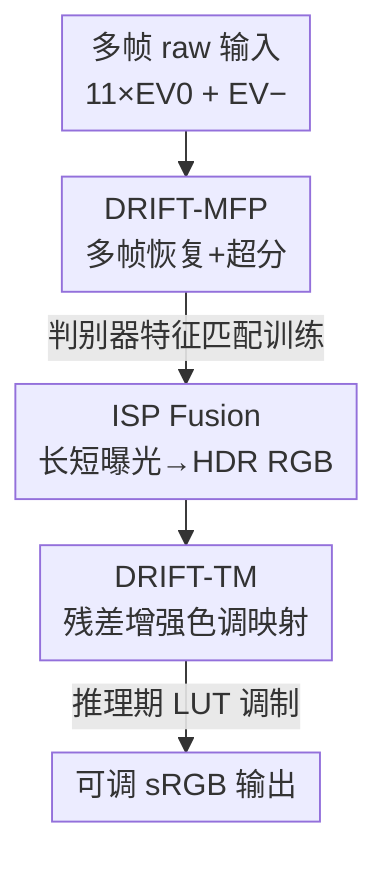

# DRIFT: Deep Restoration, ISP Fusion, and Tone-mapping

**会议**: CVPR 2026  
**arXiv**: [2604.03402](https://arxiv.org/abs/2604.03402)  
**代码**: 无（Samsung Research America）  
**领域**: 图像恢复 / 计算摄影 / 移动端 ISP  
**关键词**: 多帧降噪, 超分辨率, 色调映射(Tone-mapping), 移动端 ISP, 判别器特征匹配

## 一句话总结
DRIFT 把手机相机里"多帧恢复 + HDR 融合 + 色调映射"三段串成一条端到端可在旗舰手机 NPU 上 <4s 跑完的 AI ISP 管线，用判别器特征匹配代替 LPIPS 解决恢复阶段的网格伪影，再用"预测残差增强 + 全局/局部/元数据三编码器"的色调映射网络换来可部署后调参、且跨 tile 一致的高分辨率出图。

## 研究背景与动机
**领域现状**：手机相机的画质几乎全靠 ISP（Image Signal Processor）软件管线撑起来。一张照片从传感器出来是一串带噪的 raw Bayer/Tetra/Hexadeca 帧，要先经多帧处理（MFP：对齐、降噪、去马赛克、可选超分）得到线性 RGB，再做 HDR 融合，最后做色调映射把高动态范围压到屏幕能显示的低动态范围。学术界把这几块当独立任务各自刷点。

**现有痛点**：作者点了两个具体的痛。其一在恢复阶段——为了出锐利结果普遍用感知损失 LPIPS，但 LPIPS 会产生一种"网格状纹理伪影"，它在高纹理区像细节、在天空/平坦区却非常扎眼；偏偏这种伪影还会把 FID/PSNR 刷高，指标好看人眼难受。其二在色调映射阶段——经典 TMO 要全分辨率高 bit-depth 多尺度跑才好看，搬到手机上跑不动；而现有深度色调映射方法计算贵、部署后不能调（想改局部对比度/亮度/HDR 区域得重训），且为省内存按 tile 切片输入时不同 tile 之间色调不一致。

**核心矛盾**：移动端要的是"画质接近离线复杂管线 + 算力/内存吃得消 + 出厂后还能让调校工程师微调风格"，这三者在现有方法里彼此打架——独立优化各模块时，恢复阶段残留的噪声/伪影会在色调映射放大对比度时被进一步放大，最终感知质量崩在 tone-map 之后。

**本文目标**：(1) 恢复阶段去掉 LPIPS 网格伪影同时保持锐度；(2) 色调映射做到可部署后调参 + tile 一致 + 高分辨率可跑；(3) 把恢复与色调映射协同设计（co-design），让整条管线在手机上 <4s 出图。

**切入角度**：作者的两个关键观察——① 冻结的 VGG 和 raw 恢复任务之间存在域差，是 LPIPS 伪影的根源，而训练中持续自适应的判别器内部特征天然贴合恢复任务；② 色调映射不必让网络直接预测最终 RGB，而是让它预测对一个轻量 baseline tone-map 的"残差增强"，把全局颜色/曝光交给 baseline、网络只精修对比度与 HDR 细节。

**核心 idea**：用"判别器特征匹配（Adversarial Perceptual Loss）"替代 LPIPS 来训恢复网络，用"残差增强 + 全局/局部/元数据三编码器 + 推理期 LUT 调制"来做可调可一致的色调映射，并把两者作为一个统一系统协同设计。

## 方法详解

### 整体框架
DRIFT 是一条三段串行的移动相机 ISP：输入是手持拍摄的多帧 raw（11 帧常规曝光 EV0 + 短曝光 EV−），输出是最终 sRGB 色调映射图像。第一段 **DRIFT-MFP** 对每种曝光做多帧对齐/降噪/去马赛克/超分，各输出一张恢复后的 RGB；第二段 **ISP Fusion** 把长曝光（EV0）与短曝光（EV−，曝光为 1/8）融合成单帧 HDR RGB；第三段 **DRIFT-TM** 在 HDR RGB 上做高效色调映射出最终图，且推理时可接收调参输入（contrast / HDR / 曝光）实时改风格。三段并非各自为政，而是协同设计——DRIFT-TM 会根据输入与 DRIFT-MFP 输出的噪声水平调整对比度增强强度，避免在天空等平坦区把残噪当细节放大。

### 关键设计

**1. DRIFT-MFP：用 NAFNet 做多帧恢复，靠"判别器特征匹配"代替 LPIPS 去伪影**

恢复阶段要同时干对齐、降噪、去马赛克、超分四件事，痛点是用 LPIPS 出来的图会带网格伪影。作者把核心架构选成 NAFNet——它没有非线性激活、只用简单归一化和卷积，11 帧 RGB（33 通道）进、单张 RGB 出，且不依赖 Snapdragon NPU 不原生支持的 deformable conv，也不用 Restormer 那种慢到不可接受的 transformer 块，所以适合上手机；超分则是把低分输入先双线性放大再喂进网络，不动核心结构。真正的创新在损失：LPIPS 用的是冻结的 ImageNet VGG，和 raw 恢复任务有域差，且冻结网络下若生成图与 GT 在 VGG 激活相近会过早收敛，于是产生伪影。作者改用 PatchGAN 判别器的**前激活特征**（pre-activation，因为 ReLU/Sigmoid 后激活会把信息压没、对恢复任务信息量低）逐层做 L1 匹配，定义 Adversarial Perceptual Loss：

$$\mathcal{L}_{APL} = \sum_{i=1}^{N} \left\| F_{D_i}(G(x)) - F_{D_i}(y) \right\|_1$$

其中 $F_{D_i}$ 是判别器第 $i$ 层特征。判别器在训练中持续自适应、对生成图与 GT 的差异越来越敏感，因此其特征天然贴合恢复任务，这是首次把判别器特征匹配用在 raw 多帧恢复上。生成器总目标为 $\mathcal{L}_G = \mathcal{L}_{data} + \lambda_1 \mathcal{L}_{GAN} + \lambda_2 \mathcal{L}_{APL}$，其中 $\mathcal{L}_{data}$ 用 L1（比 L2 更锐）

**2. ISP Fusion：短曝光对齐去鬼影做 HDR**

为做 HDR，除 EV0 还额外拍一张曝光只有 1/8 的 EV− 帧，用单应性估计把它对齐到 EV0 参考帧，再按 Mertens 曝光融合把恢复后的长曝光 RGB 与短曝光融合成单帧 HDR；曝光之间因局部运动产生的不匹配用一个 de-ghosting 步骤处理。这一步是连接恢复与色调映射的桥梁——它产出的线性 HDR RGB 正是 DRIFT-TM 的输入

**3. DRIFT-TM：预测"对轻量 baseline 的残差增强"而非直接出 RGB，换来可调与稳定**

直接让网络预测最终 RGB 既难训、又一旦部署就改不动。作者做功能分解：先用一个非 DL 的 **Tone-map Lite** 算出近似参考管线"质感"的轻量结果（预测分别对应最暗/最亮合成曝光的两张图 $(S_0^Y,S_0^C)$ 和 $(S_1^Y,S_1^C)$，Y/C 为亮度/色度），网络只负责预测**融合权重图与增益图**这类残差增强，把全局颜色/曝光交给 Lite、自己精修对比度和 HDR 细节。训练用一个计算很贵的非 DL 参考 tone-map 当老师，网络学的是从 Lite 到参考之间的残差，学起来更稳。推理时这些权重/增益图可被 LUT 调制（见下一个设计），从而不重训就能调风格。最终 YCbCr 融合为 $I^Y = \tilde{W}^Y \odot \tilde{S}_0^Y + (1-\tilde{W}^Y)\odot \tilde{S}_1^Y$，再乘调制后的对比增益 $\tilde{I}^Y = I^Y \odot \tilde{G}$

**4. 全局/局部/元数据三编码器：根治 tile 不一致并适配多传感器**

手机内存有限，高分辨率图得按 tile 切，痛点是逐 tile 跑会导致 tile 间色调跳变。DRIFT-TM 用三路编码器拆解这个问题：**局部编码器**对每个全分辨率 tile 各跑一次拿局部特征；**全局编码器**对整图的低分辨率版本只跑一次，把全局信息（亮度/色彩分布）注入每个 tile，即便网络感受野小也能保证 tile 间一致、消除 tiling 伪影；**元数据编码器**对整帧只跑一次，把 ISO、曝光时间（归一化）、传感器/管线类型（one-hot）编码进去——因为传感器类型和光照强烈影响噪声水平与期望增强量，喂进元数据让一个网络就能横跨多种拍摄条件和传感器。三者协同使轻量网络也能出全局一致的高分辨率结果

### 损失函数 / 训练策略
DRIFT-MFP 数据集靠"三脚架拍干净 GT + 真实手抖单应性合成运动"构造：用 Galaxy S24 Ultra 三脚架拍 1300 组配对 12MP 图，GT 由 11 张低 ISO（固定 50）长曝光帧平均+去马赛克得到；再单独采 1200 组手持 11 帧捕获、算出每帧到参考帧的全局单应性来建模真实手抖，并按 10 个一组采样保留手抖的时间相关性（不同于 Khan et al. 各帧独立随机采样），施加到三脚架数据上合成带真实噪声+手抖的输入；超分任务把输入再双线性下采 4×。

DRIFT-TM 用 Galaxy S25/S25 Ultra 跨光照采 2000 张手持 12MP raw，处理成 HDR 线性 RGB 后过参考 tone-map 生成配对，训练取 512×512 patch。其损失最关键的设计是**训练时把参考 tone-map 跑两遍**：关闭对比增强块得 $y_0$、打开得 $y_1$，让网络对两路输出（带/不带对比增强）分别监督：

$$\mathcal{L} = \sum_{t\in\{L1,SSIM\}} \mathcal{L}_t(I, y_0) + \mathcal{L}_t(\tilde{I}, y_1)$$

用两个 GT 同时约束，使网络学到"HDR/亮度调整"与"局部对比度调整"两个正交操作，从而推理时用 LUT 调制权重/增益图就能各自独立、定向地调 HDR 或对比度。

## 实验关键数据

### 主实验
多帧降噪（150 张 12MP held-out 测试集，所有 baseline 在同数据集重训）：

| 方法 | LPIPS↓ | FID↓ | PSNR↑ | SSIM↑ |
|------|--------|------|-------|-------|
| Burstormer | 0.04 | 6.18 | 37.06 | 0.98 |
| NAFNet (L1+GAN+LPIPS) | 0.04 | 6.23 | 37.55 | 0.97 |
| **DRIFT-MFP** | 0.05 | 10.73 | 37.49 | 0.97 |

指标上 DRIFT-MFP 并非样样第一（NAFNet+LPIPS 的 FID 更低），但作者论证 LPIPS 的低 FID 来自肉眼难受的网格伪影；用户研究（11 位画质专家、60 个随机 crop）佐证：

| 偏好 | DRIFT-MFP | 持平 | NAFNet |
|------|-----------|------|--------|
| 占比 | **63.0%** | 8.8% | 28.2% |

色调映射——非参考对比（TMQI 指标，越高越好，GT 即参考 tone-map）：

| 方法 | TMQI-Q | TMQI-S | TMQI-N |
|------|--------|--------|--------|
| TMO-GAN | 0.801 | 0.757 | 0.253 |
| **DRIFT-TM** | **0.845** | **0.791** | **0.421** |
| GT（参考） | 0.847 | 0.792 | 0.432 |

DRIFT-TM 在三个分量上都最贴近 GT，几乎逼平参考管线。

### 消融实验
色调映射"匹配参考"对比 + 消融（100 张 held-out，PSNR/SSIM 为与参考 tone-map 的相似度）：

| 配置 | PSNR↑ | SSIM↑ | 说明 |
|------|-------|-------|------|
| LLF-LUT | 30.89 | 0.95 | 直接预测 RGB 的 SOTA |
| TMO-GAN | 30.83 | 0.96 | DL tone-map SOTA |
| DRIFT-TM (w/o maps) | 34.06 | 0.98 | 去掉残差权重/增益图 |
| DRIFT-TM (w/o global & meta) | 39.66 | 0.99 | 去全局编码器+元数据 |
| DRIFT-TM (w/o meta) | 40.43 | 0.99 | 仅去元数据 |
| **DRIFT-TM (Full)** | **40.59** | **0.99** | 完整模型 |

### 关键发现
- **残差学习贡献最大**：从直接出 RGB（LLF-LUT/TMO-GAN ≈30.8）到预测残差（w/o global&meta 已 39.66），PSNR 跳了近 9dB，说明"让网络只学残差增强"是色调映射稳健匹配参考的关键。
- **全局编码器 + 元数据各有增益**：去掉全局/元数据掉到 39.66、仅去元数据掉到 40.43，验证全局信息消除 tiling 伪影、元数据适配传感器/光照各自有用；错误元数据非灾难性但会降精度。
- **协同设计有效**：DRIFT-MFP 与 DRIFT-TM 联合设计后，能根据噪声水平调对比增强强度，明显减少天空区的噪声/伪影放大（Fig. 9）。
- **移动端实测**：Snapdragon 8 Elite NPU 上，11 帧 12MP burst 恢复 3.2s，DRIFT-TM 0.5s（Tone-map Lite 与调参在 CPU 上与 NPU 并行，只剩最后一个 tile 可见耗时），全程 <4s。

## 亮点与洞察
- **判别器特征匹配代替 LPIPS**：抓住"冻结 VGG 与 raw 恢复有域差、且会过早收敛产伪影"这个根因，改用持续自适应、且取前激活特征的判别器做感知损失——这是把 LPIPS 网格伪影问题从根上解决，而非靠后处理擦伪影。
- **"残差增强 + 双 GT 监督"换来可调性**：让网络学 Lite→参考的残差、再用两路（带/不带对比增强）GT 把 HDR 与对比度解耦成正交操作，于是部署后用 LUT 就能定向调风格而不重训——对需要风格调校的量产相机极有价值。
- **全局编码器治 tiling 一致性**：用一次低分辨率全图编码把全局信息注入每个 tile，是用极小代价解决"切片省内存"与"色调一致"矛盾的巧思，可迁移到任何按 tile 处理的高分辨率移动视觉任务。
- **用真实单应性合成手抖且保留时间相关性**：按组采样手抖单应性而非各帧独立随机，是更贴近真实手持运动的数据合成 trick，可复用于多帧/burst 类任务的数据构造。

## 局限与展望
- **以"匹配参考管线"为目标**：DRIFT-TM 的色调映射上限被那条计算昂贵的非 DL 参考 tone-map 锁死，本质是用 AI 高效复刻参考风格，而非超越人眼最优；参考管线本身不好，网络也只能学到不好的风格。
- **强依赖三星自家硬件与标定**：数据全用 Galaxy S24/S25 系列采集，传感器噪声特性、元数据编码都贴着特定芯片/管线，跨厂商泛化未验证。
- **未开源、复现门槛高**：无代码，且依赖私有参考 tone-map 和移动端部署栈，外部复现困难。
- **指标与人眼的张力未彻底化解**：DRIFT-MFP 在 FID 上输给 LPIPS 版本，作者用 user study 圆场，但这也暴露当前感知指标本身仍会奖励伪影——更可靠的 raw 恢复评测指标仍是开放问题。

## 相关工作与启发
- **vs NAFNet (L1+GAN+LPIPS)**：两者同用 NAFNet 骨干，区别在感知损失——NAFNet 用冻结 VGG 的 LPIPS，FID 更低但产网格伪影；DRIFT-MFP 用判别器特征匹配，指标略逊但 user study 63% 胜出，核心差异是"用任务自适应特征还是冻结分类特征做感知约束"。
- **vs Burstormer / BIPNet / Restormer**：这些用 deformable conv 或 transformer 做多帧对齐，作者发现 NAFNet 即便不加本文损失也在指标上超过 Burstormer/BIPNet，且更适合 NPU 部署（deformable conv 不被原生支持、transformer 太慢）；Restormer 在大全局运动下配准更好（全局感受野），是 DRIFT-MFP 在剧烈全局运动场景下的潜在短板。
- **vs LLF-LUT / TMO-GAN（直接预测 RGB 的色调映射）**：它们让网络直接出最终图，匹配参考 PSNR 仅 ~30.8；DRIFT-TM 改成预测残差增强 + 全局/局部/元数据三编码器，PSNR 升到 40.59 且支持部署后调参与 tile 一致，是"功能分解 + 残差学习"对"端到端直出"的胜利。

## 评分
- 新颖性: ⭐⭐⭐⭐ 判别器特征匹配用于 raw 多帧恢复属首次，残差增强+三编码器的可调色调映射设计也有巧思，但单点都建立在已有组件上
- 实验充分度: ⭐⭐⭐⭐ 主实验+消融+用户研究+移动端实测齐全，但全在三星自家设备、未开源，跨硬件泛化缺验证
- 写作质量: ⭐⭐⭐⭐ 动机与设计动机讲得清楚，公式与系统图完整；部分模块（如 Lite 的具体合成曝光算法）略简
- 价值: ⭐⭐⭐⭐ 直击量产移动相机的实际痛点（伪影、可调、tile 一致、<4s 上端），工程落地价值高

<!-- RELATED:START -->

## 相关论文

- [\[CVPR 2026\] Customized Fusion: A Closed-Loop Dynamic Network for Adaptive Multi-Task-Aware Infrared-Visible Image Fusion](customized_fusion_a_closed-loop_dynamic_network_for_adaptive_multi-task-aware_in.md)
- [\[CVPR 2026\] DRFusion: Degradation-Robust Fusion via Degradation-Aware Diffusion Framework](drfusion_degradation_robust_fusion_via_degradation_aware_diffusion_framework.md)
- [\[CVPR 2026\] A Deep Learning Iterative Framework for Sentinel-1 Stripmap Enhancement Based on Azimuth Doppler Decomposition](a_deep_learning_iterative_framework_for_sentinel-1_stripmap_enhancement_based_on.md)
- [\[CVPR 2026\] EVLF: Early Vision-Language Fusion for Generative Dataset Distillation](evlf_early_vision-language_fusion_for_generative_dataset_distillation.md)
- [\[CVPR 2026\] ReflexSplit: Single Image Reflection Separation via Layer Fusion-Separation](reflexsplit_single_image_reflection_separation_via_layer_fusion-separation.md)

<!-- RELATED:END -->
