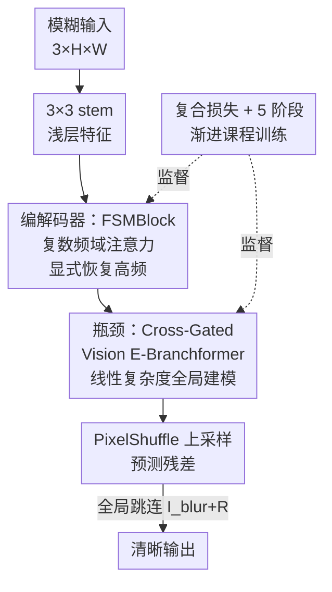

# FSM-Net: An Efficient Frequency-Spatial Network for Real-World Deblurring

**会议**: CVPR2026 (NTIRE 2026 Efficient Real-World Deblurring Challenge 亚军方案)  
**arXiv**: [2605.31400](https://arxiv.org/abs/2605.31400)  
**代码**: 无（论文未提供）  
**领域**: 图像恢复 / 真实世界去模糊  
**关键词**: 高效去模糊、频域注意力、E-Branchformer、NAFNet、Pareto 前沿  

## 一句话总结
FSM-Net 在轻量化 NAFNet 主干上插入「复数频域注意力 FSMBlock」与「交叉门控 Vision E-Branchformer 瓶颈」，用频域+空域双路解耦显式恢复运动模糊丢失的高频结构，仅 4.94M 参数、159.35 GMACs 就在 RSBlur 上拿到 33.144 dB PSNR，斩获 NTIRE 2026 高效去模糊挑战赛亚军。

## 研究背景与动机
**领域现状**：真实世界图像去模糊是计算摄影、自动驾驶等下游任务的关键预处理。近年 SOTA 被 SwinIR、IPT、MAXIM、Restormer 这类 ViT/大 CNN 主导，PSNR 不断刷新，但代价是动辄几十 M 参数和与分辨率平方相关的自注意力开销。

**现有痛点**：NTIRE 2026 高效去模糊挑战赛把规则掰向了另一端——必须在严格的算力/延迟预算内做高保真恢复。标准自注意力复杂度 $\mathcal{O}(H^2W^2C)$ 在 1920×1200 的高分辨率上根本扛不住；而纯空域的轻量卷积网络（往届冠军路线）又难以建模长程、非均匀的运动模糊轨迹，常常牺牲局部结构细节。

**核心矛盾**：高保真恢复与低算力之间存在 trade-off，全局上下文建模与局部细节恢复又难以兼得。更关键的一个被忽视的观察是：严重运动模糊本质上是一个**低通滤波器**，它在频域里同时引入相位偏移和高频衰减，而纯空域卷积有强烈的空间偏置，对这种全局频域退化建模既不高效也不充分。

**本文目标**：在挑战赛的算力红线内，把恢复质量推到 Pareto 前沿，具体拆成两件事——(1) 显式把模糊丢失的高频结构找回来；(2) 用线性复杂度建模全局上下文。

**切入角度 / 核心 idea**：既然模糊是频域退化，那就**把频域处理显式搬进网络**——在频域用可学习的复数权重同时调制幅度和相位，再用一个局部/全局双分支的 E-Branchformer 以线性复杂度补全局上下文，从而在不放大 MACs 的前提下扩张表征能力。

## 方法详解

### 整体框架
FSM-Net 基于 U 形 4 级 NAFNet 编解码结构，输入一张模糊图 $\mathbf{I}_{blur}\in\mathbb{R}^{3\times H\times W}$，经 $3\times3$ 卷积 stem 投影到浅层特征。编码器用 stride-2 卷积逐级下采样（通道翻倍、分辨率减半），编解码器各层全部由本文的 **FSMBlock（频域-空域多分支块）** 堆叠；在感受野最大、空间分辨率被压缩的瓶颈处插入 **Cross-Gated Vision E-Branchformer** 序列做长程依赖建模；解码器用 PixelShuffle 上采样避免棋盘格伪影，最后 $3\times3$ 卷积预测残差，再通过全局跳连 $\mathbf{I}_{sharp}=\mathbf{I}_{blur}+\mathbf{R}_{pred}$ 得到清晰图。整个网络靠一个跨空域/结构/频域的复合损失 + 5 阶段渐进式课程训练来稳定收敛。

### 关键设计

**1. FSMBlock：用复数频域注意力把模糊吃掉的高频显式补回来**

痛点直说：运动模糊是低通滤波器，把高频结构衰减掉、还伴随相位偏移，纯空域卷积既偏置又低效。FSMBlock 的做法是：输入先过 LayerNorm + $1\times1$ 升维，再用一个大 $7\times7$ 深度卷积捕捉长模糊轨迹，得到 $\mathbf{X}$ 后沿通道劈成两半 $\mathbf{X}_1,\mathbf{X}_2$。其中 $\mathbf{X}_2$ 走 Frequency Attention：先用 2D 实数快速傅里叶变换 $\mathcal{F}(\mathbf{X}_2)$ 进频域，乘上一个**可学习的复数权重** $\mathbf{W}_c\in\mathbb{C}^{1\times C'/2\times1\times1}$，即 $\mathbf{Z}_{fft}=\mathcal{F}(\mathbf{X}_2)\odot\mathbf{W}_c$，再逆变换回空域得到 $\tilde{\mathbf{X}}_2$。

为什么有效：和只缩放幅度的实数谱滤波不同，复数权重能**同时调制幅度（对比度）和相位（结构）**。模糊本质就是相位偏移 + 频率相关衰减，所以这种双调制刚好能把错位的结构分量重新对齐、把被压制的高频放大，对真实非均匀模糊里的 ghosting 伪影尤其关键。之后频域分支与空域恒等分支用门控融合 $\mathbf{X}_{gate}=\mathbf{X}_1\odot\tilde{\mathbf{X}}_2$，再过一个简化通道注意力 SCA（全局平均池化得通道描述子 $\mathbf{s}_c=\frac{1}{HW}\sum_{h,w}\mathbf{X}_{gate}(c,h,w)$，$1\times1$ 卷积重标定），投影回原通道并带可学习缩放 $\beta$ 残差相加，最后再过一个带 SimpleGate 的 FFN（缩放 $\gamma$）。整块复杂度只有 $\mathcal{O}(N\log N)$，严守效率红线

**2. Cross-Gated Vision E-Branchformer：线性复杂度的局部/全局双分支瓶颈**

痛点：瓶颈处需要全局上下文来解大尺度模糊，但标准自注意力 $\mathcal{O}(H^2W^2C)$ 太贵，移窗变体感受野又不够。作者借鉴语音里的 E-Branchformer，把归一化输入劈成两条互补分支并行处理：**局部 CNN 分支**用倒瓶颈结构（$1\times1$ 升维 → $7\times7$ 深度卷积 → GELU → $1\times1$ 投影）精修细粒度纹理得 $\mathbf{F}_{loc}$；**全局注意力分支**用 4-head 转置注意力，QKV 先由 $3\times3$ 深度卷积生成注入局部归纳偏置，再在**通道维**（而非空间维）算协方差 $\mathbf{F}_{glob}=\text{Softmax}(\hat{\mathbf{Q}}\hat{\mathbf{K}}^T\cdot\tau)\mathbf{V}$（借鉴 Restormer），把复杂度从 $\mathcal{O}(H^2W^2C)$ 降到 $\mathcal{O}(HWC^2)$。

精髓在 **Cross-Gating（交叉门控）**：让两条分支互相为对方生成门控，$\mathbf{F}'_{loc}=\mathbf{F}_{loc}\odot\sigma(\mathbf{F}_{glob})$、$\mathbf{F}'_{glob}=\mathbf{F}_{glob}\odot\sigma(\mathbf{F}_{loc})$（$\sigma$ 为 Sigmoid）。这意味着全局上下文去调制局部纹理、局部细节又反过来约束全局响应，实现双向信息交换，而不是简单拼接。增强后的特征拼接、$1\times1$ 投影、SimpleGate 精炼，再带可学习缩放残差接回主干。这样在保持亚秒级推理的同时拿到了真正的全局感受野

### 损失函数 / 训练策略
总损失为三项加权组合 $\mathcal{L}_{total}=w_1\mathcal{L}_{MSC}+w_2\mathcal{L}_{Edge}+w_3\mathcal{L}_{FFT}$：

- **多尺度 Charbonnier 损失** $\mathcal{L}_{MSC}$：在 $s\in\{1,0.5,0.25\}$ 三个尺度上 $\sqrt{(\hat{\mathbf{I}}_{s,i}-\mathbf{I}_{s,i})^2+\epsilon^2}$（$\epsilon=10^{-12}$），保证空间保真，兼顾粗结构与细纹理。
- **结构边缘损失** $\mathcal{L}_{Edge}=\mathbb{E}[\|\Delta\hat{\mathbf{I}}-\Delta\mathbf{I}\|_2^2]$：用 Laplacian 算子 $\Delta$ 提边缘后算 MSE，惩罚模糊边界、逼锐利过渡。
- **频率一致性损失** $\mathcal{L}_{FFT}=\mathbb{E}[\|\log(1+|\mathcal{F}(\hat{\mathbf{I}})|)-\log(1+|\mathcal{F}(\mathbf{I})|)\|_1]$：在傅里叶幅度的对数域上算 $\mathcal{L}_1$，对数缩放让网络对高频细微差异敏感。

训练用 AdamW（$\beta_1=0.9,\beta_2=0.999$，weight decay $10^{-4}$，lr 从 $10^{-4}$ Cosine 退火到 $10^{-6}$），全程 AMP float16，EMA 衰减率 0.999 平滑权重。**5 阶段渐进课程**（共 400 epoch，单卡 RTX 5090）：Phase 1（0–20 ep，512²，只开 $\mathcal{L}_{MSC}$）建立稳定空间映射 → Phase 2（20–120 ep，512²，开边缘 $w_2{=}0.01$、频率 $w_3{=}0.005$）→ Phase 3（120–220 ep，crop 升到 1024² 学长程轨迹）→ Phase 4（220–290 ep，1280×720，损失权重加到 $w_2{=}0.05,w_3{=}0.01$）→ Phase 5（290–400 ep，近原始 1920×1200 收敛）。网络基宽 $C=16$，编码深度 $[1,1,1,24]$、解码 $[1,1,1,1]$，瓶颈 2 个 E-Branchformer——这种非对称设计把深度算力集中在低分辨率层以压算力。

## 实验关键数据

### 主实验
在 RSBlur（NTIRE 2026 官方数据集，3360 对真实模糊/清晰图）公开测试集上，FSM-Net 以单次前向（无 TTA）拿到 33.16 dB / 0.8533 SSIM，参数仅 4.94M，远小于 MPRNet（20.1M）、Uformer-B（50.9M）等重型网络。

| 方法 | 参数(M) | RSBlur PSNR/SSIM | RealBlur-R | RealBlur-J | GoPro |
|------|---------|------------------|------------|------------|-------|
| SRN-Deblur | 3.76 | 32.53 / 0.8398 | 38.65 / 0.9652 | 31.38 / 0.9091 | 28.36 / 0.9150 |
| NAFNet-C16-L28 | 4.35 | 32.42 / 0.8400 | - | - | - |
| MiMO-UNet+ | 16.1 | 33.37 / 0.8560 | - | - | - |
| MPRNet | 20.1 | 33.61 / 0.8614 | - | - | 30.96 / 0.9390 |
| Restormer | 26.1 | 33.69 / 0.8628 | - | - | 31.22 / 0.9420 |
| Uformer-B | 50.9 | 33.98 / 0.8660 | - | - | 30.83 / 0.9520 |
| **FSM-Net** | **4.94** | **33.16 / 0.8533** | 36.95 / 0.9585 | 29.45 / 0.8840 | 30.60 / 0.9068 |

挑战赛排行榜（公开测试阶段，按 PSNR 排名）FSM-Net 列**第 2**，仅次于 jingjing 的 33.390 dB；且比卫冕的 2025 冠军 licheng（今年第 4，32.805 dB）高出 +0.339 dB。延迟方面在 TTA ×4 集成下仅 0.276s，远快于第 8 名 geometric_ai 的 0.78s。

| 排名 | 队伍 | PSNR↑ | SSIM↑ | Time(s)↓ |
|------|------|-------|-------|----------|
| 1 | jingjing et al. | 33.390 | 0.8585 | N/A |
| **2** | **RobinLy (本文)** | **33.144** | **0.8516** | **0.276** |
| 3 | weichow | 32.883 | 0.8467 | N/A |
| 4 | licheng（2025冠军）| 32.805 | 0.8473 | N/A |
| 8 | geometric_ai | 32.216 | 0.8371 | 0.78 |

> ⚠️ 注意：跨数据集 RealBlur/GoPro 结果是从 RSBlur 预训练权重仅微调 5 epoch 得到的，与在这些域上专门训练的 baseline 不完全可比；表 1 排行榜的 33.144 是 TTA ×4 结果，表 2 的 33.16 是无 TTA 单次前向，两者数值口径不同。

### 消融实验
组件消融（高分辨率 1920×1200 下加速训练 20 epoch，3360 张全测试集）：

| 配置 | FAttn | Ebranch | 参数(M) | MACs(G) | PSNR↑ | SSIM↑ | LPIPS↓ |
|------|-------|---------|---------|---------|-------|-------|--------|
| Baseline (NAFNet) | × | × | 4.35 | 146.33 | 31.39 | 0.8175 | 0.3557 |
| + FAttn | ✓ | × | 4.66 | 155.66 | 31.57 | 0.8217 | 0.3494 |
| + Ebranch | × | ✓ | 4.93 | 159.35 | 31.60 | 0.8216 | 0.3478 |
| **FSM-Net** | ✓ | ✓ | 4.94 | 159.35 | **31.83** | **0.8282** | **0.3456** |

TTA 策略消融（RSBlur 全测试集，RTX 5090）：

| TTA | 变换 | PSNR↑ | SSIM↑ | Time(s)↓ |
|-----|------|-------|-------|----------|
| ×1 | 无 | 33.006 | 0.8500 | 0.069 |
| ×2 | + 水平翻转 | 33.105 | 0.8510 | 0.138 |
| ×3 | + 垂直翻转 | 33.135 | 0.8515 | 0.207 |
| ×4 | + 对角翻转 | 33.144 | 0.8516 | 0.276 |

### 关键发现
- **双路是真互补，不是冗余**：单加 FAttn 涨 +0.18 dB、单加 Ebranch 涨 +0.21 dB，但两者合体涨 **+0.44 dB**，严格超过各自边际增益之和——说明频域与空域分支学到的是正交退化特征，存在非线性协同。
- **协同代价极小**：从 baseline 到完整 FSM-Net 只多了 +0.59M 参数、+13.02 GMACs，却换来明显的 PSNR/LPIPS 提升，验证双域设计是在算力红线内扩张表征能力。
- **延迟可弹性调节**：TTA ×4 用加权混合（原图权重 0.4、每个增强 0.2）而非朴素平均，保住原始空间线索；不改架构就能在 0.07s–0.28s 间按延迟预算自由权衡。

## 亮点与洞察
- **复数权重同时调相位+幅度**最巧妙：抓住「模糊=相位偏移+频率衰减」这一物理本质，用一个 $\mathbb{C}^{1\times C'/2\times1\times1}$ 的可学习复数权重就把传统实数谱滤波只能缩放幅度的短板补上，且开销极低。
- **把语音里的 E-Branchformer 搬到视觉去模糊**，并配上交叉门控让局部/全局双向调制——这种「双分支 + 互门控」的范式可迁移到其他需要兼顾局部纹理和全局上下文的 low-level 视觉任务（超分、去雨、去雾）。
- **转置注意力换维度**：把注意力从空间维挪到通道维，复杂度从 $\mathcal{O}(H^2W^2C)$ 降到 $\mathcal{O}(HWC^2)$，是高分辨率下做全局建模的实用技巧。
- 「+0.44 > 0.18+0.21」的超加性消融论证干净，是说明模块互补性的好范例。

## 局限与展望
- **比赛特化，强依赖工程**：5 阶段课程训练 + EMA + TTA 加权混合等技巧叠满，单纯架构（无 TTA 33.16 dB）相比第一名仍有差距（33.390），方法本身的天花板与训练工程的贡献没有完全拆开。
- **跨域结果不完全可比**：RealBlur-J 只有 29.45 dB，低于 SRN-Deblur 的 31.38，且只微调 5 epoch，泛化能力的结论需谨慎；GoPro 也未超过 Restormer/Uformer。
- **未开源**：论文未给代码，复数频域注意力、交叉门控的实现细节（如 SCA 是否带降维、复数乘法的具体实现）需以原文为准。
- 改进方向：把频域注意力扩展到多频带分解、或让复数权重随空间位置变化（当前是 $1\times1$ 全局共享），可能更好处理非均匀模糊。

## 相关工作与启发
- **vs NAFNet**：本文以 NAFNet 为主干和 baseline，保留 SimpleGate/SCA 的轻量原则，但通过频域注意力 + E-Branchformer 显著增强表征；消融里 NAFNet baseline 31.39 → FSM-Net 31.83 dB。
- **vs Restormer**：复用了 Restormer 的通道维转置注意力来降复杂度，但 Restormer 26.1M 参数走重型路线，本文只用 4.94M，定位在效率前沿。
- **vs 往届纯空域冠军（licheng）**：作者论点是纯空域架构难建模长程非均匀模糊轨迹，本文用频域解耦打破其性能天花板，+0.339 dB 验证双域范式优势。
- **vs FFC / FDA 等频域方法**：同样用 FFT 调制幅度/相位，但本文是 block 级即插即用的复数注意力，并与空域门控、E-Branchformer 协同，而非单纯频域卷积。

## 评分
- 新颖性: ⭐⭐⭐⭐ 复数频域注意力 + 视觉交叉门控 E-Branchformer 的组合在去模糊里较新，但多为已有模块的巧妙拼装
- 实验充分度: ⭐⭐⭐ 主结果/排行榜/组件消融/TTA 消融齐全，但跨域评测口径不一致、缺与同算力方法的更系统对比
- 写作质量: ⭐⭐⭐⭐ 动机（模糊=低通滤波器）清晰，公式与超加性论证扎实，图表完整
- 价值: ⭐⭐⭐⭐ 为资源受限的高分辨率去模糊提供了强高效 baseline，挑战赛亚军、设计可迁移

<!-- RELATED:START -->

## 相关论文

- [\[CVPR 2026\] TM-BSN: Triangular-Masked Blind-Spot Network for Real-World Self-Supervised Image Denoising](tm-bsn_triangular-masked_blind-spot_network_for_real-world_self-supervised_image.md)
- [\[CVPR 2026\] ShiftLUT: Spatial Shift Enhanced Look-Up Tables for Efficient Image Restoration](shiftlut_spatial_shift_enhanced_look-up_tables_for_efficient_image_restoration.md)
- [\[ECCV 2024\] Towards Real-world Event-guided Low-light Video Enhancement and Deblurring](../../ECCV2024/image_restoration/towards_real-world_event-guided_low-light_video_enhancement_and_deblurring.md)
- [\[CVPR 2026\] Toward Real-world Infrared Image Super-Resolution: A Unified Autoregressive Framework and Benchmark Dataset](real_iisr_infrared_image_super_resolution_autoregressive.md)
- [\[CVPR 2026\] Beyond Ground-Truth: Leveraging Image Quality Priors for Real-World Image Restoration](beyond_ground-truth_leveraging_image_quality_priors_for_real-world_image_restora.md)

<!-- RELATED:END -->
