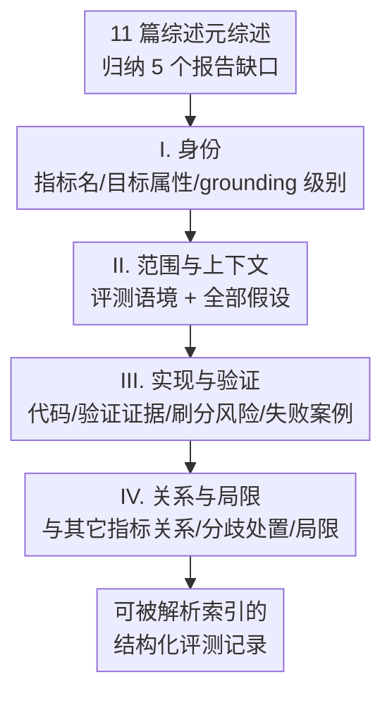

# Evaluation Cards for XAI Metrics

**会议**: CVPR 2026  
**arXiv**: [2605.04410](https://arxiv.org/abs/2605.04410)  
**代码**: 无（论文提议 Markdown / LaTeX / JSON schema 模板，但未给出仓库）  
**领域**: 可解释性 / XAI 评测 / 文档规范  
**关键词**: XAI 评测, 文档卡片, 元综述, 可复现性, 指标标准化

## 一句话总结
针对 XAI（可解释 AI）评测指标"定义不一、报告残缺、很少验证"的乱象，本文做了一份覆盖 2021–2025 共 11 篇综述的元综述，把问题归结为"评测报告不透明"，并仿照 model card / datasheet 提出一份 **XAI Evaluation Card**——一个含 4 大块（身份 / 范围 / 验证 / 关系）、12 个字段的结构化文档模板，要求任何提出新 XAI 评测指标的论文都附上它，从而降低评测碎片化、支持元分析、提升问责性。

## 研究背景与动机
**领域现状**：随着 AI 进入高风险场景，可解释 AI（XAI）成了问责与透明的刚需。难点其实不在"给出一个解释"，而在"严谨地评测这个解释好不好"。近年涌现了大量 XAI 评测指标（Pawlicki 等人统计接近 100 个指标），也有不少综述想把它们系统化。

**现有痛点**：作者梳理 2021–2025 的 11 篇综述，发现三类反复出现的毛病。其一，**术语不统一**——同一个指标名在不同论文里定义不同，而测同一个底层属性的指标又被各组起了不同名字（faithfulness vs fidelity 谁也对不上）。其二，**评测严重偏向 functionally-grounded 的代理任务**（纯技术指标），而更能反映真实效用的 human-grounded（用户研究）和 application-grounded（领域专家在部署场景里评）严重缺位。其三，**实现可得性报告混乱**，不少被提出的指标停留在理论定义、根本没有配套代码。

**核心矛盾**：作者进一步把问题精确化为 **property（属性）与 metric（指标）之间的映射既不唯一也不精确**——多个指标可以指向同一个属性却给出相反结论，而一个指标的有效性又强依赖于模型架构、数据模态、解释范围（局部/全局）。这意味着一个指标分数脱离上下文就**无法解释、也无法跨研究比较**。

**本文目标**：作者不打算去发明"更好的指标"或裁决"哪个属性才对"，而是攻击一个被忽视、却可直接解决的根因——**评测报告的透明性**。具体拆成五个反复出现的报告缺口：(1) 提出指标时不声明它测哪个属性；(2) 报结果时不说明在什么上下文里有效；(3) 原始提案里很少做敏感性/稳定性分析；(4) 指标之间的分歧很少被承认和解释；(5) 实现可得性不一致。

**切入角度**：既然 model card [10] 已经标准化了"模型表现"的报告、datasheet [5] 标准化了"数据集来源与用途"的报告，而 XAI 评测指标这块**至今没有等价的文档标准**——尽管这些指标分数正被当作"解释质量"的证据在用。那就把"卡片式文档"这个被验证过、已被社区接纳的范式搬过来。

**核心 idea**：用一份**结构化文档卡片**逼作者把上述五个报告缺口逐一显式填出来，让"指标分数"不再脱离上下文裸奔。

## 方法详解

### 整体框架
这篇论文的"方法"不是一个算法，而是一个**文档模板 + 它与文献缺口的映射论证**。整体逻辑两步走：先做元综述（meta-review）从 11 篇综述里归纳出 5 个反复出现的评测报告问题，再把这 5 个问题一一对应到一张卡片的具体字段上——也就是说卡片的每个字段都瞄准一个被记录在案的失败模式。卡片本身组织成 4 个 section、共 12 个字段，按"先说清这个指标是谁（身份）→ 在什么条件下有效（范围）→ 有没有被验证过/能不能被刷分（验证）→ 和别的指标什么关系（关系）"的顺序推进，建议作为任何提出新 XAI 评测指标的研究的补充表格或附录提交。卡片设计成**非强制性**：不规定必须用哪个 grounding level、哪个指标或哪套验证流程，不适用的字段可标 N/A 但需附简短理由。

### 关键设计

**1. 元综述驱动：把"凭感觉"换成"有据可查的缺口清单"**

模板的合法性不能靠作者拍脑袋，否则只是又一套主观规范。作者先系统读了 2021–2025 的 11 篇 XAI 评测综述（Pawlicki、Nauta、Lopes、Mohseni、Coroama-Groza、Dembinsky 的 VXAI 等），把分散在各综述里的抱怨收敛成五个**可寻址**的报告问题，并指出它们彼此耦合——"不声明目标属性"会让"指标分歧无法处置"，"缺上下文报告"会让"复现无从谈起"。这一步是整篇的根：卡片的每个字段都能回指到某条综述发现（如 grounding 字段回指 Doshi-Velez & Kim [4] 的三分法、刷分风险字段回指鲜被显式化的有效性威胁），从而把"我们觉得该报什么"变成"文献证明缺了什么"

**2. 身份段：用 grounding 级别堵住"拿技术指标下人本结论"的漏洞**

第一类缺口是 property 和 metric 被混为一谈、且评测 grounding 从不声明。身份段强制三件事：给指标起唯一描述性名、列出它操作化的**所有**可解释性属性（fidelity / robustness / clarity 等，且必须引用所用定义）、并按 Doshi-Velez & Kim [4] 声明 grounding 级别——functionally-grounded（代理任务）/ human-grounded（用户研究）/ application-grounded（部署中的领域专家）。显式声明 grounding 直接挡住一个常见失败模式：用纯技术指标去推"用户能不能理解"这类人本结论。属性与指标的映射既不唯一也不精确，逼作者把"我测的是哪个属性、属于哪一层"写死，后续的分歧处置和元分析才有抓手

**3. 验证段：把"刷分风险（gaming risk）"这个隐形有效性威胁显式化**

第三、四类缺口是很少有指标做敏感性/稳定性分析、几乎没人承认指标分歧。验证段要求作者四件事：(a) 是否有实现并给链接、(b) 总结验证证据（敏感性分析、稳定性分析、与相关指标的相关性，并报计算成本）、(c) 描述 **gaming risk**——即一个方法如何在**不真正改善目标属性**的前提下刷高这个指标、(d) 记录已知失败案例。作者特别看重 gaming risk 字段，因为它点出一类几乎从不被写明的有效性威胁。以论文附录给的 Deletion AUC 为例：解释方法可以专挑那些被遮挡后会制造严重 OOD（分布外）伪影的特征，模型置信度暴跌不是因为真正的解释性特征被移除、而是因为输入看起来像对抗噪声——分数因此虚高。把这种"刷分路径"写进卡片，评审和读者才知道这个分数能不能信

**4. 关系段：把指标放回生态，让分歧可检索、支撑元分析**

第五类缺口是指标间关系几乎从不被交代。关系段要求列出测同一属性的其它指标、标注已知的一致或分歧；当指标冲突时，要说明在目标部署场景下优先哪个属性、为什么（如安全审计场景下 Deletion AUC 优先于 Insertion AUC）；并列出该指标不该被使用的条件。Pawlicki 等人发现指标极其多样却对其属性毫无共识，使得"指标间关系"成为多数论文缺失的关键一环。把这些关系写成显式、可检索的字段，正是支持跨研究 meta-analysis 的直接手段

### 一个例子：给 Deletion AUC 填一张卡片
论文附录 A 用一个真实指标走通整张卡片，让抽象模板落地——指标选的是评测特征归因常用的 **Deletion AUC（DAUC）[14]**：
- **身份**：名为 Deletion AUC；目标属性是 Faithfulness / Fidelity（通过"遮挡被判为重要的特征后模型置信度是否必然下降"来操作化）；grounding 级别是 functionally-grounded。
- **范围**：用于视觉（分类+分割）与 NLP 的局部特征归因，要求模型有概率/logit 输出；关键假设是"迭代遮挡高分特征会让忠实的解释对应的模型性能退化"、且所选 baseline/填补方式（置零/均值/模糊）是有意义的、不会人为弄坏模型。
- **验证**：有实现（RISE 仓库的 `evaluation.py`）；DAUC 对 baseline/填补值的选择高度敏感，计算成本中到高（每个样本需多次前向）；gaming risk 即上文 OOD 伪影刷分；已知失败案例是特征高度相关时，模型靠未被遮挡的冗余特征撑住，导致好解释也拿到虚低的 DAUC。
- **关系**：概念上类似 NLP 的 comprehensiveness，常与 Insertion AUC 配对；与 Faithfulness Correlation 在模型对特征移除响应高度非线性时可能分歧；冲突时若部署场景要求"识别模型工作所必需的特征"（如安全审计失败模式）则优先 DAUC；主要局限是 OOD 问题——它可能测的是模型对缺失数据的鲁棒性而非解释的真实忠实度，不应单独使用。

## 实验关键数据
本文是立场/提案型论文，没有传统意义的训练/对比实验，"证据"来自**元综述统计**与**模板字段↔文献缺口的映射**。

### 元综述覆盖与发现
| 项目 | 数字 / 内容 |
|------|-----------|
| 覆盖综述数 | 11 篇（2021–2025） |
| 现存 XAI 指标规模 | Pawlicki 等人统计接近 100 个 |
| Nauta 等人系统综述 | 29 个定量评测方法 × 12 个评测属性 |
| Dembinsky 等人 VXAI | 把 362 篇论文归并为 41 个功能相似指标组、三维分类 |
| 归纳出的报告问题 | 5 个反复出现的缺口 |

### 卡片字段 ↔ 报告缺口映射
| 卡片 Section | 字段 | 对应的文献缺口 |
|--------------|------|----------------|
| I. 身份 | 指标名 / 目标属性 / grounding 级别 | (1) 不声明所测属性；混淆 property 与 metric |
| II. 范围 | 评测语境 / 假设 | (2) 报结果不给上下文，无法复现/比较 |
| III. 验证 | 实现链接 / 验证证据 / 刷分风险 / 失败案例 | (3) 缺敏感性稳定性分析、(5) 实现不一致 |
| IV. 关系 | 与其它指标关系 / 分歧处置 / 局限 | (4) 指标分歧从不被承认与解释 |

### 关键发现
- **五个报告问题不是独立的**：缺声明目标属性 → 指标分歧无法处置；缺上下文报告 → 无法有意义复现。卡片被设计成"一次填四块"就把五个问题一起堵住。
- **评测严重偏 functionally-grounded**：Mohseni 等人发现 human-AI 任务表现主导文献，而心智模型对齐、用户信任很少被操作化——卡片的 grounding 字段就是逼作者承认自己处在哪一层。
- **现有统一尝试（VXAI）解决的是 taxonomy 而非 documentation**：Dembinsky 的 VXAI 把 362 篇并成 41 组，但聚焦分类法、不触及本文指出的报告缺口——这正是本文的差异化定位。

## 亮点与洞察
- **"先做元综述、再让每个字段回指一条文献缺口"是这篇最扎实的地方**：它把一份本可能很主观的模板，变成"每个字段都有据可查"的设计，规避了"又一套个人规范"的批评。这种"证据驱动模板"的思路可迁移到任何想立报告规范的子领域。
- **gaming risk 字段是真正的"啊哈"点**：评测论文几乎从不问"这个指标怎么被刷"，而 OOD 伪影刷 Deletion AUC 的例子一针见血地说明：高分未必等于好解释。把"如何不改善属性也能拿高分"写成必填字段，是一种很聪明的有效性自省机制。
- **降低采纳门槛的三招很务实**：接入各会议已有的 reproducibility checklist、提供 Markdown/LaTeX 模板 + JSON schema + LLM 辅助起草（事实字段自动抽取、判断字段留给作者）、从 workshop 起步逐步推广——把"规范能否落地"这个真问题正面回答了，而不是只抛模板。
- **LLM 辅助起草的分工设计可复用**：把"指标名/模态/grounding/实现链接"这类事实字段交给 LLM 抽取、把"目标属性/刷分风险/失败案例/关系"这类判断重的字段留给人——这条"事实归机器、判断归人"的分界对任何文档自动化都适用。

## 局限与展望
- **作者承认的局限**：卡片是"最小可行标准"，不解决"XAI 解释到底该满足哪些属性"的深层分歧，也不提供把不同命名概念（faithfulness vs fidelity）对齐的形式化本体/分类法；未来可加形式化属性引用与机器可读 schema 以支持自动元分析。
- **采纳是真正的生死线**：再好的卡片若无社区广泛采纳就会失败，文中坦承需要靠会议级别强制（评审 checklist）才有强约束力，自愿采纳能否成势仍是未知数——这是一篇"提议"而非"已验证"的工作。
- **自身发现的局限**：全文没有任何实证（如真让一批作者填卡片、量化它是否提升了复现性或元分析效率），所有论证停留在"映射论证"层面；模板的字段集是否完备、是否会沦为另一种走过场的填表，都缺乏实验证据。此外把它投到 CVPR 这类以方法/实验为主的视觉会议，与其"文档规范"定位略有错位（论文 arXiv 类目为 cs.CV，但内容更偏 meta-science）。

## 相关工作与启发
- **vs Model Cards [10]**：model card 文档"模型做什么、为谁服务"；本卡片文档"解释质量是怎么被测的、在什么条件下这个测量才有效"。两者形式同构（结构化字段、社区采纳路径），但关注对象不同——一个是模型产物、一个是评测过程。
- **vs Datasheets for Datasets [5]**：datasheet 记录数据集来源、采集流程、预期用途；本卡片把同样的"结构化文档"范式从数据搬到 XAI 评测指标，填补了"指标分数被当证据用、却没有配套文档标准"的空白。
- **vs VXAI / Dembinsky [3]**：VXAI 把 362 篇并成 41 个指标组、做三维分类，是 **taxonomy**（怎么把指标归类）；本文是 **documentation standard**（每个指标该报告什么）。前者解决"指标太多怎么组织"，后者解决"单个指标怎么报告才可信可比"，互补而非竞争。
- **vs Doshi-Velez & Kim [4]**：本文直接借用其 functionally / human / application-grounded 三分法作为 grounding 字段的取值空间，把一个被广泛引用的概念框架落成卡片里的强制声明项。

## 评分
- 新颖性: ⭐⭐⭐⭐ 把 model card / datasheet 的成熟范式迁移到 XAI 评测是合理但不令人意外的"补空白"，洞察扎实但方法本身不算突破。
- 实验充分度: ⭐⭐⭐ 元综述梳理认真（11 篇 + 填出的示例卡片很到位），但完全没有验证模板有效性的实证，停留在论证层面。
- 写作质量: ⭐⭐⭐⭐⭐ 结构清晰、缺口→字段映射讲得很顺，附录的 Deletion AUC 示例让抽象模板落地。
- 价值: ⭐⭐⭐⭐⭐ 直击 XAI 评测碎片化这一真痛点，若能被社区采纳，对可复现性与元分析价值很大；但价值高度取决于采纳，落地存疑。

<!-- RELATED:START -->

## 相关论文

- [\[ICLR 2026\] STRIDE: Subset-Free Functional Decomposition for XAI in Tabular Settings](../../ICLR2026/interpretability/stride_subset-free_functional_decomposition_for_xai_in_tabular_settings.md)
- [\[ACL 2025\] Normalized AOPC: Fixing Misleading Faithfulness Metrics for Feature Attribution Explainability](../../ACL2025/interpretability/normalized_aopc_faithfulness_metrics.md)
- [\[ACL 2026\] Interpretable Coreference Resolution Evaluation Using Explicit Semantics](../../ACL2026/interpretability/interpretable_coreference_resolution_evaluation_using_explicit_semantics.md)
- [\[ICML 2026\] A Behavioural and Representational Evaluation of Goal-Directedness in Language Model Agents](../../ICML2026/interpretability/a_behavioural_and_representational_evaluation_of_goal-directedness_in_language_m.md)
- [\[ICML 2026\] Accurate Evaluation of Quickest Changepoint Detectors via Non-parametric Survival Analysis](../../ICML2026/interpretability/accurate_evaluation_of_quickest_changepoint_detectors_via_non-parametric_surviva.md)

<!-- RELATED:END -->
