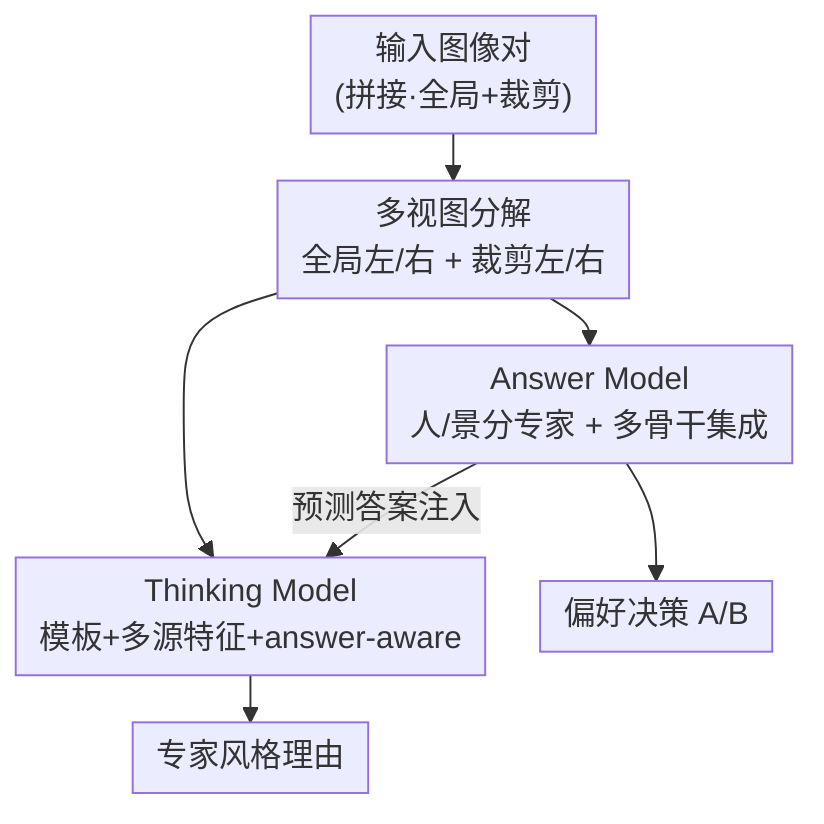

# iDiff: Interpretable Difference-aware Framework for Pairwise Image Quality Assessment

**会议**: CVPR 2026  
**arXiv**: [2605.19522](https://arxiv.org/abs/2605.19522)  
**代码**: 无  
**领域**: 可解释性 / 图像质量评估(IQA) / 多模态LLM  
**关键词**: 成对IQA、可解释推理、双分支、内容感知专家化、模型集成

## 一句话总结
针对 NTIRE 2026 RAIM 挑战赛中"既要判断两张图谁更好、又要给出专家级理由"的成对 IQA 任务，iDiff 用一个判别式 Answer Model（多视图分解 + 人/景分专家 + 多骨干集成做偏好预测）和一个推理式 Thinking Model（模板 + 多源质量特征 + answer-aware 微调生成理由）协同，最终在挑战赛 Track 1 拿到第一（Final Score 0.7305）。

## 研究背景与动机

**领域现状**：传统 IQA 大多预测一个标量质量分；近年随着多模态大模型(MLLM)兴起，研究开始让模型不仅"打分"，还能用自然语言"解释"为什么这张图好。而在专业摄影场景里，成对比较（A 和 B 哪张更好）比绝对打分更贴近人类主观判断——标注员往往更容易说"哪张更好"而不是"打几分"。

**现有痛点**：NTIRE 2026 RAIM 挑战赛把任务推得更难——不仅要预测二选一的偏好，还要生成专家风格的理由，并对二者联合评分。这带来两个具体困难：(1) 两张图是分辨率很高、视觉上极相似的照片，模型要捕捉到锐度、纹理、噪声、自然度上的**细微差异**；(2) 要产出连贯、贴合专家口吻的理由，而不是泛泛而谈或凭空幻觉的解释。

**核心矛盾**：现有方法两头都不讨好。传统判别式回归模型为直接打分优化，预测稳但毫无可解释性；而面向推理的 MLLM 方法能讲出像模像样的解释，但在细粒度成对比较上预测往往不够鲁棒。换句话说，"准确的偏好预测"和"高质量的理由生成"被单一分支硬扛时总要牺牲一头。

**本文目标**：在同一框架里同时做好"判别决策"和"结构化解释"，且让二者互补而非互相拖累。

**切入角度**：既然一个分支难兼顾，那就用两个互补分支——让一个分支专心做鲁棒的偏好预测，另一个分支专心做贴合专家的理由生成，并让后者的解释与前者的决策保持一致。

**核心 idea**：双分支协同——Answer Model 负责"判谁更好"，Thinking Model 负责"解释为什么"，并把 Answer Model 的预测作为条件注入 Thinking Model，使理由生成服务并对齐最终决策。

## 方法详解

### 整体框架
iDiff 把成对图像偏好建模拆成两个互补视角：直接判别预测（Answer Model, AM）和推理引导比较（Thinking Model, TM）。输入是一对高分辨率图像（每个样本原本是把左右候选拼在一张图里，且含全局视图和局部裁剪视图），输出同时包含"偏好哪张"的决策和支撑该决策的专家风格理由。

整条管线先做一步统一的预处理：把拼接表示**显式拆成四张对齐图**（全局-左、全局-右、裁剪-左、裁剪-右）。在此之上，AM 直接预测左/右哪张感知质量更好；TM 则采用"先理由后答案"的范式，先逐区域比较纹理、锐度、噪声、自然度等细节，再给出最终判断。为应对内容多样性，数据进一步分成 person（人像）和 scene（场景）两个子集，各训练专门模型。AM 通过多视图分解、内容感知专家化、多骨干集成提升判别鲁棒性；TM 通过结构化监督、领域模板、多源特征注入、answer-aware 精炼提升推理质量。

### 关键设计

**1. 多视图输入分解：把拼接对拆成四张对齐图，逼出"相对差异"**

痛点直接：原始数据把左右候选打包进一张拼接图，模型很难在这种表示里捕捉两张图的相对质量差。iDiff 不直接用拼接图，而是显式拆出四个对齐输入 $\{I_A^G, I_A^C, I_B^G, I_B^C\}$，其中 $I_A^G, I_B^G$ 是左右候选的全局视图，$I_A^C, I_B^C$ 是对应的局部裁剪视图。全局视图管整体感知一致性，局部裁剪管细节失真，二者对成对 IQA 都关键。这种分解让模型能分别对齐左右、对齐全局/局部，从而把"成对比较"显式建模成可对齐的差异，而不是让网络在一张糊在一起的拼接图里猜。消融里这一步把整体精度从 0.5784 抬到 0.6961，人像子集涨得尤其猛（0.5658→0.7237），且对六种 CNN/Transformer 骨干都一致有效，说明它是架构无关的稳定收益

**2. 内容感知专家化 + 多骨干集成：用"分而治之 + 多视角投票"换鲁棒判别**

人像和场景的质量线索分布差别很大——人像看脸部纹理、皮肤平滑度、发丝边界、修复伪影；场景看建筑结构、植被、文字清晰度、全局自然度。把这些混在一个模型里训练会增大类内异质性。于是 iDiff 把训练数据切成 person / scene 两子集各训一个专门 Answer Model，降低内部异质、提升对各自领域失真的敏感度（消融里场景子集精度 0.6154→0.8077）。在此之上再做**多骨干集成**：Wide ResNet-50-2、EfficientNet-B2、ConvNeXt-Small、Swin Transformer V2-S、MaxViT-T 等不同架构对纹理、边缘锐度、伪影模式有互补的归纳偏置，融合后泛化一致优于任何单模型——平均投票把整体精度推到 0.9118（人像 0.8947、场景 0.9615）。作者还试了按验证精度加权投票，反而略降到 0.8922，说明等权简单投票已足够稳

**3. 渐进式推理增强：让 MLLM 的理由"结构化、可落地、对齐答案"**

TM 要解决的是"MLLM 解释听着合理但不稳、不贴专家"的问题，做法是四步渐进增强。① **结构化推理监督**：要求模型输出 `<thinking>...</thinking><answer>A/B</answer>` 的固定格式，理由按纹理/噪声/锐度/自然度多个感知维度逐项比较再给全局结论，强制多属性分析且让局部观察与整体判断一致。② **模板正则化**：用专家风格模板约束模型产出 4–7 行简洁比较（每行聚焦一个区域+一个指标）再加一行强制全局总结，并为 person/scene 分别设计模板（人像强调皮肤纹理/发丝/衣物，场景强调背景纹理/建筑/植被/边缘过渡），降低推理方差——这是消融里收益最大的一步，BLEU-4 从 0.0221 飙到 0.0858。③ **多源特征注入**：把传统 CV 统计量（Laplacian、Tenengrad、噪声标准差、高频占比、边缘密度、熵、曝光比、色彩度、平均亮度）和学习式 IQA 指标（LIQE、Q-Align、SAMA）按图按裁剪格式化后追加进 prompt，让推理同时落在视觉观察和数值测量上。④ **answer-aware 指令微调**：把 Answer Model 预测的答案（如"Ground truth: Left is better"）写进 prompt，模型不再重复预测答案 token，只生成支撑该结论的理由，避免平凡的答案复制、强化"证据↔决策"对齐。四步叠满把 BLEU-4 / ROUGE-L 推到 0.1161 / 0.3080，且这套设计在 MiniCPM-V-4.5、GLM-4.6V-Flash、Ovis2.5-9B、InternVL3.5-8B 上都一致涨点，不绑定特定 MLLM

### 损失函数 / 训练策略
- **Answer Model**：AdamW，初始学习率 $1\times10^{-4}$、weight decay $1\times10^{-4}$，batch size 32，训练 10 epoch；输入 resize 到 $256\times256$ 后随机裁剪到 $224\times224$；固定随机种子 42。
- **Thinking Model**：以 Qwen3-VL-8B-Instruct 为主模型，LoRA 微调（rank 16，适配所有线性层，视觉编码器与 aligner 也可训）；6 epoch，per-device batch size 1，学习率 $4\times10^{-5}$，weight decay 0.01，warmup ratio 0.03，cosine 调度；bfloat16 + DeepSpeed ZeRO-1，8 张 NVIDIA H20。

## 实验关键数据

数据集为 NTIRE 2026 RAIM，覆盖 person / scene 两类专业摄影成对图：训练集 100 对（含偏好标签 + 专家级理由），Phase-2 验证集 102 对（线上评测、不放标签），最终测试集 101 对。评测同时看**偏好准确率(ACC)** 与**理由质量**（BLEU-4 + ROUGE-L，Phase 3 还加入 LLM 评分）。

### 主实验（NTIRE 2026 RAIM Track 1 排行榜）

| 排名 | 队伍 | Phase 2 ↑ | Phase 3 ↑ | Final Score ↑ |
|------|------|-----------|-----------|---------------|
| **1** | **IH-VQA (本文)** | **0.6943** | 0.7667 | **0.7305** |
| 2 | VCIP Pi Group | 0.6826 | 0.7679 | 0.7253 |
| 3 | I² Group | 0.6490 | 0.7590 | 0.7040 |
| 4 | fugui | 0.6640 | 0.7237 | 0.6939 |
| 5 | LZ | 0.6149 | 0.7497 | 0.6823 |

本文以 Final Score 0.7305 排名第一，且 Phase 2 单项最高（0.6943）；Phase 3 虽略低于第二名（0.7667 vs 0.7679），但综合仍居首。

### 消融实验

Answer Model（Phase-2 验证集，单模型基于 Swin Transformer V2-S）：

| 配置 | Person Acc. | Scene Acc. | Overall Acc. |
|------|-------------|------------|--------------|
| Baseline | 0.5658 | 0.6154 | 0.5784 |
| + Split L/R | 0.7237 | 0.6154 | 0.6961 |
| + Person/Scene 专家 | 0.7632 | 0.8077 | 0.7745 |
| + Ensemble(等权投票) | 0.8947 | 0.9615 | **0.9118** |
| + Weighted Voting | 0.8947 | 0.8846 | 0.8922 |

Thinking Model（从 Phase-2 训练集划出的验证集）：

| 配置 | BLEU-4 ↑ | ROUGE-L ↑ |
|------|----------|-----------|
| Baseline | 0.0221 | 0.2200 |
| + Templates | 0.0858 | 0.2825 |
| + CV Features | 0.0961 | 0.2994 |
| + IQA Features | 0.1034 | 0.3040 |
| + Answer-aware | **0.1161** | **0.3080** |

推理效率（H20，Answer Model 为多模型集成）：

| 模型 | 延迟(s) | 吞吐(img/s) |
|------|---------|-------------|
| Answer Model | 0.21 | 4.76 |
| Thinking Model | 0.75 | 1.34 |

### 关键发现
- **集成是 Answer Model 的最大跳点**：从专家化的 0.7745 一步跳到 0.9118，说明不同骨干的互补性贡献巨大；而按精度加权投票反而略降（0.8922），等权简单投票已足够稳。
- **模板正则化是 Thinking Model 的最大跳点**：BLEU-4 由 0.0221→0.0858（接近 4×），远超后续 CV/IQA 特征和 answer-aware 的增量，说明"强制专家风格结构"对理由生成最关键；且 person/scene 专用模板优于通用模板（BLEU-4 0.0858 vs 0.0801）。
- **设计是架构无关的**：Split L/R 对六种骨干一致涨点，Thinking 设计对 5 种 MLLM（含 Qwen3-VL、InternVL3.5 等）一致提升 BLEU-4/ROUGE-L，泛化性好。
- **效率与可解释性的权衡**：判别式 Answer Model 即便集成也只需 0.21s，而自回归生成理由的 Thinking Model 要 0.75s——可解释性是有成本的。

## 亮点与洞察
- **"分工而非妥协"的双分支思路**：把"判别"和"解释"这对相互拖累的目标拆给两个分支，再用 answer-aware 把判别结果注入解释分支，既保了准确率又保了理由质量——这套"一个分支出结论、另一个分支负责讲清楚并对齐结论"的范式可迁移到任何"既要预测又要可解释"的任务（如医学影像判读、内容审核）。
- **把拼接对显式拆成四视图**很朴素却很有效：成对比较的本质是"相对差异"，与其让网络在拼接图里隐式学，不如显式对齐左右/全局局部，单这一步就稳定涨点且架构无关。
- **多源特征注入做"数值锚点"**：把 Laplacian、噪声标准差等传统 CV 量和 LIQE/Q-Align/SAMA 等学习指标格式化进 prompt，给 MLLM 的文字推理一个可落地的数值依据，缓解凭空幻觉——这是把"手工特征 + 学习特征"喂给 LLM 当证据的实用 trick。
- **answer-aware 监督防止"答案复制"**：把已知答案写进 prompt、只让模型生成支撑理由，强制它学"证据→决策"的对齐而非偷懒抄答案，是个值得借鉴的指令微调设计。

## 局限与展望
- **数据规模极小**：训练集仅 100 对、验证/测试各约 100 对，消融数字（尤其 0.96 这类高分）方差可能很大，结论的统计稳健性存疑 ⚠️。这是挑战赛设定决定的，未必能外推到大规模真实场景。
- **重工程、偏赛道特化**：方法是为 NTIRE RAIM 量身定制的多模型集成 + 多源特征 + 多模板，落地成本高（Answer Model 需多骨干集成、Thinking Model 需 8×H20 LoRA 微调），通用性和部署性受限。
- **两分支耦合较弱**：answer-aware 只是把 AM 预测当文本条件注入 TM，二者并非端到端联合优化；若 AM 预测错，TM 会被引导去为错误结论编理由，鲁棒性边界值得进一步研究。
- **理由质量评测代理性强**：BLEU-4/ROUGE-L 衡量的是与参考文本的表面相似度，未必等于"专家真的认可"；Phase 3 的 LLM 评分缓解了一部分，但理由的事实正确性仍缺直接度量。

## 相关工作与启发
- **vs Q-Align / Q-Instruct（MLLM 打分类）**: 它们把 IQA 从标量回归扩展到语言驱动的质量理解（离散文本质量级别、人类反馈指令数据），本文不止于打分/打级，而是聚焦"成对偏好 + 专家理由"，并用判别分支保证预测鲁棒——互补在于本文用专门的 Answer Model 兜底准确率，而非让 MLLM 一肩挑。
- **vs Co-Instruct / Compare2Score（比较式 IQA）**: 它们把 LMM 用于开放式质量比较或把相对判断迁移到连续质量估计，本文同样做成对比较，但额外强调"结构化专家理由 + 数值特征锚定 + answer-aware 对齐"，理由更可控、更贴专家。
- **vs iDETEX（可解释 IQA）**: iDETEX 在统一 MLLM 框架里联合建模质量定位、感知与描述；本文的差异在于显式的双分支分工（判别 + 推理），用集成换判别鲁棒、用模板/特征换解释稳定，是更偏赛道工程化的解法。
- **可借鉴的迁移点**: "判别分支出结论 + 推理分支讲清楚并对齐结论"的双分支范式，以及"把手工 + 学习特征当数值证据注入 LLM prompt"的做法，都能搬到其他需要可解释决策的多模态任务。

## 评分
- 新颖性: ⭐⭐⭐ 单个组件（多视图、集成、模板、特征注入）多为已知技术，亮点在"判别+推理双分支 + answer-aware 对齐"的系统组合，属工程创新。
- 实验充分度: ⭐⭐⭐ 消融覆盖两分支各环节、跨 6 骨干 / 5 MLLM 验证，但数据集仅约 100 对、规模过小，统计可靠性受限。
- 写作质量: ⭐⭐⭐⭐ 结构清晰，双分支 + 渐进增强讲得明白，图表对应到位。
- 价值: ⭐⭐⭐⭐ 拿下 NTIRE 2026 RAIM Track 1 第一，对"既要预测又要可解释"的成对 IQA 提供了可复用的实战方案。

<!-- RELATED:START -->

## 相关论文

- [\[AAAI 2026\] DR.Experts: Differential Refinement of Distortion-Aware Experts for Blind Image Quality Assessment](../../AAAI2026/interpretability/drexperts_differential_refinement_of_distortion-aware_experts_for_blind_image_qu.md)
- [\[ICML 2026\] IQA-Spider: Unifying Multi-Granularity Image Quality Assessment with Reasoning, Grounding and Referring](../../ICML2026/interpretability/iqa-spider_unifying_multi-granularity_image_quality_assessment_with_reasoning_gr.md)
- [\[CVPR 2026\] On the Possible Detectability of Image-in-Image Steganography](on_the_possible_detectability_of_image-in-image_steganography.md)
- [\[CVPR 2026\] DINO-QPM: Adapting Visual Foundation Models for Globally Interpretable Image Classification](dino-qpm_adapting_visual_foundation_models_for_globally_interpretable_image_clas.md)
- [\[CVPR 2026\] Why Does It Look There? Structured Explanations for Image Classification](why_does_it_look_there_structured_explanations_for_image_classification.md)

<!-- RELATED:END -->
