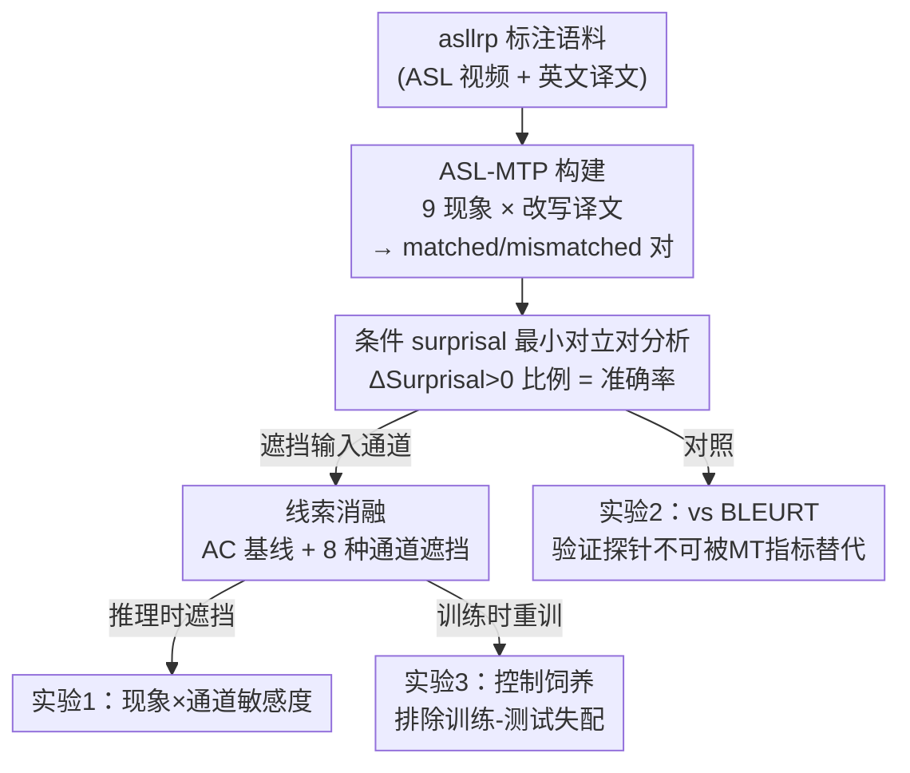

# Targeted Linguistic Analysis of Sign Language Models with Minimal Translation Pairs

**会议**: CVPR2026  
**arXiv**: [2604.27232](https://arxiv.org/abs/2604.27232)  
**代码**: https://github.com/serpilkarabuklu/SL-Models-Analysis  
**领域**: 可解释性 / 手语翻译 / 语言学探针  
**关键词**: 手语模型, 最小对立对, surprisal 分析, 线索消融, 非手部线索

## 一句话总结
作者构建了首个手语「最小翻译对」数据集 ASL-MTP（1275 段 ASL 视频 + 9 类语言学现象），用「条件 surprisal」探针逐一检验 SOTA 手语翻译模型 SHuBERT+ByT5 是否真正读懂了各类语言学现象，并通过遮挡输入通道（手/脸/身体）做线索消融，发现模型严重依赖手部线索、却几乎忽视眉毛/头动等关键非手部线索。

## 研究背景与动机
**领域现状**：手语处理近年随大数据集（YouTube-ASL ~1000 小时）出现了可微调的预训练表征模型，手语翻译（ASL→英文）的 BLEU/BLEURT 等任务指标大幅提升。手语天然由多条「发音通道」并行表意——语言学上分为**手部线索（manuals）**（手形、朝向、运动）与**非手部线索（non-manuals）**（眉毛、头动、口型、视线等面部与身体动作）。

**现有痛点**：BLEU/BLEURT 这类任务级指标只衡量译文整体相似度，**无法回答模型到底有没有学会某一类具体语言学现象**，更看不出模型是否按语言学预期从各个通道抽取信息。已有的针对性分析又局限于单一通道（只看手）或受限设定（孤立词识别），无法覆盖跨通道、连续手语的现象。

**核心矛盾**：很多现象**关键依赖特定通道**——指拼写/数字几乎只靠手；Wh-疑问、否定、条件句靠手+眉毛；而极性疑问句（Polar Question）几乎只靠眉毛上扬这一非手部线索来与陈述句区分。即便模型显式地以多通道为输入，也不知道它是否真的用上了非手部通道。

**本文目标**：① 造一个能逐现象、逐通道做细粒度语言学诊断的基准；② 用它实证检验一个 SOTA 多通道手语翻译模型在各现象上的表现，以及它究竟依赖哪些通道。

**切入角度**：借鉴 NLP 中评估语言模型语法知识的成熟范式——**最小对立对（minimal pairs）**（如 "The woman laughs." vs "*The woman laugh."），把它迁移到「以手语视频为条件」的翻译场景：给定同一段视频，构造一对仅在目标现象上有差异的英文译文，看模型给「正确译文」的概率是否高于「错误译文」。

**核心 idea**：用「条件于视频的 surprisal 差」作为现象敏感度的可解释探针，配合系统性的输入通道遮挡（线索消融），把「模型懂不懂某现象、靠哪条通道懂」拆成可统计检验的问题。

## 方法详解

### 整体框架
这是一篇**分析/基准论文**，不提新模型，核心是一套「数据集 + 探针 + 消融」的诊断流程。整体分三步走：先从高质量标注语料 asllrp 中筛选并改写出 ASL-MTP（9 类现象、1275 个 matched/mismatched 译文对）；再用**以视频为条件的最小对立对 surprisal 分析**给出每个现象的「准确率」；最后对输入的手/脸/身体通道做**线索消融**（推理时遮挡 + 训练时重训两种），定位模型究竟依赖哪条通道。被诊断的对象是 SHuBERT+ByT5——SHuBERT 是把输入拆成「脸（口/眼裁剪）、左手、右手、身体姿态关键点」四通道的 BERT 式自监督编码器（1000 小时 ASL 预训练），接 ByT5 做字节级自回归翻译，因此能取出 next-token 概率供 surprisal 计算。

### 关键设计

**1. ASL-MTP：手语最小翻译对基准**

针对「任务指标看不出具体语言学能力」这个痛点，作者构建了首个面向手语翻译模型的最小对立对数据集。数据源是 asllrp（2048 段经语言学家细标注、4 位 signer 录制、且鲜被用于训练手语模型的高质量 ASL 语料），自带手部标注与时间对齐的非手部标注（头位/口型/视线及其语法功能）。构建方式是：对每段视频，按现象筛选实例，再**改写其英文译文**得到一对——matched（正确翻译）与 mismatched（仅在目标现象上被扰动、但本身仍合语法的错误翻译）。例如把极性疑问句 "Are Jen and Joe married?" 改写成陈述句 "Jen and Joe are married." 即得到该现象的一对。最终 1275 对，覆盖 **9 类现象**，按主要承载通道分三组：①主要靠手——数字、指拼写、类别词（classifier）；②手+脸——否定、Wh-疑问、条件句；③主要靠脸——极性疑问句。这种「同一视频、译文只差目标现象」的设计，把模型对某现象的敏感度从译文的其它噪声中隔离出来。

**2. 以视频为条件的 surprisal 最小对立对探针**

有了对，如何量化模型「懂不懂」？作者沿用 LM 探针的标准做法但**条件于手语视频**。对句子 $s_i=(x_1,\dots,x_{|s_i|})$，定义其条件、逐 token 的 surprisal（负对数概率的平均）：

$$\mathcal{S}(s_i)=\frac{1}{|s_i|}\sum_{t=1}^{|s_i|}-\log p(x_t\mid x_{<t}, F_i)$$

其中 $F_i\in\mathbb{R}^{T\times d}$ 是从视频抽取的输入特征。再算 mismatched 与 matched 的 surprisal 差：

$$\Delta\text{Surprisal}_i=\mathcal{S}(u_i)-\mathcal{S}(a_i)$$

若模型真正掌握该现象，应觉得错误译文 $u_i$ 比正确译文 $a_i$ 更「意外」，即 $\Delta\text{Surprisal}_i>0$。**准确率**就定义为 $\Delta\text{Surprisal}>0$ 的对所占比例；因为是成对比较，**随机水平 = 50%**。相比 BLEURT 等只给一个全局相似度分，这个探针直接对准「目标现象」这一维，能给出语言学上可解释的诊断结论，且因成对比较天然可做二项检验、得到显著性。

**3. 线索消融：定位模型依赖哪条通道**

要回答「模型靠哪条通道懂某现象」，作者用 MediaPipe 检测感兴趣区域，在视频帧里**选择性地灰化遮挡**对应通道，观察消融后准确率相对全线索（All Cues, AC）的显著变化。以 AC 为基线，设计 **8 种消融**：NE（去眼/眉）、NM（去口）、NF（去整张脸）、NH（去双手）、NHM（去手+口）、NHF（去手+脸）、NHB（去手+身体姿态，只留脸）、NFB（去脸+身体，只留手）。逻辑很直接：若遮掉某通道后某现象准确率显著掉，说明模型在该现象上用了这条通道；若不掉，说明它没在用。把 Conditionals 与 Polar Questions 各拆成「仅非手部线索 / 手+非手部」两个子集（共 11 个子集），是为了精确考察「只能靠非手部线索」的样本上模型到底敏不敏感。

**4. 控制饲养（Controlled Rearing）：排除训练-测试失配**

推理时遮挡有个隐患：模型是在全线索上训练的，遮挡后的输入对它是**分布外**，性能下降可能只是训练-测试失配、而非真的「缺了那条线索的信息」。借鉴 LM 的控制饲养（controlled rearing）思路，作者干脆**在训练阶段就遮掉相应通道重训 SHuBERT**，再按原配方接 ByT5 微调（先 ~800K 弱对齐对、再 ~200K 精对齐对），在两种条件（NF 去脸、NFB 只留手）上重复 surprisal 分析。结果与推理时消融趋势一致、且仍有陈述句偏置，说明 Experiment 1 的结论**不是**训练-测试失配解释得了的，从而坐实「模型确实不太用非手部线索」这一发现。

## 实验关键数据

被诊断模型：SHuBERT+ByT5（目前唯一权重/数据/训练流程全开放、可在学术算力上跑的 SOTA ASL→英文翻译模型）。

### 主实验：推理时线索消融下的现象准确率（Table 2，节选）

| 现象 (#样本) | 主要线索 | All Cues | 去双手(NH) | 只留手(NFB) |
|--------------|----------|----------|------------|-------------|
| 数字 (119) | 手 | 0.87 | 0.61 | 0.75 |
| 指拼写 (170) | 手 | 0.78 | 0.49 | 0.68 |
| 类别词 (150) | 手 | 0.63 | 0.51 | 0.53 |
| Wh-疑问 (123) | 手+眉降 | 0.75 | 0.66 | 0.72 |
| 否定 vs 肯定 (104) | 手+摇头 | 0.80 | 0.69 | 0.71 |
| 条件句 (155) | 手+眉扬 | 0.70 | 0.56 | 0.72 |
| 条件句(仅非手部, 50) | 眉扬 | 0.68 | 0.60 | 0.76 |
| 陈述 vs 极性疑问 (150) | 手 | 0.97 | 0.96 | 0.96 |
| 极性疑问 vs 陈述 (57) | 手+眉扬 | **0.04** | 0.05 | 0.04 |
| 极性疑问(仅非手部, 93) | 眉扬 | **0.09** | 0.15 | 0.10 |

- 全线索下 **11 个子集里 9 个高于随机（50%）**，在数字、指拼写、Wh-疑问、否定上尤其好；唯独两个「极性疑问 vs 陈述」子集**远低于随机**（0.04 / 0.09）。
- 去掉双手（NH/NHM/NHF/NHB）时，数字、指拼写、类别词、Wh-疑问、肯定 vs 否定等显著掉到接近或低于随机——**手部是模型最依赖的线索**。

### 对照实验：surprisal 探针 vs BLEURT（Table 3）

| 现象 | AC (准确率) | NF BLEURT | 含义 |
|------|-------------|-----------|------|
| 数字 | 0.87 | 0.48 | BLEURT 跨现象几乎无区分度 |
| 极性疑问 vs 陈述 | 0.04 | 0.40 | BLEURT 看不出 surprisal 揭示的剧烈差异 |

把模型 beam search 译文与参考算平均 BLEURT，发现：① 各现象 BLEURT 差异极小；② 只要去手/去身体 BLEURT 就普遍下降，但同样分不清现象；③ BLEURT 与 surprisal 准确率的 Pearson 相关**很弱到中等**（-.17～.36）。结论：**MT 指标无法替代最小对立对探针**所能给出的细粒度、语言学可解释的诊断。

### 消融实验：控制饲养（训练时遮挡，Table 4）
| 训练条件 | Wh-疑问 | 条件句 | 极性疑问 vs 陈述 | 说明 |
|----------|---------|--------|------------------|------|
| AC（全线索） | 0.75 | 0.70 | 0.04 | 基线 |
| NF（训练时去脸） | 0.54 | 0.89 | 0.09 | 与推理消融趋势大体一致 |
| NFB（训练时只留手） | 0.63 | 0.61 | 0.07 | 仍有陈述句偏置 |

### 关键发现
- **重度依赖手部、轻视非手部**：模型对手部线索高度敏感，但即便在「关键依赖非手部线索」的现象（Wh-疑问、否定、条件句、极性疑问）上，遮掉眉/头/口等非手部线索后准确率**基本不变**——说明它本就没怎么用这些线索；反而在「不必依赖非手部」的数字/指拼写/类别词上，去脸/去身体（NF/NFB）会显著掉点（推测口型偶尔被用来消歧，且口型在数据里未被标注）。
- **陈述句偏置**：「陈述 vs 极性疑问」高达 0.97，而「极性疑问 vs 陈述」仅 0.04——模型强烈倾向把视频翻成陈述句而非疑问句，因为区分二者全靠它忽视的眉毛上扬。
- **训练时重训也救不回来**：控制饲养结果与推理消融趋势一致，排除了「下降只是训练-测试失配」的解释，坐实模型对非手部线索的真实不敏感。
- 在「高于随机」的现象里，**类别词最差**（0.63），因为类别词含义高度依赖话语内指称对象，作者建议把指称错误分析作为未来方向。

## 亮点与洞察
- **把 NLP 的最小对立对范式迁移到手语**：核心创新是「以视频为条件」做最小对立对——同一段手语视频配一对仅差目标现象的译文，用 ΔSurprisal>0 的比例当准确率。这套思路简单、可统计检验，且天然把「目标现象」从译文其它噪声里隔离出来。
- **「线索消融 + 控制饲养」双保险定位通道依赖**：先用推理时遮挡快速定位依赖，再用训练时重训排除分布外伪影。这种「行为探针 → 排除混淆变量」的两段式分析方法论，可直接迁移到任何多通道/多模态模型的可解释性研究。
- **最让人「啊哈」的反差**：模型在多通道上训练，却几乎只学会读手；连「只靠眉毛上扬」就能定义的极性疑问都几乎做反（0.04）。这给「多通道输入 ≠ 多通道利用」敲了警钟。
- **证明了诊断工具的不可替代性**：用 BLEURT 与 surprisal 准确率弱相关（-.17～.36）实证说明，任务级 MT 指标会掩盖模型在具体语言学维度上的系统性缺陷。

## 局限性 / 可改进方向
- **样本规模偏小**：asllrp 仅 2048 句，部分子集很小（如条件句仅非手部 50 句），作者也承认这类小样本上的「不敏感」结论可能部分源于统计功效不足。
- **只诊断了一个模型**：受限于「权重/数据/训练全开放且可控通道」的苛刻条件，案例研究只覆盖 SHuBERT+ByT5 一个模型，结论能否推广到其它（尤其闭源 SOTA）模型未知。
- **遮挡近似的副作用**：去手时保留了身体姿态中的「手位置」信息，遮挡的语义边界并不绝对干净；口型是否被用作消歧线索也因数据未标注口型而只能推测。
- **未深究差异成因**：训练时消融与推理消融在 Wh-疑问、条件句上的差异，论文留作未来工作；类别词依赖指称这一线索也只给出方向、未做分析。
- **改进思路**：扩大数据（半自动从手语语料挖掘现象子集）、扩展到更多手语/语言、以及把诊断结论回灌训练（如显式增强非手部线索的监督）来修复非手部不敏感。

## 相关工作与启发
- **vs LM 最小对立对基准（BLiMP 等）**：BLiMP 给纯文本 LM 配一对合法/非法句子比对数概率。本文把这一范式**条件化到手语视频**，并首次用于手语翻译模型——多了「视频条件」与「跨通道线索」两个维度，是该传统在手语上的首次扩展。
- **vs 机器翻译对照集（Sennrich 2017）**：MT 对照集用最小对立对研究 MT 模型对一致性/极性等的处理。本文承袭其「翻译最小对立对」思想，但聚焦手语特有的多通道现象。
- **vs 控制饲养（Misra & Mahowald 2024 等）**：LM 控制饲养通过删训练语料中某类知识来检验模型能否从别处恢复。本文「松散借鉴」该思路，改为在训练时**遮挡视频通道**重训，用来排除推理消融的训练-测试失配混淆。
- **vs 既有手语模型分析**：以往针对性分析多局限单通道（手）或孤立词；本文覆盖连续手语的 9 类现象、3 类通道组合，把分析粒度推进到跨通道、句子级。

## 评分
- 新颖性: ⭐⭐⭐⭐⭐ 首个手语最小翻译对基准 + 首次把条件 surprisal 探针用于手语翻译模型，开辟手语模型语言学诊断方向
- 实验充分度: ⭐⭐⭐⭐ 三组实验（推理消融/对照 BLEURT/控制饲养）相互印证，结论扎实；但只诊断一个模型、部分子集偏小
- 写作质量: ⭐⭐⭐⭐⭐ 动机—方法—发现链条清晰，语言学背景交代充分，表格与结论自洽
- 价值: ⭐⭐⭐⭐⭐ 提供可复用的开放基准与诊断方法论，并明确指出「多通道训练却只用手」这一待修复的真实缺陷

<!-- RELATED:START -->

## 相关论文

- [\[AAAI 2026\] PragWorld: A Benchmark Evaluating LLMs' Local World Model under Minimal Linguistic Alterations and Conversational Dynamics](../../AAAI2026/interpretability/pragworld_a_benchmark_evaluating_llms_local_world_model_under_minimal_linguistic.md)
- [\[ACL 2026\] Fine-Grained Analysis of Shared Syntactic Mechanisms in Language Models](../../ACL2026/interpretability/fine-grained_analysis_of_shared_syntactic_mechanisms_in_language_models.md)
- [\[ACL 2026\] How Language Models Conflate Logical Validity with Plausibility: A Representational Analysis of Content Effects](../../ACL2026/interpretability/how_language_models_conflate_logical_validity_with_plausibility_a_representation.md)
- [\[CVPR 2026\] Understanding Counting Mechanisms in Large Language and Vision-Language Models](understanding_counting_mechanisms_in_large_language_and_vision-language_models.md)
- [\[ACL 2026\] Lost in Translation? Exploring the Shift in Grammatical Gender from Latin to Occitan](../../ACL2026/interpretability/lost_in_translation_exploring_the_shift_in_grammatical_gender_from_latin_to_occi.md)

<!-- RELATED:END -->
