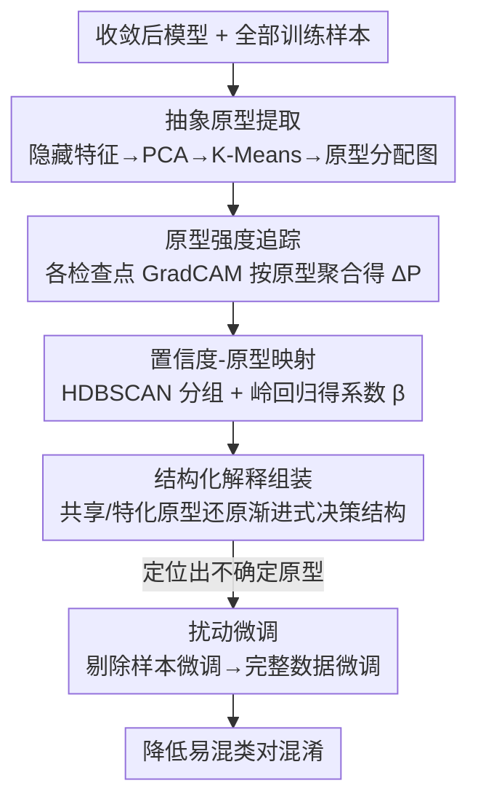

# Why Does It Look There? Structured Explanations for Image Classification

**会议**: CVPR 2026  
**arXiv**: [2603.10234](https://arxiv.org/abs/2603.10234)  
**代码**: 无  
**领域**: 可解释性  
**关键词**: 结构化解释, 原型, GradCAM, 模型训练动态, XAI

## 一句话总结

提出 I2X 框架，通过在训练检查点追踪从 GradCAM 提取的原型强度与模型置信度的协同演化，将非结构化的可解释性（显著性图）转化为结构化的可解释性，揭示模型"为什么关注那里"的推理结构，并利用这种理解指导微调提升性能。

## 研究背景与动机

**领域现状**：XAI 方法主要产生三类输出——显著性图（GradCAM）、概念向量（TCAV）和反事实样本。这些都是**非结构化的可解释性**，只告诉"模型看哪里"，不告诉"模型怎么组织这些信息来推理"。

**现有痛点**：
   - 现有方法提供的是碎片化的解释，无法回答"为什么模型看那里"和"模型如何在类间做决策"
   - 一些方法用 GPT/CLIP 等辅助模型描述行为，但解释不忠实于原始模型，可能产生幻觉
   - 训练过程中模型如何逐步建立决策策略的动态过程完全不透明

**核心矛盾**：可解释性（interpretability）≠ 可说明性（explainability），前者是描述现象，后者需要结构化归因

**切入角度**：模型的决策不是静态的——它在训练过程中逐步建立原型证据和置信度的关联，追踪这个过程就能构建结构化解释

**核心 idea**：在训练检查点间追踪原型强度变化与置信度变化的映射关系，将非结构化解释升级为结构化解释

## 方法详解

### 整体框架

I2X 想回答的不是"模型看了哪里"，而是"模型为什么看那里、又是怎么把这些线索组织起来做分类的"。它的做法是把训练过程当成一段可回放的录像：先在最终模型上把所有隐藏特征聚成一组**抽象原型**（一批可复用的视觉模式），再回到若干训练检查点，用 GradCAM 看模型在每个检查点对哪些原型加了多少注意力，最后把"原型注意力的变化"和"分类置信度的变化"对齐建模。这样原本一张张孤立的显著性图，就被串成了一条"模型逐步积累哪些证据、置信度随之怎么涨落"的结构化轨迹，并据此指导一轮扰动微调。

### 关键设计

**1. 抽象原型提取：把高维特征压成一组可命名的视觉模式**

显著性图只能指出"看哪里"，却说不清"看到的是什么"，因为像素位置本身没有语义。I2X 先在收敛后的模型上抽出所有训练样本的隐藏特征 $\mathbf{F} \in \mathbb{R}^{(N \cdot h \cdot w) \times d}$，PCA 降维后用 K-Means 聚成 $K$ 个中心当作原型（MNIST 取 $K{=}32$、CIFAR-10 取 $K{=}128$），再把每个空间位置 $j$ 指派给最近的原型，得到一张原型分配图 $A_i = (a_1, \dots, a_{hw}),\ a_j \in \{1,\dots,K\}$。于是"看哪里"被翻译成"看到的是横笔、斜笔这一类具名模式"，后续所有分析都建立在这组有限、可解释的词表上。

**2. 原型强度追踪：用检查点之间的强度变化刻画"模型在学什么"**

有了原型词表，就能问每个训练检查点 $t$ 上模型对每个原型投了多少注意力。把该检查点的 GradCAM 显著图 $I^t$ 按原型分配图聚合，得到原型 $k$ 的平均强度

$$P_k^t = \frac{\sum_{j=1}^{hw} \mathbf{1}[a_j = k] \cdot \text{Flatten}(I_j^t)}{\sum_{j=1}^{hw} \mathbf{1}[a_j = k]}$$

相邻检查点的差 $\Delta \mathbf{P}^t = \mathbf{P}^{t+1} - \mathbf{P}^t$ 就是"这一步训练里，哪些原型证据被增强、哪些被削弱"。换句话说，显著图告诉"看哪里"、原型告诉"看的是什么"，而强度变化进一步告诉"学习进程走到哪一步"——这正是把静态解释变成动态解释的关键一跳。

**3. 置信度-原型映射：把"证据变化"和"判断变化"用一个回归量化绑定**

光知道原型强度在变还不够，得证明这些变化确实在驱动模型的判断。I2X 先用 HDBSCAN 对所有样本的置信度变化 $\Delta \hat{Y}^t$ 做聚类，把学习模式相近的样本归成 $M$ 组（比如一批同时在"2 还是 7"上摇摆的样本）；再用岭回归把原型强度变化映射到置信度变化

$$\beta^t = (\pi^{t\top}\pi^t + \lambda \mathbf{I})^{-1}\pi^{t\top}C^t \in \mathbb{R}^{K \times M}$$

其中 $\pi^t$ 是原型强度变化、$C^t$ 是分组后的置信度变化，$\lambda$ 是岭正则项。系数矩阵 $\beta^t$ 就读作"在第 $t$ 步，哪个原型的强度上升会把哪一组样本推向哪个类"。把各检查点的 $[\beta^t]$ 串起来，就能看出模型一路上是如何调度原型证据来支撑、区分不同类别的。

**4. 结构化解释的组装：用共享原型与特化原型还原决策结构**

最后把上面的轨迹翻译成人能读的解释，分两类原型来看：**共享原型**在某个类几乎所有样本里都出现（如数字 7 的横笔和斜笔），构成该类的"通用证据"；**特化原型**只在子组里出现，用来区分类内变体或易混类。沿着 $\beta^t$ 的时间线读下去会发现一个反直觉的现象——模型并非同时把所有类拉开，而是**渐进式**的：先靠差异明显的原型解决容易的类对（如 7 vs 6），再慢慢处理证据模糊、原型在两类间摆动的难类对（如 7 vs 1）。这就把"为什么看那里"落到了"模型按什么顺序、用哪些原型建立起整套决策结构"上。

### 一个完整示例：解释 MNIST 上的 2↔7 混淆

以最顽固的 2↔7 混淆为例走一遍：第 1 步聚类后，横笔、斜笔等模式被抽成具名原型；第 2 步逐检查点追踪发现，早期模型已用"横笔 + 斜笔"等共享原型把 7 和 6、9 等类轻松拉开，但 2 和 7 的强度曲线长期纠缠；第 3 步的回归进一步指认出 P-26、P-17 这类**不确定原型**——它们的强度在训练中反复在 2、7 两类之间摆动，对应的 $\beta$ 一会儿把样本推向 2、一会儿推向 7；第 4 步据此判定：正是这批跨类摆动的原型让模型迟迟无法在 2 和 7 之间稳定决策。这条链路把一张张看不出门道的显著图，变成了"哪个原型在何时把判断带偏"的可追溯解释，也直接指向了下面的改进策略。

### 损失函数 / 训练策略

I2X 本身是分析框架，不引入新的训练损失。但上面定位出的"不确定原型"可以直接拿来改训练：采用**扰动微调策略**，先在剔除了含不确定原型的样本上微调一轮、让模型先稳住清晰证据，再回到完整数据上微调一轮补回覆盖面。实验中这套"筛选数据→完整数据"的两段式微调能在保持精度的同时压低易混类对的混淆数（MNIST 减少约 5 个、CIFAR-10 减少约 23 个混淆样本）。

## 实验关键数据

### 主实验 — 微调提升

| 微调策略 | Accuracy(%) | 2↔7 混淆数 | 说明 |
|---------|-------------|-----------|------|
| 完整数据 → 完整数据 | 98.46±0.31 | 9.60±2.87 | 基线 |
| 筛选数据 → 筛选数据 | 98.31±0.63 | 9.00±4.90 | 混淆少但不稳定 |
| **筛选数据 → 完整数据** | **98.64±0.12** | **8.40±1.85** | 最优：混淆少且稳定 |

### CIFAR-10 / InceptionV3 泛化

| 模型/数据集 | 微调策略 | Accuracy(%) | 混淆数 |
|------------|---------|-------------|--------|
| ResNet-50 / CIFAR-10 | full→full | 81.43±2.79 | cat↔dog: 261.2 |
| ResNet-50 / CIFAR-10 | **curated→full** | **84.02±2.70** | **238.6** |
| InceptionV3 / MNIST | full→full | 99.13±0.29 | 4↔9: 12.6 |
| InceptionV3 / MNIST | **curated→full** | **99.11±0.27** | **10.8** |

### 关键发现
- 模型学习是渐进式的：先区分原型差异大的类（如 7 vs 6），再处理相似类（如 7 vs 1）
- **不确定原型**（如 P-26/P-17）在训练中在两个类之间摆动，是导致混淆的根因
- 训练数据顺序的随机性会改变原型选择策略——不同训练运行可能学到不同的推理策略
- 扰动微调策略（先去除含不确定原型的样本微调）能减少 MNIST 上约 5 个、CIFAR-10 上约 23 个混淆样本

## 亮点与洞察
- **将非结构化解释升级为结构化解释**：从"模型看了什么"到"模型为什么看那里以及如何做决策"，概念层次提升。
- **揭示模型学习的渐进式策略**：类似人类学习——先区分容易的，再处理困难的。
- **不确定原型的发现**：找到了跨类摆动的原型是混淆的直接原因，且可以据此设计改进策略，有实际价值。
- **训练随机性的结构化分析**：第一次用原型追踪解释不同训练运行间的策略差异。

## 局限与展望
- 仅在 MNIST 和 CIFAR-10 上验证，复杂数据集（ImageNet）上是否仍可解释有待验证
- K-Means 聚类数 $K$ 需要手动选择（MNIST 32, CIFAR-10 128），增大数据集时的选择策略不明确
- 依赖 GradCAM，对 Transformer 架构需要替换为 TokenTM 等方法
- 岭回归是线性模型，可能无法捕捉复杂的非线性原型-置信度关系
- 微调提升虽一致但幅度有限（MNIST <0.2%, CIFAR-10 ~2.6%）
- 分析成本较高：需要保存多个训练检查点并逐个分析

## 评分
- 新颖性: ⭐⭐⭐⭐⭐ 从可解释性到可说明性的概念升级非常有洞察力
- 实验充分度: ⭐⭐⭐ 仅 MNIST 和 CIFAR-10，数据集规模和复杂度偏低
- 写作质量: ⭐⭐⭐⭐ 概念阐述清晰，图表信息密度高
- 价值: ⭐⭐⭐⭐ 提供了理解和改进模型的新视角，有实用潜力

<!-- RELATED:START -->

## 相关论文

- [\[CVPR 2026\] DINO-QPM: Adapting Visual Foundation Models for Globally Interpretable Image Classification](dino-qpm_adapting_visual_foundation_models_for_globally_interpretable_image_clas.md)
- [\[CVPR 2026\] On the Possible Detectability of Image-in-Image Steganography](on_the_possible_detectability_of_image-in-image_steganography.md)
- [\[CVPR 2026\] Measuring the (Un)Faithfulness of Concept-Based Explanations](measuring_the_unfaithfulness_of_concept-based_explanations.md)
- [\[CVPR 2026\] Neurodynamics-Driven Coupled Neural P Systems for Multi-Focus Image Fusion](neurodynamics-driven_coupled_neural_p_systems_for_multi-focus_image_fusion.md)
- [\[CVPR 2026\] Missing No More: Dictionary-Guided Cross-Modal Image Fusion under Missing Infrared](missing_no_more_dictionary-guided_cross-modal_image_fusion_under_missing_infrare.md)

<!-- RELATED:END -->
