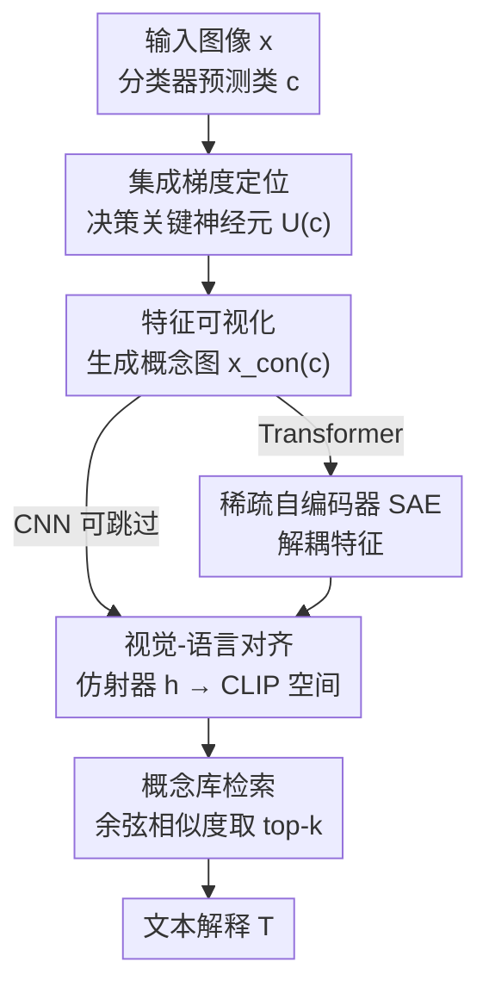

# Zero-Shot Textual Explanations via Translating Decision-Critical Features

**会议**: CVPR 2026  
**arXiv**: [2512.07245](https://arxiv.org/abs/2512.07245)  
**代码**: https://github.com/tttt-0814/TEXTER (有)  
**领域**: 可解释性 / 视觉分类器解释 / 概念可视化  
**关键词**: 文本解释, 决策关键特征, 集成梯度, 概念图, 稀疏自编码器, CLIP 对齐

## 一句话总结
提出 TEXTER：先用集成梯度找出对某类预测贡献最大的神经元、用特征可视化把这些神经元编码的"决策关键特征"渲染成一张概念图，再把概念图对齐到 CLIP 空间从概念库里检索文本，从而零样本地给图像分类器生成"真正驱动预测的理由"而非"图里最显眼的东西"。

## 研究背景与动机
**领域现状**：要让图像分类器变透明，常见三条路。一是概念瓶颈模型（CBM）和自然语言解释（NLE）模型，先预测人定义的概念或直接生成文字理由，但都需要概念/解释标注、且会复刻标注偏置；二是大型视觉-语言模型（BLIP、LLaVA、GPT-4V）能写描述，但它们面向通用视觉理解，不是为某个具体分类器的推理服务；三是零样本对齐方法（Text-To-Concept、ZSNLE），用一个线性层把分类器特征空间对齐到 CLIP，无需任何概念标注就能用文字描述图像。

**现有痛点**：第三条路最轻量也最实用，但它对齐的是**整张图的全局特征** $f(x)$。全局特征描述的是"画面里有什么、什么最显眼"，而不是"什么驱动了这次预测"。论文的招牌例子：一张猫的图，Text-To-Concept 把预测解释成 "cushions"（坐垫）——坐垫占画面大、但和"判成猫"毫无关系。

**核心矛盾**：忠实的解释应该对齐到**决策关键特征**（如猫的胡须斑点），而全局特征里这些关键信号被显眼的背景淹没了。把整图喂进对齐器，等于一开始就丢掉了"哪部分让模型做出这个判断"的信息。

**本文目标**：在不重训原分类器、不要任何概念/解释标注的前提下，(1) 把分类器隐空间和语言空间对齐；(2) 从全局特征 $f(x)$ 里**隔离出**预测类 $c$ 的决策关键特征 $z^{(c)}$，再翻译成文字。

**切入角度**：神经科学式的假设——**贡献最大的神经元编码了支撑预测的特征**。那么只要找到这些神经元、把它们激活到底所对应的图像长什么样，就得到了一张"只强调决策证据"的图（概念图），对它做对齐就绕开了背景干扰。

**核心 idea**：用"贡献神经元 → 概念图 → CLIP 检索"这条链，把对齐目标从"整张图"换成"决策关键特征的可视化"，从而生成忠实于推理过程的文本解释。

## 方法详解

### 整体框架
TEXTER 解决的是：给定一个**只在图像上训练、没有任何语言能力**的分类器 $\mathcal{F}=g\circ f$，零样本地用自然语言说清"它为什么把 $x$ 判成类 $c$"。整条流水线分三段：**概念图生成**（把决策关键特征渲染成一张图）→ **视觉-语言空间对齐**（把分类器特征映进 CLIP）→ **文本解释生成**（拿概念图特征去概念库里检索最相似的描述）。其中概念图生成又含三小步：用集成梯度定位贡献神经元、用特征可视化把这些神经元渲染成概念图、对 Transformer 额外套一层稀疏自编码器（SAE）解耦特征。整个过程只训练 SAE 和仿射对齐器 $h$，且它们不参与分类器推理、不需任何标注，因此**完全不动原模型精度**。

### 关键设计

**1. 集成梯度定位决策关键神经元：把"谁该负责这次预测"量化出来**

直接对全局特征做对齐之所以失败，是因为没人告诉对齐器"哪些维度才是决策证据"。TEXTER 先在某层特征 $z=f^{(\ell)}(x)$ 上给每个神经元算一个贡献分。对第 $j$ 个神经元、预测类 $c$，用集成梯度沿从基线 $z'$（默认零向量）到 $z$ 的直线路径累加梯度：

$$s_j^{(c)} = (z_j - z'_j)\sum_{m=1}^{M}\frac{\partial F_c\big(z' + \tfrac{m}{M}(z-z')\big)}{\partial z_j}\cdot\frac{1}{M}$$

其中 $F_c$ 是把特征向量映到类 $c$ logit 的函数，$M{=}100$ 是积分步数。分数越高代表该神经元对"判成 $c$"贡献越大。按 $s_j^{(c)}$ 降序取 top-$k_\text{neu}$（默认 $k_\text{neu}{=}6$）得到神经元集合 $U^{(c)}$。这一步把"决策证据"从弥散的全局特征里压成了一小撮可定位的神经元，是后面隔离 $z^{(c)}$ 的前提。

**2. 特征可视化生成概念图：把抽象神经元渲染成一张"只含证据"的图**

光知道哪些神经元重要还不能对齐——CLIP 吃的是图像不是神经元下标。TEXTER 用特征可视化反向优化出一张图 $x_\text{con}^{(c)}$，使 $U^{(c)}$ 里这些神经元的激活之和最大：

$$x_\text{con}^{(c)} = \underset{x'\in\mathcal{X}}{\arg\max}\;\mathcal{L}(x') - \lambda\mathcal{R}(x'),\qquad \mathcal{L}(x') = \sum_{j\in U^{(c)}}[f^{(\ell)}(x')]_j$$

为了让生成图留在自然图像分布里、不退化成对抗噪声，采用 MACO（magnitude-constrained optimization）：在傅里叶空间只优化相位谱、保持幅度谱不变。这样得到的概念图就是"决策关键特征的可视化体现"——猫的例子里它会高亮胡须斑点而非坐垫。关键的形式化在于：把 $f(x)\mapsto x_\text{con}^{(c)}\mapsto f(x_\text{con}^{(c)})$ 整条链当作论文要找的投影 $\varphi$，于是 $z^{(c)}:=f(x_\text{con}^{(c)})$ 就是隔离出来的决策关键特征。

**3. 稀疏自编码器解耦 Transformer 纠缠特征：让概念图在 Transformer 上也成立**

作者实测：上面两步在 CNN 上效果好，但在 ViT/DINO 上几乎失效——概念图回分类器后 top-1 准确率只有 0.08~0.11。原因是 Transformer 以更"组合化"的方式表示物体，特征空间高度纠缠，单个神经元不再对应单一概念，没法干净地隔离决策因子。TEXTER 对此套一层 TopK 稀疏自编码器，把 $f(x)$ 编码成稀疏表示：

$$\Psi(f(x)) = \operatorname{TopK}\big(W_\text{enc}(f(x)-b_\text{pre})\big),\qquad L_\text{SAE} = \|f(x)-W_\text{dec}\Psi(f(x))\|_2^2$$

$\operatorname{TopK}$ 只保留最大的 $K$ 个分量、其余置零，把纠缠特征拆成稀疏、轴对齐的单元。随后把 SAE 当成分类器的附加模块——在贡献分公式里令 $z=\Psi(f(x))$、$y_c=[g(W_\text{dec}\hat z)]_c$，在特征可视化里把 $f^{(\ell)}(x')$ 换成 $\Psi(f(x'))$。加了 SAE 后 ViT 的概念图 top-1 准确率从 0.11 飙到 0.99。这是 TEXTER 能跨 CNN/Transformer 通用的关键。

**4. 视觉-语言对齐 + 概念库检索：把概念图翻译成可读的类相关文字**

最后要把概念图变成文字。先训练一个仿射对齐器 $h(f(x))=Wf(x)+b$，最小化它和 CLIP 图像编码器输出之间的距离（沿用 Text-To-Concept 的做法）：

$$\min_{W,b}\frac{1}{|\mathcal{D}_\text{train}|}\sum_{x\in\mathcal{D}_\text{train}}\|Wf(x)+b-E_\text{img}(x)\|_2^2$$

对齐后分类器特征就落进了 CLIP 联合空间。生成解释时，把概念图特征 $h(f(x_\text{con}^{(c)}))$ 和候选描述的文本嵌入 $E_\text{text}(t_i)$ 算余弦相似度，取 top-$k_\text{con}$（默认 3）作为解释。候选不是无穷文本而来自一个**概念库** $\mathcal{B}(x,c)$：给定图 $x$ 和预测类 $c$，用 LLM（GPT-3.5-turbo）生成 100 条该类的通用描述、用 VLM（Qwen2.5-VL-7B）对该图生成 30 条视觉 grounded 的描述，合成 130 条候选。与 Text-To-Concept 的本质区别在于：后者拿全局特征 $f(x)$ 检索，TEXTER 拿决策关键特征 $f(x_\text{con}^{(c)})$ 检索，所以输出的是驱动预测的理由。这条检索还天然支持**类条件解释**——对同一张图指定不同目标类，能分别给出"为什么像 A / 为什么像 B"的解释。

### 损失函数 / 训练策略
只有两个可训练组件：(1) SAE 用重构损失 $L_\text{SAE}$ 训练；(2) 仿射对齐器 $h$ 用 L2 对齐损失训练。训练数据沿用 Text-To-Concept 的协议，取 ImageNet-1K 训练集的 20%；对齐器走 ViT-B/16 视觉编码器、有官方权重的直接用 checkpoint。两个模块都不需额外标注、不介入分类器推理，因此对原始精度零影响。

## 实验关键数据

### 概念图有效性（是否保留了原始预测所用的特征）
在 ImageNet-1K 上随机取 1000 张图（200 类 × 5 张），把概念图回喂分类器，看预测是否还成立。指标：**Acc**（概念图对原预测标签 $c$ 的 top-1/top-5 准确率）、**$R_\text{conf}$**（概念图上类 $c$ 的 softmax 置信度 ÷ 原图上的置信度）、**Cos**（原图与概念图 logit 向量的余弦相似度）。越高越说明决策信息被保留。

| 模型 | SAE | Acc1 | Acc5 | $R_\text{conf}$ | Cos |
|------|-----|------|------|------|------|
| ResNet-18 | – | 0.92 | 1.00 | 1.38 | 0.72 |
| ResNet-50 | – | 0.92 | 1.00 | 1.19 | 0.74 |
| ViT | – | 0.11 | 0.17 | 0.06 | 0.11 |
| ViT | ✓ | **0.99** | **1.00** | **1.04** | 0.44 |
| DINO ViT-S/8 | – | 0.08 | 0.15 | 0.06 | 0.34 |
| DINO ViT-S/8 | ✓ | **0.89** | **0.96** | **0.91** | 0.61 |

CNN 不加 SAE 就很好；Transformer 不加 SAE 几乎全崩（top-1 ≈ 0.1），加上 SAE 后 ViT top-1 从 0.11 → 0.99，直接救活。

### 文本解释质量（多标签 PASCAL VOC，100 张测试图，取 top 类）
所有方法都用 TEXTER 生成的概念图作为比较目标。指标：**CLIP-Score**（概念图与解释文本在 CLIP 空间的相似度，↑）、**LPIPS(A)/(S)**（用 Stable Diffusion 把解释文本生成图、再与概念图算 AlexNet/SqueezeNet 感知距离，↓）、**FS**（概念图与生成图的分类器特征余弦相似度，↑）。

| 模型 | 方法 | CLIP-Score ↑ | LPIPS(A) ↓ | LPIPS(S) ↓ | FS ↑ |
|------|------|------|------|------|------|
| ResNet-50 | Random | 0.2050 | 0.7775 | 0.7041 | 0.5874 |
| ResNet-50 | Text-To-Concept | 0.2073 | 0.7698 | 0.7017 | 0.6032 |
| ResNet-50 | **TEXTER** | **0.2271** | **0.7609** | **0.6972** | **0.6378** |
| DINO ViT-S/8 | Random | 0.2182 | 0.7648 | 0.6943 | 0.3686 |
| DINO ViT-S/8 | Text-To-Concept | 0.2224 | 0.7592 | 0.6946 | 0.3933 |
| DINO ViT-S/8 | **TEXTER** | **0.2334** | **0.7539** | **0.6937** | **0.4082** |

TEXTER 在全部 5 个模型、全部 4 个指标上都优于 Random 和 Text-To-Concept，说明它的解释和决策关键特征语义对齐更好。

### 消融实验要点

| 配置 | 关键现象 | 说明 |
|------|---------|------|
| Full（含 SAE）| ViT Acc1 0.99 | 完整方法 |
| w/o SAE（CNN）| ResNet Acc1 0.92 | CNN 上 SAE 非必需，去掉几乎不掉，DINO-R50 反而略好 |
| w/o SAE（Transformer）| ViT Acc1 0.11、$R_\text{conf}$ 0.06 | Transformer 上去掉 SAE 直接崩，证明 SAE 是跨架构通用的关键 |
| w/o 概念图（=Text-To-Concept）| CLIP-Score / FS 全面更低 | 用全局特征代替概念图，解释退化为"显眼但无关"的描述 |

**关键发现**：
- 贡献最大的是 SAE——但**只对 Transformer 起决定性作用**，CNN 本身特征够解耦、不依赖它。这印证了"Transformer 特征更组合化、更纠缠"的判断。
- 概念图 vs 全局特征是方法成败的分水岭：Text-To-Concept 对一张"人"的图给出背景（轿车轮廓）、对"电视"给出家具特征，而 TEXTER 给出发型/面部表情、高清屏/平板屏，明显贴近类相关证据。
- 跨架构能揭示**模型依据的差异**：同样判 Bedlington 㹴，ResNet/ViT 看银灰毛色纹理，DINO ViT 看"羊脸/窄口鼻"等结构脸部特征——说明自监督 Transformer 更依赖关系与上下文信息。
- 类条件解释能诊断**误分类**：一张实为 water snake 却被判成 stick insect 的图，把目标类设成 stick insect 时解释成"细长触角/细长身体节段"（背景树枝碎片被误读成虫肢），设成 water snake 时又能给出"在植被中滑行/毒性外观"，定位了出错原因。

## 亮点与洞察
- **把"对齐目标"从整图换成概念图**是最巧的一招：不改对齐器结构、不加标注，只是把喂进去的东西从 $f(x)$ 换成 $f(x_\text{con}^{(c)})$，就让零样本解释从"描述画面"升级到"解释推理"。这个替换思路可迁移到任何基于特征对齐的解释方法。
- **SAE 作为 Transformer 的"解耦适配器"**：作者发现概念图生成在 ViT 上失效，并精准归因到特征纠缠，再用 TopK SAE 把特征拆成稀疏轴对齐单元救活——这是把"机制可解释性 SAE"和"事后解释"缝在一起的实用范例。
- **类条件解释天然支持误分类诊断**：同一张图按不同目标类检索，能分别说出"为什么像 A / 像 B"，这是依赖全局图-文相似度的方法做不到的，对调试模型很有价值。
- **评估指标的换靶**：作者指出"拿解释和原图比"只衡量解释是否描述了图、而非是否反映推理，于是改成"拿解释和概念图比"，这个评估视角的修正本身也值得借鉴。

## 局限性
- **依赖特征可视化与 SAE 的质量**：概念图由 MACO 反向优化得到，本身就有不确定性；SAE 需要额外训练、其稀疏度 $K$、$k_\text{neu}$ 等超参对结果有影响（CNN 上 SAE 甚至会小幅掉点），论文未系统扫这些超参。
- **解释受限于概念库**：最终文字来自 LLM/VLM 生成的 130 条候选，库里没有的概念永远检索不到，解释的"上限"被概念库框住，且 LLM/VLM 自身偏置会渗入。
- **评估靠代理指标**：CLIP-Score / LPIPS / FS 都是和概念图的语义一致性，而概念图又是本方法自己产的——评估存在一定自洽循环，缺少独立的人类忠实度大规模验证（仅 appendix 提到 insertion/deletion 测试）。
- **规模有限**：定量实验只在 100~1000 张图上做，多标签仅 PASCAL VOC，更复杂场景的稳定性待验证。

## 相关工作与启发
- **vs Text-To-Concept**：两者都把分类器特征仿射对齐到 CLIP 再做文本检索，区别在检索时用的特征——Text-To-Concept 用全局 $f(x)$，TEXTER 用决策关键特征 $f(x_\text{con}^{(c)})$。优势是解释忠实于推理而非画面，代价是多了"找神经元 + 生成概念图 + SAE"的开销。
- **vs ZSNLE**：ZSNLE 做的是反向映射（把 CLIP 文本空间对齐到分类器权重空间），且评估时拿解释和原图比；TEXTER 正向映射且改用概念图作比较靶，强调隔离决策证据。
- **vs CBM / NLE**：CBM 和 NLE 都要概念/解释标注、且会复刻标注偏置，还往往要重训；TEXTER 完全零样本、不动原模型、不需标注，把概念解释的适用面拓宽到任意已训练分类器。
- **vs 通用 LVLM（BLIP/LLaVA/GPT-4V）**：它们面向通用视觉理解、描述的是图而非某分类器的决策；TEXTER 专门解释"这个特定分类器为什么这么判"。

## 评分
- 新颖性: ⭐⭐⭐⭐ 把"贡献神经元→概念图→CLIP 检索"串成零样本解释链，并用 SAE 打通 Transformer，组合新颖且切中真问题。
- 实验充分度: ⭐⭐⭐ 跨 CNN/Transformer 共 5 个模型、定性+定量+消融齐全，但样本规模偏小、缺独立人类忠实度评测。
- 写作质量: ⭐⭐⭐⭐ 问题设定（两大挑战）清晰，方法三段式叙述顺，图例（cushions vs whisker spots）直观。
- 价值: ⭐⭐⭐⭐ 零标注、不动模型、可做类条件误分类诊断，对模型调试与可信视觉系统有实用价值。

<!-- RELATED:START -->

## 相关论文

- [\[AAAI 2026\] Induce, Align, Predict: Zero-Shot Stance Detection via Cognitive Inductive Reasoning](../../AAAI2026/interpretability/induce_align_predict_zero-shot_stance_detection_via_cognitive_inductive_reasonin.md)
- [\[CVPR 2026\] Language Models Can Explain Visual Features via Steering](language_models_can_explain_visual_features_via_steering.md)
- [\[ICCV 2025\] SVIP: Semantically Contextualized Visual Patches for Zero-Shot Learning](../../ICCV2025/interpretability/svip_semantically_contextualized_visual_patches_for_zero-shot_learning.md)
- [\[CVPR 2026\] Measuring the (Un)Faithfulness of Concept-Based Explanations](measuring_the_unfaithfulness_of_concept-based_explanations.md)
- [\[CVPR 2025\] L-SWAG: Layer-Sample Wise Activation with Gradients information for Zero-Shot NAS on Vision Transformers](../../CVPR2025/interpretability/lswag_zero_shot_nas.md)

<!-- RELATED:END -->
