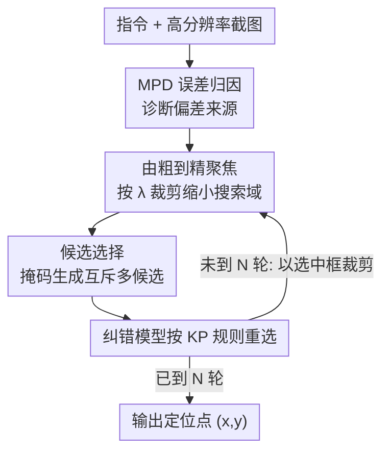

# BAMI: Training-Free Bias Mitigation in GUI Grounding

**会议**: CVPR 2026  
**arXiv**: [2605.06664](https://arxiv.org/abs/2605.06664)  
**代码**: https://github.com/Neur-IO/BAMI (有)  
**领域**: Agent / 多模态VLM  
**关键词**: GUI Grounding, 免训练, 归纳偏差, 测试时推理, 由粗到精

## 一句话总结
本文先用 MPD 归因法诊断出 GUI grounding 的错误主要来自两类归纳偏差（精度偏差 + 歧义偏差），再提出免训练的 BAMI 推理框架，用「由粗到精聚焦」消除精度偏差、用「候选选择」消除歧义偏差，把 TianXi-Action-7B 在 ScreenSpot-Pro 上的准确率从 51.9% 提到 57.8%。

## 研究背景与动机

**领域现状**：GUI grounding 是 GUI agent 的核心能力——给定自然语言指令 + 截图，模型要在高分辨率界面里精确定位目标控件坐标，才能执行点击/拖拽/输入等原子动作。主流范式已经从依赖 XML/DOM 结构树，转向「指令 + 截图 → MLLM 直接吐坐标」的纯视觉路线（如 OS-Atlas、UI-TARS、TianXi-Action）。

**现有痛点**：在专业软件场景（ScreenSpot-Pro 这类高分辨率、小目标、控件密集的 benchmark）上，绝大多数模型的准确率仍低于 50%。问题是，这些模型其实已经被充分训练过，为什么还是定位不准？是知识不够，还是别的原因？

**核心矛盾**：作者从「错误驱动」视角把失败分成两类——(1) **知识缺陷**：模型压根不认识目标；(2) **归纳偏差**：模型有相关知识、但因为自身的选择偏好出错。后者又细分为 **精度偏差**（认对了目标但坐标系统性偏移）和 **歧义偏差**（被相似区域/误导性语义带偏）。通过 MPD 归因法统计 50 个错误样本发现，只有约 14% 来自知识缺陷，而高达 74% 来自归纳偏差——这意味着**不重训模型、只优化推理方式**就能挽回大半错误。

**本文目标**：在完全不微调模型的前提下，分别针对精度偏差和歧义偏差设计推理时操作，把现有开源 backbone 的潜力榨出来。

**核心 idea**：把「一步到位的坐标回归」改造成「带偏差感知操作的递归式多步结构化推理」——外层用裁剪逐级聚焦修精度偏差，每一级内用「掩码生成多候选 + 外部模型重选」修歧义偏差。

## 方法详解

### 整体框架

BAMI（Bias-Aware Manipulation Inference）是一个套在任意现成 grounding 模型外面的免训练推理流程。输入是「指令 q + 截图 I」，输出是单个定位点 (x, y)。它把单步定位拆成 N 轮「由粗到精」的外循环：每一轮先在当前图上让 grounding 模型反复预测、每预测一个候选框就把框内像素掩掉以逼出互斥的多个候选，然后交给一个外部「纠错模型」按 GUI 先验规则从候选里挑出最合理的框，再以该框为中心按比例 λ 裁剪图像进入下一轮；N 轮后取最终框中心作为定位点。整套流程的诊断依据来自前置的 MPD 归因。

### 关键设计

**1. MPD 误差归因：把"模型到底看哪儿"画成热力图**

要对症下药，先得知道错在哪。传统梯度归因（GradCAM、Integrated Gradients）不适配「离散文本 → 坐标」这种生成式输出；改用 Shapley 值在数学上更严谨，但对高分辨率截图单样本要在一块 RTX 4090 上算约 10 小时，完全不可行。本文提出 **Masked Prediction Distribution (MPD)**：对同一截图随机遮挡不同区域、重复预测（每样本 300 次扰动），把所有预测点的空间频率聚合成热力图，约 20 分钟出一张。热力图里预测点越密、说明模型对该区域越自信，从而**直观暴露错误来源**。基于它对 50 个错误样本的统计给出了关键诊断：知识缺陷 14%、精度偏差 20%、歧义偏差 54%、其他 12%——后两类共 74% 的归纳偏差正是 BAMI 要打的靶子

**2. 由粗到精聚焦：用层级裁剪消除离散化带来的精度偏差**

精度偏差的根因在坐标的离散化：Qwen 系模型把坐标值（如 $x_1=789$）拆成单个数字字符 `<7><8><9>` 再转成 token，**精度天生被钉死在个位级**，输出难以完美精确，误差有时达几十甚至上百像素。受人类「先扫一眼再凑近看」的观察策略启发，BAMI 先用 grounding 模型预测一个粗坐标 $(x^t, y^t)$，再以该点为中心把原图裁到比例 $\lambda<1$，把裁剪后的小图重新喂回模型做精定位得到 $(x^{t+1}, y^{t+1})$。裁剪等价于**局部放大、缩小搜索空间、抬高有效分辨率**，所以坐标越来越准。这里存在超参 trade-off：迭代次数过多会让累计裁剪比过大、反而丢上下文掉点（实验里 2 轮最优）；裁剪比 λ 太小（<40%）会裁掉关键上下文、太大又放大不够（实测 λ∈[0.5,0.7] 最佳）

**3. 候选选择：用掩码多样化 + 外部纠错模型修正歧义偏差**

歧义偏差来自训练目标与空间度量的错位：交叉熵优化的是 token 序列的**编辑距离**，而非坐标的**欧氏距离**。举例真值 $x_{\text{GT}}=789$，候选 $x'=189$ 与 $x''=801$，编辑距离 $d_{\text{edit}}(x_{\text{GT}},x')=1<d_{\text{edit}}(x_{\text{GT}},x'')=3$，但欧氏距离 $d_{\text{euc}}(x_{\text{GT}},x')=600>d_{\text{euc}}(x_{\text{GT}},x'')=12$——模型按编辑距离会选错的那个。BAMI 的解法分两步：先**掩码逼出互斥候选**——每预测出一个候选框就把框内像素遮掉再预测，保证新候选与已有结果互不重叠（每轮 2~3 个）；再用一个**外部纠错模型**（在线 GPT-5 / Gemini-2.5-Pro，或本地 LoRA 微调的 Qwen3-VL-8B）从候选里重选。关键不在用什么模型、而在 **prompt 设计**：朴素 prompt 没用，必须把符合 GUI 先验的 **Key Principle（KP）** 注入提示词（功能优先、记忆比对标准控件模式、交互元素优先于静态文本），相当于把欧氏空间的优先级先验灌进选择过程，纠正 grounding 模型按编辑距离排序的错误倾向

### 一个例子：一次 BAMI 推理（N=2, M=2~3）

以一张 ScreenSpot-Pro 专业软件截图为例：第 1 轮在全图上让模型预测，得到候选框 A，掩掉 A 内像素再预测得 B，凑出互斥候选集 {A, B}；纠错模型按 KP 规则判断「目标是可交互按钮」→ 选中 B；以 B 为中心按 λ=0.6 裁剪得到局部放大图进入第 2 轮；在局部图上同样掩码生成 2~3 个更精细候选、纠错模型再选一个；取第 2 轮选中框的中心点作为最终定位 (x, y)。两轮下来，搜索域从全屏收缩到目标局部、候选从编辑距离主导改为 GUI 先验主导，精度与歧义两类偏差被同时压下。

## 实验关键数据

### 主实验

在 ScreenSpot-Pro（高分辨率专业软件、小目标）上对比各类方法（Avg. 为综合准确率 %）：

| 方法 | 类型 | ScreenSpot-Pro Avg. |
|------|------|------|
| GPT-4o | 专有模型 | 0.8 |
| Claude Computer Use | 专有模型 | 17.1 |
| OS-Atlas-7B | GUI-SFT | 18.9 |
| UI-TARS-7B | GUI-SFT | 35.7 |
| TianXi-Action-7B | GUI-SFT | 51.9 |
| GUI-G2-7B | GUI-RL | 47.5 |
| GUI-RC | 测试时方法 | 41.2 |
| DiMo-GUI-7B | 测试时方法 | 49.7 |
| **BAMI-7B (本文)** | **测试时方法** | **57.8** |

BAMI 把基座 TianXi-Action-7B 从 51.9% 提到 **57.8%（+5.9）**，在 7B 级别拿到 SOTA，且明显超过同为测试时方法的 DiMo-GUI（49.7）和 GUI-RC（41.2）。

跨基座一致性（Table 3，+BAMI 为加本文方法后的 Avg.）：

| 基座 | 原始 | + BAMI | 提升 |
|------|------|--------|------|
| UGround-7B | 16.5 | 30.0 | +13.5 |
| OS-Atlas-7B | 18.9 | 41.6 | +22.7 |
| UI-TARS-1.5-7B | 40.8 | 51.9 | +11.1 |
| TianXi-Action-7B | 51.9 | 57.8 (GPT-5) / 56.2 (本地) | +5.9 / +4.3 |

对越弱的基座增益越大（OS-Atlas +22.7），说明 BAMI 主要在「模型有知识但被偏差带偏」的样本上发力。

### 消融实验

两类操作各自的贡献，以及 prompt 设计（Table 4，基座 51.9%）：

| 配置 | 准确率 | 说明 |
|------|--------|------|
| Baseline | 51.9 | TianXi-Action-7B 原始 |
| + 由粗到精聚焦 (PB) | 55.2 | 单独消除精度偏差 +3.3 |
| + 候选选择 (AB) | 54.3 | 单独消除歧义偏差 +2.4 |
| + BAMI (PB+AB) | **57.8** | 两者叠加 +5.9 |
| Vanilla prompt | 55.7 | 纠错模型用朴素提示 |
| + w/ CoT | 57.0 | 加思维链 |
| + w/ CoT & KP | **57.8** | 再加 Key Principle 先验 |

不同纠错模型（Table 5）：在线 API 里 GPT-5（57.8）、Gemini-2.5-Pro（57.2）最好；本地 LoRA 微调的 Qwen3-VL-8B 达 56.2，且参数量与 grounding 模型同级。

### 关键发现
- **歧义偏差占比最高（54%）但单修增益略低于精度偏差**：歧义偏差是错误的最大来源，但单独加候选选择 +2.4，略小于单独加聚焦的 +3.3——说明歧义更难靠重选完全纠正，两者叠加才补满。
- **KP 先验是 prompt 的胜负手**：从 Vanilla(55.7) 到 CoT(57.0) 再到 CoT&KP(57.8)，把 GUI 欧氏空间先验注入提示词才是关键，朴素 prompt 用不动纠错模型。
- **超参有明显甜区**：迭代 2 轮、裁剪比 λ≥40%（实用区间 0.5~0.7）最佳；迭代过多/裁剪过狠都会因丢上下文掉点。
- **本地纠错模型几乎追平在线 API**：8B 同级别本地模型 56.2 vs GPT-5 的 57.8，差距仅 1.6，照顾了隐私与独立部署需求。

## 亮点与洞察
- **MPD 是个便宜又直观的归因工具**：用「随机遮挡 + 多次预测 + 频率聚合」把不可微的「文本→坐标」过程的注意力可视化，把 Shapley 的 10 小时压到 20 分钟，这个思路可迁移到任何「输出离散、梯度不好用」的定位/检测任务做错误诊断。
- **把"为什么错"量化成偏差占比再对症设计**，而不是一上来就堆模块——14%/20%/54% 的归因数据直接决定了 BAMI 只打归纳偏差、不碰知识缺陷，方法动机非常扎实。
- **编辑距离 vs 欧氏距离的错位分析一针见血**：点破了「token 序列优化目标」和「空间定位需求」的根本冲突（789 vs 189/801 的反例），这是 MLLM 坐标回归的通病，外部几何约束纠错是个可复用的补丁。
- **掩码逼互斥候选**是个巧设计：不靠采样温度凑多样性，而是物理遮挡已选区域强制模型看别处，保证候选不退化成同一个框的复制。

## 局限与展望
- **依赖外部纠错模型**：最佳结果靠 GPT-5/Gemini 这类在线大模型，引入了额外的隐式知识与 API 成本；本地 Qwen3-VL-8B 虽追平到 56.2，但仍需 128K 双框样本做 LoRA 微调，并非纯免训练。
- **多步推理推高了推理开销**：N 轮外循环 × 每轮 M 候选，相比单步定位是数倍前向，论文强调「成本可控」但未给出与基线的延迟/吞吐量化对比，⚠️ 效率优势以原文定性表述为准。
- **只验证了 ScreenSpot 系**：ScreenSpot-V2 结果放在补充材料、正文未展开；对更长链路的真实 GUI agent 任务（多步操作、跨页面）的端到端收益尚未验证。
- **裁剪策略对"目标横跨大区域"可能失效**：由粗到精假设目标能被逐级框小，若初始粗定位严重偏离、裁剪会把真目标裁出视野，缺少回退机制的讨论。

## 相关工作与启发
- **vs 指令微调路线（OS-Atlas / UI-TARS / AGUVIS）**：他们靠在 GUI 数据上 SFT 提升定位，本文不碰权重、只改推理，且能直接套在这些 backbone 上再涨点（OS-Atlas +22.7），是正交增益。
- **vs 强化学习路线（GUI-G1/G2 / InfiGUI-R1 / TianXi-Action）**：RL 方法用 IoU 奖励、高斯空间建模等改善空间推理，本文指出即便 RL 训过的强基座仍残留归纳偏差，BAMI 作为推理后处理可叠加。
- **vs 语言空间推理增强（CoT 类）**：已有工作发现把语言链式推理直接搬到 GUI 反而掉点；本文的 Query/Context Expansion 预实验也证实纯加语言序列无效甚至引入新错，于是转向**图像空间**操作（裁剪 + 掩码）。
- **vs 图像空间多阶段方法（ScreenSeekeR / R-VLM / DiMo-GUI / GUI-RC）**：同样走「先区域后细化」或多预测聚合，但本文额外引入 MPD 归因驱动设计、并用外部纠错模型 + KP 先验显式修歧义偏差，在测试时方法里取得最高 57.8。

## 评分
- 新颖性: ⭐⭐⭐⭐ MPD 归因 + 偏差驱动的免训练推理框架角度新颖，但「由粗到精裁剪」「多预测聚合」在 GUI 测试时方法里已有先例。
- 实验充分度: ⭐⭐⭐⭐ 多基座 + 多纠错模型 + 组件/prompt/超参消融较完整，但延迟成本与 ScreenSpot-V2 正文展开不足。
- 写作质量: ⭐⭐⭐⭐ 归因→根因分析→对症设计的逻辑链清晰，编辑距离 vs 欧氏距离的反例讲得很透。
- 价值: ⭐⭐⭐⭐ 免训练即插即用、对弱基座增益显著，对实际部署 GUI agent 很实用。

<!-- RELATED:START -->

## 相关论文

- [\[CVPR 2026\] Towards GUI Agents: Vision-Language Diffusion Models for GUI Grounding](towards_gui_agents_vision-language_diffusion_models_for_gui_grounding.md)
- [\[ACL 2026\] ZARA: Training-Free Motion Time-Series Reasoning via Evidence-Grounded LLM Agents](../../ACL2026/llm_agent/zara_training-free_motion_time-series_reasoning_via_evidence-grounded_llm_agents.md)
- [\[CVPR 2025\] TANGO: Training-free Embodied AI Agents for Open-world Tasks](../../CVPR2025/llm_agent/tango_training-free_embodied_ai_agents_for_open-world_tasks.md)
- [\[AAAI 2026\] Co-EPG: A Framework for Co-Evolution of Planning and Grounding in Autonomous GUI Agents](../../AAAI2026/llm_agent/co-epg_a_framework_for_co-evolution_of_planning_and_groundin.md)
- [\[CVPR 2026\] GUI-CEval: A Hierarchical and Comprehensive Chinese Benchmark for Mobile GUI Agents](gui-ceval_a_hierarchical_and_comprehensive_chinese_benchmark_for_mobile_gui_agen.md)

<!-- RELATED:END -->
