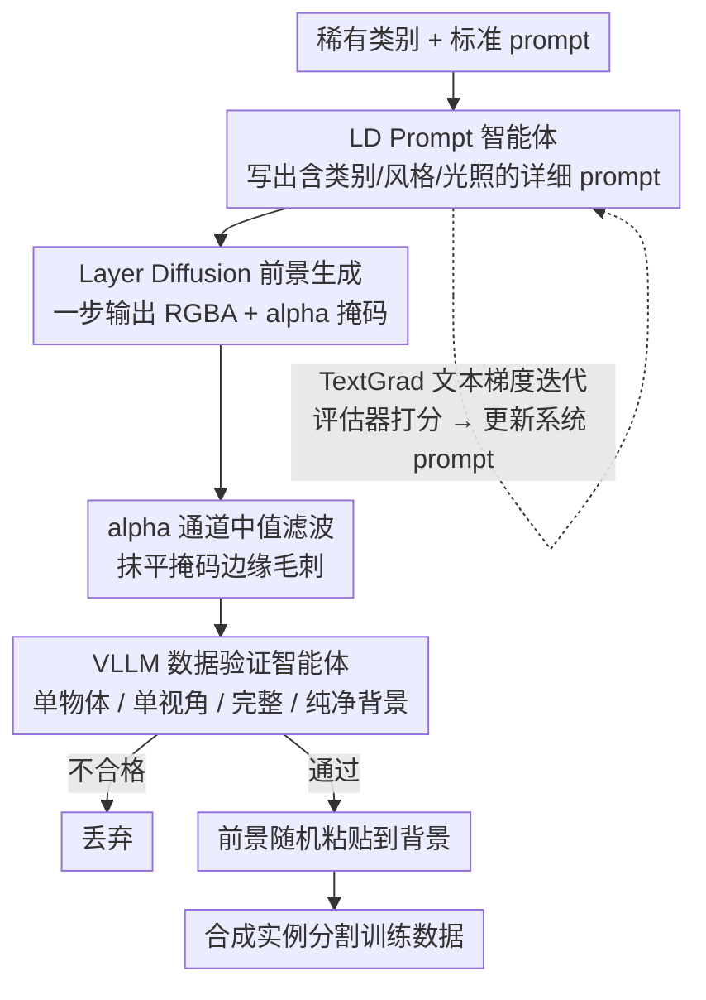

# Gen-n-Val: Agentic Image Data Generation and Validation

**会议**: CVPR 2026 Findings  
**arXiv**: [2506.04676](https://arxiv.org/abs/2506.04676)  
**代码**: [GitHub](https://github.com/aiiu-lab/Gen-n-Val)  
**领域**: LLM Agent  
**关键词**: 数据增强, 合成数据, 智能体数据生成, 长尾分布, 实例分割

## 一句话总结
本文提出 Gen-n-Val，一个基于智能体的合成数据生成与验证框架，通过 LLM 优化 Layer Diffusion 的 prompt 生成高质量单物体透明图像，再用 VLLM 过滤低质量样本，将无效合成数据从 50% 降至 7%，在 LVIS 稀有类实例分割上提升 7.6% mAP。

## 研究背景与动机

1. **领域现状**：大规模数据集（如 LVIS 1,203 类）中存在严重的长尾分布——稀有类别仅出现在不到 10 张图像中。合成数据是缓解数据稀缺的重要手段。现有方法包括 Copy-Paste 增强和基于扩散模型的生成（如 X-Paste、MosaicFusion）。
2. **现有痛点**：MosaicFusion 使用交叉注意力图生成分割掩码，但约 50% 的数据被过滤丢弃，剩余数据中仍有约 50% 存在问题：(1) 单个掩码覆盖多个物体；(2) 分割掩码不准确；(3) 类别标签错误。直接使用 Layer Diffusion 的标准 prompt 生成的数据约 44% 无效，因为单调模糊的描述导致低多样性和多余物体。
3. **核心矛盾**：高质量合成数据需要"单物体 + 精确掩码 + 正确类别 + 高多样性"，但标准 prompt 无法同时满足这些要求，人工设计规则过滤效率低且遗漏多。
4. **本文目标**：设计一个自动化的智能体管线，生成高质量合成数据用于平衡长尾数据集。
5. **切入角度**：用 LLM 作为 prompt 智能体生成详细具体的 prompt（包含物体类别、风格、颜色、光照等），用 VLLM 作为验证智能体过滤不合格图像；两个智能体的系统 prompt 都通过 TextGrad 优化。
6. **核心 idea**：Layer Diffusion 天然输出 alpha 通道提供精确掩码（无需额外分割模型），LLM 优化的 prompt 确保单物体和高多样性，VLLM 验证兜底过滤漏网之鱼。

## 方法详解

### 整体框架
Gen-n-Val 要解决的是"合成数据虽多但一半是废品"的问题：直接拿标准 prompt 喂 Layer Diffusion，约 44% 的图像因为画面里多了无关物体、单调重复而不可用。它的思路是把"怎么写出好 prompt"和"什么样的图能用"这两件本来靠人工试错的事，分别交给两个 LLM 智能体自动完成。整条管线分三步：先由一个 LLM Prompt 智能体写出详细具体的 LD prompt，再由 Layer Diffusion 据此生成带 alpha 通道的透明单物体图像，最后由一个 VLLM 验证智能体逐张检查、淘汰不合格样本；通过验证的前景实例被随机粘贴到背景图上，得到可直接训练检测/分割模型的合成数据。两个智能体的系统 prompt 都不是手写的，而是用 TextGrad 自动迭代优化出来的。

### 关键设计

**1. TextGrad 优化的 LD Prompt 智能体：让 LLM 自己学会写"能生成单物体图"的 prompt**

标准 prompt 如 `"a photo of a single <object>"` 太模糊，Layer Diffusion 看到这种描述往往画出多余物体、构图也高度雷同，是 44% 无效率的主因。作者没有人工去猜"加哪些词描述更好"，而是搭了一个三角色的优化回路让 LLM 自己迭代：Prompt 智能体 $A_{p_{LD}}$ 从当前系统 prompt $p_{\text{sys}}$ 生成具体的 LD prompt $p_{LD}$，Prompt 评估器 $E_{\text{prompt}}$ 给这条 prompt 打分并产出一段**文本形式的损失** $L$（指出哪里不够好），TextGrad 再把这段文本反馈当作"梯度"反传去更新系统 prompt，得到 $p_{\text{sys}}^*$。一个 Prompt 验证器 $V_{\text{prompt}}$ 比较优化前后两版 prompt 的质量、决定是否采纳新版，如此循环直到验证器满意或到达最大迭代次数。优化后的系统 prompt 会引导 $A_{p_{LD}}$ 在每条 prompt 里写全物体类别、动作、环境、风格、颜色、纹理、光照、视角等属性——正是这些细节同时压住了"多余物体"和"低多样性"两个毛病。

**2. Layer Diffusion 前景生成：用 alpha 通道拿到"免费"的精确掩码**

合成数据要训实例分割，每个物体都得配一张精确掩码。MosaicFusion 靠交叉注意力图反推掩码、X-Paste 再挂一个额外分割模型，前者质量不稳、后者 GPU 开销大（X-Paste 的 GPU 时间是 MosaicFusion 的 4.3 倍）。Gen-n-Val 改用 Layer Diffusion——它把 alpha 透明通道直接编码进 Stable Diffusion 的潜在分布里，生成时一步输出 RGBA 图像，那条 alpha 通道本身就是一张和物体像素级对齐的分割掩码，不需要任何额外分割模型。生成后只对 alpha 通道做一次中值滤波，去掉孤立的噪声像素、把掩码边缘抹平。掩码"免费"且天然对齐，这是整套方法掩码质量更高的根因。

**3. VLLM 数据验证智能体：给漏网的废品兜最后一道底**

prompt 优化把无效率压到约 7% 之后，仍有少量图像不合格（比如偶尔多出一个物体、物体被截断），靠人工规则去筛既慢又漏。作者让一个 VLLM（Meta-LLaMA-3.2-11B-Vision-Instruct）当验证智能体，它的系统 prompt 同样由 TextGrad 优化得到，把四条验收标准写进去逐张判图：单物体（只含一个目标类别物体）、单视角（从单一角度展示）、完整性（物体完整可见）、纯净背景（背景空白无干扰）。任何一条不满足就丢弃。这一步把无效率从约 7% 进一步压到 <1%，相当于在自动生成之后再加一个自动质检员。

### 一个完整示例：以一个稀有类（比如 `pickaxe` 鹤嘴锄）走一遍

假设要给 LVIS 里某个稀有类补数据。第一步，Prompt 智能体拿到的系统 prompt 已被 TextGrad 调好，于是它不会只写 `"a photo of a pickaxe"`，而是生成一条带细节的 LD prompt——指明单把鹤嘴锄、木柄金属头、侧 45° 视角、自然光、纯色背景等；评估器若觉得描述还不够区分性，会写一段文字反馈，系统 prompt 据此再优化一轮。第二步，Layer Diffusion 按这条 prompt 输出一张 RGBA 图，alpha 通道里就是这把锄子的精确轮廓，中值滤波抹平边缘毛刺。第三步，VLLM 验证智能体看这张图：如果画面干净、只有一把完整的锄子，通过；如果背景里混进了第二把工具或锄头被裁掉，直接丢弃。通过的前景被抠出来贴到随机背景上，连同 alpha 掩码一起进训练集。把这个流程跑满整个稀有类列表，无效样本占比从标准 prompt 的约 44% → prompt 优化后约 7% → VLLM 验证后 <1%，最终注入的有效实例可从 1,874 一路扩到 727,393。

### 损失函数 / 训练策略
这里的"损失"不是数值而是文本：TextGrad 用 LLM 生成的反馈文本充当梯度来优化两个智能体的系统 prompt，没有任何反向传播的数值梯度参与。Prompt 智能体的 LLM 用 Meta-LLaMA-3.1-8B-Instruct，验证智能体的 VLLM 用 Meta-LLaMA-3.2-11B-Vision-Instruct。

## 实验关键数据

### 主实验

**LVIS 实例分割**：

| 方法 | mAP_mask | mAP_mask_rare | 无效数据比例 |
|------|---------|--------------|------------|
| Mask R-CNN (baseline) | 21.7 | 9.6 | — |
| MosaicFusion | 23.1 | 15.2 | ~50% |
| Gen2Det | 23.6 | 15.3 | — |
| **Gen-n-Val** | **25.6** | **17.2 (+7.6)** | **~7%** |

**COCO 实例分割（YOLO11m）**：

| 方法 | mAP | mAP_rare |
|------|-----|---------|
| YOLO11m (baseline) | 10.3 | 6.5 |
| Copy-Paste | 10.4 | 6.7 |
| **Gen-n-Val** | **14.5** | **10.1 (+3.6)** |

### 消融实验

| 配置 | 无效数据比例 | 说明 |
|------|------------|------|
| 标准 prompt + LD | ~44% | 无 prompt 优化 |
| TextGrad 优化 prompt + LD | ~7% | Prompt 智能体有效 |
| + VLLM 验证 | <1% | 验证智能体进一步过滤 |
| MosaicFusion | ~50% | 基线方法 |

### 关键发现
- **无效数据从 50% 降至 7%**：Prompt 优化是最大贡献者，VLLM 验证进一步保障质量
- **稀有类提升最显著**（+7.6 mAP）：验证了合成数据在平衡长尾分布中的巨大价值
- **可扩展性**：注入更多合成数据（从 1,874 到 727,393 实例）带来持续提升（+0.9 → +7.6 mAP_rare）

## 亮点与洞察
- **Layer Diffusion 的 alpha 通道作为"免费掩码"**是最关键的技术选择：消除了对额外分割模型的依赖，从根源保证掩码与物体完美对齐
- **TextGrad 优化双智能体 prompt**是优雅的自动化方案：将"什么是好的生成 prompt"和"什么是合格的图像"这两个问题都交给 LLM 自动迭代优化，无需人工设计规则
- **数据质量 > 数据数量**的洞察值得关注：将无效数据从 50% 降至 7% 带来的提升比简单增加数据量更显著

## 局限与展望
- 依赖 Layer Diffusion 的生成质量——对某些稀有类别（如特定食物、工具）可能生成效果不佳
- TextGrad 优化需要多次 LLM 调用，存在一定的计算开销
- 仅验证了物体检测和实例分割任务，未扩展到语义分割、关键点检测等
- Copy-Paste 合成方式可能产生不自然的场景布局
- 未来可探索在 3D 场景中进行更真实的物体放置

## 相关工作与启发
- **vs MosaicFusion**: MosaicFusion 用交叉注意力生成掩码，50% 无效率。Gen-n-Val 用 alpha 通道 + 智能体验证，仅 7% 无效率，且掩码质量更高
- **vs X-Paste**: X-Paste 用额外分割模型获取掩码，GPU 时间是 MosaicFusion 的 4.3 倍。Gen-n-Val 的 alpha 通道方案更高效

## 评分
- 新颖性: ⭐⭐⭐⭐ Layer Diffusion + 双智能体 + TextGrad 的组合新颖且有效
- 实验充分度: ⭐⭐⭐⭐⭐ LVIS + COCO 两个基准、多个检测器、可扩展性分析
- 写作质量: ⭐⭐⭐⭐ 管线清晰，失败案例展示直观
- 价值: ⭐⭐⭐⭐⭐ 为长尾数据集的数据增强提供了实用且高效的解决方案

<!-- RELATED:START -->

## 相关论文

- [\[ACL 2025\] MetaSynth: Meta-Prompting-Driven Agentic Scaffolds for Diverse Synthetic Data Generation](../../ACL2025/llm_agent/metasynth_meta-prompting-driven_agentic_scaffolds_for_diverse_synthetic_data_gen.md)
- [\[ACL 2026\] Supplement Generation Training for Enhancing Agentic Task Performance](../../ACL2026/llm_agent/supplement_generation_training_for_enhancing_agentic_task_performance.md)
- [\[CVPR 2026\] SceneAssistant: A Visual Feedback Agent for Open-Vocabulary 3D Scene Generation](sceneassistant_a_visual_feedback_agent_for_openvoc.md)
- [\[ICCV 2025\] Embodied Image Captioning: Self-supervised Learning Agents for Spatially Coherent Image Descriptions](../../ICCV2025/llm_agent/embodied_image_captioning_self-supervised_learning_agents_for_spatially_coherent.md)
- [\[AAAI 2026\] A2Flow: Automating Agentic Workflow Generation via Self-Adaptive Abstraction Operators](../../AAAI2026/llm_agent/a2flow_automating_agentic_workflow_generation_via_self-adaptive_abstraction_oper.md)

<!-- RELATED:END -->
