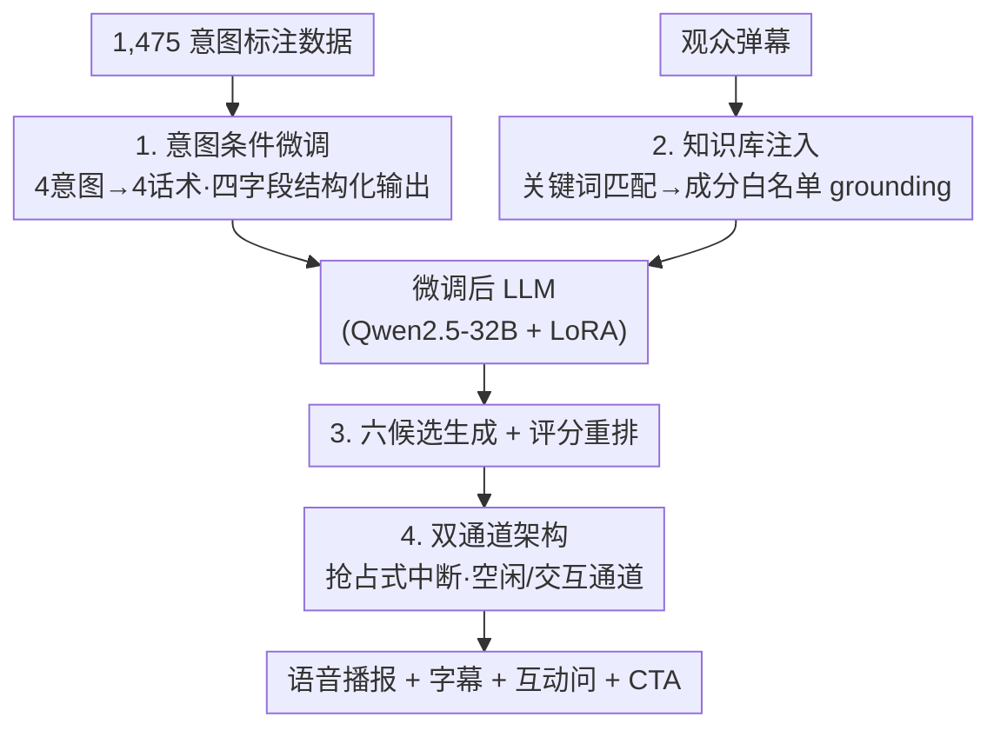

# VerbalValue: A Socially Intelligent Virtual Host for Sales-Driven Live Commerce

**会议**: CVPR 2026  
**arXiv**: [2605.14542](https://arxiv.org/abs/2605.14542)  
**代码**: https://github.com/Yukyin/VerbalValue  
**领域**: Agent / 多模态VLM / 对话生成  
**关键词**: 直播带货, 虚拟主播, 意图条件微调, 知识库 grounding, 双通道对话

## 一句话总结
VerbalValue 把"直播带货主播"重新定义成一个以成交转化为目标的销售型对话 agent：用 12 款产品的结构化知识库 + 成分白名单做事实锚定，用 1,475 条按四类观众意图标注的数据微调 Qwen2.5-32B，并设计一套"空闲讲解 / 交互应答"双通道架构来兼顾不间断口播和实时弹幕响应，相比 GPT-5.4 等基线在信息量上提升 23%、事实正确率提升 18%。

## 研究背景与动机
**领域现状**：直播电商是全球增长最快的零售形态之一（CAGR 超 33%，转化率可达传统电商的 10 倍），一场直播持续 4–6 小时，主播的终极目标是"成交转化"——把观众的好奇和娱乐参与变成真实下单。一个好主播要同时做到：不间断的产品口播、用专业知识可信地回答提问、并根据每条弹幕切换情绪语气（专业讲解 / 社交夸赞 / 有据反驳 / 幽默化解），还不能破坏让观众留下来看的那种轻松氛围。

**现有痛点**：现有方法各只覆盖问题的一个子集。对话推荐系统把"推荐"当作对话的终点，无法维持持续氛围口播；产品 QA 系统只处理孤立问题，没有会话级的节奏控制；虚拟主播系统只播放预录脚本，没有交互能力。直接套用通用大模型则产出过长（不适合实时 TTS）、会幻觉出产品记录里根本没有的成分功效、并且把每条弹幕都独立处理、瓦解了会话连贯性。

**核心矛盾**：作者指出做销售型虚拟主播在结构上有三个前人没有联合解决的根本矛盾——① **持续曝光 vs 响应交互**：既要保持产品始终在镜头里被讲解，又要随时打断去回应弹幕，单一生成 pipeline 无法在没有显式资源协调的情况下满足；② **销售专业性 vs 播报流畅度**：有效推销需要准确的成分/适用性/合规边界知识，却要用直播那种娱乐化、口语化的语气讲出来，而不受约束的 LLM 恰恰是靠"编造超出目录的产品声明"来获得更高词面流畅度的；③ **社交销售话术 vs 训练效率**：好主播对不同观众意图用质性不同的策略，但这些策略差异对基于内容的自动指标不可见、也无法靠纯规模涌现，必须有显式的意图监督。

**本文目标**：在中文美妆垂类上，造一个既能持续口播、又能按意图切换话术、还不幻觉产品事实的虚拟主播。

**核心 idea**：用"知识库 grounding 保证事实 + 意图条件微调保证话术差异化 + 双通道架构保证持续曝光与实时响应并存"三件套，分别对症三个矛盾。

## 方法详解

### 整体框架
VerbalValue 由一条**离线构建链**和一套**在线服务链**组成。离线侧：构建 12 款护肤品的结构化知识库（外加 23 种成分的白名单词表），并收集标注 1,475 条覆盖四类观众意图的直播交互数据，用 LoRA 在 Qwen2.5-32B-Instruct 上做意图条件微调。在线侧：观众弹幕先经关键词匹配检索到对应产品记录并注入系统提示做事实锚定，微调后的模型生成六个候选、由评分函数重排选最优；最终由"双通道对话架构"在持续口播和实时应答之间仲裁同一份音频资源，并把会话状态管理 / 模型推理与 TTS 合成 / 图片服务解耦成两个可独立部署的服务。

### 关键设计

**1. 意图条件微调与四字段结构化监督：把"按意图切换话术"做成显式训练目标**

针对"社交销售话术无法靠规模涌现"的矛盾，作者不指望大模型自己学会区分弹幕类型，而是把意图当作显式监督信号。数据按四类意图划分——询问（Inquiry，590 条 / 40%）、质疑（Scepticism，297 条 / 20%）、欣赏（Appreciation，294 条 / 20%）、对抗（Antagonism，294 条 / 20%），每条训练样本都带一个意图标签，直接把生成导向对应话术：询问→权威产品引导，欣赏→社交背书放大，质疑→共情+有据反驳，对抗→幽默化解。更关键的是**输出被强制成一个四字段 schema 并同时监督**：≤2 句口语化的口播文本、8–12 个汉字的展示标语、一个引导观众回复的追问、以及一句行动号召（CTA，如领券或点链接）。在一次生成里同时监督四个字段，逼模型把"该说的口播内容 / 屏幕展示文字 / 互动钩子 / 转化引导"解耦开。系统提示（人设 + 格式约束）被嵌进每一条训练样本而不是只在推理时挂上，使"格式合规"成为一等训练目标而非事后约束。

数据本身也经过严控：1,475 条来自等量的两路——公开美妆直播的真实弹幕，以及 GPT-5.2 生成的风格对齐合成弹幕（每条真实样本配一条风格相似但内容不同的合成对照，以补齐四类意图的覆盖均衡）。意图标签由 GPT-5.2 给出、再由三名标注员独立判定（标签对错二值 + 1–5 自然度），只有三人标签一致且平均自然度 >4.5 才保留，否则重标或重生成；随后四遍清洗去掉近重复（字符 n-gram Jaccard >0.7）、PII、结构非法响应、以及句编码器判出的语义不连贯样本。

**2. 产品知识库 grounding 与推理期上下文注入：用目录边界压住幻觉**

针对"销售专业性 vs 播报流畅度"的矛盾，作者用一个结构化知识库给所有产品相关回复划事实边界。目录涵盖 12 款护肤品（洁面、精华、面霜、防晒），每条记录含规范产品名、品类、关键成分及其功能角色、质地、适用肤质、使用说明、人工整理的直播话术点、以及合规免责声明；其中用于会话状态管理的内部数字产品 ID 被排除在一切生成上下文之外，防止泄漏进口播。配套的成分词表把 23 种成分映射到中性、非药理化的描述，**框定成分类提问的允许解释空间**，在平台合规约束下降低幻觉风险。每个目录条目还配一段 180–240 字、遵循"钩子–讲解–引导–收尾"弧线的口播脚本。

在线推理时，弹幕通过基于关键词的品类检测 + 覆盖度打分匹配知识库；命中后把检索到的产品记录序列化并追加到系统提示，从而在**不引入独立检索模型**的情况下让生成锚定在目录已验证的声明上。

**3. 六候选生成 + 评分重排：在已 grounded 的基础上再筛一道质量**

模型对每条弹幕用核采样生成六个候选（温度 0.9、top-p 0.92、重复惩罚 1.12），再用一个评分函数排序：惩罚产品对齐错误、未授权的产品提及、以及重复（包括与最近五条回复的 n-gram 重叠和套路化开场白），选最高分。它在微调骨干之上只贡献温和但一致的风格质量提升，是"锦上添花"而非主干。

**4. 双通道对话架构：用抢占式中断兼顾不间断口播与实时应答**

针对"持续曝光 vs 响应交互"的矛盾，对话服务维护一个**五阶段会话状态机**，在单一共享音频资源上仲裁两个通道。空闲通道（idle）顺序循环播放口播脚本语料，在观众不活跃时维持不间断产品讲解；一旦弹幕到达，交互通道（interactive）发出**抢占式中断**、锁定音频资源播放应答、在可配置的保持时长后释放，并从保存的句子边界处恢复空闲口播。同时把会话状态管理与模型推理，和 TTS 合成与产品图服务，解耦成两个可独立部署的服务，把延迟敏感的生成与 I/O 密集的媒体操作隔离开。前端浏览器再协调播放、字幕、产品展示与唇形动画。

### 损失函数 / 训练策略
LoRA 施加于所有线性层，秩 8、缩放因子 32；训练 20 epoch，batch size 32，学习率 $10^{-4}$，bfloat16 精度，最大序列长度 2,048 token。推理时生成 6 候选（温度 0.9 / top-p 0.92 / 重复惩罚 1.12）后重排。

## 实验关键数据

### 主实验
评测在中文美妆直播评测集上进行。基线为 GPT-5.4、Claude Sonnet 4.6、Gemini 3.1 Pro（均给同样的主播人设 + 产品上下文提示），以及未微调的 Qwen2.5-32B-Instruct（用于隔离监督微调的贡献）。人工评测用 1–5 Likert（三名标注员，Krippendorff's $\alpha>0.7$）评 Informativeness（信息量，目录锚定的产品信息）、Relevance（切题）、Fluency（播报语气自然度）、Tactfulness（对该意图是否用对策略）、Correctness（无目录外事实声明的回复占比）；LLM-as-Judge 用 Qwen2.5-72B 评 Creativity（避免套路模板）与 Engagement（观众继续互动的可能）。

| 方法 | Info | Rele | Flu | Tact | Corr | Crea | Enga |
|------|------|------|------|------|------|------|------|
| GPT-5.4 | 3.46 | 4.85 | **4.86** | 4.21 | 0.73 | 3.95 | 3.87 |
| Claude Sonnet 4.6 | 3.51 | 4.43 | 4.91 | 4.27 | 0.55 | 4.23 | 4.55 |
| Gemini 3.1 Pro | 2.88 | 3.76 | 3.78 | 3.18 | 0.38 | 3.24 | 3.13 |
| Qwen2.5-32B-Instruct | 2.52 | 3.21 | 2.25 | 2.36 | 0.44 | 2.58 | 2.84 |
| **VerbalValue** | **4.32** | **4.91** | 4.62 | **4.45** | **0.86** | **4.52** | **4.61** |
| Δ(%) vs 最强基线 | +23.08 | +1.24 | −5.91 | +4.22 | +17.81 | +6.86 | +1.32 |

两个最大增益是 Informativeness（+23.08%）与 Correctness（+17.81%，相对最强基线），直接验证知识 grounding 假设：没有目录约束时，基线表现出典型幻觉特征——编造产品名、未经核实的资质、虚构的用户证言、超白名单的成分建议。Tactfulness（+4.22%）验证意图条件监督的价值：基线无论弹幕类型如何都坍缩成"询问式"信息回复，在质疑和对抗类输入上系统性失败。唯一落后的是 Fluency（−5.91%，输给 Claude），因为四字段结构化监督约束了风格自由度——这揭示出"事实锚定 vs 语言表达力"的张力：Claude 靠生成超出目录边界的内容获得更高词面流畅度，同时也产生更高幻觉率，而基于参考文本的相似度指标检测不到这种 trade-off。

### 消融实验
| 配置 | 关键指标变化 | 说明 |
|------|---------|------|
| Full (VerbalValue) | Info 4.32 / Corr 0.86 / Tact 4.45 / Enga 4.61 | 完整模型 |
| w/o PCI（去产品上下文注入） | Corr −0.43, Info −1.18 | 事实退化最大，确认其为首要 grounding 机制 |
| w/o TT（去意图类型标签） | Tact −0.96 | 话术退化最大，证明跨类策略差异来自意图监督而非规模 |
| w/o MSS（去多字段监督） | Enga −0.65 | 互动性下降最大，追问字段是观众持续互动的关键驱动 |
| w/o RR（去重排） | 影响最小 | 仅贡献温和的风格质量提升 |

### 关键发现
- **产品上下文注入（PCI）是事实正确率的主干**：去掉后 Correctness 掉 0.43、Info 掉 1.18，是所有消融里事实退化最严重的，印证"幻觉问题靠 grounding 而非靠模型变大解决"。
- **话术差异化来自意图监督而非规模**：去掉意图标签后 Tactfulness 掉 0.96 最多，说明同一个 32B 模型在没有显式意图条件时无法自发区分对质疑/对抗该用什么策略。
- **互动性靠"追问字段"**：去掉多字段监督后 Engagement 掉 0.65 最多，证明四字段里的"追问钩子"是维持观众互动连续性的关键。
- **流畅度与事实的固有张力**：VerbalValue 在 Fluency 上唯一落后，但作者论证这正是因为它不靠编造来提升词面流畅——传统相似度指标奖励的是表面相似而非事实保真，与直播带货目标错位。

## 亮点与洞察
- **把"主播"重新框定为成交转化问题**：不再把推荐当对话终点，而是要求情绪智能（共情/反驳/幽默/夸赞按意图切换），这个 reframing 本身就指出了对话推荐与产品 QA 的盲区。
- **抢占式中断的双通道是个很可复用的工程范式**：用单一共享音频资源 + 五阶段状态机，让"持续口播"与"实时应答"在没有两套生成 pipeline 冲突的情况下共存，并从保存的句子边界恢复——这套思路可迁移到任何"背景流 + 突发交互"的实时多模态系统（如 AI 客服、陪伴机器人）。
- **四字段结构化输出把多个生成目标解耦**：一次生成同时产出口播 / 展示标语 / 追问 / CTA，既保证格式合规又让每个字段各司其职，是把"格式当一等训练目标"的好例子。
- **指出标准 NLP 指标与直播带货目标错位**：流畅度与事实正确的 trade-off、以及"建立信任的钩子" vs "空洞促销断言"的差别，都对表面相似度指标不可见——这对评测设计有警示意义。

## 局限与展望
- **垂类与规模都很窄**：只在中文美妆做了 12 款产品、1,475 条数据，是否能扩到其它品类（数码、食品）和更大目录未验证；知识库靠人工整理，扩展成本高。
- **Fluency 落后**：四字段约束牺牲了语言表达力，长时段直播下口播是否会显得僵硬、套路化，论文未做长程会话评测。
- **评测仍偏离线**：用的是评测集 + 人工/LLM 打分，没有真实直播间的转化率（GMV、点击、下单）这类终极业务指标，"sales-driven"的承诺尚未用真实成交数据证实。
- **合规与伦理依赖白名单**：成分白名单和免责声明是合规的主要保障，但白名单之外的边缘提问如何处理、以及作者建议的"向观众披露 AI 身份"在实际部署中的落地，都还是开放问题。

## 相关工作与启发
- **vs 对话推荐系统（CRS）**：它们把推荐当作对话的终点、给出推荐就结束，无法维持持续氛围口播；VerbalValue 把推荐只当其中一环，强调持续曝光 + 按意图差异化的销售话术。
- **vs 产品 QA 系统**：QA 系统处理孤立问题、没有会话级节奏；本文用双通道状态机做会话级的口播/应答仲裁。
- **vs 虚拟主播系统**：传统虚拟主播只播预录脚本、无交互；本文在脚本口播之上叠加了实时抢占式交互通道。
- **vs 直接套用通用 LLM**：通用 LLM 输出过长、幻觉成分功效、独立处理每条弹幕；本文用知识库 grounding 压幻觉、用四字段约束控长度与格式、用状态机维持会话连贯。

## 评分
- 新颖性: ⭐⭐⭐⭐ 把直播带货 reframe 为成交转化型 agent，并用双通道抢占式中断 + 意图条件四字段监督组合解决三个矛盾，组合很新；单个组件（LoRA / KB 注入 / 重排）较常规。
- 实验充分度: ⭐⭐⭐ 对比强基线 + 七维度人工/LLM 评测 + 四项消融较扎实，但只在单一垂类、缺真实转化率与长程会话评测。
- 写作质量: ⭐⭐⭐⭐ 三矛盾→三方案的论证清晰，对"流畅度 vs 事实"的张力剖析到位。
- 价值: ⭐⭐⭐⭐ 直播电商落地价值大，双通道实时交互范式与"指标与业务目标错位"的观察对工业界有直接启发。

<!-- RELATED:START -->

## 相关论文

- [\[ACL 2026\] Shopping Companion: A Memory-Augmented LLM Agent for Real-World E-Commerce Tasks](../../ACL2026/llm_agent/shopping_companion_a_memory-augmented_llm_agent_for_real-world_e-commerce_tasks.md)
- [\[ACL 2025\] SynWorld: Virtual Scenario Synthesis for Agentic Action Knowledge Refinement](../../ACL2025/llm_agent/synworld_agentic_action_knowledge.md)
- [\[AAAI 2026\] Reflection-Driven Control for Trustworthy Code Agents](../../AAAI2026/llm_agent/reflection-driven_control_for_trustworthy_code_agents.md)
- [\[ICLR 2026\] CoMind: Towards Community-Driven Agents for Machine Learning Engineering](../../ICLR2026/llm_agent/comind_towards_community-driven_agents_for_machine_learning_engineering.md)
- [\[ICML 2026\] NaviAgent: Graph-Driven Bilevel Planning for Scalable Tool Orchestration](../../ICML2026/llm_agent/naviagent_graph-driven_bilevel_planning_for_scalable_tool_orchestration.md)

<!-- RELATED:END -->
