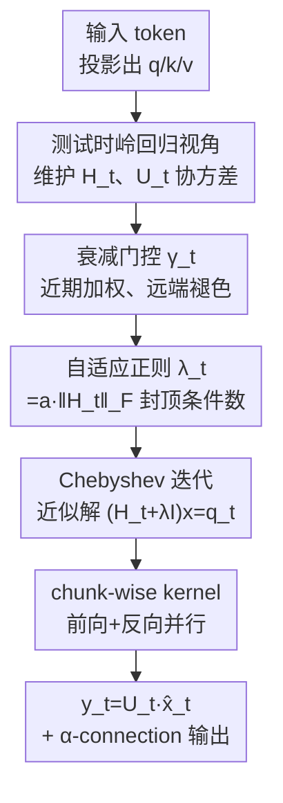

# Gated KalmaNet: A Fading Memory Layer Through Test-Time Ridge Regression

**会议**: CVPR2026  
**arXiv**: [2511.21016](https://arxiv.org/abs/2511.21016)  
**代码**: https://github.com/awslabs/hybrid-model-factory (有)  
**领域**: LLM效率 / 序列建模 / 状态空间模型  
**关键词**: 线性SSM, 卡尔曼滤波, 测试时岭回归, Chebyshev迭代, 长上下文

## 一句话总结
把线性状态空间模型（SSM）的状态更新重新解释成"对全部历史做一次测试时岭回归"，用卡尔曼滤波的精确增益替代现有 SSM 的一步梯度近似，并通过自适应正则 + Chebyshev 迭代解决低精度数值不稳与并行训练两大障碍，在短/长上下文及 ImageNet 上都超过 Mamba2、Gated DeltaNet 等线性 SSM。

## 研究背景与动机
**领域现状**：softmax Attention 能对整个上下文做精确联想检索，但时间复杂度随序列长度二次增长、KV-cache 线性膨胀。线性 SSM（Mamba2、(Gated) DeltaNet、GLA 等）把全部历史压成一个固定维度的状态矩阵 $S_t$，做到线性计算、常数存储，是 Attention 最被看好的替代。

**现有痛点**：线性 SSM 的状态是"会褪色的有损摘要"，在 recall（联想检索、长上下文问答）类任务上明显逊于 Attention。作者把根因落到**优化目标**上：以 Gated DeltaNet 为例，它的状态更新等价于对 $\min_S \|Sk_t - v_t\|_2^2$ 做**一步**梯度下降——只看上一时刻的有损状态和当前 token，是一个"短视"目标；而 Attention 的目标 $y_t = \arg\min_v \sum_{i=1}^t c_i \|v - v_i\|_2^2$ 用到了**全部**精确 KV-cache。

**核心矛盾**：要让状态"考虑全部历史"通常意味着要存全部历史（回到 Attention 的二次代价）；要常数存储就只能丢信息。如何在常数存储/线性计算下，让每步更新都基于完整历史最优？

**切入角度**：作者注意到卡尔曼滤波（KF）正好提供了这种"在线、考虑全部历史、最优"的更新——KF 在 MAP 意义下最优地求解一个加权岭回归，且其递推也是"低秩加单位阵"形式，和现有 SSM 同构。更进一步，DeltaNet / Gated DeltaNet / Kimi Delta Attention 都可看成 KF 递推在"误差协方差取单位阵"这一粗暴假设下的近似——它们丢掉了"过去的 key/value 应该如何最优地影响状态更新"这一二阶信息。

**核心 idea**：保留完整误差协方差、计算精确卡尔曼增益；在稳态假设下，这恰好退化为一个**带常数存储、线性计算的在线岭回归**——再用工程手段把它做得在 bfloat16 下数值稳定、且能在 GPU 上 chunk-wise 并行训练。

## 方法详解

### 整体框架
GKA（Gated KalmaNet）是一个可直接替换 Transformer 中 Attention 的记忆层。每个时刻 $t$，它维护两个加权协方差 $H_t = \sum_i \eta_{t,i} k_i k_i^\top$（key 自相关）和 $U_t = \sum_i \eta_{t,i} v_i k_i^\top$（value-key 互相关），输出通过求解一个岭回归线性方程组得到：

$$y_t = U_t\,(H_t + \lambda_t I)^{-1} q_t.$$

直接对每个 $t$ 用精确求解器（如 `torch.linalg.solve`）要 $O(D^3)$ 且需显式物化所有 $H_t$，I/O 巨大且无法 chunk-wise 并行；KF 的顺序递推又在低精度下不稳。GKA 的做法是：用衰减门控 $\gamma_t$ 把 $H_t,U_t$ 写成线性 SSM 那样的可并行递推；用自适应正则把方程组的条件数封顶；用 Chebyshev 迭代（CH）只靠矩阵-向量乘近似求解 $(H_t+\lambda_t I)x=q_t$；最后用硬件感知的 chunk-wise kernel 同时跑前向和反向。整体数据流如下：

### 关键设计

**1. 把 SSM 状态更新重写成"对全部历史的测试时岭回归"**

现有线性 SSM 的短视根源在于它们的隐式目标只含"上一状态 + 当前 token"。GKA 把目标换成考虑全部历史的加权岭回归：
$$S_t = \arg\min_{S}\ \lambda \|S\|_F^2 + \sum_{i=1}^t \eta_i \|S k_i - v_i\|_2^2,$$
其解恰好可由 KF 递推 $S_t = S_{t-1} - \frac{(S_{t-1}k_t - v_t)k_t^\top \Phi_{t-1}}{1/\eta_t + k_t^\top \Phi_{t-1} k_t}$ 给出，其中 $\Phi_{t-1}$ 是该目标 Hessian 的逆（用 Woodbury 恒等式在线更新）。关键洞察是：DeltaNet、Gated DeltaNet、Kimi Delta Attention 都等价于把这个 $\Phi$ 近似成单位阵——也就是假设误差协方差各向同性、忽略 key 之间的相关性；GKA 保留完整 $\Phi$（即精确卡尔曼增益），才真正用上了二阶信息。$\lambda$ 在这里有明确语义：它控制常数大小状态能"记住"多少信息，超过容量就会"模糊回忆"，相当于记忆容量旋钮。这样设计有效，是因为它把"为什么 SSM 不如 Attention"从经验现象提升成了一个可证明次优的近似——补回被丢掉的协方差就该涨点

**2. 自适应正则：用 Frobenius 范数把条件数封顶**

在 bfloat16 下，求解 $(H_t+\lambda_t I)x=q_t$ 的最坏数值误差是 $\epsilon\cdot\kappa$，其中机器精度 $\epsilon\approx 0.007$、$\kappa$ 是 Hessian 条件数；作者指出已有 test-time optimization 工作（如把 $\lambda$ 下界设到 0.25）的 $\kappa$ 仍可高达 500，对应最坏误差 3.5，训练直接 NaN。GKA 不固定 $\lambda$，而是让它随数据走：取 $\lambda_t = a\cdot\|H_t\|_F$。由于 $\lambda_{\max}(H_t)\le\|H_t\|_F$，条件数被解析地封顶：
$$\kappa_t = \frac{\lambda_{\max}(H_t)+\lambda_t}{\lambda_{\min}(H_t)+\lambda_t} \le \frac{\|H_t\|_F + \lambda_t}{\lambda_t} = \frac{a+1}{a}.$$
一个超参 $a$ 就把数值稳定性锁死，与具体求解算法无关。难点在于 $\|H_t\|_F$ 要在 chunk-wise 训练里高效算、还要能反向传播——而 $H_t$ 本身是个嵌套递推，作者推导了一套用累积门控向量 $\zeta$、上三角矩阵 $M$ 和 Gram 矩阵 $G_C=K_C^\top K_C$ 的并行公式（如第三项可写成 `column-sum(((G⊙G)M)⊙M)`），把整段范数计算放进 kernel。这一步是把"理论上稳"变成"工程上能训"的关键

**3. Chebyshev 迭代（CH）：低精度下比 CG 更稳的并行求解器**

精确求解器无法 chunk-wise 并行，于是改用一阶迭代法。常见选择是共轭梯度（CG），但作者实测：CG 用隐式微分做反向时，单层尚可（梯度与精确解差 $10^{-3}$），叠到 5 层 LLaMA 时误差被放大到接近 1——梯度彻底跑偏，等于没在学。GKA 改用经典的 Chebyshev 迭代：它是一种带特定权重调度 $\omega_i \leftarrow \frac{4}{4-\rho^2\omega_{i-1}}$ 的加速梯度法，利用 $H_t+\lambda_t I$ 的特征值上下界 $L=\|H_t\|_F+\lambda_t$、$\mu=\lambda_t$ 做最优加速。CH 在前向收敛到比 CG 更小的残差，反向无论用隐式微分还是 autograd，梯度都与精确解吻合到 $10^{-6}$；作者还给出 Lemma 2 证明"CH 的隐式微分梯度恰等于其 autograd 精确梯度"，从而能用隐式微分省下存储中间迭代的开销。据作者所知，这是首次把 CH 用于大规模稳定训练序列建模层。反向里还有一个 $B_i k_i$ 项（因 $w_i H_i$ 非低秩）比常规 SSM 难，作者把它拆成 intra-chunk / cross-chunk 两段递推求解，且其掩码 $M_w$ 是满阵（不像普通 SSM 的三角掩码），让所有 token 在反向都能互相影响、利于信息流动

**4. 衰减门控与 α-connection：把"近因偏置"和残差通路装进层里**

为兼顾表达力与线性时间，GKA 让残差权重 $\eta_{t,i}=\prod_{j=i+1}^t \gamma_j$ 随时间指数衰减（$\gamma_j\in[0,1]$ 可学），从而无需像 Attention 那样显式算 query-key 内积，就把"近期 token 更重要、远端逐渐褪色"的先验编码进去；这也正是 $H_t,U_t$ 能写成 $H_t=\gamma_t H_{t-1}+k_t k_t^\top$ 这种可并行递推的原因。架构上还加了一条 α-connection：用 sigmoid 得到 $\alpha_t\in[0,1]$，输出是原始 query $q_t$ 与 CH 解 $\hat{x}_t$ 的凸组合，起到类似残差连接的作用、给梯度一条直达通路。（论文主体实验固定输入门 $\beta_t\equiv 1$；作者注明后续工作加入可学 $\beta_t$ 写门会进一步提升长上下文表现，并把带 $\beta_t$ 的版本作为发布默认实现）

## 实验关键数据

### 主实验
短上下文：2.8B 模型在 DCLM 上预训练 100B token，零样本评测 8 个常识推理任务 + 2 个 recall 密集任务（FDA/SWDE），平均准确率（节选）：

| 模型 | HellaSWAG | PIQA | SciQ | Winogrande | FDA | SWDE | 平均 |
|------|-----------|------|------|------------|-----|------|------|
| Transformer（参照上界） | 60.96 | 73.56 | 79.50 | 61.72 | 58.53 | 72.28 | 63.92 |
| Mamba2 | 62.23 | 73.78 | 79.80 | 62.19 | 7.71 | 41.13 | 55.94 |
| Gated DeltaNet | 62.80 | 74.32 | 80.60 | 62.35 | 8.26 | 44.28 | 57.00 |
| **GKA（本文）** | **63.84** | **74.81** | **83.20** | **64.17** | 12.89 | 50.95 | **58.89** |

GKA 平均超过所有线性 SSM baseline，且在 recall 密集的 FDA/SWDE 上相对最强 SSM 提升约 10%；但与 Attention 仍有差距（尤其 recall），因为 Attention 有"过目不忘"的 KV-cache。

长上下文（2.8B 模型在 128K 上下文继续预训练 25B token，RULER + HELMET）：GKA 在 **RAG 与 LongQA 上相对所有 SSM baseline 至少提升 10%**（相对值），是首个训练并评测到 128K 上下文的 SSM（此前工作多止步 4K/8K）。但在 Synthetic Recall 上只在 4K 时有竞争力、之后落后；ICL 上所有模型都接近随机。

ImageNet 分类（~31.8M 参数，GKAVision 即把 MambaVision 的 mixer 块换成 GKA 层）：

| 模型 | Top-1 (%) | 吞吐 (K img/s) |
|------|-----------|----------------|
| MambaVision-T | 81.18 | 16.25 |
| **GKAVision-T** | **81.27** | 13.72 |
| NextViT-S（ViT 参照） | 81.99 | 10.32 |

未做任何视觉专属改动即超过 MambaVision，并以高 33% 的训练吞吐逼近纯视觉 Transformer。

### 消融 / 分析

| 配置 / 分析点 | 关键结果 | 说明 |
|---------------|----------|------|
| MQAR 联想检索 | GKA 在所有序列长度与模型维度上均优于全部线性 SSM | 验证"基于全历史 MAP 估计"带来更强远端信息保留 |
| 求解器：CG vs CH（前向） | CH 最终残差最小；CG 收敛快但精度上限低 | Fig.1a |
| 求解器：CG vs CH（5 层反向梯度） | CG(impl) 误差放大到≈1 跑偏；CH 与精确解差 $10^{-6}$ | CH 在深层网络才稳得住 |
| 训练吞吐（单层） | GKA 与 GDN 同 state size 下速度相当 | chunk-wise 并行抵消了更贵的状态更新 |

### 关键发现
- **最大贡献来自"换目标"**：把短视的单步目标换成考虑全历史的岭回归（设计 1），是 MQAR / recall 任务全面领先的根源。
- **数值稳定不是工程小事而是成败关键**：CG 单层看起来没问题，叠到 5 层就梯度崩溃；自适应正则（封顶 $\kappa$）+ CH（设计 2、3）缺一不可，否则 bfloat16 训练直接 NaN。
- **优势分场景**：GKA 擅长贴近自然文本分布的 RAG/LongQA（预训练权重指导该记什么），而对"随机 token 逐字检索"的合成任务反而不占优——因为它做的是 MAP 估计而非逐字存储。

## 亮点与洞察
- **统一视角很漂亮**：用一句"现有 SSM = 误差协方差取单位阵的卡尔曼滤波近似"把 DeltaNet 系列全部串起来，并指出它们丢掉的恰是二阶协方差信息——这把"SSM 为什么弱"从经验观察提升成可证明的次优性，动机扎实。
- **把数值分析请回深度学习**：$\epsilon\cdot\kappa$ 误差界 + Frobenius 范数封顶条件数（$\kappa\le(a+1)/a$），一个超参锁死稳定性，这种"先界住最坏误差再谈算法"的思路在追求 SOTA 的层设计里很少见但很对。
- **CH 的复活**：把经典 Chebyshev 迭代用作可微分层求解器，并证明其隐式微分梯度=autograd 梯度（省内存又不丢精度），是可迁移到其它"测试时优化"层的通用 trick。
- **可迁移性**：α-connection（query 与求解结果的可学凸组合）本质是给任意"求解器即层"加一条残差直连，思路可直接搬到其它把优化问题嵌进网络的层。

## 局限与展望
- **与 Attention 仍有差距**：在纯 recall（FDA/SWDE、合成检索）上 GKA 离 Transformer 还有明显距离，常数存储的"模糊回忆"是结构性上限；论文给出的弥合方式是 Hybrid（SSM+Attention 堆叠），但那已部分放弃纯线性优势。
- **合成检索反而落后**：长上下文 Synthetic Recall 上 4K 之后掉队，说明 MAP 估计对"逐字随机 token"不友好——若任务是精确字符串检索，GKA 不是好选择。
- **工程复杂度高**：自适应范数的可微 chunk-wise 反传、CH 的 intra/cross-chunk $B_i k_i$ 推导都相当精细，复现门槛和 kernel 调试成本不低。
- **主体实验用 $\beta_t\equiv 1$**：真正推荐的写门增强版（$\beta_t$）的收益主要引自后续工作，本文正文未系统消融，长上下文增益的归因还需更独立的验证（⚠️ 以原文及后续工作为准）。

## 相关工作与启发
- **vs Gated DeltaNet / DeltaNet / Kimi Delta Attention**：它们的状态更新等价于对瞬时目标做一步梯度（误差协方差≈单位阵）；GKA 保留完整协方差、解全历史岭回归，区别就在"用不用二阶信息看全部过去"，代价是更贵的状态更新（被 chunk-wise 并行抵消）。
- **vs Mamba2 / GLA / RetNet**：这些用启发式的 forgetting/input gate 构造褪色状态；GKA 的门控 $\gamma_t$ 同样褪色，但它是岭回归权重 $\eta_{t,i}$ 的参数化，褪色之外还配了一个有最优性保证的求解目标。
- **vs softmax Attention（参照上界）**：Attention 解非参数点估计、存全 cache（二次代价）；GKA 解参数化线性估计、常数存储（线性代价），用"够好的全历史 MAP"换"完美但昂贵的逐字检索"。
- **vs 已有 test-time optimization 工作**：前人要么不加正则（低精度病态）、要么 $\lambda$ 下界仍不足致 $\kappa\sim500$；GKA 的贡献正是把数值稳定性这件被忽视的事做扎实。

## 评分
- 新颖性: ⭐⭐⭐⭐⭐ 用卡尔曼滤波统一并超越整条 DeltaNet 系列，首次把 Chebyshev 迭代用作大规模可微层求解器
- 实验充分度: ⭐⭐⭐⭐ 覆盖合成检索/短长上下文/视觉三类，128K 评测扎实；但主体用 $\beta_t\equiv1$、写门增益部分外引
- 写作质量: ⭐⭐⭐⭐ 理论动机清晰、数值分析到位，但 chunk-wise 推导密集、阅读门槛高
- 价值: ⭐⭐⭐⭐⭐ 给"线性 SSM 为何弱"一个可证明的答案，并配套可落地的稳定训练方案与开源 kernel

<!-- RELATED:START -->

## 相关论文

- [\[AAAI 2026\] MoETTA: Test-Time Adaptation Under Mixed Distribution Shifts with MoE-LayerNorm](../../AAAI2026/llm_efficiency/moetta_test-time_adaptation_under_mixed_distribution_shifts_with_moe-layernorm.md)
- [\[CVPR 2025\] Spatial-TTT: Streaming Visual-based Spatial Intelligence with Test-Time Training](../../CVPR2025/llm_efficiency/spatial-ttt_streaming_visual-based_spatial_intelligence_with_test-time_training.md)
- [\[ICML 2026\] ReMoE: Boosting Expert Reuse through Router Fine-Tuning in Memory-Constrained MoE LLM Inference](../../ICML2026/llm_efficiency/remoe_boosting_expert_reuse_through_router_fine-tuning_in_memory-constrained_moe.md)
- [\[ACL 2026\] CoMeT: Collaborative Memory Transformer for Efficient Long Context Modeling](../../ACL2026/llm_efficiency/comet_collaborative_memory_transformer_for_efficient_long_context_modeling.md)
- [\[AAAI 2026\] HN-MVTS: HyperNetwork-based Multivariate Time Series Forecasting](../../AAAI2026/llm_efficiency/hn-mvts_hypernetwork-based_multivariate_time_series_forecasting.md)

<!-- RELATED:END -->
