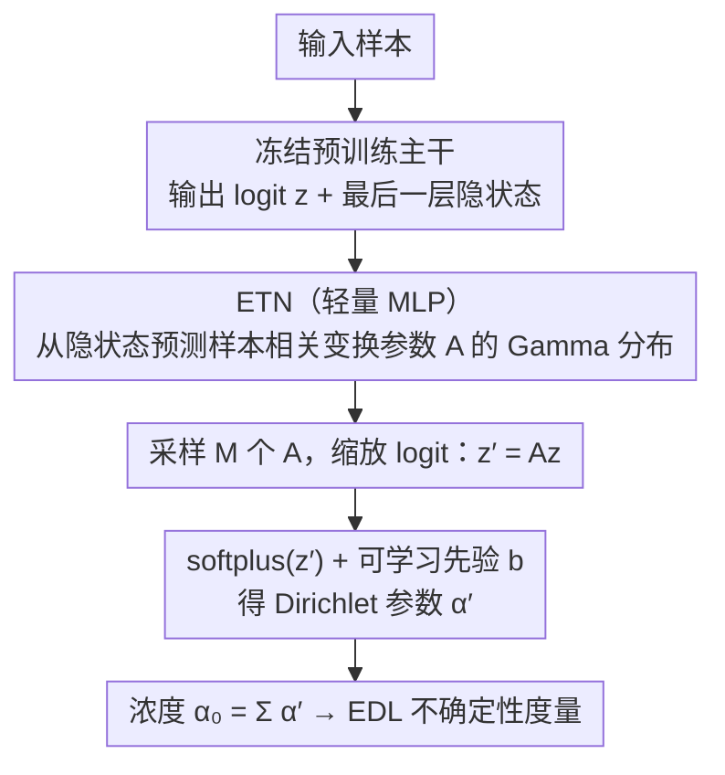

# Evidential Transformation Network: Turning Pretrained Models into Evidential Models for Post-hoc Uncertainty Estimation

**会议**: CVPR 2026  
**arXiv**: [2604.08627](https://arxiv.org/abs/2604.08627)  
**代码**: [GitHub](https://github.com/cyc9805/Evidential-Transformation-Network)  
**领域**: LLM预训练  
**关键词**: 不确定性估计, 证据深度学习, 后置方法, Dirichlet分布, 大语言模型

## 一句话总结
本文提出 Evidential Transformation Network (ETN)，一个轻量级后置模块，通过在 logit 空间学习样本相关的仿射变换，将预训练分类器或 LLM 转化为证据模型，以最小的计算开销实现可靠的不确定性估计。

## 研究背景与动机

1. **领域现状**：预训练模型已成为视觉和语言领域的标准，但通常不提供可靠的置信度度量。现有不确定性估计方法包括深度集成（Deep Ensembles）、MC Dropout 和 Laplace 近似等。证据深度学习（EDL）通过建模 Dirichlet 分布提供了更高效的替代方案。
2. **现有痛点**：深度集成需要训练多个模型，MC Dropout 需要多次前向传播，Laplace 近似需要计算 Hessian——这些方法对大规模预训练模型在计算上过于昂贵。EDL 虽然高效，但要求模型从头训练以输出证据量，这对已有的预训练网络不适用。
3. **核心矛盾**：预训练模型普遍使用交叉熵损失训练，但交叉熵不约束 logit 的尺度（Proposition 1 证明），因此无法直接提取有意义的不确定性。简单微调又会因小数据量导致过拟合和特征退化。
4. **本文目标**：设计一个轻量级模块，在不修改预训练模型参数、不损害预测准确率的前提下，将其转化为能输出 Dirichlet 分布参数的证据模型。
5. **切入角度**：在 logit 空间操作——对 logit 施加仿射变换，将变换后的 logit 解释为 Dirichlet 分布参数。关键创新是变换参数必须是样本相关的（因为交叉熵训练下不同样本的 logit 尺度任意不同）。
6. **核心 idea**：用一个轻量 MLP 从预训练模型的最后隐层状态预测样本相关的 Gamma 分布参数，采样变换参数对 logit 进行缩放，通过 ELBO 优化使变换后的 Dirichlet 分布逼近目标证据分布。

## 方法详解

### 整体框架
ETN 想解决的问题是：手里已经有一个用交叉熵训过的分类器或 LLM，怎么在不动它一根毫毛、也不增加推理成本的前提下，让它额外吐出一个可靠的不确定性。做法是在 logit 空间挂一个轻量后置模块。具体来说，样本先过冻结的预训练主干，拿到 logit 向量 $\mathbf{z}$ 和最后一层隐状态；ETN 是一个小 MLP，读这个隐状态，预测出一个样本相关的仿射变换参数 $A$；用 $A$ 把 logit 缩放成 $\mathbf{z}' = A\mathbf{z}$，再经 softplus 抬成正数得到 Dirichlet 参数 $\boldsymbol{\alpha}' = \text{softplus}(\mathbf{z}') + \mathbf{b}$。这样原模型的预测概率不变（保住准确率），但 $\boldsymbol{\alpha}'$ 把它重新解释成了一个 Dirichlet 后验，浓度 $\alpha_0 = \sum_k \alpha'_k$ 越小代表越不确定，证据深度学习（EDL）的那套不确定性度量就直接能用了。

### 关键设计

**1. 变换参数必须样本相关：先证明全局静态变换根本不可能work**

一个自然的想法是给所有样本配一组共享的缩放参数，但论文用 Proposition 1 把这条路堵死了。它证明在可分数据、无限容量的假设下，交叉熵损失对 logit 的尺度是完全不敏感的——存在 logit $\tilde{\mathbf{z}}$ 让交叉熵趋近 0 而总浓度 $\tilde{\alpha}_0$ 保持有限，也存在另一个 $\hat{\mathbf{z}}$ 同样让损失趋近 0 却使 $\hat{\alpha}_0 \to \infty$。换句话说，交叉熵最小化只钉死了概率向量的方向，没有钉死 $\alpha_0$ 的大小，于是每个样本训完后 logit 的尺度都是任意的。从贝叶斯视角看，EDL 要的是逐样本的后验 Dirichlet 分布，而交叉熵只给出单个概率向量——两者信息量本就不对等。这就解释了为什么 $A$ 不能是一组全局常数，而必须由当前样本的隐状态现场决定。

**2. 变分推断框架：把 $A$ 学成一个分布而不是一个值**

既然每个样本的合适缩放都不一样，ETN 干脆为 $A$ 引入变分分布 $q_{\theta_{ETN}}(A|x)$ 去逼近真实后验，而不是回归出一个确定值。$A$ 用 Gamma 分布建模——它支撑在正实数域，保证对 logit 做的是单调缩放。训练目标由 ELBO 推出，包含两项：重构项要求变换后的 Dirichlet 分布逼近由标签决定的目标分布 $p^{(\nu)}(\boldsymbol{\pi}|y)$，KL 项则把变分分布拉向先验 $p(A)$ 做正则。推理时对 $A$ 采 $M$ 个样本 $A^{(m)}$ 做 Monte Carlo 边际化，得到稳健的不确定性估计。先验里的 $\mathbf{b}$ 被设成可学习参数，松弛了 Subjective Logic 中固定先验的假设。比起 AdaTS 那类确定性温度缩放，这种概率建模能刻画每个样本自己的不确定性分布，而不是压成一个标量。

**3. 用 softplus 而非 ReLU/exp：既保数值稳定又能撑起 margin 保证**

把 $\mathbf{z}'$ 抬成正的 Dirichlet 参数需要一个激活函数 $f$，但选择并不随意。ReLU 会制造"零证据死区"——一旦 logit 为负就被截成 0，丢掉信息；指数函数则在预训练模型常见的大 logit 下让 $\alpha_0$ 直接爆炸（这里没有 log-sum-exp 那种稳定化技巧兜底）。softplus 两头都避开了：它保证输出为正，又对大正输入只线性增长，天然把 $\alpha_0$ 约束在合理范围。更进一步，Theorem 1 证明在等损失条件下，EDL 模型的分类间距（margin）在概率意义上大于交叉熵模型，而 softplus 下这个间距关系还有更好的保证。所以这个看似工程细节的选择，实际上同时决定了训练能不能稳和理论间距成不成立。

### 损失函数 / 训练策略
训练目标即 ELBO（Eq. 5）：重构项是变换后 Dirichlet 对目标分布的 KL 散度期望，用 Monte Carlo 近似；再加 $\lambda$ 倍的 KL 正则项约束变分分布贴近先验。整个训练只更新 ETN 这个 MLP 的参数和可学习先验 $\mathbf{b}$，主干模型全程冻结，且所需训练数据量远小于预训练数据。

## 实验关键数据

### 主实验

**图像分类不确定性估计（ID + OOD 平均 AUPR）**：

| 方法 | 不确定性性能 | 准确率保持 | 推理开销 |
|------|------------|-----------|---------|
| Deep Ensemble (5x) | 高 | ✓ | 5x 推理时间 |
| MC Dropout (10x) | 中 | ✓ | 10x 前向传播 |
| Laplace Approx. | 中 | ✓ | Hessian 计算 |
| DMM | 中高 | ✓ | 需原始训练数据 |
| **ETN** | **最高** | ✓ | **~1x（几乎无额外开销）** |

**LLM 问答不确定性估计**：

| 方法 | ID AUPR | OOD AUPR | 推理开销 |
|------|---------|----------|---------|
| Vanilla LLM | 低 | 低 | 1x |
| Ensemble | 高 | 高 | Nx |
| **ETN** | **最高** | **高** | **~1x** |

### 消融实验

| 配置 | 不确定性性能 | 说明 |
|------|------------|------|
| ETN (Gamma, softplus) | 最优 | 完整方法 |
| 标量 A | 较差 | 信息不足 |
| 向量 A | 良好 | 每类独立缩放 |
| 矩阵 A | 最优 | 类间交互 |
| 用 ReLU | 较差 | 零证据死区 |
| 用 exp | 不稳定 | 数值溢出 |
| 固定 b=1 | 较差 | 先验过强 |

### 关键发现
- **ETN 在几乎零额外推理开销下达到最佳不确定性估计**（Figure 1 中位于右上角：高性能 + 低成本）
- **变换参数维度影响**：矩阵形式 > 向量形式 > 标量形式（Figure 2），因为矩阵允许类间交互
- **可学习先验 b 一致性提升性能**：松弛 EDL 的固定先验假设是重要的

## 亮点与洞察
- **Proposition 1 的洞察**极其关键：交叉熵损失不决定 logit 尺度，因此不能直接从预训练模型提取有意义的不确定性。这个简洁的理论结果清晰地解释了"为什么需要样本相关变换"
- **logit 空间操作**是最巧妙的设计选择：不修改特征空间（保护预训练表示），不添加推理开销（变换几乎免费），且与 EDL 的 Dirichlet 参数化自然对接
- **从视觉到 LLM 的统一适用性**非常有价值：同一个框架同时改善图像分类器和大语言模型的不确定性估计，说明 logit 空间变换的通用性

## 局限与展望
- 依赖预训练模型的 logit 质量——如果预训练模型本身的 logit 无信息，变换也无法挽救
- 变分推断中的 Monte Carlo 采样（$M$ 次）虽然轻量但仍有小额外开销
- 仅在分类和 QA 任务上验证，缺少回归、分割等其他任务的实验
- 先验分布的选择（Gamma）是启发式的，未充分探索其他分布族
- 未来可探索将 ETN 与 retrieval-augmented 方法结合，利用检索结果进一步校准不确定性

## 相关工作与启发
- **vs Deep Ensembles**: Deep Ensembles 通过多模型取平均估计不确定性，效果好但计算成本为 Nx。ETN 仅需一个轻量模块，推理成本约 1x，在多数指标上表现更好
- **vs DMM (Dirichlet Meta Model)**: DMM 需要访问原始训练数据且模型大小随基模型深度增长。ETN 只需小数据集训练轻量 MLP，更适合大规模预训练模型
- **vs R-EDL**: R-EDL 松弛 EDL 的严格损失，但仍需从头训练。ETN 完全后置，适用于任何已有预训练模型

## 评分
- 新颖性: ⭐⭐⭐⭐ logit 空间样本相关变换的思路新颖，理论动机清晰
- 实验充分度: ⭐⭐⭐⭐ 覆盖视觉和 LLM，ID 和 OOD 设置，多种基线对比
- 写作质量: ⭐⭐⭐⭐⭐ 从动机到方法到实验的逻辑链条非常清晰
- 价值: ⭐⭐⭐⭐⭐ 为大规模预训练模型提供了实用的不确定性估计方案，应用前景广阔

<!-- RELATED:START -->

## 相关论文

- [\[NeurIPS 2025\] One Prompt Fits All: Universal Graph Adaptation for Pretrained Models](../../NeurIPS2025/llm_pretraining/one_prompt_fits_all_universal_graph_adaptation_for_pretrained_models.md)
- [\[ICML 2026\] Annotations Mitigate Post-Training Mode Collapse](../../ICML2026/llm_pretraining/annotations_mitigate_post-training_mode_collapse.md)
- [\[ICLR 2026\] Identifying and Evaluating Inactive Heads in Pretrained LLMs](../../ICLR2026/llm_pretraining/identifying_and_evaluating_inactive_heads_in_pretrained_llms.md)
- [\[ACL 2026\] Compact Example-Based Explanations for Language Models](../../ACL2026/llm_pretraining/compact_example-based_explanations_for_language_models.md)
- [\[ICLR 2026\] Steering Language Models with Weight Arithmetic](../../ICLR2026/llm_pretraining/steering_language_models_with_weight_arithmetic.md)

<!-- RELATED:END -->
