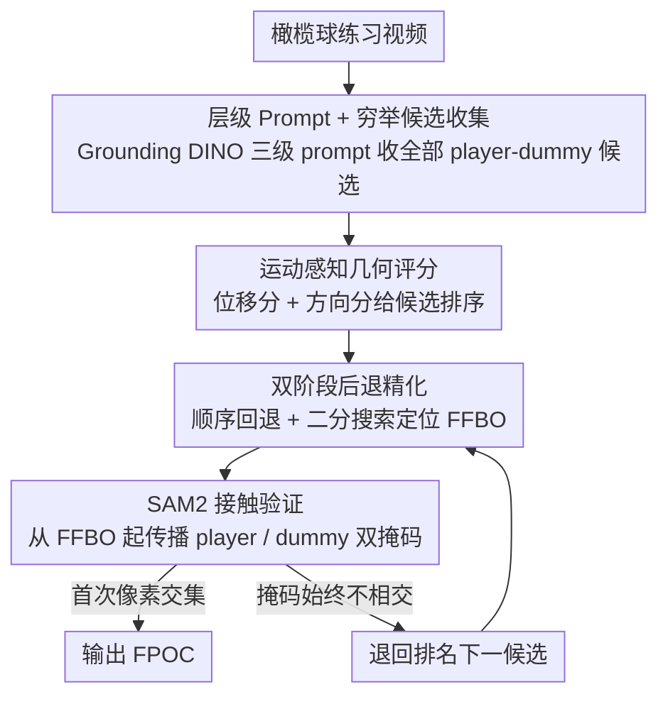

# GRAZE: Grounded Refinement and Motion-Aware Zero-Shot Event Localization

**会议**: CVPR 2026  
**arXiv**: [2604.01383](https://arxiv.org/abs/2604.01383)  
**代码**: 有  
**领域**: LLM推理 / 运动分析  
**关键词**: 零样本事件定位, 首触点检测, Grounding DINO, SAM2验证, 运动评分

## 一句话总结
提出GRAZE，一种无需训练的管线用于美式橄榄球练习视频中的首触点(FPOC)定位——利用Grounding DINO进行层级prompt多候选发现、运动感知几何评分进行候选排序、SAM2掩码传播作为独立的像素级接触验证器，在738支视频中97.4%有效输出、77.5%在±10帧内定位准确。

## 研究背景与动机

1. **领域现状**：美式橄榄球练习产生大量视频，但生物力学分析关注的接触动作仅占每段视频的极短窗口。需要精确到帧的首触点(FPOC)定位来锚定姿态测量和动力学分析。
2. **现有痛点**：(1) 场景极其复杂——手持/场边相机、运动模糊、多名装备相似的运动员、训练假人遮挡；(2) 标准边界框无法区分"检测到但未接触"和"接触但被遮挡"；(3) 现有动作定位方法(BMN/ActionFormer等)需要帧级标注，而练习视频无此标注；(4) 零样本方法(T3AL/ZEETAD)输出时间段粒度不够（30fps下半秒=15帧，无法确定是接触前还是接触后姿态）。
3. **核心洞察**：检测置信度和物理接触是两个独立量——高置信度检测不等于接触发生。需要将"候选发现"和"接触确认"解耦。
4. **核心idea**：用Grounding DINO发现候选对(player-dummy)→运动方向评分排序→SAM2掩码传播提供像素级接触验证（掩码交集=接触证据）→双阶段后退精化修正时间偏差。

## 方法详解

### 整体框架
GRAZE 要在杂乱的橄榄球练习视频里把「球员首次撞上训练假人」精确定位到帧（FPOC），且全程无任何任务特定训练、不用一张标注数据。它的核心思路是把「发现候选交互对」和「确认接触发生」解耦，再串起四个基础模型组成一条管线：(1) Grounding——Grounding DINO 配三级 prompt（gear/nogear/generic）× 6 个时间位置 × 3 档阈值，穷举收集所有候选 player-dummy 对；(2) Validation——14 邻帧时序一致性验证 + 位移幅度 + 方向余弦评分给候选排序；(3) Refinement——后退精化（顺序回退 + 二分搜索）找到首个双对象可见帧 FFBO；(4) Contact Verification——SAM2 从 FFBO 起传播 player 和 dummy 掩码，首个掩码交集帧即 FPOC，无交集则退回试下一名候选。

### 关键设计

**1. 层级 Prompt + 穷举候选收集：用多粒度描述把正确候选留在池子里**
装备和姿态跨片段变化巨大，单 prompt 易漏检。GRAZE 用三级 prompt 从精确到泛化覆盖外观变化：$P_{gear}$（带头盔向前冲刺的描述）→ $P_{nogear}$（无装备描述）→ $P_{generic}$（泛化描述），在六个时间采样位置、每个位置的偏移窗口、三档递减置信阈值下逐一搜索，并**收集全部有效候选而非首次成功即返回**。这么做是因为 grounding 质量与真实接触时间并不单调相关——中等接触时检测最强却可能跟错运动员，早帧的弱检测反倒可能是正确起点，只有穷举才不会把对的候选过早丢弃。

**2. 运动感知几何评分：用物理先验区分冲撞者与旁观者**
时序一致性（候选在 14 邻帧里按 IoU / 中心位移 / 面积匹配，取均值得一致性分 $c_{cons}$）只能确认候选「持续存在」，区分不了主动冲撞和被动旁观。GRAZE 再补两项几何分：位移分 $m_{disp} = \min(\frac{1}{|\mathcal{Q}|}\sum_{m \in \mathcal{Q}} \frac{\|c_0 - c_m\|}{200},\, 1)$，取匹配帧上球员中心相对当前帧的**平均**位移（除以 200px 归一化），移动越多分越高；方向分 $m_{dir} = \frac{\langle \hat{v}_{motion},\, \hat{v}_{to\text{-}dummy}\rangle + 1}{2}$，把「球员运动向量」与「player→dummy 方向向量」的余弦相似度缩放到 $[0,1]$，越对齐分越高。三项按 $conf_{overall} = 0.3\,c_{cons} + 0.3\,m_{disp} + 0.4\,m_{dir}$ 加权排序（方向权重最高），位移或方向过低（$m_{disp}<0.08$ 或 $m_{dir}<0.30$）的候选直接丢弃。它注入的物理先验是「冲撞必然伴随移动且方向朝向假人」，于是站着不动的同队者被自然排除。

**3. 双阶段后退精化：修正 grounding 偏向中等接触帧的时间偏差**
Grounding 在 mid-contact 时最强（双对象最显著），定位结果系统性偏晚。GRAZE 先做顺序后退：从 grounding 帧逐帧回退直到检测丢失，框出事件起始；再在起始与 grounding 帧之间二分搜索，精确定位 FFBO，作为下一步掩码传播的起点。

**4. SAM2 作为接触验证器：掩码交集才是接触证据（最核心创新）**
GRAZE 把 SAM2 从「分割后端」重新定义为「接触检测信号」：从 FFBO 帧分别 prompt SAM2 传播 player 和 dummy 掩码，当两掩码首次产生像素交集时即判为 FPOC，整个判定与检测置信度完全解耦。理由是边界框即使重叠也未必物理接触（框里可能多是背景），即使不重叠也可能正在接触（被遮挡），而像素掩码的交集直接对应两物体占据同一空间。配合多候选 fallback——若当前候选的掩码自始至终不相交，就顺着排名试下一个，直到某个候选的掩码交集确认接触为止，整条管线因此不依赖任何单次检测的成败。

### 一个完整示例：一次首触点定位
设一段球员从侧方冲向假人的片段：Grounding 收集到十余个 player-dummy 候选，其中混着两名站在背景里的同队队员。Validation 给候选打分，站立队员位移近 0、方向分低被压到末尾，冲撞球员凭大位移 + 朝向假人的运动拿最高分。系统对排名第一的候选做后退精化，从 mid-contact 帧回退到双对象将消失处，再二分定位到 FFBO。SAM2 自 FFBO 同时传播两条掩码，前几帧尚有间隙，直到某帧首次出现像素交集——输出为 FPOC；若该候选掩码始终不相交，则退回对第二名候选重复，直到确认接触。

## 实验关键数据

### 主实验（738支练习视频）

| 指标 | 数值 |
|------|:---:|
| 有效输出率 | **97.4%** |
| ±10帧定位准确率 | **77.5%** |
| ±20帧定位准确率 | **82.7%** |

### 消融实验

| 配置 | ±10帧准确率 |
|------|:---:|
| 无运动评分(仅置信度排序) | 下降显著 |
| 无SAM2验证(仅框重叠) | 下降更多 |
| 无后退精化(直接用grounding帧) | 系统性偏晚 |
| 无层级prompt(单级) | 候选召回下降 |
| **完整GRAZE** | **77.5%** |

### 关键发现
- SAM2验证是最关键组件——框重叠判断接触的假阳性极高
- 运动方向评分有效排除了旁观者（95%+的错误候选被排除）
- 穷举候选收集(不首次成功即返回)比贪心策略高~5%准确率
- 后退精化平均将FPOC向前纠正了4.8帧

## 亮点与洞察

- **"SAM2作为接触验证器"的理念创新**：将分割模型从被动的"给我掩码"重新定义为主动的"告诉我两个物体何时首次接触"——掩码交集是检测置信度无法提供的物理接触证据。这一理念可推广到任何需要判断物体交互时间的场景（碰撞检测、交接动作分析等）
- **候选发现与接触确认的解耦**：传统方法将检测置信度等同于事件发生——GRAZE明确分离了"找到可能的player-dummy对"和"确认它们何时接触"两步，各自用最适合的工具
- **零样本+无训练的实用性**：练习视频的装备/场地/拍摄条件跨session差异巨大→训练特定检测器不现实。GRAZE的纯提示+掩码方案自然泛化
- **运动方向评分的物理先验注入**：利用"冲撞必须朝向目标方向移动"这一简单物理直觉→无学习的规则就能有效排除绝大多数错误候选

## 局限与展望
- 当前仅针对player-dummy练习场景——真实比赛中player-player接触更复杂（双方都在动）
- SAM2掩码传播在极端运动模糊和遮挡时可能失败
- 定位精度(±10帧≈0.33秒)对某些生物力学分析仍嫌不够——更高帧率视频可能提升精度
- 层级prompt的设计依赖对运动装备的先验知识——迁移到其他运动项目需要重新设计prompt
- 可探索将光流信息集成到接触确认中（除掩码交集外增加运动一致性验证）

## 相关工作与启发
- **vs BMN/ActionFormer**: 需要帧级标注训练，GRAZE零样本
- **vs T3AL/ZEETAD**: 零样本但输出时间段粒度不够——FPOC需要帧精度
- **vs 传统接触检测**: 通常针对特定场景训练分类器。GRAZE用基础模型组合替代专用分类器
- **启发**：SAM2的掩码传播可以作为通用的"两物体何时首次交互"检测器——这一范式可迁移到医学(器械接触组织的时刻检测)、体育(球接触球拍)、制造(零件装配验证)等场景

## 评分
- 新颖性: ⭐⭐⭐⭐⭐ SAM2作为接触验证器的理念全新，候选发现-接触确认的解耦设计优雅
- 实验充分度: ⭐⭐⭐⭐ 738支真实视频、详细消融、多粒度精度评估
- 写作质量: ⭐⭐⭐⭐ 问题动机清晰，管线每步的设计理由充分
- 价值: ⭐⭐⭐⭐ 对运动生物力学和基础模型组合的零样本应用有实际贡献

<!-- RELATED:START -->

## 相关论文

- [\[ICLR 2026\] CoT-RVS: Zero-Shot Chain-of-Thought Reasoning Segmentation for Videos](../../ICLR2026/llm_reasoning/cot-rvs_zero-shot_chain-of-thought_reasoning_segmentation_for_videos.md)
- [\[ICML 2026\] Scaling-Aware Adapter for Structure-Grounded LLM Reasoning](../../ICML2026/llm_reasoning/scaling-aware_adapter_for_structure-grounded_llm_reasoning.md)
- [\[CVPR 2025\] Reason-before-Retrieve: One-Stage Reflective Chain-of-Thoughts for Training-Free Zero-Shot Composed Image Retrieval](../../CVPR2025/llm_reasoning/osrcir_reflective_cot.md)
- [\[ICLR 2026\] SceneCOT: Eliciting Grounded Chain-of-Thought Reasoning in 3D Scenes](../../ICLR2026/llm_reasoning/scenecot_eliciting_grounded_chain-of-thought_reasoning_in_3d_scenes.md)
- [\[ICLR 2026\] Thinking in Latents: Adaptive Anchor Refinement for Implicit Reasoning in LLMs](../../ICLR2026/llm_reasoning/thinking_in_latents_adaptive_anchor_refinement_for_implicit_reasoning_in_llms.md)

<!-- RELATED:END -->
