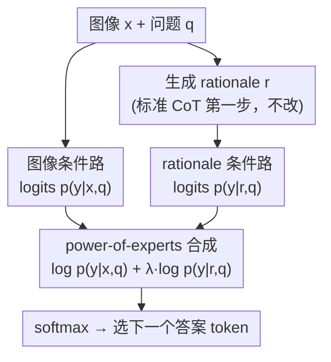

# Rationale-Enhanced Decoding for Multi-modal Chain-of-Thought

**会议**: CVPR 2026  
**arXiv**: [2507.07685](https://arxiv.org/abs/2507.07685)  
**代码**: 无  
**领域**: LLM推理  
**关键词**: 思维链推理, 多模态大语言模型, 解码策略, rationale grounding, 即插即用

## 一句话总结
发现现有LVLM在CoT推理时实际上忽略了中间rationale的内容，提出 RED (Rationale-Enhanced Decoding)——将图像条件和rationale条件的next-token分布在logit层面相乘，理论上等价于KL约束奖励最大化的最优解，无需训练即可显著提升多模态推理准确率。

## 研究背景与动机

**领域现状**：大型视觉语言模型(LVLMs)借鉴LLM的思维链(CoT)方法，先生成中间推理过程(rationale)，再基于图像+rationale+问题生成最终答案。人们普遍认为CoT能增强多模态推理的接地性和准确性。

**现有痛点**：作者通过两个关键实验揭示了一个令人惊讶的事实——LVLM在CoT推理中**实际上忽略了rationale的内容**。(1) 注意力贡献分析：当图像和rationale同时输入时，rationale的注意力贡献显著下降，图像token主导预测；(2) rationale替换实验：将正确rationale替换为完全无关的rationale后，模型性能几乎不变，说明模型根本没有利用rationale的语义信息。

**核心矛盾**：$p_\theta(y_i|\mathbf{y}_{<i}, x, r, q)$ 这一联合条件概率在实践中无法有效利用$r$的信息——图像token的"吸引力"远大于rationale token。但去掉图像仅用 $p_\theta(y_i|\mathbf{y}_{<i}, r, q)$ 又会丢失视觉信息。

**本文目标** 设计一种无需额外训练的解码策略，使LVLM在CoT推理时**真正**同时利用图像和rationale信息。

**切入角度**：将图像条件和rationale条件**解耦**为两个独立分布，在logit层面合成，避免联合条件下rationale被忽略的问题。

**核心 idea**：通过将CoT推理重新形式化为以rationale条件对数似然为奖励的KL约束最大化问题，得到最优解码策略——图像条件概率 × rationale条件概率的$\lambda$次方。

## 方法详解

### 整体框架
标准多模态 CoT 是两步：(1) 给图像 $x$ 和问题 $q$，生成推理依据 rationale $r$；(2) 给 $x, r, q$，生成最终答案。RED 只改第 (2) 步的**解码策略**——不动模型参数、不改 rationale 生成方式，因此能即插即用地接在任何 rationale 生成方法后面。它要治的痛点是：直接用 $p(y|x,r,q)$ 解码时，模型常常**忽略 rationale**、退回去只看图像（甚至 CoT 反而掉点，见实验表）。RED 的思路是把"该用 rationale"这件事写成一个带理论保证的解码目标，最后落成一行 logit 加权。

> 这张图画的是 RED 的解码数据流（KL 约束奖励最大化的闭式解，对应下方关键设计 1→2→3）：图像条件路与 rationale 条件路各跑一次前向，在 logit 层按 power-of-experts 合成后 softmax 出答案 token。

### 关键设计

**1. 把 CoT 解码写成 KL 约束的奖励最大化**

引入一个新的 next-token 分布 $\pi$，目标是：

$$\max_\pi \mathbb{E}_\pi[R] - \beta \mathbb{D}_{\text{KL}}[\pi \| \pi_{\text{ref}}]$$

其中奖励 $R = \log p_\theta(y_i | \mathbf{y}_{<i}, r, q)$ 是 **rationale-grounding reward**（最大化它 = 逼模型用上 rationale），参考策略 $\pi_{\text{ref}} = p_\theta(y_i | \mathbf{y}_{<i}, x, q)$ 是**图像条件分布**（KL 约束它 = 别跑太偏、保住视觉信息）。两股力一拉一拽，正好避免"要么忽略 rationale、要么丢掉图像"的两难。

**2. 闭式最优解：power-of-experts 解码**

KL 约束奖励最大化有已知的最优策略形式，代入本设定即得闭式解（Theorem 4.1 证明它是上式最优解，无需训练）：

$$\hat{p}_\theta(y_i) = \frac{1}{Z_\theta}\, p_\theta(y_i|\mathbf{y}_{<i}, x, q) \times p_\theta(y_i|\mathbf{y}_{<i}, r, q)^\lambda$$

这是一个 **power-of-experts** 分布——它强调"图像条件"和"rationale 条件"两个概率的**交集区域**，即同时被图像和推理支持的 token 才会被抬高。$\lambda = 1/\beta$ 控制 rationale 的影响权重。

**3. 落地：logit 层面一行加权求和**

把上式取对数即变成 logit 相加，实现极简：

$$\widehat{\text{logits}}_\theta(y_i) = \log\text{softmax}\big(\text{logits}_\theta(y_i|\mathbf{y}_{<i}, x, q)\big) + \lambda \cdot \log\text{softmax}\big(\text{logits}_\theta(y_i|\mathbf{y}_{<i}, r, q)\big)$$

再过一次 softmax 得 $\hat{p}_\theta(y_i)$。两路 logits（图像条件、rationale 条件）可批并行推理，几乎不增延迟。

### 一个完整 walkthrough（解码答案的某一个 token）
设问题 $q$="图里的杯子是什么颜色？"，rationale $r$="桌上有个红色马克杯"，正在解码答案 token $y_i$。
1. **两路前向**：一路喂 $(x, q)$ 得图像条件 logits、一路喂 $(r, q)$ 得 rationale 条件 logits（批并行，一次跑完）。
2. **图像路**：因画面偏暗，"red" 和 "brown" 概率接近（0.4 / 0.35）——单看图像容易答错成 brown。
3. **rationale 路**："red" 概率 0.8、"brown" 0.05——推理明确指向红色。
4. **power-of-experts 合成**（$\lambda=1$）：两路 log-prob 相加 → "red" 综合得分远超 "brown"，被选中。
5. **对照**：若直接用 $p(y|x,r,q)$ 单路解码，模型可能被昏暗画面带偏答 brown；RED 通过显式乘上 rationale 项把它拉回正确答案，又因保留图像项不会在 rationale 无关时瞎信（实验里"无关 rationale"只导致小幅波动即证此点）。

这条链说明三块如何接力：① 定义"既要用 rationale 又别丢图像"的目标 → ② 闭式解变成两概率相乘 → ③ 对数空间里就是 logits 相加，一行搞定。

### 训练策略
RED 是纯推理时方法，**零训练**。只需对现有 LVLM 做两次前向（图像条件 + rationale 条件），在 logit 层合成。唯一超参数是 $\lambda$，控制 rationale 的影响程度。

## 实验关键数据

### 主实验

**GQA 数据集准确率 (%)**

| 方法 | Gemma-3-4B | Gemma-3-12B |
|------|-----------|------------|
| Direct (无CoT) | 40.00 | 45.34 |
| CoT (标准) | 41.08 | 41.76 (下降!) |
| CCoT (场景图) | 44.54 | 44.50 |
| RED + CoT | 提升显著 | 提升显著 |
| RED + CCoT | 提升显著 | 提升显著 |

**关键发现：用无关rationale替换**

| 输入 | Gemma-3-4B | Gemma-3-12B |
|------|-----------|------------|
| $(x, r_{\text{CoT}}, q)$ | 41.08 | 41.76 |
| $(x, r'_{\text{CoT}}, q)$ 无关rationale | 41.88 | 41.75 |
| $(r_{\text{CoT}}, q)$ 仅rationale | 40.15 | 37.87 |
| $(r'_{\text{CoT}}, q)$ 仅无关rationale | 7.40 | 16.21 |

### 消融实验

| 配置 | 效果 | 说明 |
|------|------|------|
| 标准CoT解码 | 基线 | $p(y|x,r,q)$ 忽略rationale |
| 仅rationale条件 | 下降 | 缺少视觉信息 |
| RED ($\lambda$合理) | 最优 | 平衡图像与rationale |
| 高质量rationale (GPT-4) + RED | 进一步提升 | RED收益随rationale质量增强 |

### 关键发现
- **标准CoT经常不如直接回答**：Gemma-3-12B上CoT从45.34降到41.76，因为模型忽略rationale却受到额外噪声干扰
- **rationale替换实验是杀手级证据**：将正确rationale替换为随机rationale后性能几乎不变（±0.1%），但去掉图像只用rationale则差异巨大（40.15 vs 7.40），证明当图像存在时LVLM完全无视rationale
- RED与高质量rationale（如GPT-4生成）组合时收益更大，说明RED确实让模型"用上了"rationale
- RED是即插即用的，可与其他对比解码方法（VCD、LCD）叠加使用

## 亮点与洞察
- **发现问题比解决问题更有价值**：揭示了"LVLM在多模态CoT中忽略rationale"这一关键现象，用注意力贡献分析和rationale替换两个优雅实验充分论证。这个发现挑战了CoT一定有益的普遍假设
- **理论优雅**：将解码策略推导为KL约束奖励最大化的最优解，使得看似临时的logit相乘操作有了严格的理论支撑。这个RLHF味的推导框架也可迁移到其他"多信源融合"的解码问题
- **实现极简**：两行代码（log-softmax加权求和）即可实现，零训练、零架构修改、零额外模型，是真正的即插即用

## 局限与展望
- 需要两次前向传播（图像条件+rationale条件），推理开销翻倍（虽然可批并行）
- rationale生成步骤本身仍用标准解码，没有保证其质量；RED的收益依赖于rationale的质量
- $\lambda$需要在数据集上调优，不同任务的最优$\lambda$可能不同
- 没有深入分析LVLM为何忽略rationale（作者提到位置偏差、attention sink、视觉指令微调过拟合等可能原因但未验证）
- 仅在VQA类任务上验证，未涉及开放式生成任务

## 相关工作与启发
- **vs VCD (Visual Contrastive Decoding)**: VCD对比正常图像和损坏图像来减轻幻觉，RED对比图像条件和rationale条件来增强推理接地性。两者正交，可叠加使用
- **vs LCD (Language Contrastive Decoding)**: LCD对比有/无图像来减轻语言先验，RED则增强rationale利用。同样正交互补
- **vs CCoT (Compositional CoT)**: CCoT通过生成场景图提升rationale质量（优化Eq.5），RED优化Eq.6的解码策略。二者可组合：用CCoT生成高质量rationale+RED解码
- 这个"解耦输入源→logit层面合成"的框架可推广到任何多信源推理场景（如RAG中query条件和context条件的融合）

## 评分
- 新颖性: ⭐⭐⭐⭐⭐ 发现+解法的完美结合，motivating experiments极具说服力
- 实验充分度: ⭐⭐⭐⭐ 多模型多数据集验证，但任务类型较单一（主要VQA）
- 写作质量: ⭐⭐⭐⭐⭐ 从发现问题到理论建模到实际算法，叙事流畅
- 价值: ⭐⭐⭐⭐⭐ 即插即用的推理增强方法，揭示了LVLMs使用CoT的重要局限性

<!-- RELATED:START -->

## 相关论文

- [\[AAAI 2026\] CMMCoT: Enhancing Complex Multi-Image Comprehension via Multi-Modal Chain-of-Thought and Memory Augmentation](../../AAAI2026/llm_reasoning/cmmcot_enhancing_complex_multi-image_comprehension_via_multi.md)
- [\[CVPR 2025\] Interleaved-Modal Chain-of-Thought](../../CVPR2025/llm_reasoning/interleaved-modal_chain-of-thought.md)
- [\[ACL 2025\] RSVP: Reasoning Segmentation via Visual Prompting and Multi-modal Chain-of-Thought](../../ACL2025/llm_reasoning/rsvp_reasoning_segmentation_via_visual_prompting_and_multi-modal_chain-of-though.md)
- [\[CVPR 2026\] VisRef: Visual Refocusing while Thinking Improves Test-Time Scaling in Multi-Modal Large Reasoning Models](visref_visual_refocusing_test_time_scaling.md)
- [\[ICLR 2026\] Fine-R1: Make Multi-modal LLMs Excel in Fine-Grained Visual Recognition by Chain-of-Thought Reasoning](../../ICLR2026/llm_reasoning/fine-r1_make_multi-modal_llms_excel_in_fine-grained_visual_recognition_by_chain-.md)

<!-- RELATED:END -->
