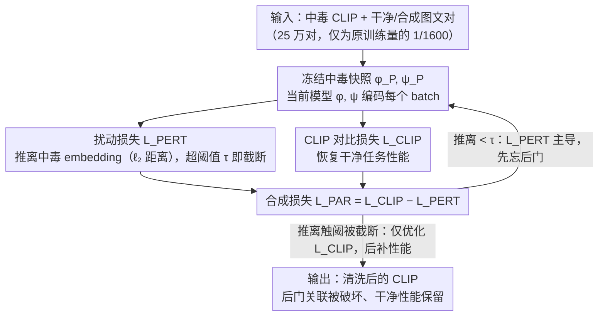

# Perturb and Recover: Fine-tuning for Effective Backdoor Removal from CLIP

**会议**: CVPR 2026  
**arXiv**: [2412.00727](https://arxiv.org/abs/2412.00727)  
**代码**: [https://github.com/](https://github.com/) (有，论文声明代码已公开)  
**领域**: AI安全  
**关键词**: 后门攻击, CLIP模型清洗, 微调防御, 结构化触发器, 合成数据

## 一句话总结

本文提出 PAR（Perturb and Recover），一种简单而有效的 CLIP 模型后门清洗方法：通过显式地将模型embedding推离中毒状态（Perturb），同时用标准 CLIP 损失恢复干净性能（Recover），在不依赖强数据增强的情况下实现对任意触发器的鲁棒后门移除，甚至仅用合成数据即可有效清洗。

## 研究背景与动机

1. **领域现状**：CLIP 等视觉-语言模型广泛用于零样本分类、检索、以及作为 LLaVA 等大型 VLM 的视觉编码器。由于训练数据来自网络爬取（如 LAION-400M），模型极易遭受后门攻击——仅 0.01% 的投毒率即可成功注入后门。

2. **现有痛点**：现有清洗方法如 CleanCLIP 和 RoCLIP 严重依赖**强数据增强**（如 AutoAugment）来打破后门关联。但这种策略有一个隐含假设——增强操作必须与触发器分布重叠才能有效。对于图像-文本对来说，强增强还会破坏标注语义（如水平翻转会改变位置描述，颜色变换会使颜色描述失效）。

3. **核心矛盾**：基于增强的清洗本质上是在"猜"触发器可能长什么样——如果触发器是随机噪声，噪声增强确实有效；但如果触发器是**结构化的**（条纹、三角形、水印文字等），这些结构在增强后仍然保留，清洗就会完全失败。而实际攻击中，防御者对触发器一无所知。

4. **本文目标** 设计一种**不依赖特定触发器类型**的通用后门清洗方法，且仅通过微调（而非从头训练）实现，使计算成本可控。

5. **切入角度**：作者的关键洞察是——与其试图猜测和覆盖所有可能的触发器模式，不如直接把模型"推离"中毒状态。只要模型的 embedding 空间与中毒模型足够不同，后门带来的虚假关联自然就被破坏了。

6. **核心 idea**：用 $\ell_2$ 距离损失主动推离中毒 embedding（Perturb），同时用 CLIP 对比损失保持干净性能（Recover），两者竞争实现"忘掉后门、记住知识"。

## 方法详解

### 整体框架

PAR 的输入是一个已被后门投毒的 CLIP 模型，外加一组干净图文对（25 万对，仅为原始训练数据的 1/1600），通过约 10 个 epoch 的微调把后门洗掉。它不去猜触发器长什么样，而是同时优化两个相互拉扯的目标：一个"推离"损失 $\mathcal{L}_{\text{PERT}}$ 把当前模型的 embedding 主动推离冻结的中毒快照，破坏后门埋下的虚假关联；一个标准 CLIP 对比损失 $\mathcal{L}_{\text{CLIP}}$ 把干净任务的性能拉回来。两者竞争出"忘掉后门、记住知识"的效果，而推离一旦足够就自动停手，让模型进入纯恢复阶段。下图画出这条清洗流水线（关键设计 1「结构化触发器」是暴露 baseline 盲区的攻击分析，不属于 PAR 流水线本身，故未画入图中）。

### 关键设计

**1. 结构化触发器：先证明现有清洗方法其实有盲区**

在提出方法之前，作者先构造了一组更难对付的攻击，用来暴露 CleanCLIP/RoCLIP 这类增强清洗的根本缺陷。这些方法默认强增强（如 AutoAugment）能"覆盖"触发器、打破后门关联，但这个假设只在触发器恰好是随机噪声时成立——噪声触发器正好和增强里的噪声操作分布重叠。于是作者设计了四种**结构化**触发器：BadNet-Stripes（1 像素宽彩色条纹 patch）、Blended-Stripes（全图叠加条纹，$n_c=0.03$）、Blended-Triangles（叠加低对比度三角形，$n_c=0.15$）、Blended-Text（红色 "Watermarked" 水印文字，$n_c=0.5$），它们模拟现实里的水印等结构。关键在于：条纹、三角形这类有结构的图案在裁剪、翻转、色彩抖动之后**依然保留**，增强根本盖不住。实验证实，即便把 CleanCLIP 的增强损失权重 $\lambda$ 调到极大，BadNet-Stripes 的 ASR 也几乎不降——增强清洗在结构化触发器面前直接失效。

**2. 扰动损失 $\mathcal{L}_{\text{PERT}}$：把模型从中毒状态直接推开，而不是去猜触发器**

既然猜不准触发器，那就换思路——只要清洗后的 embedding 空间和中毒模型足够不同，后门关联自然就断了。记冻结的中毒模型归一化 embedding 为 $\phi_P(\cdot), \psi_P(\cdot)$，当前清洗模型为 $\phi(\cdot), \psi(\cdot)$，在每个 batch 上度量视觉和文本编码器各自被推开的平均 $\ell_2$ 距离 $S_\phi = \frac{1}{|B|}\sum \|\phi(x_I^n) - \phi_P(x_I^n)\|_2^2$ 和对应的 $S_\psi$。真正的巧思是给推离加了一个阈值 $\tau$ 做截断：

$$\mathcal{L}_{\text{PERT}} = \frac{1}{2}\left(\mathbb{I}[S_\phi \leq \tau]\cdot S_\phi + \mathbb{I}[S_\psi \leq \tau]\cdot S_\psi\right)$$

一旦某个编码器被推离超过 $\tau$，它对应的项就被关掉。这样 $\tau$ 一身两职：既是"推多远"的旋钮，又是防止模型被推过头、把有用知识也丢掉的安全网。因为归一化 embedding 的 $\ell_2$ 距离上界是 4，这个目标天然适合最小化；又因 $S_\phi = 2 - \frac{2}{|B|}\sum \cos(\phi, \phi_P)$，推离 $\ell_2$ 距离等价于压低与中毒模型的余弦相似度。

**3. PAR 总损失：让"忘后门"和"保性能"自动分阶段**

把两个目标合成一个式子 $\mathcal{L}_{\text{PAR}} = \mathcal{L}_{\text{CLIP}} - \mathcal{L}_{\text{PERT}}$，最小化它等于同时最大化对比性能、又最大化与中毒模型的距离。训练动态会自然分成两段：初期 $\mathcal{L}_{\text{PERT}}$ 主导，模型猛推离中毒状态，此时 $\mathcal{L}_{\text{CLIP}}$ 暂时升高、干净性能短暂下滑；一旦推离触到阈值 $\tau$，$\mathcal{L}_{\text{PERT}}$ 被截断为 0，剩下的 epoch 模型只优化 $\mathcal{L}_{\text{CLIP}}$ 把性能补回来。整个"先忘后补"的切换全靠阈值自适应触发，不需要手动调度。清洗期间只用 Gaussian noise 和小 patch CutOut 两种很轻的增强，不会像强增强那样破坏图文语义（翻转改掉位置描述、调色改掉颜色描述）。

**4. 合成数据清洗：连真实干净数据都不需要**

现实里"保证没被投毒"的真实图文对成本很高，作者干脆用 SynthCLIP（文本到图像扩散模型生成）的 25 万/50 万合成图文对替换 CC3M 的真实数据。合成数据从源头杜绝了被投毒的风险，而 PAR 的推离机制对这种数据分布偏移有一定鲁棒性，仍能有效洗掉后门——代价只是 ImageNet 零样本准确率略降。这把后门防御的门槛进一步压低，尤其适合拿不到原始训练数据的场景。

### 损失函数 / 训练策略

学习率从 3e-5 线性衰减到 3e-6（前半段），再余弦衰减到 1e-9（后半段）。$\tau=2.15$ 在 BadNet-Stripes RN50 上调参后固定用于所有攻击和编码器。清洗 10 个 epoch，使用 25 万干净样本。

## 实验关键数据

### 主实验（RN50 CLIP）

| 攻击类型 | 指标 | PAR ASR | CleanCLIP ASR | RoCLIP ASR | PAR Clean |
|----------|------|---------|---------------|------------|-----------|
| BadNet-Rand | ImageNet ASR | **6.3%** | 14.5% | 75.1% | 53.3% |
| BadNet-Stripes | ImageNet ASR | **42.4%** | 62.3% | 82.0% | 53.0% |
| Blended-Rand | ImageNet ASR | **0.0%** | 19.5% | 1.5% | 53.6% |
| Blended-Stripes | ImageNet ASR | **0.1%** | 61.8% | 7.0% | 53.5% |
| Blended-Triangles | ImageNet ASR | **10.3%** | 48.7% | 37.1% | 52.9% |
| Blended-Text | ImageNet ASR | **18.1%** | 42.4% | 59.1% | 53.4% |
| WaNet | ImageNet ASR | **0.0%** | 0.0% | 2.0% | 54.4% |
| BadCLIP | ImageNet ASR | **30.4%** | 40.1% | - | 53.4% |

PAR 在几乎所有攻击上取得最低 ASR，同时保持最高或不相上下的 clean 准确率。CleanCLIP 在结构化触发器上 ASR 高达 60%+，基本失效。

### ViT-B/32 结果

| 攻击 | PAR ASR | CleanCLIP ASR | 说明 |
|------|---------|---------------|------|
| BadNet-Stripes | 0.1% | 86.8% | 差距最大，PAR 几乎完美清洗 |
| Blended-Stripes | 0.1% | 15.2% | PAR 接近完美 |
| Blended-Triangles | 15.9% | 91.4% | CleanCLIP 完全失效 |
| Blended-Text | 37.3% | 62.9% | PAR 显著更优 |

### 关键发现

- **CleanCLIP 对结构化触发器完全失效**——这是最重要的发现。即使增大其增强损失权重，ASR 也不降，说明增强-based 方法的根本性缺陷。
- **PAR 泛化到不同架构**——同一套 $\tau$ 和训练策略从 RN50 直接迁移到 ViT-B/32，效果一致好。附录还验证了 ViT-L/14 和 SigLip。
- **合成数据几乎同样有效**——50 万 SynthCLIP 样本可以将 BadNet-Stripes 的 ASR 从 99.8% 降到 3.7%，实际场景下完全可用。
- **自适应攻击无法绕过 PAR**——重新投毒已清洗模型后再用 PAR 清洗，后门仍然被完全移除，PAR 不会"退回"到原始中毒模型。

## 亮点与洞察

- **"推离再恢复"的思想极其简洁优雅**——不需要假设触发器形态，不需要复杂的增强策略，仅靠一个 $\ell_2$ 距离就实现了通用清洗。
- **阈值截断是精巧的自适应机制**——$\tau$ 让扰动自动停止，之后模型自然进入纯恢复阶段，无需手动切换训练策略。
- **结构化触发器的提出本身就是重要贡献**——它揭示了现有 CLIP 防御的根本盲区，对安全社区有警示价值。
- **合成数据用于模型清洗是一个有前景的方向**——降低了后门防御的门槛，特别适用于无法获取原始训练数据的场景。

## 局限与展望

- 在某些攻击（如 BadNet-Stripes、BadCLIP）上 ASR 仍未降到 0%——尽管远优于 baseline，但在高安全要求场景下可能不够
- $\tau$ 是在一种攻击上调参的，理论上不同攻击和模型可能需要不同的 $\tau$，作者声称泛化性好但未提供理论保证
- 只测试了分类和检索任务，对 CLIP 作为 VLM 视觉编码器（如 LLaVA）时的后门清洗效果未验证
- 清洗仍需 25 万样本和 10 个 epoch 的微调成本，对于极大模型（如 ViT-G）的可扩展性未知

## 相关工作与启发

- **vs CleanCLIP**: CleanCLIP 用 $\mathcal{L}_{\text{CLIP}} + \lambda \mathcal{L}_{\text{UniAug}}$，依赖强增强的单模态自监督项来破坏后门。PAR 用 $\mathcal{L}_{\text{CLIP}} - \mathcal{L}_{\text{PERT}}$，通过显式推离中毒模型来实现，完全不依赖增强策略。本质区别在于 CleanCLIP 是"间接打击"（希望增强覆盖触发器），PAR 是"直接推离"（管你什么触发器，我只管远离你）。
- **vs RoCLIP / SafeCLIP**: 这两者需要从随机初始化开始训练，计算成本高 2-3 个数量级，且 clean 性能显著降低。PAR 仅做微调，保持了接近原始的 clean 准确率。
- **vs 单模态防御（ANP, SAU 等）**: 无法直接用于 CLIP 等多模态模型，因为它们需要中毒数据访问、引入额外参数或大量训练数据。

## 评分

- 新颖性: ⭐⭐⭐⭐ "推离再恢复"的想法简洁有效，但技术上 perturbation-based 微调并非全新概念
- 实验充分度: ⭐⭐⭐⭐⭐ 覆盖 8 种攻击、RN50/ViT-B/32/ViT-L/14/SigLip、分类+检索、真实+合成数据，极其全面
- 写作质量: ⭐⭐⭐⭐ 动机推导清晰，t-SNE 可视化和训练动态分析直观
- 价值: ⭐⭐⭐⭐⭐ 直接针对 CLIP 基础模型安全的实际问题，合成数据方案有很强的实用性

<!-- RELATED:START -->

## 相关论文

- [\[ICML 2026\] TCAP: Tri-Component Attention Profiling for Unsupervised Backdoor Detection in MLLM Fine-Tuning](../../ICML2026/llm_safety/tcap_tri-component_attention_profiling_for_unsupervised_backdoor_detection_in_ml.md)
- [\[CVPR 2026\] FairLLaVA: Fairness-Aware Parameter-Efficient Fine-Tuning for Large Vision-Language Models](fairllava_fairness-aware_parameter-efficient_fine-tuning_for_large_vision-langua.md)
- [\[CVPR 2026\] IAG: Input-aware Backdoor Attack on VLM-based Visual Grounding](iag_input-aware_backdoor_attack_on_vlm-based_visual_grounding.md)
- [\[CVPR 2026\] DAMP: Class Unlearning via Depth-Aware Removal of Forget-Specific Directions](damp_class_unlearning_via_depth_aware_removal_of_forget_specific_directions.md)
- [\[NeurIPS 2025\] ToxicTextCLIP: Text-Based Poisoning and Backdoor Attacks on CLIP Pre-training](../../NeurIPS2025/llm_safety/toxictextclip_text-based_poisoning_and_backdoor_attacks_on_clip_pre-training.md)

<!-- RELATED:END -->
