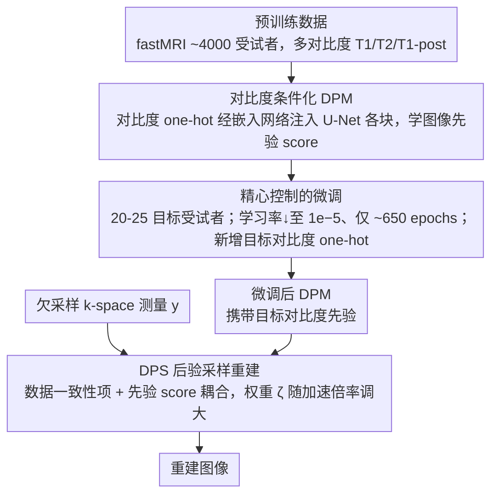

# Accelerating Stroke MRI with Diffusion Probabilistic Models through Large-Scale Pre-training and Target-Specific Fine-Tuning

**会议**: CVPR 2026  
**arXiv**: [2603.13007](https://arxiv.org/abs/2603.13007)  
**代码**: 无  
**领域**: 医学影像 / MRI重建  
**关键词**: accelerated MRI, diffusion probabilistic model, foundation model, stroke MRI, fine-tuning

## 一句话总结
受基础模型范式启发，提出一种数据高效的扩散概率模型 (DPM) 训练策略——先在大规模多对比度脑 MRI 数据（~4000 受试者）上预训练，再用极少量目标域数据（仅 20 受试者）微调，在临床中风 MRI 加速重建中达到与大规模训练相当的质量，临床读片研究证实重建质量与标准诊疗无显著差异。

## 研究背景与动机
**领域现状**：机器学习在加速 MRI 重建方面已达到 SOTA 水平，但这些方法通常在特定应用数据集上训练，在数据有限时性能显著退化。

**现有痛点**：(1) 中风 MRI 是一个典型的data-scarce场景——MRI 虽比 CT 能更敏感检测缺血性卒中，但扫描时间长、运动敏感导致延误治疗；(2) 现有自监督/少数据方法质量不如全监督基线；(3) 端到端重建方法要求外部和目标数据集采用相同的采样模式和线圈几何，缺乏灵活性。

**核心矛盾**：临床中风 MRI 迫切需要加速重建以减少扫描时间，但特定中风数据太少无法训练高质量的重建模型。

**本文目标**：如何在目标域全采样数据极其有限（20-25 受试者）时，训练出高质量的 DPM 加速 MRI 重建模型。

**切入角度**：利用 DPM 对采集前向模型的不可知性——预训练在不同采样模式的大量数据上学习图像先验分布，微调只需适应目标对比度，无需相同的采样模式。

**核心 idea**：大规模预训练 + 精心控制的少量微调（降低学习率一个数量级 + 训练极少 epoch）= DPM 在数据受限临床中风 MRI 中的高质量重建。

## 方法详解

### 整体框架
论文要解决的是「目标域只有 20-25 个受试者全采样数据，却要训出高质量中风 MRI 加速重建模型」这个困境。它的做法是把基础模型的「大规模预训练 + 少量微调」范式搬到扩散模型上：第一阶段在 fastMRI 约 4000 受试者的多对比度脑 MRI（T1、T2、T1-post）上预训练一个对比度条件化的 DPM，让它学到通用的脑部图像先验分布；第二阶段在 20-25 个目标中风患者的特定序列上做一次「克制」的微调——学习率压到 $1 \times 10^{-5}$、只训 ~650 epochs（约预训练时长的 2%）——让模型适应目标对比度而不丢掉先验。推理时不重新训练任何重建网络，而是用 Diffusion Posterior Sampling (DPS) 把学到的先验和欠采样 k-space 测量值在采样过程中耦合起来，直接采样出重建图像。这条链路的关键在于 DPM 只负责学图像长什么样，采集模型（采样模式、线圈几何）完全在推理阶段才介入，因此预训练数据和目标数据可以用完全不同的采样方式。

### 关键设计

**1. 对比度条件化的 DPM 架构：让一个模型同时吃下多种 MRI 对比度**

预训练数据混了 T1、T2、T1-post 等异构对比度，如果不加区分地一起训，模型会被不同对比度的统计特性互相干扰。论文给每种对比度类型分配一个 one-hot 向量，经一个小型全连接网络映射成嵌入向量，再把这个嵌入作为额外输入喂进 U-Net 的每个块；DPM 主干和嵌入网络联合训练。模型学的是 score function $\nabla_{x_t} \log p_t(x)$，其中 $p_t(x)$ 是被高斯噪声 $\sigma_t$ 扰动后的图像分布。这样一来，同一套权重能根据对比度标签调整自己的行为，相当于把「多对比度先验」压进一个共享网络，也为后面微调时「新增一种目标对比度」留好了接口——只要再分配一个 one-hot 向量即可。

**2. 精心控制的微调策略：在 20 个受试者上适应，又不让它过拟合**

目标域数据少到只有 20 个受试者，直接训会过拟合，但不微调又无法适应目标对比度，这中间存在一个很窄的最优窗口。论文的处理是把学习率从预训练的 $10^{-4}$ 直接降一个数量级到 $10^{-5}$，并把训练时长压到 ~650 epochs（约预训练的 2%）；同时为目标对比度分配一个新的 one-hot 向量、更新嵌入网络权重。消融实验把这个「窗口」量化得很清楚：学习率偏高（如 $5\times10^{-4}$）或训得太久（2500 epochs）都会过拟合，而微调不足又适应不到目标对比度，只有「低学习率 + 短训练」这一组合能在适应与遗忘之间踩到甜点。本质上这是用「小步快走」避免灾难性遗忘——既蹭上预训练学到的脑部先验，又只挪动很小一段去贴合目标对比度。

**3. Diffusion Posterior Sampling (DPS) 重建：把图像先验和 k-space 测量在采样时耦合**

端到端重建方法的死穴是把采集过程焊进了网络，换个采样模式或线圈几何就得重训。DPM 走的是另一条路——训练时只学图像分布，重建时才通过后验采样把测量约束加进来。具体是在反向采样过程中求解

$$d\mathbf{x} = \left[-t\left(\nabla_{\mathbf{x}} \|\mathbf{PFS}\tilde{\mathbf{x}}(\mathbf{x}) - \mathbf{y}\|_2^2 + D_\theta(\mathbf{x}, t)\right)\right]dt$$

第一项是数据一致性，把当前估计往「经前向算子 $\mathbf{PFS}$（采样掩码 $\mathbf{P}$、傅里叶 $\mathbf{F}$、线圈灵敏度 $\mathbf{S}$）后要匹配测量值 $\mathbf{y}$」的方向推；第二项 $D_\theta$ 是学到的先验 score，负责把图像拉回「看起来像真实脑 MRI」的流形。两项里的数据一致性权重 $\zeta$ 是核心调节旋钮：加速倍率越高、采到的 k-space 越少，就越要调大 $\zeta$ 来加重测量约束。正因为采集模型只在这一步才出现，同一个预训练 DPM 才能配上任意采样模式工作，这也是它在数据稀缺场景下能复用大规模预训练的根本原因。

### 损失函数 / 训练策略
预训练和微调都用 EDM 训练损失，配固定的数据增强策略和噪声级别调度。推理端唯一需要按场景调的是后验采样中的数据一致性权重 $\zeta$——它正比于加速倍率，k-space 采得越少（加速越激进），$\zeta$ 就设得越大。

## 实验关键数据

### 主实验
fastMRI FLAIR 重建 NRMSE（预训练在 T1/T2/T1-post，微调在 20 FLAIR 受试者 vs 使用 344 FLAIR 受试者训练）:

| 方法 | 数据量 | R=4 | R=5 | R=6 | 说明 |
|------|--------|-----|-----|-----|------|
| Method 1 (全数据集) | 4125 | 最优 | 最优 | 最优 | 上界 |
| Method 3 (344 FLAIR) | 344 | 接近最优 | 接近最优 | 接近最优 | 上界 |
| **Method 4 (本文)** | **20 FLAIR** | **可比** | **可比** | **可比** | **仅用 5.8% 数据** |
| Method 5 (20 FLAIR only) | 20 | 显著差 | 显著差 | 显著差 | 无预训练 |
| Method 6 (联合训练) | 4000+20 | 较差 | 较差 | 较差 | 不如顺序微调 |

### 消融实验
微调超参数对 NRMSE 的影响：

| 学习率 | 650 epochs | 1250 epochs | 2500 epochs | 说明 |
|--------|-----------|-------------|-------------|------|
| $5 \times 10^{-4}$ | 中等 | 过拟合 | 严重过拟合 | 学习率过高 |
| $1 \times 10^{-4}$ | 较好 | 轻微过拟合 | 过拟合 | - |
| $5 \times 10^{-5}$ | 好 | 好 | 轻微过拟合 | - |
| $1 \times 10^{-5}$ | **最优** | 好 | 略差 | **最佳配置** |

### 关键发现
- 临床读片研究（80 名患者、2 名放射科医生）：DPM 从 2× 加速数据重建的图像与标准诊疗在结构描绘和图像质量上**无显著差异**
- Reader 1（80 名患者）：多项指标 DPM 重建**显著优于**标准诊疗（SNR、锐度、伪影）
- Reader 2（21 名患者）：仅 SNR 一项标准诊疗显著优于 DPM，其余无显著差异
- 顺序微调显著优于联合训练——当目标域数据稀缺时，顺序微调更有效

## 亮点与洞察
- 策略极其简单但高度有效——"大规模预训练 + 降低学习率微调"在 MRI 重建中首次系统验证
- 临床读片研究是强有力的验证——不仅 NRMSE 好，真正验证了临床可接受性
- DPM 的采集模型不可知性是杀手级优势——预训练和目标数据可以有不同的采样模式和线圈
- 前瞻性欠采样实验进一步验证了回顾性结果的可靠性

## 局限与展望
- 临床评估仅涉及回顾性欠采样，前瞻性验证仅限健康志愿者
- DPM 后验采样重建时间远长于传统方法和端到端方法，限制临床部署
- 微调超参数（学习率、epoch 数）需要对每种对比度分别调优
- 两名读片医生的一致性仅为"slight"到"fair"，提示主观评估的固有变异性

## 相关工作与启发
- **fastMRI**：提供了大规模预训练数据集
- **DPS (Chung et al.)**：提供了后验采样框架
- **基础模型范式 (Bommasani et al.)**：启发了预训练-微调策略
- 启发：该策略可直接推广到其他数据稀缺的医学影像重建任务（如心脏 MRI、musculoskeletal MRI）

## 评分
- 新颖性: ⭐⭐⭐ 方法本身（预训练+微调）不新颖，但在 MRI 重建中的系统验证有价值
- 实验充分度: ⭐⭐⭐⭐⭐ fastMRI 控制实验 + 临床中风数据 + 80 患者盲法读片研究 + 前瞻性实验，极其全面
- 写作质量: ⭐⭐⭐⭐ 临床导向的写作风格，实验设计严谨
- 价值: ⭐⭐⭐⭐ 直接推动 DPM 在临床 MRI 加速中的落地，读片研究证实临床可行性

<!-- RELATED:START -->

## 相关论文

- [\[CVPR 2026\] SD-FSMIS: Adapting Stable Diffusion for Few-Shot Medical Image Segmentation](sd_fsmis_adapting_stable_diffusion_for_few_shot_medical_image_segmentation.md)
- [\[CVPR 2026\] Modeling Spatiotemporal Neural Frames for High Resolution Brain Dynamics](modeling_spatiotemporal_neural_frames_for_high_resolution_brain_dynamic.md)
- [\[AAAI 2026\] G2L: From Giga-Scale to Cancer-Specific Large-Scale Pathology Foundation Models via Efficient Fine-Tuning](../../AAAI2026/medical_imaging/g2lfrom_giga-scale_to_cancer-specific_large-scale_pathology_foundation_models_vi.md)
- [\[CVPR 2026\] Instruction-Guided Lesion Segmentation for Chest X-rays with Automatically Generated Large-Scale Dataset](instruction-guided_lesion_segmentation_for_chest_x-rays_with_automatically_gener.md)
- [\[CVPR 2026\] Multiscale Structure-Guided Latent Diffusion for Multimodal MRI Translation](multiscale_structure-guided_latent_diffusion_for_multimodal_mri_translation.md)

<!-- RELATED:END -->
