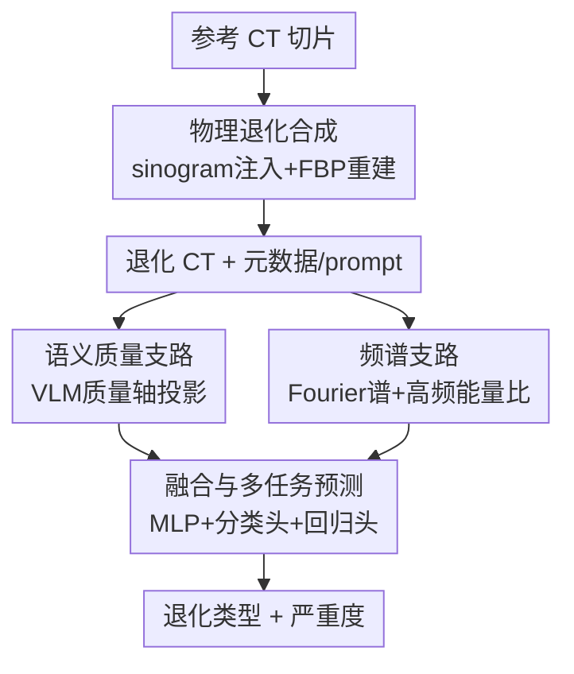

# CT-DegradBench: A Physics-Informed Benchmark for CT Degradation Detection and Severity Estimation

**会议**: CVPR 2026  
**arXiv**: [2605.16431](https://arxiv.org/abs/2605.16431)  
**代码**: https://github.com/yousranb/CT-DEGRADBENCH (有)  
**领域**: 医学图像 / 图像质量评估 / 多模态VLM  
**关键词**: CT退化、物理建模基准、严重度估计、医学VLM、频域特征

## 一句话总结
作者构建了 CT-DegradBench——一个用物理成像模型在投影域（sinogram）合成、覆盖 5 类退化 × 4 个严重度等级、含临床合理混合退化的可控 CT 基准，并提出无需微调的 SeSpeCT 框架（医学 VLM 语义质量轴 + Fourier 频域特征）联合预测退化类型与严重度，在单一与混合退化上都超过冻结 VLM 与经典 IQA 指标。

## 研究背景与动机
**领域现状**：CT 图像复原（低剂量去噪、稀疏视图重建、金属伪影抑制）已被深度学习广泛攻克，但**评测**仍主要依赖 PSNR / SSIM / LPIPS 这类图像质量指标，并且每个数据集只针对单一复原任务设计。

**现有痛点**：① 这些 IQA 指标在不同退化、不同严重度下的感知与临床可靠性并未被系统检验——它们到底对退化敏不敏感、随严重度是否单调，没人量化过；② 现有数据集是"各管各"的孤立复原集，无法在统一框架下横向比较多种退化类型与等级；③ 临床里退化几乎从不以单一标准形态出现，而是多种伪影叠加，但缺乏混合退化的受控评测。

**核心矛盾**：复原方法越做越多，可"用什么尺子量、这把尺子准不准"这件事却一直没有受控、可复现的答案；同时新兴的医学视觉-语言模型（VLM）是否编码了与退化类型/严重度相关的质量信息，也无人验证。

**本文目标**：(a) 造一个物理可控、带退化标签与严重度的统一 CT 基准；(b) 用它系统检验经典 IQA、学习型感知指标、医学 VLM 对退化的敏感性与单调性；(c) 给出一个无需任务微调、就能联合判别退化类型并估计严重度的方法。

**切入角度**：退化本质是物理成像过程被破坏的产物，因此应当**在投影域按物理模型注入退化**而非在像素域随便加噪；而判别退化又同时需要"语义层面的质量感知"（VLM 懂"这张图像质量差"）和"频域层面的结构指纹"（混叠/条纹/噪声在频谱里有独特模式）。

**核心 idea**：用"物理域退化合成 + 严重度分级"造基准，用"VLM 语义质量轴 + 频谱特征"双路融合做免训练/轻训练的退化分析。

## 方法详解
本文有两个产出：一个**基准**（CT-DegradBench）和一个**方法**（SeSpeCT）。基准负责"造可控数据 + 给统一评测协议"，方法负责"在这个基准上把退化类型和严重度同时预测出来"。

### 整体框架
基准侧：取一张干净参考 CT 切片 $x^{\mathrm{ref}}$，先把 Hounsfield 值转成线性衰减系数 $\mu$，经平行束 Radon 变换 $s=\mathcal{R}(\mu)$ 进入投影域，在 sinogram 上按物理模型注入单一或混合退化（或在像素域改衰减图，如金属伪影），再用滤波反投影（FBP）重建回带退化的 CT 图，并同步产出结构化元数据与自然语言 prompt 供 VLM 评测。

方法侧：SeSpeCT 对一张输入 CT 走两条互补支路——**语义质量支路**（冻结医学 VLM 上构造 prompt 质量轴、把图像投影上去得质量分）与**频谱支路**（Fourier 对数幅度谱 + 高频能量比），两路特征拼接后经 MLP 融合，再分两个头联合输出退化类别与严重度标量。

### 关键设计

**1. 物理域退化建模与严重度分级：让退化"长得像真伪影"且可控**

像素域直接加噪/模糊得到的退化和真实 CT 伪影分布不一致，无法支撑可信评测。本文把退化注入放回成像物理链路：在投影域按各伪影的真实机理建模五类退化，每类配 4 个标定严重度等级 L0–L3。噪声用混合 Poisson–Gaussian 模型在 sinogram 上采样光子计数 $K\sim\mathrm{Poisson}(\alpha I_0 e^{-s})$、叠加探测器高斯噪声后取对数，并用**残差缩放** $s_{\mathrm{noisy}}^{\gamma}=s+\gamma(s_{\mathrm{noisy}}-s),\ \gamma\in\{1,2,2.5,4\}$ 在保持物理噪声特性的前提下分级；模糊沿探测器方向用 1D 高斯核 $G_\sigma$ 卷积（$\sigma\in\{0.8,1,1.5,2.5\}$）模拟孔径/响应导致的分辨率损失；条纹用 $s_{\mathrm{streak}}=s+\Delta L\cdot M$ 在 sinogram 注入结构化离群；混叠用稀疏视图 $s_N=\mathcal{R}_{\Theta_N}(\mu),\ N\in\{180,90,60,45\}$ 模拟（视图越少混叠越强）；金属伪影在衰减图里插入金属区 $\mu_{\mathrm{metal}}(\mathbf{x})=(1-m)\mu+m\,\mu_{\mathrm{metal}}$ 再前投影重建，并因其空间局部性额外给出 bounding-box 标注。这样每个样本都有"退化类型 + 严重度 + 生成参数"的可复现真值，退化也因为走了同一条 FBP 重建链路而保留真实成像痕迹。

**2. 临床合理的混合退化协议：逼近"伪影从不单独出现"的真实场景**

孤立退化无法反映临床中多伪影共存的现实。本文在放射科医生指导下定义 5 种代表性混合配置（Blur+Noise、Streaks+Noise、Metal+Noise、Aliasing+Noise、Metal+Blur+Noise），按伪影在重建图中出现的物理先后顺序**串行**施加；每个混合样本被赋予一个全局严重度，各分量严重度从该全局等级的邻近档采样以保持伪影强度可比、避免不现实组合，并把混合体的最终严重度定义为各分量严重度的最大值。这一协议让基准既能测单退化敏感性，也能测"指标在复合退化下还准不准"——而后者正是真实 CT 评测里最容易翻车的地方。

**3. Prompt 驱动的语义质量轴：让冻结医学 VLM 免训练地"读出"质量方向**

如何不做任务微调就让 VLM 给出与退化相关的质量信号？作者在共享视觉-语言嵌入空间里用文本"挖"出一条质量方向：用一组放射学描述的"高质量"prompt 集 $\mathcal{H}$ 与"退化"prompt 集 $\mathcal{L}$，经冻结 BioMedCLIP 文本编码器得归一化原型 $\mu_H,\mu_L$，定义语义质量轴 $q=\frac{\mu_H-\mu_L}{\|\mu_H-\mu_L\|}$。输入 CT 的全局图像嵌入 $z$ 投影到该轴得全局质量分 $s_{\text{global}}=z^\top q$；为捕捉局部退化，再把 ViT 各 patch 嵌入 $\hat t_i$ 投影 $s_i=\hat t_i^\top q$ 形成质量图，用均值/最大值/标准差等统计 $\phi(\cdot)$ 汇成局部描述子 $f_{\text{loc}}$，最终语义表示 $f_{\text{sem}}=[s_{\text{global}}\,\|\,f_{\text{loc}}]$。其价值在于：质量轴完全由文本 prompt 定义、不需要标注训练，却能把"退化 → 高质量"的连续变化映成一个可投影的方向，这也是后面消融里贡献最大的一支

**4. 频谱支路与多任务融合：补上语义看不清的频域指纹**

混叠、条纹这类退化在像素域不显眼，但在频域有结构化畸变，噪声则改变高频能量分布——单靠语义支路会漏掉。频谱支路对图像取 DFT 后算对数幅度谱 $M=\log(1+|F|)$，经轻量卷积编码 $g_{\text{fft}}$ 得 $h_{\text{fft}}$，再补一个高频能量比 $r_{\text{fft}}=\frac{\sum_{(u,v)\in\Omega_h}|F|^2}{\sum|F|^2}$，得 $f_{\text{spec}}=[h_{\text{fft}}\,\|\,r_{\text{fft}}]$。两路拼接经 MLP 融成 $z_f=\mathrm{MLP}([f_{\text{sem}}\|f_{\text{spec}}])$，再分类头出退化类别 logits、回归头出严重度标量 $\hat s=w_{\text{reg}}^\top z_f+b_{\text{reg}}$。语义抓"质量好不好"、频谱抓"是哪种结构性畸变"，两者互补才让金属/局部退化也能被可靠区分

### 损失函数 / 训练策略
多任务目标 $\mathcal{L}=\mathcal{L}_{\text{cls}}+\lambda_{\text{reg}}\mathcal{L}_{\text{reg}}+\lambda_{\text{rank}}\mathcal{L}_{\text{rank}}+\lambda_{\text{con}}\mathcal{L}_{\text{con}}$：分类用交叉熵、严重度用 SmoothL1 回归；为保留严重度的序结构，加成对排序损失 $\mathcal{L}_{\text{rank}}=\frac{1}{|\mathcal{P}|}\sum_{(i,j)\in\mathcal{P}}\max(0,m-(\hat s_i-\hat s_j))$（$\mathcal{P}=\{(i,j)\mid s_i>s_j\}$）；再用监督对比损失 $\mathcal{L}_{\text{con}}$ 把"同退化类同严重度"的样本拉近以结构化融合嵌入。超参 $\lambda_{\text{rank}}=0.3,\ \lambda_{\text{con}}=0.05$，分类与回归项提供主监督，排序与对比项改善序一致性与嵌入结构。

## 实验关键数据

### 主实验
SeSpeCT 与冻结 VLM 在留出测试集上的严重度 Spearman 相关（越高越好）：

| 设置 | SeSpeCT | OpenCLIP | BioMedCLIP | 说明 |
|------|---------|----------|------------|------|
| 单一退化（均值 $\rho$） | **0.780** | 0.635 | 0.665 | 全面领先冻结 VLM |
| 混合退化（均值 $\rho$） | **0.710** | — | — | 混合场景仍最优 |
| 金属伪影 $\rho$ | **0.435** | <0.12 | <0.12 | 最难的局部退化提升最大 |

经典 IQA 指标对严重度的敏感性（Table 1，Spearman $\rho$ / Pearson $r$，绝对值越大越敏感；负号表示指标随严重度下降）：

| 退化设置 | PSNR | SSIM | LPIPS | DISTS | 观察 |
|----------|------|------|-------|-------|------|
| S4 混叠 | -0.536 | -0.952 | 0.960 | 0.955 | 结构性退化最敏感 |
| S5 金属 | -0.641 | -0.532 | -0.246 | 0.293 | 局部退化指标几乎失灵 |
| 单退化均值 | -0.563 | -0.784 | 0.685 | 0.753 | SSIM/LPIPS 总体较敏感 |

### 消融实验
SeSpeCT 各支路/损失逐项移除（分类 Accuracy↑、严重度估计）：

| 配置 | 分类 Acc | 说明 |
|------|---------|------|
| Full model | **0.783** | 完整模型 |
| w/o 语义支路 | 0.151 | 掉幅最大，严重度估计几乎崩溃 |
| w/o 频谱支路 | 明显下降 | 频域线索提供互补信息 |
| w/o 回归损失 | 严重度失效 | 回归项是严重度预测的核心监督 |
| w/o 排序损失 | 序一致性变差 | 排序项保严重度的序结构 |
| w/o 对比损失 | 分类/严重度均略降 | 结构化融合嵌入空间 |

### 关键发现
- **语义支路是命脉**：去掉它分类准确率从 0.783 暴跌到 0.151、严重度估计直接崩溃，说明 prompt 派生的质量轴承载了最关键的判别信息。
- **金属伪影是试金石**：全局 IQA 指标和冻结 VLM 对空间局部的金属伪影几乎不敏感（$\rho<0.12$），而 SeSpeCT 靠频谱+局部 patch 投影把相关性拉到 0.435。
- **VLM 趋势和经典指标一致**：OpenCLIP/BioMedCLIP 的嵌入漂移与严重度单调性最强，且在模糊/条纹/混叠上和结构/感知指标的敏感性趋势吻合；MedCLIP、Merlin 在金属与混合退化上较弱。

## 亮点与洞察
- **把退化合成放回成像物理链路**：在 sinogram/衰减图按真实机理注入退化再 FBP 重建，使合成伪影与真实分布一致——这是"benchmark 可信"的根，远比像素域加噪靠谱。
- **免训练语义质量轴**：用两组 radiology prompt 在 VLM 嵌入空间相减得到一条质量方向，零标注、零微调就能给质量打分，这个 trick 可迁移到任何"有正负文本描述"的质量/属性估计任务（如 MRI 伪影、内镜清晰度）。
- **语义 + 频谱互补的双视角**：语义答"质量差不差"，频谱答"是哪种结构畸变"，对局部退化（金属）尤其关键——提示做退化判别别只盯像素域或单一表征。

## 局限与展望
- **严重度真值是合成标定值**：L0–L3 来自生成参数而非临床主观打分，与放射科医生的真实感知是否对齐缺乏直接验证。
- **混合退化只有 5 种固定组合**、串行施加顺序近似真实，但临床退化的交互远更复杂，覆盖面有限。
- **方法仍需有监督训练融合头**：语义/频谱特征虽免微调，但分类/回归头和对比/排序损失要在该基准上训练，跨数据集/真实临床 CT 的泛化未充分验证。
- 严重度回归输出单一标量，混合退化下"最大严重度"的定义较粗，可能掩盖单分量的强弱差异。

## 相关工作与启发
- **vs 孤立复原数据集（LoDoPaB-CT、稀疏视图、金属伪影 grand challenge）**: 它们各自只覆盖一种退化、面向复原任务；本文做的是统一的多退化、多严重度、含混合的**检测/严重度评测**基准，定位互补而非竞争。
- **vs 冻结 VLM 直接当质量度量（OpenCLIP/BioMedCLIP/MedCLIP/Merlin）**: 直接用 VLM 嵌入漂移测严重度对局部退化（金属）几乎失灵；SeSpeCT 用 prompt 质量轴 + 频谱特征补强，金属伪影相关性从 $<0.12$ 提到 0.435。
- **vs 经典/学习型 IQA（PSNR/SSIM/VIF/LPIPS/DISTS）**: 本文系统量化了它们对退化的敏感性与严重度单调性，揭示"局部退化下常用指标不可靠"，为复原评测换尺子提供证据。

## 评分
- 新颖性: ⭐⭐⭐⭐ 物理域可控基准 + 免训练 VLM 质量轴 + 语义-频谱融合，组合新颖且切中评测痛点
- 实验充分度: ⭐⭐⭐⭐ 覆盖经典 IQA、多个 VLM、单/混合退化与完整消融，但缺真实临床数据与人工主观验证
- 写作质量: ⭐⭐⭐⭐ 物理建模与公式清晰，方法三模块结构分明
- 价值: ⭐⭐⭐⭐ 给 CT 复原评测提供统一可复现的"尺子"，基准+代码开源，社区价值高

<!-- RELATED:START -->

## 相关论文

- [\[CVPR 2026\] Robust Multi-Source Covid-19 Detection in CT Images](robust_multi-source_covid-19_detection_in_ct_images.md)
- [\[CVPR 2026\] Robust Fair Disease Diagnosis in CT Images](robust_fair_disease_diagnosis_in_ct_images.md)
- [\[ICML 2026\] Foundation VAEs for 3D CT Reconstruction, Augmentation, and Generation](../../ICML2026/medical_imaging/foundation_vaes_for_3d_ct_reconstruction_augmentation_and_generation.md)
- [\[CVPR 2025\] SALIENT: Frequency-Aware Paired Diffusion for Controllable Long-Tail CT Detection](../../CVPR2025/medical_imaging/salient_frequency-aware_paired_diffusion_for_controllable_long-tail_ct_detection.md)
- [\[CVPR 2026\] Fair Lung Disease Diagnosis from Chest CT via Gender-Adversarial Attention Multiple Instance Learning](fair_lung_disease_diagnosis_from_chest_ct_via_gend.md)

<!-- RELATED:END -->
