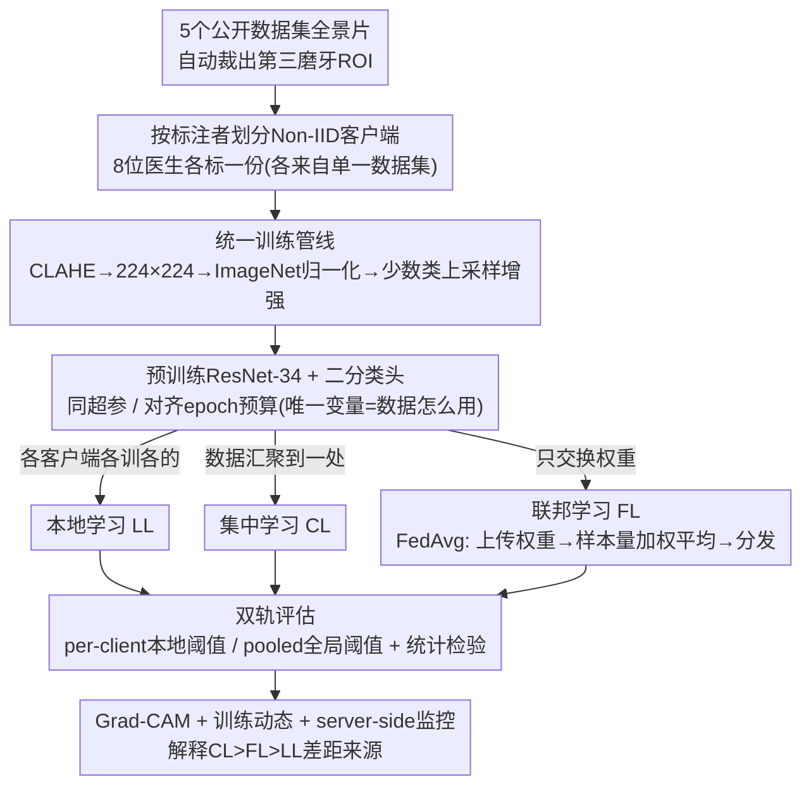

# Deep Learning-based Assessment of the Relation Between the Third Molar and Mandibular Canal on Panoramic Radiographs using Local, Centralized, and Federated Learning

**会议**: CVPR 2026  
**arXiv**: [2603.11850](https://arxiv.org/abs/2603.11850)  
**代码**: 无  
**领域**: 医学图像分析 / 联邦学习 / 口腔影像  
**关键词**: 联邦学习, 全景X光片, 第三磨牙, 下颌管, 隐私保护

## 一句话总结
在按8个独立标注者划分的全景口腔X光裁剪片上，系统对比本地学习（LL）、联邦学习（FL）和集中学习（CL）三种训练范式在第三磨牙-下颌管重叠二分类任务上的表现，验证了CL > FL > LL的性能排序（AUC分别为0.831、0.757和0.672），证明FL在保护数据隐私的前提下显著优于各站点独立训练。

## 研究背景与动机

**领域现状**：阻生下颌第三磨牙（智齿）是口腔外科中最常见的手术之一。当智齿与下颌管（容纳下牙槽神经的骨性管道）存在密切空间关系时，拔牙手术中有损伤下牙槽神经的风险，可能导致下唇和下颌皮肤永久性感觉异常。全景X光片（OPG）是术前评估磨牙与下颌管空间关系的常规手段。

**现有痛点**：全景X光片上磨牙与下颌管的重叠判断依赖放射科医生的主观经验，不同标注者之间存在显著的判断差异。自动化分类可以辅助临床分诊并减少不必要的CBCT转诊（CBCT辐射剂量更高、费用更贵）。然而，口腔影像数据分散在不同的临床机构和标注团队中，受隐私法规（如GDPR、HIPAA）限制，各中心的数据无法直接汇聚进行集中训练。

**核心矛盾**：集中训练（CL）需要数据汇聚但违反隐私规定；本地训练（LL）保护隐私但各站点数据量小，模型泛化能力差。联邦学习（FL）作为折中方案，理论上可以在不共享原始数据的前提下实现多中心协作，但其在真实口腔影像场景中的性能-隐私权衡尚未被系统验证。

**本文目标**：在存在真实标注者差异（Non-IID特性）的口腔影像数据上，量化LL、FL、CL三种范式的性能差距，回答"FL能否作为CL的隐私保护替代方案"。

**切入角度**：选择语义清晰、临床意义明确的二分类任务（磨牙-下颌管重叠 vs 无重叠），以预训练ResNet-34为统一backbone，将8个独立标注者的数据视为8个FL客户端，系统对比三种训练范式。

**核心 idea**：联邦学习在口腔影像的多标注者设置下可以作为集中训练的可行替代，性能显著优于各站点独立训练。

## 方法详解

### 整体框架
这篇论文本质上是一个"训练范式对照实验"，而不是提出新模型。它要回答的问题很具体：在受隐私法规约束、数据无法汇聚的真实口腔影像场景里，联邦学习（FL）能不能顶替集中学习（CL）？为了让答案有说服力，作者把整条流水线钉死在控制变量上：先从5个公开数据集的全景片里自动裁出以第三磨牙为中心的ROI，按8位独立标注者把数据切成8个客户端——关键是每位标注者只标注来自**单一公开数据集**的影像，于是这8个客户端之间既有标签分布差异、又有成像设备与人群差异，是天然的Non-IID。所有影像走同一套预处理（CLAHE增强对比度→缩放到224×224→ImageNet均值方差归一化→对少数类上采样并做增强以平衡类别），再用同一个ImageNet预训练ResNet-34、同一套超参、对齐的训练预算（CL/LL各10个epoch，FL用5轮×2个本地epoch凑成等量），分别在本地学习（LL，各客户端各训一个）、集中学习（CL，数据全汇聚）、联邦学习（FL，只交换权重）三种范式下做"重叠 vs 不重叠"的二分类——整条管线唯一的变量就是"数据怎么用"。最后用两套评估口径（per-client本地最优阈值 / pooled全局统一阈值）量化三者差距，再叠加训练曲线、Grad-CAM和server-side聚合信号去解释差距从何而来。

### 关键设计

**1. 按标注者划分的真实Non-IID客户端：异质性不是人造的**

多中心FL研究常被诟病的一点是：异质性是人工捏造的（把一份数据随机切几份）。本文换了个更有说服力的切法——直接拿8位放射科标注者各自标注的子集当8个FL客户端，而且每位标注者只负责来自**单一公开数据集**的影像。智齿与下颌管是否"重叠"本身就是主观判断，不同标注者的尺度天然有差异；再叠加各数据集成像设备、人群构成的不同，这8份数据在标签分布和特征分布上都自带真实的Non-IID特性，比随机划分更接近"不同中心、不同标注习惯、不同设备"的临床现实。这也正是后面FL与CL拉开差距的根源——异质性越真实，联邦聚合越吃力。

**2. 控制变量的统一训练管线：把"数据怎么用"之外的一切都钉死**

要让"FL vs CL vs LL"的对比有说服力，除了"数据怎么用"之外的一切都不能变。作者为此把训练管线彻底标准化：所有影像统一走CLAHE对比度增强→缩放到224×224→ImageNet均值方差归一化；针对类别不均衡（overlap只占约34%），对少数类反复随机采样并叠加增强（反射填充、水平翻转、约3°小角度旋转、中心裁剪、轻微色彩抖动、随机高斯模糊）补足到两类平衡，且这套增强会周期性重生成（LL/CL每2个epoch、FL每轮重建本地数据）以增加多样性。三种范式都从同一个ImageNet预训练ResNet-34（末层换成二分类头）初始化、用同一套超参，连训练预算都对齐——CL和LL各训10个epoch，FL用5轮×2个本地epoch凑成等量的10个epoch。把这些全钉死后，三者唯一的差异才真正落在"数据是各自留本地、汇聚到一处、还是只交换权重"上，对比结论才站得住。

**3. FedAvg参数级协作：数据不出本地，只在服务端平均模型权重**

FL这一支的核心是标准FedAvg（用Flower AI实现）。每一轮里，服务端把当前全局权重下发给各客户端，客户端在自己那份数据上本地训练若干epoch，只把更新后的权重传回服务端；服务端按各客户端样本量加权平均，得到新的全局模型再分发回去，如此循环若干轮：

$$w_{t+1} = \sum_{k=1}^{K} \frac{n_k}{n}\, w_t^{k}$$

其中 $n_k$ 是第 $k$ 个客户端的样本数、$n=\sum_k n_k$ 是总量。整个过程原始影像始终留在本地，只交换权重，这正是它能绕开GDPR、HIPAA等隐私约束的原因。本文刻意不追求FL算法本身的创新，只用最朴素的FedAvg当基线——目的就是看"哪怕用最简单的聚合，FL能不能已经把各站点单干（LL）甩开"。

**4. per-client 与 pooled 双轨评估 + 统计检验：对应两种真实部署姿态**

只报一个数字会掩盖FL落地时的歧义，因为全局模型上线有两种用法。per-client评估模拟"全局模型 + 各中心自己调阈值"：在每个客户端的验证集上单独搜最优分类阈值，再在该客户端本地测试集上算指标，反映模型在本地精调后的最好表现。pooled评估模拟"全局模型 + 全局阈值"：用一个在合并训练/验证集上定下的统一阈值，在集中测试集上算指标，反映跨中心直接部署的泛化能力。两套口径都报AUC以及基于阈值的准确率、敏感性、特异性等指标；并配上统计检验——本地验证集上因样本量小（n=8）用配对Wilcoxon符号秩检验，集中测试集上用DeLong检验比较ROC曲线，多重比较再做Bonferroni校正。这样无论临床上选哪种部署策略，"CL > FL > LL"的结论都有统计支撑。

**5. Grad-CAM + 训练动态 + server-side监控：不止比"谁赢"，还解释"为什么"**

光有排序不够，作者还想知道差距背后的机制。一方面用Grad-CAM画出三种范式模型的注意力热力图，看它们是否真盯着解剖学上该看的地方——第三磨牙根尖和下颌管走行处；如果LL模型注意力散乱、落在非解剖伪影上，就说明它在小数据上学到的是捷径而非真特征。另一方面用训练/验证曲线监控收敛与过拟合程度，FL侧还额外追踪server-side的聚合信号（联邦场景下数据不可见，只能靠权重和梯度判断各客户端训练质量是否一致、全局模型是否稳定收敛）。这两条线索共同解释了实验里"LL过拟合最重、泛化最差"的结论根源。

### 损失函数 / 训练策略
统一用ImageNet预训练ResNet-34、末层换成二分类头，优化目标是带logits的二分类交叉熵（BCEWithLogits），分类阈值0.5、batch size 32；优化器AdamW，学习率 $1\times10^{-4}$、权重衰减 $1\times10^{-5}$。CL/LL训练10个epoch，FL用5轮、每轮2个本地epoch凑成等量预算。FL严格走标准FedAvg（Flower AI实现），并持续监控server-side聚合信号以确保全局模型稳定收敛。

## 实验关键数据

### 主实验

| 训练范式 | AUC | 准确率(%) | 备注 |
|---------|-----|----------|------|
| CL（集中学习） | **0.831** | **78.2** | 最高性能，所有数据集中训练 |
| FL（联邦学习） | 0.757 | 70.3 | 中间水平，隐私保护 |
| LL（本地学习） | 0.619-0.734 (均值0.672) | - | 最低且方差大 |

FL相比LL均值AUC提升+0.085（从0.672到0.757），CL相比FL进一步提升+0.074（从0.757到0.831）。

### 消融实验

| 配置 | 关键指标 | 说明 |
|------|---------|------|
| LL 8个客户端 | AUC 0.619-0.734 | 跨度>0.1，说明标注者数据分布差异巨大 |
| FL vs LL best | AUC 0.757 vs 0.734 | FL超越最强本地模型 |
| CL vs FL gap | AUC 0.831 vs 0.757 | 差距0.074，数据集中仍有不可忽视的优势 |
| 训练曲线过拟合 | LL > FL > CL | LL过拟合最严重 |

### 关键发现
- CL > FL > LL的性能排序在AUC和准确率上一致成立，证实数据共享的价值
- FL作为CL的隐私保护替代方案是有效的，但与CL之间仍存在约0.074 AUC的性能差距
- LL模型的过拟合最为严重——各客户端数据量小，单独训练难以学到泛化特征
- Grad-CAM显示CL和FL模型的注意力更集中在解剖学上与磨牙-管关系相关的区域（如根尖和管道走行处），而LL模型的注意力更分散，可能利用了非解剖学伪影
- 8个客户端之间的LL性能跨度超过0.1 AUC，反映了真实标注者差异对模型的显著影响

## 亮点与洞察
- **首次在牙科AI中系统验证FL**：联邦学习在口腔影像领域的应用此前几乎空白，本文提供了首个基准测试
- **真实标注者划分比随机划分更有价值**：8个标注者作为8个FL客户端，自然引入了标注标准差异带来的Non-IID特性，比人工制造的异质性更接近临床现实
- **双轨评估严谨**：区分per-client和pooled两种评估方式，对应不同的实际部署策略
- **Grad-CAM验证模型可信度**：CL和FL模型关注正确解剖区域的发现增加了临床可信度
- **清晰的性能排序**：CL > FL > LL的一致结论为临床决策者提供了明确的参考

## 局限与展望
- 二分类任务（overlap vs no-overlap）过于粗糙，临床实际需要更细粒度的风险分级（如Winter分类、Pell-Gregory分类）
- FL仅使用标准FedAvg，未探索FedProx、SCAFFOLD、FedBN等处理数据异质性的先进算法，这些方法可能缩小FL与CL之间的性能差距
- 8个标注者的规模较小，大规模多中心（如20+机构）的验证更有说服力
- 未详细报告标注者间一致性（inter-rater agreement），如Kappa系数或Fleiss' Kappa，无法量化标注噪声对训练的影响
- ResNet-34是较旧的backbone，未尝试Vision Transformer等更现代的架构
- 仅使用裁剪的ROI区域，未探索全景片端到端检测+分类的流程

## 相关工作与启发
- **vs 通用医学FL研究（如FedAvg在X-ray/CT上的应用）**：本文聚焦口腔特定任务，数据按标注者而非机构划分是独特设置，更接近标注标准差异驱动的Non-IID
- **vs 传统dental AI工作**：大多依赖单中心集中训练，本文首次在磨牙-下颌管关系评估中引入FL范式
- **vs 更先进FL算法（FedProx/FedBN/SCAFFOLD）**：本文仅用FedAvg作为基线，明确指出了改进空间，但基线结果本身已经证明了FL的可行性
- **vs 同场景CBCT研究**：全景片获取成本和辐射剂量远低于CBCT，自动分类可以筛选出真正需要CBCT的病例

## 评分
- 新颖性: ⭐⭐⭐ FL在口腔影像中首次系统验证有一定新意，但方法层面（FedAvg+ResNet-34）无创新
- 实验充分度: ⭐⭐⭐ 三范式对比合理、双轨评估加分，但FL算法探索单一、数据规模有限、缺少inter-rater分析
- 写作质量: ⭐⭐⭐⭐ 结构清晰，摘要信息密度高，实验设计的逻辑表述连贯
- 价值: ⭐⭐⭐ 为口腔AI的隐私保护训练提供了有价值的基线参考，但实用性受限于二分类任务的粗糙度

<!-- RELATED:START -->

## 相关论文

- [\[CVPR 2026\] Unlocking Multi-Site Clinical Data: A Federated Approach to Privacy-First Child Autism Behavior Analysis](unlocking_multi-site_clinical_data_a_federated_approach_to_privacy-first_child_a.md)
- [\[CVPR 2026\] OmniFM: Toward Modality-Robust and Task-Agnostic Federated Learning for Heterogeneous Medical Imaging](omnifm_toward_modality-robust_and_task-agnostic_federated_learning_for_heterogen.md)
- [\[CVPR 2026\] Federated Modality-specific Encoders and Partially Personalized Fusion Decoder for Multimodal Brain Tumor Segmentation](federated_modality-specific_encoders_and_partially_personalized_fusion_decoder_f.md)
- [\[CVPR 2026\] Interpretable Cross-Domain Few-Shot Learning with Rectified Target-Domain Local Alignment](interpretable_cross-domain_few-shot_learning_with_rectified_target-domain_local_.md)
- [\[CVPR 2026\] FedVG: Gradient-Guided Aggregation for Enhanced Federated Learning](fedvg_gradient-guided_aggregation_for_enhanced_federated_learning.md)

<!-- RELATED:END -->
