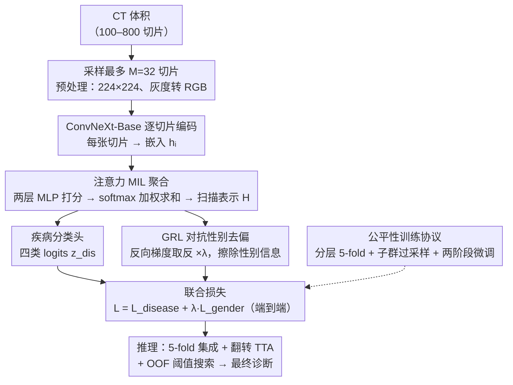

# Fair Lung Disease Diagnosis from Chest CT via Gender-Adversarial Attention Multiple Instance Learning

**会议**: CVPR 2026 (PHAROS-AIF-MIH Workshop)  
**arXiv**: [2603.12988](https://arxiv.org/abs/2603.12988)  
**代码**: [GitHub](https://github.com/ADE-17/cvpr-fair-chest-ct)  
**领域**: 医学图像  
**关键词**: 公平性诊断, 胸部CT, 多示例学习, 梯度反转层, 肺疾病分类

## 一句话总结

在 ConvNeXt-Base 骨干上构建注意力 MIL 模型，用 GRL 对抗性消除扫描表示中的性别信息，配合 focal loss（$\gamma=2$）+ 标签平滑（$\varepsilon=0.1$）、子群过采样和 5-fold 集成，在 889 例胸部 CT 四类诊断中实现均值竞赛分数 0.685±0.030，女性 macro-F1（0.691）略高于男性（0.679），验证了 GRL 能有效闭合公平性差距。

## 研究背景与动机

**领域现状**：深度学习在胸部 CT 自动分析中取得巨大进展，可实现大规模肺恶性肿瘤和 COVID-19 筛查。然而公平性研究表明，模型容易编码并放大训练数据中的人口统计学偏差，对弱势群体产生系统性更差的诊断结果。

**现有痛点**：CVPR 2026 PHAROS-AIF-MIH 挑战赛数据集（889 例 CT：734 训练/155 验证，四类：Healthy/COVID-19/Adenocarcinoma/Squamous Cell Carcinoma）存在严重交叉不平衡——女性鳞癌仅 18 例 vs 男性 91 例，CT 深度从 <20 到 800+ 切片高度可变。竞赛指标为男女 macro-F1 均值 $P = \frac{1}{2}(\text{MacroF1}_\text{male} + \text{MacroF1}_\text{female})$，直接惩罚性别不公平。

**核心矛盾**：三个相互纠缠的挑战——(1) 体积信号稀疏：百余张切片中仅数张含病变，mean pooling 被健康切片淹没；(2) 人口统计学不平衡：女性鳞癌极度稀缺，标准训练严重不足；(3) 性别作为隐式捷径：即使不输入性别，模型可从体型和采集参数编码性别特征并与疾病共现统计量耦合。

**本文目标** 在端到端框架中同时应对信号稀疏、子群不平衡和性别编码，实现性别公平的四类肺疾病诊断。

**切入角度**：将 CT 视为切片 bag 用 MIL 自动选择信息切片，用 GRL 对抗性解耦性别，用公平性协议平衡子群。

**核心 idea**：注意力 MIL 聚合信息切片 + GRL 消除性别捷径 + 子群过采样闭合公平性差距。

## 方法详解

### 整体框架

这篇论文要在一个性别严重不平衡的胸部 CT 数据集上，做出**对男女同样准**的四类肺疾病诊断，难点在于病变信号稀疏、子群样本悬殊、模型还会偷偷拿性别当捷径。整条流水线把一次 CT 体积当成一袋切片来处理：先限制每例最多取 $M=32$ 张切片，用去掉分类头的 ConvNeXt-Base 把每张切片编成一个 $D$ 维嵌入；再用一个两层 MLP 的注意力网络给每张切片打分、加权求和，压成单个扫描级表示 $H$。这个 $H$ 同时喂给两个头——一个是四类疾病分类头，另一个是经梯度反转层（GRL）接上的性别二分类对抗头，两条支路端到端一起训，并由公平性训练协议（分层 5-fold + 子群过采样 + 两阶段微调）托底。推理时再叠上 5-fold 集成、水平翻转 TTA 和基于 OOF 的阈值搜索来榨干稳定性。

### 关键设计

**1. 注意力 MIL 聚合：让模型自己挑出含病变的那几张切片**

百余张切片里往往只有寥寥数张真正含病灶，如果用 mean pooling，肿瘤信号会被一大堆健康切片稀释掉；换成 max pooling 又太容易被单张伪影带偏。这里的做法是把切片聚合交给一个可学习的注意力权重：ConvNeXt-Base 先把每张切片编成嵌入 $h_i = f_\text{enc}(x_i) \in \mathbb{R}^D$，两层 MLP 给出重要性分数 $s_i = a(h_i; \theta_a)$，经 softmax 归一化成权重 $w_i$ 后加权求和得到扫描表示 $H = \sum_i w_i h_i$；零填充的位置用 attention mask 屏蔽掉，不让它们参与归一化。切片数 $N>M$ 的体积在训练时随机采样、推理时改成均匀采样以保住空间覆盖。这相当于在 mean 和 max 之间学一个软折中——既不被背景切片淹没，又不被单点伪影绑架，而且全程不需要切片级标注。

**2. GRL 对抗性别去偏：把扫描表示里的性别信息主动擦掉**

即使不把性别当输入，骨干也能从体型、采集参数这类线索里隐式编码出性别，再和"某种癌在某性别更常见"的共现统计耦合，变成一条诊断捷径。为了堵住它，作者在 $H$ 上额外挂一个 GRL 加两层 MLP 的性别二分类器 $z_\text{gen} = c(\mathcal{R}_\lambda(H))$。GRL 的特点是前向恒等、反向把梯度取反再乘上系数 $\lambda_\text{adv}$，于是总损失写成

$$\mathcal{L} = \mathcal{L}_\text{disease} + \lambda_\text{adv} \cdot \mathcal{L}_\text{gender}$$

性别头被训练去尽力预测性别，但反转后的梯度反过来逼骨干**丢掉**那些能预测性别的特征，形成一场对抗。好处是侵入性极小——主任务的网络结构一点没改，只多挂一条对抗分支，就把公平性当成一个可微的正则压进表示里。

**3. 公平性训练协议：在 18 例女性鳞癌这种极端稀缺下不让子群崩掉**

单靠对抗去偏还不够，因为像女性鳞癌这样只有 18 例的子群，标准训练里几乎会被直接淹没，连评估都不公平。作者于是三管齐下：先按 (class, gender) 的 8 个子群做分层 5-fold 交叉验证，保证每一折里所有子群都在场，避免某折正好缺了稀有子群导致评估失真；再用 WeightedRandomSampler 把女性鳞癌的采样权重大幅拉高，让它几乎每个 batch 都出现，防止类别崩塌；最后用两阶段微调——前 5 个 epoch 冻住骨干、只训注意力网络和两个头（LR=1e-3），等注意力先稳定下来后再解冻骨干（骨干 LR=1e-5、头 LR=1e-4，cosine 退火）。三件事各管一段：过采样防崩、分层折保公平评估、两阶段保训练稳定。

### 损失函数 / 训练策略

- 疾病损失：focal loss（$\gamma=2, \alpha=0.25$）+ 标签平滑（$\varepsilon=0.1$），$\tilde{p}_t = (1-\varepsilon)p_t + \varepsilon/C$
- 性别损失：二元交叉熵
- AdamW（$\beta_1=0.9, \beta_2=0.999$, WD=0.05）；梯度累积 $K=4$（等效 batch=16）；50 epoch；单卡 RTX A4000
- 推理：5-fold soft logit 投票 + 水平翻转 TTA；OOF per-class 阈值优化（dense grid $\mathcal{T} \subset [0.05, 0.95]$）

## 实验关键数据

### 主实验——Per-Fold 验证结果

| Fold | 竞赛分数 P | Male macro-F1 | Female macro-F1 | F1-腺癌 | F1-鳞癌 |
|------|-----------|---------------|-----------------|---------|---------|
| 0 | 0.698 | 0.673 | 0.722 | 0.807 | 0.258 |
| 1 | **0.727** | 0.754 | 0.699 | 0.796 | 0.378 |
| 2 | 0.674 | 0.658 | 0.690 | 0.692 | 0.500 |
| 3 | 0.688 | 0.743 | 0.634 | 0.803 | 0.303 |
| 4 | 0.637 | 0.565 | 0.709 | 0.681 | 0.389 |
| Mean±Std | 0.685±0.030 | 0.679±0.068 | 0.691±0.030 | 0.756±0.057 | 0.366±0.083 |

### OOF 全局集成结果

| 模型 | P | M-F1 | F-F1 | F1-A | F1-G | F1-Cov |
|------|---|------|------|------|------|--------|
| OOF Global Mean | 0.683 | 0.679 | 0.688 | 0.755 | 0.366 | 0.813 |
| OOF ± | 0.032 | 0.066 | 0.029 | 0.056 | 0.083 | 0.070 |

### 消融实验（定性路径）

| 设计选择 | 解决的挑战 | 改进 |
|---------|-----------|------|
| Mean → Max Pooling | 稀疏肿瘤信号被稀释 | 恢复对稀疏肿瘤切片正预测能力 |
| Max → Attention-MIL | 背景和边界切片噪声 | 学习动态忽略空肺区域，提升鲁棒性 |
| + 子群过采样 | 极端交叉稀缺（仅 18 例女性鳞癌） | 防止类别崩塌，大幅提升 Female macro-F1 |
| + GRL | 肿瘤特征与性别特征纠缠 | 闭合公平性差距（P=0.685，F-F1≈M-F1） |

### 关键发现

- GRL 成功解耦性别与肿瘤特征：Female macro-F1（0.691）略高于 Male（0.679），验证模型不再依赖性别偏差
- 鳞癌 F1 最低（0.366±0.083），根本约束是数据稀缺（仅 18 例女性鳞癌）而非方法缺陷
- 5-fold 集成 + TTA 有效缓解高方差折（如 Fold 4 的 0.637）的拖累
- OOF 阈值优化比直接 argmax 更稳健，全局竞赛分数 0.683 且无泄漏风险

## 亮点与洞察

- GRL 是极简但有效的公平性约束——不改变主任务架构，仅增加对抗分支。这种"最小侵入性公平性"可迁移到任何需要去偏的医学影像任务
- 极端子群不平衡下 WeightedRandomSampler + focal loss + 标签平滑的组合是可行补救——单一策略不足，多管齐下才能避免崩塌
- 两阶段微调（先稳定注意力头 → 再解冻骨干）对 MIL 训练稳定性至关重要
- OOF 阈值优化被低估——在小数据集上直接在验证集调阈值容易过拟合，OOF 提供无泄漏的全局估计

## 局限与展望

- 鳞癌 F1 仅 0.366±0.083，受限于 18 例女性鳞癌数据稀缺——作者建议用扩散模型生成合成 CT 增强稀有子群
- 消融为定性路径描述而非定量逐步表格，缺少去掉单个组件后的精确数值下降
- 仅考虑性别一种敏感属性，年龄、种族等其他公平性维度未涉及
- 每个体积仅采样 32 张切片，800+ 切片体积可能丢失关键病变
- 未使用 3D 卷积或 z 轴位置编码，忽略了切片间空间连续性
- 仅在单一挑战赛数据集（889 例）验证，外部泛化性未知

## 相关工作与启发

- **vs Ilse et al. (ICML 2018) Attention-MIL**：本文在其框架上增加 GRL 对抗分支和公平性协议，从弱监督聚合扩展到公平性感知诊断
- **vs Ganin & Lempitsky (2015) GRL**：原始用于域适应消除域特征，本文转用于消除性别特征实现人口统计学公平
- **vs 3D CT 分类（3D ResNet 等）**：本文用 2D backbone + MIL 聚合，更适合切片数高度可变场景，但牺牲 z 轴空间建模

## 评分

⭐⭐⭐

- **新颖性** ⭐⭐⭐：GRL 和 attention MIL 都是已有组件组合应用，缺乏架构层面原创
- **实验充分度** ⭐⭐⭐：消融为定性描述，仅单一挑战赛数据集
- **写作质量** ⭐⭐⭐⭐：方法描述清晰系统，公式完整，流程图直观
- **价值** ⭐⭐⭐：为医学 AI 公平性提供端到端方案模板，但受限于挑战赛报告深度

<!-- RELATED:START -->

## 相关论文

- [\[CVPR 2026\] Robust Fair Disease Diagnosis in CT Images](robust_fair_disease_diagnosis_in_ct_images.md)
- [\[CVPR 2026\] MIL-PF: Multiple Instance Learning on Precomputed Features for Mammography Classification](milpf_multiple_instance_learning_on_precomputed_fe.md)
- [\[CVPR 2026\] Every Error has Its Magnitude: Asymmetric Mistake Severity Training for Multiclass Multiple Instance Learning](every_error_has_its_magnitude_asymmetric_mistake_severity_training_for_multiclas.md)
- [\[CVPR 2026\] EMAD: Evidence-Centric Grounded Multimodal Diagnosis for Alzheimer's Disease](emad_evidence-centric_grounded_multimodal_diagnosis_for_alzheimers_disease.md)
- [\[AAAI 2026\] DW-DGAT: Dynamically Weighted Dual Graph Attention Network for Neurodegenerative Disease Diagnosis](../../AAAI2026/medical_imaging/dw-dgat_dynamically_weighted_dual_graph_attention_network_for_neurodegenerative_.md)

<!-- RELATED:END -->
