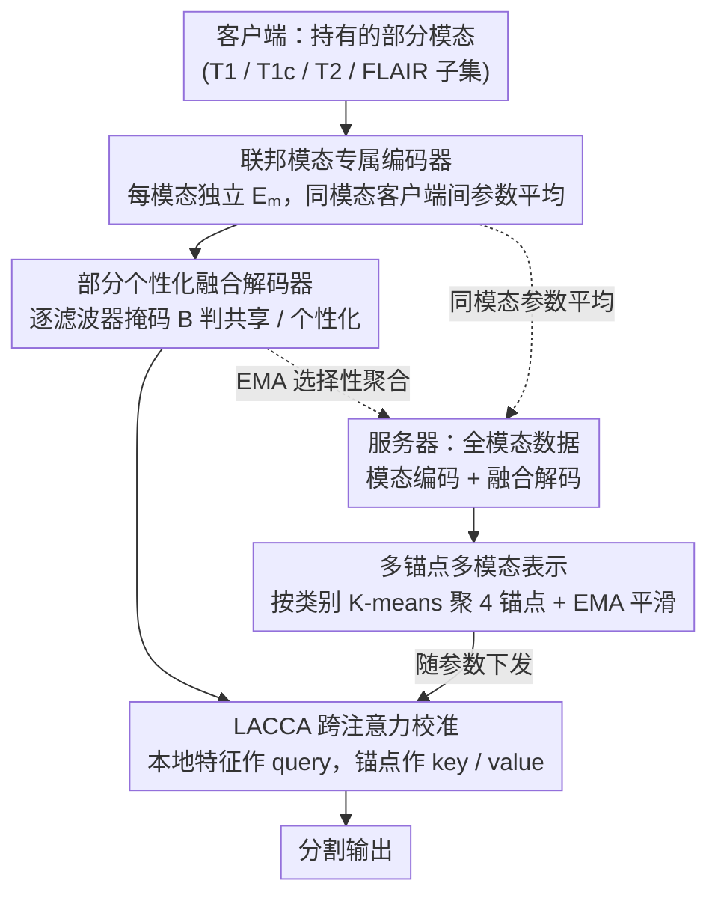

# Federated Modality-specific Encoders and Partially Personalized Fusion Decoder for Multimodal Brain Tumor Segmentation

**会议**: CVPR 2026  
**arXiv**: [2603.04887](https://arxiv.org/abs/2603.04887)  
**代码**: [GitHub](https://github.com/ccarliu/FedMEPD)  
**领域**: 医学图像  
**关键词**: Federated Learning, Multimodal Brain Tumor Segmentation, Intermodal Heterogeneity, Personalized FL, Cross-Attention Calibration

## 一句话总结

提出 FedMEPD 框架，用模态专属编码器处理模态间异质性、滤波器级动态部分个性化解码器平衡知识共享与个性化、多锚点跨注意力校准补偿缺失模态信息，在 BraTS 2018/2020 上全面超越现有多模态联邦学习方法。

## 研究背景与动机

**领域现状**：联邦学习（FL）允许多个医疗机构在不共享隐私数据的前提下协同训练模型，脑肿瘤分割依赖 T1、T1c、T2、FLAIR 四种 MRI 模态提供互补信息（前两者突出肿瘤核心，后两者突出瘤周水肿）。

**现有痛点**：现实中不同医疗机构可能仅拥有部分模态（如小型诊所只有 T1），导致 FL 参与方之间出现严重的**模态间异质性**（intermodal heterogeneity），而目前绝大多数医学影像 FL 方法只处理模态内数据异质性（non-IID 分布），无法有效应对模态缺失场景。

**核心矛盾**：FL 需要同时实现两个目标——(1) 训练一个面向全模态输入的最优全局模型（服务器端），(2) 为每个仅有部分模态的客户端定制个性化模型——这二者在模态异质性下存在本质张力：完全联邦化聚合会被异质模态干扰、完全个性化又阻碍知识共享。

**本文目标**：在保护隐私的前提下，如何既有效利用异质模态数据训练全局模型，又为缺失模态的客户端提供信息补偿和个性化适配。

**切入角度**：将网络拆分为模态专属编码器（完全联邦化）和多模态融合解码器（部分联邦化、部分个性化），结合多锚点多模态表示通过跨注意力校准缺失模态的特征。

**核心 idea**：通过参数更新方向一致性的滤波器级动态掩码，让解码器中"全局有共识"的参数联邦化共享、"本地有差异"的参数个性化保留，同时用服务器侧的多锚点全模态表示通过 cross-attention 补偿客户端缺失模态。

## 方法详解

### 整体框架

FedMEPD 要回答的是一个被大多数医学联邦学习方法回避的问题：当不同医院手里的 MRI 模态各不相同（小诊所只有 T1、大医院四种齐全），怎么既训出一个面向全模态的强全局模型，又给每个缺模态的客户端定制好用的本地模型。它的解法是把网络从中间剖开，对前后两半用截然不同的联邦策略。

整体只有一条主链：每个客户端把自己拥有的模态各送进一个**模态专属编码器**，编码出的特征汇入一个**多模态融合解码器**输出分割。关键在于这两半的处理方式分裂——编码器**完全联邦化**（服务器对同一模态的所有客户端参数取平均），解码器则**部分联邦、部分个性化**（用一个动态二值掩码 $B^i$ 逐滤波器决定哪些跟全局走、哪些留在本地）。服务器侧因为假设拥有全模态数据，能额外算出一份按类别聚类的**多锚点表示**，随模型参数一起下发，客户端再用它通过跨注意力（即 LACCA 模块）**校准**自己缺失的那部分模态信息。骨干网络沿用 RFNet，它本就支持模态专属编码 + 融合解码的分离结构，所有编码器还共享一个辅助分割解码器做正则。

### 关键设计

**1. 联邦模态专属编码器：让每种模态学自己的特征，别互相干扰**

FedAvg 的做法是所有模态共用一个编码器并把参数全局平均，但 T1、T1c、T2、FLAIR 的成像物理差异巨大，把它们的梯度搅在一起平均，等于让四种分布互相拉扯，谁也学不好。FedMEPD 干脆给每种模态 $m$ 配一个独立编码器 $E_m$，只在**同一模态的客户端之间**做联邦聚合：每轮客户端先用全局参数 $W_m^s$ 覆盖本地副本，训练后回传，服务器再对持有该模态的 $N_m$ 个客户端取平均 $W_m^s = \frac{1}{N_m}\sum_i W_m^i$。这样既保留了联邦带来的跨机构数据红利，又让每个编码器只需适配单一分布、充分特化。消融里这一步是整套框架最大的性能跳变——客户端平均 mDSC 从 55.37% 直接拉到 68.70%（+13.33%），印证了"模态间异质性"才是真正的瓶颈。

**2. 部分个性化融合解码器：逐滤波器自动判断该共享还是该个性化**

解码器卡在一个两难里：完全个性化（每个客户端自己练）会切断知识共享，完全联邦化又会被异质模态污染——消融显示两个极端分别只到 68.70% 和 68.49%，都不如折中。FedMEPD 不靠人工划分哪层共享，而是用**参数更新方向的一致性**自动判定。对解码器的每个滤波器 $j$，它比较服务器和客户端这一轮更新向量的余弦相似度 $\delta_j^{i,r} = \cos(\Delta \mathbf{w}_j^{s,r}, \Delta \mathbf{w}_j^{i,r})$：方向一致说明这个滤波器全局有共识、适合联邦；若连续 $P$ 轮（patience）都为负，说明它在本地学到的东西和全局方向背离，就**不可逆地**翻成个性化。

聚合时由动态二值掩码 $B$ 决定每个滤波器取本地还是全局的值：

$$W_d^{i,agg} = (1-B^{i,r-1})\,W_d^{i,r-1} + B^{i,r-1}\,W_d^{s,r-1}$$

服务器端则用 EMA 聚合，权重 $\lambda$ 按滤波器的个性化状态在 0.3 与 1.0 之间切换，再配一个归一化项 $H^{i,r}$ 抑制 client bias。之所以做到滤波器粒度而非整层，是为了保持卷积特征检测器的完整性；而且每个滤波器只需 1 字节记录状态，通信几乎零开销。加上这一机制后客户端平均升到 70.73%，严格超过两个极端。

**3. 多锚点多模态表示：把服务器的全模态知识压成几个群体级锚点下发**

缺模态的客户端缺的是信息本身，光靠参数共享补不回来，得把服务器全模态特征里的"类别长什么样"传过去。但直接传特征会泄露个体隐私、也传不动。FedMEPD 的做法是：用 ground truth 掩码从融合解码器 $D_M$ 的特征图里按类别抠出特征，再对每一类做 K-means 聚成 $N_k=4$ 个锚点，而不是压成单一原型。聚类成员依据最抽象的瓶颈层 $l=4$ 确定，然后在 4 个尺度层级各算一组锚点，并用 EMA（$\omega=0.999$）平滑更新，避免聚类中心在轮次间跳变。用 4 个锚点而非 1 个，是因为 3D 脑部影像个体差异大，单原型压缩过度会丢掉类内多样性——消融里 $N_k$ 从 1 到 4 把客户端平均从 71.19% 抬到 72.84%。锚点是群体级抽象、不对应任何具体患者，既保隐私、传输量也极小。

**4. LACCA 模块：客户端用锚点通过跨注意力补回缺失模态**

锚点下发之后还需要一步"按需取用"——每个客户端缺的模态不同，不能一刀切地把锚点加进去，得让它自己挑出最契合自身模态组合的那部分。LACCA 把这一步实现成跨注意力：本地特征图 $F_l$ 当 query，多模态锚点 $A_l$ 当 key 和 value，

$$F_l^{cal} = \text{softmax}\!\left[\frac{F_l W_0 (A_l W_1)^T}{\sqrt{C_l}}\right] A_l W_2$$

用 8 头注意力、插进解码器全部 4 个尺度层级。query 来自本地、key/value 来自全模态锚点，等于让客户端自适应地从"全模态应该是什么样"里检索出补全自己缺口所需的信息。整个校准完全在客户端本地完成，推理时直接复用训练好的锚点，不需额外通信。

### 损失函数 / 训练策略

分割损失为 Dice Loss + Cross Entropy（医学分割标配）；优化器用 Adam，学习率 0.0002、权重衰减 $10^{-5}$。联邦训练共 1000 轮通信，每轮服务器和客户端各训练 1 个 epoch；输入为 $80^3$ 体素 crop，batch size = 1。所有模态编码器共享一个辅助分割解码器做正则，强制它们学到一致的判别特征。硬件为 5 块 RTX 2080Ti（服务器 1 块、客户端 4 块）。

## 实验关键数据

### 主实验

在 BraTS 2018（285 例）和 BraTS 2020（369 例）上，与 Local baseline、RFNet 及 8 种 FL SOTA 方法比较。设置 8 个客户端，模态组合从单模态到全模态各两个。

**BraTS 2018 mDSC (%)：**

| 方法 | 单模态 C | 单模态 T2 | 双模态 F/C | 双模态 T1/T2 | 三模态 F/C/T1 | 三模态 F/T1/T2 | 全模态 (客户端1) | 全模态 (客户端2) | 客户端平均 | 服务器 |
|------|---------|----------|-----------|-------------|--------------|---------------|---------------|---------------|----------|--------|
| Local | 42.37 | 48.13 | 87.74 | 64.93 | 71.59 | 63.99 | 89.15 | 67.67 | 66.95 | 82.56 |
| FedAvg | 18.46 | 42.12 | 82.11 | 59.59 | 61.13 | 61.91 | 84.88 | 62.09 | 59.04 | 80.10 |
| FedMSplit | 48.99 | 54.09 | 92.16 | 68.21 | 82.48 | 69.92 | 87.87 | 66.09 | 71.23 | 79.93 |
| FedIoT | 41.97 | 48.33 | 92.35 | 61.69 | 81.81 | 70.66 | 88.31 | 68.36 | 69.18 | 84.89 |
| **FedMEPD** | **58.87** | **59.35** | **93.73** | **75.83** | **82.99** | **74.58** | **90.69** | **69.62** | **75.70** | **84.98** |

**BraTS 2020 mDSC (%)：**

| 方法 | 客户端平均 | 服务器 |
|------|----------|--------|
| Local | 71.38 | 88.07 |
| FedAvg | 61.91 | 87.61 |
| FedMSplit | 73.80 | 86.88 |
| FedIoT | 71.20 | 88.77 |
| **FedMEPD** | **75.90** | **89.39** |

**BraTS 2018 HD95（像素）：**

| 方法 | 客户端平均 | 服务器 |
|------|----------|--------|
| FedAvg | 23.43 | 14.52 |
| FedMSplit | 18.01 | 12.40 |
| **FedMEPD** | **12.98** | **6.52** |

### 消融实验

**组件逐步添加（BraTS 2018 验证集 mDSC %）：**

| 配置 | 编码器 | 解码器 | LACCA | 客户端平均 | 服务器 |
|------|--------|--------|-------|----------|--------|
| (a) FedAvg E 联邦 | 共享 E | - | - | 55.37 | 82.60 |
| (b) FedAvg D 联邦 | - | 联邦 D | - | 64.79 | 82.46 |
| (c) 模态专属 E | 4E 联邦 | - | - | 68.70 | 82.72 |
| (d) + 完全联邦 D | 4E 联邦 | 联邦 D | - | 68.49 | 83.00 |
| (e) + 部分个性化 D | 4E 联邦 | 部分个性化 D | - | 70.73 | 83.83 |
| (f) + 单锚点 LACCA | 4E 联邦 | 部分个性化 D | 单锚点 | 71.19 | 83.71 |
| **(h) 完整模型** | **4E 联邦** | **部分个性化 D** | **多锚点** | **72.84** | **83.83** |

**Patience $P$ 敏感性（验证集 mDSC %）：**

| P 值 | 客户端平均 | 服务器 |
|------|----------|--------|
| 0（完全个性化） | 68.70 | 82.72 |
| 6 | 72.31 | 83.54 |
| 8 | 72.20 | 83.76 |
| **10** | **72.84** | **83.83** |
| 12 | 71.55 | 83.78 |
| 14 | 72.29 | 83.74 |

**锚点数量 $N_k$（验证集 mDSC %）：**

| $N_k$ | 客户端平均 | 服务器 |
|-------|----------|--------|
| 1 | 71.19 | 83.71 |
| 2 | 71.91 | 83.56 |
| 4 | **72.84** | **83.83** |
| 6 | 71.33 | 83.05 |

**服务器数据量/质量鲁棒性（BraTS 2018 测试集 mDSC %）：**

| 数据配置 | 客户端平均 | 服务器 |
|---------|----------|--------|
| 全量服务器数据 | 75.70 | 84.98 |
| 50% 服务器数据 | 74.34 | 82.98 |
| 30% 服务器数据 | 73.81 | 80.68 |
| 10% 服务器数据 | 72.81 | 78.30 |
| 标注噪声（±1像素腐蚀/膨胀） | 75.02 | 81.43 |
| FedMSplit（全量，参考） | 71.23 | 79.93 |

### 关键发现

- **模态专属编码器是最大性能贡献者**：从 FedAvg 的 55.37% 跃升至 68.70%（+13.33%），证实模态间异质性是核心瓶颈
- **部分个性化严格优于两个极端**：完全联邦化解码器（68.49%）和完全个性化解码器（68.70%）都不如部分个性化策略（70.73%），验证了知识共享与个性化平衡的必要性
- **FedAvg 系列在模态异质场景下甚至劣于 Local 基线**（59.04% vs 66.95%），说明简单联邦聚合在模态异质性下反而有害
- **服务器数据极度鲁棒**：即使仅用 10% 服务器数据（约 9 例），客户端平均 72.81% 仍超越所有使用全量数据的对比方法（FedMSplit 71.23%）
- **对标注噪声鲁棒**：服务器标注随机±1像素腐蚀/膨胀后，客户端平均仅微降至 75.02%，无统计显著差异

## 亮点与洞察

- **滤波器级动态个性化机制**设计精巧——基于参数更新方向一致性的二值掩码自动发现"该共享什么、该个性化什么"，通信开销极低且不可逆设计保证训练稳定性
- **多锚点表示**是对单原型的有力升级，4 个锚点就能显著提升表示力（+1.65%），同时作为群体级抽象保持了 FL 的隐私属性
- **框架对服务器资源要求宽松**——10% 的全模态数据即可有效驱动整个联邦系统，这在大型医院难以提供大量数据的现实场景中非常实用
- 实验设计覆盖面广：不同客户端数量（4/6）、不同模态组合度（1~4 模态）、不同服务器数据量/质量、两个数据集、10+ 对比方法

## 局限与展望

- **假设服务器拥有全模态数据**——虽然实验证明少量即可，但完全无全模态数据的去中心化场景未覆盖，可探索 peer-to-peer 的模态互补机制
- **个性化掩码不可逆**——滤波器一旦个性化后永久锁定，极长训练场景中可能过早固化决策，可考虑引入"解冻"机制或周期性重评估
- **仅验证脑肿瘤分割**——BraTS 数据集以外的多模态医学任务（心脏、腹部、病理等）的泛化性未验证
- **客户端规模有限**——最多 8 个客户端，更大规模联邦（如数百个医院节点）的通信效率和收敛性待验证
- **隐私保证缺乏理论分析**——多锚点表示虽为群体级抽象，但未提供差分隐私等正式隐私保证

## 相关工作与启发

- **缺失模态分割**：RFNet（Ding et al., 2021）等在集中式设定下处理缺失模态表现优异，但不适用于联邦隐私场景，本文将其用作 backbone 并拓展到联邦设定
- **多模态 FL**：FedMSplit（2022）和 FedIoT（2022）处理模态异质但不充分个性化；CreamFL（2023）需共享服务器数据违反隐私；FedNorm（2022）仅特化归一化参数不够充分——本文的模态专属编码器提供了更强的参数特化
- **个性化 FL**：perFL、IOP-FL 等通过部分参数共享实现个性化，但未考虑模态间异质性。本文的滤波器级动态掩码机制可推广到其他需要精细粒度个性化的 FL 场景

## 评分

- 新颖性: ⭐⭐⭐⭐ — 滤波器级余弦一致性动态个性化和多锚点跨注意力校准机制新颖
- 实验充分度: ⭐⭐⭐⭐⭐ — 两个数据集、10+ 方法对比、7 组消融、数据量/质量鲁棒性分析
- 写作质量: ⭐⭐⭐⭐ — 结构清晰，公式推导严谨，图表丰富
- 价值: ⭐⭐⭐⭐ — 切实解决多模态联邦医学影像中的关键瓶颈问题

<!-- RELATED:START -->

## 相关论文

- [\[CVPR 2026\] OmniFM: Toward Modality-Robust and Task-Agnostic Federated Learning for Heterogeneous Medical Imaging](omnifm_toward_modality-robust_and_task-agnostic_federated_learning_for_heterogen.md)
- [\[CVPR 2026\] SD-FSMIS: Adapting Stable Diffusion for Few-Shot Medical Image Segmentation](sd_fsmis_adapting_stable_diffusion_for_few_shot_medical_image_segmentation.md)
- [\[CVPR 2026\] Unlocking Multi-Site Clinical Data: A Federated Approach to Privacy-First Child Autism Behavior Analysis](unlocking_multi-site_clinical_data_a_federated_approach_to_privacy-first_child_a.md)
- [\[CVPR 2026\] Deep Learning-based Assessment of the Relation Between the Third Molar and Mandibular Canal on Panoramic Radiographs using Local, Centralized, and Federated Learning](deep_learningbased_assessment_of_the_relation_betw.md)
- [\[CVPR 2026\] MUST: Modality-Specific Representation-Aware Transformer for Diffusion-Enhanced Survival Prediction with Missing Modality](must_modality-specific_representation-aware_transformer_for_diffusion-enhanced_s.md)

<!-- RELATED:END -->
