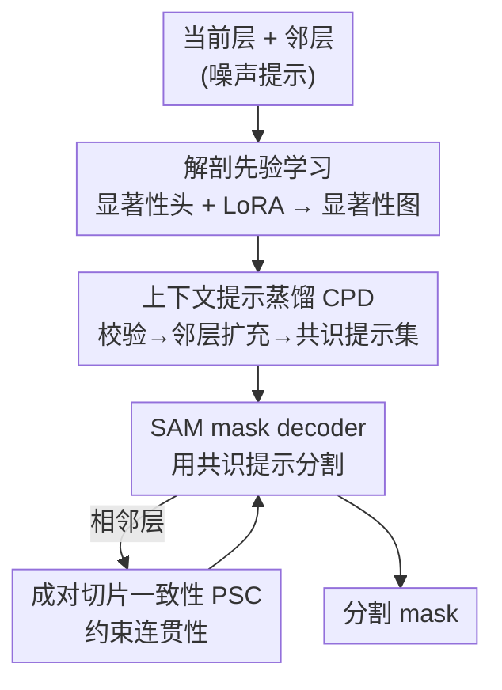

# Learning from Noisy Prompts: Saliency-Guided Prompt Distillation for Robust Segmentation with SAM

**会议**: CVPR 2026  
**arXiv**: [2604.23314](https://arxiv.org/abs/2604.23314)  
**代码**: 无（未公开）  
**领域**: 医学图像 / SAM 适配 / 提示鲁棒性  
**关键词**: 噪声提示, SAM, 显著性蒸馏, 切片一致性, 医学分割  

## 一句话总结
针对临床中只能拿到「中心线点」这类粗糙噪声提示、导致 SAM 分割崩坏的问题，本文提出 SPD：先用轻量显著性头学到可靠的解剖先验，再用「上下文提示蒸馏（CPD）」把当前层和邻层的噪声提示过滤+扩充成共识提示集，并用「成对切片一致性（PSC）」约束相邻层连贯性，在 TI/Scar/FUMPE/KiTS 四个 MRI/CT 数据集上 DSC 大幅领先（TI 上 +11.08%）。

## 研究背景与动机
**领域现状**：把 SAM 这类基础模型迁移到医学图像分割是当前热点，做法从全量微调（MedSAM）、适配器（Medical-SAM-Adapter、SAM-Med2D）到 3D 适配（MA-SAM）、自动提示（AutoSAM）都有。但它们有一个共同前提——假设拿得到精确、任务专属的提示，通常还是从 ground-truth mask 里模拟出来的。

**现有痛点**：真实临床里这个前提不成立。SAM 对提示极度敏感、严格沿着被提示的区域分割，而医生给的标注往往是「中心线点」这种为「整段肠道评估」服务的通用注释，不是为某个下游分割任务（如末端回肠 TI）量身定做的。结果是：有些目标区域没被标到，有些标注点又漂移到相邻解剖结构（中段回肠、近端结肠），把 SAM 带向不完整或错误的 mask。

**核心矛盾**：医学场景里，精确提示的获取成本极高（需要大量领域专业知识），所以「提示质量」和「临床可获得性」之间存在根本张力——能拿到的提示天然是噪声的、泛化的。注意这里的「噪声」专指**推理时输入提示的质量**，训练时仍有 ground-truth mask 可用，属于标准监督适配，而非弱监督。

**切入角度**：作者观察放射科医生的诊断推理过程——他们先对解剖结构形成整体理解再做切片级判断；当单层信息不足时，会翻看相邻层补充证据。这两点正好对应「先建立可靠先验」和「跨层借证据」。

**核心 idea**：用「数据驱动的显著性先验」当裁判，把噪声提示**蒸馏**成可信的共识提示集——既过滤掉漂移到错误解剖的点，又从邻层借来可靠的点补充稀疏区域，从而在不改 SAM 主体的前提下让它在噪声提示下稳健工作。

## 方法详解

### 整体框架
SPD（Saliency-Guided Prompt Distillation）是一个两阶段框架，模拟医生「先建立解剖认知、再跨层借证据」的推理流程。输入是一张当前切片 $I_t$、它的噪声提示集 $P_t$ 以及上下 $2n$ 张邻层及其提示；输出是当前切片的分割 mask $M_t$。

**第一阶段（解剖先验学习）**：在 LoRA 适配的 SAM 编码器特征上挂一个轻量显著性头，用有限的 ground-truth mask 监督，产出高置信度的显著性图 $S_t$，作为「目标大概在哪」的可靠空间参照。训练完即冻结。

**第二阶段（提示引导分割）**：以显著性图为裁判运行 CPD 模块——先用 $S_t$ 校验当前层提示、再从邻层双重校验借入可信提示、合并成共识提示集 $P_t^*$，喂给 SAM mask decoder 出 mask；同时用 PSC 损失约束相邻层预测的连贯性。整个适配通过 LoRA 实现，禁用 LoRA 即可完全还原原始 SAM 推理管线。

### 关键设计

**1. 显著性引导的解剖先验学习：先建立「目标大概在哪」的可信裁判**

直接用稀缺的 ground-truth mask 训一个纯监督分割网络效果不好，但噪声提示又没法直接信任——缺一个中间的、可靠的空间参照。本文在 LoRA 适配的 SAM 编码器上加一个轻量显著性头 $f_\text{sal}$，给定切片 $I_t$ 预测显著性图 $S_t = f_\text{sal}(I_t; \Theta_\text{sal})$，其中 $\Theta_\text{sal}=\{\theta_\text{sal}, \theta_\text{lora}\}$。它用加权 Dice + Focal 损失监督训练：$\mathcal{L}_\text{sal}=\frac{1}{|\mathcal{B}|}\sum_{t}(\lambda_\text{dice}\mathcal{L}_\text{dice}+\lambda_\text{focal}\mathcal{L}_\text{focal})$，Focal（$\gamma=2.0$）专门压低易分背景、强调难分前景以缓解类别不平衡。关键在于这一步的目标**不是**直接解决最终分割，而是学到「粗但可靠」的解剖显著性——后续所有提示过滤都拿它当裁判，所以它不需要精确边界，只需要稳定地圈出目标可能所在的高显著区。LoRA 让编码器在保留预训练知识的同时完成医学域适配

**2. 上下文提示蒸馏 CPD：把噪声提示过滤+借证据，蒸馏成共识提示集**

噪声提示有两个毛病——有些点漂移到错误解剖（要剔），有些层目标区域提示太稀疏甚至缺失（要补）。CPD 用显著性图当裁判，分三步解决。第一步**局部提示校验**：只保留落在高显著区的当前层提示，$\tilde{P}_t^\text{local}=\{p\in P_t \mid S_t(p)>\tau\}$，把漂移到相邻解剖的误导点直接滤掉。第二步**上下文感知扩充**：当本层提示稀疏时，从邻层 $\mathcal{N}_t=\{t\pm i\}$ 收集在**各自上下文中**显著的候选 $\mathcal{P}_\text{cand}=\bigcup_{j}\{p\in P_j \mid S_j(p)>\tau\}$，再拿**当前层**显著性图做第二道校验 $\tilde{P}_t^\text{ctx}=\{p\in \mathcal{P}_\text{cand} \mid S_t(p)>\tau\}$——这个双重校验保证借来的点既在邻层是可靠目标、又确实落在当前层的目标上。第三步**共识集合成**：合并得 $P_t^*=\tilde{P}_t^\text{local}\cup\tilde{P}_t^\text{ctx}$。这一套正是把医生「翻看相邻层补证据」的工作流形式化——用同一个显著性裁判贯穿过滤与扩充，所以扩充进来的点不会引入新噪声

**3. 成对切片一致性 PSC：只约束相邻层、避免全局平滑把误差传开**

体数据分割需要切片间的解剖连续性，尤其在边界模糊的层。一个自然想法是对整卷做链式一致性约束，但那会引入全局平滑、还可能把局部错误沿长距离传播开。PSC 借医生「只参考紧邻层」的习惯，把正则限制在相邻层对 $(M_t, M_{t+1})$ 上，通过最大化两者的软 Dice（转成最小化）来对齐：$\mathcal{L}_\text{psc}(M_t,M_{t+1})=1-\frac{2\sum_i M_{t,i}M_{t+1,i}}{\sum_i M_{t,i}+\sum_i M_{t+1,i}}$，在软概率图上算以保证可微。这样既加强了模糊区的鲁棒性，又保留了卷内自然的解剖变化。值得注意的是消融发现「双向」（同时对齐前后两层）反而略掉点——前后层差异大时会给当前层冲突的约束信号

### 损失函数 / 训练策略
两阶段顺序优化。**阶段一**：训练显著性头 + 编码器 LoRA，最小化 $\mathcal{L}_\text{sal}$（式 1），完成后冻结 $\theta_\text{sal}$ 与 $\theta_\text{lora}$。**阶段二**：固定显著性头和适配编码器，只微调 SAM mask decoder，用 CPD 蒸馏出的共识提示 $P_t^*$ 训练，总损失 $\mathcal{L}_\text{total}=\frac{1}{|\mathcal{B}|}\sum_t(\mathcal{L}_\text{seg}(M_t,G_t)+\lambda_\text{psc}\mathcal{L}_\text{psc}(M_t,M_{t+1}))$，其中 $\mathcal{L}_\text{seg}$ 与 $\mathcal{L}_\text{sal}$ 同型（Dice + Focal）。统一设置：显著性阈值 $\tau=0.5$，上下文层数 $n=2$（共 $2n+1=5$ 层），切片统一 resample 到 $512\times512$。

## 实验关键数据

### 主实验
四个数据集（TI/Scar 为 MRI，FUMPE/KiTS 为 CT）上 SPD 全面领先，下表为 DSC（%）与 HD95 对比（HD95 越低越好）。`*` 表示对所有对比方法统计显著（Wilcoxon 检验 p<0.05）。

| 数据集 | 指标 | 本文 SPD | 之前最好 | 提升 |
|--------|------|----------|----------|------|
| TI | DSC ↑ | 73.58* | 62.50 (SAM-Tuning) | +11.08 |
| TI | HD95 ↓ | 23.94* | 30.22 (nnUNet) | −6.28 |
| Scar | DSC ↑ | 76.42* | 70.05 (SAM-Tuning) | +6.37 |
| Scar | HD95 ↓ | 12.91* | 15.75 (nnUNet) | −2.84 |
| FUMPE | DSC ↑ | 90.84* | 84.26 (nnUNet) | +6.58 |
| KiTS | DSC ↑ | 91.16 | 89.64 (nnUNet) | +1.52 |
| KiTS | HD95 ↓ | 10.12 | 11.38 (nnUNet) | −1.26 |

TI 数据集用的是**真实**临床中心线点（最噪），SPD 提升最大（+11.08% DSC）；对比方法如 SAM-Refiner 在 TI 上因依赖外部粗 mask 反而崩到 27.12% DSC。

### 消融实验
TI 数据集上逐组件消融（Table 2）：

| 配置 | Local | CPD | PSC | DSC (%) | IoU (%) |
|------|-------|-----|-----|---------|---------|
| Baseline（SAM 提示微调） | | | | 62.50 | 55.17 |
| + 仅当前层提示 | ✓ | | | 66.95 | 60.01 |
| + CPD（w/o PSC） | ✓ | ✓ | | 70.32 | 63.20 |
| Ours（全） | ✓ | ✓ | ✓ | 73.58 | 66.22 |

### 关键发现
- **CPD 贡献最大**：从仅当前层提示（66.95）加上 CPD 跨层蒸馏直接跳到 70.32（+3.37），说明「借邻层可靠点补稀疏提示」是主要增益来源；PSC 再添 +3.26 到 73.58，主要改善边界精度与稳定性。
- **共识提示能解锁冻结 SAM**：在完全冻结的 SAM 上，仅换提示来源——共识提示比「用全部原始中心线点」高 14.2% DSC、13.6% IoU，证明问题不在 SAM 本身而在提示质量。
- **单向优于双向 PSC**：「Prev Only / Next Only」都显著优于「No PSC」，但「Bi-directional」反而略降——同时对齐前后层在两层差异大时会产生冲突约束。

## 亮点与洞察
- **重新定义了问题**：把「SAM 在医学里不好用」精确归因到「噪声提示」而非架构或域差异，并区分于「噪声标签学习」（后者是 mask 错，这里是 prompt 不专属）——这个问题刻画本身就是贡献，号称是首个针对噪声提示鲁棒性的方案。
- **用显著性图当「统一裁判」很巧**：同一张 $S_t$ 既过滤本层误导点、又对邻层借入的点做二次校验，一个先验贯穿过滤与扩充两个方向，避免了「补提示时又引入新噪声」的循环问题，这个 trick 可迁移到任何「提示/伪标签需要质量门控」的弱监督场景。
- **即插即用**：禁用 LoRA 即还原原始 SAM，对部署友好；共识提示甚至能直接喂给冻结 SAM 拿到大幅提升，意味着该提示蒸馏思路不绑定特定微调方式。

## 局限与展望
- **依赖阶段一显著性质量**：整个 CPD 都以 $S_t$ 当裁判，若解剖先验学得差（如标注极少、目标极小），过滤与扩充都会失准；作者在 Appendix F 单独分析了这一依赖，但正文未给鲁棒边界。
- **超参敏感性有限讨论**：$\tau=0.5$、$n=2$ 在所有数据集统一固定，未充分展示跨模态/跨器官时是否需要重调；$\tau$ 分析放在附录。
- **两阶段顺序训练**：阶段一冻结后阶段二才训 decoder，先验一旦学偏后续无法纠正，端到端联合优化或先验在线更新是可能改进方向。
- **MRI 数据集为私有**：TI、Scar 均为私有数据，复现与横向比较受限；且部分提升（KiTS +1.52%）未达统计显著。

## 相关工作与启发
- **vs MedSAM / SAM-Tuning / MSA**：它们都假设有精确（常从 GT 模拟的）任务专属提示，面对真实噪声中心线点会被严重误导而过分割；SPD 不假设提示可信，而是先建先验再蒸馏提示，本质是把「提示质量」从前提变成可学习的处理对象。
- **vs SAM-Refiner**：它靠外部粗 mask 来 refine SAM 输出，仍依赖 mask 质量、且空 mask 时无从下手（TI 上崩到 27.12% DSC）；SPD 直接处理提示噪声而非 mask 噪声，是不同层面的鲁棒性。
- **vs SAM2 / MedSAM2（3D 记忆架构）**：它们靠记忆机制做视频/体数据分割，但仍需精确提示初始化；SPD 的 PSC 只做相邻层局部一致性、不强加全局平滑，避免长距离误差传播，作者称在 TI 上 Average/Volumetric Dice 均优于二者。
- **vs 噪声标签学习**：传统方向解决的是「标注 mask 错了」，SPD 解决的是「提示不是为该任务定制的」，两者监督形式与失败模式都不同。

## 评分
- 新颖性: ⭐⭐⭐⭐⭐ 首次把「噪声提示」单独刻画为 SAM 医学适配的核心瓶颈，并给出显著性裁判 + 跨层蒸馏的优雅方案。
- 实验充分度: ⭐⭐⭐⭐ 四个 MRI/CT 数据集 + 与 3D SAM 方法对比 + 完整消融，但部分依赖私有数据、个别提升未达显著。
- 写作质量: ⭐⭐⭐⭐⭐ 问题动机（医生推理类比）讲得清楚，方法公式与流程一一对应，易读。
- 价值: ⭐⭐⭐⭐⭐ 直击真实临床「只有噪声提示可用」的痛点，对基础模型落地有很强实践意义。

<!-- RELATED:START -->

## 相关论文

- [\[CVPR 2026\] SAM for Robust Mitochondria Instance Segmentation in Fluorescence Microscopy](sam_for_robust_mitochondria_instance_segmentation_in_fluorescence_microscopy.md)
- [\[CVPR 2026\] RelativeFlow: Taming Medical Image Denoising Learning with Noisy Reference](relativeflow_taming_medical_image_denoising_learning_with_noisy_reference.md)
- [\[CVPR 2026\] Momentum Memory for Knowledge Distillation in Computational Pathology](momentum_memory_for_knowledge_distillation_in_computational_pathology.md)
- [\[CVPR 2026\] Harmonized Feature Conditioning and Frequency-Prompt Personalization for Multi-Rater Medical Segmentation](harmonized_feature_conditioning_and_frequency-prompt_personalization_for_multi-r.md)
- [\[CVPR 2026\] Unlocking Positive Transfer in Incrementally Learning Surgical Instruments: A Self-reflection Hierarchical Prompt Framework](unlocking_positive_transfer_in_incrementally_learning_surgical_instruments_a_sel.md)

<!-- RELATED:END -->
