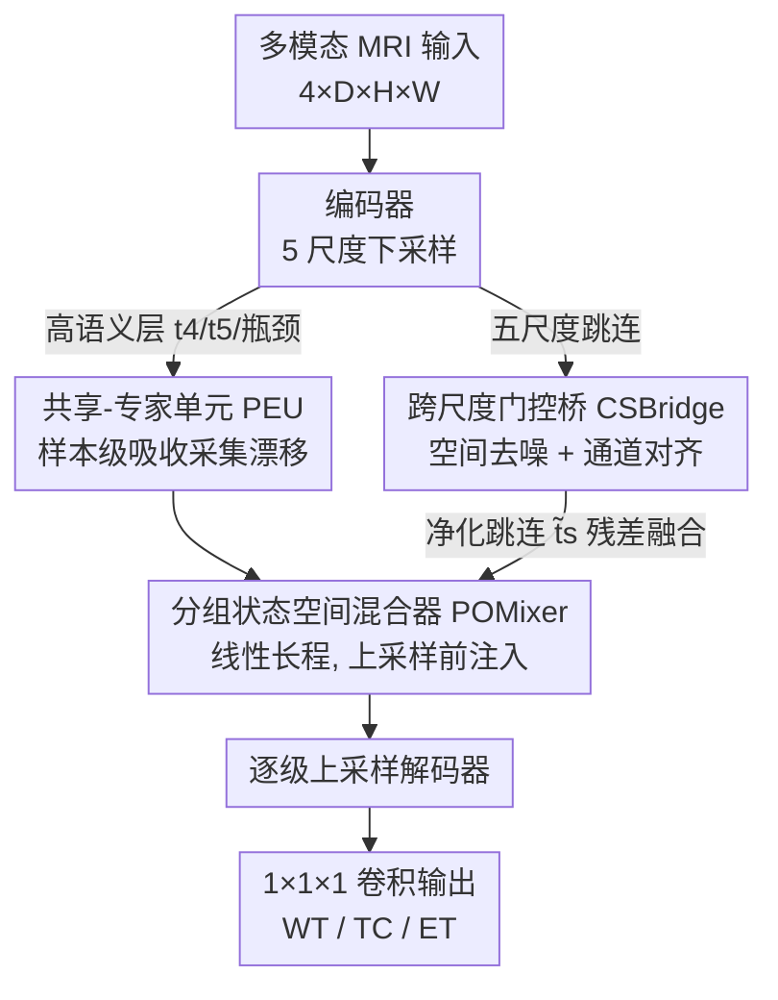

# M4Fuse: Lightweight State-Space MoE with a Cross-Scale Gating Bridge for Brain Tumor Segmentation

**会议**: CVPR 2026  
**arXiv**: [2605.02444](https://arxiv.org/abs/2605.02444)  
**代码**: https://github.com/mh-zhou/M4Fuse (有)  
**领域**: 医学图像 / 3D 分割  
**关键词**: 脑肿瘤分割, 状态空间模型(Mamba), 混合专家(MoE), 轻量化网络, 跳连净化

## 一句话总结
M4Fuse 用「分组状态空间混合器 + 跨尺度双阶段门控桥 + 样本级共享-专家单元」三件套替代盲目加宽网络，在 BraTS2019/2021 上用 **1.11M 参数**（比 SuperLightUnet 少 62.63%）就追平甚至略超重量级 SOTA，并提炼出一条「解码器边际效用」原则：跳连净化后再加宽解码器几乎无收益。

## 研究背景与动机

**领域现状**：3D 多模态脑肿瘤分割（输入 T1/T1ce/T2/FLAIR 四模态，分割 WT/TC/ET 三个区域）的主流做法是 U 形编码器-解码器，近年大量引入 Transformer（UNETR/Swin UNETR）或 Mamba（SegMamba）来建模长程上下文，普遍把输入标准化成 $128\times128\times128$ 的大立方体来喂重型编码器。

**现有痛点**：这类模型既「重」又「脆」。重——注意力在 3D 上是 $\mathcal{O}(L^2C)$ 复杂度，编码器动辄几十 M 参数；脆——增强肿瘤（ET）体积小、边界薄、强对比依赖，对归一化/上采样/跨尺度融合带来的平滑极其敏感，跨中心、跨协议的采集差异又会让跳连传进解码器的特征夹带扫描噪声。

**核心矛盾**：作者观察到端到端架构里**编码器-解码器参数配比是一个高杠杆现象**——编码器过重而解码器无力，会产生解码器无法忠实重建的「表征瓶颈」，浪费编码器容量；反之则早期证据被饿死。盲目在某一侧压缩或在早层硬塞全局模块，往往增加复杂度却换不来精度。

**本文目标**：在极小参数预算（~1M）下同时满足三件事——线性复杂度的长程建模、跨中心鲁棒、可部署轻量化，并且要敢于把输入缩到 $64\times128\times128$（半个体素预算）还不掉点。

**切入角度**：与其「加宽」，不如「把容量放在真正划算的地方」。作者假设：只要把跳连先**空间去噪、再跨尺度通道对齐**，解码器拿到干净证据后就不再需要宽的高语义路径去近似缺失的上下文。

**核心 idea**：用「分组 SSM 做线性长程 + 门控桥净化对齐跳连 + 仅在高语义低分辨率层放样本级专家」的协同设计，替代深度扩张和解码器加宽。

## 方法详解

### 整体框架
M4Fuse 是一个轻量 U 形骨干：输入 $x\in\mathbb{R}^{B\times C\times D\times H\times W}$（BraTS 上 $C=4$），编码器逐级下采样产出五个尺度特征 $\{t_s\}_{s=1}^5$ 与瓶颈 $b$。三个核心组件各司其职：**PEU（共享-专家单元）**只挂在高语义低分辨率层（$t_4,t_5,b$），吸收跨中心采集漂移；**CSBridge（跨尺度双阶段门控桥）**一次性把五个尺度的跳连 $\{t_s\}$ 净化对齐成 $\{\tilde t_s\}$；**POMixer（分组状态空间混合器）**在解码每一级上采样之前注入线性时间的全局上下文。解码器从 $b$ 出发经三级 $d_1,d_2,d_3$，每级「先混合、再上采、再与匹配分辨率的净化跳连残差融合」（$d_1\!\leftrightarrow\!\tilde t_5$、$d_2\!\leftrightarrow\!\tilde t_4$、$d_3\!\leftrightarrow\!\tilde t_3$），最后 $1\times1\times1$ 卷积出分割 logits。

### 关键设计

**1. POMixer 分组状态空间混合器：用线性复杂度补上长程上下文，又不丢局部线索**

注意力在 3D 体素上是 $\mathcal{O}(L^2C)$（$L=DHW$ 可达百万级），直接用于高分辨率路径不现实。POMixer 把 3D 张量按固定光栅顺序展平成长度 $L$ 的序列 $X\in\mathbb{R}^{B\times L\times C}$，沿通道轴切成 $g=4$ 个等宽分组 $X^{(j)}$，**每组独立跑一个离散状态空间模型（Mamba 式扫描）**：$h^{(j)}_{k+1}=\bar A^{(j)}h^{(j)}_k+\bar B^{(j)}X^{(j)}_k,\ Y^{(j)}_k=C^{(j)}h^{(j)}_k$，其中 $\bar A^{(j)}=\exp(A^{(j)}\Delta)$ 由连续系统离散化得到。每组扫描成本仅 $\mathcal{O}(LC/g)$，整体对 $L$ **线性**。分组的好处是不同通道子空间各扫各的，既保留局部体素顺序又能传远距离依赖。

为防止窄宽度下响应消失/爆炸，作者加了一个**可学非负残差尺度** $s$：$Z^{(j)}=\mathrm{SSM}(X^{(j)})+sX^{(j)}$，并配合 LayerNorm 给出范数有界性证明（当 $\rho(\bar A^{(j)})\le1$ 时序列范数受控）。POMixer 被插在 $t_4,t_5,b$ 以及每个解码级上采样之前，让重建路径全程带着全局信息

**2. CSBridge 跨尺度双阶段门控桥：跳连先空间去噪、再跨尺度通道对齐，把脏证据洗干净**

跳连虽传细节，却也把模态特异噪声和扫描伪影一并送进解码器；这正是「先加 Mamba 反而掉点」的根因——长程建模会放大未标准化跳连里的跨中心噪声。CSBridge 分两阶段处理：**空间阶段**对每个尺度 $t_s$ 做通道平均/最大拼接后过 $7^3$ 卷积得空间注意力 $a_s=\sigma(\mathrm{Conv}_7([\mathrm{Avg},\mathrm{Max}]))$，得到去噪后的 $t_s^{\mathrm{sp}}=a_s\odot t_s$；**通道阶段**把全部五尺度的 GAP 统计 $z_s$ 拼成 $z\in\mathbb{R}^{B\times C_\Sigma}$，再为每个尺度生成跨尺度通道门 $g_s=\sigma(zW_s+b_s)$——关键在于一个尺度的通道权重由**所有尺度的全局统计**决定，实现真正的「跨尺度」对齐而非单尺度自门控。

两阶段用两个非负可学标量 $\alpha,\beta$ 残差融合：$\hat t_s=t_s+\alpha\,t_s^{\mathrm{sp}}+\beta\,(g_s\odot t_s^{\mathrm{sp}})$，并证明 $\|\hat t_s\|\le(1+\alpha+\beta)\|t_s\|$ 有界。这样解码器拿到的是「干净且跨尺度一致」的跳连，是后续「解码器边际效用」原则成立的前提

**3. PEU 共享-专家单元：样本级专家只放高语义层，吸收跨中心漂移又不污染早期特征**

不同医院/协议的采集统计有别，单一共享路径常欠拟合，全专精网络又太重。PEU 用「共享分支 + 专家分支」的紧凑设计：对样本 $i$，$\mathrm{PEU}(u_i)=f_{\mathrm{sh}}(u_i)+f_{\pi(u_i)}(u_i)$，其中 $\pi(u_i)$ 是 **top-1 专家索引、可直接由数据集 ID 指派**（无需学路由器，省掉专家坍塌/负载不均的麻烦）。专家被**严格限制在 $t_4,t_5,b$ 三个高语义低分辨率层**——这是刻意为之：在早层放专家会把低级特征拉向站点特异统计、破坏泛化，而高语义层体素少，专家开销小，参数随专家数 $M$ **线性增长**可控。

工程上为稳梯度，用「批维拼接 + dropout」代替原地赋值：$\mathrm{PEU}(u)=\mathrm{Dropout}_p(f_{\mathrm{sh}}(u)+\mathrm{concat}_i(f_{\pi(u_i)}(u_i)))$。消融显示 top-1 优于 top-2/Gumbel，因为域线索是样本特异的，同时激活多专家只会引入互相干扰

### 损失函数 / 训练策略
损失为 Dice Loss 与 Cross-Entropy Loss 的 **7:3 加权组合**。优化器 AdamW，初始学习率 1e-4、权重衰减 1e-5、cosine annealing 退火到 1e-6，batch size 2。BraTS2019 训练 200 epoch + patience=80 早停（监控总 Dice），BraTS2021 训练 300 epoch；用 AMP 梯度缩放 + TF32 加速，推理阶段加 TTA。BraTS2019 随机裁到 $128^3$（IRS=2.09M），BraTS2021 裁到 $64\times128\times128$（IRS=1.04M）。

## 实验关键数据

### 主实验
BraTS2019 用 5 折交叉验证（Top-k=2，IRS=2.09M），BraTS2021 用 6:2:2 划分（Top-k=1，IRS=1.04M）。下表为 M4Fuse-B（基准配置）对比：

| 数据集 | 指标 | M4Fuse-B | 对比 SOTA | 结果 |
|--------|------|----------|-----------|------|
| BraTS2019 (128³) | Avg Dice↑ | **82.38%** | SegMamba 82.35% | +0.03%，且 HD95 最优 4.51 |
| BraTS2021 (64×128×128) | Avg Dice↑ | **88.79%** | SuperLightUnet 88.70% | +0.09% |
| 参数量 | Params↓ | **1.11M** | SuperLightUnet 2.97M | **−62.63%** |
| 参数量 | Params↓ | 1.11M | SegMamba 66.85M | −98.3% |

BraTS2019 三区域细分：WT 89.31 / TC 82.69 / ET 75.16；HD95 分别 4.14 / 4.46 / 4.75。即用半个体素预算（64×128×128）匹敌他人 128³ 的成绩。

### 消融实验

**模块逐步累加（Table 3，BraTS2019）：**

| 配置 | Params | Dice↑ | HD95↓ | 说明 |
|------|--------|-------|-------|------|
| CNN 基线 (E2E-1Fuse) | 0.01M | 75.42 | 9.48 | 纯 U 形 CNN |
| +PEU (MoE) | 0.60M | 80.12 | 5.87 | 加样本级专家，Dice +4.7 |
| +POM (Mamba) 但无 CSB | 0.97M | 75.46 | 6.10 | **反而掉回 75.46**：长程放大脏跳连噪声 |
| +CSB 全模型 | 1.23M | **82.38** | **4.51** | 净化跳连后全局建模才生效 |

**解码器宽度扫描（Table 5，验证「边际效用」原则）：**

| 跳连类型 | 宽度 α | Params | Dice↑ |
|----------|--------|--------|-------|
| 原始跳连 (w/o CSB) | 0.5→2.0 | 0.76→2.00M | 80.32→**84.28**（加宽持续涨）|
| 净化跳连 (with CSB) | 0.5→2.0 | 1.02→2.26M | 81.95→84.83→**81.66**（先涨后跌）|

### 关键发现
- **CSB 是「解锁」组件**：单独加 Mamba（POM）Dice 从 80.12 掉到 75.46，说明长程建模会放大未净化跳连里的跨站点噪声；只有先净化对齐，全局建模才把 Dice 抬到 82.38——三件套是协同而非可叠加。
- **解码器边际效用原则**：原始脏跳连下加宽解码器持续涨点（80.32→84.28），但净化跳连后加宽边际收益递减甚至变负（84.83→81.66），这解释了为何更大的 M4Fuse-L 平均不超基准 M4Fuse-B，且可能损害对比敏感的 ET。
- **专家 top-1 > top-2**：top-1 Softmax 门控 81.09 Dice，top-2 掉到 75.54，Gumbel-softmax 75.59——域线索样本特异，多专家同时激活只引入干扰。
- **融合粒度**：像素/token 级融合（81.02–81.14）保边界，纯通道级（SE）过平滑掉到 77.50。

## 亮点与洞察
- **「净化优先于全局」的因果链讲得透**：先加 Mamba 掉点、再加桥涨点这组对照，把「跳连脏 → 长程放大噪声 → 必须先净化」的机制坐实，是全文最有说服力的「know-why」证据，而不是堆模块。
- **专家用数据集 ID 直接指派、不学路由器**：绕开了 MoE 经典的专家坍塌、负载不均、额外延迟问题，参数随专家数线性可控——在医学跨中心场景里这种「弱监督式路由」很实用，可迁移到任意有明确域标签的任务。
- **敢缩输入到半立方体**：$64\times128\times128$ 还不掉点，直接挑战了「3D 分割必须 $128^3$」的惯例，对显存受限的临床部署是实在的红利。
- **解码器边际效用原则可复用**：它提醒做轻量化时别无脑加宽解码器，而要先问「跳连干净了吗」——这是个可迁移到其他 U 形分割任务的设计准则。

## 局限与展望
- **路由依赖数据集 ID**：top-1 专家靠人工/数据集标识指派，没有学习式路由；当部署遇到训练时未见的新中心、且无可用 ID 时，如何自动选专家是开放问题（作者也把「automatic routing cues」列为 future work）。
- **仅在 BraTS 两个数据集验证**：都是脑肿瘤 MRI，跨器官/跨模态（如 CT、病理）的普适性未知；「解码器边际效用」是否在 ET 之外的小结构上同样成立有待验证。
- **数字上的「超越」很微弱**：BraTS2019 仅比 SegMamba 高 0.03%、BraTS2021 比 SuperLightUnet 高 0.09%，统计显著性存疑 ⚠️；真正卖点其实是「同精度下参数砍 62.63%」而非精度领先。
- **SSM 超参对细结构敏感性未厘清**：作者自承尚未说明状态空间参数如何影响 ET 这类细微结构的敏感度。

## 相关工作与启发
- **vs SegMamba**：两者都用状态空间做线性长程，但 SegMamba 是 66.85M 的重型编码器、把 SSM 当骨干主力；M4Fuse 只把分组 SSM 当「上采样前的全局注入」，且强调先净化跳连再用 SSM——同样 82.3+ Dice，参数差近 60 倍。
- **vs SuperLightUnet**：都走极致轻量路线，但 SuperLightUnet（2.97M）靠组装即插即用模块（Mobile 编码器 + FLD 解码器）做表层瘦身，参数分布失衡（编码器占 91%）；M4Fuse 把机制内嵌进 UNet，编码/解码/桥三者均衡（约 48%/30%/21%），用 1.11M 实现更平衡的瘦身。
- **vs 常规 MoE 分割**：常规 MoE 学路由、易坍塌/负载不均，且常在所有层放专家；M4Fuse 用数据集 ID 指派 top-1、只在高语义层放专家，规避了这些痛点，是「约束式 MoE」的一个干净范例。

## 评分
- 新颖性: ⭐⭐⭐⭐ 三件套组件不算全新（SSM/空间通道注意力/MoE 都有先例），但「净化优先于全局」的因果论证 + 解码器边际效用原则有洞见。
- 实验充分度: ⭐⭐⭐⭐ 模块累加、解码器宽度扫描、路由/粒度/尺度消融都做了，因果对照清晰；但只两个 BraTS 数据集、精度优势微弱。
- 写作质量: ⭐⭐⭐ 方法和算法伪代码完整、公式严谨，但部分自造术语（IRS、PMRatio、Cycle-LiqBE）晦涩、表格排版混乱。
- 价值: ⭐⭐⭐⭐ 1.11M 参数 + 半立方体输入对临床轻量部署很实用，设计原则可迁移。

<!-- RELATED:START -->

## 相关论文

- [\[CVPR 2026\] PGR-Net: Prior-Guided ROI Reasoning Network for Brain Tumor MRI Segmentation](pgr-net_prior-guided_roi_reasoning_network_for_brain_tumor_mri_segmentation.md)
- [\[CVPR 2026\] Uni-Encoder Meets Multi-Encoders: Representation Before Fusion for Brain Tumor Segmentation with Missing Modalities](uni-encoder_meets_multi-encoders_representation_before_fusion_for_brain_tumor_se.md)
- [\[CVPR 2026\] Federated Modality-specific Encoders and Partially Personalized Fusion Decoder for Multimodal Brain Tumor Segmentation](federated_modality-specific_encoders_and_partially_personalized_fusion_decoder_f.md)
- [\[CVPR 2026\] Diffusion-Based Feature Denoising and Using NNMF for Robust Brain Tumor Classification](diffusion-based_feature_denoising_and_using_nnmf_for_robust_brain_tumor_classifi.md)
- [\[CVPR 2026\] T-Gated Adapter: A Lightweight Temporal Adapter for Vision-Language Medical Segmentation](t-gated_adapter_a_lightweight_temporal_adapter_for_vision-language_medical_segme.md)

<!-- RELATED:END -->
