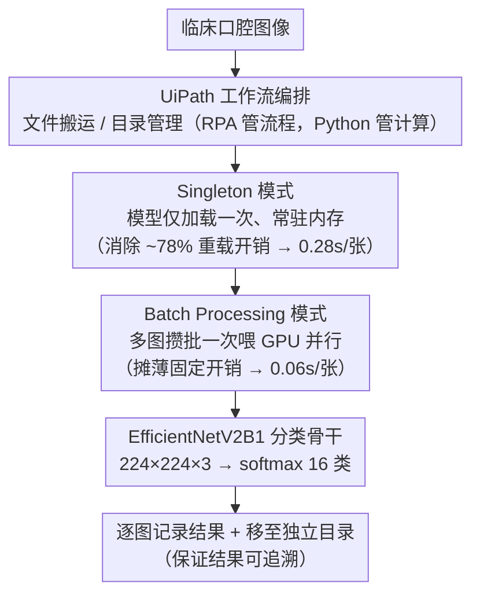

# Novel Architecture of RPA In Oral Cancer Lesion Detection

**会议**: CVPR 2026  
**arXiv**: [2603.10928](https://arxiv.org/abs/2603.10928)  
**代码**: 无  
**领域**: 医学图像 / 口腔癌检测  
**关键词**: 口腔癌检测, RPA自动化, EfficientNetV2, 设计模式, CNN分类

## 一句话总结

将软件设计模式（Singleton + Batch Processing）集成到基于 EfficientNetV2B1 的口腔癌病变检测 Python 流水线中，相比传统 RPA 平台（UiPath/Automation Anywhere）实现 60-100x 推理加速（每张图 0.06s vs 2.58s），同时保持诊断准确性。

## 研究背景与动机

**领域现状**：口腔癌早期检测对患者生存率至关重要。RPA（机器人流程自动化）已被引入医疗领域自动化重复性工作流，如图像处理、实验数据管理和患者数据分析。UiPath、Automation Anywhere 等低代码 RPA 平台提供了易用的工作流编排能力。

**现有痛点**：(1) 传统 RPA 平台在计算密集型 AI 推理场景下效率极低——约 78% 的处理时间用于模型重复加载、活动切换和数据序列化，仅 22% 用于实际推理；(2) 低代码环境天然不支持 GPU 批处理和模型缓存，串行图像处理导致严重瓶颈；(3) 计算资源利用率低，临床高通量场景下成本和延迟不可接受。

**核心矛盾**：RPA 平台的工作流编排优势与其计算效率劣势之间的矛盾——需要在保持自动化流程管理的同时大幅提升推理效率。

**本文目标** 通过软件工程设计模式优化 Python 推理流水线，在保持 RPA 工作流编排优势的同时实现高效推理。

**切入角度**：将 Singleton（模型单次加载）和 Batch Processing（批量推理）设计模式引入 AI 临床部署流水线。

**核心 idea**：Singleton 消除模型重复加载开销 + Batch Processing 利用 GPU 并行计算 = 60-100x 加速。

## 方法详解

### 整体框架

这篇论文要解决的不是「怎么把口腔癌分得更准」，而是「怎么把一个已经训好的 CNN 部署到临床 RPA 流水线里、让它跑得足够快」。作者把同一个分类模型放进两条流水线里做对照：OC-RPAv1 是朴素的 Python 实现，图像一张张读、一张张推；OC-RPAv2 在它之上做软件工程优化，把模型加载和推理两件事拆开、再把图像攒成批一起算。整条链路仍由 UiPath 负责文件搬运、目录管理这类工作流编排，真正吃算力的推理则交给 Python 函数——RPA 管"流程"，Python 管"计算"。三个设计点里前两个针对部署效率，第三个交代被部署的模型本身。

### 关键设计

**1. Singleton 模式：把"每次预测都重载一遍模型"砍掉**

传统 RPA 平台最大的浪费在于，工作流里每触发一次预测活动，就把 CNN 重新实例化、权重重新从磁盘读进来——作者测得模型加载与数据序列化这类非推理开销吃掉了约 78% 的总时间，真正在算的只有 22%。Singleton 模式的做法是让模型在整个流程生命周期里只被实例化一次、之后常驻内存，把"加载"从"推理"里彻底解耦出来：第一张图触发加载，后面所有图直接复用同一个内存中的模型对象。正因为重复加载是那个 78% 里的大头，单这一刀就把每张图的耗时从 RPA 平台的 2.58s 压到 0.28s（约 9.2x），是全文性价比最高的单点优化。

**2. Batch Processing 模式：让 GPU 一次算一批而不是一张**

模型不再重载之后，下一个瓶颈是逐张推理本身——每张图单独走一遍前向，GPU 的 kernel 启动和主机↔显存的数据搬运开销被重复付了 N 次，并行算力大量闲置。Batch Processing 把多张图攒成一个 batch 一次性喂进模型，让这些固定开销摊薄到整批上，把 GPU 的并行能力真正用起来。为了在批量化的同时不丢数据，每张图推理完会立刻记录结果并移到独立目录，保证临床场景下结果可追溯。这一步建立在 Singleton 之上（先得有常驻模型才谈得上批量喂数据），把每张图从 v1 的 0.28s 再压到 v2 的 0.06s，相对 v1 又快约 4.7x。

**3. EfficientNetV2B1 分类骨干：被部署的那个模型**

效率优化的对象是一个标准的 16 类口腔病变分类器，本身没有架构创新。它以 ImageNet 预训练的 EfficientNetV2B1 为骨干，输入 $224\times224\times3$，末端换成 softmax 全连接层输出 16 类。训练分两阶段：先冻结 backbone 训 15 个 epoch（$\text{lr}=10^{-3}$）让新分类头收敛，再部分解冻做 fine-tune 训 10 个 epoch（$\text{lr}=10^{-5}$）微调特征。数据是约 3000 张口腔临床图像，按 Healthy / Benign / OPMD / Oral Cancer 四大类细分成 16 个子类；用 Albumentations 做 5 种增强，对样本不足 200 的类别再随机复制以缓解长尾。

### 损失函数 / 训练策略

- 损失函数：Categorical cross-entropy
- 优化器：Adam，batch size=32
- 数据划分：分层采样 70%/15%/15%
- 训练技巧：Early stopping、模型检查点（保存最佳验证精度）、ReduceLROnPlateau（loss 停滞时学习率减半）

## 实验关键数据

### 主实验（31 张测试图推理效率对比）

| 平台/方法 | 31张图总耗时 | 平均每张耗时 | 相对加速比 |
|-----------|------------|-------------|-----------|
| UiPath | 80 s | 2.58 s | 1x（基线） |
| Automation Anywhere | 75 s | 2.42 s | 1.07x |
| OC-RPAv1（Python 基础） | 8.65 s | 0.28 s | 9.2x |
| **OC-RPAv2（Python+设计模式）** | **1.96 s** | **0.06 s** | **43x** |

### 消融/效率分析

| 分析维度 | 关键数据 | 说明 |
|---------|---------|------|
| RPA 平台开销分析 | ~78% 用于非推理操作 | 模型加载/数据序列化是主要瓶颈 |
| Singleton 贡献 | v1(0.28s) vs RPA(2.58s) | 消除重复加载实现 9.2x 加速 |
| Batch Processing 贡献 | v2(0.06s) vs v1(0.28s) | GPU 并行进一步 4.7x 加速 |
| 规模化估算 | 2500张：UiPath 需 1.8h，v2 不到 3min | 40x 运营效率提升 |

### 关键发现

- RPA 平台在计算密集任务上效率极低，大部分时间消耗在非推理开销上
- Singleton 模式消除模型重复加载是最大的性能提升来源（~9x）
- 设计模式的引入不影响诊断准确性，仅优化执行效率
- Python 计算 + RPA 流程编排的混合方案是最佳实践

## 亮点与洞察

- 首次系统性量化传统 RPA 平台在 AI 推理场景下的效率瓶颈（78% 开销用于非推理）
- 将 Singleton 和 Batch Processing 设计模式引入 RPA 医学图像分析流水线
- 提供了 RPA + Python 混合自动化的可复用模式
- 结论简单但实用：AI 模型的临床部署中，工程优化的价值可能不亚于算法改进

## 局限与展望

- **数据规模极小**：仅 31 张测试图像，统计说服力严重不足
- **缺乏准确性对比**：未报告分类准确率/精度/召回率等指标，缺少不同方法间的诊断性能对比
- **模型本身无创新**：直接使用 EfficientNetV2B1，无架构改进或针对口腔病变的适配
- **写作质量不高**：结构松散，存在重复段落，部分引用不够严谨
- **临床深度不足**：仅关注推理速度，未涉及可解释性、不确定性量化等临床关键需求
- 未来可探索 Factory/Adapter/Observer 等更多设计模式的集成

## 相关工作与启发

- **vs Abdellaif et al. (LMV-RPA)**：LMV-RPA 也探索了 Python 增强 RPA 的思路，本文进一步量化了设计模式的加速效果（60-100x）
- **vs CLASEG 框架**：CLASEG 提供了口腔病变多分类+分割的深度学习基线，本文直接复用其模型架构
- **本质定位**：这是软件工程实践（设计模式）在 AI 部署场景的应用研究，而非算法创新
- **启发**：临床 AI 系统的实用化不仅需要模型精度，更需要工程层面的高效部署——Singleton 和 Batch Processing 是最基本但最有效的优化

## 评分

⭐⭐ (2/5)

- **新颖性** ⭐⭐：将已有设计模式应用于 RPA 流水线，算法层面无创新
- **实验充分度** ⭐⭐：测试规模极小（31张），缺乏准确性指标对比
- **写作质量** ⭐⭐：结构松散，重复段落较多，部分引用不规范
- **价值** ⭐⭐⭐：对 AI 临床部署的工程实践有参考意义，但学术贡献有限

<!-- RELATED:START -->

## 相关论文

- [\[CVPR 2026\] Instruction-Guided Lesion Segmentation for Chest X-rays with Automatically Generated Large-Scale Dataset](instruction-guided_lesion_segmentation_for_chest_x-rays_with_automatically_gener.md)
- [\[CVPR 2026\] The Invisible Gorilla Effect in Out-of-distribution Detection](the_invisible_gorilla_effect_in_out-of-distribution_detection.md)
- [\[CVPR 2026\] Association of Radiologic PPFE Change with Mortality in Lung Cancer Screening Cohorts](association_of_radiologic_ppfe_change_with_mortali.md)
- [\[CVPR 2026\] Event-Level Detection of Surgical Instrument Handovers in Videos](event_level_detection_of_surgical_instrument_handovers_in_videos.md)
- [\[CVPR 2026\] Synergistic Bleeding Region and Point Detection in Laparoscopic Surgical Videos](synergistic_bleeding_region_and_point_detection_in_laparoscopic_surgical_videos.md)

<!-- RELATED:END -->
