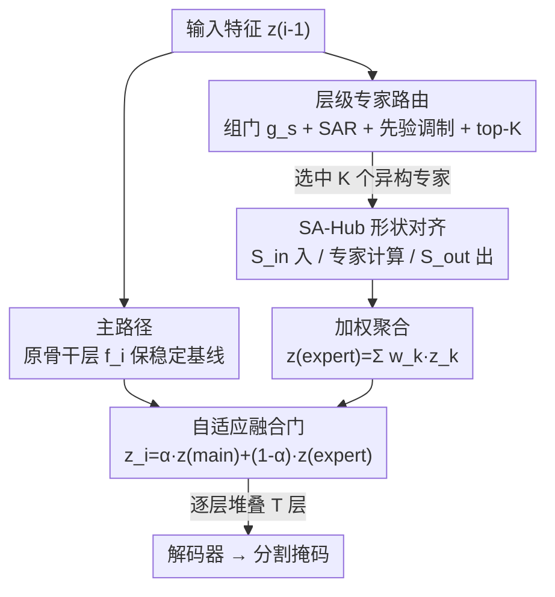

# SAGE: Shape-Adapting Gated Experts for Adaptive Histopathology Image Segmentation

**会议**: CVPR 2026  
**arXiv**: [2511.18493](https://arxiv.org/abs/2511.18493)  
**代码**: https://oxyzgiahuy.github.io/sage/ (项目主页)  
**领域**: 医学图像  
**关键词**: 组织病理分割, 动态专家路由, 稀疏MoE, CNN-Transformer混合, 形状自适应

## 一句话总结
SAGE 把一个静态的 CNN-Transformer 混合骨干网"原地"改造成可按输入动态路由的稀疏专家架构——用主路径保稳定、专家路径做按需精修，再用层级路由器和形状自适应枢纽（SA-Hub）让 CNN/Transformer 异构专家能混合协作，在 EBHI / GlaS / DigestPath 三个结直肠组织病理分割基准上把 Dice 推到 95.23% / 92.78% / 91.26%（WSI 级）。

## 研究背景与动机
**领域现状**：千兆像素全切片图像（WSI）的癌组织分割是数字病理的核心。主流做法是 CNN-Transformer 混合 U-Net（TransUNet、Swin-UNet、SegFormer 等）——CNN 擅长捕捉细胞边界、纹理这类局部细节，Transformer 擅长建模长程依赖和全局上下文，把两者拼起来既要局部精度又要全局推理。

**现有痛点**：这些混合模型用的是**静态计算图**——所有输入块都走同一套固定的算子序列，不管这块组织是均匀的正常组织还是结构复杂、纹理微妙的恶性区域。结果就是简单区域被"过度处理"、复杂区域又"建模不足"。同时 CNN 块和 Transformer 块之间只有单向、固定的融合方式，没法根据当前输入的特性去动态决定"该让谁算、怎么算"。

**核心矛盾**：组织形态的剧烈异质性（细胞大小、形状差异极大）和固定计算路径之间存在根本冲突——一套写死的处理流程既无法对不同形态自适应，又在简单样本上浪费算力。现有 MoE 分割（如 MoE-NuSeg）虽引入条件计算，但大多在 token/空间粒度上路由，缺少**沿深度（layer 级）的自适应控制**，更没有解决"CNN 特征图与 Transformer token 序列格式不兼容、异构专家没法混着用"的问题。

**本文目标**：(1) 让混合骨干能按输入自适应地决定激活哪些层/专家；(2) 在不大幅增参的前提下做到；(3) 让 CNN 和 Transformer 专家能在同一个路由层里混合执行。

**切入角度**：借鉴 MoLEx"把网络层本身当专家、沿深度路由"的思路，并进一步引入**层级化（group-aware）路由**和**异构专家间的形状自适应交互**。把已预训练的骨干层"升级回收"（upcycling）成专家，参数复用而非新建，从而几乎不增参。

**核心 idea**：用"主路径（保骨干）+ 稀疏专家路径（按需精修）+ 可学习门控融合"的双路结构，把任意静态骨干重参数化成输入自适应的动态专家网络；再用一个轻量的形状枢纽抹平 CNN/Transformer 的张量格式差异，让异构专家能被同一个路由器自由调度。

## 方法详解

### 整体框架
SAGE 不重新设计网络，而是把一个固定骨干（如 ConvNeXt + ViT）的**每一层 $i$** 从"单一确定性变换"改写成一个**双路 SAGE 块**。给定上一层特征 $\mathbf{z}_{i-1}$：主路径照常跑原骨干层 $f_i(\cdot)$ 得到稳定基线特征 $\mathbf{z}_i^{(\text{main})}=f_i(\mathbf{z}_{i-1})$；专家路径则把同一个输入交给一个**层级路由器**，由它从一个全局专家池里稀疏地选出 top-$K$ 个专家（专家就是被复用的预训练骨干层本身），算出加权后的精修特征 $\mathbf{z}_i^{(\text{expert})}$；最后用一个可学习标量门 $\alpha_i$ 把两路融合。由于专家是异构的（有的是 CNN 块、有的是 Transformer 块），中间还要插一个 **SA-Hub** 在专家执行前后做格式对齐。训练在 patch 上做，部署时用滑窗重建拼回整张 WSI。

整条流水线如下：

### 关键设计

**1. 双路 SAGE 块：主路径锚定稳定、专家路径按需精修，用可学习门动态平衡**

针对"静态计算图对所有输入一视同仁"的痛点，SAGE 在每层并行开两条路。主路径就是原骨干变换 $\mathbf{z}_i^{(\text{main})}=f_i(\mathbf{z}_{i-1})$，它锚定优化、保留 CNN/Transformer 的归纳偏置和预训练初始化，相当于一个"不会跑偏的底座"。专家路径采用 MoLEx 式的**稀疏 upcycling**——专家不是新建的子网络，而是**复用预训练骨干层本身**，路由器每次只激活其中一小撮（top-$K$），加权聚合成 $\mathbf{z}_i^{(\text{expert})}$。两路通过一个可学习标量门融合：

$$\mathbf{z}_i = \alpha_i\cdot\mathbf{z}_i^{(\text{main})} + (1-\alpha_i)\cdot\mathbf{z}_i^{(\text{expert})},\quad \alpha_i=\sigma(\theta_i)$$

其中 $\alpha_i$ 由可学习参数 $\theta_i$ 经 sigmoid 得到。当专家精修有益时 $\alpha_i$ 偏小、放更多权重给专家；不需要时 $\alpha_i$ 偏大、退回骨干的稳定行为。专家池本身又分**细粒度专家** $\mathcal{E}_{\text{fine}}$（负责深度特化）和**共享专家** $\mathcal{E}_{\text{shared}}$（负责领域可泛化的计算），但两类都是复用的骨干层，所以参数几乎不涨。这种"复用骨干层当专家"的做法是它只增 5.5% 参数就能做条件计算的关键。

**2. 层级专家路由：组门先定"偏好哪一类"，再在 logit 上做先验调制后 top-K 选专家**

普通稀疏 MoE 只有一个路由阶段、一次性决定激活哪些专家，无法表达"这块输入到底更需要通用计算还是深度特化"。SAGE 把路由拆成两级。第一级是**组级门控**（Group-Level Gating）：用全局池化后的表示 $\bar{\mathbf{z}}_{i-1}$ 算一个标量门 $g_s=\sigma(\bar{\mathbf{z}}_{i-1}\mathbf{W}_{\text{gate}}^{(i)}+b_{\text{gate}}^{(i)})\in(0,1)$，$g_s$ 高表示偏好共享专家、低表示偏好细粒度专家。第二级是**语义亲和路由（SAR）**：用一个类注意力的打分 $\mathbf{L}_i=\frac{(\bar{\mathbf{z}}_{i-1}\mathbf{W}_Q^{(i)})(\mathbf{K}^{(i)})^\top}{\sqrt{d_k}}+\text{sp}(\bar{\mathbf{z}}_{i-1}\mathbf{W}_{\text{noise}}^{(i)})\odot\boldsymbol{\epsilon}^{(i)}$ 给每个专家算基础 logit，第一项捕捉 query 与"专家键"$\mathbf{K}^{(i)}$ 的语义亲和度，第二项加 softplus 调制的高斯噪声做随机探索、防止专家过度特化。

关键的耦合在于**先验引导的 logit 调制**：用二值掩码 $\mathbf{m}_s$ 标记共享专家，把组级偏好以对数形式注入基础 logit：

$$\mathbf{L}'_i = \mathbf{L}_i + \mathbf{m}_s\log(g_s) + (\mathbf{1}-\mathbf{m}_s)\log(1-g_s)$$

$g_s$ 高时共享专家 logit 被抬高、低时细粒度专家被抬高，但**并不强制共享专家永远激活**——它们仍要经过同一套 top-$K$ 竞争。选出 $\mathcal{K}=\text{TopK}(\mathbf{L}'_i,K)$ 后，用**独立 sigmoid 门**（而非 softmax）给每个选中专家打权重 $w_j=\sigma((\mathbf{L}'_i)_j)\cdot\mathbf{1}[j\in\mathcal{K}]$。用 sigmoid 而非 softmax，是为了让多个专家能**各自独立激活**、不被 simplex 归一化绑在一起相互压制。这套"组偏好 + logit 先验 + top-K sigmoid"组合，既决定了"偏好谁"也决定了"最终执行谁"。

**3. 形状自适应枢纽 SA-Hub：抹平 CNN 特征图与 Transformer token 的格式差，让异构专家能混着路由**

要在同一个路由层里同时调度 CNN 专家（特征图 $(B,C,H,W)$）和 Transformer 专家（token 序列 $(B,N,D)$），必须先解决张量格式不兼容。SA-Hub 是一个轻量可学习模块，由输入适配器 $S_{\text{in}}$ 和输出适配器 $S_{\text{out}}$ 组成，根据"源特征类型 $\tau(\mathbf{x})$"和"目标专家类型 $\tau(e_k)$"做**格式感知的双向转换**：源是 CNN、目标是 Transformer 时走 $\mathcal{A}_{C\to D}(\mathcal{F}_{\text{tokenize}}(\mathbf{x}))$（先 tokenize 再做通道→token 嵌入投影）；反之走 $\mathcal{F}_{\text{detokenize}}(\mathcal{A}_{D\to C}(\mathbf{x}))$（必要时插值重建空间布局）；类型相同时只做恒等投影 $\mathcal{A}(\mathbf{x})$。专家算完后，$S_{\text{out}}$ 做逆变换并**强制对齐回主路径** $\mathbf{z}_i^{(\text{main})}$ 的空间分辨率和通道数，保证融合时形状一致：

$$\mathbf{z}_i^{(\text{expert})} = \sum_{k\in\mathcal{K}} w_k\cdot S_{\text{out}}\big(e_k(S_{\text{in}}(\mathbf{z}_{i-1},e_k)),\,\mathbf{z}_i^{(\text{main})}\big)$$

实现上 SA-Hub 维护一个常见维度转换的**预初始化适配器注册表**，复用以降低运行时开销，同时保持端到端可微。正是 SA-Hub 让"CNN 和 Transformer 专家共享一个路由器、不必统一原生张量格式"成为可能——这是把异构骨干改成统一专家池的那块缺失拼图。

### 损失函数 / 训练策略
总损失 $\mathcal{L}_{\text{total}}=\mathcal{L}_{\text{task}}+\lambda_{lb}\mathcal{L}_{\text{load-balancing}}$。任务损失是 CE 与 Dice 的加权和 $\mathcal{L}_{\text{task}}=\lambda_{\text{ce}}\mathcal{L}_{\text{CE}}+\lambda_{\text{dice}}\mathcal{L}_{\text{Dice}}$（$\lambda_{\text{ce}}=1$、$\lambda_{\text{dice}}=1.5$）。负载均衡损失沿用标准 SMoE 形式 $\mathcal{L}_{\text{load-balancing}}=M\sum_{j=1}^{M}f_j P_j$（$f_j$ 是分配给专家 $j$ 的 token 比例，$P_j$ 是其门控概率比例，逐层累加），用来防止"路由器坍缩"——只有少数专家被反复选中（$\lambda_{lb}=1$）。

训练分两阶段，AdamW，2×H100（80GB），全局 batch 64：第一阶段所有参数用统一学习率 $1\times10^{-5}$；第二阶段做**判别式微调**，非共享专家/路由器/解码器用 $1\times10^{-5}$、共享专家用更大的 $5\times10^{-5}$。配置上是 4 个共享专家 + 16 个非共享专家、top-4 路由。

## 实验关键数据

### 主实验
三个结直肠组织病理分割基准：EBHI（795 张腺癌 H&E patch）、GlaS（MICCAI 2015 腺体分割，Test A/B）、DigestPath（660 张千兆像素 WSI，切成 ~4 万 patch）。指标含 Acc / IoU / DSC / HD95（像素）/ B-F1，GlaS 额外报 Object-DSC（O-DSC）。

| 数据集 | 指标 | SAGE-ConvNeXt+ViT-UNet | 次优 SOTA | 说明 |
|--------|------|------|----------|------|
| EBHI | DSC | **95.23** | 94.86 (EViT-UNet) | 腺癌子集 |
| GlaS Test A | DSC | **92.78** | 92.56 (EViT-UNet) | 典型腺体结构 |
| GlaS Test B | DSC | **91.42** | 91.18 (TransAttUNet) | 不规则形态、域偏移更大 |
| GlaS Test B | O-DSC | **66.67** | 63.56 (TransUNet) | 物体级分割质量 |
| DigestPath (Patch) | DSC | **92.66** | 91.96 (自家无SAGE基线) | patch 级 |
| DigestPath (WSI) | DSC | **91.26** | 90.56 (SegFormer) | WSI 级，+2.57% |

在 EBHI / GlaS / DigestPath 上 SAGE 全面拿到最高 DSC，且**越难的设定优势越大**：DigestPath 上 WSI 级提升（+2.57% DSC）明显大于 patch 级（+0.70%），契合"增强对形态变化和域偏移鲁棒性"的目标。

### 消融实验
论文以"配对对比"的方式做消融——同一骨干加/不加 SAGE，直接隔离动态路由的贡献；再用 Top-$K$ 扫描看精度-算力权衡。

| 配置 | 关键指标 | 说明 |
|------|---------|------|
| ConvNeXt+ViT-UNet（无 SAGE） | EBHI IoU 83.60 / DSC 90.94 | 静态混合基线 |
| SAGE-ConvNeXt+ViT-UNet | EBHI IoU 90.90 / DSC 95.23 | +7.30 IoU / +4.29 DSC |
| ResNet34-UNet（无 SAGE） | GlaS-B O-DSC 49.84 | 纯 CNN 基线 |
| SAGE-ResNet34-UNet | GlaS-B O-DSC 56.73 | +6.9 O-DSC，证明增益来自路由而非特定骨干 |
| SAGE，Top-K=1 | 99.51 GFLOPs / 573.51M 参数 | 参数仅比基线 +5.5% |
| SAGE，Top-K=2 | 130.47 GFLOPs | 算力随 K 线性涨 |
| SAGE，Top-K=4 | 486.81 GFLOPs | 精度-算力权衡明显 |

### 关键发现
- **增益来自动态路由本身，而非某个骨干**：把 SAGE 同时插到纯 CNN（ResNet34）和混合（ConvNeXt+ViT）两类骨干上都涨，且在 GlaS 物体级质量（O-DSC）上 Test A/B 分别 +5.9% / +6.9%，说明可移植性强。
- **参数几乎不增、算力可调**：因为专家是复用骨干层，参数只从 543.71M 涨到 573.51M（+5.5%）；而 FLOPs 随 Top-$K$ 从 63.77G（基线）→99.51G（K=1）→486.81G（K=4），给了部署时"按预算选 K"的旋钮。
- **难场景收益更大**：WSI 级、GlaS Test B 这类形态不规则、易出现"基质过分割/腺体粘连/区域坍缩"的样本上，SAGE 边界更干净、拓扑更连续，定量与定性（Grad-CAM 显示计算被路由到不同专家精修边界）一致。

## 亮点与洞察
- **"把网络层升级回收成专家"是省参数的关键**：专家不是新建子网而是复用预训练骨干层（MoLEx 式 upcycling），所以引入完整的双路 + 路由 + 适配器后参数只涨 5.5%。这套"复用而非复制"的思路可直接迁移到任何想加条件计算又怕爆参数的骨干。
- **SA-Hub 解决了一个被忽视的工程死穴**：以往 MoE 在 token/空间粒度路由，天然回避了"异构专家张量格式不一致"的问题；SAGE 要在层级混合 CNN 和 Transformer 专家，就必须显式做双向格式对齐 + 强制对齐回主路径形状。这块"形状枢纽"才是异构专家能共池的前提，思路可复用到任何 CNN-Transformer 混合的动态网络。
- **两级路由把"偏好哪类"和"执行谁"解耦**：组门 $g_s$ 在对数空间调制 logit，既能软性偏向共享/细粒度专家，又不强制谁永远激活；再配 sigmoid（而非 softmax）门让多专家独立激活。这种"先验 + 独立门"组合比一刀切的 softmax top-K 更灵活。
- **可解释性是顺带收益**：因为路由是显式的，Grad-CAM 能看到不同专家分别在精修局部边界还是保全局上下文，给医学场景提供了"模型为什么这么分"的可视化证据。

## 局限与展望
- **算力随 Top-K 增长很快**：Top-K=4 时 FLOPs 飙到 486.81G（基线的 7.6×），虽然参数稳，但实际推理开销不小，WSI 级滑窗部署时成本需谨慎权衡。
- **评测局限于结直肠组织病理**：三个数据集都是结直肠 H&E 切片，作者也承认未来要扩到更广的临床设定和其他密集预测任务；跨器官/跨染色的泛化尚未验证。
- **没有针对各模块的彻底消融**：论文主要靠"加/不加 SAGE"的整体配对对比和 Top-K 扫描，缺少单独拆掉组门、SAR 噪声项、先验调制、SA-Hub 的细粒度消融，难以判断每个子设计各自贡献多少。
- **路由噪声与随机种子敏感性未充分报告**：SAR 含高斯探索噪声，但只用固定种子 42，路由稳定性/方差缺乏量化。
- **改进思路**：可探索把 Top-K 做成输入自适应（简单 patch 用小 K、复杂区域用大 K），把"按预算选 K"从全局超参变成逐样本决策，进一步压低平均算力。

## 相关工作与启发
- **vs 静态混合 U-Net（TransUNet / Swin-UNet / SegFormer）**：它们用固定计算图和静态 CNN-Transformer 融合，对所有 patch 一视同仁；SAGE 改成按输入动态路由 + 自适应融合，在难样本上优势明显（GlaS Test B、WSI 级提升最大）。
- **vs MoLEx（把层当专家、沿深度路由）**：SAGE 直接建在这条线上，但加了**层级 group-aware 路由**（组门 + 先验调制）和**异构专家间的形状自适应交互**（SA-Hub），后者让 CNN 和 Transformer 专家能真正混进同一个专家池。
- **vs MoE-NuSeg 等 MoE 分割**：以往多在 token/空间粒度做条件计算，缺少深度方向的自适应控制，也没解决跨架构形状对齐；SAGE 把"深度级自适应路由 + 跨架构形状对齐"两件事一起做。
- **vs 状态空间方法（U-Mamba / Swin U-Mamba）**：它们靠线性复杂度降大图开销，但难样本边界精度仍受限；SAGE 走的是"条件计算 + 异构专家精修边界"的另一条路。

## 评分
- 新颖性: ⭐⭐⭐⭐ 把静态骨干"原地"重参数化为动态异构专家网络，SA-Hub 解决跨架构形状对齐是实打实的新点，但整体 building blocks（SMoE、MoLEx upcycling、双路融合）多为已有思路的组合。
- 实验充分度: ⭐⭐⭐⭐ 三个基准 + 大量 baseline/SOTA 对比 + 配对消融 + Top-K 复杂度分析较扎实，但缺各子模块的细粒度消融、跨器官泛化和路由方差量化。
- 写作质量: ⭐⭐⭐⭐ 方法公式完整、算法伪代码清晰、图示到位；个别 introduction 句子略口语化。
- 价值: ⭐⭐⭐⭐ "复用骨干层做条件计算 + 形状枢纽混合异构专家"的范式对医学密集预测和更广的动态视觉网络都有迁移价值。

<!-- RELATED:START -->

## 相关论文

- [\[CVPR 2026\] MambaLiteUNet: Cross-Gated Adaptive Feature Fusion for Robust Skin Lesion Segmentation](mambaliteunet_cross-gated_adaptive_feature_fusion_for_robust_skin_lesion_segment.md)
- [\[CVPR 2026\] SD-FSMIS: Adapting Stable Diffusion for Few-Shot Medical Image Segmentation](sd_fsmis_adapting_stable_diffusion_for_few_shot_medical_image_segmentation.md)
- [\[CVPR 2026\] D-Convexity: A Unified Differentiable Convex Shape Prior via Quasi-Concavity for Data-driven Image Segmentation](d-convexity_a_unified_differentiable_convex_shape_prior_via_quasi-concavity_for_.md)
- [\[CVPR 2026\] From Adaptation to Generalization: Adaptive Visual Prompting for Medical Image Segmentation](apex_adaptive_visual_prompting.md)
- [\[CVPR 2026\] T-Gated Adapter: A Lightweight Temporal Adapter for Vision-Language Medical Segmentation](t-gated_adapter_a_lightweight_temporal_adapter_for_vision-language_medical_segme.md)

<!-- RELATED:END -->
