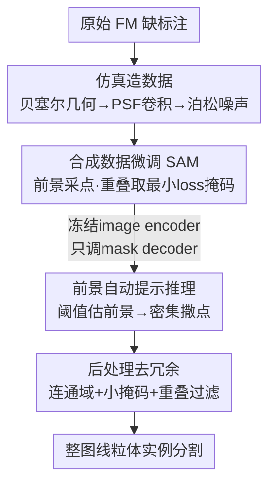

# SAM for Robust Mitochondria Instance Segmentation in Fluorescence Microscopy

**会议**: CVPR 2026  
**arXiv**: [2605.31284](https://arxiv.org/abs/2605.31284)  
**代码**: 无  
**领域**: 医学图像 / 生物显微 / 实例分割  
**关键词**: 荧光显微、线粒体、SAM 微调、合成数据监督、实例分割

## 一句话总结
针对荧光显微镜下线粒体缺乏人工标注、网络密集重叠的困境，本文用物理仿真生成大规模带实例掩码的合成荧光图像微调 SAM（仅调 mask decoder），并配一套只在前景采点的自动提示推理流程，在真实标注图上把 Mean Dice 和 Precision 显著推到 Nellie / μSAM 之上。

## 研究背景与动机
**领域现状**：荧光显微镜（FM）是活细胞观察线粒体形态、追踪融合/分裂的金标准。要做下游的形态分析和时序追踪，就需要对线粒体做高精度**实例分割**（区分出每一条独立的线粒体，而不只是前景/背景）。SAM 这类视觉基础模型在自然图像上很强，μSAM（micro-SAM）、Cellpose-SAM 等也把 SAM 往显微领域迁移，Nellie 则是专门针对 FM 的细胞器分割追踪工具。

**现有痛点**：把 SAM 直接搬到 FM 上有两层障碍。其一是**域漂移**——FM 受衍射极限限制分辨率低、对比度弱，线粒体常密集交织成网，传统阈值/轮廓法要么把一条线粒体的分支当成多条（碎片化 fragmentation），要么把一团网络当成一根连续结构（过度合并）。其二也是更致命的是**标注稀缺**：原始 FM 数据海量，但对重叠、低对比度的线粒体网络做人工实例标注极其费力且本身就有歧义，导致几乎没有公开的高质量实例分割数据集，全监督深度模型根本喂不饱。

**核心矛盾**：现有 SOTA（μSAM 的 AIS 模式、Nellie）本质都是**逐像素分类**——用某种相似度把像素聚成簇，于是每个像素只能属于一个实例。但 FM 里线粒体大量重叠、共享像素，逐像素分类天然表达不了"一个像素同时属于多条重叠线粒体"，要么过度合并（μSAM 把密网糊成一片，召回掉）、要么碎片化（Nellie 把一条切成多段，精度掉）。

**本文目标**：(1) 绕开人工标注瓶颈，造出可规模化的带实例真值的训练数据；(2) 让模型能正确建模重叠，减少碎片化与过度合并。

**切入角度**：两个观察。一是线粒体的几何/光学成像过程是**可仿真的**——用贝塞尔曲线建几何、用点扩散函数（PSF）建成像、用泊松噪声建探测，就能批量造出"图像 + 像素级实例掩码"对，标注免费且精确。二是 SAM 这类**可提示分割**模型每个 prompt 独立处理、独立出一张掩码，多张掩码可以共享像素，天然能表达重叠——这正是逐像素分类做不到的。

**核心 idea**：**用物理仿真的合成 FM 数据监督微调 SAM**（simulation-supervised），把"标注稀缺"换成"无限免费的精确合成标注"，再借 SAM 的可提示特性自然建模线粒体重叠。

## 方法详解
### 整体框架
方法分三段串行：**仿真造数据 → 微调 SAM → 自动提示推理**。训练侧用程序化仿真管线生成 1 万张 512×512 的合成荧光图，每张含多条线粒体且每条都自带实例掩码；用这些数据微调 SAM，每张图从前景随机采点当 prompt，让 SAM 学会"给一个点，只抠出该点所在的那一条主结构、忽略遮挡的其他线粒体"；推理时不靠人给 prompt，而是先阈值估出前景、在前景密集撒点自动提示，再做连通域/重叠后处理去冗余，最后拼接成整图实例分割。

### 关键设计

**1. 物理仿真造实例数据：把"标注稀缺"换成"免费精确标注"**

这是全文的根基，直接打掉标注瓶颈这个痛点。作者把每条线粒体建模成套在 $n$ 点贝塞尔曲线上的**带半球端帽的粗圆柱体**，在 3D 空间随机摆 4–16 条（每个 128×128 crop），于是几何真值天然就是逐实例掩码、零人工成本。光学成像过程也照着真实荧光显微镜物理地仿：把 3D 点云与 **Gibson-Lanni 点扩散函数（PSF）** 卷积（数值孔径 1.42、放大 100×、发射波长 660nm），沿 z 取 10 个切片做最大强度投影来引入真实的离焦模糊，最后按随机采样的信背比 SBR∈[2,6] 加**泊松噪声**模拟探测噪声。基础 128×128 crop 通过平铺（tiling）拼成 512×512 引入空间变化和边缘复杂度，共造 1 万张。相比 PhySeg 等只做语义分割的合成工具，本文把它扩展到**实例级真值**，这才使得无标注微调实例分割模型成为可能。

**2. 合成数据微调 SAM + 重叠取最小损失：用可提示性自然建模重叠**

针对"逐像素分类表达不了重叠"这个核心矛盾。训练时每张图从全部前景随机采固定数量的点当 prompt，喂给 SAM（image encoder + prompt encoder + 轻量 mask decoder），输出与该点所在实例的掩码比对。关键的小设计在于**重叠点的处理**：当一个采样点落在多条重叠线粒体上时，输出会和所有重叠掩码分别算损失，**取损失最小的那张掩码做反向传播**——这等于告诉模型"给这个点，只需提取最显著的那条主结构"，在上万次合成重叠/交叉的暴露下，模型隐式学会忽略遮挡的其他线粒体。由于每个点 prompt 独立处理、各出一张掩码，不同掩码可以共享像素，于是"一个像素同时属于多条重叠线粒体"被自然编码出来——这正是逐像素分类做不到、而可提示分割天生能做的。损失就是标准 Dice loss：

$$Loss_{dice}(X,Y)=1-\frac{2|X\cap Y|}{|X|+|Y|}$$

**3. 前景自动提示 + 后处理去冗余：把"人工点 prompt"变成全自动推理**

SAM 原本要人给 prompt，本文做了一套改造版自动掩码生成（automatic mask generation）让推理全自动。先对像素尺寸做归一化预处理——把输入上/下采样到训练时的 80nm 像素尺寸、切成 512×512 patch，保证视野一致，patch 输出再拼回整图。然后**只在前景采点**：先对图做二值阈值粗估前景区域，仅在前景内密集撒大量点当 prompt（避免在背景上浪费提示、引入假阳）。预测完做三步后处理压冗余：① 对每张掩码做连通域分析、只保留最大连通块，去掉高度碎片化的掩码；② 滤掉面积 <10 像素的小掩码（10 像素 ≈ 0.064 μm²，小于最小线粒体的物理尺寸，不会误删真实线粒体）；③ 与任意邻居掩码重叠 >0.5 的掩码被去掉，削减密网里的重复预测。

### 损失函数 / 训练策略
训练目标仅用 Dice loss（式上）。微调策略经过对比择优：在 ViT-base / ViT-large 两种 backbone、是否同时微调 image encoder 上做网格对比（见消融表），最终选 **ViT-base + 冻结 image encoder、只微调 mask decoder**。两个反直觉结论：模型越大反而越差（ViT-base 优于 ViT-large）；同时调 image encoder 也变差（只调 mask decoder 最好）——说明在合成数据上过度调参容易过拟合仿真域，冻住强大的预训练 encoder、只轻调解码头泛化更好。

## 实验关键数据

### 主实验
测试集是从 PhySeg 公开数据里**手工标注的 2 张真实 FM 图**（test 1 比 test 2 噪声更大），用 Napari 标注，约各含 200 条线粒体。匹配规则：预测掩码与 GT 按重叠择优匹配，且要求匹配 Dice≥0.5 才算 True Positive；未匹配的预测算 FP，未匹配的 GT 算 FN。指标含 Precision、Recall、Mean Dice（未匹配实例 Dice 记 0）和 **Dice (NZ)**（Non-Zero Dice，只对 Dice>0 的实例求均值）。

测试图 1（噪声较大）：

| 方法 | Dice(NZ) | Mean Dice | Precision | Recall |
|------|----------|-----------|-----------|--------|
| Nellie | 0.405 | 0.093 | 0.070 | **0.294** |
| μSAM | **0.512** | 0.334 | 0.329 | 0.257 |
| **本文** | 0.510 | **0.428** | **0.444** | 0.252 |

测试图 2（噪声较小）：

| 方法 | Dice(NZ) | Mean Dice | Precision | Recall |
|------|----------|-----------|-----------|--------|
| Nellie | 0.579 | 0.159 | 0.189 | **0.678** |
| μSAM | 0.537 | 0.442 | 0.517 | 0.298 |
| **本文** | **0.600** | **0.538** | **0.667** | 0.312 |

本文在两张图上都拿到最高的 Mean Dice 和 Precision；Dice(NZ) 在图 2 最佳、图 1 被 μSAM 微弱反超（0.512 vs 0.510）。Mean Dice 与 Dice(NZ) 的差距本文最小，说明 Dice=0 的无效检测最少（与高 Precision 一致）。Recall 与 μSAM 相当，但明显低于 Nellie。

### 消融实验（微调策略）
指标在真实标注测试集上计算（MD=Mask Decoder，IE=Image Encoder）：

| 配置 | Precision | Recall | Dice(NZ) | Mean Dice |
|------|-----------|--------|----------|-----------|
| **ViT-base, 只调 MD** | **0.555** | **0.282** | **0.555** | **0.483** |
| ViT-base, 调 MD+IE | 0.460 | 0.174 | 0.504 | 0.434 |
| ViT-large, 只调 MD | 0.530 | 0.199 | 0.512 | 0.450 |
| ViT-large, 调 MD+IE | 0.482 | 0.185 | 0.525 | 0.437 |

### 关键发现
- **小模型反而更好**：ViT-base 全面优于 ViT-large（Mean Dice 0.483 vs 0.450），与"越大越强"的直觉相反，提示合成域上大 backbone 更易过拟合。
- **冻结 image encoder 最优**：只调 mask decoder（0.483）明显好过同时调 IE（0.434），冻住预训练视觉表征更能迁移到真实图。
- **三方分工清晰**：Nellie 召回最高但精度极低（碎片化，把一条切成多段、还在离焦区误检）；μSAM 精度尚可但召回低（过度合并，把密网糊成一片漏掉个体）；本文牺牲一点召回换来最高精度和 Mean Dice，个体勾画最准。
- **共性短板**：三方法都在**低对比度区域**吃力，本文在这些区域反而比另两者更易漏检（Recall 偏低的来源）。
- **下游可用性验证**：在 mitophagy 形态学案例（Normal / Hypoxia / Hypoxia-ADM 三种生长条件）中，本文分割出的点状/杆状线粒体（按面积阈值 200 像素分类，式 5）比例随条件呈预期的 ∧/V 形趋势，尤以"面积占比"图最清晰，证明实例分割结果可支撑真实生物分析。

## 亮点与洞察
- **把标注稀缺问题改写成仿真问题**：用贝塞尔几何 + Gibson-Lanni PSF + 泊松噪声物理地造出"图像 + 精确实例掩码"，标注成本归零且无歧义。这套"物理可仿真就别标注"的思路可迁移到任何成像物理清楚、但人工标注昂贵的显微/医学模态。
- **借可提示分割天然建模重叠**：洞察到逐像素分类的根本缺陷是"一像素一实例"，而 SAM 每 prompt 独立出掩码、可共享像素，正好破解线粒体网络的重叠——这是把任务范式从"分类"换成"提示"带来的结构性优势，而非单纯调参。
- **重叠点取最小损失这个小 trick**：让模型在歧义点上只学最显著结构，简单却直接对应"忽略遮挡"的目标，很巧。
- **"小模型 + 冻 encoder 更好"的实证**：提醒在合成数据微调基础模型时，过度解冻是双刃剑，轻调解码头往往是更稳的迁移策略。

## 局限与展望
- **召回偏低、会整条漏检**：作者承认这是主要短板，模型并不能找全所有线粒体，尤其在低对比度区域成片漏检——它用召回换了精度。
- **评测规模极小**：测试集只有 2 张手工标注真实图，作者自承评测指标"arguably limited"，结论的统计可信度有限，需要更多真实标注数据验证。
- **仿真域与真实域仍有差距**：合成数据再逼真也是简化模型（圆柱+贝塞尔几何、固定光学参数），真实线粒体形态/成像条件更复杂，sim-to-real gap 是潜在天花板。
- **改进方向**：补充更难的低对比度仿真样本、引入混合真实+合成微调、或在推理阶段对低对比度区做自适应提示密度，都可能把召回拉起来。

## 相关工作与启发
- **vs Nellie**：Nellie 用区域相似度 + 决策树做逐像素分类、配 Frangi 血管增强滤波，专为 FM 设计。它召回最高、前景贴合最好，但严重碎片化（把一条线粒体按弯折/交叉处切成多段）、在离焦噪声区大量误检，导致精度极低（0.070 / 0.189）。本文精度高一个量级，靠的是实例级建模而非逐像素聚类。
- **vs μSAM (micro-SAM)**：μSAM 把 SAM 扩到多种光/电镜模态，其 AIS 模式用额外解码头预测物体中心再做分水岭种子。它对良好分离的实例（如组织培养里的单细胞）有效，但分水岭在密集线粒体网络里分不开边界，把重叠个体糊成一根连续结构，召回低。本文同样基于 SAM，但用合成数据训练 + 可提示重叠建模而非分水岭，因此本文与 μSAM 的对比也直接验证了"训练范式本身"的有效性（μSAM 同样在本文合成集上微调过）。
- **vs PhySeg**：PhySeg 用物理渲染做线粒体/囊泡/肌动蛋白等亚细胞结构的**语义**分割合成数据，本文在其基础上扩展生成**实例级**真值，从而把合成监督从语义分割推进到实例分割。

## 评分
- 新颖性: ⭐⭐⭐⭐ 用物理仿真造实例真值 + 借 SAM 可提示性建模重叠，组合到 FM 线粒体上是清晰且有针对性的创新，单个组件多为已有思路的巧妙组合。
- 实验充分度: ⭐⭐⭐ 微调策略消融到位、下游案例有说服力，但真实测试集仅 2 张图，作者自己也承认评测受限。
- 写作质量: ⭐⭐⭐⭐ 动机—矛盾—方法链条清晰，定性分析（碎片化/过度合并/低对比漏检）解释到位。
- 价值: ⭐⭐⭐⭐ 给数据稀缺的生物显微实例分割提供了可规模化的 sim-supervised 路线，下游形态分析可直接受益。

<!-- RELATED:START -->

## 相关论文

- [\[CVPR 2026\] Learning from Noisy Prompts: Saliency-Guided Prompt Distillation for Robust Segmentation with SAM](learning_from_noisy_prompts_saliency-guided_prompt_distillation_for_robust_segme.md)
- [\[CVPR 2026\] MuViT: Multi-Resolution Vision Transformers for Learning Across Scales in Microscopy](muvit_multi-resolution_vision_transformers_for_learning_across_scales_in_microsc.md)
- [\[CVPR 2026\] BiCLIP: Bidirectional and Consistent Language-Image Processing for Robust Medical Image Segmentation](biclip_bidirectional_and_consistent_language-image_processing_for_robust_medical.md)
- [\[CVPR 2026\] MambaLiteUNet: Cross-Gated Adaptive Feature Fusion for Robust Skin Lesion Segmentation](mambaliteunet_cross-gated_adaptive_feature_fusion_for_robust_skin_lesion_segment.md)
- [\[CVPR 2026\] MIL-PF: Multiple Instance Learning on Precomputed Features for Mammography Classification](milpf_multiple_instance_learning_on_precomputed_fe.md)

<!-- RELATED:END -->
