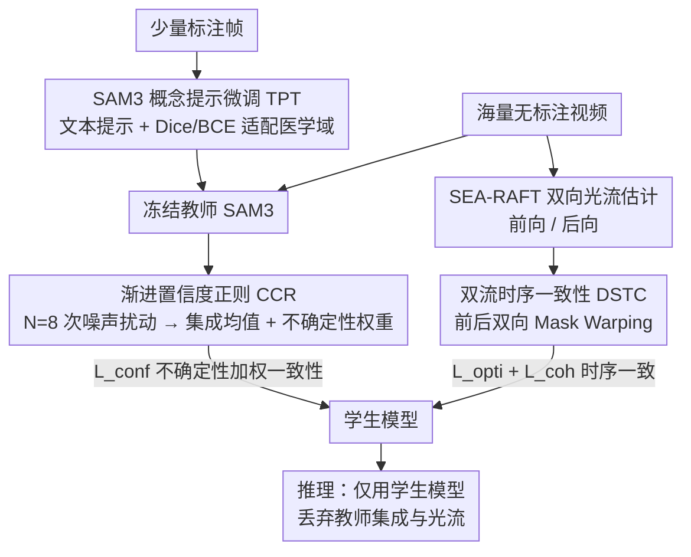

# Uncertainty-Aware Concept and Motion Segmentation for Semi-Supervised Angiography Videos

**会议**: CVPR 2026  
**arXiv**: [2603.00881](https://arxiv.org/abs/2603.00881)  
**代码**: [GitHub](https://github.com/qimingfan10/SMART)  
**领域**: 医学图像  
**关键词**: 半监督分割, 冠脉造影, SAM3, 时序一致性, 光流

## 一句话总结

提出 SMART 框架，基于 SAM3 的概念提示分割构建 Teacher-Student 半监督模型，结合渐进置信度正则化和双流时序一致性策略，仅用极少标注在 X 射线冠脉造影视频中实现 SOTA 血管分割。

## 研究背景与动机

冠状动脉疾病 (CAD) 是全球主要死因，X 射线冠脉造影 (XCA) 是临床"金标准"诊断工具。精确的冠脉分割对自动化诊断至关重要，但面临以下挑战：

**标注稀缺**：临床场景中标注数据获取极其昂贵耗时，大量数据无标注

**XCA 特性难点**：边界模糊、辐射对比度不一致、复杂运动模式、低信噪比

**现有 SSL 方法局限**：
   - 依赖几何提示或特征提示的 SAM 方法在跨机构场景下泛化能力差
   - 直接应用 SAM3 到 XCA 序列会忽略时序依赖，导致分割时序不一致
   - 教师模型在低质量区域的预测不可靠（低准确率、高方差）

## 方法详解

### 整体框架

SMART 要解决的是这样一个困境：临床上的 XCA 视频几乎都没有标注，而冠脉本身边界模糊、对比度忽明忽暗、还在不停搏动，直接把通用分割大模型套上去往往得到一帧准一帧错的破碎结果。它的整体思路是先用极少量标注把一个分割大模型"调进医学领域"当老师，再让这个老师在海量无标注视频上带出一个学生。

具体分两阶段。第一阶段做**文本驱动的分割微调**：在标注数据上微调教师 SAM3，靠"文本概念提示"（而非传统的点/框）把它适配到冠脉造影。第二阶段做**运动感知的半监督学习**：冻结教师，让它在无标注视频上为学生生成监督信号，期间用置信度正则压住老师不靠谱的预测、用双向光流逼着学生在相邻帧之间保持一致。训练完成后推理只跑学生模型，丢掉教师那套噪声集成和光流计算，所以部署很轻。

### 关键设计

**1. SAM3 概念提示微调 (TPT)：用文本语义而非点/框来适配医学域**

跨机构是这类方法最容易崩的地方——A 医院标的点提示换到 B 医院的成像设备上就失灵了。SMART 干脆不喂几何提示，而是利用 SAM3 独有的"文本概念提示"能力：给它一句描述血管这一概念的文本，让模型自己在图像里找出对应的语义结构。微调时只解冻图像编码器、文本编码器和检测器，其余组件保持冻结，监督信号是标注帧上的 Dice 加 BCE：

$$\mathcal{L}_{\text{ft}} = \lambda_1 \mathcal{L}_{\text{Dice}} + \lambda_2 \mathcal{L}_{\text{Bce}}$$

之所以有效，是因为文本概念抓的是"血管"这个语义而不是某张图上的具体坐标，所以换了机构、换了对比度，只要还是血管这一概念就能迁移过去。消融里去掉 TPT 后 CAVSA 的 DSC 直接从 91.00 崩到 25.82，说明没有这步把 SAM3 拉进医学域，后面两个正则项都救不回来。

**2. 渐进置信度感知一致性正则化 (CCR)：让学生只在老师靠谱的地方信老师**

半监督的老大难是教师给出的伪标签本身不可靠——尤其在低对比度、信噪比差的血管末梢，老师往往是低准确、高方差。CCR 的做法是先量化老师到底有多不确定：对教师注入 $N=8$ 次独立噪声扰动 $\epsilon^{(i)} \sim \mathcal{N}(0, \sigma^2 \mathbf{I})$，得到 $N$ 组预测，取集成均值 $\bar{\mathbf{P}}$ 作为更稳的伪标签，并用这 $N$ 组预测的离散程度算出逐像素的不确定性权重 $\boldsymbol{\mathcal{U}}$。然后让师生一致性损失按这个不确定性来调监督强度：

$$\mathcal{L}_{\text{conf}} = \frac{\sum_{x,y} \mathcal{D}(x,y) \mathcal{U}(x,y)}{\sum_{x,y} \mathcal{U}(x,y) + N\eta} + \frac{\beta}{N} \sum_{x,y} \mathcal{U}(x,y)$$

其中 $\mathcal{D}(x,y) = (\sigma(S(x,y)) - \sigma(\bar{P}(x,y)))^2$ 是学生与教师集成预测在该像素的一致性距离。第一项让学生去对齐老师，但分母里塞进了 $\mathcal{U}$ 做归一化、第二项又直接惩罚整体不确定性，合起来的效果是：老师确定的区域权重大、学生必须跟紧；老师含糊的区域则被自动调弱，避免学生被错误伪标签带偏。"渐进"指的就是这种随不确定性自适应收放的监督力度。这一项是全框架最吃重的设计——消融里去掉 CCR 后 CAVSA 的 DSC 暴跌 43.23%。

**3. 双流时序一致性 (DSTC)：用前后双向光流把相邻帧的分割焊在一起**

逐帧独立分割会让同一根血管在连续帧间忽断忽连，时序上抖得厉害。DSTC 用 SEA-RAFT 同时算出前向光流 $\mathbf{F}_{t \to t+1}$ 和后向光流 $\mathbf{F}_{t+1 \to t}$，再做双向 Mask Warping：把 $t{+}1$ 帧的分割按前向光流搬回 $t$ 帧、把 $t$ 帧的分割按后向光流搬到 $t{+}1$ 帧，要求搬过去的结果和原帧分割一致：

$$\mathcal{L}_{\text{opti}} = \frac{1}{2N} \sum_{x,y} \Big[\big(\mathbf{S}_t - \mathcal{W}(\mathbf{S}_{t+1}, \mathbf{F}_{t \to t+1})\big)^2 + \big(\mathbf{S}_{t+1} - \mathcal{W}(\mathbf{S}_t, \mathbf{F}_{t+1 \to t})\big)^2\Big]$$

单向光流容易陷入确认偏差（错了也自洽），所以特意做成前后双流互相校验。此外还加了一项 Flow Coherence Loss $\mathcal{L}_{\text{coh}}$，惩罚那些运动方向明显偏离血管主体的边界点，相当于借运动一致性把前景血管和背景区分开。整体上 DSTC 主要补的是空间连通性——它让衡量血管骨架连通的 clDice 提升约 39%，断裂和过分割明显减少。

### 损失函数 / 训练策略

- 总损失：$\mathcal{L}_{\text{all}} = \lambda_{\text{Dice}} \mathcal{L}_{\text{Dice}} + \lambda_{\text{Bce}} \mathcal{L}_{\text{Bce}} + \lambda_{\text{conf}} \mathcal{L}_{\text{conf}} + \lambda_{\text{opti}} \mathcal{L}_{\text{opti}} + \lambda_{\text{coh}} \mathcal{L}_{\text{coh}}$
- 权重：$\lambda_{\text{Dice}}=0.5, \lambda_{\text{Bce}}=0.5, \lambda_{\text{conf}}=0.5, \lambda_{\text{opti}}=0.3, \lambda_{\text{coh}}=0.2$
- AdamW 优化器，lr=1e-4，weight decay=0.01，batch size=4，6k 迭代
- 教师/学生采用不对称数据增强：教师用强增强（旋转±15°，噪声 σ=0.03），学生用弱增强

## 实验关键数据

### 主实验

在 XCAV（111 视频）和 CAVSA（1061 视频）数据集上，仅用 16 个标注视频：

| 方法 | XCAV DSC ↑ | XCAV clDice ↑ | CAVSA DSC ↑ | CAVSA clDice ↑ |
|------|-----------|--------------|-----------|--------------|
| UNet (监督) | 70.80 | 69.24 | 64.19 | 70.27 |
| Denver | 73.30 | 70.40 | 76.53 | 79.17 |
| CPC-SAM | 77.90 | 79.15 | 77.90 | 78.28 |
| **SMART (Ours)** | **84.39** | **83.01** | **91.00** | **97.73** |

仅用 14% 标注视频，SMART 在 XCAV 上超越次优方法 CPC-SAM 6.49% DSC；在 CAVSA 上仅用 1.5% 标注数据即提升 13.1% DSC。

### 消融实验

| 配置 | XCAV DSC ↑ | CAVSA DSC ↑ | 说明 |
|------|-----------|-----------|------|
| TPT + CCR（无 DSTC） | 82.38 | 78.87 | 缺少时序一致性 |
| TPT + DSTC（无 CCR） | 76.24 | 47.77 | 不可靠伪标签严重影响 |
| CCR + DSTC（无 TPT） | 76.71 | 25.82 | 文本概念提示对 SAM3 适配至关重要 |
| **TPT + CCR + DSTC** | **84.39** | **91.00** | 三组件缺一不可 |

### 关键发现

- **CCR 是核心**：去掉 CCR 后 CAVSA DSC 暴降 43.23%，说明不正则化教师输出对分割影响极大
- **DSTC 提升空间连通性**：clDice 提升约 39%，有效减少断裂/过分割
- **噪声扰动次数 N=8 最佳**：从 N=2 到 N=8，clDice 从 81.82% 提升到 83.01%
- 文本概念提示 vs 点提示：概念提示在跨机构泛化上明显更优，CADICA 数据集上视觉对比显著

## 亮点与洞察

- **文本概念提示的医学适配**：利用 SAM3 的语义理解能力替代几何提示，解决跨机构域差异问题
- 渐进置信度正则化同时做到"加权高不确定区域"和"集成多噪声预测"，双重增强鲁棒性
- 双流光流设计（前向+后向）缓解了单向光流的确认偏差
- 极少标注下的惊人性能：16 个视频标注+每个仅 1-2 帧，就能达到远超监督方法的效果

## 局限与展望

- XCA 视频帧数有限，长序列场景下时序建模能力未知
- SAM3 本身的计算开销较大，实时性可能无法满足术中需求
- 仅在冠脉造影数据上验证，扩展到其他血管造影场景需进一步实验
- 未探索 SAM3 不同规模变体的影响

## 相关工作与启发

- 与 MedSAM2/KnowSAM 等基于几何提示的方法不同，SMART 利用文本语义消除了对特定点/框的依赖
- 置信度正则化思想可推广到其他教师-学生框架中处理不可靠伪标签
- SEA-RAFT 光流 + Mask Warping 的组合在医学视频中证明有效

## 评分

- 新颖性: ⭐⭐⭐⭐ — SAM3 概念提示在医学半监督中的首次成功应用
- 实验充分度: ⭐⭐⭐⭐⭐ — 三个数据集、完整消融、跨机构泛化验证
- 写作质量: ⭐⭐⭐⭐ — 方法描述清晰，各组件动机充分
- 价值: ⭐⭐⭐⭐ — 标注效率极高，临床应用前景好

<!-- RELATED:START -->

## 相关论文

- [\[CVPR 2026\] Semantic Class Distribution Learning for Debiasing Semi-Supervised Medical Image Segmentation](semantic_class_distribution_learning_for_debiasing.md)
- [\[CVPR 2026\] Synergistic Bleeding Region and Point Detection in Laparoscopic Surgical Videos](synergistic_bleeding_region_and_point_detection_in_laparoscopic_surgical_videos.md)
- [\[CVPR 2026\] A Semi-Supervised Framework for Breast Ultrasound Segmentation with Training-Free Pseudo-Label Generation and Label Refinement](a_semi-supervised_framework_for_breast_ultrasound_segmentation_with_training-fre.md)
- [\[CVPR 2026\] Better than Average: Spatially-Aware Aggregation of Segmentation Uncertainty Improves Downstream Performance](better_than_average_spatially-aware_aggregation_of_segmentation_uncertainty_impr.md)
- [\[CVPR 2026\] SemiTooth: a Generalizable Semi-supervised Framework for Multi-Source Tooth Segmentation](semitooth_a_generalizable_semi-supervised_framework_for_multi-source_tooth_segme.md)

<!-- RELATED:END -->
