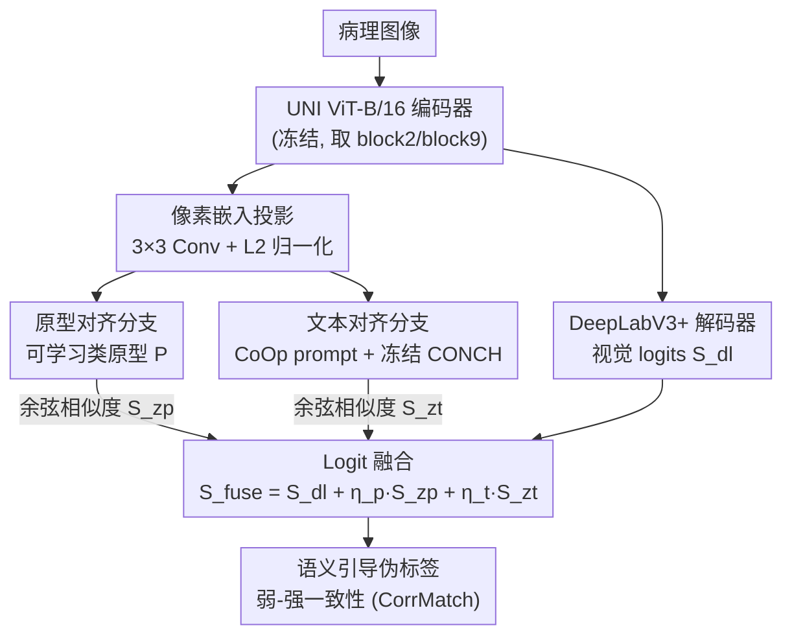

# UniSemAlign: Text–Prototype Alignment with a Foundation Encoder for Semi-Supervised Histopathology Segmentation

**会议**: CVPR 2026  
**arXiv**: [2604.09169](https://arxiv.org/abs/2604.09169)  
**代码**: https://github.com/thailevann/UniSemAlign (有)  
**领域**: 医学图像 / 半监督分割  
**关键词**: 半监督分割, 病理图像, 视觉-语言对齐, 类原型, 伪标签精炼

## 一句话总结
UniSemAlign 在病理预训练 UNI 编码器之上，并行挂一条「可学习类原型」分支和一条「CONCH 文本提示」分支，把它们在共享嵌入空间产生的语义对齐 logits 融进 DeepLabV3+ 的视觉预测里生成更可靠的伪标签，配合 CorrMatch 弱-强一致性框架，在 GlaS / CRAG 腺体分割上仅用 10% 标注就把 mDice 提升最多 8.6%。

## 研究背景与动机
**领域现状**：病理组织语义分割对自动化诊断很关键，但全监督方法依赖大量像素级标注，而病理图像形态变化大、类内异质性高、组织边界模糊，标注既费力又依赖专家。半监督学习（SSL）用少量标注 + 大量无标注数据缓解这个矛盾，主流套路是一致性正则（FixMatch、CPS）和伪标签自训练。

**现有痛点**：经典 SSL 在病理上的伪标签质量很差——重叠组织和形态歧义导致伪标签噪声大、训练不稳定，模型会过拟合到错误的伪掩码（confirmation bias），尤其在语义边界处。根本原因是这些方法只靠局部一致性或像素独立的阈值过滤，**缺乏显式的语义引导**，没有把病理领域知识利用起来，难以做细粒度区分。

**核心矛盾**：视觉-语言模型（PLIP、CONCH）和病理基础模型（UNI）带来了丰富的语义先验，但它们擅长的是全局理解和零/少样本分类，直接拿来做半监督密集预测会受限于 domain shift、对分布变化敏感，且依赖静态 prompt——静态文字描述捕捉不到病理细微的形态差异，给不出灵活精确的像素级语义监督。

**本文目标**：在半监督密集预测里，让基础模型的语义先验真正落到像素级，给伪标签注入显式的类级结构，从而稳定伪标签精炼。

**切入角度**：作者认为单一模态的语义锚点不够——原型提供的是数据驱动的结构性锚点，文本提供的是语义/类别先验，二者互补。于是把「可学习类原型」和「可学习 prompt 引导的文本嵌入」放进同一个共享嵌入空间，与像素特征做余弦相似度对齐，产生残差式的语义修正。

**核心 idea**：用「原型对齐 + 文本对齐」双模态语义信号去校正视觉 logits，再融合生成伪标签，让无标注样本的监督在类级语义上更一致。

## 方法详解

### 整体框架
输入一张病理图像，先由病理预训练的 UNI ViT-B/16 编码器抽取分层特征，送进 DeepLabV3+ 解码器得到视觉 logits $S_{dl}$。与此同时，高层像素特征被投影到一个共享语义嵌入空间，分别与「可学习类原型」和「冻结 CONCH 文本编码器 + 可学习上下文 token 生成的文本嵌入」做余弦相似度，得到原型对齐 logits $S_{zp}$ 和文本对齐 logits $S_{zt}$。三路 logits 加权融合成 $S_{\text{fuse}}$，用来给无标注图像生成伪标签；整套训练沿用 CorrMatch 的弱-强一致性框架，由监督分割、跨视图一致性、跨模态对齐三类目标端到端联合优化。

整体是「一条视觉主干 + 两条语义对齐分支 → logit 融合 → 弱-强伪标签」的结构：

### 关键设计

**1. UNI 编码器 + DeepLabV3+ 视觉主干：用病理基础模型撑起特征表示**

针对病理图像形态异质、半监督下特征不鲁棒的问题，作者不用通用 ImageNet 主干，而是把编码器初始化为病理预训练的 UNI ViT-B/16。给定输入 $x\in\mathbb{R}^{B\times 3\times H\times W}$，图像切成 $16\times16$ 不重叠 patch 过 Transformer，从 block 2 和 block 9 抽中间 token（去掉 CLS 后 reshape 成空间特征图 $F_2,F_9$），再用 $1\times1$ 卷积投影成低层特征 $f_{low}\in\mathbb{R}^{B\times256\times H'\times W'}$ 和高层特征 $f_{high}\in\mathbb{R}^{B\times2048\times H'\times W'}$（$H'=H/16$）。低层细节 + 高层语义送进标准 DeepLabV3+（ASPP + 低层特征融合 + $1\times1$ 分类头），双线性上采样回原分辨率得到 $S_{dl}\in\mathbb{R}^{B\times C\times H\times W}$。消融显示，仅把 ResNet101 换成 UNI 编码器就带来 +1.77 mDice，说明领域专属大规模预训练在标注稀缺时确实给出更稳的特征锚点。

**2. 原型对齐分支：用可学习类原型给像素注入数据驱动的结构锚点**

经典 SSL 缺的是显式类级结构，作者维护一组可学习类原型 $P\in\mathbb{R}^{C\times D}$（$D=256$，按 $1/\sqrt{D}$ 缩放随机初始化）作为嵌入空间里的类级语义锚点。高层特征先经一个 $3\times3$ 卷积投影头映到共享语义空间 $Z\in\mathbb{R}^{B\times D\times H'\times W'}$，reshape 并沿通道 L2 归一化得到像素嵌入 $z\in\mathbb{R}^{B\times N\times D}$（$N=H'W'$）。原型 logits 由像素嵌入与归一化原型的余弦相似度给出：

$$S_{zp} = z\,\mathrm{normalize}(P)^{\top}\in\mathbb{R}^{B\times N\times C}$$

reshape 回空间形式 $S_{zp}\in\mathbb{R}^{B\times C\times H'\times W'}$。原型是从数据里学出来的、紧凑的类中心，定性上主要改善结构完整性与边界连贯性——去掉它腺体内部会出现断裂和小缺失。

**3. 文本对齐分支：用 CoOp 可学习 prompt + 冻结 CONCH 给像素注入语义先验**

静态文字 prompt 捕捉不到病理形态细节，作者用 CoOp 式可学习上下文 token 来替代手写模板。对每个类 $c$，构造 prompt $\pi_c=[\text{BOS}][v_1^{(c)}]\dots[v_M^{(c)}][l_c][\text{EOT}]$，其中 $M$ 个上下文 token $v^{(c)}$ 可学习、$l_c$ 是类名。prompt 经冻结的 CONCH ViT-B/16 文本编码器（先 token embedding，把 $M$ 个上下文位替换成可学习 token，加位置编码后过 Transformer），取 EOT 隐状态 $h_{\text{EOT}}^{(c)}$，先经 CONCH 的 $W_{\text{clip}}$ 投影、再经可学习线性层 $W_{\text{proj}}$ 映到共享语义空间得到文本特征 $f_c^{\text{text}}\in\mathbb{R}^{D}$，堆叠成文本嵌入矩阵 $T\in\mathbb{R}^{C\times D}$。文本对齐 logits 同样用余弦相似度 $S_{zt}=z\,\mathrm{normalize}(T)^{\top}$。文本分支定性上主要抑制歧义/背景的虚假激活——去掉它会冒出零散的假阳性小块、边界更不规整。消融中上下文 token 数从 0→4 稳定涨点（4 个最好，+0.62 mDice），再多反而略降。

**4. Logit 融合 + 语义引导伪标签：让语义分支以残差形式校正视觉预测**

两条对齐分支在特征分辨率 $(H',W')$ 上输出，先双线性上采样到图像分辨率，再与解码器 logits 加权相加做融合：

$$S_{\text{fuse}} = S_{dl} + \eta_p S_{zp} + \eta_t S_{zt}$$

其中 $\eta_p,\eta_t$ 是标量融合权重（实验都设 0.1）。这里的设计哲学是**解码器 logits 作主预测、语义分支作残差修正**——不喧宾夺主，只在视觉预测含糊的地方注入类级语义把它拉正。对无标注图像，沿用 CorrMatch 的弱-强一致性：从融合后的弱视图 logits $S_{\text{fuse}}^{w}$ 经 softmax + 置信度阈值（EMA 更新、初始 0.7）取 argmax 得硬伪标签，低置信像素忽略；强增广视图再用这个语义引导的伪标签做监督。相比直接用视觉 logits 生成伪标签，融合了原型 + 文本的伪标签在类级语义上更一致，这正是 CRAG 这种复杂结构上涨点显著的原因。

### 损失函数 / 训练策略
总目标沿用 CorrMatch：$\mathcal{L}=\frac12(\mathcal{L}_{\text{sup}}+\mathcal{L}_{\text{unsup}})$。

**监督部分**：对有标注图像，三路 logits 都用像素级交叉熵监督 $\mathcal{L}^{\text{sup}}_{dl}=\mathrm{CE}(S_{dl},y)$、$\mathcal{L}^{\text{sup}}_{\text{proto}}=\mathrm{CE}(S_{zp},y)$、$\mathcal{L}^{\text{sup}}_{\text{text}}=\mathrm{CE}(S_{zt},y)$；并额外加一项跨模态对齐损失，让原型和文本嵌入在类级对齐：

$$\mathcal{L}_{\text{align}} = \mathrm{MSE}\big(\mathrm{normalize}(P),\,\mathrm{normalize}(T)\big)$$

监督总目标 $\mathcal{L}_{\text{sup}}=\mathcal{L}^{\text{sup}}_{dl}+\mathcal{L}^{\text{sup}}_{\text{proto}}+\mathcal{L}^{\text{sup}}_{\text{text}}+\mathcal{L}_{\text{align}}$。消融表明 MSE 比余弦/KL 更适合做这个对齐（KL 反而掉点）。

**无监督部分**：沿用 CorrMatch 三项——硬损失 $\mathcal{L}^{\text{unsup}}_h=\mathrm{CE}(S_{dl}(u^s),\hat y)$（强视图对齐伪标签）、软一致性 $\mathcal{L}^{\text{unsup}}_s=\mathrm{KL}(\sigma(S_{dl}(u^s))\|\sigma(S_{dl}(u^w)))$、相关损失 $\mathcal{L}^{\text{unsup}}_c=\mathrm{CE}(S_{dl}^{\text{fp}}(u^w),\hat y)$（特征扰动下预测）。权重 $[\lambda_h,\lambda_s,\lambda_c]=[0.5,0.25,0.25]$。注意无监督损失只作用在解码器预测 $S_{dl}$ 上，把融合预测当作更强的「教师信号」。训练：UNI 编码器冻结，SGD（momentum 0.9，weight decay 1e-4），lr 0.001 多项式衰减，80 epoch，输入随机缩放裁剪到 $256\times256$，弱-强增广 + 特征扰动 + CutMix，单张 TITAN Xp（12GB）。

## 实验关键数据

### 主实验
GlaS-2017 / CRAG-2019 腺体分割，10% 与 20% 标注（mDice / mJaccard，%）：

| 标注比 | 方法 | GlaS mDice | GlaS mJaccard | CRAG mDice | CRAG mJaccard |
|--------|------|-----------|---------------|------------|----------------|
| 100% | Fully-Supervised | 89.97 | 81.77 | 89.13 | 80.44 |
| 10% | CorrMatch (CVPR'24) | 85.54 | 74.74 | 79.93 | 66.76 |
| 10% | CSDS (MICCAI'25) | 82.89 | 71.61 | 79.86 | 67.81 |
| 10% | DuSSS (AAAI'25, 含文本) | 75.07 | 61.46 | 64.25 | 49.99 |
| 10% | **UniSemAlign** | **88.15** | **78.82** | **88.57** | **79.52** |
| 20% | CorrMatch (CVPR'24) | 86.09 | 75.59 | 85.35 | 74.54 |
| 20% | **UniSemAlign** | **88.58** | **79.50** | **89.40** | **80.88** |

关键观察：相比最强 baseline CorrMatch，GlaS 10% 上 +2.61 mDice / +4.08 mJaccard；CRAG 10% 上提升更猛，+8.64 mDice / +11.71 mJaccard。CRAG 20% 的 mDice（89.40）甚至超过全监督（89.13），说明语义对齐在复杂腺体结构上把半监督与全监督的差距几乎抹平。

### 消融实验
（均在 GlaS 10% 标注下）

| 消融维度 | 配置 | mDice | mJaccard | 说明 |
|----------|------|-------|----------|------|
| 编码器 | ResNet101 | 86.37 | 76.01 | 通用主干 |
| 编码器 | UNI | 88.15 | 78.82 | 病理基础模型 +1.77 |
| 双分支 | 无文本无原型 | 87.66 | 78.04 | baseline |
| 双分支 | 仅原型 | 88.00 | 78.57 | 原型 +0.34 |
| 双分支 | 仅文本 | 88.06 | 78.66 | 文本 +0.40 |
| 双分支 | 文本+原型 | 88.15 | 78.82 | 互补 +0.48 |
| 对齐损失 | 无对齐 | 87.56 | 77.87 | — |
| 对齐损失 | 余弦 | 87.69 | 78.08 | 边际增益 |
| 对齐损失 | KL | 87.43 | 77.67 | 反而掉点 |
| 对齐损失 | MSE | 88.15 | 78.82 | 最好 +0.58 |

上下文 token 数：0→2→3→4 稳定上升（87.52→87.85→88.07→88.15 mDice），5 个略降（87.79），故选 4 个。

### 关键发现
- **编码器换成 UNI 的贡献远大于两条对齐分支**：换主干 +1.77 mDice，而双分支合起来只 +0.48 mDice——领域预训练基础模型才是涨点主力，语义对齐是锦上添花的精炼。
- **原型与文本分支语义角色互补**：定性上原型改善结构完整性/边界连贯，文本抑制背景虚假激活；二者合用优于任一单独使用。
- **对齐损失选 MSE 而非 KL/余弦**：显式特征级回归比分布散度更能强制原型-文本的类级一致性，KL 甚至会拖累性能。
- **CRAG 涨幅远大于 GlaS**：CRAG 腺体形态/染色变化更大，语义引导对复杂结构的伪标签精炼收益更明显。

## 亮点与洞察
- **把基础模型先验「降维」到像素级的清晰路径**：不直接拿 VLM 做密集预测（会受 domain shift 拖累），而是只借它的文本嵌入当语义锚点，与数据驱动的原型一起以余弦相似度 + 残差融合方式注入，既用了先验又不被先验的分布敏感性反噬。
- **双锚点互补的设计观**：原型是「数据里学出的类中心」，文本是「外部语义先验」，一个管结构、一个管语义边界，这种「同空间双模态锚点」的拆分很可迁移到其他半监督密集预测任务。
- **CoOp prompt learning 用在分割而非分类**：把可学习上下文 token 的思路从图像级分类搬到像素级对齐，解决了静态 prompt 描述不了病理形态细节的问题。
- **几乎全是「即插即用」组件的组合**：UNI + DeepLabV3+ + CONCH + CoOp + CorrMatch，工程上复现门槛低，单张 12GB GPU 可训。

## 局限性 / 可改进方向
- **只在两个腺体分割数据集（GlaS/CRAG）上验证**，类别数少、都是结直肠组织，多类别/多器官病理上的泛化性未知。
- **涨点主要来自 UNI 编码器**，双分支语义对齐在 GlaS 上仅 +0.48 mDice，边际收益有限——在「简单」数据集上语义引导价值不明显，其真正优势局限在 CRAG 这类复杂结构。
- **依赖病理专属基础模型（UNI / CONCH）**：方法天生绑定领域基础模型的可得性，迁到没有强基础模型的医学模态（如某些罕见成像）会失效。
- **融合权重 $\eta_p,\eta_t$ 固定为 0.1**，是简单标量加权而非自适应，不同图像/区域的语义可信度差异没被建模，未来可做像素自适应融合。
- CRAG 20% 已超全监督，提示**全监督 baseline 本身可能未充分调优**，横向比较时需留意。

## 相关工作与启发
- **vs CorrMatch（CVPR'24，本文基线框架）**：CorrMatch 靠相关性精炼伪标签，但只用视觉 logits 生成伪标签；本文在它之上挂双模态语义分支、把融合后的语义 logits 喂给伪标签生成，互补处在于显式类级语义引导，CRAG 上 +8.64 mDice 即来自此。
- **vs DuSSS（AAAI'25）**：同样引入文本做语义引导，但 DuSSS 在病理上表现很差（GlaS 10% 仅 75.07 mDice）；本文用病理专属 CONCH 文本编码器 + CoOp 可学习 prompt + 数据驱动原型双锚点，远超 DuSSS。
- **vs MI-Zero / 通用 VLM 方法**：它们强调图像级零样本分类，给不出像素级细粒度引导；本文把对齐落到像素嵌入与类锚点的余弦相似度，专为密集预测设计。
- **vs U2PL / ELN 等过滤式 SSL**：它们靠不可靠像素挖掘或错误定位网络做过滤，仍是像素独立阈值；本文用类级语义结构替代纯局部一致性，抓的是被忽略的语义关系。

## 评分
- 新颖性: ⭐⭐⭐⭐ 「原型 + 文本双锚点注入像素级半监督分割」组合新颖，但单个组件（UNI、CONCH、CoOp、CorrMatch）都是现成的。
- 实验充分度: ⭐⭐⭐ 主实验 + 4 组消融较完整，但只验了两个同质腺体数据集，类别/器官覆盖窄。
- 写作质量: ⭐⭐⭐⭐ 方法描述清晰、公式完整、消融拆解到位。
- 价值: ⭐⭐⭐⭐ 给「基础模型先验如何落到半监督密集预测」提供了一条可复现、低成本的实用路径。

<!-- RELATED:START -->

## 相关论文

- [\[AAAI 2026\] Graph-Theoretic Consistency for Robust and Topology-Aware Semi-Supervised Histopathology Segmentation](../../AAAI2026/medical_imaging/graph-theoretic_consistency_for_robust_and_topology-aware_semi-supervised_histop.md)
- [\[CVPR 2026\] SemiGDA: Generative Dual-distribution Alignment for Semi-Supervised Medical Image Segmentation](semigda_generative_dual-distribution_alignment_for_semi-supervised_medical_image.md)
- [\[CVPR 2026\] Uncertainty-Aware Concept and Motion Segmentation for Semi-Supervised Angiography Videos](uncertainty-aware_concept_and_motion_segmentation_for_semi-supervised_angiograph.md)
- [\[CVPR 2026\] Semantic Class Distribution Learning for Debiasing Semi-Supervised Medical Image Segmentation](semantic_class_distribution_learning_for_debiasing.md)
- [\[CVPR 2026\] Adaptation of Weakly Supervised Localization in Histopathology by Debiasing Predictions](adaptation_of_weakly_supervised_localization_in_histopathology_by_debiasing_pred.md)

<!-- RELATED:END -->
