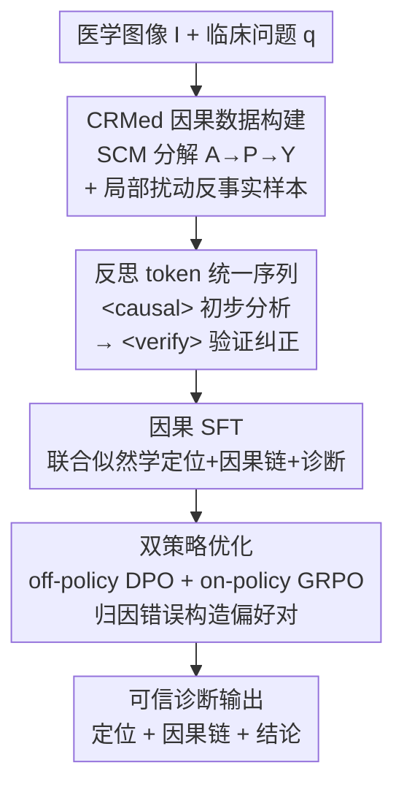

# When Models Learn to Ask Why: Adaptive Causal Reasoning for Trustworthy Medical Vision–Language Models

**会议**: CVPR 2026  
**arXiv**: [2603.23085](https://arxiv.org/abs/2603.23085)  
**代码**: https://github.com/zhcz328/MedCausalX (有)  
**领域**: 医学图像 / 多模态VLM / LLM推理  
**关键词**: 医学VLM, 因果推理, 反思token, 链式思维, 强化学习

## 一句话总结
MedCausalX 给医学 VLM 装上「按解剖→病理→诊断的因果分解」+「`<causal>`/`<verify>` 反思 token 的两阶段自纠」+「定位错误并构造偏好对的双策略 RL」，让模型在推理时自己判断何时该质疑并修正因果链，在多个医学影像基准上把诊断一致性提了 +5.4 分、幻觉降了 10+ 分。

## 研究背景与动机

**领域现状**：医学 VLM 把视觉感知和语言推理耦合起来做诊断解释、报告生成，并普遍引入链式思维（CoT）来让中间推理步骤可读、可解释，已成为临床决策支持的主流范式。

**现有痛点**：现有医学 CoT 模型没有显式机制去表示和约束「因果依赖」。结果是模型容易抓住**伪相关**——全局背景特征、语言模型先验、训练分布偏置——而不是真正建立解剖、病理、诊断之间的因果关系。表现出来就是两类典型错误：CoT 关注到错位的解剖结构，或者干脆忽略了支撑某个病理诊断的因果证据，最后给出「听起来合理、其实和临床机制对不上」的解释。

**核心矛盾**：临床医生的推理是有结构的因果链——先识别解剖异常，再解读病理表现，最后落到有医学知识支撑的诊断结论；这条链保证了决策建立在因果机制而非表面相关上。而当前 VLM 做的是模式识别，它在 token-level 上最大化似然，根本不关心整条轨迹的全局因果一致性。

**本文目标**：作者把问题拆成三个具体子挑战——(1) 怎么**自适应地**判断推理过程中「何时」需要因果纠正，而不是静态地一律套 CoT（静态 CoT 反而会把错误的因果关联固化）；(2) 怎么**低标注成本**地构造高质量的「因果 vs 非因果」对比样本来支撑这种自适应验证；(3) 怎么保证整条推理轨迹的**端到端因果一致性**。

**切入角度**：作者立足三条因果洞察——**因果组合性**（诊断是「解剖定位条件化病理刻画、二者共同决定诊断结论」的层级结构）、**因果断裂检测**（推理失败往往源于局部的因果依赖违背，所以需要自适应反思去定位并修正）、**轨迹级因果对齐**（在整条轨迹上强制全局一致性，而非只看 token 似然）。

**核心 idea**：用「结构因果模型 $A\to P\to Y$ 的数据级监督 + 反思 token 触发的两阶段自纠 + 归因错误的双策略 RL」三件套，把静态 CoT 升级成会主动「问 why」并修正的自适应因果推理。

## 方法详解

### 整体框架
MedCausalX 是端到端框架，输入是医学图像 $I$ 和临床问题 $q$，输出是带解剖定位、因果推理链、最终诊断的轨迹。它把诊断建模成一个结构化条件生成过程，对三个语义变量做因果分解：解剖标注 $A$、病理刻画 $P$、诊断结论 $Y$，联合分布因子化为

$$p_\theta(Y,P,A\mid I,q)=p_\theta(Y\mid A,P,I,q)\cdot p_\theta(P\mid A,I,q)\cdot p_\theta(A\mid I,q),$$

对应「解剖定位 → 病理解读 → 诊断决策」这条临床推理顺序。整条管线分三步：先用 **CRMed 数据集**提供细粒度解剖标注、结构化因果链和反事实变体，把因果监督灌进数据；再用带 `<causal>`/`<verify>` **反思 token 的两阶段架构**让模型自主在「初步因果分析」和「验证纠正」之间切换；最后用 **归因错误的双策略优化**（off-policy DPO + on-policy GRPO）在轨迹层面把真因果依赖和捷径关联拆开。

### 关键设计

**1. CRMed：用结构因果模型 + 局部扰动反事实，把因果监督做进数据里**

现有医学 CoT 数据有两个硬伤：推理标注大多是 LLM 事后补的「合理化解释」，会引入系统偏置、强化伪相关；而且缺乏细粒度解剖 grounding，撑不起因果分析。CRMed 直接在数据层把诊断推理表达成结构因果模型 $\mathcal{M}=\langle\mathcal{V},\mathcal{U},\mathcal{F},P(\mathcal{U})\rangle$：内生变量 $\mathcal{V}=\{A,P,Y\}$，外生变量 $\mathcal{U}=\{X_v,X_t,U_c\}$（$X_v,X_t$ 是视觉/文本的潜在变异，$U_c$ 是贯穿推理链的不可观测混淆因子），三个确定性结构函数 $A=\Phi_L(I,q,X_v,U_c)$、$P=\Phi_P(A,X_v,X_t,U_c)$、$Y=\Phi_D(P,X_v,X_t,U_c)$ 定义生成机制，构成主临床流 $A\to P\to Y$ 受混淆因子扰动的 DAG。

为了把真因果和捷径分开，CRMed 用**局部扰动**做近似干预：对解剖目标，改 bounding box 标注或合成换了解剖结构的反事实变体（近似 $do(A=\tilde a)$）；对病理目标，在固定解剖区域内替换病理标签或改写推理链里的病理部分（近似 $do(P=\tilde p)$）。作者诚实地说明这些是「局部性假设下的代理干预」，而非严格的 Pearl 干预。由此构造三类样本：$\mathcal{D}_{\text{shortcut}}$（扰动解剖 $\tilde a$ + 捷径推理链 $C^{\text{spur}}$）、$\mathcal{D}_{\text{partial}}$（扰动病理 $\tilde p$ + 逻辑不一致分析 $C^{\text{flaw}}$）、$\mathcal{D}_{\text{causal}}$（干净样本 + 临床有据的因果链 $C^{\checkmark}$）。

**2. 反思 token 的两阶段自纠：让模型自己决定「何时该质疑」**

静态 CoT 一路顺着写下去，遇到错误的因果关联只会越陷越深；临床医生却是不断回看、修正假设的。MedCausalX 在基础词表 $\mathcal{V}_0$ 上扩了两个反思 token $\mathcal{T}=\{\langle\texttt{CAUSAL}\rangle,\langle\texttt{VERIFY}\rangle\}$，训练时所有 CRMed 样本走统一序列结构

$$\mathcal{S}=(I,q,\langle\texttt{CAUSAL}\rangle,R^{\text{biased}},\langle\texttt{VERIFY}\rangle,R^{\text{gold}},y),$$

其中 $R^{\text{biased}}\in\{C^{\text{spur}},C^{\text{flaw}}\}$ 是带伪相关或逻辑不一致的「错版」推理链，$R^{\text{gold}}=C^{\checkmark}$ 是临床验证过的「金版」因果链。这就把推理强制成两阶段协议：`<causal>` 触发初步因果分析、`<verify>` 触发验证与纠正，最终产出修正后的因果一致链。关键在于——把「错版→对版」的对比直接编进同一条训练序列，模型是在**对比暴露**中学会「先给个初判，再自我审查并改正」，而不是把验证当成外挂模块。

**3. 归因错误的双策略优化：精确定位失败点，把 RL 用在刀刃上**

光有 SFT（最大化 $\log p_\theta(L,C,y\mid I,q,\mathcal{T})$ 的 $\mathcal{L}_{\text{SFT}}$）只能立起基础因果分解和自纠能力，分不清「因果有效」和「伪相关」的链。作者接一段两阶段 RL。**Stage I（off-policy DPO）**：从收集到的错误轨迹 $\mathcal{D}_{\text{error}}=\{(x_{I\&T}^i,Y_{\text{err}}^i,Y_{\text{corr}}^i)\}$ 构造偏好对，强制 $Y_{\text{corr}}\succ Y_{\text{err}}$ 用标准 DPO 损失优化。这里的巧点是**错误定位机制**——不是整条轨迹一锅端，而是通过逐步语义散度检测精确找失败点

$$t_{\text{fail}}=\min\{t\in\{1,2\}:\mathcal{S}(Y_{\text{err}}^t,Y_{\text{gt}}^t)<\tau\},$$

$\mathcal{S}(\cdot,\cdot)\in[0,1]$ 是语义相似度、$\tau$ 是散度阈值（默认 0.7）；然后在共享正确前缀 $Y_{<t_{\text{fail}}}^{\text{corr}}$ 的条件下，只对比 $t_{\text{fail}}$ 之后的续写，把学习信号集中到真正出错的临界点上，大幅提升样本效率。**Stage II（on-policy GRPO）**：对每个输入采 $G$ 条轨迹，用组内相对优势 $A^{(g)}=(R^{(g)}-\bar R)/(\sigma_R+\epsilon)$ 做策略更新，组内归一化降方差稳更新。奖励是复合的 $R(\tau)=R_{\text{acc}}+R_{\text{format}}+R_{\text{causal}}$：$R_{\text{acc}}=\mathbb{I}\{\hat y_\tau=y^*\}$ 管最终答案对不对；$R_{\text{format}}=\frac{1}{|\tau|}\sum_t\mathbb{I}\{w_t\in\mathcal{V}_{\text{valid}}\}$ 管 `<verify>`/纠正 token 的结构合法性；$R_{\text{causal}}=\frac{1}{|\mathcal{S}_\tau|-1}\sum_i\text{Cons}(s_i,s_{i+1})$ 管相邻推理步的因果一致性（$\text{Cons}$ 用 GPT-4o 做 LLM-as-judge，二值评分相邻步是否保持有效因果依赖、`<verify>` 触发的纠正是否真的修好了断裂）。off-policy 负责稳定地从既有错误里高效纠错，on-policy 负责自适应探索，二者互补。

### 损失函数 / 训练策略
基座是 Qwen2.5-VL（3B–32B，主实验用 32B），LoRA（rank 64）适配 Q/K/V 投影层。两阶段：Stage I 因果 SFT 跑 3 epoch（AdamW，$lr=1\times10^{-6}$，权重衰减 $5\times10^{-5}$，梯度裁剪 1.0，500 步 warmup + cosine）；Stage II 先 off-policy DPO 2 epoch（KL 系数 $\beta=0.1$，失败点阈值 $\tau=0.7$），再 on-policy GRPO 2000 步（$G=8$，$\epsilon=1\times10^{-8}$）。6×A100(40GB)、bf16 混合精度、梯度累积 4 步，每数据集约 56 小时，5 折交叉验证（8:1:1 分层划分）。

## 实验关键数据

### 主实验
在 5 个医学影像基准上评测（SLAKE / VQA-RAD / PathVQA / PMC-VQA 做 VQA，SA-Med2D-20M 做区域任务，MIMIC-CXR 做报告生成），对比通用 VLM、医学专用 VLM、医学 CoT 三类基线。

**医学 VQA（4 基准平均，5 折交叉验证）**：Acc 越高越好，Diag-C（诊断一致性）越高越好，Hall（幻觉率）越低越好。

| 方法 | Acc | Diag-C | Hall↓ |
|------|------|--------|-------|
| MedRegA | 77.3 | 71.2 | 50.2 |
| MedVLM-R1* | 79.1 | 73.3 | 47.1 |
| Med-R1* | 78.4 | 72.3 | 48.5 |
| **MedCausalX** | **81.2** | **78.7** | **36.4** |

相比次优的 MedVLM-R1，准确率 79.1→81.2，诊断一致性提 +5.4 分，幻觉率从 47.1 直降到 36.4（降 10.7 分）。

**区域中心空间推理（SA-Med2D-20M，多区域检测）**：16/18 指标取得最好。多区域检测 Region-F1 达 29.83%，空间 grounding F1 比 MedRegA 高 +8.59%——印证「先解剖定位、再病理刻画」的因果分解比捷径相关更能在多病灶场景对齐空间-语义。

**MIMIC-CXR 报告生成**：

| 方法 | BLEU-1 | Region Acc | Align Acc | IoU |
|------|--------|-----------|-----------|-----|
| MedRegA | 33.18 | 76.59 | 62.29 | 52.07 |
| **MedCausalX** | **37.18** | **81.12** | **67.38** | **55.71** |

### 消融实验
MIMIC-CXR 上的组件消融与训练阶段递进（BLEU-1 / Region Acc / Align Acc / IoU）：

| 配置 | BLEU-1 | Region Acc | IoU | 说明 |
|------|--------|-----------|-----|------|
| MedCausalX (Full) | 37.18 | 81.12 | 55.71 | 完整模型 |
| ✗ CRMed Dataset | 26.47 | 41.20 | 26.55 | 去结构化因果监督，崩得最狠 |
| ✗ Reflective Tokens | 29.93 | 51.20 | 38.46 | 没反思 token，无法自适应验证 |
| ✗ Causal SFT | 26.02 | 43.80 | 28.55 | 去因果 SFT 基础 |
| ✗ RL Training | 26.96 | 63.50 | 38.09 | 只 SFT，分不清因果/伪相关 |
| ✗ Error Collection | 32.02 | 75.20 | 49.55 | 去错误轨迹收集 |
| Base Model | 23.15 | 35.00 | 24.49 | 基座 |
| + Causal SFT | 32.45 | 58.30 | 38.62 | 阶段递进 |
| + DPO | 35.62 | 78.30 | 52.09 | 阶段递进 |
| + GRPO | 37.18 | 81.12 | 55.71 | 完整 |

### 关键发现
- **CRMed 贡献最大**：去掉后 BLEU-1 从 37.18 崩到 26.47、Region Acc 81.12→41.20，说明结构化因果监督是学到真 $A\to P\to Y$ 依赖的命脉。
- **反思 token 不可或缺**：去掉降到 29.93，静态管线没法自适应触发验证。
- **$\tau$ 呈倒 U 型**：$\tau=0.5$ 太敏感引入假阳污染偏好对，$\tau=0.9$ 太保守漏掉细微错误，$\tau=0.7$ 在精度/召回间最优。
- **GRPO 组大小 $G=8$ 最佳**：太小低估优势、太大边际收益递减；$G\in[8,16]$ 稳定，说明部署只需极少调参。
- **专家评测**：>20 年经验的放射科医生在 3 分制下给空间定位 1.39、诊断质量 1.48（越低越好），佐证显式因果分解确实让输出更解剖精确、诊断连贯。

## 亮点与洞察
- **把「问 why」做成可学的 token**：`<causal>`/`<verify>` 把「先初判、再自审、后纠正」编成统一训练序列，模型在错版→对版的对比暴露中学会自适应反思——这比把验证当外挂模块优雅得多，且推理时能动态决定何时触发。
- **错误定位让 RL 用在刀刃上**：用逐步语义散度找 $t_{\text{fail}}$，只在共享正确前缀后对比分歧续写，把偏好学习集中到真正出错那一步，是低成本提升样本效率的可复用 trick，可迁移到任何多步推理的 DPO 数据构造。
- **因果分解直接换来空间 grounding 收益**：强制「定位先于病理刻画」让多病灶场景的空间-语义对齐显著变好（F1 +8.59%），说明因果结构不只是「可解释装饰」，而是实打实的性能杠杆。
- **诚实标注代理干预**：作者明说局部扰动只是「局部性假设下近似 $do(\cdot)$」而非严格 Pearl 干预，这种 caveat 在因果论文里很值得学。

## 局限与展望
- **因果一致性奖励依赖 GPT-4o 当裁判**：$R_{\text{causal}}$ 的 $\text{Cons}$ 用 LLM-as-judge 给二值分，裁判本身的偏置/不稳定会直接传导到训练信号，缺一个 judge 可靠性的独立验证。
- **「干预」是近似而非真干预**：局部扰动构造的反事实建立在 locality 假设上，对跨变量的复杂混淆 $U_c$ 未必能真正阻断后门路径，因果保证更多是经验性的。
- **算力门槛高**：主结果靠 32B 基座 + 6×A100 + 每数据集 ~56h，CRMed 的细粒度解剖/因果链/反事实三层标注成本也不低，复现与扩展到新模态有门槛。
- **失败点检测只在 $t\in\{1,2\}$ 两步内**：错误定位机制目前是两阶段（causal/verify）粒度，更长的多步因果链上如何泛化未充分讨论。

## 相关工作与启发
- **vs 医学 CoT（MedCoT / MedVLM-R1 / Med-R1）**：它们把 CoT/RL 引入医学推理做可解释中间步，但都是静态顺序推理、没有显式因果机制；本文用 SCM 分解 + 反思 token 让推理可自适应纠正，幻觉率比 MedVLM-R1 低 10+ 分。
- **vs 因果医学影像方法（统计干预 / 反事实建模）**：现有工作多局限在特定 QA 设置做混淆消除；本文引入结构化因果标注 + 受控干预，系统建模「解剖→病理→诊断」全链。
- **vs 通用 RL 对齐（DPO / GRPO）**：标准 GRPO 有偏优势估计、过程级指导稀疏的问题，常做均匀纠正；本文的归因错误策略优化精确定位因果失败点、构造针对性偏好对做细粒度精修。

## 评分
- 新颖性: ⭐⭐⭐⭐⭐ 把 SCM 因果分解、反思 token 自纠、归因错误双策略 RL 三件套首次统一进医学 VLM，思路完整。
- 实验充分度: ⭐⭐⭐⭐⭐ 5 基准 + 5 折交叉验证 + 组件/阶段/超参三类消融 + 放射科医生人评，覆盖全面。
- 写作质量: ⭐⭐⭐⭐ 三挑战→三洞察→三件套的逻辑很清晰，但部分表格排版（Table 2/3.2.2 引用）略乱。
- 价值: ⭐⭐⭐⭐⭐ 临床可信诊断是刚需，幻觉降 10+ 分、空间 grounding SOTA，且方法（错误定位 DPO、反思 token）可迁移到其他高风险多步推理任务。

<!-- RELATED:START -->

## 相关论文

- [\[CVPR 2026\] Attention Consistent Longitudinal Medical Visual Question Answering Guided by Vision Foundation Models](attention_consistent_longitudinal_medical_visual_question_answering_guided_by_vi.md)
- [\[CVPR 2026\] Unleashing Video Language Models for Fine-grained HRCT Report Generation](unleashing_video_language_models_for_fine-grained_hrct_report_generation.md)
- [\[CVPR 2026\] Are General-Purpose Vision Models All We Need for 2D Medical Image Segmentation? A Cross-Dataset Empirical Study](are_general-purpose_vision_models_all_we_need_for_2d_medical_image_segmentation_.md)
- [\[CVPR 2026\] Few-Shot Synthetic Data Generation with Diffusion Models for Downstream Vision Tasks](few-shot_synthetic_data_generation_with_diffusion_models_for_downstream_vision_t.md)
- [\[CVPR 2026\] T-Gated Adapter: A Lightweight Temporal Adapter for Vision-Language Medical Segmentation](t-gated_adapter_a_lightweight_temporal_adapter_for_vision-language_medical_segme.md)

<!-- RELATED:END -->
