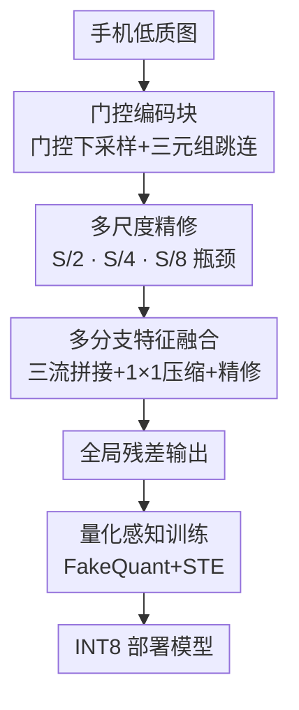

# Bridging the Training-Deployment Gap: Gated Encoding and Multi-Scale Refinement for Efficient Quantization-Aware Image Enhancement

**会议**: CVPR2026  
**arXiv**: [2604.21743](https://arxiv.org/abs/2604.21743)  
**代码**: https://github.com/GenAI4E/QATIE.git (有)  
**领域**: 模型压缩 / 量化 / 图像增强  
**关键词**: 量化感知训练(QAT)、移动端 ISP、门控编码、多尺度精修、INT8 部署

## 一句话总结
针对手机端图像增强模型"训练用 FP32、部署用 INT8 后质量暴跌"的训练-部署鸿沟，本文用门控编码 + 多尺度精修的三尺度混合 U-Net 保细节，再叠加量化感知训练(QAT)在训练时就模拟 8-bit 量化噪声，使 INT8 模型在 DPED 上比 PTQ 涨 +0.474 dB PSNR，并在高通 HTP 上把延迟从 151 ms 压到 41.8 ms（约 3.6× 加速）。

## 研究背景与动机
**领域现状**：手机拍照已是数十亿人的主力成像方式，但低端手机受小传感器、紧凑光学限制，信噪比、动态范围、色彩和锐度都远逊于单反。Deep ISP 路线（DPED、DeepISP 等）用端到端深度模型把手机图直接映射成单反质感图，配合像素损失 + 感知损失 + 对抗损失已能产出可信结果。

**现有痛点**：这些方法几乎都在 FP32/FP16 全/半精度假设下开发和评测，可移动端推理框架（TFLite）实际跑的是 8-bit 量化(INT8)。模型在连续精度域优化、却在数值精度与动态范围都被严重压缩的 INT8 下执行，导致训练时表现好、部署后掉点严重——这就是"训练-部署不匹配"。

**核心矛盾**：像素级重建任务对量化噪声远比分类敏感。Deep ISP 的激活分布是长尾、非对称、强输入依赖的，且离群激活往往直接绑定颜色与亮度信息。一旦量化不当，就会出现肉眼可见的色偏、条带、纹理失真。现有 QAT 大多为分类等高层视觉任务设计，并没有针对这种颜色敏感、重尾的激活分布建模。

**本文目标**：造一个移动端可部署的高保真图像增强模型，既要在 INT8 下不掉质量，又要满足手机硬件的严格延迟约束（FullHD on-device）。

**切入角度**：作者主张"部署一致的优化范式"——直接优化将要部署的那个模型，而不是先全精度训练再事后量化。

**核心 idea**：用对量化稳健的混合 U-Net 架构（门控编码 + 多尺度精修）保住细节，再用 QAT 在训练阶段就用伪量化(FakeQuant)+ 直通估计器(STE)模拟 INT8 行为，让网络主动学会补偿精度损失。

## 方法详解

### 整体框架
模型是一个三尺度的混合 U-Net：编码器用门控下采样把分辨率从 $S$ 压到 $S/2$、$S/4$，每个尺度做多尺度精修；瓶颈在 $S/8$ 处再精修；解码器逐级上采样，用三流融合（上采样语义特征 + 精修后的编码特征 + 门控分支保留的原始方向特征）重建，融合后再精修。整条网络训练完后并不直接收工，而是进入 QAT 阶段：插入 FakeQuant 节点模拟 INT8 前向、用 STE 让梯度绕过不可导的取整继续更新 FP32 权重，最后转成纯 INT8 模型部署。所以可以把它看成"先用对量化友好的架构把细节保住，再用 QAT 把模型逼到量化域里去适应"。

### 关键设计

**1. 门控编码块：用双分支相乘当轻量注意力，并保留三元组防细节被门掉**

普通编码器只把一个 block 的最终输出往下传，下采样时容易丢掉对像素级重建关键的方向性细节。本文的门控下采样块用两条并行卷积分支 $\mathcal{F}_a$、$\mathcal{F}_b$，各自过 tanh 得到 $\mathbf{x}_a=\tanh(\mathcal{F}_a(\mathbf{X}))$、$\mathbf{x}_b=\tanh(\mathcal{F}_b(\mathbf{X}))$，再做逐元素 Hadamard 乘得到门控主流 $\mathbf{x}_g=\mathbf{x}_a\odot\mathbf{x}_b$。这相当于一个轻量的空间-通道注意力：$\mathbf{x}_b$ 可视为对 $\mathbf{x}_a$ 激活的软掩码（反之亦然）。

关键巧思在于跳连不是只传 $\mathbf{x}_g$，而是把三元组 $(\mathbf{x}_a,\mathbf{x}_g,\mathbf{x}_b)$ 整体通过多通道跳连送到对应解码层。$\mathbf{x}_g$ 沿主路继续构建高层语义，而 $\mathbf{x}_a$、$\mathbf{x}_b$ 让解码器同时拿到"被过滤的语义信息"和"原始方向特征"。这种多流冗余正是为了把那些可能被门控操作压掉的细粒度空间细节补回来

**2. 多尺度精修：在多个分辨率上插入残差精修块，同时管住全局照度和局部纹理**

图像增强既要做全局亮度调整、又要恢复局部细节，单一尺度难以兼顾。本文在编码端 $S/2$、$S/4$ 以及瓶颈 $S/8$ 处，对门控主流做 $\tilde{\mathbf{F}}=\mathcal{R}(\mathbf{x}_g)$ 的精修，$\mathcal{R}(\cdot)$ 是 UNet 风格的残差卷积块：先用 $3\times3$ 卷积 + Instance Norm + LeakyReLU 生成中间表示，并行用 $1\times1$ 卷积保留低层信息，两路拼接后再经堆叠卷积，另用 $1\times1$ 投影构成残差捷径，最后相加。

解码端的精修发生在融合之后：$\hat{\mathbf{F}}=\mathcal{R}\big(\phi([\mathbf{F}_{up},\mathbf{F}_{enc},\mathbf{F}_{skip}])\big)$，其中 $\phi(\cdot)$ 是通道压缩算子。把精修放在多个分辨率上，既能在低分辨率抓粗粒度照度模式、又能在高分辨率恢复局部结构，且残差设计让表达力提升而计算量基本不涨。消融里它是质量的命门——去掉编码端精修，PSNR 直接从 22.194 掉到 20.398 dB

**3. 多分支特征融合：解码器三流拼接，把高层语义、精修特征和原始方向线索一起喂进重建**

只靠上采样的高层语义重建，会丢掉编码阶段的细粒度信息。解码器在每个尺度沿通道维拼接三路信息流：来自更深解码层的上采样高层语义；过 UNet 卷积块精修、保持语义一致的编码特征；以及门控分支保留下来的原始方向线索 $(\mathbf{x}_a,\mathbf{x}_b)$。三流拼接会让通道数暴涨，因此紧接一个 $1\times1$ 卷积做逐点降维，让网络学到三路特征的最优线性组合，再过精修块把聚合特征"调和"平滑后才进入下一级上采样。这条设计让模型在恢复细节的同时守住全局结构完整性

**4. 量化感知训练：训练时就用 FakeQuant + STE 模拟 INT8，让网络主动补偿量化误差**

事后量化(PTQ)在像素级任务上会因重尾激活引入严重色偏和噪声，这是训练-部署鸿沟的根源。本文把 QAT 当作最后一个优化阶段：核心是伪量化(FakeQuant)，在前向传播时把权重和激活临时映射到离散级别（带 clamp 和 rounding），但整体仍保持 FP32 计算。由于离散取整不可导，反向用直通估计器(STE)让梯度绕过这些节点，从而继续更新底层 FP32 权重。这样网络在训练中就提前"见识"了硬件量化效应，主动学会补偿精度损失与舍入误差。具体采用对称 INT8 权重 + UINT8 激活、moving-average 观测器，QAT 阶段用极小的学习率 0.00001 精修整个架构，训练完无缝转成纯 INT8 做整数推理

### 损失函数 / 训练策略
总损失为 $\mathcal{L}_{total}=\alpha\cdot\mathcal{L}_{PSNR}+\beta\cdot\mathcal{L}_{cos}+\gamma\cdot\mathcal{L}_{out}$，取 $\alpha=2.0,\beta=1.0,\gamma=1.0$。其中 PSNR 损失把信噪比归一化到 $[0,1]$：$\mathcal{L}_{PSNR}=\frac{50.0-\text{PSNR}}{100.0}$（以 50 dB 为基线），$\text{PSNR}=20\cdot\log_{10}(MAX_I/\text{RMSE})$，主管像素级重建质量；余弦相似度损失 $\mathcal{L}_{cos}=1-\frac{\mathbf{I}\cdot\hat{\mathbf{I}}}{\|\mathbf{I}\|\|\hat{\mathbf{I}}\|}$ 对齐输出与 GT 的方向以保结构完整；离群感知损失(Outlier-Aware loss)按误差分布动态加权像素，防止梯度被极端值主导。训练用 Adam + 余弦退火 + 5 epoch warmup（lr 从 0.00001 升到 0.0001），bfloat16 精度、梯度裁剪到 $[-1,1]$，在 DPED 16 万+ 个 100×100 patch 上训 50 epoch（62k+ 迭代），单卡 RTX A6000。

## 实验关键数据

### 主实验
在 Mobile AI 2026 sRGB 图像增强挑战赛上整体排名第二（runtime 在 1024×1024 上测）：

| 队伍 | PSNR↑ | SSIM↑ | MOS↑ | Adreno GPU(ms)↓ | Final Score |
|------|-------|-------|------|------------------|-------------|
| DaHua-IIG | 22.20 | 0.7881 | 4.1 | 23.8 | 163.0 |
| Capybara(本文) | 21.82 | 0.7653 | 3.2 | 291.0 | 3.8 |
| DH-XHDL-Team | 20.55 | 0.7601 | 1.2 | 30.8 | 0.28 |

⚠️ 榜单 Final Score 的量纲在原文表格中不一致（冠军 163.0 vs 本文 3.8），以原文为准；本文重建精度(PSNR/SSIM)与总分均列第二。

### 消融实验
**架构组件消融**（DPED 验证集，Full HD / FP16 / TFLite GPU Delegate）：

| 变体 | PSNR↑ | SSIM↑ | 延迟(ms) | 说明 |
|------|-------|-------|----------|------|
| Full | 22.194 | 0.796 | 469 | 完整模型（质量上界） |
| w/o Residual | 22.029 | 0.793 | 464 | 去全局残差，仅省 5 ms 但掉 0.165 dB |
| w/o Fusion Refiner | 21.940 | 0.793 | 396 | 去解码端融合精修，跌破 22 dB 门槛 |
| w/o Res Refiner | 20.398 | 0.789 | 237 | 去编码端精修，省 49.47% 延迟但掉 1.8 dB |

**量化消融**（PTQ vs QAT，跨 TFLite GPU 与高通 HTP）：

| 模型 | 精度 | PSNR↑ | SSIM↑ | TFLite GPU(ms)↓ | QNN HTP(ms)↓ |
|------|------|-------|-------|------------------|---------------|
| PTQ | FP32 | 22.358 | 0.794 | 469 | 151 |
| QAT(本文) | FP32 | 22.194 | 0.796 | 469 | 151 |
| PTQ | INT8 | 20.576 | 0.6139 | 319 | 41.4 |
| QAT(本文) | INT8 | 21.050 | 0.725 | 319 | 41.8 |

**通道宽度消融**（$c\in\{16,24,32,64\}$，1920×1080 / FP16）：

| $c$ | PSNR↑ | SSIM↑ | 参数(M) | 延迟(ms) |
|-----|-------|-------|---------|----------|
| 16 | 21.875 | 0.781 | 0.23 | 180 |
| 24 | 22.035 | 0.785 | 0.516 | 249 |
| 32 | 22.194 | 0.796 | 0.915 | 469 |
| 64 | 22.359 | 0.806 | 3.651 | 1432 |

**损失消融**：本文损失 1.67 小时训练达 22.194 dB / SSIM 0.796；Loss variant 1（用 MSSSIM 替余弦）SSIM 更高(0.8763)但 PSNR 仅 19.79 dB，且需 8.58 小时。

### 关键发现
- 编码端多尺度精修是质量的命门：去掉它 PSNR 掉 1.8 dB（22.194→20.398），是所有变体里掉点最多的，但也是最大延迟来源（去掉省 49.47%）——保质量和省延迟在这里直接对立。
- QAT 相对 INT8 PTQ 把 PSNR 拉回 +0.474 dB（20.576→21.050）、SSIM +0.111（0.6139→0.725），证明训练时模拟量化对像素级重建确实有效。
- INT8 + 专用加速器(QNN HTP)是真正的提速来源：FP16 baseline 151 ms → INT8 QAT 41.8 ms，约 72% 降幅 / 3.6× 加速；而只换 TFLite GPU 从 FP16 到 INT8 只把 469 降到 319 ms。
- $c=32$ 是甜点：比 $c=64$ 省 67.24% 延迟、74.9% 参数(3.651M→0.915M)，精度损失极小，绕开了高容量的边际递减。

## 亮点与洞察
- **门控三元组跳连**很巧：门控本身会"门掉"一部分激活，作者反其道把门控前的两条原始分支 $\mathbf{x}_a,\mathbf{x}_b$ 也一并传给解码器，等于在做注意力的同时给细节留了一条"逃生通道"，这个 trick 可迁移到任何怕丢细节的门控/注意力下采样结构。
- **"优化你将要部署的模型"这一范式**是全文最有价值的点：与其先全精度训练再事后补救(PTQ)，不如直接把 INT8 的取整噪声搬进训练 loop，让网络自己学会在量化域里 work——这对所有边缘部署的像素级任务都成立。
- **离群感知损失**针对 Deep ISP 重尾激活按误差动态加权，正好对症"离群激活绑定颜色信息、量化后色偏"的痛点，是把任务特性写进损失的好例子。
- 实验把"延迟从哪来、质量从哪来"拆得很清楚（精修块=质量+延迟双高、残差=高质量低延迟），这种归因式消融比单纯报 SOTA 更有指导意义。

## 局限与展望
- **挑战赛只拿第二**：冠军 DaHua-IIG 在 PSNR(22.20 vs 21.82)、SSIM、MOS 上全面更好，且 GPU 延迟低一个量级(23.8 vs 291 ms)，说明本文在"质量×速度"综合权衡上仍有差距，QAT 的增益没能补齐架构本身的效率短板。
- **INT8 QAT 仍掉约 1.1 dB**：FP32 22.194 → INT8 QAT 21.050，鸿沟被显著缩小但远未消除，对色彩极敏感的场景能否完全无伪影仍需更细的感知评测（论文主要靠 PSNR/SSIM + 单张定性图）。
- **仅在 DPED / iPhone-3GS↔Canon 70D 这一对设备上验证**，泛化到其他手机型号、更高分辨率、不同光照条件的能力未知。
- 改进方向：把量化敏感度做成可学习的逐层 bit 分配（混合精度 QAT），或对离群激活做更显式的 per-channel 校准，可能进一步逼近 FP32。

## 相关工作与启发
- **vs PTQ（事后量化）**：PTQ 在像素级任务上因重尾激活产生严重色偏（粉色天空）和噪声；本文 QAT 把量化噪声放进训练，INT8 下 PSNR 高出 0.474 dB、SSIM 高出 0.111，代价是要重训。
- **vs LSQ / PACT 等经典 QAT**：它们为分类等高层任务设计（全局语义对量化稳健），不显式建模颜色敏感、重尾的激活分布；本文专门面向 Deep ISP 的像素级重建，并配套离群感知损失。
- **vs 超分领域的 PTQ（density-based dual clipping / 双阶段 bound 初始化 + 蒸馏）**：那些为超分定制的联合优化在 Deep ISP / 高保真增强上基本未被探索；本文把 Deep ISP 架构与量化感知优化显式结合填了这块空白。
- **vs DPED / DeepISP / MIRNet 等增强方法**：它们几乎都在全精度下开发评测、不考虑部署约束；本文的差异在于"部署一致"——架构和训练都围绕 INT8 移动端落地设计。

## 评分
- 新颖性: ⭐⭐⭐⭐ 首次把 QAT 系统性引入 Deep ISP / 高保真图像增强，并针对颜色敏感重尾激活配套设计，切口清晰。
- 实验充分度: ⭐⭐⭐⭐ 架构/通道/损失/量化四类消融齐全，跨 TFLite GPU 与高通 HTP 实测延迟；但仅单一数据集、且挑战赛只第二。
- 写作质量: ⭐⭐⭐⭐ 动机-架构-QAT 主线清楚，公式与归因式消融到位；个别表格量纲(Final Score)不一致。
- 价值: ⭐⭐⭐⭐ "优化将部署的模型"范式 + 门控三元组跳连对边缘端像素级任务有较强可复用性。

<!-- RELATED:START -->

## 相关论文

- [\[ICML 2026\] Hierarchical Image Tokenization for Multi-Scale Image Super Resolution](../../ICML2026/model_compression/hierarchical_image_tokenization_for_multi-scale_image_super_resolution.md)
- [\[ICLR 2026\] Compute-Optimal Quantization-Aware Training](../../ICLR2026/model_compression/compute-optimal_quantization-aware_training.md)
- [\[ACL 2025\] EfficientQAT: Efficient Quantization-Aware Training for Large Language Models](../../ACL2025/model_compression/efficientqat.md)
- [\[CVPR 2026\] Unlocking ImageNet's Multi-Object Nature: Automated Large-Scale Multilabel Annotation](unlocking_imagenets_multi-object_nature_automated_large-scale_multilabel_annotat.md)
- [\[AAAI 2026\] Post Training Quantization for Efficient Dataset Condensation](../../AAAI2026/model_compression/post_training_quantization_for_efficient_dataset_condensation.md)

<!-- RELATED:END -->
