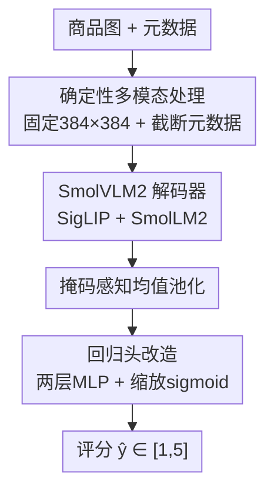

# Bounded-Compute Multimodal Regression for Product-Rating Prediction

**会议**: CVPR 2026 (LoViF 2026 Efficient VLM Challenge)  
**arXiv**: [2605.27737](https://arxiv.org/abs/2605.27737)  
**代码**: 无  
**领域**: 多模态VLM / 高效推理 / 多模态回归  
**关键词**: 紧凑VLM, 标量回归, 定长计算, 商品评分预测, SmolVLM2

## 一句话总结
把一个 256M 的紧凑生成式 VLM（SmolVLM2）改造成"算力有界"的多模态回归器——砍掉语言建模头换成两层 MLP、固定 $384\times384$ 输入并截断元数据，让每个样本的计算量恒定，最终用 228M 参数在 LoViF 商品评分任务上拿到 0.39 PLCC / 0.40 CES，排名第 3。

## 研究背景与动机

**领域现状**：视觉-语言模型（VLM）如今是多模态质量评估的默认底座，常被用来给图文内容"打分"。但主流 VLM（Qwen2.5-VL 等）天生是为**开放式文本生成**优化的——靠自回归逐 token 解码出答案，视觉侧还普遍用动态分块（dynamic tiling）或原生动态分辨率来保留细节。

**现有痛点**：当任务其实只要输出一个标量分数时，这套生成式管线就严重"水土不服"。自回归解码带来逐 token 开销；动态分块会随输入图像的长宽比生成**数量不定**的视觉 token，导致序列长度、FLOPs、延迟、显存全都随输入变化。对需要可预测延迟、固定显存、高吞吐的大规模/实时打分系统来说，这种"输入决定算力"是不可接受的。

**核心矛盾**：开放式识别/推理需要的自适应能力（动态分辨率、自回归生成），与"算力有界的标量回归"这件事的诉求（确定性、定长、低成本）天然冲突。

**本文目标**：在 LoViF 2026 高效 VLM 挑战赛的"商品评分预测"任务上，用尽可能小的参数和 FLOPs 预算，把商品图 + 结构化元数据映射成一个 $[1,5]$ 区间的平均星级。

**切入角度**：作者抓住了一条关键经验证据——Sun et al. 在短视频互动量预测上发现，**在多模态隐状态上做特征回归（轻量 MLP）持续优于自回归生成分数**。既然目标是连续分数，那隐状态回归比解码更对路。

**核心 idea**：把紧凑生成式 VLM 的语言建模头换成回归头，并通过固定分辨率 + 截断元数据强制"确定性输入"，得到一个延迟/显存恒定、可复现的有界算力回归器。

## 方法详解

### 整体框架
方法本身是一个简洁的"改造配方"：取 SmolVLM2-256M-Video-Instruct（SigLIP 视觉编码器 + SmolLM2 解码器，Idefics3 风格），把它从"会说话的生成模型"改造成"只吐一个分数的回归器"。一张商品图被强制 resize 到固定 $384\times384$，四个元数据字段（标题/描述/特征/主类目）各自截断到 $L$ 个字符后拼成定长 prompt；二者编码成多模态 token 序列送进解码器，对最终隐状态做掩码感知均值池化得到定长向量，再过两层 MLP + 缩放 sigmoid 输出 $[1,5]$ 的评分。整条管线没有任何"输入决定长度"的环节，因此每个样本的 FLOPs、延迟、显存都恒定。

### 关键设计

**1. 确定性多模态处理：用固定输入换恒定算力**

痛点直击动态分块带来的"输入决定算力"。作者把视觉侧的动态 resize 和图像切分全部关掉，所有图统一双线性插值到 $384\times384$；文本侧把每个 key–value 字段单独截断到上限 $L$（默认 $L=100$ 字符）再拼成固定模板的 prompt（`<image> The average user rating ... Title: <title>[:L], Description: ...`）。这样视觉 token 数固定、语言上下文严格有界，从源头消除了序列长度的不确定性。之所以有效，是因为商品评分是**全局语义**任务，更依赖整体呈现而非局部高分辨率细节——消融里静态全局缩放反而略胜动态分块（PLCC 0.689 vs 0.683），印证了"打分不需要细粒度裁剪"，所以放弃自适应几乎不损精度却换来完全可预测的运行时

**2. 回归头改造：把"生成分数"换成"隐状态回归"**

这是论文的核心 bet。生成式 VLM 用自回归逐 token 吐出数字，既慢又不稳。作者直接移除语言建模头，对解码器最终隐状态 $h_i\in\mathbb{R}^{d}$（$d=576$）做掩码感知均值池化得到定长表示：

$$h_{\text{pool}}=\frac{\sum_{i=1}^{T}m_i h_i}{\sum_{i=1}^{T}m_i}$$

其中 $m_i\in\{0,1\}$ 是处理器原生生成的注意力掩码，padding 位为 0——这保证只有有效视觉/文本 token 参与池化，避免 padding 稀释表示。池化向量过 `Linear(576,288) → ReLU → Linear(288,1)` 得到标量 logit $x$，再用缩放 sigmoid 约束到合法区间：

$$\hat{y}=1+4\,\sigma(x)$$

这个有界参数化从构造上就杜绝了越界预测（不会出现 $<1$ 或 $>5$ 的离谱分数）。相比自回归生成，它把"打分"变成一次前向就出结果的确定性回归，既快又可复现，且实证上精度更高

**3. 冻结视觉编码器、只微调解码器与回归头：保留预训练表征**

训练时把 SigLIP 视觉编码器和 pixel-shuffle 连接器**冻结**，只更新 SmolLM2 解码器和回归头（228M 总参数中 135M 可训练）。动机是紧凑模型的视觉预训练表征本就稀缺、来之不易，全量微调容易破坏它；把优化集中在多模态解码器和任务专属标量头上，既省显存又稳住了视觉侧的泛化能力。这一选择也契合"有界算力"的整体哲学——用最小的可训练面积撬动下游精度

### 损失函数 / 训练策略
训练目标是预测评分与真值的均方误差：

$$L=\frac{1}{N}\sum_{i=1}^{N}\left(y_{\text{pred}}^{(i)}-y_{\text{true}}^{(i)}\right)^2$$

在 4×A100 上用 DistributedDataParallel 训练，全局 batch 64，8-bit AdamW 优化器状态，峰值学习率 $4\times10^{-4}$、线性衰减、3% warmup，回归头 dropout 0.1；最多 5 个 epoch，按验证集峰值早停选 checkpoint。推理用 FlashAttention-2 + bfloat16 混合精度，单卡 A100、batch 64 下 0.0084 秒/图（119.3 图/秒）。

## 实验关键数据

数据集为 Amazon Reviews'23：对高度不均衡的类目做"流行度分层采样"（每类目取按评论数排序的 top-1M 与 bottom-1M，不足 2M 的全保留），再过滤出至少 10 条评论且有主图的商品，最终 16,455,671 训练样本、10,000 验证。评估指标：RMSE（越低越好）、PLCC / SRCC（越高越好）。

### 主实验（数据规模缩放，验证集）

| 训练数据量 | RMSE ↓ | PLCC ↑ | SRCC ↑ |
|-----------|--------|--------|--------|
| ~100K | 0.363 | 0.605 | 0.558 |
| ~1M | 0.335 | 0.679 | 0.646 |
| ~16M | **0.326** | **0.700** | **0.664** |

从 100K 扩到 16M，PLCC 提升 +0.095、SRCC +0.106——紧凑骨干能把大规模外部监督转化为可量化的质量增益，且部署成本不变。官方留出测试集上最终提交为 **0.39 PLCC / 0.40 CES，排名第 3**（官方用独立隐藏划分 + 挑战赛专属效率打分，应与验证消融分开看）。

### 消融实验（除规模外均在 1M 子集上）

| 配置 | RMSE ↓ | PLCC ↑ | SRCC ↑ | 说明 |
|------|--------|--------|--------|------|
| SmolVLM2-256M | 0.333 | 0.683 | 0.652 | 最终选用骨干 |
| SmolVLM2-500M | 0.329 | 0.694 | 0.664 | +0.011 PLCC，但参数翻倍(460M)、算力 113→165 GFLOPs |
| 动态分块 (512) | 0.333 | 0.683 | 0.652 | 默认管线 |
| 静态全局缩放 (512) | 0.331 | **0.689** | 0.657 | 确定性反而略优 |
| 分辨率 512 | 0.331 | 0.689 | 0.657 | 113 GFLOPs |
| 分辨率 384 | 0.335 | 0.679 | 0.646 | 72 GFLOPs，最终选用 |
| 截断 50 字符 | 0.340 | 0.666 | 0.628 | 65 GFLOPs |
| 截断 100 字符 | 0.335 | 0.679 | 0.646 | 72 GFLOPs，最终选用 |
| 截断 200 字符 | 0.333 | 0.685 | 0.648 | 86 GFLOPs，+0.006 但多 14 GFLOPs |

### 关键发现
- **数据规模贡献最大**：同一确定性配置下，扩到 16M 把 PLCC 推到 0.700，是所有改动里增益最显著的，说明紧凑 VLM 的瓶颈更多在监督量而非参数量。
- **"省算力"几乎不损精度**：256M vs 500M 只差 0.011 PLCC 却省一半参数；384 vs 512 只差 0.010 PLCC 却省 ~57% FLOPs（72 vs 113 GFLOPs）；截断 100 vs 200 只差 0.006 PLCC。每一处都验证了"在效率约束下，边际精度不值那点算力"。
- **静态优于动态分块**：在全局打分任务上，静态全局缩放（0.689）反超动态分块（0.683），作者推测全局评分更看整体呈现与粗语义，局部高分辨率裁剪反而是干扰。
- **CES 机制**：$\text{CES}=\text{PLCC}^{+}\times\mathcal{E}(\mathcal{C})$，其中资源成本 $\mathcal{C}=(\text{Params}/P_{\text{tgt}})^{0.5}\cdot(\text{FLOPs}/F_{\text{tgt}})^{0.5}$（$P_{\text{tgt}}=1000$M，$F_{\text{tgt}}=20$G）。本文 228M 参数、68 GFLOPs 估算得 $\mathcal{C}\approx0.881<1$，拿到正向效率乘子 $\mathcal{E}\approx1.006$。

## 亮点与洞察
- **"有界算力"是被赛制逼出来的好设计**：LoViF 用 CES 把效率写进打分，逼着作者把所有"输入决定算力"的环节（动态分块、自回归解码、变长元数据）全部钉死成定长——这套确定性管线带来稳定延迟/显存，工程落地价值很高。
- **隐状态回归 > token 生成**：把生成头换成 MLP 回归头这一步，既快又准，是把"VLM 当打分器"的通用 trick，可直接迁移到任何"图文 → 标量"的质量评估任务（美学评分、互动量预测、内容质量打分）。
- **缩放 sigmoid 兜底区间**：$\hat{y}=1+4\sigma(x)$ 用一行公式从构造上保证输出永远落在合法区间，比"训练时希望模型学会不越界"优雅得多，可复用到任何有界回归。
- **冻结视觉编码器**的选择在小模型上尤其关键——预训练视觉表征是紧凑 VLM 最值钱的部分，全量微调反而可能砸掉它。

## 局限与展望
- **作者承认**：确定性全局处理牺牲了自适应性，对那些评分依赖**细粒度局部细节**或**长文本元数据**的商品可能力不从心。
- **任务范围窄**：只针对单图 + 结构化元数据 → 单标量，缺多图/视频/长文本场景验证；且评分误差主要集中在中段评分（视觉相似、目标分布密集的质量带）。
- **绝对精度有限**：0.39 PLCC 的相关性并不算强，更多是"在严苛效率约束下的强基线"，而非高精度方案；横向比较需注意验证集与官方隐藏集不可直接比。
- **改进方向**（作者提）：条件式算力分配（按需给难样本更多计算）、面向打分任务的更强多模态预训练、对模糊样本做显式不确定性估计。

## 相关工作与启发
- **vs Sun et al.（互动量预测）**: 他们首次实证"隐状态特征回归 > 自回归分数生成"，本文把这条结论从 Qwen2.5-VL 迁到紧凑 SmolVLM2，并叠加"确定性输入"约束，目标从互动量换成商品评分。
- **vs 主流大 VLM（Qwen2.5-VL / LLaVA / Idefics3）**: 它们为开放式生成优化、用动态分辨率 + 自回归解码，算力随输入波动；本文反其道而行，主动放弃自适应换取定长有界，适配大规模实时打分。
- **vs 紧凑 VLM 路线（MobileVLM / MiniCPM-V / SmolVLM2）**: 同属"小而高效"阵营，但前者多聚焦生成任务，本文专攻**有界算力标量回归**这一差异化场景。
- **vs 多模态推荐/电商建模（VBPR 等）**: 早期把视觉特征塞进推荐框架，本文在严格参数/FLOP 预算下直接从主图 + 结构化元数据预测商品级标量评分。

## 评分
- 新颖性: ⭐⭐⭐ 方法本身是已知组件（隐状态回归 + 固定输入）的工程化组合，新意更多在"为效率约束系统性地钉死每个环节"而非全新机制
- 实验充分度: ⭐⭐⭐⭐ 容量/静态vs动态/分辨率/截断/数据规模五组消融完整，每处都给 FLOPs–精度权衡，但只在单数据集上验证
- 写作质量: ⭐⭐⭐⭐ 动机链清晰、消融与决策一一对应、效率公式交代完整
- 价值: ⭐⭐⭐⭐ 给"资源受限多模态回归"提供了可复现的强基线和一套可迁移的确定性改造配方

<!-- RELATED:START -->

## 相关论文

- [\[ICML 2026\] DenseMLLM: Standard Multimodal LLMs for Dense Prediction](../../ICML2026/multimodal_vlm/densemllm_standard_multimodal_llms_for_dense_prediction.md)
- [\[CVPR 2026\] Efficient Document Parsing via Parallel Token Prediction](efficient_document_parsing_via_parallel_token_prediction.md)
- [\[CVPR 2026\] Beyond the Mean: Modelling Annotation Distributions in Continuous Affect Prediction](beyond_the_mean_modelling_annotation_distributions_in_continuous_affect_predicti.md)
- [\[AAAI 2026\] CreBench: Human-Aligned Creativity Evaluation from Idea to Process to Product](../../AAAI2026/multimodal_vlm/crebench_human-aligned_creativity_evaluation_from_idea_to_process_to_product.md)
- [\[ICML 2026\] Injecting Distributional Awareness into MLLMs via Reinforcement Learning for Deep Imbalanced Regression](../../ICML2026/multimodal_vlm/injecting_distributional_awareness_into_mllms_via_reinforcement_learning_for_dee.md)

<!-- RELATED:END -->
