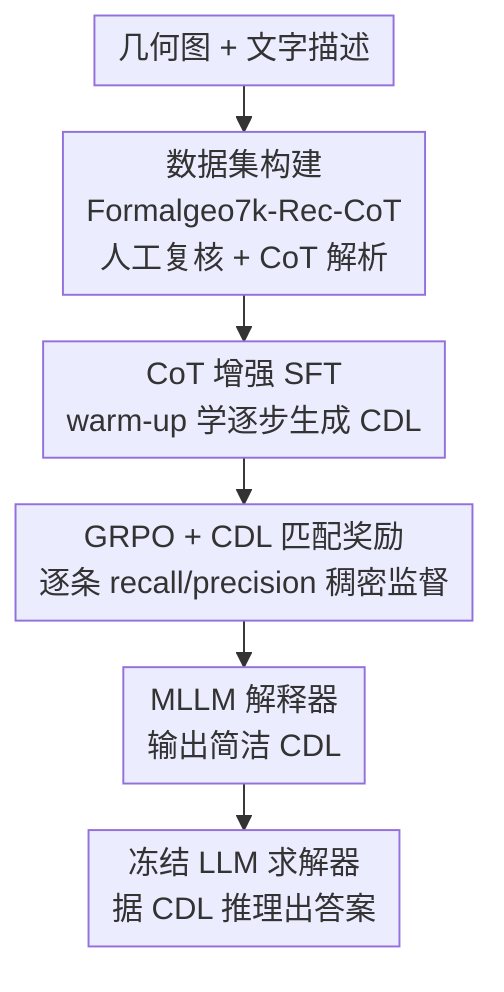

# Concise Geometric Description as a Bridge: Unleashing the Potential of LLM for Plane Geometry Problem Solving

**会议**: CVPR 2026  
**arXiv**: [2601.21164](https://arxiv.org/abs/2601.21164)  
**代码**: 待确认  
**领域**: 多模态VLM / LLM推理 / 几何题求解  
**关键词**: 平面几何求解, CDL几何描述, MLLM解释器, GRPO匹配奖励, 感知-推理解耦

## 一句话总结
与其端到端微调一个 MLLM 同时学"看图"和"推理"，本文把任务拆开：训练一个 MLLM 解释器把几何图转成简洁的形式化描述（CDL），再让一个**冻结的现成 LLM** 据此推理求解；只用 5.5k 训练数据就在多个平面几何 benchmark 上超越所有开源 MLLM、追平闭源的 Gemini2.5-Pro。

## 研究背景与动机
**领域现状**：平面几何题求解（Plane Geometry Problem Solving, PGPS）是一个多模态推理任务——给定一张几何图和一段文字描述，要算出答案。主流做法是把多模态大模型（MLLM）放到大规模几何数据上做端到端微调，让它**同时**提升视觉理解和逻辑推理能力（如 G-LLaVA 用 Geo170K、PGPSNet 用 PGPS9K）。

**现有痛点**：这种"视觉+推理"联合优化的范式有两个具体毛病。其一，MLLM 在视觉感知上仍频繁出错，比如把 $\angle ACE$ 看成 $\angle ECB$、把角度值读错，几何题对精度要求极高，一处看错满盘皆输。其二，端到端微调会**损害基座 LLM 本身的推理能力**——为了塞进视觉感知能力，模型原有的强逻辑链反而被冲淡了。

**核心矛盾**：视觉感知和符号推理被绑在同一套参数里联合训练，两者互相拖累。作者还做了一个关键观察实验（论文 Table 1）：如果把视觉信息**事先转成合适的文本**（caption 或 ground-truth CDL），纯 LLM（Qwen3 30B）配上 GT CDL 能拿到 88.4 的准确率，远高于 MLLM 直接看图的 69~82——**说明 LLM 本身就是个强求解器，瓶颈只在"怎么把图喂给它"**。

**本文目标**：把"看图"和"求解"解耦，让 MLLM 只负责把图翻译成文本、让擅长推理的 LLM 专心推理，从而不污染 LLM 的推理能力。

**切入角度**：用什么文本格式当"桥"很关键。已有工作（GF Reasoner、LVDA）用的是**通用自然语言描述**，但它冗余、非结构化，既扩大了生成的搜索空间、又让 GRPO 训练拿不到细粒度奖励（只能靠外部 solver 给一个极稀疏的对/错信号）。

**核心 idea**：选用**简洁、结构化的条件声明语言 CDL（Conditional Declaration Language）**当桥——它的简洁性既缩小了解释器的学习搜索空间，又因为可逐条解析，使得能设计出"逐条匹配"的稠密 GRPO 奖励。

## 方法详解

### 整体框架
方法是一条"解释器→求解器"的两段式流水线：MLLM 解释器（Interpreter）把几何图 + 文字描述翻译成 CDL，冻结的现成 LLM 求解器（Solver）拿 CDL 直接推理出答案。训练只动解释器、不动求解器。解释器的训练又是两阶段：先用带 CoT 的数据做 SFT 当 warm-up，再用专门设计的 CDL 匹配奖励做 GRPO 强化。为支撑训练，作者先人工复核构建了带 CoT 标注的数据集 Formalgeo7k-Rec-CoT。

### 关键设计

**1. CDL 作为感知与推理之间的"简洁桥梁"：用结构化形式语言取代冗余自然语言描述**

通用自然语言描述当"桥"有两个硬伤：冗余使描述的搜索空间过大，既难学也拖累求解；非结构化使得 GRPO 阶段无法做细粒度奖励匹配，只能退回去靠外部 solver 给稀疏信号。本文改用 CDL：它由构造语句 ConsCDL（定义图的基本结构，如基本形状、共线、共圆）和条件语句 ImgCDL / TextCDL（分别表达从图、从文本中导出的几何/代数关系，如线段长度、平行关系）组成，基于拓扑映射给出统一而严格的几何表示。CDL 的简洁性天然缩小了搜索空间，作者实测这种简洁性直接利好解释器的训练——在消融里故意往 ConsCDL 注入冗余（把通用的 "Shape" 换成更具体但不必要的 "Triangle"/"Circle Segment"）后，ConsCDL 生成质量和最终求解准确率都掉了（83.2→80.5）

**2. CoT 增强 SFT：给解释器一个"会逐步推理生成 CDL"的热启动**

直接让 MLLM 一步吐出 CDL 很难，尤其是描述图结构的 ConsCDL 需要一定推理。作者把训练数据用特殊 token 组织成 `<think> CoT </think> <cdl> CDL </cdl>` 的格式，并写了个 Python 解析器把 CDL 标注的符号关系自动翻成自然语言推理步骤，造出 (图, CoT, CDL) 的训练对。SFT 目标是最小化推理过程 $r$ 与最终描述 $y$ 的负对数似然：$\min_{\theta}\mathbb{E}_{(x,r,y)\sim\mathcal{D}}[-\log\pi_{\theta}(r,y\mid x)]$。一个关键发现是 CoT **只对 ConsCDL 有用**：ImgCDL/TextCDL 更依赖对图或文本的直接感知、不太需要逐步推理，给它们也加 CoT 反而引入干扰 token、拉高训练复杂度还掉点，所以最终只对 ConsCDL 加 CoT

**3. CDL 匹配奖励：把"逐条对错"做成稠密 reward，替掉稀疏的 solution-based 奖励**

SFT 的 next-token 目标抓不住精确的逻辑约束，所以接 GRPO。但传统 GRPO 在 PGPS 里用的是 solution-based 奖励——拿 LLM 求解结果和标准答案比对，这是对整套 CDL 的**整体**评判，信号极稀疏，数据少、采样空间受限时几乎学不动。本文改为对 ConsCDL / ImgCDL / TextCDL **各设一个匹配奖励** $S_C, S_I, S_T$，做法是把生成的 CDL 和标准 CDL 逐条贪心匹配：遍历每个预测条目 $p$，在标准集合里找第一个完全匹配的 $g$ 并移除，匹配成功对数为 $M=m-|G'|$，再算召回 $R=M/m$（鼓励完整）和精度 $P=M/n$（惩罚错误与重复），取均值 $S_C=(R+P)/2$。再加一个格式奖励 $S_f$（输出符合 `<think>...</think><cdl>...</cdl>` 标签则为 1，否则 0），总奖励 $S=\alpha S_f+\gamma S_C+(1-\alpha-\gamma)(S_I+S_T)$，其中 $\alpha=0.1,\gamma=0.5$。GRPO 对每组 $n$ 个候选按 $A_i=\frac{s_i-\text{mean}(s)}{\text{std}(s)}$ 算优势并带 KL 惩罚更新策略。这套稠密、逐条的监督正是"用结构化 CDL 当桥"才得以实现的——通用自然语言描述根本没法逐条匹配

**4. 冻结的现成 LLM 求解器：让推理能力"零损耗"地保留下来**

求解阶段直接用一个现成且冻结的 LLM（Qwen3 30B），输入是解释器生成的 CDL（**去掉 CoT**，只留最终 CDL），由它据此推理出答案。求解器全程不参与训练，彻底避免端到端微调污染其推理能力——这正是开头那个观察（LLM+GT CDL 能到 88.4）落地为"实际可用系统"的方式：解释器负责把图翻准，推理交给本就强的 LLM

### 损失函数 / 训练策略
SFT 阶段最小化 $-\log\pi_{\theta}(r,y\mid x)$，跑 3 epoch、batch size 8、学习率 $1e\text{-}5$。RL 阶段用 GRPO 最大化 $\mathcal{J}(\theta)$（带 clip 与 $\beta$ KL 惩罚），跑 15 epoch、batch size 128、学习率 $1e\text{-}6$、每个样本 rollout $N=8$。LLM 求解器始终冻结。训练集为 Formalgeo7k-Rec-CoT，按 0.8/0.2 划分得 5,550 训练 / 1,390 验证对。

## 实验关键数据

### 主实验：平面几何求解准确率（Table 4）
基座解释器为 Qwen 系列，求解器为 Qwen3 30B；仅用 5.5k 数据。

| 模型 | 训练数据量 | Formalgeo(域内) | Unigeo(OOD) | MathVista(OOD) |
|--------|------|------|------|------|
| GPT-4o（闭源） | - | 58.0 | 43.9 | 47.1 |
| Claude-Opus-4.1（闭源） | - | 69.1 | 74.2 | 63.1 |
| Gemini2.5-Pro（闭源） | - | 81.8 | **84.6** | **81.3** |
| Qwen2.5-VL 32B（开源） | - | 57.3 | 67.9 | 66.8 |
| GLM4.1-V（开源） | - | 73.4 | 79.2 | 80.4 |
| DFE-GPS（开源, PGPS专用） | 238k | 75.3 | - | - |
| GF Reasoner（开源, PGPS专用） | 184k | - | 72.7 | 64.9 |
| **本文** | **5.5k** | **85.7** | 84.0 | 80.8 |

本文在域内 Formalgeo 上反超 Gemini2.5-Pro 3.9%（85.7 vs 81.8），OOD 上与之基本持平，且训练数据量比 DFE-GPS/GF Reasoner 小一两个数量级。

### CDL 生成质量（Table 2，Formalgeo-Rec-CoT 验证集，召回/精度）
| 方法 | 训练数据 | TextCDL R/P | ImgCDL R/P | ConsCDL R/P |
|------|------|------|------|------|
| FgeoParser (Diag.+Text) | 14.7k | 96.5 / - | 77.5 / - | 87.0 / - |
| Diagram Formalizer | 11M | - | 92.9 / - | 90.3 / - |
| Qwen2.5-VL 7B (SFT) | 5.5k | 96.5/96.6 | 95.1/93.5 | 70.0/68.3 |
| Qwen2.5-VL 7B (RL) | 5.5k | 99.1/99.1 | 97.0/96.9 | **92.7/92.1** |
| Qwen3-VL 8B (RL) | 5.5k | 99.2/99.3 | 97.0/96.9 | 95.9/95.8 |

关键看 ConsCDL：SFT 后仅 70.0 召回，经 GRPO 匹配奖励后飙到 92.7（7B），用 11M 数据训练的 Diagram Formalizer 也才 90.3——稠密匹配奖励对最难的结构生成贡献最大。

### 消融实验（均在 Qwen2.5-VL 7B）
| 配置 | ConsCDL R/P | 求解 Acc. | 说明 |
|------|------|------|------|
| 完整（简洁CDL + 全奖励 + ConsCDL CoT） | 92.7/92.1 | **83.2** | 完整模型 |
| 注入冗余、非简洁 CDL | 91.6/90.7 | 80.5 | 搜索空间变大，掉 2.7 |
| 加 solution-based 奖励 | 91.5/91.1 | 81.3 | 稀疏信号反而拖累，掉 1.9 |
| 无 CoT | 81.7/81.5 | 76.3 | ConsCDL 质量大跌，掉 6.9 |
| 仅 ConsCDL CoT（采用） | 92.7/92.1 | 83.2 | 最优 |
| ConsCDL+ImgCDL+TextCDL 全加 CoT | 92.0/91.7 | 81.7 | 多余 CoT 反成干扰 |

奖励逐项叠加（Table 7）：$S_C$→加 $S_I$→加 $S_T$→加 $S_f$，ConsCDL 召回从 92.0 逐步到 92.7，每个奖励都有正贡献。

### 关键发现
- GRPO + CDL 匹配奖励对**最难的 ConsCDL** 提升最猛（SFT 70.0 → RL 92.7），是性能跃升的主引擎。
- "简洁性"不是口号：人为破坏 CDL 简洁性后求解准确率掉 2.7，验证了"窄搜索空间利好学习"的假设。
- solution-based 稀疏奖励不仅没用、加进来还掉点（83.2→81.3），印证稠密逐条监督的必要性。
- CoT 要"对症下药"：只给需要推理的 ConsCDL 加 CoT 最优，无脑全加反而掉点。

## 亮点与洞察
- **"先翻译再推理"的解耦范式**：用一个动机实验（LLM+GT CDL 达 88.4）精准定位瓶颈在"喂图方式"而非"LLM 推理能力"，进而把多模态推理拆成"MLLM 当翻译官 + 冻结 LLM 当推理机"，干净利落地绕开了端到端微调污染推理能力的老问题。
- **奖励设计随表示形式而变**：最巧妙之处是"选 CDL"和"设计匹配奖励"是一体两面——正因为 CDL 结构化可逐条解析，才能把整体稀疏的 solution reward 改造成逐条的 recall/precision 稠密 reward，把数据效率压到 5.5k。这个"换一种中间表示来解锁更好奖励信号"的思路可迁移到代码生成、结构化抽取等任意"能逐条比对正确性"的 RL 任务。
- **数据效率惊人**：5.5k 数据打过 238k 的专用模型、追平闭源 SOTA，说明"把问题表示对"比"堆数据"更关键。

## 局限与展望
- 强依赖 CDL 这种**已有形式化语言**和高质量 CDL 标注，迁移到没有现成形式语言的领域（如物理示意图、化学结构）需要先定义并标注对应的形式描述，成本不低。
- 解释器和求解器**两段式级联**会有误差传播：解释器把图翻错（尤其 ConsCDL 仍非 100%），求解器再强也救不回来，系统天花板被翻译精度卡住。
- 求解器固定用 Qwen3 30B，论文未充分探讨换更弱/更强 LLM 时整体表现如何，"桥"的通用性还需更多验证。
- 评测集中在平面几何，是否能推广到立体几何、含函数图像的题目尚未验证。

## 相关工作与启发
- **vs 端到端 PGPS（G-LLaVA / PGPSNet / DFE-GPS）**: 他们在大规模数据上联合微调 MLLM 的感知与推理；本文把两者解耦、冻结 LLM 求解器。优势是不污染推理能力且数据省两个数量级（5.5k vs 170k~238k），劣势是依赖形式化 CDL 标注、且有级联误差传播。
- **vs 图转文本类方法（GF Reasoner / LVDA）**: 同样走"先把图转文本再求解"，但它们用通用自然语言描述，冗余且非结构化，导致搜索空间大、GRPO 只能靠外部 solver 的稀疏奖励；本文用简洁结构化的 CDL，使逐条匹配的稠密奖励成为可能，这是性能差距的根因。
- **vs 几何解析器（FgeoParser / Diagram Formalizer）**: 它们用专门解析器把图转 CDL，但 FgeoParser 需图/文双解析器、Diagram Formalizer 要 11M 数据且只能处理图不能处理文本；本文用统一 MLLM 同时吃图和文本，5.5k 数据即在 ConsCDL 上反超。

## 评分
- 新颖性: ⭐⭐⭐⭐⭐ "解耦感知与推理 + 用结构化表示解锁稠密奖励"是一个干净且有洞察的范式重构。
- 实验充分度: ⭐⭐⭐⭐ 域内/OOD 多 benchmark、多基座、奖励/CoT/简洁性逐项消融都齐全；缺对求解器替换的系统性分析。
- 写作质量: ⭐⭐⭐⭐⭐ 动机实验（Table 1）开门见山，逻辑链"观察→范式→表示→奖励"环环相扣。
- 价值: ⭐⭐⭐⭐⭐ 5.5k 数据追平闭源 SOTA，"换中间表示以解锁更好奖励"的思路对结构化 RL 任务有广泛借鉴意义。

<!-- RELATED:START -->

## 相关论文

- [\[ICCV 2025\] Pi-GPS: Enhancing Geometry Problem Solving by Unleashing the Power of Diagrammatic Information](../../ICCV2025/multimodal_vlm/pi-gps_enhancing_geometry_problem_solving_by_unleashing_the_power_of_diagrammati.md)
- [\[CVPR 2026\] BiCLIP: Domain Canonicalization via Structured Geometric Transformation](biclip_domain_canonicalization_via_structured_geometric_transformation.md)
- [\[CVPR 2026\] Devil is in Narrow Policy: Unleashing Exploration in Driving VLA Models](devil_is_in_narrow_policy_unleashing_exploration_in_driving_vla_models.md)
- [\[CVPR 2026\] CogniVerse: Revolutionizing Multi-Modal Retrieval-Augmented Generation with Cognitive Reflection and Geometric Reasoning](cogniverse_revolutionizing_multi-modal_retrieval-augmented_generation_with_cogni.md)
- [\[AAAI 2026\] OmniPT: Unleashing the Potential of Large Vision Language Models for Pedestrian Tracking and Understanding](../../AAAI2026/multimodal_vlm/omnipt_unleashing_the_potential_of_large_vision_language_models_for_pedestrian_t.md)

<!-- RELATED:END -->
