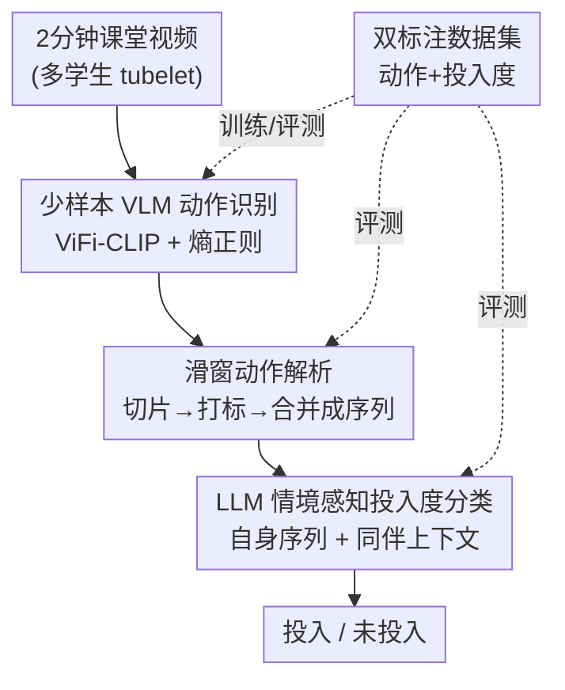

# Context Matters: Peer-Aware Student Behavioral Engagement Measurement via VLM Action Parsing and LLM Sequence Classification

**会议**: CVPR 2026  
**arXiv**: [2601.06394](https://arxiv.org/abs/2601.06394)  
**代码**: https://github.com/ahmed-nady/context_aware_student_engagement (有)  
**领域**: 多模态VLM / 视频理解 / 教育智能  
**关键词**: 学生投入度、行为识别、ViFi-CLIP、LLM零样本、情境感知

## 一句话总结
提出一个 VLM + LLM 的三阶段框架：先用少样本微调的 ViFi-CLIP 把每段课堂视频解析成「时序动作序列」，再让 LLM 结合**同伴动作上下文**对序列做零样本分类，判断学生是「投入(engaged)」还是「未投入(disengaged)」——核心论点是同一个动作在不同课堂情境下含义相反，必须看上下文，最终在自建数据集上达到 88% 加权 F1。

## 研究背景与动机
**领域现状**：课堂学生行为投入度(behavioral engagement)分析此前主要分三类——动作识别(只给出动作标签)、学习分析(给出姿态/视线/表情等特征)、投入度测量。近年从单帧检测转向时序动作定位(TAL)，并有工作用 LLM 生成行为报告。

**现有痛点**：(1) 公开数据集极度稀缺——隐私顾虑导致绝大多数研究只能用各自的私有数据，无法复现与横向比较；(2) TAL 类方法会忽略「背景」片段(如听讲、扭头看后方)，而这些恰恰对投入度判断很重要；(3) 已有工作 Abdelkawy 等[2]用「动作直方图 + 视线」做分类，但区间内的动作没有人工标注，分类器评估不完整；(4) 几乎所有方法都**只看目标学生本人的动作，完全忽略课堂情境**。

**核心矛盾**：同一个可观测动作在不同情境下可能指向相反的投入状态。例如学生扭头和同伴说话——在传统讲授课上是「未投入」，但在老师布置的「同伴讨论」环节里却是「投入」;盯着笔记本电脑——在独立解题时是专注投入，在老师讲课时刷社交媒体则是未投入。脱离同伴行为这个上下文，单看个人动作必然误判(见原文 Fig.1：连续敲键盘的学生，若周围同伴都没在记笔记，反而应判为未投入)。

**本文目标**：(a) 在数据稀缺下做出可用的学生课堂动作识别器；(b) 把目标学生动作 + 同伴情境一起喂给分类器，做出情境感知的投入度判断；(c) 验证「动作序列」是否比「动作直方图」更能刻画行为，以及 VLM/LLM 能否胜任这两步。

**核心 idea**：用「少样本 VLM 解析动作序列 + LLM 零样本读同伴上下文做分类」替代「需大量标注的端到端模型」，把投入度判断建模为对**带时序、带同伴情境的动作序列**的语言推理问题。

## 方法详解

### 整体框架
输入是一段 2 分钟、多名学生同时出现的课堂视频；输出是目标学生在这 2 分钟内的二分类标签(投入 / 未投入)。流程分三步串行：① 先离线用少量带标注的修剪短视频，把 ViFi-CLIP 微调成能识别 13 类课堂动作的识别器；② 在线时把每名学生的 tubelet(时空管)用滑动时间窗切成不重叠片段，逐段用 VLM 打动作标签，并把连续相同的预测合并成「带时长的有序动作序列」;③ 把目标学生的动作序列 + 同伴们在同一时段的多数动作(课堂情境)拼成 prompt，交给零样本 LLM 输出投入度标签。注意：阶段 2、3 都是**训练-free** 的(滑窗 + 零样本提示)，只有阶段 1 需要少样本微调。

### 关键设计

**1. 少样本 ViFi-CLIP 动作识别：用 16 个样本就把通用 VLM 适配到课堂细粒度动作**

痛点直击数据稀缺：课堂动作没有公开大规模标注集，而「读书 vs 写字」「盯屏幕不打字 vs 低头不读写」这些类别差异极细，通用 VLM 零样本根本分不开(ViFi-CLIP 零样本 top-1 只有 52.1%)。作者选用 Video Fine-tuned CLIP(ViFi-CLIP)而非加额外时序模块的 XCLIP/ActionCLIP——因为 [24] 发现这些附加模块反而损害 CLIP 的泛化性，而对 CLIP 做**全量微调**更稳。具体：把片段 $S_i\in\mathbb{R}^{T\times H\times W\times C}$ 的 $T$ 帧经 CLIP 图像编码器后平均池化得视频级表示 $v_i\in\mathbb{R}^{D}$，类别名套进 prompt(「a photo of a \<category\>」)经文本编码器得 $t_i$，每类只用 16 个 clip、以交叉熵最大化 $v_i$ 与 $t_i$ 的余弦相似度。关键的额外一招是**熵正则**：在损失里加一项最大化预测熵，惩罚「过度自信的错误预测」，缓解少样本下的过拟合。这样只用极少标注就把识别器拉到 97.9% top-1，且在低/中样本区间比 XCLIP 普遍更高(K=2/4/8 分别 +4.5%/+2.2%/+4.6%)

**2. 滑窗动作解析成「时序序列」而非「直方图」：让顺序和节奏可见**

针对「直方图丢掉时序」这个痛点。学生动作是连续、不可预测的长视频，没法直接当成单动作短片处理。作者用滑动时间窗(窗长=步长=3 秒=45 帧)把 2 分钟切成 40 个不重叠片段，逐段用阶段 1 的 VLM 打标，再把连续相同标签合并，得到既保留**动作身份**又保留**时长/顺序**的序列。为什么序列优于直方图：直方图只累计「每个动作做了多久」，会把两种本质不同的行为判成一样——一个学生大部分时间记笔记、只在开头或结尾连续玩 25 秒手机，仍可算投入;但若他在记笔记和频繁快速看手机之间反复横跳，则因「无法维持认知专注」而判为未投入。这两种情况直方图(总时长)几乎相同，唯有**顺序与节奏**能区分,所以时序序列才是更准的行为刻画

**3. LLM 零样本情境感知分类：把「同伴上下文」写进 prompt，纠正个人动作的歧义**

这是全文题眼「Context Matters」的落点。把投入度判断建模为 prompt-based 语言推理：prompt $x_{prompt}=\{x_{desc};x_{input}\}$ 由任务描述 $x_{desc}$(说明如何依据学生动作和课堂情境判投入度)和输入 $x_{input}$ 拼成，LLM 零样本生成标签 $y\in\{engaged, disengaged\}$。$x_{input}$ 关键在于**两条带时间戳的序列并排**——目标学生自身动作序列(如「writing on tablet (00:00-00:20); listening (00:20-01:05)…」)＋课堂情境(同伴在该时段的多数动作，如「listening (00:00-00:10); writing (00:10-00:50)…」)。有了同伴这条参照线，LLM 才能判断「连续敲键盘」到底是认真解题还是开小差(取决于周围同伴是否在做同类任务)。推理时温度设 0.1 保证确定性输出。这一步无需任何训练，直接靠 LLM 的零样本泛化把「同样的动作、相反的含义」掰开

**4. 双标注课堂数据集：补上公开 benchmark 与「逐段动作真值」的双重缺口**

针对「无公开集 + 评估不完整」两个痛点，作者自建数据集，刻意拆成两个子集以便**逐阶段独立评测**。动作子集:7 名受试者在受控环境演示 13 类课堂动作，208 个训练 clip(每类 16 个)+ 46 个测试 clip，专门评阶段 1。投入度子集:3 节半小时讲课、11 名学生的真实课堂，按学生切成 2 分钟片段共 455 个,由心理学/教育学专家标注 engaged/disengaged(400 投入 / 55 未投入，类别严重不均衡)，**且每个 2 分钟片段还被逐段人工打上动作标签**——正是这份 dense 动作真值，让阶段 2(动作分割)和阶段 3(投入度分类)能分别被严格评估，补上了 [2] 留下的评估漏洞

### 损失函数 / 训练策略
阶段 1 总损失为交叉熵 + 熵正则：

$$L_{total}=-\frac{1}{N}\sum_{i}^{N}\log(p_i)+\frac{1}{N}\sum_{i}^{N}\Big(-\sum_{k=1}^{C}p_{i,k}\log(p_{i,k})\Big)$$

其中 $p_i=\dfrac{\exp(\mathrm{sim}(v_i,t_i)/\tau)}{\sum_j \exp(\mathrm{sim}(v_j,t_j)/\tau)}$。第一项是标准对比/分类交叉熵，第二项最大化预测分布熵以抑制过度自信。训练配置:ViFi-CLIP(ViT-B/16)、K=16/类、batch 32、lr $2\times10^{-6}$、50 epoch、AdamW(weight decay 0.001)、余弦退火;每 clip 取 16 帧、resize 到 $224\times224$。滑窗与步长均 3 秒(45 帧)→ 每 2 分钟 40 段。LLM 温度 0.1。

## 实验关键数据

### 主实验

阶段 1 动作识别(测试集 46 实例，top-1 准确率)：

| 模型 | K=2 | K=4 | K=8 | K=16 |
|------|-----|-----|-----|------|
| TC-CLIP | 52.2% | 52.2% | 80.4% | 93.5% |
| XCLIP | 43.2% | 79.6% | 88.6% | 97.9% |
| ViFi-CLIP(本文) | 47.7% | 81.8% | 93.2% | 97.9% |

阶段 3 端到端投入度分类(Gemma-2-9B + 自动动作解析，加权平均)：

| 动作解析方式 | 类别 | Recall | Precision | F1 |
|--------------|------|--------|-----------|----|
| Gemini-2.5-Pro 解析 | disengaged | 0.58 | 0.43 | 0.49 |
| Gemini-2.5-Pro 解析 | weighted avg | 0.85 | 0.88 | **0.86** |
| 本文 VLM 解析 | disengaged | 0.53 | 0.52 | 0.52 |
| 本文 VLM 解析 | weighted avg | 0.88 | 0.88 | **0.88** |

与既有工作[2](直方图 + 随机森林，LOOCV)对比，本文 VLM 解析 + Gemma：

| 方法 | disengaged F1 | weighted F1 |
|------|---------------|-------------|
| [2] 直方图 + RF | 0.47 | 0.85 |
| 本文(序列 + 上下文) | **0.52** | **0.88** |

### 消融实验

阶段 2 时序动作分割(在带 dense 真值的投入度集上)：

| 解析方式 | Accuracy(MoF) | Edit | F1@10 | F1@25 | F1@50 |
|----------|---------------|------|-------|-------|-------|
| Gemini-2.5-Flash | 57.2 | 37.4 | 39.0 | 34.5 | 25.3 |
| Gemini-2.5-Pro | **69.8** | **51.8** | **58.2** | **55.2** | **45.2** |
| 本文 VLM 解析 | 67.0 | 45.7 | 48.3 | 43.9 | 31.4 |

阶段 3 不同 LLM(用人工动作真值，加权 F1)：Llama-3-8B 0.91、Gemma-2-9B **0.92**、GPT-3.5-turbo 0.89。

跨课程泛化(另一门课、8 名新学生、113 个 2 分钟片段)，加权 F1：人工真值 0.88、Gemini-2.5-Pro 解析 0.72、本文 VLM 解析 0.81——本文比 Gemini-Pro 解析高 9 个百分点。

### 关键发现
- **VLM 动作解析的「下游一致性」比单点精度更重要**：Gemini-2.5-Pro 在 TAS 单项指标上全面领先本文 VLM(MoF 69.8 vs 67.0)，但跑到端到端投入度分类时本文 VLM 反而更高(88% vs 86%)——作者归因于本文解析在 on-/off-task 动作上更一致，更利于 LLM 做最终判断。
- **disengaged 类是难点**：投入/未投入严重不均衡(400:55)，且存在天然歧义——学生在平板上涂鸦被专家标为未投入但动作标签只识别为「写字」;发呆但姿态像在听讲被标成 listening。这导致即便用人工真值，disengaged 的 F1 也只到 0.68 左右。
- **序列 > 直方图**得到实证支持:disengaged F1 从 0.47 提到 0.52，正是因为序列保留了「频繁打断」这种节奏信息。
- 跨课程实验里 Gemini-Pro 解析掉到 0.72，本文 VLM 仍有 0.81，说明少样本适配的领域识别器泛化更稳。

## 亮点与洞察
- **「Context Matters」是真把上下文落进 prompt**：不是泛泛而谈，而是把同伴在同一时间戳的多数动作作为第二条序列与目标学生并排喂给 LLM，让「同一动作、相反含义」可被语言模型直接推理——这个把「社会情境」编码成可读文本的思路，可迁移到任何「个体行为依赖群体情境」的视频理解任务(会议参与度、团队协作分析)。
- **解析精度≠下游收益**:本文最反直觉的发现是单项 TAS 指标更高的 Gemini-Pro 端到端却更差，提醒做「感知→推理」级联系统时，中间模块的优化目标应对齐下游一致性而非孤立精度。
- **熵正则在少样本 VLM 微调里的实用性**:一行额外损失就显著压住过拟合，是低资源领域适配 CLIP 类模型的可复用 trick。
- **训练-free 的后两阶段**：阶段 2/3 全靠滑窗 + 零样本提示，无需任何投入度标签训练，极大降低落地门槛——新课堂只需补少量动作 clip 微调阶段 1 即可。

## 局限与展望
- **disengaged 识别仍弱**(F1 0.52)：根因是动作粒度不够细(写字 vs 涂鸦不分)、以及姿态歧义(发呆被当听讲)，需要更细的动作字典或引入视线/表情等额外模态。
- **数据规模与多样性有限**:动作集仅 7 人受控录制、投入度集仅 3 节课 11 人(主集)+1 节课 8 人(跨课程)，且面向工科 STEM 入门课，13 类动作字典是为该场景定制，能否推广到文科/低龄课堂存疑。
- **同伴情境用「多数动作」表示**可能过于粗糙:只取时段内同伴的多数动作，丢失了「具体是哪些同伴、空间邻近关系」，对「邻座小声讨论 vs 全班讨论」这类细分情境可能仍不够。
- **依赖 tubelet 提取**：上游需要可靠的多人时空管提取，遮挡严重(原文提到 inter-student occlusion)时会引入噪声，论文未深入评估该上游误差的传播。
- 改进思路:把同伴上下文从「多数动作」升级为带空间关系的图结构;引入细粒度手部动作区分写/画;在更多课程类型上验证。

## 相关工作与启发
- **vs Abdelkawy 等[2](直方图 + 随机森林)**：他们把动作频率压成直方图 + 视线做分类、且区间内动作无人工标注;本文用**带顺序的时序序列**替代直方图、补上 dense 动作真值，并加入同伴上下文，disengaged F1 0.52 vs 0.47、加权 0.88 vs 0.85。
- **vs Yu 等[37](LLM 生成行为报告)**：他们用 LLM 把每名学生的时序动作生成「行为报告」，但不给出显式投入度标签、也不考虑同伴情境;本文 LLM 直接输出投入/未投入二分类并显式建模课堂上下文。
- **vs TAL/TAD 类方法**：传统时序动作定位忽略「背景」片段(听讲、扭头)，而这些对投入度恰恰关键;本文滑窗逐段打标，不丢背景动作。
- **vs ActionCLIP/XCLIP**：它们给 CLIP 加额外时序模块做视频识别，[24] 指出这会损害泛化;本文沿用 ViFi-CLIP 的全量微调路线并在少样本设定下加熵正则，K=8 时比 XCLIP 高 4.6%。

## 评分
- 新颖性: ⭐⭐⭐⭐ 「同伴情境写进 LLM prompt」做投入度判断的视角清晰且有说服力，但 VLM+LLM 级联本身是常见范式。
- 实验充分度: ⭐⭐⭐⭐ 三阶段逐段评测 + 消融 + 跨课程泛化都做了，但数据规模偏小、disengaged 样本太少。
- 写作质量: ⭐⭐⭐⭐ 动机(Context Matters)讲得透彻，图文与研究问题对应清楚。
- 价值: ⭐⭐⭐⭐ 提供了带双标注的公开数据集 + 低门槛训练-free 管线，对教育智能落地有实用价值。

<!-- RELATED:START -->

## 相关论文

- [\[CVPR 2026\] Towards Real-World Document Parsing via Realistic Scene Synthesis and Document-Aware Training](towards_real-world_document_parsing_via_realistic_scene_synthesis_and_document-a.md)
- [\[ACL 2026\] STELLA: A Multimodal LLM for Protein Functional Annotation via Unified Sequence-Structure Encoding](../../ACL2026/multimodal_vlm/stella_a_multimodal_llm_for_protein_functional_annotation_via_unified_sequence-s.md)
- [\[CVPR 2026\] CoVFT: Context-aware Visual Fine-tuning for Multimodal Large Language Models](covft_context-aware_visual_fine-tuning_for_multimodal_large_language_models.md)
- [\[ICML 2026\] LIMSSR: LLM-Driven Sequence-to-Score Reasoning under Training-Time Incomplete Multimodal Observations](../../ICML2026/multimodal_vlm/limssr_llm-driven_sequence-to-score_reasoning_under_training-time_incomplete_mul.md)
- [\[CVPR 2026\] Efficient Document Parsing via Parallel Token Prediction](efficient_document_parsing_via_parallel_token_prediction.md)

<!-- RELATED:END -->
