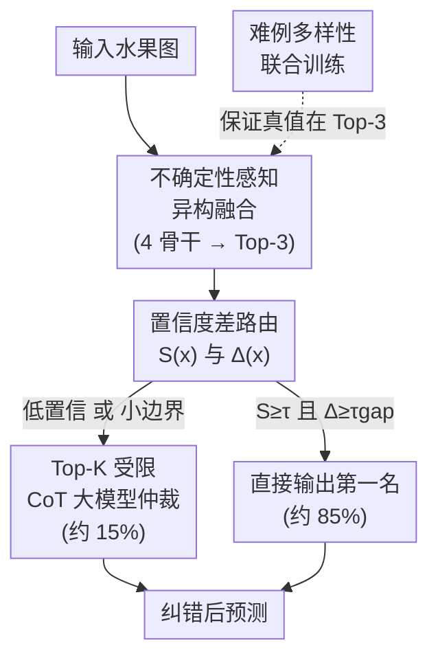

# FruitEnsemble: MLLM-Guided Arbitration for Heterogeneous Ensemble in Fine-Grained Fruit Recognition

**会议**: CVPR 2026  
**arXiv**: [2605.20892](https://arxiv.org/abs/2605.20892)  
**代码**: https://mybkgjvgnd.github.io/Fruit-306-Dataset/ (项目页，含数据/代码/prompt)  
**领域**: 多模态VLM / 细粒度分类 / 农业视觉  
**关键词**: 细粒度果品识别、异构集成、置信度路由、MLLM 仲裁、长尾分布

## 一句话总结
针对"几百个长得几乎一样的水果品种"这种细粒度分类难题，本文先建了一个 306 类、11.6 万张真实场景的 Fruit-306 数据集，再提出 FruitEnsemble——简单样本由四个异构 CNN/ViT 加权集成快速判，只有集成"拿不准"的样本（约 15%）才升级让多模态大模型 Qwen-VL-Plus 在 Top-3 候选里借助专家植物学描述做思维链仲裁，最终在保持 19.8 ms 单模型级延迟的同时把 Top-1 准确率做到 70.49%。

## 研究背景与动机

**领域现状**：果品品种识别（cultivar recognition）属于细粒度视觉分类（FGVC），主流做法是用 CNN（ResNet/DenseNet/EfficientNet）、ViT 或它们的静态集成来纯视觉分类。视觉骨干网络已经相对成熟、推理快。

**现有痛点**：单模型在"几百个视觉高度相似的品种"上不够鲁棒——比如红富士和嘎啦苹果在颜色、形状、大小上几乎一样，区分只能靠皮孔密度、条纹、光泽这类微弱线索，而这些线索又极易被光照、遮挡、成熟度干扰。静态集成虽然更鲁棒，但它对**每个样本都用同样的全套计算**，无法按难度自适应——在高吞吐分拣线上，大多数样本其实很好分，统一重算非常浪费。另一边，多模态大模型（MLLM）虽然能跨模态推理、可解释，但 zero-shot 在品种级细粒度上很不稳定，且延迟高（Qwen-VL-Plus 单次 1250 ms），单独当高吞吐分类器不现实。

**核心矛盾**：识别准确率和推理效率之间存在 trade-off——纯视觉够快但搞不定细粒度长尾难例；无差别上大模型够强但部署昂贵且缺领域知识接地（grounding），容易幻觉。

**本文目标**：分解为三个子问题——(1) 补齐贴近真实、带文本描述的细粒度果品 benchmark；(2) 让简单样本走轻量路径、难例才用昂贵推理；(3) 用大模型时约束它别在整个标签空间乱猜。

**切入角度**：作者观察到"难易样本严重不均衡"——既然只有少数难例需要重推理，就该把昂贵算力**条件触发**地花在它们身上，而不是平摊。同时大模型的价值不在"开放生成分类"，而在"在少数候选里做有据可依的验证"。

**核心 idea**：用**置信度门控的两阶段动态推理**代替静态集成——视觉异构集成出 Top-3 候选，只有置信度低/边界模糊时才触发 MLLM 在这 3 个候选内、配合专家植物学描述做思维链仲裁。

## 方法详解

### 整体框架
FruitEnsemble 形式化为一个四元组 $\mathcal{F}=(\mathcal{M},\mathcal{A},\mathcal{R},\Phi_{\text{LLM}})$：异构骨干集成 $\mathcal{M}$、不确定性感知聚合算子 $\mathcal{A}$、置信度差触发的路由器 $\mathcal{R}$、Top-$K$ 受限的大模型仲裁器 $\Phi_{\text{LLM}}$。一张水果图先过四个互补骨干（ResNet50 / DenseNet201 / EfficientNetB7 / ViT-B/16），用熵加权融合出系统概率分布 $P_{\text{sys}}$，取 Top-3 候选并算出最大置信度 $S(x)$ 和首二名差距 $\Delta(x)$；路由器据此二选一：要么直接输出第一名（直接路径，约 85% 样本），要么把样本和 Top-3 候选连同候选品种的专家文本描述喂给 Qwen-VL-Plus 做思维链推理、产出纠错后的最终预测（仲裁路径，约 15%）。训练侧再加一个"只对难例生效"的多样性损失，保证 Top-3 里大概率包含真值，给后续仲裁兜底。

### 关键设计

**1. 不确定性感知异构融合：用预测熵动态加权，让"此刻更确定"的骨干说了算**

静态平均集成的问题是：不管某个骨干在当前这张图上到底靠不靠谱，都给它固定权重。本文挑了四个**归纳偏置互补**的骨干（DenseNet201 抓皮纹纹理、EfficientNetB7 多尺度、ViT 建模长程全局形态、ResNet50 做稳健基线），并按每个骨干在当前样本上的**预测熵** $\mathcal{U}_i(x)=-\sum_c P_i(x)_c\log P_i(x)_c$ 做 softmax 加权：

$$\alpha_i(x)=\frac{\exp(-\mathcal{U}_i(x)/\tau_{temp})}{\sum_{j=1}^{4}\exp(-\mathcal{U}_j(x)/\tau_{temp})},\quad P_{\text{sys}}(x)=\sum_{i=1}^{4}\alpha_i(x)P_i(x)$$

熵越低（越确定）的骨干权重越大。这样融合不是"一刀切平均"，而是逐样本地把话语权交给当下最自信的专家，再从 $P_{\text{sys}}$ 取 Top-3 候选集 $\mathcal{C}_{\text{top}}$，为后续路由和仲裁打底

**2. 置信度差仲裁路由：不只看最大概率，还看首二名差距，专抓"两个相似品种二选一"的犹豫**

只用最大概率 $S(x)$ 当置信度会被骗：模型可能"自信地错"，也可能在两个相似品种间高度纠结却仍有较高的 $P_{c_1}$。作者额外定义首二名差距 $\Delta(x)=P_{\text{sys}}(x)_{c_1}-P_{\text{sys}}(x)_{c_2}$，用**双条件**触发仲裁：

$$\mathcal{R}(x)=\mathbb{I}\big(S(x)<\tau_{conf}\ \lor\ \Delta(x)<\tau_{gap}\big)$$

即"置信度低 **或** 边界太窄"任一成立就升级。$\mathcal{R}(x)=0$ 直接输出 $c_1$，$\mathcal{R}(x)=1$ 走大模型路径（论文取 $\tau_{conf}=0.60$）。$\Delta$ 这一项正是为细粒度场景定制的——它专门拦截"概率分布在两个长得很像的品种上对半开"的样本，避免集成在精细边界上草率拍板

**3. Top-K 受限的思维链仲裁：把大模型从"开放生成分类器"降格为"3 选 1 验证器"，靠植物学描述接地**

让 MLLM 在 306 类整个标签空间里自由生成极易幻觉。本文把它的假设空间硬约束到视觉集成给出的 Top-3 候选 $\mathcal{C}_{\text{top}}$（$K\ll|\mathcal{Y}|$），并为每个候选注入专家整理的文本描述 $T_c$（形态、颜色、纹理、局部结构）。大模型按两步推理：先抽取判别性视觉属性 $A=\text{Extract}(V(x))$（如皮光泽、萼部结构），再做先验匹配与冲突惩罚：

$$\hat{y}_{\text{llm}}=\arg\max_{c\in\mathcal{C}_{\text{top}}}\big(M_c-\lambda_{\text{pen}}\cdot\text{Conflict}(A,T_c)\big)$$

其中 $M_c=\text{Similarity}(A,T_c)$ 是属性与候选描述的语义对齐分。检索到的描述被塞进标准化 CoT 模板，并强制大模型以严格 JSON 输出以防解析错误和幻觉。这一步把大模型用在了刀刃上：不是"它来认水果"，而是"在视觉模型已经圈定的三个嫌疑里，拿植物学知识逐条核对、排除矛盾项"

**4. 难例感知联合优化：多样性损失只施加在路由器标记的难例上，专门把真值"顶进" Top-3**

整套系统能成立的隐含前提是——难例的真值得真的落在 Top-3 里，否则仲裁器再强也无米下锅。训练损失为：

$$\mathcal{L}_{\text{total}}=\underbrace{\sum_{i=1}^{4}\mathcal{L}_{\text{focal}}(P_i,y)}_{\text{各骨干}}+\lambda_1\underbrace{\mathcal{L}_{\text{focal}}(P_{\text{sys}},y)}_{\text{全局}}+\lambda_2\underbrace{\mathcal{L}_{\text{div}}^{\text{hard}}}_{\text{多样性}}$$

Focal Loss 应对长尾类不均衡。关键是多样性项 $\mathcal{L}_{\text{div}}^{\text{hard}}$ 只对路由器判定为难的样本子集 $\mathcal{B}_{\text{hard}}=\{x\mid\mathcal{R}(x)=1\}$ 生效，最大化骨干两两间的 JS 散度：

$$\mathcal{L}_{\text{div}}^{\text{hard}}=\frac{1}{|\mathcal{B}_{\text{hard}}|}\sum_{x\in\mathcal{B}_{\text{hard}}}\Big[-\sum_{i\neq j}\text{JS}(P_i(x)\parallel P_j(x))\Big]$$

为什么只在难例上加？因为对简单样本强推多样性会破坏骨干对清晰模式已达成的共识；只在模糊样本上逼骨干去探索互补特征子空间（纹理 vs 形状），既稳住了易例，又让难例的 Top-3 更可能覆盖真值——直接为后续大模型仲裁的成功率服务

### 损失函数 / 训练策略
除上面的联合损失外，训练用 AdamW（初始 lr $5\times10^{-5}$、weight decay 0.01）、batch size 8、100 epoch；Focal Loss 取 $\gamma=2.0$、$\alpha$ 与类频率成反比。每个骨干用**定制化高分辨率鲁棒微调**（Algorithm 1）：拓扑感知冻结（只解冻最后决策块以保留通用特征）、NaN 感知跳 batch + 非有限梯度裁剪的容错流、EMA 当时间集成、余弦退火热重启调度。输入多为 $224\times224$，EfficientNetB7 用 $600\times600$。聚合温度 1.0、路由置信阈值 0.60、$K=3$；Qwen-VL-Plus 用 CoT、最大生成 512、temperature 0.7，并加响应缓存降重复推理延迟。

## 实验关键数据

数据集 Fruit-306：306 类、116,233 张真实场景图，固定 7:1:2 划分（训练 81,223 / 验证 11,488 / 测试 23,522），长尾严重（最大类 jaboticaba 1,276 张，最小类 muscadine_grape 仅 25 张，不均衡比 50:1），且每类配专家文本形态描述——这正是它区别于 Fruits-360 / VegFru 的核心（既真实又长尾又带文本）。

### 主实验（Fruit-306 测试集，14 个单骨干 vs 本文）

| 模型 | Top-1 Acc | Top-5 Acc | 延迟 (ms) | 备注 |
|------|-----------|-----------|-----------|------|
| ResNet50 | 0.6503 | 0.8658 | 12.5 | 集成成员之一 |
| DenseNet201 | **0.6850** | 0.8802 | 18.2 | 单模型最高 Top-1 |
| EfficientNetB7 | 0.6283 | **0.8916** | 45.6 | 单模型最高 Top-5 |
| ViT-B/16 | 0.5969 | 0.8831 | 32.4 | 集成成员之一 |
| InceptionResNetV2 | 0.6734 | 0.8062 | 25.6 | 较强 CNN 基线 |
| Qwen-VL-Plus (纯大模型) | 0.5638 | – | 1250 | zero-shot，慢且差 |
| **FruitEnsemble (本文)** | **0.7049** | **0.9150** | **19.8** | 85% 走直接路径 |

相比最强单骨干 DenseNet201（0.6850），FruitEnsemble Top-1 提升约 +2.0%，Top-5 提升到 0.9150；论文以 ResNet50 基线（约 65.5%）为参照口径报"+5.0% 绝对提升（65.5%→70.5%）"。延迟仅 19.8 ms，是纯大模型 Qwen-VL-Plus（1250 ms）的约 1/63，几乎逼近单模型级别。

### 消融实验（逐组件叠加，Top-1 Acc %）

| 配置 | 异构集成 | TTA | 大模型仲裁 | Top-1 (%) | 增量 |
|------|:---:|:---:|:---:|---------|------|
| Baseline (ResNet50) | – | – | – | 65.03 | – |
| + 异构集成 | ✓ | – | – | 68.50 | +3.47 |
| + 测试时增强 (TTA) | ✓ | ✓ | – | 68.92 | +0.42 |
| + 大模型仲裁 (本文) | ✓ | ✓ | ✓ | 70.49 | +1.57 |

### 关键发现
- **异构集成贡献最大**：单从 65.03→68.50（+3.47），证实 CNN 与 Transformer 归纳偏置互补是主力；TTA 边际很小（+0.42）。
- **大模型仲裁是"补刀"而非主引擎**：+1.57，证明把昂贵推理留给约 15% 难例这一设计的性价比——小代价换来细粒度边界上的纠错。
- **⚠️ 触发率存在口径不一致**：摘要/方法多处说"只对约 15% 样本触发大模型"，但 Fig. 6 又称随触发率 0%→40% 准确率仅从 68.90% 微升到 70.49%、最优触发率约 38.5%。两个数字（15% vs 38.5%）对不上，且 Fig.6 起点 68.90% 对应消融表里"+TTA 无仲裁"那一行——以原文为准，实际部署触发率可能取决于阈值设定。
- **大模型增益本就有限**：Fig. 6 曲线很平，说明集成对多数样本已高置信，大模型只在少数真·难例上有用。

## 亮点与洞察
- **"难易分流 + 候选受限"是把大模型用在刀刃上的范式**：不让 MLLM 当 306 类的开放分类器，而是当"3 选 1 验证器"，既砍掉幻觉风险又把延迟摊薄到 19.8 ms——这套"视觉模型出候选、大模型在小集合内据描述核对"的思路可直接迁移到任何细粒度长尾分类（鸟类、车型、病虫害）。
- **置信度差 $\Delta$ 比单看最大概率更懂细粒度**：用首二名 margin 捕捉"两个相似类对半开"的纠结，是个便宜又对症的路由信号，可复用到任何 selective prediction / 早退场景。
- **多样性损失只打难例**：把"逼集成成员分歧"这件可能伤害简单样本共识的事，精确限定在难例子集，并直接服务于"真值进 Top-3"这个下游目标——损失设计和推理机制咬合得很紧。
- **数据集带文本描述**：Fruit-306 给每类配专家植物学描述，是少见的"视觉+文本"细粒度农业 benchmark，为知识引导的多模态推理提供了评测土壤。

## 局限与展望
- **绝对精度仍偏低**：Top-1 仅 70.49%，离实际分拣线的可靠性还有距离，长尾尾部类（仅 25 张）很难学好。
- **大模型增益微弱且口径存疑**：消融里仲裁只 +1.57，Fig. 6 显示曲线很平，且 15% 与 38.5% 触发率说法不一致——大模型这一最"亮"的组件实际价值可能被夸大，需更清晰的统一口径。
- **依赖人工专家描述**：每类都要专家整理形态文本，扩类成本高，且描述质量直接决定仲裁上限。
- **阈值靠经验定**：$\tau_{conf}=0.60$、$\tau_{gap}$ 均为经验值，跨数据集迁移性未验证；用闭集 306 类，开放/新品种场景未覆盖。
- **改进思路**：可让文本描述由大模型自动生成+人工校验以降扩类成本；把路由阈值做成可学习/自适应；探索让仲裁器同时复核 Top-K 之外的"集成漏掉真值"的兜底机制。

## 相关工作与启发
- **vs 静态异构集成（如普通 weighted ensemble）**：它们对每个样本都跑全套并用固定融合规则，本文用熵动态加权 + 置信度门控做**自适应计算**，把算力按样本难度分配——同等精度下延迟从"4×CNN+LLM"降到 $4T_{CNN}+\gamma T_{LLM}$（$\gamma\approx0.15$）。
- **vs 纯 MLLM（Qwen-VL-Plus / GPT-4V zero-shot）**：它们当独立分类器既慢（1250 ms）又在品种级不稳（0.5638），本文把大模型约束成 Top-3 验证器并注入植物学先验，准确率和延迟同时碾压。
- **vs 自适应推理（早退网络、动态集成选择 DES）**：以往多限于同构模型族，本文首次把"轻量视觉分类器 + 强推理大模型"的异构协作系统化用到农业细粒度识别。
- **vs 农业 benchmark（Fruits-360 / PlantVillage / VegFru）**：它们要么受控背景、要么无文本、要么粗粒度，Fruit-306 同时具备细粒度、真实场景、自然长尾、文本描述四要素。

## 评分
- 新颖性: ⭐⭐⭐⭐ 置信度差路由 + Top-K 受限大模型仲裁 + 难例多样性损失的组合在农业细粒度上系统性较强，但各组件单看多为已有思想的工程化拼装。
- 实验充分度: ⭐⭐⭐ 主表对比 14 个骨干、消融清晰，但仲裁触发率口径前后矛盾、缺与其它动态推理/集成方法的直接对比、绝对精度偏低。
- 写作质量: ⭐⭐⭐⭐ 动机与方法链路讲得清楚、公式完整，但触发率数字不一致是明显瑕疵。
- 价值: ⭐⭐⭐⭐ Fruit-306 数据集（带文本描述、真实长尾）和"难易分流用大模型"的部署导向范式对农业视觉落地有实用价值。

<!-- RELATED:START -->

## 相关论文

- [\[AAAI 2026\] Heterogeneous Uncertainty-Guided Composed Image Retrieval with Fine-Grained Probabilistic Learning](../../AAAI2026/multimodal_vlm/heterogeneous_uncertainty-guided_composed_image_retrieval_with_fine-grained_prob.md)
- [\[CVPR 2026\] MA-Bench: Towards Fine-grained Micro-Action Understanding](ma-bench_towards_fine-grained_micro-action_understanding.md)
- [\[CVPR 2026\] CropVLM: Learning to Zoom for Fine-Grained Vision-Language Perception](cropvlm_learning_to_zoom_for_fine_grained_vision_language_perception.md)
- [\[CVPR 2026\] Concept-wise Attention for Fine-grained Concept Bottleneck Models](coat_cbm_concept_wise_attention.md)
- [\[CVPR 2026\] DeAR: Fine-Grained VLM Adaptation by Decomposing Attention Head Roles](dear_fine-grained_vlm_adaptation_by_decomposing_attention_head_roles.md)

<!-- RELATED:END -->
