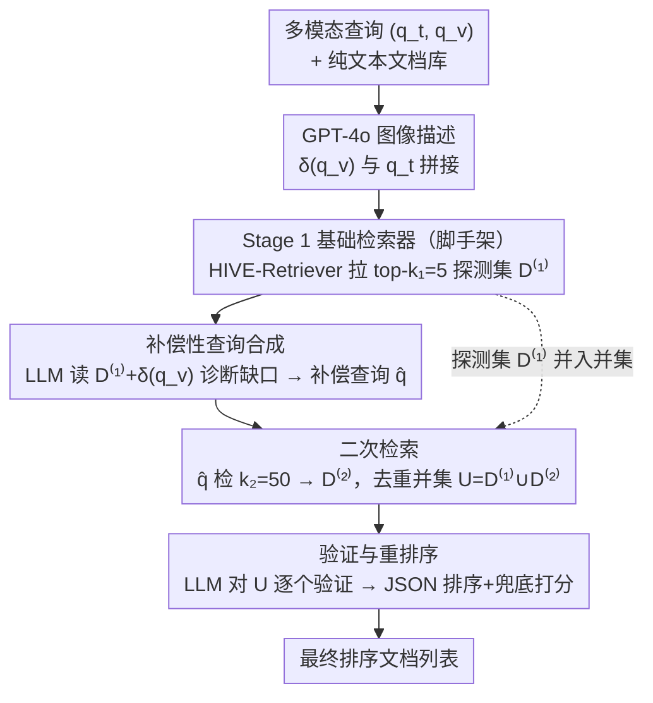

# HIVE: Query, Hypothesize, Verify — An LLM Framework for Multimodal Reasoning-Intensive Retrieval

**会议**: CVPR 2026  
**arXiv**: [2604.07220](https://arxiv.org/abs/2604.07220)  
**代码**: [https://github.com/mm-bright/multimodal-reasoning-retrieval](https://github.com/mm-bright/multimodal-reasoning-retrieval)  
**领域**: 多模态VLM  
**关键词**: 多模态检索, 视觉推理, 查询重构, LLM重排序, 假设驱动检索

## 一句话总结

HIVE 是一个即插即用的多模态检索框架，通过四个阶段——初始检索 → LLM 驱动的补偿性查询合成（显式表达视觉推理缺口）→ 二次检索 → LLM 验证重排序——将推理密集型多模态检索的 nDCG@10 从最佳多模态模型的 27.6 提升至 41.7（+14.1 绝对点），无需任何额外训练。

## 研究背景与动机

1. **领域现状**：密集检索（bi-encoder）是大规模信息检索的主流范式，在 BEIR 等事实型基准上表现优异（nDCG@10 达 59.0）。但在推理密集型查询上（如 BRIGHT 基准）性能暴跌至 18.3。近期工作如 DiVeR 通过推理感知微调、迭代查询扩展和混合重排序来缓解，但仅限于纯文本领域。

2. **现有痛点**：真实查询越来越多地包含图像（错误截图、科学图表、电路图等）。MM-BRIGHT 基准显示，SOTA 多模态检索模型仅 27.6 nDCG@10——比纯文本检索器（32.2）还差。加入视觉信息反而损害了性能。根本原因：嵌入模型只做表面语义匹配，无法推理图像内容对文档相关性的暗示。

3. **核心矛盾**：标准多模态检索器通过 $\text{score}(q,d) = \cos(\phi(q_t, q_v), \psi(d))$ 计算相关性，但这个公式完全没有机制来推理"查询图像暗示了什么"。例如查看到一个电路图+"LED 不亮"的查询，检索系统需要理解电路拓扑才能找到相关文档，而嵌入相似度做不到这一点。

4. **本文目标** (a) 如何在不重训模型的前提下为检索注入视觉推理能力？(b) 如何弥合嵌入匹配与推理密集型检索之间的鸿沟？

5. **切入角度**：LLM 在看到初始检索结果后，能精准识别"哪些视觉和逻辑维度是查询需要但检索器没有覆盖的"，从而生成针对性的补偿查询。这类似于人类专家在看到不满意的搜索结果后会重构查询。

6. **核心 idea**：让 LLM 作为"视觉推理中介"，在两轮检索之间生成补偿性查询来显式表达检索器无法捕获的视觉-逻辑关联，然后通过验证重排序过滤噪声。

## 方法详解

### 整体框架

HIVE 要解决的是"推理密集型多模态检索"：查询里带着图像——错误截图、电路图、科学图表——但密集检索器只会做表面语义匹配，看不懂图像内容对文档相关性意味着什么。它的破局思路是不动检索器，纯靠推理时的一套流程，让 LLM 站在嵌入检索和文档库之间充当"视觉推理中介"。

整条 pipeline 分四步走，且能包住任何现成检索器。输入是多模态查询 $(q_t, q_v)$（文本 + 图像），文档库为纯文本。先用基础检索器拉一个小探测集（Stage 1）；LLM 读完探测结果和图像描述后诊断出"哪些视觉-逻辑维度查询需要、但检索器没覆盖"，据此合成一条补偿查询（Stage 2）；拿补偿查询在更大窗口里再检一轮（Stage 3）；最后把两轮结果的并集交给 LLM 做验证和重排（Stage 4）。全程零训练，全在推理时跑完。

框架包住的基础检索器本身也是论文单独训的一块——HIVE-Retriever：基于 Qwen3-Embedding-4B，在合成的困难负样本上做对比训练，取 EOS token 最后一层隐状态当嵌入、用余弦相似度检索；遇到多模态查询时先用 GPT-4o 把图像转成描述 $\delta(q_v)$，再和文本 $q_t$ 拼起来喂进去。这条描述在四个阶段里复用，GPT-4o 也因此身兼三职：图像描述、补偿查询合成（Stage 2）、验证重排（Stage 4）。HIVE-Retriever 单独就已经把纯文本 SOTA（DiVeR 32.2）顶到 33.2，而四阶段框架在它之上再加到 41.7。

### 关键设计

**1. 补偿性查询合成：从初始检索"没检到什么"里反推出该补的查询**

第一轮检索回来的文档往往不对题——查询图像是 Python 堆栈跟踪，检回的却是泛泛的调试文章。HIVE 不丢掉这批结果，而是把它当成诊断信号：哪里没覆盖、缺了什么。具体做法是同时把三样东西喂给 LLM——原始文本查询 $q_t$、GPT-4o 生成的图像描述 $\delta(q_v)$、以及初始检索的 top-$k_1$ 文档 $\mathcal{D}^{(1)}$，让它（1）识别图像里超出文本查询的内容、（2）判断探测文档对查询意图哪些没覆盖或只覆盖了一半、（3）合成一条简洁的补偿查询 $\hat{q}$：

$$\hat{q} = \mathcal{L}\big(\text{HypothesisPrompt}(q_t,\, \delta(q_v),\, \{d_{r_i}\}_{i=1}^{k_1})\big)$$

关键差别在于这条扩展同时被"图像视觉内容"和"初始检索的真实结果"双重条件化。普通查询扩展只孤立改写文本，泛泛地换词；HIVE 的补偿查询是冲着缺口去的——比如把图像里具体的错误类型和模块名补进去，专门填那块漏掉的语义，而不是把原查询又说一遍。

**2. 二次检索：用补偿查询在更大窗口里捞回初始遗漏的文档**

补偿查询 $\hat{q}$ 指向的语义子空间和原始查询并不重合，所以第二轮要用更宽的搜索窗口才捞得全——这里把检索数从 $k_1=5$ 放大到 $k_2=50$。两轮结果取并集 $\mathcal{U} = \mathcal{D}^{(1)} \cup \mathcal{D}^{(2)}$（去重保序），候选池规模 $|\mathcal{U}| \leq k_1 + k_2$。放大 $k_2$ 是有意为之：既然补偿查询覆盖的是原查询没碰到的区域，就得搜得更广，才能把被第一轮漏掉的相关文档真正找回来。

**3. 验证与重排序：把扩展带来的噪声筛掉，把最终精度定下来**

扩大候选覆盖率的代价是把噪声也一并放了进来，于是最后一步让 LLM 当"验证代理"收口。给它完整的视觉-文本查询上下文和并集里所有候选文档，让它逐个推理哪些文档真正解决了用户的多模态意图，输出一串排好序的 JSON 文档 ID。打分上做了全覆盖兜底：被 LLM 选中的 $k_f$ 个文档拿高分 $S_{\max} - \text{rank}_i$（$S_{\max}=1000$），没被选中的按原始检索顺序拿 $S_{\text{base}} - \text{offset}_i$（$S_{\text{base}}=500$），保证每个候选都有分、不会丢。这一步和前两步是协同关系：消融里只做 Stage 2-3（扩展不验证）得 38.1，只做 Stage 4（验证不扩展）得 37.2，两者合起来才到 41.7。

### 一个完整示例

拿一个真实查询走一遍：用户贴了一张 Python 堆栈跟踪截图，配文"为什么会报这个错"。Stage 1 用基础检索器拉回 $k_1=5$ 篇，结果全是泛泛的"如何调试 Python"教程——图像里那个具体的异常类型和出错模块完全没被利用。Stage 2 里 LLM 同时看到截图描述 $\delta(q_v)$、原始问法和这 5 篇不对题的文档，诊断出缺口在"具体错误 + 具体模块"，合成补偿查询 $\hat{q}$（把截图里的异常名和模块名显式写进去）。Stage 3 拿 $\hat{q}$ 检回 $k_2=50$ 篇，和第一轮并集去重后得到约 50 余篇候选。Stage 4 让 LLM 对着完整查询语境把这批候选逐一验证、重排，选中的少数几篇拿到上千分顶到前面，其余按原序兜底。最终 nDCG@10 从基础检索器的 33.2 抬到 41.7，整条链路一次训练都没用上。

## 实验关键数据

### 主实验

在 MM-BRIGHT（2803 个查询，29 个技术领域）上的 nDCG@10：

| 方法 | 类型 | nDCG@10 |
|------|------|---------|
| CLIP | 多模态 | 10.4 |
| Nomic-Vision | 多模态 | 27.6 |
| DiVeR | 纯文本 | 32.2 |
| HIVE-Retriever (base) | 文本增强 | 33.2 |
| **HIVE (完整)** | **框架** | **41.7** |

HIVE 在 29 个领域中的 28 个取得最佳成绩。表现最强的领域：Gaming 68.2，Law 64.6，Ubuntu 53.6。

### 消融实验

| 配置 | nDCG@10 | 说明 |
|------|---------|------|
| HIVE-Retriever (无框架) | 33.2 | 基线 |
| + Stage 2 only (补偿查询) | 35.3 (+2.1) | 查询扩展有帮助 |
| + Stage 4 only (验证重排序) | 37.2 (+4.0) | 验证贡献更大 |
| + Stage 2+3 (扩展无验证) | 38.1 (+4.9) | 扩展覆盖率 |
| **Full HIVE (1-4)** | **41.7 (+8.5)** | 扩展+验证协同 |

即插即用验证（不同基础检索器）：

| 基础检索器 | Base | +HIVE | Δ |
|-----------|------|-------|---|
| CLIP | 10.4 | 20.5 | +10.1 |
| Nomic-Vision | 27.6 | 34.1 | +6.5 |
| HIVE-Retriever | 33.2 | 41.7 | +8.5 |

### 关键发现

- **跨所有基础检索器一致提升**：无论是弱检索器（CLIP +10.1）还是强检索器（HIVE-Retriever +8.5），HIVE 框架都带来显著提升，且弱检索器受益更大（补偿查询覆盖更大的语义缺口）
- **补偿查询合成和验证重排序有明显协同效应**：两者单独使用各贡献 +2.1 和 +4.0，但组合后达到 +8.5，超过简单加法
- **视觉信息密度决定增益幅度**：HIVE 在图像承载密集领域信息的领域增益最大（Academic +22.8, Economics +28.1, Sustainability +24.7），在抽象领域（Quantum Computing, Cryptography）增益最小
- **唯一失败案例分析**：Salesforce 领域中 GME-7B（47.3）优于 HIVE（44.9），因为 CRM 截图的结构化布局被对比训练的 GME-7B 直接捕获，补偿查询的边际收益很小
- **轻量配置仍有效**：即使 $k_1=3, k_2=30$ 的最小配置，也比基线提升 5 个点（38.2 vs 33.2）

## 亮点与洞察

- **"诊断失败 → 针对性弥补"的两轮检索范式**非常优雅：第一轮的结果不只是作为回答的候选，更是作为"哪里做得不够"的诊断信号。这种"从初始结果的缺陷中生成改进方向"的思路可以迁移到很多 iterative refinement 场景
- **将 LLM 作为检索管线中的推理引擎**是一个重要趋势：LLM 不是替代嵌入检索，而是在嵌入检索的能力之上叠加推理，两者互补。这种设计模式（cheap fast retrieval + expensive LLM reasoning）具有广泛的适用性
- **完全无需训练的推理时增强**极大降低了使用门槛：任何检索系统都可以立即接入 HIVE，不需要重训模型
- 领域级别的详细分析找到了 HIVE 的能力边界：当图像携带的额外信息极少时（如抽象的量子计算图），补偿查询的帮助有限

## 局限与展望

- 依赖 GPT-4o 做图像描述、补偿查询合成和验证重排序，三次 LLM 调用带来高推理成本
- 图像描述 $\delta(q_v)$ 是整个管线的潜在瓶颈——如果 GPT-4o 对图像的理解有误，后续补偿查询会被误导
- 仅测试了多模态→文本的检索场景，多模态→多模态的场景未涉及
- 候选分数的打分策略（$S_{\max}=1000, S_{\text{base}}=500$）较为启发式，可能不是全局最优
- 未与端到端训练的推理增强检索器做对比（如用 RL 从检索反馈中学习补偿查询生成）

## 相关工作与启发

- **vs DiVeR**: DiVeR 是纯文本的推理增强检索器（文档预处理+反馈式查询扩展+混合重排序），在 BRIGHT 上 SOTA。HIVE 的基础检索器已超越 DiVeR（33.2 vs 32.2），框架进一步拉开差距至 41.7
- **vs Nomic-Vision**: 当前最好的多模态嵌入检索器（27.6），但嵌入相似度无法推理图像暗示。HIVE 在其上叠加框架可提升至 34.1
- **vs ColPali/VisRAG**: 这些方法处理视觉文档检索（文档也是图像），HIVE 处理多模态查询→纯文本文档的不同场景，互补而非竞争

## 评分

- 新颖性: ⭐⭐⭐⭐ "从初始检索失败中诊断缺口并生成补偿查询"的范式新颖且有效，但四阶段管线在方法论上相对直接
- 实验充分度: ⭐⭐⭐⭐⭐ 29 个领域的全面评估 + 5 个基础检索器的即插即用验证 + 组件消融 + 超参敏感性分析，非常充分
- 写作质量: ⭐⭐⭐⭐ 问题定义清晰，实验分析深入，领域级别的分析提供了有价值的洞察
- 价值: ⭐⭐⭐⭐⭐ 无训练的即插即用设计实用性极高，14.1 点的绝对提升在检索领域是非常显著的

<!-- RELATED:START -->

## 相关论文

- [\[CVPR 2026\] Explore with Long-term Memory: A Benchmark and Multimodal LLM-based Reinforcement Learning Framework for Embodied Exploration](explore_with_long-term_memory_a_benchmark_and_multimodal_llm-based_reinforcement.md)
- [\[NeurIPS 2025\] Retrv-R1: A Reasoning-Driven MLLM Framework for Universal and Efficient Multimodal Retrieval](../../NeurIPS2025/multimodal_vlm/retrv-r1_a_reasoning-driven_mllm_framework_for_universal_and_efficient_multimoda.md)
- [\[ICLR 2026\] Reasoning-Driven Multimodal LLM for Domain Generalization](../../ICLR2026/multimodal_vlm/reasoning-driven_multimodal_llm_for_domain_generalization.md)
- [\[CVPR 2026\] TIGeR: A Unified Framework for Time, Images and Geo-location Retrieval](tiger_a_unified_framework_for_time_images_and_geo-location_retrieval.md)
- [\[CVPR 2026\] DeepSketcher: Internalizing Visual Manipulation for Multimodal Reasoning](deepsketcher_internalizing_visual_manipulation_for_multimodal_reasoning.md)

<!-- RELATED:END -->
