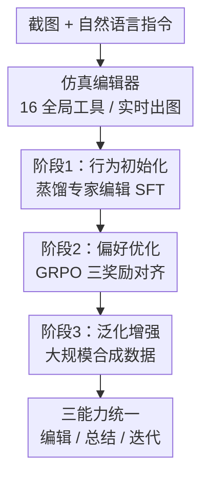

# IEA: Amateur-Friendly Conversational Image Editing Agent via Three Stages of Multitask Alignment

**会议**: CVPR 2026  
**arXiv**: [2606.08016](https://arxiv.org/abs/2606.08016)  
**代码**: 有（论文称数据与代码已开源）  
**领域**: 多模态VLM / Agent / 图像编辑 / 工具调用  
**关键词**: 对话式图像修图、工具调用 Agent、GRPO、多任务对齐、可解释编辑

## 一句话总结
把"修图"建模成 VLM 调用 16 个全局参数化工具的可解释动作序列，用 SFT → GRPO → 大规模合成数据三阶段对齐训练，让模型既能按自然语言修图、又能反推用户意图、还能按反馈迭代微调，在像素距离和意图总结上都超过 GPT-4.1/Gemini-2.5-Pro 等强基线。

## 研究背景与动机
**领域现状**：自动修图大致有三条路线——早期可解释的参数化滤镜/RL 管线（可追溯但表达力弱、只能粗粒度全局调）、扩散模型的指令式编辑（保真度高但要重绘像素）、以及最新的 VLM 调用专业修图工具（非破坏式、分辨率无关）。前沿 VLM（GPT-4.1、Gemini-2.5-Pro、Qwen2.5-VL）已经能看懂图、读懂指令并给出编辑建议。

**现有痛点**：专业软件（Photoshop/Lightroom）功能强但学习曲线陡，业余用户被劝退；手机端"一键滤镜"方便却缺乏细粒度控制和个性化表达。生成式编辑会带来伪影、不合理细节、风格漂移（偏离照片真实感），而且重绘像素算力开销大、还说不清"为什么这么改"。即便是最近让 VLM 输出 Lightroom 模板的工作（如 JarvisArt），也要经外部编辑器二次处理、通信耗时，且奖励只盯整体视觉效果，容易鼓励冗余或次优的工具调用。

**核心矛盾**：用户想用一句大白话（"给我温暖舒适的氛围""把背景稍微压暗，突出人脸"）就拿到满意结果，但"自然语言意图"和"可控、可解释、可调试的编辑动作"之间一直缺一座桥——生成式重绘牺牲了真实感和可解释性，工具式方法又缺乏对参数幅度的精准对齐。

**本文目标**：训练一个业余友好的对话式修图 Agent，能（1）按指令选工具+定参数做非破坏式编辑（Image-Edit）；（2）从历史编辑反推用户偏好（Image-Summary）；（3）按用户反馈做增量微调（Image-Refine）。

**核心 idea**：让 VLM 在一个**显式、可解释的动作空间**（16 个全局工具，参数 $-100$ 到 $100$ 整数步进）里逐步操作，每一步都留下可检查、可调试的编辑轨迹；并用三阶段多任务对齐（行为初始化 → 偏好优化 → 泛化增强）把工具调用的参数幅度对齐到专家级感知目标。

## 方法详解

### 整体框架
IEA 以 Qwen2.5-VL-7B 为统一视觉-语言策略，配一个用 matplotlib 实现的**仿真编辑器**（模仿 Lightroom，支持 16 个全局调整参数、每图处理 50–300ms），在训练时实时出图用于算奖励和反馈。整个训练分三阶段串行：先用蒸馏自专家编辑的数据做 SFT 把"工具用法 + 意图总结"的格式和先验灌进去；再用 GRPO 配三种精心设计的奖励把参数幅度对齐到专家感知目标；最后用约 20 万条混合（合成+真实）数据做泛化增强，激活全部 16 个工具并解锁 Image-Refine 能力。三个阶段产出 IEA-Stage-1/2/3 三个递进模型。

### 关键设计

**1. 仿真编辑器 + 半监督专家蒸馏：把"专家修图"变成可学的工具-参数程序**

工具式方法的第一道坎是没有"标准答案"——公开数据集（如 GIER）只标了用了哪类工具，没有精确参数值，没法直接监督。IEA 先搭一个轻量仿真编辑器（matplotlib 实现、本地 Ubuntu 可部署），支持 16 个全局工具（曝光、对比度、饱和度、色调、色温、锐化等），每个工具参数在 $[-100,100]$ 整数步进，训练中能实时渲染出图供算奖励。数据侧从 GIER 出发，剔除涉及局部编辑的样本后保留 2.4k 对图（原图+专家修图），再用强 VLM（GPT-4.1）补全缺失的参数和推理步骤：喂给它完整工具说明、原图与专家修图、改写后的人类指令和标注的工具类型，让它生成链式推理 + 一串带显式参数的工具调用（JSON 格式，兼容内置编辑器）。为缩小 sim-to-real 差距，再对蒸馏出的参数做一次轻量启发式搜索（逐维 coarse-to-fine 线搜索 + 早停），让结果更贴近专家修图。这一步把"看不见参数"的专家编辑变成了可监督的 $(I_{\text{ori}}, Q) \to T$ 程序，为后续 RL 打底。

**2. 双向任务 + GRPO 三奖励：让参数幅度对齐感知目标、拒绝冗余工具**

SFT 只教会格式和先验，参数幅度未必对得准；而把奖励只绑在整体视觉效果上又会鼓励冗余调用。IEA 用 GRPO（每个 prompt 采 $K=5$ 条 rollout）配三种奖励来对齐。**相似度提升奖励** $R_L$ 衡量编辑后图相对原图朝参考图靠近了多少：

$$R_L=\max\Big(-1,\ \frac{\mathcal{L}(I_{\text{ori}},I_{\text{ref}})-\mathcal{L}(\mathcal{E}(I_{\text{ori}},T),I_{\text{ref}})}{\mathcal{L}(I_{\text{ori}},I_{\text{ref}})}\Big)\in(-1,1]$$

其中 $\mathcal{L}$ 是 L1 与 L2 距离的平均，$\mathcal{E}$ 是编辑器渲染。**有用性奖励** $R_U$ 走边际效用思路：逐个工具做留一删除，若去掉某工具 $t$ 后离参考图更远（$\mathcal{L}(\mathcal{E}(I_{\text{ori}},T\setminus\{t\}),I_{\text{ref}}) > \mathcal{L}(\mathcal{E}(I_{\text{ori}},T),I_{\text{ref}})$），就记这个工具确实有用，$R_U$ 是有用工具占比。两者加权得 Image-Edit 奖励 $R_{\text{edit}}=\alpha R_L+(1-\alpha)R_U$（取 $\alpha=0.7$）。针对反向的 Image-Summary 任务，另训了一个轻量奖励模型给出对齐奖励 $R_A\in[-10,10]$：语义完全匹配给约 $+10$，漏掉关键属性给小正分，关键信息错误给负分，含糊泛泛给 0 附近，胡言乱语/答非所问给约 $-10$。这套设计直接把"感知相似 + 工具精简 + 意图一致"写进了奖励，而不是只看一个整体效果分。

**3. 大规模合成数据泛化：补齐工具覆盖、解锁按反馈迭代的 Image-Refine**

GIER 过滤后的样本只用到约一半工具，且几乎没有"同图不同意图"的对，没法监督 refine。IEA 从编辑器侧反向造数据：先采样工具子集并从定性分桶（slightly/moderately/strongly increase 等，每个桶映射到精确数值）组成一个潜在专家程序 $T^\star$；由 $T^\star$ 用模板生成专家风格指令 $Q^\star_{\text{expert}}$，再用 GPT-4.1 改写成强调视觉效果、不提具体参数的业余风格指令 $Q^\star_{\text{amateur}}$；图像从 GIER 或 FiveK 随机取，用编辑器渲染 $I^\star=\mathcal{E}(I_{\text{ori}},T^\star)$，每条合成样本是 $(I_{\text{ori}},I^\star,Q^\star_{\text{expert}},Q^\star_{\text{amateur}},T^\star)$。因为所有指令都源自一个"专家程序"，只要增删工具或调幅度就能得到相近程序 $T^{\star\prime}$，天然构造相似指令对，既喂给奖励模型训练、又用于 refine 任务。**Image-Refine** 采样两个差 1–2 维的程序 $(T^{(0)},Q^{(0)})$ 与 $(T^{(1)},Q^{(1)})$，渲染 $I^{(0)},I^{(1)}$，再让 GPT-4.1 生成一句把 $I^{(0)}$ 推向 $I^{(1)}$ 的自然语言反馈 $\Delta Q$（如"亮度有点过，稍微调低"），学习目标是 $\mathcal{M}(I_{\text{ori}},Q^{(0)},T^{(0)},I^{(0)},\Delta Q)\to T^{(1)}$。这样模型学会在保留上一轮上下文的前提下做增量编辑、忠实吸收反馈，确保全部 16 个工具及其交互都被激活，指令风格也从随意口语覆盖到精确专家指令。

### 一个完整示例
以"Darken the entire image, please"为例（一张略微过曝的夜景合影）：IEA 读图+指令后，在动作空间里选定曝光/对比度等工具并给出**克制的**参数值（而非把脸压到看不清），编辑器实时渲染出一张可见度提升、人物细节保留的结果，整个过程留下一条 JSON 工具调用轨迹可供检查。对比之下，生成式模型常改动内容或引入伪影，其他工具式基线则容易调过头进一步糊掉人脸——IEA 的优势正来自"在受限动作空间里精准映射自然语言到合适参数幅度"。

### 损失函数 / 训练策略
统一用 Qwen2.5-VL-7B。**Stage-1（SFT）**：batch 128、lr $1\times10^{-5}$、5 epoch、约 29k 样本（约 1.1k 步），4×A800，得 IEA-Stage-1。**Stage-2（GRPO，verl 框架）**：batch 16、1 epoch、约 29k RL 样本、8×A800，$\alpha=0.7$、$K=5$，保持 SFT 输出格式，得 IEA-Stage-2。**Stage-3（泛化）**：约 132k 合成 SFT + 重采 70k 原始 SFT，混合约 202k 样本，batch 64、lr $1\times10^{-5}$、2 epoch（约 5k 步）、8×A800，输出格式与前两阶段一致（Image-Edit/Refine 用固定键 JSON，Image-Summary 用单句英文）以减小分布漂移，得 IEA-Stage-3。

## 实验关键数据

### 主实验
在 GIER 专家测试集上评测两个任务：Image-Edit 用 2,568 样本，Image-Summary 用 241 样本。Image-Edit 报像素距离 $L$（L1/L2 平均，越低越好）、$R_L$、$R_U$；Image-Summary 报 Rouge-L 和奖励模型给的 $R_A$。

| 模型 | L (↓) | $R_L$ (↑) | $R_U$ (↑) | Rouge-L (↑) | $R_A$ (↑) |
|------|-------|-----------|-----------|-------------|-----------|
| GPT-4.1 | 0.150 | -0.296 | -0.408 | 0.097 | -0.441 |
| Gemini-2.5-Pro | 0.168 | -0.415 | -0.301 | 0.077 | 2.399 |
| Qwen2.5-VL-7B | 0.158 | -0.284 | -0.412 | 0.091 | 3.671 |
| IEA-Stage-1 | 0.134 | -0.219 | -0.104 | 0.222 | 3.852 |
| IEA-Stage-2 | 0.111 | 0.027 | 0.332 | 0.196 | 4.859 |
| **IEA-Stage-3** | **0.103** | **0.149** | **0.402** | **0.258** | **7.387** |

最终 IEA-Stage-3 在 Image-Edit 上像素距离 0.103、在 Image-Summary 上 Rouge-L 0.258，均显著优于所有基线；强生成/前沿 VLM 基线的 $R_L$、$R_U$ 普遍为负（说明它们的工具调用反而把图推离参考、且含大量无用调用）。

### 消融实验（三阶段递进）
| 配置 | L (↓) | $R_L$ | $R_U$ | $R_A$ | 说明 |
|------|-------|-------|-------|-------|------|
| Qwen2.5-VL-7B（base） | 0.158 | -0.284 | -0.412 | 3.671 | 未训练基座 |
| + Stage-1 SFT | 0.134 | -0.219 | -0.104 | 3.852 | 蒸馏迁移工具用法，L 下降、Rouge-L 大涨 |
| + Stage-2 GRPO | 0.111 | 0.027 | 0.332 | 4.859 | $R_L$/$R_U$ 转正，工具更高效 |
| + Stage-3 合成 | 0.103 | 0.149 | 0.402 | 7.387 | L 再降，$R_A$ 近乎翻倍 |

### 用户研究（50 例，56 名参与者，双任务排名，越低越好）
| 模型 | Rank(A 指令遵循)↓ | Rank(B 画质)↓ | L↓ | $R_L$↑ |
|------|------|------|------|------|
| 人类专家参考 | 2.91 | 2.87 | 0.000 | 1.000 |
| GPT-Image-1（生成） | 2.93 | 4.15 | 0.218 | -0.340 |
| Qwen-Image-Edit（生成） | 3.26 | 3.74 | 0.184 | -0.132 |
| JarvisArt（工具） | 6.13 | 5.36 | 0.225 | -0.328 |
| GPT-4.1（工具） | 5.86 | 5.84 | 0.209 | -0.306 |
| Gemini-2.5-Pro（工具） | 5.47 | 5.79 | 0.225 | -0.420 |
| Qwen2.5-VL-7B（工具） | 4.80 | 4.55 | 0.200 | -0.221 |
| **IEA（本文）** | **4.64** | **3.69** | **0.128** | **0.138** |

### 关键发现
- **三阶段每一阶段都有效且分工明确**：SFT 主要降 L、拉高 Rouge-L（迁移"该做什么/做了什么"的工具知识）；GRPO 把 $R_L$/$R_U$ 从负转正（参数对齐 + 工具精简）；合成数据进一步降 L 并让 $R_A$ 从 3.85 涨到 7.39（近翻倍），泛化与意图总结收益最大。
- **工具式 vs 生成式各有胜负**：IEA 在工具调用类方法里指令遵循排名最高；但在严重欠/过曝、单色照片等工具无法恢复的场景，生成模型靠重绘能补出细节，指令遵循排名偶尔更高（如 GPT-Image-1 的 Rank(A) 2.93 略好）。
- **画质上工具式更稳**：IEA 画质排名（3.69）仅次于人类参考和两款生成模型，但避免了生成式常见的伪影、不合理细节和风格漂移；唯一 $R_L$ 为正（0.138）的非参考方法，说明只有它真正把图改得更像专家结果。

## 亮点与洞察
- **把"修图"做成可解释动作序列**：相比生成式重绘像素，IEA 输出的是带参数的工具调用 JSON 轨迹，可检查、可调试、分辨率无关、非破坏式——这对需要可解释和可控的修图场景是实打实的工程优势。
- **有用性奖励 $R_U$ 的留一删除思路很巧**：用边际效用判定每个工具是否真有贡献，直接惩罚冗余/无效调用，比"只看整体效果"的奖励更能逼出精简、有目的的工具组合，这个奖励设计可迁移到任何"动作序列+可验证环境"的工具调用任务。
- **正反双向任务自洽**：Image-Edit（指令→工具）和 Image-Summary（编辑结果→意图）互为反向，加上从专家程序 $T^\star$ 增删工具天然造相似指令对，既省了人工标注又同时喂了奖励模型和 refine 任务——数据合成闭环设计得很经济。
- **仿真编辑器是关键基建**：50–300ms 实时出图让 RL 能在线算像素级奖励，这是把 RLHF 式对齐用到修图上的前提。

## 局限与展望
- 作者承认：只在简化环境里用了 16 个**全局**工具，不支持局部编辑（GIER 里涉及局部工具的样本被直接剔除），离真实 Lightroom 的工具丰富度还有距离。
- 评测高度依赖 GIER/FiveK 与自训的奖励模型 $R_A$，$R_A$ 本身是模型打分、可能有偏；用户研究只有 50 例、56 名校内参与者，规模偏小。
- 像素距离 $L$ 以"逼近某一张专家参考图"为目标，但修图本就一图多解，单参考的度量未必反映真实满意度（这也是生成式在某些场景指令遵循反超的部分原因）。
- 可改进方向：扩到局部/分区工具与更真实的后端编辑器、引入真正的 human-in-the-loop 多轮 refine、以及把奖励模型换成更鲁棒的多参考或偏好建模。

## 相关工作与启发
- **vs 生成式编辑（GPT-Image-1 / Qwen-Image-Edit / 扩散指令编辑）**：它们直接合成像素、保真上限高，但易引入伪影、风格漂移且算力贵、不可解释；IEA 用参数化工具非破坏式编辑，画质更稳、可调试，代价是受限于工具表达力（极端欠曝等场景拼不过重绘）。
- **vs 输出 Lightroom 模板的工具式方法（JarvisArt）**：JarvisArt 生成模板文件需外部编辑器二次处理、通信耗时，奖励只盯整体效果；IEA 自带实时仿真编辑器在线算 $R_L$/$R_U$，把参数幅度和工具精简直接写进 RL，用户研究里 IEA 各项都明显优于 JarvisArt（Rank A 4.64 vs 6.13）。
- **vs 前沿 VLM 直接调工具（GPT-4.1 / Gemini-2.5-Pro / 基座 Qwen2.5-VL）**：零样本 VLM 懂指令但映射不准参数幅度（$R_L$/$R_U$ 普遍为负、易过度编辑）；IEA 用三阶段对齐把同一基座 Qwen2.5-VL-7B 的参数对齐能力练出来，验证了"对齐训练"而非"更强基座"才是工具式修图的关键。
- **vs GUI Agent**：直接操作真实界面面临长程交互、UI 多变、稀疏奖励难题；IEA 用受限的参数化动作空间 + 稠密像素奖励规避了这些坑，是工具调用 Agent 的一种务实折中。

## 评分
- 新颖性: ⭐⭐⭐⭐ 把对话式修图建成可解释工具调用 + 三阶段多任务对齐，$R_U$ 留一删除奖励和正反双向任务闭环都有新意
- 实验充分度: ⭐⭐⭐⭐ 量化（2568+241 样本）、三阶段消融、56 人用户研究、案例分析齐全；但用户研究 50 例偏小、依赖自训奖励模型
- 写作质量: ⭐⭐⭐⭐ 三阶段动机和奖励公式讲得清楚，框架图与任务定义完整
- 价值: ⭐⭐⭐⭐ 为可解释、偏好对齐的业余友好修图提供了可落地的工具式路线，奖励设计与数据合成闭环有复用价值

<!-- RELATED:START -->

## 相关论文

- [\[CVPR 2026\] DSCA: Dynamic Subspace Concept Alignment for Lifelong VLM Editing](dsca_dynamic_subspace_concept_alignment_for_lifelong_vlm_editing.md)
- [\[CVPR 2026\] Hierarchical Attacks for Multi-Modal Multi-Agent Reasoning](hierarchical_attacks_for_multi-modal_multi-agent_reasoning.md)
- [\[CVPR 2026\] HOG-Layout: Hierarchical 3D Scene Generation, Optimization and Editing via Vision-Language Models](hog_layout_hierarchical_3d_scene_generation_optimization_and_editing.md)
- [\[CVPR 2026\] OneThinker: All-in-one Reasoning Model for Image and Video](onethinker_all-in-one_reasoning_model_for_image_and_video.md)
- [\[CVPR 2026\] LVLM-Aided Alignment of Task-Specific Vision Models](lvlm-aided_alignment_of_task-specific_vision_models.md)

<!-- RELATED:END -->
