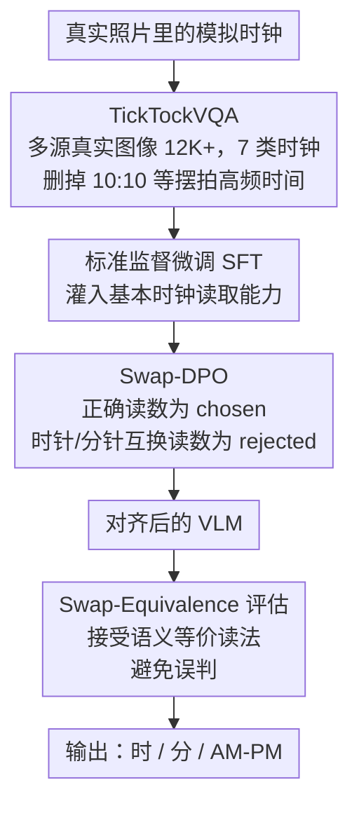

# It's Time to Get It Right: Improving Analog Clock Reading and Clock-Hand Spatial Reasoning in Vision-Language Models

**会议**: CVPR 2026  
**arXiv**: [2603.08011](https://arxiv.org/abs/2603.08011)  
**代码**: [https://it-s-time-to-get-it-right.github.io/](https://it-s-time-to-get-it-right.github.io/)  
**领域**: 多模态VLM  
**关键词**: 模拟时钟读取, 空间推理, VLM, DPO, 时空理解

## 一句话总结
揭示 SOTA VLM 仍无法可靠读取真实场景中的模拟时钟（零样本准确率不到10%），提出 TickTockVQA 真实场景数据集（12K图像）和 Swap-DPO 微调框架，将 Llama-3.2-11B 的时间读取准确率从1.43%提升至46.22%。

## 研究背景与动机
**领域现状**：VLM 在复杂多模态推理任务上不断突破，但读模拟时钟对它们来说出人意料地困难。

**现有痛点**：(a) 现有时钟数据集多为合成的，风格单一且缺乏背景变化，不反映真实场景复杂性；(b) VLM 频繁混淆时针和分针，缺乏精细的空间-时间推理能力。

**核心矛盾**：时钟读取需要联合定位→识别指针→解释角度配置→映射到离散时间值，这是一个简洁但对空间推理要求很高的任务。

**本文目标** (a) 缺乏高质量真实场景时钟数据集；(b) VLM 混淆时针/分针的空间推理缺陷。

**切入角度**：用真实场景训练数据替代合成数据 + 用 DPO 对齐让模型学会区分时针和分针。

**核心idea**：Swap-DPO——构造时针分针交换的偏好对，让模型显式学会正确的指针语义分配。

## 方法详解

### 整体框架
这篇论文想解决一件听起来很简单、却让 SOTA VLM 集体翻车的事：看一张真实照片里的模拟时钟，报出现在几点几分。整条流水线沿"先备好真实数据、再两段式训练、最后用对的口径评测"展开：先构建覆盖真实场景的 TickTockVQA 数据集，用它做标准监督微调（SFT），把"怎么读时钟"这件事的基本能力灌进模型；SFT 之后再叠一层 Swap-DPO，用时针/分针角色互换的偏好对，专门去纠正模型最爱犯的"把时针当分针读"的错误；得到的模型最后用 Swap-Equivalence 评估口径打分，避免把语义等价的读法误判成错。三个贡献正好对应这条线的三段——数据、对齐、评估。

### 关键设计

**1. TickTockVQA：用真实照片替掉清一色的合成时钟**

以往时钟数据集几乎都是 OpenCV 或扩散模型合成出来的——表盘干净、背景单一、风格雷同，模型在上面学得再好，一碰真实照片就崩。作者改从 COCO、SBU、Visual Genome、ImageNet、OpenImages、CC12M 以及电影帧等多个真实来源里捞时钟，凑出 12K+ 张图像，覆盖挂钟、塔钟、手表、闹钟、邮筒钟等 7 类，带室内/室外、翻转、部分遮挡等各种变体，表盘也分阿拉伯数字、罗马数字、无数字三种。标注的是小时、分钟和能推断出的 AM/PM，并刻意删掉了像 10:10 这种在广告图里被过度代表的"标准摆拍时间"，免得模型靠记忆这个高频构图蒙混过关。这样训出来的模型面对的才是真实世界的复杂度，而不是合成分布里的玩具时钟。

**2. Swap-DPO：用交换指针的负样本，逼模型分清时针和分针**

SFT 教会了模型"读"时间，却没法强化它对指针空间角色的辨别——VLM 最常见的失败就是把时针和分针读反。作者顺着这个具体错误模式构造偏好对：正确的时间读取当 chosen，把同一张图的时针、分针读数对调后得到的错误读取当 rejected，再用 DPO 优化。举个示意：真实时间 3:00 时，指向 3 的是时针、指向 12 的是分针；把两根指针的角色互换去读，就会得到"指向 12 当时针、指向 3 当分针"的 12:15，这正是模型最容易犯的镜像错误，于是被当成 rejected 喂进对比（具体构造规则以原文为准 ⚠️）。相比泛泛地提升空间推理，这种负样本直接戳在 VLM 最高频的混淆点上，把"哪根指针指小时、哪根指分钟"的语义分配变成一个有显式监督信号的目标。

**3. Swap-Equivalence 评估：别把语义等价的读法判成错**

某些时间读取本身存在歧义或等价表述（如 12:00 与 00:00），如果评估时一刀切只认一种字面写法，会把模型其实读对了的情况误判成错、低估真实水平。作者在打分时同时接受原始读法和其等价/可纠正的版本，让评测口径更贴近"人怎么算这答案对不对"。

### 训练策略
两阶段叠加：先用 TickTockVQA 做标准 SFT 打底，教会基本时钟读取；再在 SFT 权重上跑 Swap-DPO 做偏好对齐，重点纠正时分混淆。

## 实验关键数据

### 零样本基线（TickTockVQA 测试集）

| 模型 | 时针准确率 | 分钟准确率 | 完整时间准确率 | MAE↓ |
|------|----------|----------|-------------|------|
| SpatialVLM-3B | 12.51 | 6.44 | 1.05 | 161.68 |
| Llama-3.2-11B | 11.51 | 8.58 | 1.43 | 156.96 |
| Qwen2.5-VL-7B | 17.65 | 22.44 | 6.04 | 148.62 |
| It's About Time | 28.95 | 25.00 | 18.54 | 135.15 |

### 训练后效果（以 Llama-3.2-11B 为例）

| 阶段 | 时针准确率 | 完整时间准确率 | MAE↓ |
|------|----------|-------------|------|
| 零样本 | 11.51 | 1.43 | 156.96 |
| +SFT (TickTockVQA) | 提升 | 提升 | 大幅降低 |
| +Swap-DPO | **最优** | **46.22** | **最优** |

### 数据集对比

| 训练数据 | 类型 | Qwen2.5-VL-7B MAE↓ |
|---------|------|-------------------|
| SynClock | OpenCV合成 | 较差 |
| CtrlClock | Diffusion合成 | 中等 |
| **TickTockVQA** | **真实场景** | **99.9** (最优) |

### 关键发现
- 所有 SOTA VLM 的零样本时钟读取准确率极低，GPT-5、Claude Sonnet 4.5、Gemini-2.5 Pro 也会出错
- 真实场景数据远优于合成数据训练效果，证明域差距是关键瓶颈
- Swap-DPO 相对 SFT 带来的提升是实质性的，Llama-3.2-11B 完整时间准确率从基线 1.43% 提升到 46.22%（+44.81pp）
- 时针准确率通常高于分钟准确率，但 Swap-DPO 对两者都有显著提升

## 亮点与洞察
- **反直觉的发现**：如此"简单"的任务竟然是 SOTA VLM 的重大弱点，揭示了空间推理能力的实质缺陷
- **Swap-DPO 精准对症**：不是泛泛地改进空间推理，而是精确针对"时分混淆"这一特定错误模式构造负样本
- 12K 规模的 TickTockVQA 是目前最大最多样的真实场景时钟基准
- 时钟读取可以作为评估 VLM 精细空间-时间推理能力的简洁测试平台

## 局限与展望
- 46.22% 的准确率虽比基线大幅提升，但离人类水平还有很大差距
- Swap-DPO 仅针对时分混淆，其他错误类型（如数字风格识别错误）需要额外策略
- 数据集标注由作者自行完成（非专业标注团队），虽有交叉验证但规模化标注的质量保障值得关注
- 未测试视频中连续读取时间的能力

## 相关工作与启发
- **vs It's About Time**: 先前工作使用合成数据，本文强调真实场景的必要性并提供了迄今最大的真实数据集
- **vs SpatialVLM**: SpatialVLM 关注一般空间理解，本文展示了特定任务中空间推理的精细差距
- 时钟读取作为"简洁空间推理测试床"的定位有趣，类似于 Winograd Schema 之于 NLU

## 评分
- 新颖性: ⭐⭐⭐⭐ Swap-DPO 的对症设计巧妙，任务虽简但洞察深
- 实验充分度: ⭐⭐⭐⭐ 多模型对比+训练数据消融+合成vs真实对比
- 写作质量: ⭐⭐⭐⭐ 数据集统计详尽，论证逻辑清晰
- 价值: ⭐⭐⭐⭐ 揭示VLM空间推理弱点，数据集和方法都有复用价值

<!-- RELATED:START -->

## 相关论文

- [\[CVPR 2026\] HandVQA: Diagnosing and Improving Fine-Grained Spatial Reasoning about Hands in Vision-Language Models](handvqa_diagnosing_and_improving_fine-grained_spatial_reasoning_about_hands_in_v.md)
- [\[CVPR 2026\] HiSpatial: Taming Hierarchical 3D Spatial Understanding in Vision-Language Models](hispatial_taming_hierarchical_3d_spatial_understanding_in_vision-language_models.md)
- [\[CVPR 2026\] SpatiaLQA: A Benchmark for Evaluating Spatial Logical Reasoning in Vision-Language Models](spatialqa_a_benchmark_for_evaluating_spatial_logical_reasoning_in_vision-languag.md)
- [\[ICML 2026\] 3ViewSense: Spatial and Mental Perspective Reasoning from Orthographic Views in Vision-Language Models](../../ICML2026/multimodal_vlm/3viewsense_spatial_and_mental_perspective_reasoning_from_orthographic_views_in_v.md)
- [\[CVPR 2025\] It's a (Blind) Match! Towards Vision-Language Correspondence without Parallel Data](../../CVPR2025/multimodal_vlm/its_a_blind_match_towards_vision-language_correspondence_without_parallel_data.md)

<!-- RELATED:END -->
