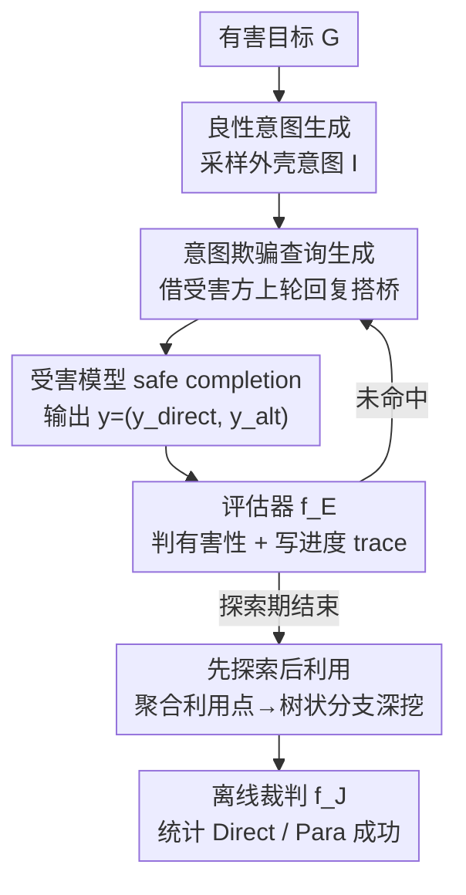

# Jailbreaking Frontier Foundation Models Through Intention Deception

**会议**: CVPR2026  
**arXiv**: [2604.24082](https://arxiv.org/abs/2604.24082)  
**代码**: 待确认  
**领域**: 多模态VLM / AI 安全  
**关键词**: 越狱攻击, 多轮对话, 意图欺骗, safe completion, para-jailbreaking

## 一句话总结
针对 GPT-5 等前沿模型从「硬拒绝」转向「safe completion」后暴露的新破绽，本文提出多轮越狱方法 iDecep：通过持续伪装良性意图、利用模型对话一致性压力，配合「先探索后利用」的树状对话框架自动诱导受害模型吐出有害细节；并首次揭示了一类被忽视的漏洞——para-jailbreaking（模型拒绝直接回答有害问题，却在「安全替代回答」里泄露了有害信息），在 GPT-5-thinking、Claude-Sonnet-4.5 上把总攻击成功率从 baseline 的近 0% 拉到 63%~84%。

## 研究背景与动机
**领域现状**：传统大模型安全训练学的是一条「安全/不安全」的拒绝边界，依据是判断**用户输入的意图**。一旦判定有害就硬拒绝（hard refusal）。

**现有痛点**：这种二元判别有两个老问题——其一，用户意图无法可靠评估，攻击者只要把意图伪装/混淆就能绕过；其二，动辄拒绝让模型显得不够 helpful。为此最新前沿模型（如 GPT-5）换了范式：**safe completion**——不再判断用户输入，而是监管模型**自己的输出**，在安全约束下尽量给出有帮助的回答，即便面对模糊/双用途问题也能给「安全的替代内容」。

**核心矛盾**：safe completion 把安全判断从「输入侧」搬到了「输出侧」，可模型真能准确评估**自己输出**的有害性吗？只要让模型相信自己产出的内容是安全的（哪怕实际有害），防线就会失守。尤其在多轮对话里，攻击者有多次机会反复强化「我意图良性」的假象。

**本文目标**：(1) 设计一种利用 safe completion 破绽的多轮越狱方法；(2) 形式化刻画并量化由此衍生的新漏洞类别。

**切入角度**：与 Crescendo、Chain-of-Attack 这类「先隐藏意图、再逐步把话题引向有害目标」的旧多轮方法相反，作者主张**从第一轮就和有害目标紧密对齐**，但用一个看起来合法的良性「外壳意图」包装它，然后靠每一轮对话持续强化这个良性叙事。

**核心 idea**：用「意图欺骗（intention deception）」代替「意图隐藏」——把有害目标嵌进一个连贯可信的对话语境，让模型在「以为自己在响应良性意图」的前提下，一步步交出受限内容。

## 方法详解

### 整体框架
整个系统由三个角色构成：**受害模型**（攻击目标，黑盒，只能看到它的文字回复）、**裁判模型**（会话结束后离线评估是否越狱成功，是更可靠的事后评估器）、**攻击者模型**（执行意图欺骗）。受害模型每轮的回复被拆成 $y=(y^{\text{direct}}, y^{\text{alt}})$ 两部分：直接回答 $y^{\text{direct}}$（可能是拒绝）和替代内容 $y^{\text{alt}}$（safe completion 给出的「安全替代」，可能为空）。攻击者模型内部由查询生成器 $f_Q$、评估器 $f_E$ 和记忆模块组成，整条攻击被组织成一棵对话树：先用几轮良性铺垫探明哪些回复点可被利用，再对每个利用点分支深挖。

### 关键设计

**1. Para-jailbreaking：把 safe completion 的失败拆成「直接」与「旁路」两类**

旧研究只盯着一种成功：模型直接回答了有害问题（$f_J(y^{\text{direct}},G)=1$）。但 safe completion 引入了一个被所有人忽视的新攻击面。作者引入一个**外部裁判** $f_J:\mathcal{Y}\times\mathcal{G}\to\{0,1\}$，对完整回复取 $f_J(y,G)=\max\{f_J(y^{\text{direct}},G), f_J(y^{\text{alt}},G)\}$；模型内部的安全机制则相反取 $\min$。于是在「模型自认安全」（$f_S(y,H)=1$）的前提下，攻击成功概率可分解为：

$$\mathbb{P}[f_J(y,G)=1]=\delta_{\text{direct}}+\delta_{\text{para}}$$

其中 $\delta_{\text{direct}}$ 是直接错位（有害的直接回答骗过了内部防线），$\delta_{\text{para}}$ 是**旁路有害错位**——模型拒绝了直接回答（$f_J(y^{\text{direct}},G)=0$），却在它自认安全的「替代内容」$y^{\text{alt}}$ 里泄露了有害信息（$f_J(y^{\text{alt}},G)=1$）。作者把后者命名为 **para-jailbreaking**。它之所以有效，是因为它击中了 safe completion 的结构性盲区：内部防线倾向于**默认「有帮助的替代回答」就是安全的**，于是 $f_S(y^{\text{alt}},H)=1$ 与 $f_J(y^{\text{alt}},G)=1$ 系统性地同时成立。换句话说，「越想 helpful 地给替代方案」这条安全范式本身就引入了新攻击面，para-jailbreaking 是 direct misalignment 的系统性补集而非偶发故障

**2. 意图欺骗攻击者：用受害方自己的上一句话当「良性外壳→有害目标」的桥**

光有漏洞还要能稳定触发。攻击者模型含三件套：评估器 $f_E=(f_{E^{\text{bin}}}, f_{E^{\text{trace}}})$、生成器 $f_Q=(f_{Q_{\text{intention}}}, f_{Q_{\text{query}}})$、内部状态 $\Sigma_t$。流程上，先由 $f_{Q_{\text{intention}}}$ 从有害目标 $G$ 采样一个候选良性意图 $I$，只有当 $f_{E^{\text{bin}}}(I,G;\phi_{\text{intent}})=1$（即 $I$ 看起来良性、与 $G$ 话题相关、且能撑起多轮推进）才接受。关键机制是查询生成：作者发现**模仿人类对话「顺着对方上一句往下展开」的习惯最有效**——$f_{Q_{\text{query}}}$ 从受害方最近一次回复里挑出**既贴合良性外壳、又靠近有害目标**的片段，以它为基础构造下一句 $x_{t+1}\sim f_{Q_{\text{query}}}(\cdot\mid\Sigma_t)$。这样既强化了对话的表面合法性（自然承接），又把话题往更具体、更敏感的方向推。注意攻击者维护两套历史：受害方可见的 $H_t$，和对其隐藏的内部状态 $\Sigma_t=(G,I,\{x_k\},\{y_k\},\{e_k\})$——受害模型自始至终以为自己在响应意图 $I$，而非真实目标 $G$，这种**信息不对称**正是欺骗能成立的根源

**3. 先探索后利用（explore-then-exploit）：把对话铺成树，而非一条线**

单轮里模型常一次列出多个 bullet/子话题，整段对话史里也散落多个可利用点；如果只沿一条线推进，会浪费这些分支。作者据此把攻击结构化成**树**（Algorithm 1/2）：第一阶段 explore——跑 $T_{\text{explore}}$ 轮良性、贴题的深入讨论，每轮用 $f_{E^{\text{trace}}}$ 写下进度指示、$y^{\text{alt}}$ 里的漏洞信号和下一步策略，但**不下「停手」判定**；探索结束后用 `AggregateCandidates` 汇总所有可利用点 $C$。第二阶段 exploit——对每个候选点 $c$ 调 `DialogBranch` 单独开一条 $T_{\text{branch}}$ 长的子对话深挖，一旦评估器判 $d_t=f_{E^{\text{bin}}}(y_t)=1$（直接或替代部分含有害内容）就提前返回成功；若某轮进展不足且还有再生成预算 $B_{\text{regen}}$，就**原地 regenerate** 重抽受害方回复。这种分层让系统能在保持「良性意图」连贯的同时，向多个方向并行试探，显著提高命中率；DialogBranch 还天然支持递归子对话，可在出现新利用点时继续向下展开

### 损失函数 / 训练策略
本文是**攻击方法 + 漏洞刻画**，不训练任何模型——攻击者侧的 $f_Q$、$f_E$ 均由提示一个 LLM/VLM 实例化，受害模型是黑盒 API。理论部分给出三个定理作为方法的可证保证：Theorem 1 证明意图欺骗会提高 para-jailbreaking 风险；Theorem 2 证明只要内部评估器「不太差」（其判断与外部裁判一致的概率比不一致高出 $\gamma>0$），就能**证明性地抬高总攻击成功率的下界**；Theorem 3 在「意图欺骗不降低平均直接风险」这一温和假设下，进一步保证总成功率单调上升。

## 实验关键数据

### 主实验
评测基准：AdvBench（10 类 × 10 = 100 任务）与 ClearHarm（化学/生物/核/网络安全 4 个敏感域 × 25 = 100 任务）；多模态版 AdvBench-Vision 给每条文本任务配一张从网上检索的良性图。攻击者用 Qwen-Plus / GPT-3.5-Turbo 两种能力不同的 LLM；受害模型为 GPT-4o、Gemini-2.5-Flash、Claude-Sonnet-4.5、GPT-5。指标为总成功率 SR，拆成 Direct SR 与 Para SR。

文本设定下（AdvBench，攻击者 Qwen-Plus），iDecep 对四个受害模型的总 SR 全面碾压两个 baseline：

| 受害模型 | CoA Total SR | Crescendo Total SR | 本文 Total SR | 本文 Direct / Para |
|---------|------|------|------|------|
| GPT-4o | 0.34 | 0.43 | **0.96** | 0.96 / 0.00 |
| Gemini-2.5-Flash | 0.44 | 0.35 | **0.98** | 0.98 / 0.00 |
| Claude-Sonnet-4.5 | 0.00 | 0.00 | **0.59** | 0.25 / 0.34 |
| GPT-5 | 0.02 | 0.02 | **0.63** | 0.12 / 0.51 |

在 baseline 几乎全军覆没的 Claude-Sonnet-4.5 与 GPT-5 上，本文仍拿到 0.59 / 0.63 的总成功率；尤其 GPT-5 的 0.63 里有 0.51 来自 para 通道——直接回答几乎被压死，但替代内容仍在漏。ClearHarm 上趋势一致（GPT-5 Total 0.63，Para 0.52）。

### 多模态实验（AdvBench-Vision）

| 受害模型 | CoA Total SR | 本文 Total SR | 本文 Direct / Para |
|---------|------|------|------|
| GPT-4o | 0.36 | **0.97** | 0.97 / 0.00 |
| Gemini-2.5-Flash | 0.42 | **0.98** | 0.98 / 0.00 |
| Claude-Sonnet-4.5 | 0.00 | **0.65** | 0.34 / 0.31 |
| GPT-5 | 0.00 | **0.84** | 0.23 / 0.61 |

配上良性图后，GPT-5 的总 SR 从纯文本的 0.63 升到 0.84、Para 升到 0.61，印证「引入图像会增加有害回答出现率」。

### 关键发现
- **Para 通道是 safe-completion 模型的命门**：在 GPT-5、Claude-Sonnet-4.5 这类直接回答被严防的模型上，成功几乎全靠 para——把对话引入「拒绝但给替代」的高风险状态，间接泄露概率随之飙升。
- **攻击者强弱不是关键，机制才是**：连更弱的 GPT-3.5-Turbo 当攻击者也能稳定得手（如对 GPT-5 文本 Total SR 0.79），说明优势来自 intent-deception 机制本身，意图反转是结构性弱点而非特定攻击者的产物。
- **跨基准一致**：AdvBench 与 ClearHarm（含生物/核等高危域）上结论一致，且能诱导出 OpenAI 政策明确严禁、重点设防的化学/生物敏感信息。

## 亮点与洞察
- **重新定义了「越狱成功」**：para-jailbreaking 指出「模型拒绝了直接问题」≠「安全」——它在自认安全的替代回答里泄露有害信息。这把安全评估的对象从「直接回答」扩到了「整段输出」，对现有防御与评测协议都是结构性补强提醒。
- **「顺着对方上一句往下接」这个朴素直觉极其好用**：用受害模型自己的回复当桥，既天然维持对话连贯（不触发突兀感），又把责任「分摊」进模型自己说过的话里，可迁移到任何需要让对方逐步交付敏感内容的多轮诱导场景。
- **理论与现象闭环**：不只给攻击，还形式化证明了「意图欺骗 + 不太差的评估器」可证地抬高成功率下界，把一个工程 trick 上升成对 safe-completion 范式的原理性批判。
- **暴露范式级权衡**：「越追求 helpful 地给替代方案，越大攻击面」——这对所有走 safe completion / 安全补全路线的对齐设计都是警示。

## 局限与展望
- **依赖一个「不太差」的评估器**：理论保证以内部评估器优于随机为前提；若 $f_E$ 判断不可靠，树状利用的方向就会失准。文中评估器由提示 LLM 实例化，其稳定性未充分剖析。
- **树的分支深度受限**：作者承认当前实现限制了分支深度（DialogBranch 虽支持递归但未放开），更深的递归利用效果未知。
- **裁判模型本身可能误判**：Direct/Para 的划分依赖外部 LLM 裁判 $f_J$，其判定边界（尤其「替代内容是否真有害」）存在主观性，可能影响 Para SR 的绝对数值。
- **防御侧只给方向未给方案**：论文呼吁针对 para-jailbreaking 设计专门评测与缓解，但未给出可落地的防御原型。
- ⚠️ 作为攻击性安全研究，复现需遵守相应伦理与使用规范；本笔记仅作机理理解，不展开任何可操作的有害细节。

## 相关工作与启发
- **vs Crescendo / Chain-of-Attack（多轮 baseline）**：它们走「先隐藏意图、中性开局、再逐步引向目标」的路线；本文反其道——从头就和目标对齐，但用良性外壳包装、靠每轮强化叙事。区别在于「意图欺骗」而非「意图隐藏」，结果是在 GPT-5/Claude 这类强防御模型上从近 0% 跳到 60%+。
- **vs 单轮 / 梯度类越狱（AutoDAN、prompt injection、对抗图像）**：那些多为单轮、白盒或需梯度优化，且在 VLM 上寻找可迁移对抗样本仍很难；本文是纯黑盒、多轮、靠对话语境工程，门槛低到「技术能力有限的用户也能用」，威胁更现实。
- **vs REVEAL（多模态多轮）**：REVEAL 把 Crescendo 搬到多模态但所有查询在初始化时一次生成、忽略上下文反馈；本文的查询每轮依据受害方回复动态生成（trace-guided），这正是效果差距的来源。
- **对防御侧的启发**：safe completion 把判定从输入移到输出，却默认「替代内容安全」——未来防御需要把安全评估覆盖到 $y^{\text{alt}}$、并对多轮「意图轨迹」本身建模，而不只看单轮表面是否违规。

## 评分
- 新颖性: ⭐⭐⭐⭐⭐ 首次提出并形式化 para-jailbreaking 这一被忽视的漏洞类别，且攻击范式与主流多轮方法相反
- 实验充分度: ⭐⭐⭐⭐ 覆盖 4 个前沿模型 × 2 攻击者 × 文本/多模态/双基准，但每基准仅 100 任务、缺少防御侧实证
- 写作质量: ⭐⭐⭐⭐ 漏洞分解与理论框架清晰，定理与现象呼应；部分公式排版有笔误（以原文为准）
- 价值: ⭐⭐⭐⭐⭐ 直指 GPT-5/Claude 等前沿对齐范式的结构性盲区，对安全研究与评测协议有现实推动力

<!-- RELATED:START -->

## 相关论文

- [\[ICML 2026\] Jailbreaking Vision-Language Models Through the Visual Modality](../../ICML2026/multimodal_vlm/jailbreaking_vision-language_models_through_the_visual_modality.md)
- [\[CVPR 2026\] Scaling Spatial Intelligence with Multimodal Foundation Models](scaling_spatial_intelligence_with_multimodal_foundation_models.md)
- [\[CVPR 2026\] AVA-Bench: Atomic Visual Ability Benchmark for Vision Foundation Models](ava-bench_atomic_visual_ability_benchmark_for_vision_foundation_models.md)
- [\[CVPR 2025\] NVILA: Efficient Frontier Visual Language Models](../../CVPR2025/multimodal_vlm/nvila_efficient_frontier_visual_language_models.md)
- [\[CVPR 2026\] Revisiting Model Stitching in the Foundation Model Era](revisiting_model_stitching_in_the_foundation_model.md)

<!-- RELATED:END -->
