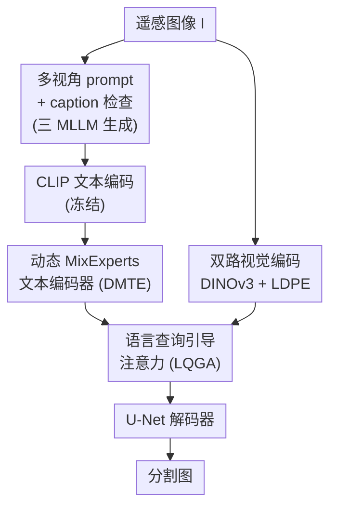

# MPerS: Dynamic MLLM MixExperts Perception-Guided Remote Sensing Scene Segmentation

**会议**: CVPR 2026  
**arXiv**: [2605.10769](https://arxiv.org/abs/2605.10769)  
**代码**: 无（论文未提供）  
**领域**: 多模态VLM / 遥感语义分割  
**关键词**: 遥感分割, MLLM caption, Mixture-of-Experts, 文本引导分割, DINOv3  

## 一句话总结
MPerS 让 LLaVA / ChatGPT / Qwen 三个 MLLM 从多视角 prompt 生成高质量遥感场景描述，再用动态 MixExperts 门控网络挑出最有用的文本语义、通过语言查询引导注意力来指导 DINOv3 视觉特征做密集分割，在 Vaihingen / Potsdam / SynDrone 三个遥感数据集上刷到 SOTA。

## 研究背景与动机
**领域现状**：遥感（RS）场景语义分割长期依赖单模态高分影像，主流做法是堆叠多尺度 CNN、注意力或 CNN+Transformer 混合骨干去提取地物特征。近年视觉-语言学习兴起，研究者开始把文本语义引入分割，希望用 caption 补充图像之外的场景信息。

**现有痛点**：单模态影像对遥感场景的感知非常有限，且需要大量昂贵的像素级人工标注。已有的多模态分割方法（如 MetaSegNet、SegCLIP）几乎都把精力放在「怎么把文本特征和视觉特征在架构上融合」，却几乎不管**caption 本身的质量从哪来**——要么用简单的类别文本（丢掉空间关系），要么用单一 LLM + 简单 prompt 生成的描述（容易出现幻觉地物、缺细粒度）。

**核心矛盾**：密集遥感场景里地物又多又杂，一段好的 caption 既要说清地物的类别和数量，又要刻画它们之间的空间关系；而单个模型、单个视角的描述天生覆盖不全，质量差的文本反过来还会污染下游融合。换句话说，「文本语义对分割到底有没有用」这件事，取决于 caption 质量，而这恰恰是前人忽略的环节。

**本文目标**：(i) 系统地生成高质量遥感 caption 并验证其有效性；(ii) 设计一个能自动挑出「对分割最有帮助」的文本语义的融合框架。

**切入角度**：作者借鉴人类感知场景时会整合多种异质感官的直觉——既然单一视角不够，那就让**多个 MLLM 专家从不同视角同时描述同一张图**，再用门控机制动态地取长补短。

**核心 idea**：用「多视角 prompt × 多 MLLM 专家 + 动态 MoE 门控」生成并筛选高质量文本，再用语言查询引导注意力把文本语义注入 DINOv3 视觉特征来做密集分割。

## 方法详解

### 整体框架
MPerS 的输入是一张遥感图像 $I \in \mathbb{R}^{H\times W\times 3}$，输出是逐像素的分割图。整条管线分两大块：**文本侧**先用多视角 prompt 驱动三个 MLLM 生成 caption、过一道相似度检查、再经冻结 CLIP 文本编码器和动态 MixExperts 门控压成一个「最有用」的文本 token $T_{\text{MixExperts}}$；**视觉侧**用冻结 DINOv3 加一个轻量细节先验编码器（LDPE）提双路视觉特征并融合出多级 skip 特征。两侧在语言查询引导注意力（LQGA）里相遇——文本当 query、视觉当 key/value，把文本语义「焊」进视觉特征，最后送进 U-Net 风格解码器逐级上采样得到分割结果。

### 关键设计

**1. 多视角 prompt + caption 检查：把"造一段好描述"当成正经环节来做**

前人要么用类别文本（无空间信息）、要么用单一 prompt 让一个 LLM 随手写一句，结果幻觉地物、细节缺失。作者主张高质量遥感 caption 必须同时讲清三件事：**地物数量（Number）、类别（category）、位置关系（location relationship）**。为此他们设计三类不同视角的 prompt——分别聚焦「现有地物分析」「类别占比」「位置关系」——同时喂给三个 MLLM（LLaVA-v1.5-7B、ChatGPT-4o、Qwen2.5-3B），让每个专家从自己擅长的角度感知场景，产出一组 caption $P_c:[caption_1, caption_2, \dots]$。为了过滤掉无效描述，再加一道 **Caption 检查策略**：在 caption 和对应图像之间算相似度矩阵，设阈值 $\tau=0.55$，低于阈值就重新生成，并校验句子是否齐了数量/类别/位置三要素。这一步直接保证了进入下游融合的文本不是"垃圾进垃圾出"，消融里它带来的增益最大

**2. 动态 MixExperts 文本编码器（DMTE）：让门控自动决定信哪个 MLLM 专家**

三个 MLLM 给的描述各有侧重，简单平均会被弱专家拖累。DMTE 把三组 caption 经冻结 CLIP 文本编码器变成 token $\{\Phi_{\text{MLLM}_1}^t, \Phi_{\text{MLLM}_2}^t, \Phi_{\text{MLLM}_3}^t\}$ 后，用一个动态路由机制按当前场景给每个专家算门控权重。门控值由三专家 token 的均值过门控网络 $g(\cdot)$ 再经 sigmoid 得到：

$$G_m = \sigma\Big(g\big(\tfrac{1}{M}\textstyle\sum_{n=1}^{M}\Phi_{\text{MLLM}_n}^t\big)\Big)_m, \qquad T_{\text{MixExperts}} = \sum_{m=1}^{M} W_m\, G_m\, \Phi_{\text{MLLM}_m}^t$$

其中 $M=3$，$W_m$ 是可学习的专家权重，$G_m$ 是第 $m$ 个专家的动态门控值（送门控前还经一层 Linguistic Attention 适配）。这样每张图都能动态地"偏向"当前场景下描述最准的那个专家，输出单一融合文本 token $T_{\text{MixExperts}}$。消融显示，多专家比"多 prompt 单 MLLM"或"单 MLLM caption + DMTE"都更强（mIoU 76.36/76.41 → 77.10），说明专家多样性确实在贡献信息

**3. 双路视觉编码：DINOv3 通用表征 + 轻量细节先验编码器（LDPE）补遥感细粒度**

冻结的 DINOv3 提供强大的通用密集表征 $f_{\text{dino}}^v$，但它缺遥感专属的领域先验，对小地物、细边界不够敏感。作者并联一个由轻量 CNN 块构成的 **LDPE** 提取遥感细节先验 $f_{\text{detail}}^v$，它兼当 DINOv3 的 adapter。两路特征送进单膨胀的 DilateFormer 后融合为 $f_{\text{F}_d}^v$，并从 DINOv3 与 LDPE 的中间层抽出三组 skip 特征 $f_{F_i}^v\ (i=1,2,3)$ 供解码器逐级利用。这一冻结大模型 + 轻量可训练分支的组合，让模型既蹭到 DINOv3 的泛化力、又补回遥感任务要的细节，且训练开销小

**4. 语言查询引导注意力（LQGA）：用文本当 query 去"问"视觉、且不丢原始视觉信息**

有了好文本和好视觉，还得让文本真正去引导分割而非简单拼接。LQGA 把视觉特征 $F_v$ 和文本 token $T_{\text{MixExperts}}$ 映射到共享空间后做引导注意力——**文本当 query $Q_{text}$、视觉当 key $K_{vision}$ 和 value $V_{vision}$**，算出文本引导权重并经均值归一化 $\xi$：

$$w_{text} = \xi\Big(\text{softmax}\big(\tfrac{Q_{text}K_{vision}^T}{\sqrt{d}}\big)\cdot V_{vision}\Big), \qquad F_v' = \text{view}(w_{text}\cdot F_v) + F_v$$

关键在于残差项 $+F_v$：文本引导后的特征叠回原始视觉特征，保证融合时不抹掉原有视觉信息。随后再把 $F_v'$ 和原始视觉特征 $f^v$ 拼接、过 $1\times1$ 卷积得到最终文本引导视觉特征 $Z^v = \text{Conv}_{1\times1}(\text{concat}(F_v', f^v))$。该模块多级堆叠，首层 $f^v$ 是编码得到的深层视觉特征，后续层 $f^v$ 换成上一层的 $Z^v$，让文本引导在多尺度上反复作用

### 损失函数 / 训练策略
只用交叉熵损失 $\mathcal{L}_{ce}$ 训练即取得满意结果。骨干用冻结 DINOv3（SAT/LVD 预训练，0.3B 蒸馏权重或 7B 全权重），CLIP 文本编码器同样冻结；优化器 AdamW、batch size 8、初始学习率 0.001、multi-step 调度，单卡 A800-80GB 训练。

## 实验关键数据

### 主实验
三个公开遥感分割数据集（Vaihingen / Potsdam / SynDrone），对比 8 个单模态与文本引导多模态 SOTA。下表为 Vaihingen 与 Potsdam 上的 mIoU/mF1（MPerS 用 LVD-0.3B 蒸馏权重，便于实际部署）：

| 数据集 | 指标 | MPerS (LVD-0.3B) | 次优方法 | 提升 |
|--------|------|------|----------|------|
| Vaihingen | mIoU(%) | 77.10 | RS3Mamba 74.08 | +3.02 |
| Vaihingen | mF1(%) | 86.79 | RS3Mamba 84.71 | +2.08 |
| Vaihingen | mIoU(%) | 77.10 | SegCLIP 72.23 | +4.87 |
| Potsdam | mIoU(%) | 81.04 | RS3Mamba 78.92 | +2.12 |
| Potsdam | mF1(%) | 89.32 | RS3Mamba 87.98 | +1.34 |
| SynDrone | mIoU(%) | 72.17 | SegCLIP 62.38 | +9.79 |

用 DINOv3 7B 全权重时 Vaihingen 进一步到 mIoU 78.42 / mF1 87.65。相比只用单一 LLM caption 的 MetaSegNet，Vaihingen mIoU 提升 10.72%。小目标增益尤其明显：DMTE 让"car"类 IoU 比次优高 6.75%；SynDrone 上"Vehicle"从 SegCLIP 的 61.85% 升到 78.27%。

### 消融实验
Vaihingen 上逐组件叠加（Baseline = 冻结 DINOv3）：

| 配置 | OA(%) | mIoU(%) | F1(%) | 说明 |
|------|-------|---------|-------|------|
| Baseline | 87.57 | 73.76 | 84.42 | 仅 DINOv3 |
| + LDPE | 87.95 | 74.68 | 85.12 | 加细节先验编码器 |
| + LDPE + LQGA | 88.27 | 76.36 | 86.30 | 加文本引导注意力 |
| Full (+ DMTE) | 88.52 | 77.01 | 86.74 | 完整模型 |

caption 质量分析（Table 6，Vaihingen）：

| 配置 | mIoU(%) | mF1(%) |
|------|---------|--------|
| baseline | 73.76 | 84.42 |
| + 简单 prompt caption | 75.59 | 85.81 |
| + 多 prompt 单 MLLM caption | 76.36 | 86.30 |
| + DMTE(单 MLLM caption) | 76.41 | 86.33 |
| MPerS (多 prompt 多 MLLM) | 77.10 | 86.79 |

### 关键发现
- **LQGA 贡献最大的单步增益**：加上文本引导注意力使 mIoU 从 74.68 跳到 76.36（+1.68），OA/mIoU/mF1 较 baseline 分别 +0.7/+2.6/+1.88，证明文本语义确实在密集分割里起了实质作用。
- **caption 质量是关键变量**：从简单 prompt（75.59）→ 多 prompt（76.36）→ 多 prompt 多 MLLM（77.10）逐级上升，验证了本文"先把 caption 做好"的核心主张。
- **DINOv3 权重来源很关键**：在遥感任务上，网络数据预训练的 LVD 权重显著优于卫星数据预训练的 SAT（平均 69.04 vs 65.01），作者因此主用 LVD-0.3B。
- **小/稀疏目标受益最大**：DMTE 引导模型关注小目标，car、Vehicle、Person 等密集/稀有类提升远超大面积类。

## 亮点与洞察
- **把"caption 从哪来"当成一等公民**：以往多模态分割都在卷融合架构，本文第一个系统研究"不同 MLLM 生成的文本引导描述对密集遥感分割到底有没有用"，并用消融把 caption 质量这个变量单独拎出来量化——这个问题意识比具体模块更有价值。
- **MoE 用在"文本专家"而非"视觉专家"上**：动态门控不是在 FFN 层选专家，而是在三个独立 MLLM 的描述之间选，把"信哪个模型的话"做成可学习的逐图路由，思路可迁移到任何多源文本/多标注融合任务。
- **文本当 query 的引导注意力 + 残差保留**：用文本去"问"视觉、并用 $+F_v$ 残差确保不抹掉视觉信息，是一个轻巧且可复用的跨模态融合 trick。
- **冻结大模型 + 轻量可训练分支**：DINOv3、CLIP 全冻结，只训 LDPE/DMTE/LQGA/解码器，省算力又蹭泛化力，在标注昂贵的遥感场景特别实用。

## 局限与展望
- **依赖闭源/重型 MLLM**：caption 由 ChatGPT-4o 等生成，离线/大规模场景下 API 成本、可复现性与延迟都是问题；论文也未给开源代码。
- **MoE 规模很小**：只用 3 个 MLLM 专家，作者自己承认"MoE 架构与设计值得进一步研究"，专家数量、路由策略仍有探索空间。
- **caption 检查较朴素**：仅靠固定相似度阈值 $\tau=0.55$ 和三要素校验过滤，阈值对不同数据集是否鲁棒、是否会漏掉细粒度错误，文中未充分讨论。
- **公式与符号存在小笔误**（如 $f_{\text{dion}}^v$/$f_{\text{detial}}^v$ 拼写、QGCA 与 LQGA 混用），⚠️ 部分细节以原文为准。改进方向：引入轻量本地 caption 模型替代 API、把专家路由扩展到更多模态/更大专家池。

## 相关工作与启发
- **vs MetaSegNet**：MetaSegNet 用单一 LLM 的 caption 引导分割；MPerS 用多视角 prompt × 多 MLLM + 动态门控，Vaihingen mIoU 高出 10.72%，差距主要来自 caption 质量与专家多样性。
- **vs SegCLIP**：SegCLIP 把图文匹配转成像素-文本匹配；MPerS 不止于匹配，而是显式生成并筛选高质量 caption 再做引导注意力融合，三数据集 mIoU 全面领先（Vaihingen +4.87，SynDrone +9.79）。
- **vs FILM**：FILM 用文本语义引导多任务图像融合、采用自设计骨干直接做文本-图像融合；MPerS 引入 DINOv3 强表征 + 残差式语言查询注意力，对"car"等小目标增益显著。
- **vs RS3Mamba 等单模态 SOTA**：单模态方法靠纯视觉骨干刷点，MPerS 证明引入高质量文本能在其基础上再稳定加 2-3% mIoU，且对稀疏小目标提升尤其大。

## 评分
- 新颖性: ⭐⭐⭐⭐ 首次系统研究多 MLLM caption 对密集遥感分割的有效性，MoE 用在文本专家上的角度新颖
- 实验充分度: ⭐⭐⭐⭐ 三数据集 + 8 对比方法 + 组件/caption 双消融，证据链完整，但缺更大专家池的扩展实验
- 写作质量: ⭐⭐⭐ 结构清晰，但符号拼写与模块命名（QGCA/LQGA）有若干笔误
- 价值: ⭐⭐⭐⭐ "先把 caption 做好"的问题意识与逐图文本专家路由对多模态分割有实际借鉴意义

<!-- RELATED:START -->

## 相关论文

- [\[CVPR 2026\] Asking like Socrates: Socrates helps VLMs understand remote sensing images](asking_like_socrates_socrates_helps_vlms_understand_remote_sensing_images.md)
- [\[CVPR 2026\] Scene-VLM: Multimodal Video Scene Segmentation via Vision-Language Models](scene-vlm_multimodal_video_scene_segmentation_via_vision-language_models.md)
- [\[CVPR 2026\] Rethinking MLLM Itself as a Segmenter with a Single Segmentation Token](rethinking_mllm_itself_as_a_segmenter_with_a_single_segmentation_token.md)
- [\[CVPR 2026\] CodeDance: A Dynamic Tool-integrated MLLM for Executable Visual Reasoning](codedance_a_dynamic_tool-integrated_mllm_for_executable_visual_reasoning.md)
- [\[CVPR 2026\] OmniZip: Audio-Guided Dynamic Token Compression for Fast Omnimodal Large Language Models](omnizip_audio-guided_dynamic_token_compression_for_fast_omnimodal_large_language.md)

<!-- RELATED:END -->
